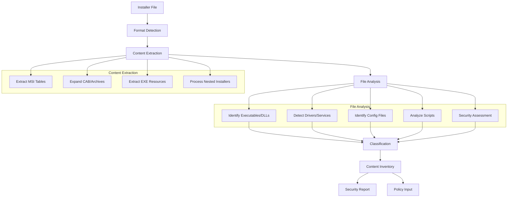

# Story 2.5: Installer Content Inventory

**Status:** Draft

## Non-Technical Explanation

This story is about creating a detailed inventory of everything inside an installer package. Think of it like unpacking a moving box and creating a list of all items inside, so you know exactly what you're dealing with. The system will look inside installers to identify all files, components, and resources that will be deployed to users' computers.

For packaging engineers, this provides crucial visibility into what an application will actually install, helping them identify potential security concerns, compatibility issues, or problematic components before deployment. It's similar to reading the ingredient list on food packaging so you know exactly what you're consuming.

## Why This Matters

Creating an inventory of installer contents is essential for several reasons:

1. **Security Assessment**: Identifying potentially risky components (drivers, services, system modifications) that require additional scrutiny.

2. **Compatibility Validation**: Discovering components that might conflict with other applications or system configurations.

3. **Documentation Requirements**: Providing accurate details about what an application installs for compliance and documentation purposes.

4. **Troubleshooting Preparation**: Understanding all components helps packaging engineers anticipate and prepare for potential deployment issues.

5. **Policy Creation**: Accurately identifying executables and DLLs is crucial for creating proper Windows Defender Application Control policies.

This capability transforms application packaging from a "black box" process to a transparent one, where engineers have complete visibility into what they're deploying to their organization's environment.

## Goal & Context

**User Story:** As a packaging engineer, I need the system to create an inventory of installer contents to understand what will be deployed.

**Context:** Building upon the previous installer analysis capabilities (Stories 2.1-2.4), this story adds the ability to extract and analyze the actual contents of installer packages. This provides deeper insight into what will be deployed, enabling better security assessment and policy creation.

## Detailed Requirements

- Implement extraction and analysis of embedded files
- Create identification of key executable files
- Develop detection of drivers and system components
- Implement identification of potential security concerns
- Create content classification and tagging
- Document inventory capabilities and limitations

## Acceptance Criteria (ACs)

- AC1: System creates accurate inventory for 90%+ of installers
- AC2: Key executable files are properly identified
- AC3: Drivers and system components are flagged appropriately
- AC4: Potential security concerns are identified when present
- AC5: Content is properly classified and tagged for reference

## Technical Implementation Context

**Guidance:** Use the following details for implementation. Refer to the linked `docs/` files for broader context if needed.

- **Relevant Files:**

  - Files to Create: 
    - `backend/apas/agents/installer/content_inventory.py` - Main content inventory module
    - `backend/apas/agents/installer/content_analyzer.py` - Content analysis functionality
    - `backend/apas/agents/installer/extractors/` - Format-specific extractors
    - `backend/apas/models/content.py` - Content inventory models
    - `backend/apas/agents/installer/security/threat_detector.py` - Security threat detection
    - `docs/developer-guide/content-inventory.md` - Documentation
  - Files to Modify:
    - `backend/apas/agents/installer/agent.py` - Add content inventory integration
    - `backend/apas/core/knowledge/repository.py` - Add content patterns
  - _(Hint: See `docs/architecture/project-structure.md` for overall layout)_

- **Key Technologies:**

  - Python for extraction and analysis
  - Binary analysis tools (pyelftools, pefile)
  - Archive handling libraries (zipfile, py7zr, pyunpack)
  - MSI parsing libraries
  - Pattern matching algorithms
  - _(Hint: See `docs/architecture/tech-stack.md` for technology details)_

- **API Interactions / SDK Usage:**

  - File system operations for extraction
  - Binary analysis libraries
  - Archive manipulation libraries
  - Knowledge base APIs for pattern matching
  - Integration with previous analysis results
  - _(Hint: See `docs/architecture/api-reference.md` for API patterns)_

- **Data Structures:**

  - `InstallerContent` model for overall inventory
  - `ContentItem` model for individual files/components
  - `ContentType` enum (executable, library, driver, resource, etc.)
  - `SecurityFlag` enum for potential security concerns
  - `ContentInventoryResult` to hold complete analysis
  - _(Hint: See `docs/architecture/data-models.md` for structure details)_

- **Environment Variables:**

  - `EXTRACTION_TEMP_DIR` - Directory for temporary file extraction
  - `MAX_EXTRACTION_SIZE` - Maximum size limit for extraction
  - `DEEP_ANALYSIS_ENABLED` - Enable/disable resource-intensive analysis
  - _(Hint: See `docs/architecture/environment-vars.md` for details)_

- **Coding Standards Notes:**
  - Implement safe extraction practices to prevent path traversal
  - Handle large files efficiently with streaming where possible
  - Implement proper cleanup of temporary files
  - Create detailed logging of extraction and analysis process
  - Use consistent file path handling across platforms
  - _(Hint: See `docs/architecture/coding-standards.md` for full standards)_

## Visual Design Reference

The content inventory process follows this workflow:



## Tasks / Subtasks

- [ ] Design content inventory architecture
  - [ ] Define content models and enums
  - [ ] Create extraction workflow
  - [ ] Design analysis pipeline
  - [ ] Define security assessment criteria
  - [ ] Create classification taxonomy
- [ ] Implement format-specific extractors
  - [ ] Create MSI content extractor
  - [ ] Implement EXE resource extractor
  - [ ] Develop archive extractors (ZIP, CAB, 7z)
  - [ ] Create nested installer handler
  - [ ] Implement extraction cleanup and safety
- [ ] Implement content analysis
  - [ ] Create executable/DLL analyzer
  - [ ] Implement driver/service detector
  - [ ] Develop script analyzer
  - [ ] Create configuration file parser
  - [ ] Implement resource file analyzer
- [ ] Implement security assessment
  - [ ] Create threat detection rules
  - [ ] Implement unsigned driver detection
  - [ ] Develop privilege escalation detector
  - [ ] Create network capability analyzer
  - [ ] Implement security scoring
- [ ] Implement content classification
  - [ ] Create file type classifier
  - [ ] Implement component categorization
  - [ ] Develop tagging system
  - [ ] Create classification refinement
  - [ ] Implement confidence scoring
- [ ] Create content inventory reporting
  - [ ] Implement hierarchical content view
  - [ ] Create security summary
  - [ ] Develop component relationships
  - [ ] Implement filtering and search
  - [ ] Create export capabilities
- [ ] Implement integration with other components
  - [ ] Connect with installer analysis results
  - [ ] Integrate with WDAC policy generation
  - [ ] Connect with knowledge repository
  - [ ] Implement feedback mechanism
- [ ] Create test suite and documentation
  - [ ] Develop test cases with known installers
  - [ ] Create reference inventory validation
  - [ ] Implement extraction tests
  - [ ] Develop comprehensive user documentation

## Manual Testing Guide (For Non-Technical Users)

You can verify the installer content inventory is working correctly through these checks:

1. **Basic Extraction Test**:
   - Provide a simple MSI or EXE installer
   - Verify that the system extracts and lists files
   - Check that the file count and sizes match expectations
   - Confirm that directory structure is preserved

2. **Component Identification Test**:
   - Provide an installer with known executables, drivers, and services
   - Verify that the system correctly identifies these components
   - Check that the components are properly categorized
   - Confirm that relationships between components are identified

3. **Security Assessment Test**:
   - Provide installers with known security concerns (unsigned drivers, etc.)
   - Verify that the system flags these components
   - Check that the security assessment provides useful information
   - Confirm that security findings are prioritized by severity

4. **Expected Results**:
   - Content inventory should complete within a reasonable time (varies by installer size)
   - The inventory should include file paths, sizes, and types
   - Important components should be highlighted and categorized
   - Security concerns should be clearly flagged
   - The inventory should be organized in an easily navigable structure

## Testing Requirements

**Guidance:** Verify implementation against the ACs using the following tests.

- **Unit Tests:** 
  - Test individual extractors with sample files
  - Verify content analyzers with known file types
  - Test security assessment with control samples
  - Validate classification logic
  - Test content model operations

- **Integration Tests:** 
  - Test end-to-end extraction and analysis with sample installers
  - Verify integration with previous analysis results
  - Test extraction of nested installers
  - Validate security assessment pipeline
  - Test with various installer formats

- **Manual Verification:** 
  - Test with real-world installers of varying complexity
  - Verify extraction completeness against known contents
  - Check component identification accuracy
  - Validate security concern detection
  - Test with large installers to verify performance

## Implementation Example

Here's an example implementation of the content inventory system:

```python
from enum import Enum, auto
from typing import Dict, Any, Optional, List, Set, Tuple
from pathlib import Path
import logging
import json
import tempfile
import shutil
import os
import zipfile
from dataclasses import dataclass, field
import time

class ContentType(Enum):
    """Types of content items."""
    EXECUTABLE = auto()      # EXE files
    LIBRARY = auto()         # DLL files
    DRIVER = auto()          # SYS files
    SERVICE = auto()         # Service components
    SCRIPT = auto()          # Script files (PS1, BAT, VBS, etc.)
    CONFIGURATION = auto()   # Configuration files
    RESOURCE = auto()        # Resource files (images, etc.)
    DATA = auto()            # Data files
    CERTIFICATE = auto()     # Certificate files
    UNKNOWN = auto()         # Unknown file types

class SecurityFlag(Enum):
    """Security concerns for content items."""
    UNSIGNED_EXECUTABLE = auto()    # Unsigned executable
    UNSIGNED_DRIVER = auto()        # Unsigned driver
    ELEVATED_PRIVILEGES = auto()    # Requires elevated privileges
    NETWORK_ACCESS = auto()         # Has network capabilities
    REGISTRY_MODIFICATION = auto()  # Modifies sensitive registry keys
    SYSTEM_MODIFICATION = auto()    # Modifies system files
    AUTORUN = auto()                # Auto-starts with system
    SENSITIVE_DATA_ACCESS = auto()  # Accesses sensitive data
    POTENTIAL_VULNERABILITY = auto() # Known vulnerability pattern
    OTHER_CONCERN = auto()          # Other security concern

@dataclass
class ContentItem:
    """Represents a single content item from an installer."""
    path: str
    name: str
    size: int
    content_type: ContentType
    parent_path: Optional[str] = None
    hash_md5: Optional[str] = None
    hash_sha256: Optional[str] = None
    description: str = ""
    security_flags: List[SecurityFlag] = field(default_factory=list)
    is_signed: bool = False
    signature_info: Optional[Dict[str, Any]] = None
    metadata: Dict[str, Any] = field(default_factory=dict)
    confidence: float = 1.0
    
    def is_executable(self) -> bool:
        """Check if the item is an executable type."""
        return self.content_type in (ContentType.EXECUTABLE, ContentType.LIBRARY, ContentType.DRIVER)
    
    def has_security_concerns(self) -> bool:
        """Check if the item has any security flags."""
        return len(self.security_flags) > 0
    
    def __str__(self) -> str:
        """Return a string representation of the content item."""
        return f"{self.name} ({self.content_type.name}): {self.size} bytes"

@dataclass
class ContentInventoryResult:
    """Results of content inventory analysis."""
    items: List[ContentItem] = field(default_factory=list)
    extraction_paths: List[str] = field(default_factory=list)
    total_files: int = 0
    total_size: int = 0
    security_concerns: List[Tuple[ContentItem, SecurityFlag]] = field(default_factory=list)
    analysis_time: float = 0.0
    
    def add_item(self, item: ContentItem) -> None:
        """Add a content item to the inventory."""
        self.items.append(item)
        self.total_files += 1
        self.total_size += item.size
        
        # Track security concerns for easy access
        for flag in item.security_flags:
            self.security_concerns.append((item, flag))
    
    def get_by_type(self, content_type: ContentType) -> List[ContentItem]:
        """Get items of a specific content type."""
        return [item for item in self.items if item.content_type == content_type]
    
    def get_executables(self) -> List[ContentItem]:
        """Get all executable items (EXE, DLL, SYS)."""
        return [item for item in self.items if item.is_executable()]
    
    def get_security_concerns(self) -> List[Tuple[ContentItem, SecurityFlag]]:
        """Get all items with security concerns."""
        return self.security_concerns
    
    def get_item_by_path(self, path: str) -> Optional[ContentItem]:
        """Get an item by its path."""
        for item in self.items:
            if item.path == path:
                return item
        return None
    
    def __str__(self) -> str:
        """Return a string representation of the inventory."""
        return f"Content Inventory: {self.total_files} files, {self.total_size} bytes"

class ContentInventory:
    """Creates an inventory of installer contents."""
    
    def __init__(self, extraction_dir: Optional[str] = None):
        self.logger = logging.getLogger(__name__)
        self.extraction_dir = extraction_dir or tempfile.mkdtemp(prefix="apas_content_")
        os.makedirs(self.extraction_dir, exist_ok=True)
        
    def __del__(self):
        """Clean up temporary extraction directory."""
        try:
            if os.path.exists(self.extraction_dir):
                shutil.rmtree(self.extraction_dir)
        except Exception as e:
            # Just log the error, don't raise
            logging.error(f"Error cleaning up extraction directory: {str(e)}")
    
    def analyze(self, file_path: Path, installer_type: str) -> ContentInventoryResult:
        """
        Analyze an installer to create a content inventory.
        
        Args:
            file_path: Path to the installer file
            installer_type: Type of installer (MSI, EXE, etc.)
            
        Returns:
            ContentInventoryResult: The analysis results
        """
        self.logger.info(f"Starting content inventory for: {file_path}")
        start_time = time.time()
        
        # Create result object
        result = ContentInventoryResult()
        
        try:
            # Extract content based on installer type
            extraction_path = self._extract_content(file_path, installer_type)
            result.extraction_paths.append(extraction_path)
            
            # Analyze extracted content
            self._analyze_directory(extraction_path, result)
            
            # Perform security assessment
            self._assess_security(result)
            
            # Complete the analysis
            result.analysis_time = time.time() - start_time
            self.logger.info(f"Completed content inventory with {result.total_files} files")
            return result
            
        except Exception as e:
            self.logger.error(f"Error in content inventory: {str(e)}")
            # Return a partial result if we have any items
            result.analysis_time = time.time() - start_time
            return result
    
    def _extract_content(self, file_path: Path, installer_type: str) -> str:
        """
        Extract content from an installer.
        
        Args:
            file_path: Path to the installer file
            installer_type: Type of installer
            
        Returns:
            str: Path to the extracted content
        """
        # Create a unique extraction directory
        extraction_dir = os.path.join(self.extraction_dir, f"{file_path.stem}_{int(time.time())}")
        os.makedirs(extraction_dir, exist_ok=True)
        
        self.logger.info(f"Extracting {installer_type} installer to {extraction_dir}")
        
        # Extract based on installer type
        if installer_type == "MSI":
            # MSI extraction logic would go here
            # This is a simplified example
            self.logger.info("MSI extraction would happen here")
            
        elif installer_type == "EXE":
            # EXE extraction logic would go here
            # This is a simplified example
            self.logger.info("EXE extraction would happen here")
            
        elif installer_type == "ZIP":
            # Extract ZIP file
            with zipfile.ZipFile(file_path, 'r') as zip_ref:
                zip_ref.extractall(extraction_dir)
                
        else:
            self.logger.warning(f"Unknown installer type: {installer_type}")
            
        return extraction_dir
    
    def _analyze_directory(self, directory: str, result: ContentInventoryResult, parent_path: Optional[str] = None) -> None:
        """
        Recursively analyze a directory and add items to the inventory.
        
        Args:
            directory: Directory to analyze
            result: Inventory result to update
            parent_path: Parent path for relative references
        """
        for root, dirs, files in os.walk(directory):
            for file in files:
                file_path = os.path.join(root, file)
                rel_path = os.path.relpath(file_path, directory)
                
                try:
                    # Get file info
                    stat_info = os.stat(file_path)
                    file_size = stat_info.st_size
                    
                    # Determine content type
                    content_type = self._determine_content_type(file_path)
                    
                    # Create content item
                    item = ContentItem(
                        path=rel_path,
                        name=file,
                        size=file_size,
                        content_type=content_type,
                        parent_path=parent_path
                    )
                    
                    # Add security flags if applicable
                    if content_type == ContentType.EXECUTABLE and not self._is_signed(file_path):
                        item.security_flags.append(SecurityFlag.UNSIGNED_EXECUTABLE)
                    
                    if content_type == ContentType.DRIVER and not self._is_signed(file_path):
                        item.security_flags.append(SecurityFlag.UNSIGNED_DRIVER)
                    
                    # Add item to inventory
                    result.add_item(item)
                    
                except Exception as e:
                    self.logger.error(f"Error analyzing file {file_path}: {str(e)}")
    
    def _determine_content_type(self, file_path: str) -> ContentType:
        """
        Determine the content type of a file.
        
        Args:
            file_path: Path to the file
            
        Returns:
            ContentType: The determined content type
        """
        # Simple content type determination based on extension
        # A real implementation would use more sophisticated analysis
        ext = os.path.splitext(file_path)[1].lower()
        
        if ext == '.exe':
            return ContentType.EXECUTABLE
        elif ext == '.dll':
            return ContentType.LIBRARY
        elif ext == '.sys':
            return ContentType.DRIVER
        elif ext in ('.ps1', '.bat', '.cmd', '.vbs', '.js'):
            return ContentType.SCRIPT
        elif ext in ('.ini', '.xml', '.json', '.config'):
            return ContentType.CONFIGURATION
        elif ext in ('.png', '.jpg', '.ico', '.bmp', '.gif'):
            return ContentType.RESOURCE
        elif ext in ('.cer', '.crt', '.pfx'):
            return ContentType.CERTIFICATE
        else:
            return ContentType.DATA
    
    def _is_signed(self, file_path: str) -> bool:
        """
        Check if a file is digitally signed.
        
        Args:
            file_path: Path to the file
            
        Returns:
            bool: True if the file is signed, False otherwise
        """
        # This is a placeholder - a real implementation would use
        # platform-specific tools to verify digital signatures
        return False
    
    def _assess_security(self, result: ContentInventoryResult) -> None:
        """
        Perform a security assessment on the inventory.
        
        Args:
            result: The inventory result to assess
        """
        self.logger.info("Performing security assessment")
        
        # Check for drivers
        drivers = result.get_by_type(ContentType.DRIVER)
        self.logger.info(f"Found {len(drivers)} drivers")
        
        # Check for unsigned executables
        unsigned_exes = [item for item in result.get_executables() 
                        if not item.is_signed]
        self.logger.info(f"Found {len(unsigned_exes)} unsigned executables")
        
        # Look for potentially risky scripts
        scripts = result.get_by_type(ContentType.SCRIPT)
        self.logger.info(f"Found {len(scripts)} scripts")
        
        # A real implementation would perform more sophisticated analysis
        # such as checking for known vulnerable components, scanning for
        # privilege escalation techniques, etc.
```

## Story Wrap Up (Agent Populates After Execution)

- **Agent Model Used:** 
- **Completion Notes:** 
- **Change Log:** 
  - Initial Draft