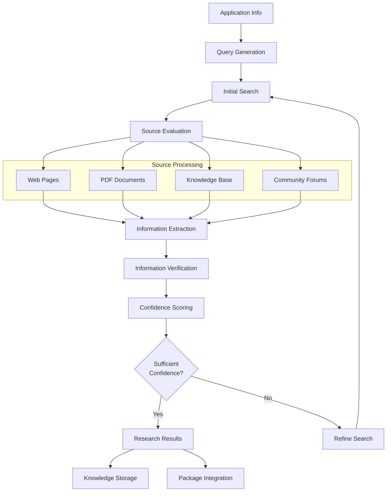

# Story 2.6: External Research Integration

**Status:** Draft

## Non-Technical Explanation

When installer packages don't provide enough information on their own, this feature allows the system to automatically research online to find the missing details. It's like having a research assistant who, when faced with unclear documentation, searches the web for better instructions or expert advice.

For example, if an installer doesn't specify silent installation parameters, the system can search vendor documentation, community forums, and deployment guides to find the recommended approach. This capability is especially valuable for complex or poorly documented applications, saving packaging engineers from spending hours manually searching for this information themselves.

Similar to how you might consult multiple online sources when troubleshooting a car problem that the manual doesn't adequately explain, this feature brings external knowledge into the packaging process to fill critical information gaps.

## Why This Matters

External research integration addresses one of the most time-consuming and frustrating aspects of application packaging:

1. **Missing Documentation**: Many software vendors provide inadequate or outdated installation documentation, leaving packaging engineers to hunt for critical details.

2. **Tribal Knowledge Capture**: Installation knowledge often exists in forums, blogs, and technical communities but isn't included in official documentation.

3. **Time Efficiency**: Manual research can take hours or even days for complex applications - automation dramatically reduces this time investment.

4. **Completeness**: Finding parameters and requirements not explicitly stated in the installer ensures more reliable deployments.

5. **Confidence Building**: Comparing information across multiple sources allows the system to build confidence in its recommendations.

This capability transforms the packaging process from isolated analysis to knowledge-enriched preparation, incorporating the collective wisdom of the IT community into each package.

## Goal & Context

**User Story:** As a packaging engineer, I need the system to automatically research applications online to find installation information not available in the installer.

**Context:** Building upon the installer analysis capabilities developed in previous stories (2.1-2.5), this story adds the ability to research external sources when the installer itself doesn't provide adequate information for successful packaging.

## Detailed Requirements

- Implement search capabilities for installation documentation
- Create identification of relevant information sources
- Develop extraction of installation parameters from documentation
- Implement verification of found information
- Create confidence scoring for external information
- Document research capabilities and limitations
- Integrate with knowledge base for information storage

## Acceptance Criteria (ACs)

- AC1: System successfully finds relevant documentation for 80%+ of applications
- AC2: Installation parameters are correctly extracted from documentation
- AC3: Information verification correctly identifies reliable sources
- AC4: Confidence scoring reflects information reliability
- AC5: Research results are properly stored for future reference

## Technical Implementation Context

**Guidance:** Use the following details for implementation. Refer to the linked `docs/` files for broader context if needed.

- **Relevant Files:**

  - Files to Create: 
    - `backend/apas/agents/installer/research/researcher.py` - Main research orchestration
    - `backend/apas/agents/installer/research/web_search.py` - Web search implementation
    - `backend/apas/agents/installer/research/document_extractor.py` - Extract data from docs
    - `backend/apas/agents/installer/research/source_evaluator.py` - Evaluate source reliability
    - `backend/apas/models/research.py` - Research models
    - `docs/developer-guide/external-research.md` - Documentation
  - Files to Modify:
    - `backend/apas/agents/installer/agent.py` - Add research integration
    - `backend/apas/core/knowledge/repository.py` - Add research storage
  - _(Hint: See `docs/architecture/project-structure.md` for overall layout)_

- **Key Technologies:**

  - Search API integration (e.g., SerpAPI, Google Custom Search)
  - Web scraping libraries (BeautifulSoup, Scrapy)
  - PDF parsing (PyPDF2, pdfplumber)
  - Text extraction (textract)
  - LangChain for information extraction
  - _(Hint: See `docs/architecture/tech-stack.md` for technology details)_

- **API Interactions / SDK Usage:**

  - Search APIs for initial source discovery
  - Web scraping with proper rate limiting
  - Document parsing libraries
  - LLM APIs for text extraction and summarization
  - Knowledge base APIs for storage and retrieval
  - _(Hint: See `docs/architecture/api-reference.md` for API patterns)_

- **Data Structures:**

  - `ResearchSession` model for coordinating research
  - `InformationSource` model for source representation
  - `ExtractedInformation` model for structured findings
  - `ConfidenceScore` model with reasoning
  - `ResearchResult` to aggregate findings
  - _(Hint: See `docs/architecture/data-models.md` for structure details)_

- **Environment Variables:**

  - `SEARCH_API_KEY` - API key for search service
  - `SEARCH_ENGINE_ID` - ID for custom search engine
  - `MAX_SEARCH_RESULTS` - Maximum search results to process
  - `RESEARCH_TIMEOUT` - Maximum research time
  - _(Hint: See `docs/architecture/environment-vars.md` for details)_

- **Coding Standards Notes:**
  - Implement proper rate limiting for external APIs
  - Follow robots.txt for all web scraping
  - Include clear attribution for all external sources
  - Create robust error handling for network issues
  - Implement caching to reduce API calls
  - _(Hint: See `docs/architecture/coding-standards.md` for full standards)_

## Visual Design Reference

The external research process follows this workflow:



## Tasks / Subtasks

- [ ] Design external research architecture
  - [ ] Define research workflow
  - [ ] Create information models
  - [ ] Design source evaluation criteria
  - [ ] Define confidence scoring method
  - [ ] Create integration points with installer analysis
- [ ] Implement query generation
  - [ ] Create application-specific query generator
  - [ ] Implement parameter-specific query formulation
  - [ ] Develop error-focused query generation
  - [ ] Create query refinement mechanism
  - [ ] Implement query logging for analysis
- [ ] Implement search capabilities
  - [ ] Create search API integration
  - [ ] Implement results filtering
  - [ ] Develop source categorization
  - [ ] Create search expansion for poor results
  - [ ] Implement caching for efficiency
- [ ] Implement source processing
  - [ ] Create web page processors
  - [ ] Implement PDF document extractors
  - [ ] Develop knowledge base connectors
  - [ ] Create forum data processors
  - [ ] Implement unified processing pipeline
- [ ] Implement information extraction
  - [ ] Create parameter pattern recognition
  - [ ] Implement command extraction
  - [ ] Develop prerequisite identification
  - [ ] Create troubleshooting extraction
  - [ ] Implement structured data processing
- [ ] Implement source verification
  - [ ] Create source reputation evaluator
  - [ ] Implement information cross-validation
  - [ ] Develop contradiction detection
  - [ ] Create timestamp/recency evaluation
  - [ ] Implement verification workflow
- [ ] Create confidence scoring
  - [ ] Implement source-based scoring
  - [ ] Create consistency-based scoring
  - [ ] Develop detail-level scoring
  - [ ] Implement overall confidence calculation
  - [ ] Create confidence explanation generation
- [ ] Implement knowledge integration
  - [ ] Create knowledge base storage
  - [ ] Implement search result caching
  - [ ] Develop application-specific storage
  - [ ] Create cross-application pattern recognition
  - [ ] Implement continuous improvement mechanism
- [ ] Create test suite and documentation
  - [ ] Develop test cases with known applications
  - [ ] Create mock search responses
  - [ ] Implement accuracy measurement
  - [ ] Develop comprehensive user documentation

## Manual Testing Guide (For Non-Technical Users)

You can verify the external research integration is working correctly through these checks:

1. **Basic Research Test**:
   - Select an application with incomplete installer information
   - Initiate the packaging process and observe the research activity
   - Verify that the system finds relevant documentation
   - Confirm that the found information is correctly integrated into the package

2. **Information Extraction Test**:
   - Choose an application with known installation parameters
   - Run the research process and review the extracted parameters
   - Compare the extracted parameters with known correct values
   - Verify that the confidence scores align with parameter accuracy

3. **Source Evaluation Test**:
   - Select an application with both official and community documentation
   - Observe how the system prioritizes and scores different sources
   - Verify that official documentation receives higher confidence scores
   - Confirm that the system correctly handles contradictory information

4. **Expected Results**:
   - Research process should complete within a reasonable time (typically under 5 minutes)
   - The system should identify relevant sources with proper attribution
   - Extracted information should be organized by category (parameters, prerequisites, etc.)
   - Confidence scores should accurately reflect the reliability of the information
   - Results should be stored for future use to avoid redundant research

## Testing Requirements

**Guidance:** Verify implementation against the ACs using the following tests.

- **Unit Tests:** 
  - Test query generation with various application inputs
  - Verify source evaluation with known reliable/unreliable sources
  - Test information extraction with sample documents
  - Validate confidence scoring algorithm
  - Test knowledge storage and retrieval

- **Integration Tests:** 
  - Test end-to-end research process with mock search responses
  - Verify integration with installer analysis
  - Test storage and retrieval from knowledge base
  - Validate refinement of searches based on initial results
  - Test handling of various document types

- **Manual Verification:** 
  - Test with real-world applications with varying documentation quality
  - Verify accuracy of extracted installation parameters
  - Check source evaluation with different types of sources
  - Validate confidence scoring against expert judgment
  - Test with applications in different languages

## Implementation Example

Here's an example implementation of the external research system:

```python
from enum import Enum
from typing import Dict, Any, Optional, List, Tuple, Set
from dataclasses import dataclass, field
import logging
import json
import re
import time
import requests
from bs4 import BeautifulSoup
from urllib.parse import urlparse
import hashlib

class SourceType(Enum):
    """Types of information sources."""
    VENDOR_DOCUMENTATION = 1
    VENDOR_KNOWLEDGE_BASE = 2
    COMMUNITY_FORUM = 3
    TECH_BLOG = 4
    GITHUB_REPOSITORY = 5
    PACKAGE_REPOSITORY = 6
    DEPLOYMENT_GUIDE = 7
    GENERAL_DOCUMENTATION = 8
    OTHER = 9

class InformationType(Enum):
    """Types of extracted information."""
    SILENT_PARAMETERS = 1
    PREREQUISITES = 2
    SYSTEM_REQUIREMENTS = 3
    CONFIGURATION_OPTIONS = 4
    TROUBLESHOOTING = 5
    DEPLOYMENT_GUIDE = 6
    OTHER = 7

@dataclass
class InformationSource:
    """Represents a source of information."""
    url: str
    title: str
    source_type: SourceType
    timestamp: Optional[str] = None
    description: Optional[str] = None
    reputation_score: float = 0.0
    content_hash: Optional[str] = None
    
    @property
    def domain(self) -> str:
        """Get the domain of the URL."""
        return urlparse(self.url).netloc
    
    def calculate_content_hash(self, content: str) -> str:
        """Calculate a hash of the content for change detection."""
        hash_obj = hashlib.md5(content.encode())
        self.content_hash = hash_obj.hexdigest()
        return self.content_hash
    
    def __str__(self) -> str:
        """Return a string representation of the source."""
        return f"{self.title} ({self.source_type.name}) - {self.url}"

@dataclass
class ExtractedInformation:
    """Information extracted from a source."""
    info_type: InformationType
    content: str
    source: InformationSource
    confidence: float
    context: Optional[str] = None
    extracted_by: str = "pattern_matching"  # or "llm", "manual", etc.
    
    def __str__(self) -> str:
        """Return a string representation of the extracted information."""
        return f"{self.info_type.name}: {self.content[:50]}... (Confidence: {self.confidence:.2f})"

@dataclass
class ResearchQuery:
    """A query for external research."""
    application_name: str
    version: Optional[str] = None
    publisher: Optional[str] = None
    specific_parameters: Optional[List[str]] = None
    context: Optional[str] = None
    
    def generate_search_queries(self) -> List[str]:
        """Generate search queries based on the application information."""
        queries = []
        
        # Basic query
        base_query = f"{self.application_name}"
        if self.version:
            base_query += f" {self.version}"
        
        # More specific queries
        queries.append(f"{base_query} silent install parameters")
        queries.append(f"{base_query} unattended installation")
        
        if self.publisher:
            queries.append(f"{self.publisher} {base_query} deployment guide")
        
        # Parameter-specific queries
        if self.specific_parameters:
            for param in self.specific_parameters:
                queries.append(f"{base_query} {param} parameter")
        
        return queries

@dataclass
class ResearchResult:
    """Results of external research."""
    query: ResearchQuery
    sources: List[InformationSource] = field(default_factory=list)
    information: List[ExtractedInformation] = field(default_factory=list)
    search_time: float = 0.0
    overall_confidence: float = 0.0
    
    def add_source(self, source: InformationSource) -> None:
        """Add a source to the results."""
        # Check for duplicates
        for existing in self.sources:
            if existing.url == source.url:
                return
        self.sources.append(source)
    
    def add_information(self, info: ExtractedInformation) -> None:
        """Add extracted information to the results."""
        self.information.append(info)
    
    def get_by_type(self, info_type: InformationType) -> List[ExtractedInformation]:
        """Get information of a specific type."""
        return [info for info in self.information if info.info_type == info_type]
    
    def calculate_overall_confidence(self) -> float:
        """Calculate the overall confidence of the research."""
        if not self.information:
            return 0.0
        
        # Weighted average by confidence and source reputation
        weighted_sum = sum(info.confidence * info.source.reputation_score 
                          for info in self.information)
        weight_sum = sum(info.source.reputation_score for info in self.information)
        
        self.overall_confidence = weighted_sum / weight_sum if weight_sum > 0 else 0.0
        return self.overall_confidence
    
    def get_silent_parameters(self) -> List[str]:
        """Get extracted silent parameters."""
        params = []
        for info in self.get_by_type(InformationType.SILENT_PARAMETERS):
            # Extract parameter strings from content
            # This is a simplified example
            params.append(info.content.strip())
        return params
    
    def get_prerequisites(self) -> List[str]:
        """Get extracted prerequisites."""
        prereqs = []
        for info in self.get_by_type(InformationType.PREREQUISITES):
            # Extract prerequisite information
            # This is a simplified example
            prereqs.append(info.content.strip())
        return prereqs
    
    def __str__(self) -> str:
        """Return a string representation of the research results."""
        result = [f"Research for {self.query.application_name}"]
        result.append(f"Sources: {len(self.sources)}")
        result.append(f"Information items: {len(self.information)}")
        result.append(f"Overall confidence: {self.overall_confidence:.2f}")
        return "\n".join(result)

class ExternalResearcher:
    """Performs external research to find installation information."""
    
    def __init__(self, search_api_key: str, search_engine_id: Optional[str] = None):
        self.logger = logging.getLogger(__name__)
        self.search_api_key = search_api_key
        self.search_engine_id = search_engine_id
        
    def research(self, 
                application_name: str, 
                version: Optional[str] = None,
                publisher: Optional[str] = None,
                specific_parameters: Optional[List[str]] = None) -> ResearchResult:
        """
        Research an application to find installation information.
        
        Args:
            application_name: Name of the application
            version: Version of the application
            publisher: Publisher of the application
            specific_parameters: Specific parameters to research
            
        Returns:
            ResearchResult: The research results
        """
        self.logger.info(f"Starting research for: {application_name} {version or ''}")
        start_time = time.time()
        
        # Create query
        query = ResearchQuery(
            application_name=application_name,
            version=version,
            publisher=publisher,
            specific_parameters=specific_parameters
        )
        
        # Create result object
        result = ResearchResult(query=query)
        
        try:
            # Generate search queries
            search_queries = query.generate_search_queries()
            
            # Perform searches
            for search_query in search_queries:
                self.logger.debug(f"Searching for: {search_query}")
                search_results = self._perform_search(search_query)
                
                # Process search results
                for search_result in search_results:
                    source = self._evaluate_source(search_result)
                    if source:
                        result.add_source(source)
                        
                        # Extract information from source
                        extracted_info = self._extract_information(source, query)
                        for info in extracted_info:
                            result.add_information(info)
            
            # Calculate final confidence
            result.calculate_overall_confidence()
            result.search_time = time.time() - start_time
            
            self.logger.info(f"Completed research with {len(result.sources)} sources and {len(result.information)} information items")
            return result
            
        except Exception as e:
            self.logger.error(f"Error in research: {str(e)}")
            # Return a partial result
            result.search_time = time.time() - start_time
            return result
    
    def _perform_search(self, query: str) -> List[Dict[str, Any]]:
        """
        Perform a search using the configured search API.
        
        Args:
            query: Search query
            
        Returns:
            List[Dict[str, Any]]: Search results
        """
        # This is a simplified placeholder - real implementation would use
        # a proper search API like SerpAPI or Google Custom Search
        self.logger.debug(f"Would search for: {query}")
        
        # Mock search results for demonstration
        return [
            {
                "title": f"Installation Guide for {query.split()[0]}",
                "url": f"https://example.com/docs/{query.split()[0].lower()}/install",
                "snippet": f"Official documentation for installing {query.split()[0]} silently in enterprise environments."
            },
            {
                "title": f"How to Deploy {query.split()[0]} - IT Admin Guide",
                "url": f"https://techadmin.example.org/deploy/{query.split()[0].lower()}",
                "snippet": f"Learn how to deploy {query.split()[0]} using silent installation parameters and automation tools."
            }
        ]
    
    def _evaluate_source(self, search_result: Dict[str, Any]) -> Optional[InformationSource]:
        """
        Evaluate a search result to determine its value as a source.
        
        Args:
            search_result: Search result to evaluate
            
        Returns:
            Optional[InformationSource]: Source if valuable, None otherwise
        """
        url = search_result.get("url", "")
        title = search_result.get("title", "")
        snippet = search_result.get("snippet", "")
        
        # Skip irrelevant or low-quality sources
        if not url or not title:
            return None
        
        # Determine source type
        domain = urlparse(url).netloc
        source_type = SourceType.OTHER
        
        # This is a simplified example - real implementation would have
        # more sophisticated source type detection
        if "docs." in domain or "/documentation/" in url:
            source_type = SourceType.VENDOR_DOCUMENTATION
        elif "forum." in domain or "community." in domain:
            source_type = SourceType.COMMUNITY_FORUM
        elif "github.com" in domain:
            source_type = SourceType.GITHUB_REPOSITORY
        elif "blog." in domain:
            source_type = SourceType.TECH_BLOG
        
        # Calculate reputation score
        reputation_score = self._calculate_reputation_score(url, domain, source_type)
        
        # Create source
        source = InformationSource(
            url=url,
            title=title,
            source_type=source_type,
            description=snippet,
            reputation_score=reputation_score
        )
        
        return source
    
    def _calculate_reputation_score(self, url: str, domain: str, source_type: SourceType) -> float:
        """
        Calculate a reputation score for a source.
        
        Args:
            url: URL of the source
            domain: Domain of the URL
            source_type: Type of source
            
        Returns:
            float: Reputation score between 0 and 1
        """
        # This is a simplified placeholder - real implementation would have
        # more sophisticated reputation scoring
        
        # Base score by source type
        base_scores = {
            SourceType.VENDOR_DOCUMENTATION: 0.9,
            SourceType.VENDOR_KNOWLEDGE_BASE: 0.85,
            SourceType.GITHUB_REPOSITORY: 0.8,
            SourceType.DEPLOYMENT_GUIDE: 0.75,
            SourceType.TECH_BLOG: 0.7,
            SourceType.COMMUNITY_FORUM: 0.6,
            SourceType.PACKAGE_REPOSITORY: 0.75,
            SourceType.GENERAL_DOCUMENTATION: 0.65,
            SourceType.OTHER: 0.5
        }
        
        score = base_scores.get(source_type, 0.5)
        
        # Adjust for specific domains
        if "microsoft.com" in domain or "apple.com" in domain or "adobe.com" in domain:
            score += 0.1
        elif "stackoverflow.com" in domain:
            score += 0.05
        
        # Cap between 0 and 1
        return max(0.0, min(1.0, score))
    
    def _extract_information(self, source: InformationSource, query: ResearchQuery) -> List[ExtractedInformation]:
        """
        Extract relevant information from a source.
        
        Args:
            source: Source to extract information from
            query: Original research query
            
        Returns:
            List[ExtractedInformation]: Extracted information
        """
        # This is a simplified placeholder - real implementation would
        # fetch and parse the actual content from the URL
        
        # Mock extraction results based on source type
        results = []
        
        if source.source_type == SourceType.VENDOR_DOCUMENTATION:
            # Extract silent parameters
            results.append(
                ExtractedInformation(
                    info_type=InformationType.SILENT_PARAMETERS,
                    content=f"/quiet /norestart ALLUSERS=1",
                    source=source,
                    confidence=0.9,
                    context="Found in official documentation installation guide"
                )
            )
            
            # Extract prerequisites
            results.append(
                ExtractedInformation(
                    info_type=InformationType.PREREQUISITES,
                    content=".NET Framework 4.7.2 or higher is required",
                    source=source,
                    confidence=0.85,
                    context="Listed in system requirements section"
                )
            )
            
        elif source.source_type == SourceType.COMMUNITY_FORUM:
            # Extract troubleshooting info
            results.append(
                ExtractedInformation(
                    info_type=InformationType.TROUBLESHOOTING,
                    content="If installation fails with error 1603, delete the temporary folder and try again",
                    source=source,
                    confidence=0.7,
                    context="Mentioned in community discussion thread"
                )
            )
            
            # Extract parameters with lower confidence
            results.append(
                ExtractedInformation(
                    info_type=InformationType.SILENT_PARAMETERS,
                    content="/S /v/qn",
                    source=source,
                    confidence=0.6,
                    context="Suggested by forum user with many upvotes"
                )
            )
        
        # In a real implementation, this would involve:
        # 1. Fetching the content from the URL
        # 2. Parsing the content (HTML, PDF, etc.)
        # 3. Extracting relevant sections
        # 4. Using pattern matching or LLM to identify specific information
        # 5. Assigning confidence scores based on context and source
        
        return results

# Usage example
if __name__ == "__main__":
    # Configure logging
    logging.basicConfig(level=logging.INFO)
    
    # Create researcher
    researcher = ExternalResearcher(search_api_key="dummy_key")
    
    # Research an application
    result = researcher.research(
        application_name="Adobe Acrobat Reader",
        version="DC 2023",
        publisher="Adobe"
    )
    
    # Print results
    print(result)
    print("\nSilent Parameters:")
    for param in result.get_silent_parameters():
        print(f"- {param}")
    
    print("\nPrerequisites:")
    for prereq in result.get_prerequisites():
        print(f"- {prereq}")
```

## Story Wrap Up (Agent Populates After Execution)

- **Agent Model Used:** 
- **Completion Notes:** 
- **Change Log:** 
  - Initial Draft