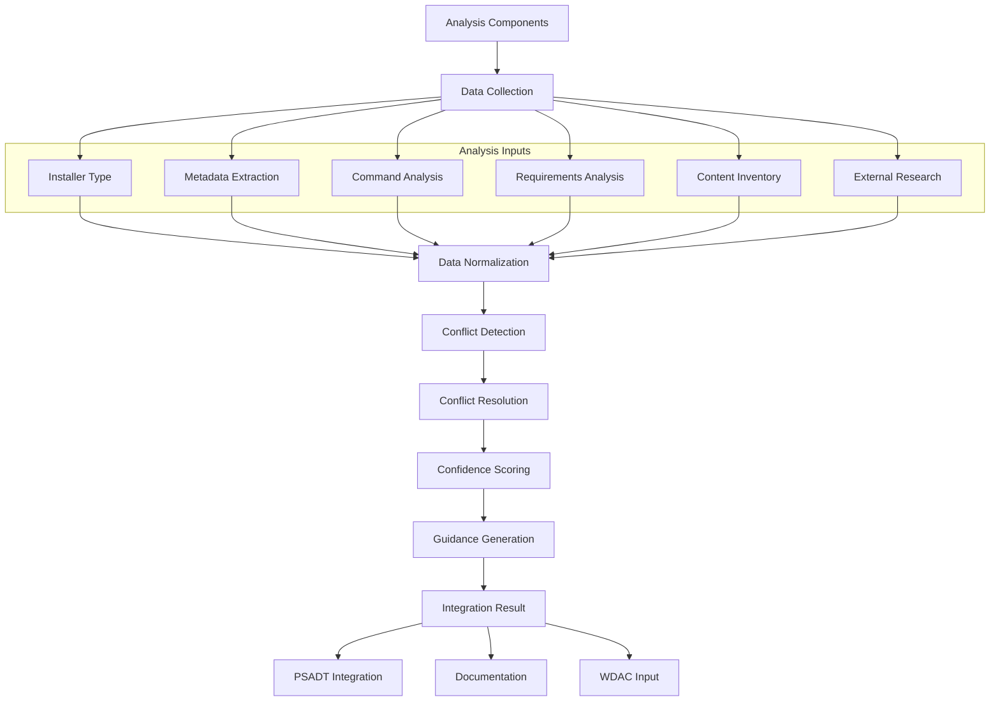

# Story 2.7: Analysis Results Integration

**Status:** Draft

## Non-Technical Explanation

This story is about bringing together all the different pieces of information we've gathered about an installer into one coherent set of instructions. Think of it like a chef combining ingredients from different sources into a single, delicious recipe.

Throughout the previous stories, we've developed components that analyze different aspects of installers - detecting file types, extracting metadata, determining installation commands, identifying requirements, creating content inventories, and researching external information. Now we need a way to combine all of these potentially overlapping (and sometimes contradictory) pieces of information into a clear, unified set of instructions that packaging engineers can trust.

Similar to how a detective takes evidence from multiple witnesses to construct a complete picture of what happened, this feature synthesizes information from different analysis components to create a comprehensive, coherent understanding of how to properly package an application.

## Why This Matters

Integration of analysis results is crucial for several reasons:

1. **Conflicting Information**: Different analysis methods may produce contradictory findings (e.g., different silent installation parameters) that need to be resolved.

2. **Incomplete Information**: Each analysis component may only identify part of the puzzle, requiring integration to create a complete picture.

3. **Confidence Assessment**: Not all findings are equally reliable, requiring a system to weight information based on confidence levels.

4. **Actionable Insights**: Engineers need clear, actionable guidance rather than disconnected data points from different analyses.

5. **Efficiency**: Without integration, engineers would need to manually reconcile information from different sources, defeating the purpose of automation.

This story represents the culmination of all previous analysis capabilities, transforming individual findings into a unified packaging solution that engineers can confidently implement.

## Goal & Context

**User Story:** As a packaging engineer, I need the system to combine and prioritize all analysis results to provide clear installation guidance.

**Context:** This story builds on all previous installer analysis capabilities (Stories 2.1-2.6) to create a consolidated, prioritized set of packaging instructions. It resolves conflicts between different sources of information and provides a confidence-weighted final recommendation.

## Detailed Requirements

- Implement consolidation of metadata from multiple sources
- Create prioritization of conflicting information
- Develop confidence scoring for final recommendations
- Implement generation of installation guidance
- Create integration with PowerShell AppDeploy Toolkit automation
- Document integration methodology and decision process

## Acceptance Criteria (ACs)

- AC1: System successfully consolidates information from all analysis components
- AC2: Conflicts are resolved with appropriate prioritization
- AC3: Confidence scores accurately reflect recommendation reliability
- AC4: Installation guidance is clear and actionable
- AC5: Integration with PSADT automation works correctly

## Technical Implementation Context

**Guidance:** Use the following details for implementation. Refer to the linked `docs/` files for broader context if needed.

- **Relevant Files:**

  - Files to Create: 
    - `backend/apas/agents/installer/integration/integrator.py` - Main integration module
    - `backend/apas/agents/installer/integration/conflict_resolver.py` - Conflict resolution
    - `backend/apas/agents/installer/integration/confidence_calculator.py` - Confidence scoring
    - `backend/apas/agents/installer/integration/guidance_generator.py` - Guidance generator
    - `backend/apas/models/integration.py` - Integration models
    - `docs/developer-guide/analysis-integration.md` - Documentation
  - Files to Modify:
    - `backend/apas/agents/installer/agent.py` - Add integration logic
    - `backend/apas/agents/psadt/agent.py` - Add integration with PSADT
  - _(Hint: See `docs/architecture/project-structure.md` for overall layout)_

- **Key Technologies:**

  - Python for integration logic
  - LangChain for conflict resolution
  - Graph-based dependency modeling
  - Rule-based prioritization engine
  - Template-based guidance generation
  - _(Hint: See `docs/architecture/tech-stack.md` for technology details)_

- **API Interactions / SDK Usage:**

  - Internal communication with previous analysis components
  - Event-driven updates on analysis findings
  - PSADT integration API
  - Knowledge base API for pattern retrieval
  - _(Hint: See `docs/architecture/api-reference.md` for API patterns)_

- **Data Structures:**

  - `IntegrationResult` model for consolidated findings
  - `InformationSource` enum for tracking origin of data
  - `ConflictResolution` model for documenting conflict resolutions
  - `PackagingGuidance` model for structured guidance
  - `ConfidenceScore` model with multi-factor analysis
  - _(Hint: See `docs/architecture/data-models.md` for structure details)_

- **Environment Variables:**

  - `DEFAULT_CONFIDENCE_THRESHOLD` - Minimum confidence for recommendations
  - `ENABLE_AI_CONFLICT_RESOLUTION` - Toggle for AI-based conflict resolution
  - `PRIORITIZATION_RULES_PATH` - Path to prioritization rules configuration
  - _(Hint: See `docs/architecture/environment-vars.md` for details)_

- **Coding Standards Notes:**
  - Implement clear logging of all integration decisions
  - Create traceable lineage for all conclusions
  - Ensure deterministic behavior in conflict resolution
  - Provide detailed explanation for prioritization decisions
  - Follow functional programming patterns for transformation pipeline
  - _(Hint: See `docs/architecture/coding-standards.md` for full standards)_

## Visual Design Reference

The integration process follows this workflow:



## Tasks / Subtasks

- [ ] Design integration architecture
  - [ ] Define integration models
  - [ ] Create workflow for data collection
  - [ ] Design conflict resolution approach
  - [ ] Define confidence scoring methodology
  - [ ] Create guidance generation structure
- [ ] Implement data collection and normalization
  - [ ] Create collectors for each analysis component
  - [ ] Implement data transformation to common format
  - [ ] Develop property mapping between sources
  - [ ] Create source attribution tracking
  - [ ] Implement validation of collected data
- [ ] Implement conflict detection
  - [ ] Create property comparison logic
  - [ ] Implement conflict identification
  - [ ] Develop conflict categorization
  - [ ] Create conflict severity assessment
  - [ ] Implement conflict reporting
- [ ] Implement conflict resolution
  - [ ] Create source prioritization rules
  - [ ] Implement confidence-based resolution
  - [ ] Develop AI-assisted resolution for complex conflicts
  - [ ] Create manual intervention flagging
  - [ ] Implement resolution logging and explanation
- [ ] Implement confidence scoring
  - [ ] Create source-based confidence factors
  - [ ] Implement consistency-based confidence
  - [ ] Develop corroboration scoring
  - [ ] Create overall confidence calculation
  - [ ] Implement confidence explanation
- [ ] Create guidance generation
  - [ ] Implement structured guidance model
  - [ ] Create packager instruction generation
  - [ ] Develop requirements documentation
  - [ ] Create command parameter explanation
  - [ ] Implement troubleshooting guidance
- [ ] Implement PSADT integration
  - [ ] Create PSADT parameter mapping
  - [ ] Implement configuration generation
  - [ ] Develop command sequence generation
  - [ ] Create pre/post installation tasks
  - [ ] Implement validation rules
- [ ] Create test suite and documentation
  - [ ] Develop test cases with known conflicts
  - [ ] Create validation of resolution logic
  - [ ] Implement confidence scoring tests
  - [ ] Develop comprehensive user documentation

## Manual Testing Guide (For Non-Technical Users)

You can verify the analysis results integration is working correctly through these checks:

1. **Consolidation Test**:
   - Upload an installer with information available from multiple sources
   - Verify that the system collects data from all analysis components
   - Check that the consolidated view includes all relevant information
   - Confirm that the source of each piece of information is tracked

2. **Conflict Resolution Test**:
   - Upload an installer with known conflicting information (e.g., different silent parameters from different sources)
   - Observe how the system identifies and resolves the conflicts
   - Verify that the resolution follows expected prioritization rules
   - Check that the explanation for each resolution is clear

3. **Guidance Generation Test**:
   - Upload an installer and proceed through the complete analysis
   - Review the generated guidance for packaging the application
   - Verify that the guidance is clear, complete, and actionable
   - Confirm that confidence levels are indicated for key recommendations

4. **Expected Results**:
   - Integration should produce a complete set of packaging instructions
   - Conflicts should be resolved with clear explanations
   - Confidence levels should accurately reflect the reliability of information
   - All information should include attribution to its source
   - The guidance should be immediately applicable for packaging

## Testing Requirements

**Guidance:** Verify implementation against the ACs using the following tests.

- **Unit Tests:** 
  - Test data collection from each analysis component
  - Verify conflict detection with controlled inputs
  - Test resolution logic with various conflict scenarios
  - Validate confidence scoring algorithm
  - Test guidance generation with different input combinations

- **Integration Tests:** 
  - Test end-to-end integration with all analysis components
  - Verify PSADT integration with different installer types
  - Test handling of complex conflicts across multiple properties
  - Validate guidance quality with reference installers
  - Test with various confidence thresholds

- **Manual Verification:** 
  - Test with real-world installers having conflicting information
  - Verify resolution decisions against expert judgment
  - Check guidance quality and actionability
  - Validate confidence assessments
  - Test with complex enterprise applications

## Implementation Example

Here's an example implementation of the analysis results integration system:

```python
from enum import Enum, auto
from typing import Dict, Any, Optional, List, Set, Tuple, Union
from dataclasses import dataclass, field
import logging
import json
import time
from collections import defaultdict

# Import result types from other analysis components
from apas.agents.installer.detector import DetectionResult
from apas.agents.installer.metadata import InstallerMetadata, MetadataSource
from apas.agents.installer.commands import InstallationCommand, CommandSource
from apas.agents.installer.ai_analysis import RequirementsAnalysisResult
from apas.agents.installer.content_inventory import ContentInventoryResult
from apas.agents.installer.research import ResearchResult, InformationType

class InformationSource(Enum):
    """Sources of information for integration."""
    INSTALLER_DETECTION = auto()    # From installer type detection
    METADATA_EXTRACTION = auto()    # From metadata extraction
    COMMAND_ANALYSIS = auto()       # From command analysis
    AI_REQUIREMENTS = auto()        # From AI requirements analysis
    CONTENT_INVENTORY = auto()      # From content inventory
    EXTERNAL_RESEARCH = auto()      # From external research
    MANUAL_INPUT = auto()           # From manual user input
    KNOWLEDGE_BASE = auto()         # From knowledge base
    
    def get_base_priority(self) -> int:
        """Get the base priority of this source for conflict resolution."""
        # Higher number = higher priority
        priorities = {
            InformationSource.MANUAL_INPUT: 100,      # User input always wins
            InformationSource.METADATA_EXTRACTION: 80, # Explicit metadata is highly reliable
            InformationSource.COMMAND_ANALYSIS: 70,    # Direct command analysis is reliable
            InformationSource.KNOWLEDGE_BASE: 60,      # Knowledge base has verified patterns
            InformationSource.EXTERNAL_RESEARCH: 50,   # External research can be reliable
            InformationSource.CONTENT_INVENTORY: 40,   # Content evidence is moderate
            InformationSource.AI_REQUIREMENTS: 30,     # AI inference is less certain
            InformationSource.INSTALLER_DETECTION: 20  # Basic detection is lowest priority
        }
        return priorities.get(self, 0)

class ConflictResolutionStrategy(Enum):
    """Strategies for resolving conflicts."""
    PRIORITY_BASED = auto()         # Use source priorities
    CONFIDENCE_BASED = auto()       # Use confidence scores
    RECENCY_BASED = auto()          # Use most recent information
    MAJORITY_BASED = auto()         # Use most common value
    COMBINED = auto()               # Combine values if possible
    AI_RESOLUTION = auto()          # Use AI to resolve conflict
    MANUAL_RESOLUTION = auto()      # Require manual resolution
    
class PropertyType(Enum):
    """Types of properties in the integration."""
    INSTALLER_TYPE = auto()         # Type of installer
    METADATA = auto()               # Installer metadata
    COMMAND = auto()                # Installation command
    REQUIREMENT = auto()            # Installation requirement
    CONTENT = auto()                # Installer content
    PARAMETER = auto()              # Command parameter
    OTHER = auto()                  # Other property

@dataclass
class SourcedValue:
    """A value with source information."""
    value: Any
    source: InformationSource
    confidence: float
    timestamp: float = field(default_factory=time.time)
    context: Optional[str] = None
    
    def __str__(self) -> str:
        """Return a string representation of the sourced value."""
        return f"{self.value} (from {self.source.name}, confidence: {self.confidence:.2f})"

@dataclass
class ConflictResolution:
    """Record of a conflict resolution."""
    property_name: str
    property_type: PropertyType
    conflicting_values: List[SourcedValue]
    selected_value: SourcedValue
    strategy: ConflictResolutionStrategy
    explanation: str
    
    def __str__(self) -> str:
        """Return a string representation of the conflict resolution."""
        return f"Conflict for {self.property_name} resolved using {self.strategy.name}: {self.selected_value.value}"

@dataclass
class IntegrationResult:
    """Results of integration across all analysis components."""
    # Core properties
    installer_type: Optional[SourcedValue] = None
    installer_framework: Optional[SourcedValue] = None
    product_name: Optional[SourcedValue] = None
    product_version: Optional[SourcedValue] = None
    publisher: Optional[SourcedValue] = None
    
    # Installation commands
    silent_install_command: Optional[SourcedValue] = None
    uninstall_command: Optional[SourcedValue] = None
    command_parameters: Dict[str, SourcedValue] = field(default_factory=dict)
    
    # Requirements
    prerequisites: Dict[str, SourcedValue] = field(default_factory=dict)
    system_requirements: Dict[str, SourcedValue] = field(default_factory=dict)
    
    # Content information
    executable_files: Dict[str, SourcedValue] = field(default_factory=dict)
    critical_components: Dict[str, SourcedValue] = field(default_factory=dict)
    security_concerns: Dict[str, SourcedValue] = field(default_factory=dict)
    
    # Metadata
    conflicts_detected: int = 0
    conflicts_resolved: List[ConflictResolution] = field(default_factory=list)
    integration_time: float = 0.0
    overall_confidence: float = 0.0
    
    def get_conflict_count(self) -> int:
        """Get the number of conflicts detected during integration."""
        return self.conflicts_detected
    
    def get_prerequisites_list(self) -> List[Tuple[str, float]]:
        """Get a list of prerequisites with their confidence scores."""
        return [(name, value.confidence) for name, value in self.prerequisites.items()]
    
    def get_command_parameters_list(self) -> List[Tuple[str, Any, float]]:
        """Get a list of command parameters with their values and confidence scores."""
        return [(name, value.value, value.confidence) for name, value in self.command_parameters.items()]
    
    def calculate_overall_confidence(self) -> float:
        """Calculate the overall confidence of the integration."""
        # Collect all confidence values with weights
        confidences = []
        
        # Core properties are highly weighted
        for prop in [self.installer_type, self.product_name, self.product_version, self.publisher]:
            if prop:
                confidences.append((prop.confidence, 1.5))
        
        # Commands are critical
        if self.silent_install_command:
            confidences.append((self.silent_install_command.confidence, 2.0))
        
        # Parameters are important
        for param_value in self.command_parameters.values():
            confidences.append((param_value.confidence, 1.0))
        
        # Requirements matter
        for req_value in self.prerequisites.values():
            confidences.append((req_value.confidence, 0.8))
        
        # Calculate weighted average
        if not confidences:
            return 0.0
            
        weighted_sum = sum(conf * weight for conf, weight in confidences)
        weight_sum = sum(weight for _, weight in confidences)
        
        self.overall_confidence = weighted_sum / weight_sum if weight_sum > 0 else 0.0
        return self.overall_confidence
    
    def __str__(self) -> str:
        """Return a string representation of the integration result."""
        result = ["Integration Result:"]
        
        if self.product_name:
            name = self.product_name.value
            version = self.product_version.value if self.product_version else "Unknown"
            result.append(f"Product: {name} {version}")
        
        if self.silent_install_command:
            result.append(f"Install Command: {self.silent_install_command.value}")
        
        result.append(f"Conflicts: {self.conflicts_detected} detected, {len(self.conflicts_resolved)} resolved")
        result.append(f"Overall Confidence: {self.overall_confidence:.2f}")
        
        return "\n".join(result)

@dataclass
class PackagingGuidance:
    """Structured guidance for packaging an application."""
    # Basic information
    product_name: str
    product_version: Optional[str]
    publisher: Optional[str]
    
    # Installation guidance
    install_command: str
    command_parameters: Dict[str, str] = field(default_factory=dict)
    parameter_descriptions: Dict[str, str] = field(default_factory=dict)
    
    # Requirements
    prerequisites: List[str] = field(default_factory=list)
    system_requirements: List[str] = field(default_factory=list)
    
    # Pre/Post installation tasks
    pre_install_tasks: List[Dict[str, Any]] = field(default_factory=list)
    post_install_tasks: List[Dict[str, Any]] = field(default_factory=list)
    
    # Testing guidance
    test_procedures: List[str] = field(default_factory=list)
    
    # Troubleshooting
    common_issues: List[Dict[str, str]] = field(default_factory=list)
    
    # PSADT integration
    psadt_parameters: Dict[str, Any] = field(default_factory=dict)
    
    # Confidence
    confidence_levels: Dict[str, float] = field(default_factory=dict)
    
    def to_dict(self) -> Dict[str, Any]:
        """Convert to dictionary for serialization."""
        return {
            "product": {
                "name": self.product_name,
                "version": self.product_version,
                "publisher": self.publisher
            },
            "installation": {
                "command": self.install_command,
                "parameters": self.command_parameters,
                "parameter_descriptions": self.parameter_descriptions
            },
            "requirements": {
                "prerequisites": self.prerequisites,
                "system_requirements": self.system_requirements
            },
            "tasks": {
                "pre_install": self.pre_install_tasks,
                "post_install": self.post_install_tasks
            },
            "testing": {
                "procedures": self.test_procedures
            },
            "troubleshooting": {
                "common_issues": self.common_issues
            },
            "psadt": {
                "parameters": self.psadt_parameters
            },
            "confidence": self.confidence_levels
        }

class AnalysisIntegrator:
    """Integrates results from all analysis components."""
    
    def __init__(self, confidence_threshold: float = 0.5, enable_ai_resolution: bool = True):
        self.logger = logging.getLogger(__name__)
        self.confidence_threshold = confidence_threshold
        self.enable_ai_resolution = enable_ai_resolution
    
    def integrate(self,
                 detection_result: Optional[DetectionResult] = None,
                 metadata_result: Optional[InstallerMetadata] = None,
                 command_result: Optional[InstallationCommand] = None,
                 requirements_result: Optional[RequirementsAnalysisResult] = None,
                 inventory_result: Optional[ContentInventoryResult] = None,
                 research_result: Optional[ResearchResult] = None) -> IntegrationResult:
        """
        Integrate results from all analysis components.
        
        Args:
            detection_result: Result from installer detection
            metadata_result: Result from metadata extraction
            command_result: Result from command analysis
            requirements_result: Result from requirements analysis
            inventory_result: Result from content inventory
            research_result: Result from external research
            
        Returns:
            IntegrationResult: The integrated result
        """
        self.logger.info("Starting analysis integration")
        start_time = time.time()
        
        # Create result object
        result = IntegrationResult()
        
        try:
            # Collect data from all sources
            self._collect_core_properties(result, detection_result, metadata_result, research_result)
            self._collect_commands(result, command_result, research_result)
            self._collect_requirements(result, metadata_result, requirements_result, research_result)
            self._collect_content(result, inventory_result)
            
            # Detect and resolve conflicts
            conflicts = self._detect_conflicts(result)
            result.conflicts_detected = len(conflicts)
            self._resolve_conflicts(result, conflicts)
            
            # Generate confidence score
            result.calculate_overall_confidence()
            result.integration_time = time.time() - start_time
            
            self.logger.info(f"Completed integration with {result.conflicts_detected} conflicts")
            return result
            
        except Exception as e:
            self.logger.error(f"Error in integration: {str(e)}")
            # Return a partial result
            result.integration_time = time.time() - start_time
            return result
    
    def generate_guidance(self, result: IntegrationResult) -> PackagingGuidance:
        """
        Generate packaging guidance from integration result.
        
        Args:
            result: The integrated result
            
        Returns:
            PackagingGuidance: Structured guidance for packaging
        """
        self.logger.info("Generating packaging guidance")
        
        # Extract basic information
        product_name = result.product_name.value if result.product_name else "Unknown Application"
        product_version = result.product_version.value if result.product_version else None
        publisher = result.publisher.value if result.publisher else None
        
        # Extract installation command
        install_command = result.silent_install_command.value if result.silent_install_command else ""
        
        # Create guidance object
        guidance = PackagingGuidance(
            product_name=product_name,
            product_version=product_version,
            publisher=publisher,
            install_command=install_command
        )
        
        # Add command parameters
        for param_name, param_value in result.command_parameters.items():
            guidance.command_parameters[param_name] = param_value.value
            guidance.confidence_levels[f"parameter:{param_name}"] = param_value.confidence
        
        # Add prerequisites
        for prereq_name, prereq_value in result.prerequisites.items():
            guidance.prerequisites.append(f"{prereq_name}: {prereq_value.value}")
            guidance.confidence_levels[f"prerequisite:{prereq_name}"] = prereq_value.confidence
        
        # Add system requirements
        for req_name, req_value in result.system_requirements.items():
            guidance.system_requirements.append(f"{req_name}: {req_value.value}")
            guidance.confidence_levels[f"requirement:{req_name}"] = req_value.confidence
        
        # Add pre-install tasks
        self._generate_pre_install_tasks(guidance, result)
        
        # Add post-install tasks
        self._generate_post_install_tasks(guidance, result)
        
        # Add testing procedures
        self._generate_test_procedures(guidance, result)
        
        # Add PSADT parameters
        self._generate_psadt_parameters(guidance, result)
        
        # Add overall confidence
        guidance.confidence_levels["overall"] = result.overall_confidence
        
        return guidance
    
    def _collect_core_properties(self, 
                               result: IntegrationResult,
                               detection_result: Optional[DetectionResult],
                               metadata_result: Optional[InstallerMetadata],
                               research_result: Optional[ResearchResult]) -> None:
        """
        Collect core properties from various sources.
        
        Args:
            result: Integration result to update
            detection_result: Result from installer detection
            metadata_result: Result from metadata extraction
            research_result: Result from external research
        """
        # Collect installer type
        if detection_result:
            result.installer_type = SourcedValue(
                value=detection_result.installer_type.name,
                source=InformationSource.INSTALLER_DETECTION,
                confidence=0.9  # High confidence for detection
            )
            
            result.installer_framework = SourcedValue(
                value=detection_result.framework.name,
                source=InformationSource.INSTALLER_DETECTION,
                confidence=0.8  # Slightly lower confidence for framework detection
            )
        
        # Collect metadata
        if metadata_result:
            # Product name
            if metadata_result.product_name:
                result.product_name = SourcedValue(
                    value=metadata_result.product_name,
                    source=InformationSource.METADATA_EXTRACTION,
                    confidence=0.9,  # High confidence for direct metadata
                    context="Extracted from installer metadata"
                )
            
            # Product version
            if metadata_result.product_version:
                result.product_version = SourcedValue(
                    value=metadata_result.product_version,
                    source=InformationSource.METADATA_EXTRACTION,
                    confidence=0.9,
                    context="Extracted from installer metadata"
                )
            
            # Publisher
            if metadata_result.publisher:
                result.publisher = SourcedValue(
                    value=metadata_result.publisher,
                    source=InformationSource.METADATA_EXTRACTION,
                    confidence=0.9,
                    context="Extracted from installer metadata"
                )
        
        # Collect information from research
        if research_result:
            # Product name from research (if not already set)
            if not result.product_name and research_result.query.application_name:
                result.product_name = SourcedValue(
                    value=research_result.query.application_name,
                    source=InformationSource.EXTERNAL_RESEARCH,
                    confidence=0.7,  # Lower confidence for research
                    context="Derived from research query"
                )
            
            # Product version from research (if not already set)
            if not result.product_version and research_result.query.version:
                result.product_version = SourcedValue(
                    value=research_result.query.version,
                    source=InformationSource.EXTERNAL_RESEARCH,
                    confidence=0.7,
                    context="Derived from research query"
                )
            
            # Publisher from research (if not already set)
            if not result.publisher and research_result.query.publisher:
                result.publisher = SourcedValue(
                    value=research_result.query.publisher,
                    source=InformationSource.EXTERNAL_RESEARCH,
                    confidence=0.7,
                    context="Derived from research query"
                )
    
    def _collect_commands(self,
                        result: IntegrationResult,
                        command_result: Optional[InstallationCommand],
                        research_result: Optional[ResearchResult]) -> None:
        """
        Collect installation commands from various sources.
        
        Args:
            result: Integration result to update
            command_result: Result from command analysis
            research_result: Result from external research
        """
        # Collect command from command analysis
        if command_result:
            # Silent install command
            if command_result.silent_command:
                result.silent_install_command = SourcedValue(
                    value=command_result.silent_command,
                    source=InformationSource.COMMAND_ANALYSIS,
                    confidence=command_result.confidence,
                    context="Detected from installer analysis"
                )
            
            # Uninstall command
            if command_result.uninstall_command:
                result.uninstall_command = SourcedValue(
                    value=command_result.uninstall_command,
                    source=InformationSource.COMMAND_ANALYSIS,
                    confidence=command_result.confidence * 0.9,  # Slightly lower confidence
                    context="Detected from installer analysis"
                )
            
            # Command parameters
            for param_name, param_value in command_result.parameters.items():
                result.command_parameters[param_name] = SourcedValue(
                    value=param_value,
                    source=InformationSource.COMMAND_ANALYSIS,
                    confidence=command_result.parameter_confidence.get(param_name, 0.7),
                    context=f"Parameter detected from installer analysis"
                )
        
        # Collect command information from research
        if research_result:
            # Get silent parameters from research
            for info in research_result.get_by_type(InformationType.SILENT_PARAMETERS):
                # If we don't have a command yet, use this one
                if not result.silent_install_command:
                    result.silent_install_command = SourcedValue(
                        value=info.content,
                        source=InformationSource.EXTERNAL_RESEARCH,
                        confidence=info.confidence * info.source.reputation_score,
                        context=f"Found in {info.source.source_type.name}"
                    )
                else:
                    # Otherwise, parse as parameters (simplified)
                    params = info.content.split()
                    for param in params:
                        if '=' in param:
                            name, value = param.split('=', 1)
                        else:
                            name, value = param, "true"
                            
                        result.command_parameters[name] = SourcedValue(
                            value=value,
                            source=InformationSource.EXTERNAL_RESEARCH,
                            confidence=info.confidence * info.source.reputation_score,
                            context=f"Parameter found in {info.source.source_type.name}"
                        )
    
    def _collect_requirements(self,
                           result: IntegrationResult,
                           metadata_result: Optional[InstallerMetadata],
                           requirements_result: Optional[RequirementsAnalysisResult],
                           research_result: Optional[ResearchResult]) -> None:
        """
        Collect requirements from various sources.
        
        Args:
            result: Integration result to update
            metadata_result: Result from metadata extraction
            requirements_result: Result from requirements analysis
            research_result: Result from external research
        """
        # Collect requirements from metadata
        if metadata_result:
            # OS version
            if metadata_result.os_min_version:
                result.system_requirements["os_version"] = SourcedValue(
                    value=metadata_result.os_min_version,
                    source=InformationSource.METADATA_EXTRACTION,
                    confidence=0.9,
                    context="Extracted from installer metadata"
                )
            
            # Architecture
            if metadata_result.architecture:
                result.system_requirements["architecture"] = SourcedValue(
                    value=metadata_result.architecture.name,
                    source=InformationSource.METADATA_EXTRACTION,
                    confidence=0.9,
                    context="Extracted from installer metadata"
                )
            
            # Dependencies
            for idx, dependency in enumerate(metadata_result.dependencies):
                result.prerequisites[f"dependency_{idx}"] = SourcedValue(
                    value=dependency,
                    source=InformationSource.METADATA_EXTRACTION,
                    confidence=0.85,
                    context="Listed in installer dependencies"
                )
        
        # Collect requirements from AI analysis
        if requirements_result:
            for requirement in requirements_result.requirements:
                if requirement.type.name == "PREREQUISITE_SOFTWARE":
                    key = f"prereq_{requirement.name}"
                    value = f"{requirement.name}"
                    if requirement.version:
                        value += f" {requirement.version}"
                        
                    result.prerequisites[key] = SourcedValue(
                        value=value,
                        source=InformationSource.AI_REQUIREMENTS,
                        confidence=requirement.confidence,
                        context=requirement.description or "Detected by AI analysis"
                    )
                elif requirement.type.name == "SYSTEM_REQUIREMENT":
                    key = f"sysreq_{requirement.name}"
                    value = f"{requirement.name}"
                    if requirement.version:
                        value += f" {requirement.version}"
                        
                    result.system_requirements[key] = SourcedValue(
                        value=value,
                        source=InformationSource.AI_REQUIREMENTS,
                        confidence=requirement.confidence,
                        context=requirement.description or "Detected by AI analysis"
                    )
        
        # Collect requirements from research
        if research_result:
            for info in research_result.get_by_type(InformationType.PREREQUISITES):
                key = f"research_prereq_{len(result.prerequisites)}"
                result.prerequisites[key] = SourcedValue(
                    value=info.content,
                    source=InformationSource.EXTERNAL_RESEARCH,
                    confidence=info.confidence * info.source.reputation_score,
                    context=f"Found in {info.source.source_type.name}"
                )
                
            for info in research_result.get_by_type(InformationType.SYSTEM_REQUIREMENTS):
                key = f"research_sysreq_{len(result.system_requirements)}"
                result.system_requirements[key] = SourcedValue(
                    value=info.content,
                    source=InformationSource.EXTERNAL_RESEARCH,
                    confidence=info.confidence * info.source.reputation_score,
                    context=f"Found in {info.source.source_type.name}"
                )
    
    def _collect_content(self,
                       result: IntegrationResult,
                       inventory_result: Optional[ContentInventoryResult]) -> None:
        """
        Collect content information from inventory.
        
        Args:
            result: Integration result to update
            inventory_result: Result from content inventory
        """
        if not inventory_result:
            return
            
        # Collect executable files
        for idx, item in enumerate(inventory_result.get_executables()):
            key = f"exe_{idx}"
            result.executable_files[key] = SourcedValue(
                value=f"{item.path} ({item.content_type.name})",
                source=InformationSource.CONTENT_INVENTORY,
                confidence=0.9,  # High confidence for direct file detection
                context="Found in installer content"
            )
            
        # Collect security concerns
        for idx, (item, flag) in enumerate(inventory_result.get_security_concerns()):
            key = f"security_{idx}"
            result.security_concerns[key] = SourcedValue(
                value=f"{flag.name}: {item.path}",
                source=InformationSource.CONTENT_INVENTORY,
                confidence=0.85,
                context="Security concern identified in installer content"
            )
    
    def _detect_conflicts(self, result: IntegrationResult) -> List[Dict[str, Any]]:
        """
        Detect conflicts in the integrated data.
        
        Args:
            result: The integration result
            
        Returns:
            List[Dict[str, Any]]: List of detected conflicts
        """
        conflicts = []
        
        # Check for conflicting core properties
        self._check_property_conflicts(conflicts, "product_name", 
                                      PropertyType.METADATA, result)
        self._check_property_conflicts(conflicts, "product_version", 
                                      PropertyType.METADATA, result)
        self._check_property_conflicts(conflicts, "publisher", 
                                      PropertyType.METADATA, result)
        
        # Check for conflicting commands
        self._check_command_conflicts(conflicts, result)
        
        # Check for conflicting or redundant prerequisites
        self._check_requirement_conflicts(conflicts, result)
        
        return conflicts
    
    def _check_property_conflicts(self, 
                                conflicts: List[Dict[str, Any]], 
                                property_name: str,
                                property_type: PropertyType,
                                result: IntegrationResult) -> None:
        """
        Check for conflicts in a single property.
        
        Args:
            conflicts: List to add conflicts to
            property_name: Name of the property to check
            property_type: Type of the property
            result: The integration result
        """
        # Get the property value
        property_value = getattr(result, property_name, None)
        if not property_value:
            return
            
        # For scalar properties, we've only collected one value so far,
        # so no conflicts to detect. In a real implementation, we'd track
        # all values for each property to detect conflicts.
        
        # This is a placeholder for the conflict detection logic
        # A real implementation would compare multiple collected values
        pass
    
    def _check_command_conflicts(self, 
                               conflicts: List[Dict[str, Any]], 
                               result: IntegrationResult) -> None:
        """
        Check for conflicts in installation commands.
        
        Args:
            conflicts: List to add conflicts to
            result: The integration result
        """
        # This is a placeholder for command conflict detection
        # A real implementation would compare commands from different sources
        # and detect conflicts in parameters
        pass
    
    def _check_requirement_conflicts(self, 
                                   conflicts: List[Dict[str, Any]], 
                                   result: IntegrationResult) -> None:
        """
        Check for conflicts in requirements.
        
        Args:
            conflicts: List to add conflicts to
            result: The integration result
        """
        # This is a placeholder for requirement conflict detection
        # A real implementation would detect conflicts like different
        # versions of the same prerequisite
        pass
    
    def _resolve_conflicts(self, 
                         result: IntegrationResult, 
                         conflicts: List[Dict[str, Any]]) -> None:
        """
        Resolve detected conflicts.
        
        Args:
            result: Integration result to update
            conflicts: List of detected conflicts
        """
        for conflict in conflicts:
            # Choose resolution strategy based on conflict type
            strategy = self._choose_resolution_strategy(conflict)
            
            # Resolve the conflict
            resolution = self._apply_resolution_strategy(conflict, strategy)
            
            # Record the resolution
            if resolution:
                result.conflicts_resolved.append(resolution)
    
    def _choose_resolution_strategy(self, conflict: Dict[str, Any]) -> ConflictResolutionStrategy:
        """
        Choose a resolution strategy for a conflict.
        
        Args:
            conflict: The conflict to resolve
            
        Returns:
            ConflictResolutionStrategy: The chosen strategy
        """
        # This is a simplified example - real implementation would be more sophisticated
        
        # By default, use priority-based resolution
        return ConflictResolutionStrategy.PRIORITY_BASED
    
    def _apply_resolution_strategy(self, 
                                 conflict: Dict[str, Any], 
                                 strategy: ConflictResolutionStrategy) -> Optional[ConflictResolution]:
        """
        Apply a resolution strategy to a conflict.
        
        Args:
            conflict: The conflict to resolve
            strategy: The strategy to apply
            
        Returns:
            Optional[ConflictResolution]: The resolution, if successful
        """
        # This is a placeholder for conflict resolution
        # A real implementation would apply different strategies
        # based on the conflict type and strategy
        return None
    
    def _generate_pre_install_tasks(self, 
                                  guidance: PackagingGuidance, 
                                  result: IntegrationResult) -> None:
        """
        Generate pre-installation tasks.
        
        Args:
            guidance: Packaging guidance to update
            result: The integration result
        """
        # Check for prerequisites
        if result.prerequisites:
            # Add task to verify prerequisites
            prereq_list = [value.value for value in result.prerequisites.values()]
            guidance.pre_install_tasks.append({
                "type": "verify_prerequisites",
                "description": "Verify prerequisites are installed",
                "prerequisites": prereq_list
            })
        
        # Check for potential conflicts
        if result.security_concerns:
            # Add task to check for conflicts
            guidance.pre_install_tasks.append({
                "type": "check_conflicts",
                "description": "Check for potential conflicts",
                "concerns": [value.value for value in result.security_concerns.values()]
            })
    
    def _generate_post_install_tasks(self, 
                                   guidance: PackagingGuidance, 
                                   result: IntegrationResult) -> None:
        """
        Generate post-installation tasks.
        
        Args:
            guidance: Packaging guidance to update
            result: The integration result
        """
        # Add task to verify installation
        guidance.post_install_tasks.append({
            "type": "verify_installation",
            "description": "Verify installation was successful",
            "check_files": [value.value for value in result.executable_files.values()][:5]  # Limit to first 5
        })
    
    def _generate_test_procedures(self, 
                                guidance: PackagingGuidance, 
                                result: IntegrationResult) -> None:
        """
        Generate test procedures.
        
        Args:
            guidance: Packaging guidance to update
            result: The integration result
        """
        # Add basic test procedure
        guidance.test_procedures.append(
            f"Install {guidance.product_name} using the silent installation command"
        )
        
        # Add verification procedure
        if result.executable_files:
            guidance.test_procedures.append(
                f"Verify the application launches correctly after installation"
            )
    
    def _generate_psadt_parameters(self, 
                                 guidance: PackagingGuidance, 
                                 result: IntegrationResult) -> None:
        """
        Generate PSADT parameters.
        
        Args:
            guidance: Packaging guidance to update
            result: The integration result
        """
        # Add basic PSADT parameters
        guidance.psadt_parameters["AppName"] = guidance.product_name
        if guidance.product_version:
            guidance.psadt_parameters["AppVersion"] = guidance.product_version
        if guidance.publisher:
            guidance.psadt_parameters["AppVendor"] = guidance.publisher
        
        # Add install command
        guidance.psadt_parameters["InstallCommand"] = guidance.install_command
        
        # Add parameters
        guidance.psadt_parameters["InstallParameters"] = guidance.command_parameters

# Usage example
if __name__ == "__main__":
    # Configure logging
    logging.basicConfig(level=logging.INFO)
    
    # Create integrator
    integrator = AnalysisIntegrator()
    
    # Create mock results for demonstration
    # In a real implementation, these would come from previous analysis steps
    
    # Integration results
    result = integrator.integrate(
        # Mock results would be provided here
    )
    
    # Generate guidance
    guidance = integrator.generate_guidance(result)
    
    # Print results
    print(result)
    print("\nGuidance:")
    print(json.dumps(guidance.to_dict(), indent=2))
```

## Story Wrap Up (Agent Populates After Execution)

- **Agent Model Used:** 
- **Completion Notes:** 
- **Change Log:** 
  - Initial Draft