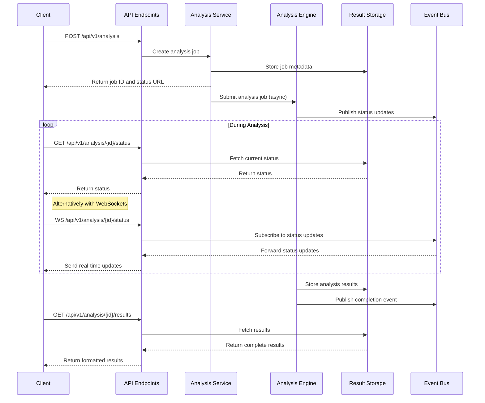

# Story 2.8: Analysis Engine API

**Status:** Draft

## Non-Technical Explanation

This story creates a standardized way for other parts of the system to request installer analysis and receive results. Think of it like creating a standardized order form and delivery process for a service: anyone wanting to use installer analysis can fill out the form (API request), and they'll receive results in a consistent, predictable format.

For developers integrating with the analysis engine, this provides a reliable interface that won't change unexpectedly. For the system as a whole, it ensures that all components—from the user interface to the script generation engine to the policy creator—can communicate with the analysis engine in a consistent way.

It's similar to how standardized electrical outlets allow any compatible device to plug in and receive power. This standardization is crucial for maintaining a modular system where components can be updated or replaced without breaking the entire system.

## Why This Matters

Creating a well-defined API for the installer analysis engine is critical for several reasons:

1. **Modular Architecture**: Enables separate development and updating of different system components without breaking integration points.

2. **Consistent Access Pattern**: Provides a uniform way to access analysis capabilities, simplifying integration for other system components.

3. **Version Compatibility**: Allows the analysis engine to evolve internally while maintaining stable external interfaces.

4. **Error Handling**: Establishes consistent patterns for error reporting and status updates across component boundaries.

5. **Documentation**: Creates a clear contract between the analysis engine and other components, making integration straightforward.

Without a well-defined API, system components would be tightly coupled, making changes difficult and increasing the risk of unexpected breakages. This story ensures the analysis engine can be easily used by all other system components through a consistent, reliable interface.

## Goal & Context

**User Story:** As a developer, I need a well-defined API for the installer analysis engine to enable integration with other system components.

**Context:** Building upon all previous installer analysis capabilities (Stories 2.1-2.7), this story provides a standardized API that exposes these capabilities to other system components. This forms the integration point between the analysis engine and the rest of the application.

## Detailed Requirements

- Implement RESTful API for analysis requests
- Create structured response format for analysis results
- Develop status tracking for long-running analyses
- Implement error handling and reporting
- Create API documentation with examples
- Document API performance characteristics and limitations

## Acceptance Criteria (ACs)

- AC1: API accepts analysis requests with appropriate parameters
- AC2: Responses provide complete analysis results in structured format
- AC3: Status tracking works for analyses of varying duration
- AC4: Error handling provides useful information for troubleshooting
- AC5: Documentation enables developers to correctly use the API

## Technical Implementation Context

**Guidance:** Use the following details for implementation. Refer to the linked `docs/` files for broader context if needed.

- **Relevant Files:**

  - Files to Create: 
    - `backend/apas/api/endpoints/analysis.py` - API endpoint definitions
    - `backend/apas/api/schemas/analysis.py` - Request/response schema models
    - `backend/apas/api/dependencies/analysis.py` - API dependencies
    - `backend/apas/services/analysis.py` - Analysis service layer
    - `backend/apas/core/event_bus/topics.py` - Event topics for analysis
    - `docs/developer-guide/analysis-api.md` - API documentation
  - Files to Modify:
    - `backend/apas/api/router.py` - Add analysis routes
    - `backend/apas/agents/installer/agent.py` - Implement API integration
    - `backend/apas/main.py` - Register API routes
  - _(Hint: See `docs/architecture/project-structure.md` for overall layout)_

- **Key Technologies:**

  - FastAPI for API implementation
  - Pydantic for request/response models
  - Background tasks for long-running operations
  - WebSockets for real-time status updates
  - OpenAPI for documentation generation
  - _(Hint: See `docs/architecture/tech-stack.md` for technology details)_

- **API Interactions / SDK Usage:**

  - FastAPI dependency injection
  - Pydantic validation
  - Event bus for status updates
  - Task queue for background processing
  - Supabase for result storage
  - _(Hint: See `docs/architecture/api-reference.md` for API patterns)_

- **Data Structures:**

  - `AnalysisRequest` model for API requests
  - `AnalysisResponse` model for API responses
  - `AnalysisStatus` enum for tracking status
  - `AnalysisError` model for error reporting
  - `AnalysisResult` model for complete results
  - _(Hint: See `docs/architecture/data-models.md` for structure details)_

- **Environment Variables:**

  - `MAX_ANALYSIS_DURATION` - Maximum time for analysis
  - `MAX_CONCURRENT_ANALYSES` - Maximum concurrent analyses
  - `ANALYSIS_RESULT_TTL` - Time-to-live for analysis results
  - _(Hint: See `docs/architecture/environment-vars.md` for details)_

- **Coding Standards Notes:**
  - Follow RESTful API design principles
  - Implement proper API versioning
  - Create comprehensive error responses
  - Use standard HTTP status codes
  - Include proper request validation
  - _(Hint: See `docs/architecture/coding-standards.md` for full standards)_

## Visual Design Reference

The Analysis Engine API follows this workflow:



## Tasks / Subtasks

- [ ] Design Analysis API architecture
  - [ ] Define API endpoints
  - [ ] Create request/response schemas
  - [ ] Design status tracking mechanism
  - [ ] Define error handling patterns
  - [ ] Create API versioning strategy
- [ ] Implement analysis request handling
  - [ ] Create analysis request endpoint
  - [ ] Implement request validation
  - [ ] Develop job creation logic
  - [ ] Create background task submission
  - [ ] Implement initial response generation
- [ ] Implement status tracking
  - [ ] Create status storage mechanism
  - [ ] Implement status query endpoint
  - [ ] Develop WebSocket status updates
  - [ ] Create progress calculation
  - [ ] Implement timeout handling
- [ ] Implement results retrieval
  - [ ] Create results storage mechanism
  - [ ] Implement results query endpoint
  - [ ] Develop results formatting
  - [ ] Create partial results handling
  - [ ] Implement caching for results
- [ ] Implement error handling
  - [ ] Create error model
  - [ ] Implement exception handling
  - [ ] Develop error response generation
  - [ ] Create logging for API errors
  - [ ] Implement retry mechanism
- [ ] Create API documentation
  - [ ] Generate OpenAPI documentation
  - [ ] Create example requests and responses
  - [ ] Document error responses
  - [ ] Create API usage guide
  - [ ] Document performance characteristics
- [ ] Implement API integration with analysis engine
  - [ ] Update installer agent for API integration
  - [ ] Create service layer for analysis operations
  - [ ] Implement event publishing for status updates
  - [ ] Create result transformation for API responses
  - [ ] Develop cleanup mechanism for completed analyses
- [ ] Create test suite
  - [ ] Develop API endpoint tests
  - [ ] Create integration tests with analysis engine
  - [ ] Implement performance tests
  - [ ] Create error handling tests
  - [ ] Develop documentation tests

## Manual Testing Guide (For Non-Technical Users)

You can verify the Analysis Engine API is working correctly through these checks:

1. **Basic API Request Test**:
   - Use the API testing interface to submit a simple installer file
   - Verify that the system returns a job ID and status URL
   - Check that you can retrieve the status of the analysis
   - Confirm that the results are available when analysis completes

2. **Concurrent Request Test**:
   - Submit multiple installer files for analysis at the same time
   - Verify that all analyses proceed correctly
   - Check that status updates are provided for each analysis
   - Confirm that results are available for all analyses

3. **Error Handling Test**:
   - Submit an invalid installer file
   - Verify that the system provides a clear error message
   - Check that the error information is useful for troubleshooting
   - Confirm that the system recovers properly after errors

4. **Expected Results**:
   - Analysis requests should return immediately with a job ID
   - Status updates should reflect progress accurately
   - Results should be complete and well-formatted
   - Error messages should be clear and actionable
   - Documentation should match actual API behavior

## Testing Requirements

**Guidance:** Verify implementation against the ACs using the following tests.

- **Unit Tests:** 
  - Test individual API endpoints
  - Verify request/response schemas
  - Test status tracking logic
  - Validate error handling
  - Test service layer integration

- **Integration Tests:** 
  - Test end-to-end analysis flow through API
  - Verify WebSocket status updates
  - Test concurrent analysis requests
  - Validate result retrieval
  - Test error propagation and handling

- **Manual Verification:** 
  - Test API with various installer types
  - Verify documentation accuracy
  - Check API versioning logic
  - Test performance with large installers
  - Verify integration with other system components

## Implementation Example

Here's an example implementation of the Analysis Engine API:

```python
from enum import Enum
from typing import Dict, Any, Optional, List, Union
from pydantic import BaseModel, Field, validator, root_validator, AnyHttpUrl
from fastapi import APIRouter, Depends, HTTPException, BackgroundTasks, WebSocket, status
from fastapi.responses import JSONResponse
import logging
import uuid
import time
from datetime import datetime

# Import analysis components
from apas.agents.installer.agent import InstallerAnalysisAgent
from apas.core.event_bus.publisher import EventPublisher
from apas.core.event_bus.topics import AnalysisTopics
from apas.services.storage import StorageService
from apas.api.dependencies.auth import get_current_user
from apas.models.user import User

# Status enum for analysis jobs
class AnalysisStatus(str, Enum):
    PENDING = "pending"
    PROCESSING = "processing"
    EXTRACTING_METADATA = "extracting_metadata"
    ANALYZING_COMMANDS = "analyzing_commands"
    ANALYZING_REQUIREMENTS = "analyzing_requirements"
    INVENTORYING_CONTENT = "inventorying_content"
    RESEARCHING = "researching"
    INTEGRATING = "integrating"
    COMPLETED = "completed"
    FAILED = "failed"
    TIMEOUT = "timeout"
    CANCELLED = "cancelled"

# Analysis request model
class AnalysisRequest(BaseModel):
    installer_path: str = Field(..., description="Path to the installer file or ID in storage")
    options: Dict[str, Any] = Field(default_factory=dict, description="Analysis options")
    priority: int = Field(default=1, ge=1, le=5, description="Priority (1-5, higher is more urgent)")
    callback_url: Optional[AnyHttpUrl] = Field(None, description="URL to call when analysis completes")
    
    @validator('options')
    def validate_options(cls, v):
        """Validate analysis options."""
        valid_keys = {'include_research', 'deep_analysis', 'timeout_seconds', 'extract_content'}
        invalid_keys = set(v.keys()) - valid_keys
        if invalid_keys:
            raise ValueError(f"Invalid options: {', '.join(invalid_keys)}")
        return v

# Analysis error model
class AnalysisError(BaseModel):
    code: str = Field(..., description="Error code")
    message: str = Field(..., description="Error message")
    details: Optional[Dict[str, Any]] = Field(None, description="Error details")
    source: Optional[str] = Field(None, description="Error source")
    
    class Config:
        schema_extra = {
            "example": {
                "code": "file_not_found",
                "message": "Installer file could not be found",
                "details": {"path": "/path/to/installer.msi"},
                "source": "storage_service"
            }
        }

# Analysis status response model
class AnalysisStatusResponse(BaseModel):
    id: str = Field(..., description="Analysis job ID")
    status: AnalysisStatus = Field(..., description="Current status")
    progress: float = Field(..., ge=0, le=100, description="Progress percentage")
    created_at: datetime = Field(..., description="When the job was created")
    updated_at: datetime = Field(..., description="When status was last updated")
    estimated_completion: Optional[datetime] = Field(None, description="Estimated completion time")
    current_operation: Optional[str] = Field(None, description="Current operation description")
    errors: List[AnalysisError] = Field(default_factory=list, description="Errors encountered")
    
    class Config:
        schema_extra = {
            "example": {
                "id": "b5dd4f40-a8d0-4a9e-b635-c5b02e991c3f",
                "status": "processing",
                "progress": 45.5,
                "created_at": "2025-06-08T10:30:00Z",
                "updated_at": "2025-06-08T10:31:30Z",
                "estimated_completion": "2025-06-08T10:33:00Z",
                "current_operation": "Analyzing installation commands",
                "errors": []
            }
        }

# Analysis result model (simplified)
class AnalysisResult(BaseModel):
    id: str = Field(..., description="Analysis job ID")
    status: AnalysisStatus = Field(..., description="Final status")
    created_at: datetime = Field(..., description="When the job was created")
    completed_at: datetime = Field(..., description="When the job completed")
    duration_seconds: float = Field(..., description="Analysis duration in seconds")
    results: Dict[str, Any] = Field(..., description="Analysis results")
    errors: List[AnalysisError] = Field(default_factory=list, description="Errors encountered")
    
    class Config:
        schema_extra = {
            "example": {
                "id": "b5dd4f40-a8d0-4a9e-b635-c5b02e991c3f",
                "status": "completed",
                "created_at": "2025-06-08T10:30:00Z",
                "completed_at": "2025-06-08T10:32:30Z",
                "duration_seconds": 150.5,
                "results": {
                    "installer_type": "MSI",
                    "product_name": "Example Application",
                    "silent_command": "msiexec /i example.msi /qn",
                    # More results would be included here
                },
                "errors": []
            }
        }

# Analysis API service
class AnalysisService:
    """Service for handling analysis operations."""
    
    def __init__(self, 
                 agent: InstallerAnalysisAgent,
                 event_publisher: EventPublisher,
                 storage: StorageService):
        self.logger = logging.getLogger(__name__)
        self.agent = agent
        self.event_publisher = event_publisher
        self.storage = storage
    
    async def create_analysis_job(self, request: AnalysisRequest, user: User) -> str:
        """
        Create a new analysis job.
        
        Args:
            request: Analysis request
            user: Current user
            
        Returns:
            str: Job ID
        """
        job_id = str(uuid.uuid4())
        
        # Create job metadata
        job_meta = {
            "id": job_id,
            "user_id": user.id,
            "installer_path": request.installer_path,
            "options": request.options,
            "priority": request.priority,
            "callback_url": request.callback_url,
            "status": AnalysisStatus.PENDING.value,
            "progress": 0.0,
            "created_at": datetime.utcnow().isoformat(),
            "updated_at": datetime.utcnow().isoformat(),
            "errors": []
        }
        
        # Store job metadata
        await self.storage.store_analysis_job(job_id, job_meta)
        
        # Publish job creation event
        await self.event_publisher.publish(
            AnalysisTopics.JOB_CREATED,
            {
                "job_id": job_id,
                "installer_path": request.installer_path,
                "options": request.options,
                "priority": request.priority
            }
        )
        
        self.logger.info(f"Created analysis job {job_id} for installer {request.installer_path}")
        return job_id
    
    async def get_job_status(self, job_id: str, user: User) -> AnalysisStatusResponse:
        """
        Get the status of an analysis job.
        
        Args:
            job_id: Analysis job ID
            user: Current user
            
        Returns:
            AnalysisStatusResponse: Current job status
        """
        # Get job metadata
        job_meta = await self.storage.get_analysis_job(job_id)
        if not job_meta:
            raise HTTPException(
                status_code=status.HTTP_404_NOT_FOUND,
                detail=f"Analysis job {job_id} not found"
            )
        
        # Check user permissions
        if job_meta["user_id"] != user.id and not user.is_admin:
            raise HTTPException(
                status_code=status.HTTP_403_FORBIDDEN,
                detail="You don't have permission to access this analysis job"
            )
        
        # Convert to status response
        return AnalysisStatusResponse(
            id=job_meta["id"],
            status=AnalysisStatus(job_meta["status"]),
            progress=job_meta["progress"],
            created_at=datetime.fromisoformat(job_meta["created_at"]),
            updated_at=datetime.fromisoformat(job_meta["updated_at"]),
            estimated_completion=datetime.fromisoformat(job_meta["estimated_completion"]) 
                if "estimated_completion" in job_meta and job_meta["estimated_completion"] 
                else None,
            current_operation=job_meta.get("current_operation"),
            errors=[AnalysisError(**error) for error in job_meta.get("errors", [])]
        )
    
    async def get_job_results(self, job_id: str, user: User) -> AnalysisResult:
        """
        Get the results of an analysis job.
        
        Args:
            job_id: Analysis job ID
            user: Current user
            
        Returns:
            AnalysisResult: Job results
        """
        # Get job metadata
        job_meta = await self.storage.get_analysis_job(job_id)
        if not job_meta:
            raise HTTPException(
                status_code=status.HTTP_404_NOT_FOUND,
                detail=f"Analysis job {job_id} not found"
            )
        
        # Check user permissions
        if job_meta["user_id"] != user.id and not user.is_admin:
            raise HTTPException(
                status_code=status.HTTP_403_FORBIDDEN,
                detail="You don't have permission to access this analysis job"
            )
        
        # Check if job is completed
        if job_meta["status"] not in (AnalysisStatus.COMPLETED.value, AnalysisStatus.FAILED.value):
            raise HTTPException(
                status_code=status.HTTP_400_BAD_REQUEST,
                detail=f"Analysis job {job_id} is not completed yet"
            )
        
        # Get results
        results = await self.storage.get_analysis_results(job_id)
        if not results and job_meta["status"] == AnalysisStatus.COMPLETED.value:
            raise HTTPException(
                status_code=status.HTTP_500_INTERNAL_SERVER_ERROR,
                detail=f"Results for completed job {job_id} not found"
            )
        
        # Convert to result response
        return AnalysisResult(
            id=job_meta["id"],
            status=AnalysisStatus(job_meta["status"]),
            created_at=datetime.fromisoformat(job_meta["created_at"]),
            completed_at=datetime.fromisoformat(job_meta["completed_at"]) 
                if "completed_at" in job_meta and job_meta["completed_at"] 
                else datetime.utcnow(),
            duration_seconds=job_meta.get("duration_seconds", 0.0),
            results=results or {},
            errors=[AnalysisError(**error) for error in job_meta.get("errors", [])]
        )
    
    async def run_analysis(self, job_id: str) -> None:
        """
        Run analysis in the background.
        
        Args:
            job_id: Analysis job ID
        """
        try:
            # Get job metadata
            job_meta = await self.storage.get_analysis_job(job_id)
            if not job_meta:
                self.logger.error(f"Job {job_id} not found for background analysis")
                return
            
            # Update status to processing
            await self._update_job_status(
                job_id, 
                AnalysisStatus.PROCESSING,
                progress=5.0,
                current_operation="Starting analysis"
            )
            
            # Get installer path
            installer_path = job_meta["installer_path"]
            options = job_meta["options"]
            
            # Run analysis
            start_time = time.time()
            
            # File type detection
            await self._update_job_status(
                job_id,
                AnalysisStatus.PROCESSING,
                progress=10.0,
                current_operation="Detecting installer type"
            )
            detection_result = await self.agent.detect_installer_type(installer_path)
            
            # Metadata extraction
            await self._update_job_status(
                job_id,
                AnalysisStatus.EXTRACTING_METADATA,
                progress=20.0,
                current_operation="Extracting metadata"
            )
            metadata_result = await self.agent.extract_metadata(installer_path, detection_result)
            
            # Command analysis
            await self._update_job_status(
                job_id,
                AnalysisStatus.ANALYZING_COMMANDS,
                progress=35.0,
                current_operation="Analyzing installation commands"
            )
            command_result = await self.agent.analyze_commands(installer_path, detection_result, metadata_result)
            
            # Requirements analysis
            await self._update_job_status(
                job_id,
                AnalysisStatus.ANALYZING_REQUIREMENTS,
                progress=50.0,
                current_operation="Analyzing requirements"
            )
            requirements_result = await self.agent.analyze_requirements(
                installer_path, detection_result, metadata_result, command_result
            )
            
            # Content inventory (if enabled)
            inventory_result = None
            if options.get("extract_content", True):
                await self._update_job_status(
                    job_id,
                    AnalysisStatus.INVENTORYING_CONTENT,
                    progress=65.0,
                    current_operation="Creating content inventory"
                )
                inventory_result = await self.agent.inventory_content(
                    installer_path, detection_result
                )
            
            # External research (if enabled)
            research_result = None
            if options.get("include_research", True):
                await self._update_job_status(
                    job_id,
                    AnalysisStatus.RESEARCHING,
                    progress=80.0,
                    current_operation="Researching external information"
                )
                research_result = await self.agent.research_external_info(
                    metadata_result, requirements_result
                )
            
            # Integration
            await self._update_job_status(
                job_id,
                AnalysisStatus.INTEGRATING,
                progress=90.0,
                current_operation="Integrating analysis results"
            )
            integration_result = await self.agent.integrate_results(
                detection_result, metadata_result, command_result,
                requirements_result, inventory_result, research_result
            )
            
            # Calculate duration
            duration = time.time() - start_time
            
            # Format results
            results = {
                "installer_type": detection_result.installer_type.name if detection_result else None,
                "installer_framework": detection_result.framework.name if detection_result else None,
                "product_name": metadata_result.product_name if metadata_result else None,
                "product_version": metadata_result.product_version if metadata_result else None,
                "publisher": metadata_result.publisher if metadata_result else None,
                "silent_install_command": command_result.silent_command if command_result else None,
                "uninstall_command": command_result.uninstall_command if command_result else None,
                "parameters": command_result.parameters if command_result else {},
                "prerequisites": [req.name for req in requirements_result.requirements 
                                if requirements_result and req.type.name == "PREREQUISITE_SOFTWARE"],
                "system_requirements": [req.name for req in requirements_result.requirements 
                                      if requirements_result and req.type.name == "SYSTEM_REQUIREMENT"],
                "integration": {
                    "overall_confidence": integration_result.overall_confidence if integration_result else 0.0,
                    "conflicts_detected": integration_result.conflicts_detected if integration_result else 0,
                    "conflicts_resolved": len(integration_result.conflicts_resolved) if integration_result else 0
                }
            }
            
            # Store results
            await self.storage.store_analysis_results(job_id, results)
            
            # Update job to completed
            await self._update_job_status(
                job_id,
                AnalysisStatus.COMPLETED,
                progress=100.0,
                current_operation="Analysis completed",
                completed_at=datetime.utcnow().isoformat(),
                duration_seconds=duration
            )
            
            # Publish completion event
            await self.event_publisher.publish(
                AnalysisTopics.JOB_COMPLETED,
                {
                    "job_id": job_id,
                    "duration_seconds": duration,
                    "status": AnalysisStatus.COMPLETED.value
                }
            )
            
            # Call callback URL if provided
            if job_meta.get("callback_url"):
                # Implementation for callback would go here
                pass
                
        except Exception as e:
            self.logger.error(f"Error in analysis job {job_id}: {str(e)}")
            
            # Update job to failed
            error = AnalysisError(
                code="analysis_failed",
                message=str(e),
                source="analysis_service"
            )
            
            await self._update_job_status(
                job_id,
                AnalysisStatus.FAILED,
                progress=0.0,
                current_operation="Analysis failed",
                completed_at=datetime.utcnow().isoformat(),
                errors=[error.dict()]
            )
            
            # Publish failure event
            await self.event_publisher.publish(
                AnalysisTopics.JOB_FAILED,
                {
                    "job_id": job_id,
                    "error": error.dict()
                }
            )
    
    async def _update_job_status(self, 
                               job_id: str, 
                               status: AnalysisStatus,
                               progress: float = 0.0,
                               current_operation: Optional[str] = None,
                               completed_at: Optional[str] = None,
                               duration_seconds: Optional[float] = None,
                               errors: Optional[List[Dict[str, Any]]] = None) -> None:
        """
        Update the status of an analysis job.
        
        Args:
            job_id: Analysis job ID
            status: New status
            progress: Progress percentage
            current_operation: Current operation description
            completed_at: Completion timestamp
            duration_seconds: Analysis duration
            errors: List of errors
        """
        # Get current job metadata
        job_meta = await self.storage.get_analysis_job(job_id)
        if not job_meta:
            self.logger.error(f"Job {job_id} not found for status update")
            return
        
        # Update metadata
        updates = {
            "status": status.value,
            "progress": progress,
            "updated_at": datetime.utcnow().isoformat()
        }
        
        if current_operation:
            updates["current_operation"] = current_operation
            
        if completed_at:
            updates["completed_at"] = completed_at
            
        if duration_seconds is not None:
            updates["duration_seconds"] = duration_seconds
            
        if errors:
            updates["errors"] = errors
            
        # Calculate estimated completion time
        if progress > 0 and progress < 100 and status != AnalysisStatus.FAILED:
            created_at = datetime.fromisoformat(job_meta["created_at"])
            now = datetime.utcnow()
            elapsed = (now - created_at).total_seconds()
            
            if elapsed > 0 and progress > 0:
                total_estimated = elapsed * (100 / progress)
                remaining = total_estimated - elapsed
                est_completion = now + timedelta(seconds=remaining)
                updates["estimated_completion"] = est_completion.isoformat()
        
        # Update storage
        await self.storage.update_analysis_job(job_id, updates)
        
        # Publish status update event
        await self.event_publisher.publish(
            AnalysisTopics.JOB_STATUS_UPDATED,
            {
                "job_id": job_id,
                "status": status.value,
                "progress": progress,
                "current_operation": current_operation
            }
        )

# API router
router = APIRouter(
    prefix="/api/v1/analysis",
    tags=["analysis"],
    responses={404: {"description": "Not found"}},
)

# Dependency for getting the analysis service
async def get_analysis_service():
    # Implementation would create and return the actual service
    pass

@router.post("/", status_code=status.HTTP_202_ACCEPTED, response_model=Dict[str, str])
async def create_analysis(
    request: AnalysisRequest,
    background_tasks: BackgroundTasks,
    service: AnalysisService = Depends(get_analysis_service),
    current_user: User = Depends(get_current_user)
):
    """
    Create a new analysis job.
    
    This endpoint accepts an installer file path and analysis options,
    and creates a new analysis job in the background.
    
    Returns:
        Dict[str, str]: Job ID and status URL
    """
    job_id = await service.create_analysis_job(request, current_user)
    
    # Start analysis in the background
    background_tasks.add_task(service.run_analysis, job_id)
    
    # Return job ID and URLs
    return {
        "job_id": job_id,
        "status_url": f"/api/v1/analysis/{job_id}/status",
        "results_url": f"/api/v1/analysis/{job_id}/results",
        "websocket_url": f"/api/v1/analysis/{job_id}/ws"
    }

@router.get("/{job_id}/status", response_model=AnalysisStatusResponse)
async def get_status(
    job_id: str,
    service: AnalysisService = Depends(get_analysis_service),
    current_user: User = Depends(get_current_user)
):
    """
    Get the status of an analysis job.
    
    This endpoint returns the current status of an analysis job,
    including progress percentage and any errors encountered.
    
    Args:
        job_id: Analysis job ID
        
    Returns:
        AnalysisStatusResponse: Current job status
    """
    return await service.get_job_status(job_id, current_user)

@router.get("/{job_id}/results", response_model=AnalysisResult)
async def get_results(
    job_id: str,
    service: AnalysisService = Depends(get_analysis_service),
    current_user: User = Depends(get_current_user)
):
    """
    Get the results of an analysis job.
    
    This endpoint returns the full results of a completed analysis job.
    The job must be in 'completed' or 'failed' status.
    
    Args:
        job_id: Analysis job ID
        
    Returns:
        AnalysisResult: Job results
    """
    return await service.get_job_results(job_id, current_user)

@router.websocket("/{job_id}/ws")
async def websocket_status(
    websocket: WebSocket,
    job_id: str,
    service: AnalysisService = Depends(get_analysis_service)
):
    """
    WebSocket connection for real-time status updates.
    
    This endpoint provides real-time status updates for an analysis job
    using WebSockets.
    
    Args:
        websocket: WebSocket connection
        job_id: Analysis job ID
    """
    await websocket.accept()
    
    try:
        # Subscribe to status updates
        # Implementation would handle authentication and subscription
        
        # Send initial status
        # Implementation would get and send current status
        
        # Keep connection open for updates
        while True:
            # Implementation would wait for and forward status updates
            await asyncio.sleep(1)
            
    except Exception as e:
        logging.error(f"WebSocket error: {str(e)}")
    finally:
        # Unsubscribe and close connection
        await websocket.close()

@router.delete("/{job_id}", status_code=status.HTTP_202_ACCEPTED)
async def cancel_analysis(
    job_id: str,
    service: AnalysisService = Depends(get_analysis_service),
    current_user: User = Depends(get_current_user)
):
    """
    Cancel an analysis job.
    
    This endpoint cancels a running analysis job.
    Only jobs in 'pending' or 'processing' status can be cancelled.
    
    Args:
        job_id: Analysis job ID
        
    Returns:
        Dict[str, str]: Confirmation message
    """
    # Implementation would handle cancellation
    
    return {"message": f"Analysis job {job_id} has been cancelled"}
```

## Story Wrap Up (Agent Populates After Execution)

- **Agent Model Used:** 
- **Completion Notes:** 
- **Change Log:** 
  - Initial Draft