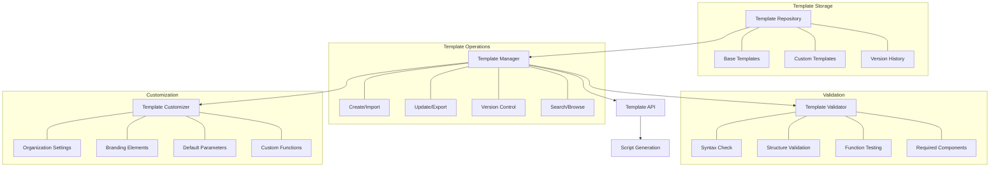

# Story 3.1: PSADT Template Management

**Status:** Draft

## Non-Technical Explanation

This story is about creating a system to store, manage, and customize templates for PowerShell AppDeploy Toolkit scripts. Think of it like having a collection of professional document templates that follow your organization's standards but can be customized for each specific situation.

Just as a law firm might have standardized letterhead and document templates that ensure consistent formatting while allowing for customization of content, this feature provides standardized starting points for packaging scripts. These templates ensure all packages follow organizational standards while still accommodating the unique requirements of each application.

The system will maintain different versions of templates, validate their correctness, and allow for customization without breaking core functionality. This provides a solid foundation for all the script generation capabilities that will be built in subsequent stories.

## Why This Matters

Template management is critical to successful enterprise application packaging for several reasons:

1. **Consistency**: Ensures all packages follow the same standards and patterns, making them easier to maintain and troubleshoot.

2. **Best Practices**: Embeds organizational best practices directly into templates, reducing the risk of common mistakes.

3. **Efficiency**: Eliminates repetitive work by starting from a pre-built template rather than creating scripts from scratch.

4. **Customization**: Allows for organization-specific defaults and settings while maintaining core functionality.

5. **Governance**: Supports proper versioning and testing of templates to ensure reliability across all packages.

When organizations scale their packaging operations, consistent templates become essential for maintaining quality and enabling collaboration between different packagers. This capability establishes the foundation for all subsequent PowerShell AppDeploy Toolkit automation.

## Goal & Context

**User Story:** As a packaging engineer, I need the system to manage PSADT templates that follow our organizational standards.

**Context:** This is the first story in Epic 3, establishing the foundation for PowerShell AppDeploy Toolkit integration. It builds upon the installer analysis capabilities from Epic 2 by providing the template infrastructure needed to generate deployment scripts.

## Detailed Requirements

- Implement storage and versioning of PSADT templates
- Create template validation and testing
- Develop customization options for templates
- Implement organization-specific default settings
- Create import/export functionality for templates
- Document template structure and customization options

## Acceptance Criteria (ACs)

- AC1: System stores multiple template versions with proper versioning
- AC2: Templates are validated for correctness before use
- AC3: Customization preserves template functionality
- AC4: Organization settings are correctly applied to templates
- AC5: Import/export functions work correctly for template sharing

## Technical Implementation Context

**Guidance:** Use the following details for implementation. Refer to the linked `docs/` files for broader context if needed.

- **Relevant Files:**

  - Files to Create: 
    - `backend/apas/agents/psadt/templates/manager.py` - Template management logic
    - `backend/apas/agents/psadt/templates/validator.py` - Template validation
    - `backend/apas/agents/psadt/templates/customizer.py` - Template customization
    - `backend/apas/models/psadt_template.py` - Template data models
    - `backend/apas/api/endpoints/templates.py` - API endpoints for template management
    - `docs/developer-guide/psadt-templates.md` - Documentation
  - Files to Modify:
    - `backend/apas/api/router.py` - Add template endpoints
    - `backend/apas/core/database/models.py` - Add template storage models
  - _(Hint: See `docs/architecture/project-structure.md` for overall layout)_

- **Key Technologies:**

  - Python for template management logic
  - PowerShell for template validation and testing
  - Jinja2 for template rendering
  - Supabase for template storage
  - FastAPI for template management API
  - _(Hint: See `docs/architecture/tech-stack.md` for technology details)_

- **API Interactions / SDK Usage:**

  - PowerShell execution from Python
  - Supabase storage operations
  - Template validation API
  - File system operations for template extraction
  - _(Hint: See `docs/architecture/api-reference.md` for API patterns)_

- **Data Structures:**

  - `PSADTTemplate` model for template metadata
  - `TemplateVersion` model for version tracking
  - `TemplateCustomization` model for customization settings
  - `ValidationResult` model for validation feedback
  - `TemplateComponent` enum for template parts
  - _(Hint: See `docs/architecture/data-models.md` for structure details)_

- **Environment Variables:**

  - `TEMPLATES_DIR` - Directory for storing template files
  - `DEFAULT_TEMPLATE_VERSION` - Default template version to use
  - `POWERSHELL_PATH` - Path to PowerShell executable
  - `VALIDATION_TIMEOUT` - Timeout for template validation
  - _(Hint: See `docs/architecture/environment-vars.md` for details)_

- **Coding Standards Notes:**
  - Implement proper versioning with semantic versioning
  - Use atomic file operations for template updates
  - Create comprehensive validation checks
  - Follow consistent naming conventions
  - Provide detailed error messages for validation failures
  - _(Hint: See `docs/architecture/coding-standards.md` for full standards)_

## Visual Design Reference

The template management system follows this architecture:



## Tasks / Subtasks

- [ ] Design template management architecture
  - [ ] Define template structure
  - [ ] Create versioning strategy
  - [ ] Design storage approach
  - [ ] Define customization parameters
  - [ ] Create validation requirements
- [ ] Implement template storage
  - [ ] Create template repository structure
  - [ ] Implement version control
  - [ ] Develop template metadata tracking
  - [ ] Create search functionality
  - [ ] Implement backup mechanism
- [ ] Implement template validation
  - [ ] Create PowerShell syntax validation
  - [ ] Implement structure validation
  - [ ] Develop function testing
  - [ ] Create validation report generation
  - [ ] Implement continuous validation
- [ ] Implement template customization
  - [ ] Create organization settings framework
  - [ ] Implement branding customization
  - [ ] Develop default parameter configuration
  - [ ] Create custom function integration
  - [ ] Implement template extension points
- [ ] Implement template import/export
  - [ ] Create import mechanism
  - [ ] Implement export functionality
  - [ ] Develop validation during import
  - [ ] Create sharing format
  - [ ] Implement batch operations
- [ ] Create template management API
  - [ ] Implement CRUD operations
  - [ ] Create version management endpoints
  - [ ] Develop validation endpoints
  - [ ] Implement customization API
  - [ ] Create documentation endpoints
- [ ] Create default templates
  - [ ] Implement standard PSADT template
  - [ ] Create specialized templates for different app types
  - [ ] Develop organization-specific templates
  - [ ] Create example templates
  - [ ] Implement template documentation
- [ ] Create template documentation
  - [ ] Document template structure
  - [ ] Create customization guide
  - [ ] Develop best practices
  - [ ] Create template examples
  - [ ] Implement inline documentation

## Manual Testing Guide (For Non-Technical Users)

You can verify the PSADT template management is working correctly through these checks:

1. **Template Storage Test**:
   - Navigate to the Templates section
   - Review available templates
   - Check that multiple versions of templates are available
   - Verify that template metadata is correctly displayed
   - Confirm that template versioning works as expected

2. **Template Validation Test**:
   - Select a template to validate
   - Run the validation function
   - Verify that the validator checks syntax and structure
   - Intentionally introduce an error and confirm it's detected
   - Check that validation results are clearly presented

3. **Template Customization Test**:
   - Select a template to customize
   - Modify organization settings
   - Change default parameters
   - Add custom functions if needed
   - Verify that the customized template works correctly
   - Confirm that core functionality is preserved

4. **Import/Export Test**:
   - Export a template to a file
   - Import the template to a different environment or as a new version
   - Verify that all settings are preserved
   - Check that validation is performed during import
   - Confirm that metadata is correctly transferred

5. **Expected Results**:
   - Templates should load and save quickly
   - Validation should identify issues before they cause problems
   - Customization should be intuitive and preserve functionality
   - Import/export should reliably transfer all template elements
   - Template versioning should maintain history and allow rollback

## Testing Requirements

**Guidance:** Verify implementation against the ACs using the following tests.

- **Unit Tests:** 
  - Test template loading and parsing
  - Verify validation functionality
  - Test customization operations
  - Validate import/export functions
  - Test version control operations

- **Integration Tests:** 
  - Test integration with storage system
  - Verify PowerShell execution from Python
  - Test end-to-end template customization
  - Validate API endpoints for template management
  - Test template selection in script generation

- **Manual Verification:** 
  - Verify templates with real application examples
  - Check organization settings application
  - Validate templates with different PSADT versions
  - Test import/export between environments
  - Verify template documentation correctness

## Implementation Example

Here's an example implementation of the template management system:

```python
from enum import Enum, auto
from typing import Dict, Any, Optional, List, Union, Set
from pathlib import Path
import logging
import json
import os
import shutil
import zipfile
import time
import re
import subprocess
from dataclasses import dataclass, field
import semver
from datetime import datetime
import jinja2

class TemplateComponent(Enum):
    """Components of a PSADT template."""
    DEPLOY_APPLICATION = auto()     # Main Deploy-Application.ps1 script
    APPDEPLOYMENTOOLKIT = auto()    # AppDeploymentToolkit.ps1 library
    CONFIG = auto()                 # Config XML
    SERVICEUI = auto()              # ServiceUI binary
    TEMPLATE_CONFIG = auto()        # Template configuration (metadata)
    CUSTOM_FUNCTIONS = auto()       # Custom functions
    README = auto()                 # Documentation
    
    def get_filename(self) -> str:
        """Get the default filename for this component."""
        filenames = {
            TemplateComponent.DEPLOY_APPLICATION: "Deploy-Application.ps1",
            TemplateComponent.APPDEPLOYMENTOOLKIT: "AppDeployToolkit/AppDeployToolkit.ps1",
            TemplateComponent.CONFIG: "AppDeployToolkit/AppDeployToolkitConfig.xml",
            TemplateComponent.SERVICEUI: "AppDeployToolkit/ServiceUI.exe",
            TemplateComponent.TEMPLATE_CONFIG: "template.json",
            TemplateComponent.CUSTOM_FUNCTIONS: "AppDeployToolkit/CustomFunctions.ps1",
            TemplateComponent.README: "README.md"
        }
        return filenames.get(self, "")

class TemplateType(Enum):
    """Types of PSADT templates."""
    STANDARD = "standard"                # Standard application installation
    MSI = "msi"                         # MSI-specific template
    APP_V = "appv"                      # App-V packaging
    COMPLEX = "complex"                 # Complex installations
    DRIVERS = "drivers"                 # Driver installation
    CUSTOM = "custom"                   # Custom template type

class ValidationSeverity(Enum):
    """Severity levels for validation issues."""
    INFO = "info"                # Informational message
    WARNING = "warning"          # Warning, but not critical
    ERROR = "error"              # Error that should be fixed
    CRITICAL = "critical"        # Critical error that must be fixed

@dataclass
class ValidationIssue:
    """Represents an issue found during template validation."""
    severity: ValidationSeverity
    component: TemplateComponent
    message: str
    line_number: Optional[int] = None
    code_snippet: Optional[str] = None
    suggestion: Optional[str] = None
    
    def __str__(self) -> str:
        """Return a string representation of the issue."""
        location = f" at line {self.line_number}" if self.line_number else ""
        return f"{self.severity.name}: {self.component.name}{location} - {self.message}"

@dataclass
class ValidationResult:
    """Results of template validation."""
    is_valid: bool
    issues: List[ValidationIssue] = field(default_factory=list)
    validation_time: float = 0.0
    
    @property
    def has_critical_issues(self) -> bool:
        """Check if there are any critical issues."""
        return any(issue.severity == ValidationSeverity.CRITICAL for issue in self.issues)
    
    @property
    def has_errors(self) -> bool:
        """Check if there are any errors."""
        return any(issue.severity == ValidationSeverity.ERROR for issue in self.issues)
    
    def add_issue(self, issue: ValidationIssue) -> None:
        """Add an issue to the results."""
        self.issues.append(issue)
        if issue.severity in (ValidationSeverity.ERROR, ValidationSeverity.CRITICAL):
            self.is_valid = False
    
    def get_issues_by_severity(self, severity: ValidationSeverity) -> List[ValidationIssue]:
        """Get issues of a specific severity."""
        return [issue for issue in self.issues if issue.severity == severity]
    
    def get_issues_by_component(self, component: TemplateComponent) -> List[ValidationIssue]:
        """Get issues for a specific component."""
        return [issue for issue in self.issues if issue.component == component]
    
    def __str__(self) -> str:
        """Return a string representation of the validation results."""
        result = f"Validation {'succeeded' if self.is_valid else 'failed'}"
        if self.issues:
            result += f" with {len(self.issues)} issues"
            criticals = len(self.get_issues_by_severity(ValidationSeverity.CRITICAL))
            errors = len(self.get_issues_by_severity(ValidationSeverity.ERROR))
            warnings = len(self.get_issues_by_severity(ValidationSeverity.WARNING))
            infos = len(self.get_issues_by_severity(ValidationSeverity.INFO))
            
            if criticals:
                result += f", {criticals} critical"
            if errors:
                result += f", {errors} errors"
            if warnings:
                result += f", {warnings} warnings"
            if infos:
                result += f", {infos} info"
        
        return result

@dataclass
class PSADTTemplate:
    """Represents a PSADT template."""
    id: str
    name: str
    description: str
    version: str
    type: TemplateType
    author: str
    created_at: datetime
    updated_at: datetime
    psadt_version: str
    components: Dict[TemplateComponent, str] = field(default_factory=dict)
    customization_points: Dict[str, Any] = field(default_factory=dict)
    organization_settings: Dict[str, Any] = field(default_factory=dict)
    tags: List[str] = field(default_factory=list)
    
    @property
    def is_complete(self) -> bool:
        """Check if the template has all required components."""
        required = {
            TemplateComponent.DEPLOY_APPLICATION,
            TemplateComponent.APPDEPLOYMENTOOLKIT,
            TemplateComponent.CONFIG
        }
        return all(component in self.components for component in required)
    
    def to_dict(self) -> Dict[str, Any]:
        """Convert to dictionary for serialization."""
        return {
            "id": self.id,
            "name": self.name,
            "description": self.description,
            "version": self.version,
            "type": self.type.value,
            "author": self.author,
            "created_at": self.created_at.isoformat(),
            "updated_at": self.updated_at.isoformat(),
            "psadt_version": self.psadt_version,
            "components": {component.name: path for component, path in self.components.items()},
            "customization_points": self.customization_points,
            "organization_settings": self.organization_settings,
            "tags": self.tags
        }
    
    @classmethod
    def from_dict(cls, data: Dict[str, Any]) -> "PSADTTemplate":
        """Create from dictionary representation."""
        components = {
            TemplateComponent[key]: value 
            for key, value in data.get("components", {}).items()
        }
        
        return cls(
            id=data.get("id", ""),
            name=data.get("name", ""),
            description=data.get("description", ""),
            version=data.get("version", "1.0.0"),
            type=TemplateType(data.get("type", "standard")),
            author=data.get("author", ""),
            created_at=datetime.fromisoformat(data.get("created_at", datetime.now().isoformat())),
            updated_at=datetime.fromisoformat(data.get("updated_at", datetime.now().isoformat())),
            psadt_version=data.get("psadt_version", ""),
            components=components,
            customization_points=data.get("customization_points", {}),
            organization_settings=data.get("organization_settings", {}),
            tags=data.get("tags", [])
        )

class TemplateManager:
    """Manages PSADT templates."""
    
    def __init__(self, templates_dir: str, powershell_path: str = "powershell"):
        self.logger = logging.getLogger(__name__)
        self.templates_dir = Path(templates_dir)
        self.powershell_path = powershell_path
        self.validator = TemplateValidator(powershell_path)
        self.customizer = TemplateCustomizer()
        
        # Create templates directory if it doesn't exist
        os.makedirs(self.templates_dir, exist_ok=True)
        
    def get_templates(self) -> List[PSADTTemplate]:
        """
        Get all available templates.
        
        Returns:
            List[PSADTTemplate]: List of available templates
        """
        templates = []
        
        for template_dir in self.templates_dir.iterdir():
            if not template_dir.is_dir():
                continue
                
            template_config = template_dir / "template.json"
            if not template_config.exists():
                continue
                
            try:
                with open(template_config, "r") as f:
                    data = json.load(f)
                    template = PSADTTemplate.from_dict(data)
                    templates.append(template)
            except Exception as e:
                self.logger.error(f"Error loading template from {template_dir}: {str(e)}")
        
        return templates
    
    def get_template(self, template_id: str, version: Optional[str] = None) -> Optional[PSADTTemplate]:
        """
        Get a specific template.
        
        Args:
            template_id: Template ID
            version: Optional specific version
            
        Returns:
            Optional[PSADTTemplate]: The requested template, or None if not found
        """
        template_dir = self.templates_dir / template_id
        if not template_dir.exists() or not template_dir.is_dir():
            return None
            
        if version:
            version_dir = template_dir / f"v{version}"
            if not version_dir.exists() or not version_dir.is_dir():
                return None
            template_config = version_dir / "template.json"
        else:
            # Find latest version
            versions = []
            for path in template_dir.iterdir():
                if path.is_dir() and path.name.startswith("v"):
                    try:
                        version_str = path.name[1:]  # Remove 'v' prefix
                        semver.parse(version_str)
                        versions.append((version_str, path))
                    except ValueError:
                        continue
            
            if not versions:
                return None
                
            # Sort by semantic version
            versions.sort(key=lambda x: semver.parse(x[0]), reverse=True)
            version_dir = versions[0][1]
            template_config = version_dir / "template.json"
        
        if not template_config.exists():
            return None
            
        try:
            with open(template_config, "r") as f:
                data = json.load(f)
                return PSADTTemplate.from_dict(data)
        except Exception as e:
            self.logger.error(f"Error loading template {template_id}: {str(e)}")
            return None
    
    def create_template(self, 
                       template: PSADTTemplate, 
                       files: Dict[TemplateComponent, Path]) -> bool:
        """
        Create a new template.
        
        Args:
            template: Template metadata
            files: Dictionary mapping components to file paths
            
        Returns:
            bool: True if template was created successfully
        """
        # Validate template
        if not template.is_complete:
            self.logger.error(f"Template {template.name} is missing required components")
            return False
            
        # Create template directory
        template_dir = self.templates_dir / template.id / f"v{template.version}"
        os.makedirs(template_dir, exist_ok=True)
        
        # Copy files
        for component, file_path in files.items():
            dest_path = template_dir / component.get_filename()
            os.makedirs(dest_path.parent, exist_ok=True)
            
            try:
                shutil.copy2(file_path, dest_path)
            except Exception as e:
                self.logger.error(f"Error copying {component.name} from {file_path}: {str(e)}")
                return False
        
        # Save template metadata
        template.components = {
            component: component.get_filename() 
            for component in files.keys()
        }
        
        template_config = template_dir / "template.json"
        with open(template_config, "w") as f:
            json.dump(template.to_dict(), f, indent=2)
        
        # Validate the template
        validation_result = self.validator.validate_template(template_dir)
        if not validation_result.is_valid:
            self.logger.warning(f"Template {template.name} has validation issues:\n{validation_result}")
        
        return True
    
    def update_template(self, 
                      template_id: str, 
                      updates: Dict[str, Any],
                      new_version: bool = False) -> Optional[PSADTTemplate]:
        """
        Update an existing template.
        
        Args:
            template_id: Template ID
            updates: Dictionary of updates
            new_version: Whether to create a new version
            
        Returns:
            Optional[PSADTTemplate]: Updated template, or None if update failed
        """
        template = self.get_template(template_id)
        if not template:
            self.logger.error(f"Template {template_id} not found for update")
            return None
        
        # Apply updates to template
        for key, value in updates.items():
            if hasattr(template, key):
                setattr(template, key, value)
        
        # Update version if creating new version
        if new_version:
            template.version = str(semver.bump_patch(template.version))
        
        template.updated_at = datetime.now()
        
        # Determine source and destination directories
        src_dir = self.templates_dir / template_id / f"v{template.version}"
        if not new_version and src_dir.exists():
            # Update in place
            dest_dir = src_dir
        else:
            # Create new version directory
            dest_dir = self.templates_dir / template_id / f"v{template.version}"
            os.makedirs(dest_dir, exist_ok=True)
            
            # Copy files from previous version
            self._copy_template_files(src_dir, dest_dir)
        
        # Save updated metadata
        template_config = dest_dir / "template.json"
        with open(template_config, "w") as f:
            json.dump(template.to_dict(), f, indent=2)
        
        return template
    
    def _copy_template_files(self, src_dir: Path, dest_dir: Path) -> None:
        """Copy template files from one directory to another."""
        if not src_dir.exists() or not src_dir.is_dir():
            return
            
        for item in src_dir.iterdir():
            dest_path = dest_dir / item.name
            
            if item.is_dir():
                os.makedirs(dest_path, exist_ok=True)
                self._copy_template_files(item, dest_path)
            else:
                # Skip template.json as it will be regenerated
                if item.name != "template.json":
                    shutil.copy2(item, dest_path)
    
    def delete_template(self, template_id: str, version: Optional[str] = None) -> bool:
        """
        Delete a template.
        
        Args:
            template_id: Template ID
            version: Optional specific version to delete
            
        Returns:
            bool: True if template was deleted successfully
        """
        template_dir = self.templates_dir / template_id
        if not template_dir.exists() or not template_dir.is_dir():
            self.logger.error(f"Template {template_id} not found for deletion")
            return False
        
        if version:
            version_dir = template_dir / f"v{version}"
            if not version_dir.exists() or not version_dir.is_dir():
                self.logger.error(f"Version {version} of template {template_id} not found")
                return False
                
            try:
                shutil.rmtree(version_dir)
                
                # Check if this was the last version
                remaining_versions = [d for d in template_dir.iterdir() 
                                    if d.is_dir() and d.name.startswith("v")]
                if not remaining_versions:
                    shutil.rmtree(template_dir)
                    
                return True
            except Exception as e:
                self.logger.error(f"Error deleting template {template_id} version {version}: {str(e)}")
                return False
        else:
            # Delete entire template
            try:
                shutil.rmtree(template_dir)
                return True
            except Exception as e:
                self.logger.error(f"Error deleting template {template_id}: {str(e)}")
                return False
    
    def export_template(self, template_id: str, version: Optional[str] = None, export_path: Path = None) -> Optional[Path]:
        """
        Export a template to a zip file.
        
        Args:
            template_id: Template ID
            version: Optional specific version
            export_path: Optional export path
            
        Returns:
            Optional[Path]: Path to the export file, or None if export failed
        """
        template = self.get_template(template_id, version)
        if not template:
            self.logger.error(f"Template {template_id} not found for export")
            return None
        
        # Determine source directory
        src_dir = self.templates_dir / template_id / f"v{template.version}"
        if not src_dir.exists() or not src_dir.is_dir():
            self.logger.error(f"Template directory {src_dir} not found")
            return None
        
        # Determine export path
        if not export_path:
            export_path = Path(f"{template_id}_v{template.version}.zip")
        
        # Create zip file
        try:
            with zipfile.ZipFile(export_path, "w", zipfile.ZIP_DEFLATED) as zipf:
                for root, _, files in os.walk(src_dir):
                    for file in files:
                        file_path = Path(root) / file
                        zipf.write(
                            file_path, 
                            arcname=str(file_path.relative_to(src_dir))
                        )
            
            return export_path
        except Exception as e:
            self.logger.error(f"Error exporting template {template_id}: {str(e)}")
            return None
    
    def import_template(self, import_path: Path, new_id: Optional[str] = None) -> Optional[PSADTTemplate]:
        """
        Import a template from a zip file.
        
        Args:
            import_path: Path to the zip file
            new_id: Optional new ID for the imported template
            
        Returns:
            Optional[PSADTTemplate]: Imported template, or None if import failed
        """
        # Create temporary directory for extraction
        temp_dir = Path(f"temp_import_{int(time.time())}")
        os.makedirs(temp_dir, exist_ok=True)
        
        try:
            # Extract zip file
            with zipfile.ZipFile(import_path, "r") as zipf:
                zipf.extractall(temp_dir)
            
            # Find template.json
            template_config = next((f for f in temp_dir.glob("**/template.json")), None)
            if not template_config:
                self.logger.error(f"No template.json found in {import_path}")
                return None
            
            # Load template metadata
            with open(template_config, "r") as f:
                data = json.load(f)
                template = PSADTTemplate.from_dict(data)
            
            # Use new ID if provided
            if new_id:
                template.id = new_id
            
            # Validate the template
            template_dir = template_config.parent
            validation_result = self.validator.validate_template(template_dir)
            if not validation_result.is_valid:
                self.logger.warning(f"Imported template has validation issues:\n{validation_result}")
            
            # Create destination directory
            dest_dir = self.templates_dir / template.id / f"v{template.version}"
            if dest_dir.exists():
                self.logger.warning(f"Template {template.id} version {template.version} already exists, overwriting")
                shutil.rmtree(dest_dir)
            
            os.makedirs(dest_dir.parent, exist_ok=True)
            
            # Copy files to destination
            shutil.copytree(template_dir, dest_dir)
            
            return template
        except Exception as e:
            self.logger.error(f"Error importing template from {import_path}: {str(e)}")
            return None
        finally:
            # Clean up temporary directory
            if temp_dir.exists():
                shutil.rmtree(temp_dir)
    
    def apply_organization_settings(self, 
                                  template_id: str, 
                                  org_settings: Dict[str, Any],
                                  version: Optional[str] = None,
                                  new_version: bool = False) -> Optional[PSADTTemplate]:
        """
        Apply organization settings to a template.
        
        Args:
            template_id: Template ID
            org_settings: Organization settings
            version: Optional specific version
            new_version: Whether to create a new version
            
        Returns:
            Optional[PSADTTemplate]: Updated template, or None if update failed
        """
        template = self.get_template(template_id, version)
        if not template:
            self.logger.error(f"Template {template_id} not found")
            return None
        
        # Apply organization settings
        return self.customizer.apply_organization_settings(
            self, template, org_settings, new_version
        )

class TemplateValidator:
    """Validates PSADT templates."""
    
    def __init__(self, powershell_path: str = "powershell"):
        self.logger = logging.getLogger(__name__)
        self.powershell_path = powershell_path
    
    def validate_template(self, template_dir: Path) -> ValidationResult:
        """
        Validate a template.
        
        Args:
            template_dir: Path to the template directory
            
        Returns:
            ValidationResult: Validation results
        """
        self.logger.info(f"Validating template in {template_dir}")
        start_time = time.time()
        
        # Create validation result
        result = ValidationResult(is_valid=True)
        
        # Check required files
        required_components = [
            TemplateComponent.DEPLOY_APPLICATION,
            TemplateComponent.APPDEPLOYMENTOOLKIT,
            TemplateComponent.CONFIG
        ]
        
        for component in required_components:
            file_path = template_dir / component.get_filename()
            if not file_path.exists():
                result.add_issue(ValidationIssue(
                    severity=ValidationSeverity.CRITICAL,
                    component=component,
                    message=f"Required file {component.get_filename()} is missing"
                ))
        
        # If critical components are missing, return early
        if result.has_critical_issues:
            result.validation_time = time.time() - start_time
            return result
        
        # Validate PowerShell syntax for script files
        self._validate_powershell_syntax(
            template_dir / TemplateComponent.DEPLOY_APPLICATION.get_filename(),
            TemplateComponent.DEPLOY_APPLICATION,
            result
        )
        
        self._validate_powershell_syntax(
            template_dir / TemplateComponent.APPDEPLOYMENTOOLKIT.get_filename(),
            TemplateComponent.APPDEPLOYMENTOOLKIT,
            result
        )
        
        # Check for custom functions
        custom_functions_path = template_dir / TemplateComponent.CUSTOM_FUNCTIONS.get_filename()
        if custom_functions_path.exists():
            self._validate_powershell_syntax(
                custom_functions_path,
                TemplateComponent.CUSTOM_FUNCTIONS,
                result
            )
        
        # Validate XML syntax for config
        self._validate_xml_syntax(
            template_dir / TemplateComponent.CONFIG.get_filename(),
            TemplateComponent.CONFIG,
            result
        )
        
        # Check for required Deploy-Application.ps1 sections
        self._validate_deploy_application_structure(
            template_dir / TemplateComponent.DEPLOY_APPLICATION.get_filename(),
            result
        )
        
        # Final validation
        result.validation_time = time.time() - start_time
        self.logger.info(f"Template validation completed: {result}")
        
        return result
    
    def _validate_powershell_syntax(self, 
                                  file_path: Path, 
                                  component: TemplateComponent,
                                  result: ValidationResult) -> None:
        """Validate PowerShell syntax."""
        if not file_path.exists():
            return
            
        try:
            # Run PowerShell syntax check
            cmd = [
                self.powershell_path,
                "-NoProfile",
                "-NonInteractive",
                "-Command",
                f"$ErrorActionPreference = 'Stop'; try {{ [Void][System.Management.Automation.Language.Parser]::ParseFile('{file_path}', [ref]$null, [ref]$null) }} catch {{ Write-Error $_.Exception.Message; exit 1 }}"
            ]
            
            process = subprocess.run(
                cmd,
                text=True,
                capture_output=True
            )
            
            if process.returncode != 0:
                # Parse error message
                error_msg = process.stderr.strip()
                line_match = re.search(r"At line:(\d+)", error_msg)
                line_number = int(line_match.group(1)) if line_match else None
                
                result.add_issue(ValidationIssue(
                    severity=ValidationSeverity.ERROR,
                    component=component,
                    message=f"PowerShell syntax error: {error_msg}",
                    line_number=line_number
                ))
        except Exception as e:
            result.add_issue(ValidationIssue(
                severity=ValidationSeverity.ERROR,
                component=component,
                message=f"Error validating PowerShell syntax: {str(e)}"
            ))
    
    def _validate_xml_syntax(self, 
                           file_path: Path, 
                           component: TemplateComponent,
                           result: ValidationResult) -> None:
        """Validate XML syntax."""
        if not file_path.exists():
            return
            
        try:
            # Use PowerShell to validate XML
            cmd = [
                self.powershell_path,
                "-NoProfile",
                "-NonInteractive",
                "-Command",
                f"$ErrorActionPreference = 'Stop'; try {{ [xml]$xml = Get-Content -Path '{file_path}' -Raw }} catch {{ Write-Error $_.Exception.Message; exit 1 }}"
            ]
            
            process = subprocess.run(
                cmd,
                text=True,
                capture_output=True
            )
            
            if process.returncode != 0:
                # Parse error message
                error_msg = process.stderr.strip()
                line_match = re.search(r"line (\d+)", error_msg)
                line_number = int(line_match.group(1)) if line_match else None
                
                result.add_issue(ValidationIssue(
                    severity=ValidationSeverity.ERROR,
                    component=component,
                    message=f"XML syntax error: {error_msg}",
                    line_number=line_number
                ))
        except Exception as e:
            result.add_issue(ValidationIssue(
                severity=ValidationSeverity.ERROR,
                component=component,
                message=f"Error validating XML syntax: {str(e)}"
            ))
    
    def _validate_deploy_application_structure(self, 
                                             file_path: Path,
                                             result: ValidationResult) -> None:
        """Validate Deploy-Application.ps1 structure."""
        if not file_path.exists():
            return
            
        try:
            with open(file_path, "r") as f:
                content = f.read()
            
            # Check for required sections
            required_sections = [
                (r"Pre-Installation", "Pre-Installation section not found"),
                (r"Installation", "Installation section not found"),
                (r"Post-Installation", "Post-Installation section not found"),
                (r"Write-Log", "Write-Log function reference not found"),
                (r"Show-InstallationPrompt", "Show-InstallationPrompt function reference not found"),
                (r"Execute-Process", "Execute-Process function reference not found")
            ]
            
            for pattern, message in required_sections:
                if not re.search(pattern, content, re.IGNORECASE):
                    result.add_issue(ValidationIssue(
                        severity=ValidationSeverity.WARNING,
                        component=TemplateComponent.DEPLOY_APPLICATION,
                        message=message
                    ))
            
            # Check for commented-out placeholders
            placeholder_patterns = [
                (r"<\s*Perform\s*Pre-Installation\s*tasks\s*here\s*>", "Pre-Installation placeholder not properly commented"),
                (r"<\s*Perform\s*Installation\s*tasks\s*here\s*>", "Installation placeholder not properly commented"),
                (r"<\s*Perform\s*Post-Installation\s*tasks\s*here\s*>", "Post-Installation placeholder not properly commented")
            ]
            
            for pattern, message in placeholder_patterns:
                matches = re.finditer(pattern, content, re.IGNORECASE)
                for match in matches:
                    # Check if this line is commented
                    line_start = content.rfind("\n", 0, match.start()) + 1
                    line_end = content.find("\n", match.end())
                    if line_end == -1:
                        line_end = len(content)
                    line = content[line_start:line_end]
                    
                    if not line.strip().startswith("#"):
                        # Find line number
                        line_number = content[:match.start()].count("\n") + 1
                        
                        result.add_issue(ValidationIssue(
                            severity=ValidationSeverity.WARNING,
                            component=TemplateComponent.DEPLOY_APPLICATION,
                            message=message,
                            line_number=line_number,
                            code_snippet=line.strip(),
                            suggestion="Comment out placeholder text with # character"
                        ))
        except Exception as e:
            result.add_issue(ValidationIssue(
                severity=ValidationSeverity.ERROR,
                component=TemplateComponent.DEPLOY_APPLICATION,
                message=f"Error validating structure: {str(e)}"
            ))

class TemplateCustomizer:
    """Customizes PSADT templates."""
    
    def __init__(self):
        self.logger = logging.getLogger(__name__)
        self.jinja_env = jinja2.Environment(
            loader=jinja2.FileSystemLoader("."),
            autoescape=jinja2.select_autoescape(),
            keep_trailing_newline=True
        )
    
    def apply_organization_settings(self, 
                                  manager: TemplateManager,
                                  template: PSADTTemplate,
                                  org_settings: Dict[str, Any],
                                  new_version: bool = False) -> Optional[PSADTTemplate]:
        """
        Apply organization settings to a template.
        
        Args:
            manager: Template manager
            template: Template to customize
            org_settings: Organization settings
            new_version: Whether to create a new version
            
        Returns:
            Optional[PSADTTemplate]: Updated template, or None if update failed
        """
        self.logger.info(f"Applying organization settings to template {template.id}")
        
        # Determine source and destination directories
        template_dir = manager.templates_dir / template.id / f"v{template.version}"
        
        # Update version if creating new version
        if new_version:
            new_template_version = str(semver.bump_patch(template.version))
            dest_dir = manager.templates_dir / template.id / f"v{new_template_version}"
            os.makedirs(dest_dir, exist_ok=True)
            
            # Copy files from previous version
            manager._copy_template_files(template_dir, dest_dir)
            
            # Update template metadata
            template.version = new_template_version
            template.updated_at = datetime.now()
        else:
            dest_dir = template_dir
        
        # Apply settings to applicable files
        try:
            # Apply to Deploy-Application.ps1
            deploy_app_path = dest_dir / TemplateComponent.DEPLOY_APPLICATION.get_filename()
            if deploy_app_path.exists():
                self._apply_settings_to_file(deploy_app_path, org_settings)
            
            # Apply to AppDeployToolkitConfig.xml
            config_path = dest_dir / TemplateComponent.CONFIG.get_filename()
            if config_path.exists():
                self._apply_settings_to_xml(config_path, org_settings)
            
            # Store organization settings in template metadata
            template.organization_settings.update(org_settings)
            
            # Save updated template metadata
            template_config = dest_dir / "template.json"
            with open(template_config, "w") as f:
                json.dump(template.to_dict(), f, indent=2)
            
            return template
        except Exception as e:
            self.logger.error(f"Error applying organization settings: {str(e)}")
            return None
    
    def _apply_settings_to_file(self, file_path: Path, settings: Dict[str, Any]) -> None:
        """Apply settings to a file using templates."""
        with open(file_path, "r") as f:
            content = f.read()
        
        # Process specific settings for PowerShell files
        modified_content = content
        
        # Company Name
        if "CompanyName" in settings:
            modified_content = re.sub(
                r'^\s*\$appVendor\s*=\s*.*$',
                f'$appVendor = "{settings["CompanyName"]}"',
                modified_content,
                flags=re.MULTILINE
            )
        
        # Support Contact
        if "SupportContact" in settings:
            modified_content = re.sub(
                r'^\s*\$appSupportURL\s*=\s*.*$',
                f'$appSupportURL = "{settings["SupportContact"]}"',
                modified_content,
                flags=re.MULTILINE
            )
        
        # Logo Text
        if "LogoText" in settings:
            modified_content = re.sub(
                r'^\s*\$appDeployLogoBanner\s*=\s*.*$',
                f'$appDeployLogoBanner = "{settings["LogoText"]}"',
                modified_content,
                flags=re.MULTILINE
            )
        
        # Custom Functions
        if "CustomFunctions" in settings and isinstance(settings["CustomFunctions"], list):
            # Find the Start-Transcript line
            transcript_match = re.search(r'^\s*Start-Transcript', modified_content, re.MULTILINE)
            if transcript_match:
                insert_pos = transcript_match.start()
                custom_functions = "\n".join([
                    f"# Custom function: {func_name}",
                    f"Function {func_name} {{",
                    f"    {func_body}",
                    "}"
                    for func_name, func_body in settings["CustomFunctions"]
                ])
                
                modified_content = (
                    modified_content[:insert_pos] + 
                    "\n# Custom Functions\n" + 
                    custom_functions + 
                    "\n\n" + 
                    modified_content[insert_pos:]
                )
        
        # Write modified content
        with open(file_path, "w") as f:
            f.write(modified_content)
    
    def _apply_settings_to_xml(self, file_path: Path, settings: Dict[str, Any]) -> None:
        """Apply settings to an XML file."""
        try:
            # Use PowerShell to modify XML
            ps_commands = []
            
            # Load XML
            ps_commands.append("[xml]$xml = Get-Content -Path $xmlPath")
            
            # Apply settings
            if "CompanyName" in settings:
                ps_commands.append("$xml.Deployment.CompanyName = $companyName")
            
            if "LogoPath" in settings:
                ps_commands.append("$xml.Deployment.AppDeployLogoIcon = $logoPath")
            
            if "InstallPromptTitle" in settings:
                ps_commands.append("$xml.Deployment.InstallationPromptTitle = $promptTitle")
            
            if "InstallPromptText" in settings:
                ps_commands.append("$xml.Deployment.InstallationPromptText = $promptText")
            
            # Save XML
            ps_commands.append("$xml.Save($xmlPath)")
            
            # Create parameters
            params = {
                "xmlPath": str(file_path)
            }
            
            if "CompanyName" in settings:
                params["companyName"] = settings["CompanyName"]
            
            if "LogoPath" in settings:
                params["logoPath"] = settings["LogoPath"]
            
            if "InstallPromptTitle" in settings:
                params["promptTitle"] = settings["InstallPromptTitle"]
            
            if "InstallPromptText" in settings:
                params["promptText"] = settings["InstallPromptText"]
            
            # Create parameter string
            param_str = " ".join([f"-{k} '{v}'" for k, v in params.items()])
            
            # Run PowerShell commands
            cmd = [
                "powershell",
                "-NoProfile",
                "-NonInteractive",
                "-Command",
                f"{' ; '.join(ps_commands)}"
            ]
            
            process = subprocess.run(
                cmd + param_str.split(),
                text=True,
                capture_output=True
            )
            
            if process.returncode != 0:
                self.logger.error(f"Error applying settings to XML: {process.stderr}")
                raise Exception(f"PowerShell error: {process.stderr}")
        except Exception as e:
            self.logger.error(f"Error applying settings to XML file {file_path}: {str(e)}")
            raise
```

## Story Wrap Up (Agent Populates After Execution)

- **Agent Model Used:** 
- **Completion Notes:** 
- **Change Log:** 
  - Initial Draft