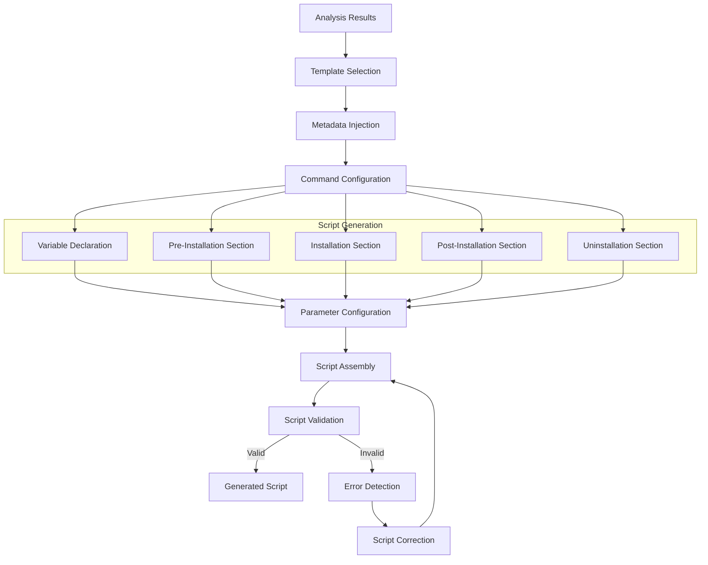

# Story 3.2: PSADT Script Generation

**Status:** Draft

## Non-Technical Explanation

This story is about automating the creation of PowerShell AppDeploy Toolkit installation scripts based on the information gathered during installer analysis. Think of it like having an expert writer who can take your research notes and turn them into a polished document without you having to write anything yourself.

Using the information collected from the installer analysis engine (file type, metadata, commands, requirements, etc.), the system will automatically create complete Deploy-Application.ps1 scripts with all necessary parameters and commands. For packaging engineers, this eliminates the tedious process of manually crafting deployment scripts for each application, dramatically reducing both the time required and the potential for errors.

Similar to how a tax preparation software takes your financial information and generates a complete tax return, this feature transforms raw installer analysis into production-ready PSADT scripts that follow organizational standards and best practices.

## Why This Matters

Automatic script generation addresses several critical challenges in the application packaging process:

1. **Time Efficiency**: Manually creating PSADT scripts is time-consuming, especially for complex applications with many parameters and requirements.

2. **Consistency**: Generated scripts follow consistent patterns and organizational standards, making them easier to maintain and troubleshoot.

3. **Error Reduction**: Automation eliminates common human errors such as typos, missed parameters, or forgotten steps.

4. **Leveraging Analysis**: This feature transforms the valuable information gathered during installer analysis into actionable deployment code.

5. **Knowledge Capture**: Best practices and expert techniques are embedded into the generation logic, allowing less experienced packagers to produce expert-level scripts.

For many organizations, script creation represents 30-50% of the total packaging time. By automating this process, the system dramatically increases packager productivity while improving script quality and consistency.

## Goal & Context

**User Story:** As a packaging engineer, I need the system to generate complete Deploy-Application.ps1 scripts with correct application details and parameters.

**Context:** Building upon the template management capabilities (Story 3.1) and installer analysis (Epic 2), this story adds the ability to automatically generate complete PSADT deployment scripts. These scripts will incorporate all the information learned during analysis to create ready-to-use deployment code.

## Detailed Requirements

- Implement script generation based on application metadata
- Create parameter configuration based on analysis results
- Develop installation command integration
- Implement customization hooks for special cases
- Create validation of generated scripts
- Document script generation process and customization options

## Acceptance Criteria (ACs)

- AC1: Scripts are generated with correct application metadata
- AC2: Parameters are properly configured based on analysis
- AC3: Installation commands work correctly in generated scripts
- AC4: Customization hooks allow for special case handling
- AC5: Validation ensures scripts are syntactically correct

## Technical Implementation Context

**Guidance:** Use the following details for implementation. Refer to the linked `docs/` files for broader context if needed.

- **Relevant Files:**

  - Files to Create: 
    - `backend/apas/agents/psadt/generator/script_generator.py` - Main script generation
    - `backend/apas/agents/psadt/generator/metadata_injector.py` - Metadata integration
    - `backend/apas/agents/psadt/generator/command_formatter.py` - Command formatting
    - `backend/apas/agents/psadt/generator/script_validator.py` - Script validation
    - `backend/apas/models/script.py` - Script generation models
    - `docs/developer-guide/script-generation.md` - Documentation
  - Files to Modify:
    - `backend/apas/agents/psadt/agent.py` - Add script generation integration
    - `backend/apas/api/endpoints/psadt.py` - Add script generation endpoints
  - _(Hint: See `docs/architecture/project-structure.md` for overall layout)_

- **Key Technologies:**

  - Python for script generation logic
  - Jinja2 for template rendering
  - PowerShell for script validation
  - Regular expressions for pattern matching
  - LangChain for complex parameter configuration
  - _(Hint: See `docs/architecture/tech-stack.md` for technology details)_

- **API Interactions / SDK Usage:**

  - Template manager API
  - Analysis results integration
  - PowerShell execution from Python
  - File system operations
  - Event bus for status updates
  - _(Hint: See `docs/architecture/api-reference.md` for API patterns)_

- **Data Structures:**

  - `ScriptGenerationRequest` model for generation requests
  - `ScriptGenerationResult` model for generated scripts
  - `ScriptSection` enum for script sections
  - `CommandParameters` model for parameter mapping
  - `ValidationResult` model for validation feedback
  - _(Hint: See `docs/architecture/data-models.md` for structure details)_

- **Environment Variables:**

  - `DEFAULT_TEMPLATE_ID` - Default template to use
  - `SCRIPT_VALIDATION_TIMEOUT` - Timeout for script validation
  - `ENABLE_AI_SCRIPT_ENHANCEMENTS` - Toggle for AI enhancements
  - _(Hint: See `docs/architecture/environment-vars.md` for details)_

- **Coding Standards Notes:**
  - Use consistent formatting for PowerShell scripts
  - Implement proper error handling for script generation
  - Create detailed logging of generation process
  - Follow PowerShell best practices in generated scripts
  - Use consistent naming conventions
  - _(Hint: See `docs/architecture/coding-standards.md` for full standards)_

## Visual Design Reference

The script generation process follows this workflow:



## Tasks / Subtasks

- [ ] Design script generation architecture
  - [ ] Define script generation models
  - [ ] Create workflow for template selection
  - [ ] Design integration with analysis results
  - [ ] Define validation approach
  - [ ] Create error handling strategy
- [ ] Implement template integration
  - [ ] Create template selection logic
  - [ ] Implement template loading
  - [ ] Develop customization point mapping
  - [ ] Create organization settings application
  - [ ] Implement template validation
- [ ] Implement metadata injection
  - [ ] Create variable declaration generation
  - [ ] Implement application metadata mapping
  - [ ] Develop parameter configuration
  - [ ] Create logging configuration
  - [ ] Implement error handling setup
- [ ] Implement command configuration
  - [ ] Create installation command formatting
  - [ ] Implement parameter mapping
  - [ ] Develop command sequence generation
  - [ ] Create error handling for commands
  - [ ] Implement command logging
- [ ] Implement script section generation
  - [ ] Create pre-installation section generator
  - [ ] Implement installation section generator
  - [ ] Develop post-installation section generator
  - [ ] Create uninstallation section generator
  - [ ] Implement common functions
- [ ] Implement script validation
  - [ ] Create PowerShell syntax validation
  - [ ] Implement structure validation
  - [ ] Develop function checking
  - [ ] Create error reporting
  - [ ] Implement validation logging
- [ ] Implement special case handling
  - [ ] Create customization hooks framework
  - [ ] Implement MSI-specific logic
  - [ ] Develop EXE-specific logic
  - [ ] Create multi-file installation handling
  - [ ] Implement dependency management
- [ ] Create test suite and documentation
  - [ ] Develop test cases with various installer types
  - [ ] Create validation tests
  - [ ] Implement generation performance tests
  - [ ] Create integration tests with analysis results
  - [ ] Develop comprehensive documentation

## Manual Testing Guide (For Non-Technical Users)

You can verify the PSADT script generation is working correctly through these checks:

1. **Basic Script Generation Test**:
   - Upload a simple MSI installer
   - Run the installer analysis
   - Generate a PSADT script
   - Verify that the script contains the correct application metadata
   - Check that the installation command is properly formatted

2. **Parameter Configuration Test**:
   - Upload an installer with known parameters
   - Generate a PSADT script
   - Verify that the parameters are correctly configured in the script
   - Check that special characters are properly escaped
   - Confirm that parameter comments explain their purpose

3. **Script Validation Test**:
   - Generate a script and view the validation results
   - Verify that the script passes syntax validation
   - Check that all required sections are present
   - Confirm that functions are properly implemented
   - Test the script in a test environment if possible

4. **Expected Results**:
   - Generated scripts should be complete and ready to use
   - Scripts should follow organizational standards
   - All application metadata should be correctly populated
   - Installation commands should be properly formatted
   - Error handling should be included for robustness

## Testing Requirements

**Guidance:** Verify implementation against the ACs using the following tests.

- **Unit Tests:** 
  - Test metadata injection logic
  - Verify command formatting
  - Test parameter configuration
  - Validate script validation logic
  - Test template integration

- **Integration Tests:** 
  - Test end-to-end script generation with analysis results
  - Verify script generation with different template types
  - Test handling of various installer formats
  - Validate error handling
  - Test performance with complex installers

- **Manual Verification:** 
  - Test with real-world installers of varying complexity
  - Verify script functionality in test environment
  - Check organizational standards compliance
  - Validate special case handling
  - Test script readability and maintainability

## Implementation Example

Here's an example implementation of the script generation system:

```python
from enum import Enum, auto
from typing import Dict, Any, Optional, List, Union, Set
from pathlib import Path
import logging
import json
import os
import re
import subprocess
import tempfile
from dataclasses import dataclass, field
import jinja2
from datetime import datetime

# Import required models and components
from apas.agents.installer.integration import IntegrationResult
from apas.agents.psadt.templates.manager import TemplateManager, PSADTTemplate
from apas.agents.psadt.templates.validator import TemplateValidator, ValidationResult, ValidationIssue, ValidationSeverity

class ScriptSection(Enum):
    """Sections of a PSADT script."""
    VARIABLES = "variables"
    PRE_INSTALLATION = "pre_installation"
    INSTALLATION = "installation"
    POST_INSTALLATION = "post_installation"
    UNINSTALLATION = "uninstallation"

@dataclass
class CommandParameters:
    """Parameters for installation commands."""
    parameters: Dict[str, str] = field(default_factory=dict)
    switches: List[str] = field(default_factory=list)
    flags: List[str] = field(default_factory=list)
    quoted_params: Set[str] = field(default_factory=set)
    
    def add_parameter(self, name: str, value: str, quoted: bool = False) -> None:
        """Add a parameter."""
        self.parameters[name] = value
        if quoted:
            self.quoted_params.add(name)
    
    def add_switch(self, switch: str) -> None:
        """Add a switch."""
        if switch not in self.switches:
            self.switches.append(switch)
    
    def add_flag(self, flag: str) -> None:
        """Add a flag."""
        if flag not in self.flags:
            self.flags.append(flag)
    
    def format_parameters(self) -> str:
        """Format parameters for PowerShell."""
        parts = []
        
        # Add switches
        parts.extend(self.switches)
        
        # Add flags
        parts.extend(self.flags)
        
        # Add parameters
        for name, value in self.parameters.items():
            if name in self.quoted_params:
                parts.append(f'{name}="{value}"')
            else:
                parts.append(f"{name}={value}")
        
        return " ".join(parts)
    
    def to_dict(self) -> Dict[str, Any]:
        """Convert to dictionary."""
        return {
            "parameters": self.parameters,
            "switches": self.switches,
            "flags": self.flags,
            "quoted_params": list(self.quoted_params)
        }
    
    @classmethod
    def from_dict(cls, data: Dict[str, Any]) -> "CommandParameters":
        """Create from dictionary."""
        params = cls(
            parameters=data.get("parameters", {}),
            switches=data.get("switches", []),
            flags=data.get("flags", [])
        )
        params.quoted_params = set(data.get("quoted_params", []))
        return params

@dataclass
class ScriptGenerationRequest:
    """Request for script generation."""
    analysis_result: IntegrationResult
    template_id: Optional[str] = None
    template_version: Optional[str] = None
    organization_settings: Dict[str, Any] = field(default_factory=dict)
    custom_parameters: Dict[str, Any] = field(default_factory=dict)
    
    def to_dict(self) -> Dict[str, Any]:
        """Convert to dictionary."""
        return {
            "template_id": self.template_id,
            "template_version": self.template_version,
            "organization_settings": self.organization_settings,
            "custom_parameters": self.custom_parameters
        }
    
    @classmethod
    def from_dict(cls, data: Dict[str, Any], analysis_result: IntegrationResult) -> "ScriptGenerationRequest":
        """Create from dictionary."""
        return cls(
            analysis_result=analysis_result,
            template_id=data.get("template_id"),
            template_version=data.get("template_version"),
            organization_settings=data.get("organization_settings", {}),
            custom_parameters=data.get("custom_parameters", {})
        )

@dataclass
class ScriptGenerationResult:
    """Result of script generation."""
    script_content: str
    template_used: PSADTTemplate
    validation_result: ValidationResult
    generation_time: float = 0.0
    sections: Dict[ScriptSection, str] = field(default_factory=dict)
    
    @property
    def is_valid(self) -> bool:
        """Check if the script is valid."""
        return self.validation_result.is_valid
    
    def to_dict(self) -> Dict[str, Any]:
        """Convert to dictionary."""
        return {
            "script_content": self.script_content,
            "template_used": self.template_used.to_dict(),
            "validation_result": {
                "is_valid": self.validation_result.is_valid,
                "issues": [issue.__dict__ for issue in self.validation_result.issues],
                "validation_time": self.validation_result.validation_time
            },
            "generation_time": self.generation_time,
            "sections": {section.name: content for section, content in self.sections.items()}
        }

class ScriptGenerator:
    """Generates PSADT scripts from analysis results."""
    
    def __init__(self, 
                 template_manager: TemplateManager,
                 default_template_id: str,
                 validation_timeout: int = 30,
                 enable_ai_enhancements: bool = False):
        self.logger = logging.getLogger(__name__)
        self.template_manager = template_manager
        self.default_template_id = default_template_id
        self.validation_timeout = validation_timeout
        self.enable_ai_enhancements = enable_ai_enhancements
        self.validator = ScriptValidator(validation_timeout)
        
        # Initialize Jinja2 environment
        self.jinja_env = jinja2.Environment(
            loader=jinja2.FileSystemLoader("."),
            autoescape=jinja2.select_autoescape(),
            keep_trailing_newline=True
        )
        
        # Register custom filters
        self.jinja_env.filters["escape_powershell"] = self._escape_powershell
    
    def generate_script(self, request: ScriptGenerationRequest) -> ScriptGenerationResult:
        """
        Generate a PSADT script.
        
        Args:
            request: Script generation request
            
        Returns:
            ScriptGenerationResult: Generation result
        """
        self.logger.info("Starting script generation")
        start_time = datetime.now()
        
        try:
            # Select template
            template = self._select_template(request)
            if not template:
                raise ValueError("No suitable template found")
            
            self.logger.info(f"Using template: {template.name} v{template.version}")
            
            # Generate script sections
            sections = {}
            sections[ScriptSection.VARIABLES] = self._generate_variables_section(request, template)
            sections[ScriptSection.PRE_INSTALLATION] = self._generate_pre_installation_section(request, template)
            sections[ScriptSection.INSTALLATION] = self._generate_installation_section(request, template)
            sections[ScriptSection.POST_INSTALLATION] = self._generate_post_installation_section(request, template)
            sections[ScriptSection.UNINSTALLATION] = self._generate_uninstallation_section(request, template)
            
            # Load template file
            template_dir = self.template_manager.templates_dir / template.id / f"v{template.version}"
            deploy_app_path = template_dir / "Deploy-Application.ps1"
            
            with open(deploy_app_path, "r") as f:
                template_content = f.read()
            
            # Replace sections in template
            script_content = template_content
            
            # Replace variables section
            script_content = self._replace_section(
                script_content,
                "Variables",
                sections[ScriptSection.VARIABLES]
            )
            
            # Replace pre-installation section
            script_content = self._replace_section(
                script_content,
                "Pre-Installation",
                sections[ScriptSection.PRE_INSTALLATION]
            )
            
            # Replace installation section
            script_content = self._replace_section(
                script_content,
                "Installation",
                sections[ScriptSection.INSTALLATION]
            )
            
            # Replace post-installation section
            script_content = self._replace_section(
                script_content,
                "Post-Installation",
                sections[ScriptSection.POST_INSTALLATION]
            )
            
            # Replace uninstallation section
            script_content = self._replace_section(
                script_content,
                "Uninstallation",
                sections[ScriptSection.UNINSTALLATION]
            )
            
            # Validate generated script
            validation_result = self.validator.validate_script(script_content)
            
            # Create generation result
            result = ScriptGenerationResult(
                script_content=script_content,
                template_used=template,
                validation_result=validation_result,
                sections=sections,
                generation_time=(datetime.now() - start_time).total_seconds()
            )
            
            # Log result
            if result.is_valid:
                self.logger.info("Script generation completed successfully")
            else:
                self.logger.warning(f"Script generation completed with validation issues: {validation_result}")
            
            return result
        except Exception as e:
            self.logger.error(f"Error in script generation: {str(e)}")
            
            # Create validation result for error
            validation_result = ValidationResult(is_valid=False)
            validation_result.add_issue(ValidationIssue(
                severity=ValidationSeverity.ERROR,
                component=None,
                message=f"Script generation failed: {str(e)}"
            ))
            
            # Create error result
            return ScriptGenerationResult(
                script_content="# Error: Script generation failed\n# " + str(e),
                template_used=template if 'template' in locals() else None,
                validation_result=validation_result,
                generation_time=(datetime.now() - start_time).total_seconds()
            )
    
    def _select_template(self, request: ScriptGenerationRequest) -> Optional[PSADTTemplate]:
        """Select the appropriate template."""
        # Use specified template if provided
        if request.template_id:
            return self.template_manager.get_template(
                request.template_id, 
                request.template_version
            )
        
        # Otherwise, select based on installer type
        analysis_result = request.analysis_result
        installer_type = analysis_result.installer_type.value if analysis_result.installer_type else None
        
        if installer_type == "MSI":
            # Look for MSI-specific template
            for template in self.template_manager.get_templates():
                if template.type.value == "msi":
                    return template
        
        # Fall back to default template
        return self.template_manager.get_template(self.default_template_id)
    
    def _generate_variables_section(self, 
                                  request: ScriptGenerationRequest, 
                                  template: PSADTTemplate) -> str:
        """Generate the variables section."""
        analysis_result = request.analysis_result
        
        # Extract metadata
        product_name = analysis_result.product_name.value if analysis_result.product_name else "Unknown Application"
        product_version = analysis_result.product_version.value if analysis_result.product_version else "1.0.0"
        publisher = analysis_result.publisher.value if analysis_result.publisher else "Unknown Publisher"
        
        # Build variables section
        variables = []
        variables.append(f'$appVendor = "{self._escape_powershell(publisher)}"')
        variables.append(f'$appName = "{self._escape_powershell(product_name)}"')
        variables.append(f'$appVersion = "{self._escape_powershell(product_version)}"')
        variables.append(f'$appArch = ""')
        variables.append(f'$appLang = "EN"')
        variables.append(f'$appRevision = "01"')
        variables.append(f'$appScriptVersion = "1.0.0"')
        variables.append(f'$appScriptDate = "{datetime.now().strftime("%Y-%m-%d")}"')
        variables.append(f'$appScriptAuthor = "APAS System"')
        
        # Build package name
        variables.append(f'$appPackageDisplayName = "$appVendor $appName $appVersion"')
        
        # Add custom variables from request
        for name, value in request.custom_parameters.get("variables", {}).items():
            if isinstance(value, str):
                variables.append(f'${name} = "{self._escape_powershell(value)}"')
            else:
                variables.append(f'${name} = {value}')
        
        return "\n".join(variables)
    
    def _generate_pre_installation_section(self, 
                                         request: ScriptGenerationRequest, 
                                         template: PSADTTemplate) -> str:
        """Generate the pre-installation section."""
        analysis_result = request.analysis_result
        
        # Build pre-installation steps
        steps = []
        
        # Add comment
        steps.append("# Perform pre-installation tasks here")
        
        # Check disk space
        steps.append("""
# Check disk space
$drive = $envSystemDrive.Substring(0, 2)
$requiredSpace = 500 # MB
$freeSpace = [math]::Round((Get-PSDrive -Name $drive.Substring(0, 1) | Select-Object -ExpandProperty Free) / 1MB)
Write-Log "Free space on $drive`: $freeSpace MB"
if ($freeSpace -lt $requiredSpace) {
    Show-InstallationPrompt -Message "There is not enough disk space available to install this application. Please free up at least $requiredSpace MB and try again." -ButtonRightText "OK" -Icon Error
    Exit-Script -ExitCode 1618
}
""")
        
        # Close running applications if specified
        apps_to_close = request.custom_parameters.get("close_applications", [])
        if apps_to_close:
            app_list = ', '.join([f'"{app}"' for app in apps_to_close])
            steps.append(f"""
# Close running applications
Show-InstallationWelcome -CloseApps {app_list} -AllowDefer -DeferTimes 3
""")
        else:
            steps.append("""
# Show installation welcome
Show-InstallationWelcome -AllowDefer -DeferTimes 3
""")
        
        # Check for prerequisites
        prerequisites = analysis_result.prerequisites
        if prerequisites:
            steps.append("\n# Check prerequisites")
            for name, req in prerequisites.items():
                if ".NET Framework" in req.value:
                    # Extract version if present
                    version_match = re.search(r'(\d+\.\d+)', req.value)
                    if version_match:
                        version = version_match.group(1)
                        steps.append(f"""
# Check for .NET Framework {version}
$netFramework = Get-RegistryKey -Key "HKLM:\\SOFTWARE\\Microsoft\\NET Framework Setup\\NDP\\v4\\Full" -Value "Release" -ContinueOnError $true
if ($netFramework -lt 394802) {{ # .NET Framework {version} release value
    Show-InstallationPrompt -Message ".NET Framework {version} or higher is required for this application." -ButtonRightText "OK" -Icon Error
    Exit-Script -ExitCode 1618
}}
""")
            
        # Force specific exit code on uninstall if required
        if request.custom_parameters.get("force_uninstall_exit_code"):
            exit_code = request.custom_parameters.get("force_uninstall_exit_code")
            steps.append(f"""
# Force exit code on uninstall
if ($deploymentType -eq "Uninstall") {{
    $mainExitCode = {exit_code}
}}
""")
        
        return "\n".join(steps)
    
    def _generate_installation_section(self, 
                                     request: ScriptGenerationRequest, 
                                     template: PSADTTemplate) -> str:
        """Generate the installation section."""
        analysis_result = request.analysis_result
        
        # Determine installation command
        install_command = analysis_result.silent_install_command.value if analysis_result.silent_install_command else None
        
        if not install_command:
            # Fallback to basic MSI command if installer type is MSI
            installer_type = analysis_result.installer_type.value if analysis_result.installer_type else None
            if installer_type == "MSI":
                install_command = "msiexec.exe /i \"$dirFiles\\application.msi\" /qn"
            else:
                install_command = "& \"$dirFiles\\setup.exe\" /S"
        
        # Format the command for PSADT
        formatted_command = self._format_installation_command(install_command, installer_type)
        
        # Build installation steps
        steps = []
        
        # Add comment
        steps.append("# Perform installation tasks here")
        
        # Add installation command with proper error handling
        steps.append(f"""
# Install the application
Write-Log "Installing $appPackageDisplayName..."
{formatted_command}

# Check exit code
if ($global:LastExitCode -ne 0) {{
    Write-Log "Installation failed with exit code $($global:LastExitCode)" -Severity 3 -Source $deployAppScriptFriendlyName
    Show-InstallationPrompt -Message "Installation failed with exit code $($global:LastExitCode). Please contact support." -ButtonRightText "OK" -Icon Error
    Exit-Script -ExitCode $global:LastExitCode
}}
""")
        
        return "\n".join(steps)
    
    def _generate_post_installation_section(self, 
                                          request: ScriptGenerationRequest, 
                                          template: PSADTTemplate) -> str:
        """Generate the post-installation section."""
        analysis_result = request.analysis_result
        
        # Build post-installation steps
        steps = []
        
        # Add comment
        steps.append("# Perform post-installation tasks here")
        
        # Clean up if specified
        if request.custom_parameters.get("perform_cleanup", True):
            steps.append("""
# Clean up installation files if needed
# Remove-Item -Path "$dirFiles\\*" -Force -Recurse -ErrorAction SilentlyContinue
""")
        
        # Add shortcuts if specified
        shortcuts = request.custom_parameters.get("create_shortcuts", [])
        if shortcuts:
            steps.append("\n# Create shortcuts")
            for shortcut in shortcuts:
                target = shortcut.get("target", "")
                destination = shortcut.get("destination", "")
                name = shortcut.get("name", "")
                if target and destination and name:
                    steps.append(f"""
# Create shortcut for {name}
New-Shortcut -Path "$({destination})\\{name}.lnk" -TargetPath "{target}" -IconLocation "{target}" -Description "{name}"
""")
        
        # Verify installation
        executable_files = analysis_result.executable_files
        if executable_files:
            steps.append("\n# Verify installation")
            # Pick the first executable file
            for _, exe in executable_files.items():
                exe_path = exe.value
                if not exe_path:
                    continue
                    
                # Extract file path
                path_match = re.search(r'([^\(\)]+)\s*\(', exe_path)
                if path_match:
                    file_path = path_match.group(1).strip()
                    steps.append(f"""
# Verify installation by checking for executable
$exePath = "{file_path}"
if (-not (Test-Path -Path $exePath)) {{
    Write-Log "Installation verification failed: $exePath not found" -Severity 2 -Source $deployAppScriptFriendlyName
    # This is just a warning, not a fatal error
}}
""")
                    break
        
        # Show installation completion message
        steps.append("""
# Show installation completed message
Show-InstallationPrompt -Message "$appPackageDisplayName has been successfully installed." -ButtonRightText "OK" -Icon Information
""")
        
        return "\n".join(steps)
    
    def _generate_uninstallation_section(self, 
                                       request: ScriptGenerationRequest, 
                                       template: PSADTTemplate) -> str:
        """Generate the uninstallation section."""
        analysis_result = request.analysis_result
        
        # Determine uninstallation command
        uninstall_command = analysis_result.uninstall_command.value if analysis_result.uninstall_command else None
        
        if not uninstall_command:
            # Fallback to basic MSI command if installer type is MSI
            installer_type = analysis_result.installer_type.value if analysis_result.installer_type else None
            if installer_type == "MSI":
                # Try to get product code
                product_code = ""
                for param_name, param_value in analysis_result.command_parameters.items():
                    if param_name.lower() == "productcode" or param_name.lower() == "product_code":
                        product_code = param_value.value
                        break
                
                if product_code:
                    uninstall_command = f"msiexec.exe /x {product_code} /qn"
                else:
                    uninstall_command = "msiexec.exe /x \"$dirFiles\\application.msi\" /qn"
            else:
                uninstall_command = "& \"$dirFiles\\uninstall.exe\" /S"
        
        # Format the command for PSADT
        formatted_command = self._format_installation_command(uninstall_command, installer_type, is_uninstall=True)
        
        # Build uninstallation steps
        steps = []
        
        # Add comment
        steps.append("# Perform uninstallation tasks here")
        
        # Add uninstallation command with proper error handling
        steps.append(f"""
# Uninstall the application
Write-Log "Uninstalling $appPackageDisplayName..."
{formatted_command}

# Check exit code
if ($global:LastExitCode -ne 0) {{
    Write-Log "Uninstallation failed with exit code $($global:LastExitCode)" -Severity 3 -Source $deployAppScriptFriendlyName
    Show-InstallationPrompt -Message "Uninstallation failed with exit code $($global:LastExitCode). Please contact support." -ButtonRightText "OK" -Icon Error
    Exit-Script -ExitCode $global:LastExitCode
}}
""")
        
        # Clean up shortcuts if specified
        shortcuts = request.custom_parameters.get("create_shortcuts", [])
        if shortcuts:
            steps.append("\n# Remove shortcuts")
            for shortcut in shortcuts:
                destination = shortcut.get("destination", "")
                name = shortcut.get("name", "")
                if destination and name:
                    steps.append(f"""
# Remove shortcut for {name}
Remove-Item -Path "$({destination})\\{name}.lnk" -Force -ErrorAction SilentlyContinue
""")
        
        # Show uninstallation completion message
        steps.append("""
# Show uninstallation completed message
Show-InstallationPrompt -Message "$appPackageDisplayName has been successfully uninstalled." -ButtonRightText "OK" -Icon Information
""")
        
        return "\n".join(steps)
    
    def _format_installation_command(self, 
                                   command: str, 
                                   installer_type: Optional[str] = None,
                                   is_uninstall: bool = False) -> str:
        """Format an installation command for PSADT."""
        if not command:
            return "# No installation command available"
        
        # Replace file paths with PSADT variables
        command = command.replace("C:\\Program Files\\", "$envProgramFiles\\")
        command = command.replace("C:\\Program Files (x86)\\", "$envProgramFilesX86\\")
        command = command.replace("%ProgramFiles%", "$envProgramFiles")
        command = command.replace("%ProgramFiles(x86)%", "$envProgramFilesX86")
        command = command.replace("%TEMP%", "$envTemp")
        command = command.replace("%SystemRoot%", "$envSystemRoot")
        
        # Detect if this is an MSI command
        is_msi = installer_type == "MSI" or command.lower().startswith("msiexec")
        
        if is_msi:
            # Format MSI command with Execute-MSI
            return self._format_msi_command(command, is_uninstall)
        else:
            # Format EXE command with Execute-Process
            return self._format_exe_command(command)
    
    def _format_msi_command(self, command: str, is_uninstall: bool = False) -> str:
        """Format an MSI command for PSADT."""
        # Extract MSI path or product code
        msi_path = ""
        msi_params = {}
        
        # Look for /i or /x parameter
        i_match = re.search(r'/[iI]\s*"?([^"\s]+)"?', command)
        x_match = re.search(r'/[xX]\s*"?([^"\s]+)"?', command)
        
        if is_uninstall and x_match:
            msi_path = x_match.group(1).strip()
        elif not is_uninstall and i_match:
            msi_path = i_match.group(1).strip()
        
        # Extract other parameters
        param_matches = re.finditer(r'([A-Za-z0-9_]+)="?([^"\s]+)"?', command)
        for match in param_matches:
            name = match.group(1)
            value = match.group(2)
            msi_params[name] = value
        
        # Check for basic switches
        for switch in ["/qn", "/quiet", "/passive"]:
            if switch in command.lower():
                # These are handled automatically by Execute-MSI
                pass
        
        # Format parameters
        params_str = ""
        if msi_params:
            params_list = []
            for name, value in msi_params.items():
                if value == "":
                    params_list.append(f"{name}")
                else:
                    params_list.append(f'{name}="{value}"')
            params_str = f' -Parameters "{" ".join(params_list)}"'
        
        # Create Execute-MSI command
        if msi_path.endswith(".msi"):
            # It's a file path
            file_path = msi_path
            if not file_path.startswith("$dir"):
                # Assume it's in the Files directory
                file_path = f"$dirFiles\\{os.path.basename(file_path)}"
            
            if is_uninstall:
                return f'Execute-MSI -Action Uninstall -Path "{file_path}"{params_str}'
            else:
                return f'Execute-MSI -Action Install -Path "{file_path}"{params_str}'
        else:
            # It's probably a product code
            if is_uninstall:
                return f'Execute-MSI -Action Uninstall -Path "{msi_path}"{params_str}'
            else:
                return f'Execute-MSI -Action Install -Path "{msi_path}"{params_str}'
    
    def _format_exe_command(self, command: str) -> str:
        """Format an EXE command for PSADT."""
        # Check if command starts with a path
        if command.startswith('"'):
            # Extract path between quotes
            path_match = re.match(r'"([^"]+)"', command)
            if path_match:
                exe_path = path_match.group(1)
                # Extract parameters after the closing quote
                params_start = command.find('"', 1) + 1
                params = command[params_start:].strip()
        elif command.startswith('&'):
            # PowerShell invocation
            command = command.strip()
            path_match = re.search(r'&\s*"([^"]+)"', command)
            if path_match:
                exe_path = path_match.group(1)
                # Extract parameters after the closing quote
                params_start = command.find('"', command.find('"') + 1) + 1
                params = command[params_start:].strip()
        else:
            # Command doesn't start with a quote, look for first space
            space_index = command.find(' ')
            if space_index > 0:
                exe_path = command[:space_index].strip()
                params = command[space_index:].strip()
            else:
                exe_path = command
                params = ""
        
        # Check for relative path or filename only
        if not exe_path.startswith("$") and not re.match(r'^[A-Za-z]:\\', exe_path):
            # Assume it's in the Files directory
            exe_path = f"$dirFiles\\{exe_path}"
        
        # Format parameters
        params_str = f' -Parameters "{params}"' if params else ""
        
        # Create Execute-Process command
        return f'Execute-Process -Path "{exe_path}"{params_str}'
    
    def _replace_section(self, content: str, section_name: str, section_content: str) -> str:
        """Replace a section in the template."""
        # Look for section markers
        pattern = rf"##\*{section_name}.*?##\*{section_name} completed\s*"
        
        match = re.search(pattern, content, re.DOTALL)
        if not match:
            self.logger.warning(f"Section marker for {section_name} not found in template")
            return content
        
        # Extract the section
        section = match.group(0)
        
        # Find the insertion point
        lines = section.split("\n")
        insertion_line = ""
        
        for line in lines:
            if "<Perform " in line and "tasks here>" in line:
                insertion_line = line
                break
        
        if not insertion_line:
            # No specific insertion point found, insert after section marker
            for i, line in enumerate(lines):
                if f"##*{section_name}" in line:
                    insertion_line = lines[i+1] if i+1 < len(lines) else ""
                    break
        
        if insertion_line:
            # Replace the insertion line with the new content
            new_section = section.replace(insertion_line, section_content)
            return content.replace(section, new_section)
        
        # Fallback: Append content to the end of the section
        new_section = section.rstrip() + "\n" + section_content + "\n"
        return content.replace(section, new_section)
    
    def _escape_powershell(self, text: str) -> str:
        """Escape special characters for PowerShell strings."""
        if not text:
            return ""
            
        # Escape backticks first (since they're used to escape other characters)
        text = text.replace("`", "``")
        
        # Escape double quotes
        text = text.replace('"', '`"')
        
        # Escape dollar signs
        text = text.replace("$", "`$")
        
        return text

class ScriptValidator:
    """Validates PSADT scripts."""
    
    def __init__(self, validation_timeout: int = 30):
        self.logger = logging.getLogger(__name__)
        self.validation_timeout = validation_timeout
    
    def validate_script(self, script_content: str) -> ValidationResult:
        """
        Validate a PSADT script.
        
        Args:
            script_content: Script content to validate
            
        Returns:
            ValidationResult: Validation results
        """
        self.logger.info("Validating PSADT script")
        
        # Create validation result
        result = ValidationResult(is_valid=True)
        
        try:
            # Create temporary file
            with tempfile.NamedTemporaryFile(suffix=".ps1", delete=False) as temp_file:
                temp_path = temp_file.name
                temp_file.write(script_content.encode("utf-8"))
            
            # Validate PowerShell syntax
            cmd = [
                "powershell",
                "-NoProfile",
                "-NonInteractive",
                "-Command",
                f"$ErrorActionPreference = 'Stop'; try {{ [Void][System.Management.Automation.Language.Parser]::ParseFile('{temp_path}', [ref]$null, [ref]$null) }} catch {{ Write-Error $_.Exception.Message; exit 1 }}"
            ]
            
            process = subprocess.run(
                cmd,
                text=True,
                capture_output=True,
                timeout=self.validation_timeout
            )
            
            if process.returncode != 0:
                # Parse error message
                error_msg = process.stderr.strip()
                line_match = re.search(r"At line:(\d+)", error_msg)
                line_number = int(line_match.group(1)) if line_match else None
                
                result.add_issue(ValidationIssue(
                    severity=ValidationSeverity.ERROR,
                    component=None,
                    message=f"PowerShell syntax error: {error_msg}",
                    line_number=line_number
                ))
            
            # Check for required PSADT functions
            required_functions = [
                "Show-InstallationPrompt",
                "Show-InstallationWelcome",
                "Execute-Process",
                "Execute-MSI",
                "Write-Log"
            ]
            
            for function in required_functions:
                if function not in script_content:
                    result.add_issue(ValidationIssue(
                        severity=ValidationSeverity.WARNING,
                        component=None,
                        message=f"Required PSADT function '{function}' not used in script"
                    ))
            
            # Check for required PSADT sections
            required_sections = [
                "Pre-Installation",
                "Installation",
                "Post-Installation"
            ]
            
            for section in required_sections:
                if f"##*{section}" not in script_content:
                    result.add_issue(ValidationIssue(
                        severity=ValidationSeverity.ERROR,
                        component=None,
                        message=f"Required PSADT section '{section}' not found in script"
                    ))
        except subprocess.TimeoutExpired:
            result.add_issue(ValidationIssue(
                severity=ValidationSeverity.ERROR,
                component=None,
                message=f"Script validation timed out after {self.validation_timeout} seconds"
            ))
            result.is_valid = False
        except Exception as e:
            result.add_issue(ValidationIssue(
                severity=ValidationSeverity.ERROR,
                component=None,
                message=f"Error validating script: {str(e)}"
            ))
            result.is_valid = False
        finally:
            # Clean up temporary file
            if 'temp_path' in locals():
                try:
                    os.unlink(temp_path)
                except:
                    pass
        
        return result

# Example usage
if __name__ == "__main__":
    # Configure logging
    logging.basicConfig(level=logging.INFO)
    
    # Create template manager
    template_manager = TemplateManager("templates", "powershell")
    
    # Create script generator
    generator = ScriptGenerator(
        template_manager=template_manager,
        default_template_id="standard",
        validation_timeout=30,
        enable_ai_enhancements=True
    )
    
    # Create mock analysis result
    analysis_result = IntegrationResult(
        installer_type=SourcedValue(value="MSI", source="INSTALLER_DETECTION", confidence=0.9),
        product_name=SourcedValue(value="Example Application", source="METADATA_EXTRACTION", confidence=0.9),
        product_version=SourcedValue(value="1.0.0", source="METADATA_EXTRACTION", confidence=0.9),
        publisher=SourcedValue(value="Example Inc.", source="METADATA_EXTRACTION", confidence=0.9),
        silent_install_command=SourcedValue(value="msiexec /i example.msi /qn", source="COMMAND_ANALYSIS", confidence=0.9)
    )
    
    # Create generation request
    request = ScriptGenerationRequest(
        analysis_result=analysis_result,
        template_id="standard",
        custom_parameters={
            "close_applications": ["example.exe", "helper.exe"],
            "create_shortcuts": [
                {
                    "target": "$envProgramFiles\\Example Inc.\\Example Application\\example.exe",
                    "destination": "$envProgramData\\Microsoft\\Windows\\Start Menu\\Programs",
                    "name": "Example Application"
                }
            ]
        }
    )
    
    # Generate script
    result = generator.generate_script(request)
    
    # Print result
    print(f"Script generation {'succeeded' if result.is_valid else 'failed'}")
    print(f"Template used: {result.template_used.name} v{result.template_used.version}")
    print(f"Generation time: {result.generation_time:.2f} seconds")
    print("\nGenerated Script:")
    print(result.script_content)
```

## Story Wrap Up (Agent Populates After Execution)

- **Agent Model Used:** 
- **Completion Notes:** 
- **Change Log:** 
  - Initial Draft