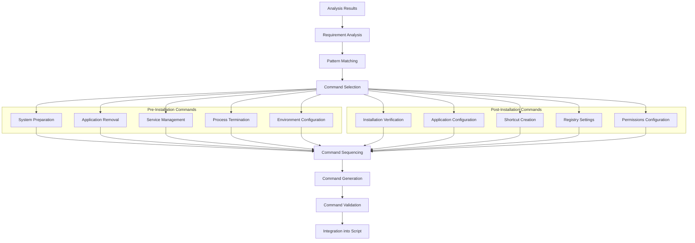

# Story 3.3: Pre/Post-Installation Commands

**Status:** Draft

## Non-Technical Explanation

This story is about automatically generating commands that run before and after the main installation to ensure everything works properly. Think of it like a chef prepping ingredients before cooking and then checking the dish before serving.

Pre-installation commands might prepare the system by stopping conflicting services, removing old versions, or creating necessary folders. Post-installation commands might configure the application, create shortcuts, register components, or verify files were installed correctly.

The system will analyze the installer and application requirements to determine what preparation and verification steps are needed. It will then generate appropriate PowerShell AppDeploy Toolkit commands to handle these tasks automatically.

This is similar to how a surgical team prepares an operating room before surgery and performs important follow-up steps afterward. Having these steps automated ensures consistent, reliable deployments even for complex applications that need special handling.

## Why This Matters

Proper pre and post-installation commands are crucial for several reasons:

1. **System Preparation**: Many applications require specific system conditions before they can be installed successfully.

2. **Clean Installation**: Removing old versions or conflicting components ensures a clean environment for the new installation.

3. **Verification**: Post-installation commands confirm the application was installed correctly and is functioning as expected.

4. **Configuration**: Many applications need post-installation configuration to work properly in an enterprise environment.

5. **Error Prevention**: Proper preparation and verification dramatically reduce deployment failures and support tickets.

Without these commands, deployments would frequently fail or result in improperly configured applications. By automatically generating appropriate pre/post steps, the system ensures consistent, reliable installations across the enterprise.

## Goal & Context

**User Story:** As a packaging engineer, I need the system to generate appropriate pre/post-installation commands for successful application deployment.

**Context:** Building upon the PSADT script generation capability (Story 3.2), this story adds intelligence to determine and generate appropriate commands to prepare the system before installation and configure/verify the application after installation.

## Detailed Requirements

- Implement detection of required pre-installation tasks
- Create generation of post-installation verification commands
- Develop integration of application-specific requirements
- Implement AI-assisted command generation
- Create validation of command sequences
- Document command generation methodology and limitations

## Acceptance Criteria (ACs)

- AC1: Pre-installation commands correctly prepare the system
- AC2: Post-installation commands verify successful deployment
- AC3: Application-specific requirements are properly handled
- AC4: AI assistance improves command quality for complex cases
- AC5: Validation ensures commands will execute properly

## Technical Implementation Context

**Guidance:** Use the following details for implementation. Refer to the linked `docs/` files for broader context if needed.

- **Relevant Files:**

  - Files to Create: 
    - `backend/apas/agents/psadt/commands/pre_install.py` - Pre-installation command generation
    - `backend/apas/agents/psadt/commands/post_install.py` - Post-installation command generation
    - `backend/apas/agents/psadt/commands/command_analyzer.py` - Command analysis utilities
    - `backend/apas/agents/psadt/commands/pattern_matcher.py` - Pattern matching for common needs
    - `backend/apas/models/commands.py` - Command models and structures
    - `docs/developer-guide/pre-post-commands.md` - Documentation
  - Files to Modify:
    - `backend/apas/agents/psadt/generator/script_generator.py` - Integrate command generation
    - `backend/apas/agents/psadt/agent.py` - Add command generation capabilities
  - _(Hint: See `docs/architecture/project-structure.md` for overall layout)_

- **Key Technologies:**

  - Python for command generation logic
  - Pattern matching algorithms
  - PowerShell command templates
  - PSADT function library integration
  - LangChain for AI-assisted generation
  - _(Hint: See `docs/architecture/tech-stack.md` for technology details)_

- **API Interactions / SDK Usage:**

  - Analysis results integration
  - Content inventory API
  - Knowledge repository for patterns
  - PSADT function library
  - _(Hint: See `docs/architecture/api-reference.md` for API patterns)_

- **Data Structures:**

  - `PreInstallCommand` model for pre-installation commands
  - `PostInstallCommand` model for post-installation commands
  - `CommandType` enum for command categorization
  - `CommandPriority` enum for ordering
  - `DependencyChain` model for command dependencies
  - _(Hint: See `docs/architecture/data-models.md` for structure details)_

- **Environment Variables:**

  - `MAX_COMMANDS_PER_SECTION` - Limit commands per section
  - `ENABLE_ADVANCED_PREPARATION` - Enable complex pre-installation tasks
  - `ENABLE_EXTENSIVE_VERIFICATION` - Enable detailed post-install checks
  - _(Hint: See `docs/architecture/environment-vars.md` for details)_

- **Coding Standards Notes:**
  - Follow PowerShell best practices for generated commands
  - Create comprehensive error handling
  - Implement proper command sequencing
  - Provide detailed comments in generated code
  - Use standardized PSADT functions whenever possible
  - _(Hint: See `docs/architecture/coding-standards.md` for full standards)_

## Visual Design Reference

The pre/post command generation follows this workflow:



## Tasks / Subtasks

- [ ] Design command generation architecture
  - [ ] Define command models and enums
  - [ ] Create workflow for requirement analysis
  - [ ] Design pattern matching approach
  - [ ] Define command selection criteria
  - [ ] Create command sequencing strategy
- [ ] Implement pre-installation command generation
  - [ ] Create system preparation commands
  - [ ] Implement application removal logic
  - [ ] Develop service management commands
  - [ ] Create process termination logic
  - [ ] Implement environment configuration
- [ ] Implement post-installation command generation
  - [ ] Create installation verification commands
  - [ ] Implement application configuration
  - [ ] Develop shortcut creation logic
  - [ ] Create registry settings commands
  - [ ] Implement permission configuration
- [ ] Implement pattern matching
  - [ ] Create installer pattern detector
  - [ ] Implement common dependency patterns
  - [ ] Develop application type patterns
  - [ ] Create conflict detection patterns
  - [ ] Implement configuration requirements
- [ ] Implement command sequencing
  - [ ] Create dependency chain analysis
  - [ ] Implement priority-based ordering
  - [ ] Develop conflict resolution
  - [ ] Create grouped command organization
  - [ ] Implement conditional sequencing
- [ ] Implement AI-assisted command enhancement
  - [ ] Create prompt generation for complex cases
  - [ ] Implement response parsing
  - [ ] Develop command transformation
  - [ ] Create validation of AI suggestions
  - [ ] Implement fallback mechanisms
- [ ] Implement command validation
  - [ ] Create PowerShell syntax validation
  - [ ] Implement PSADT function validation
  - [ ] Develop execution safety checks
  - [ ] Create error handling validation
  - [ ] Implement requirement coverage validation
- [ ] Create test suite and documentation
  - [ ] Develop test cases for various application types
  - [ ] Create validation tests
  - [ ] Implement integration tests
  - [ ] Create comprehensive user documentation
  - [ ] Develop internal documentation

## Manual Testing Guide (For Non-Technical Users)

You can verify the pre/post-installation command generation is working correctly through these checks:

1. **Pre-Installation Command Test**:
   - Upload an installer with known requirements (e.g., requires .NET Framework)
   - Generate a PSADT script with pre/post commands
   - Check that the script includes commands to verify .NET Framework
   - Verify that commands to stop related applications are included
   - Confirm that any necessary environment preparation is included

2. **Post-Installation Command Test**:
   - Upload an installer with known outputs (e.g., creates specific files)
   - Generate a PSADT script with pre/post commands
   - Check that the script includes verification of critical files
   - Verify that any required configuration is performed
   - Confirm that shortcuts are created correctly

3. **Application-Specific Test**:
   - Upload an installer for an application with unique requirements
   - Generate a PSADT script
   - Verify that application-specific commands are included
   - Check that the commands handle special cases correctly
   - Confirm that commands are properly sequenced

4. **Expected Results**:
   - Pre-installation commands should prepare the system appropriately
   - Post-installation commands should verify installation success
   - Commands should be properly sequenced with dependencies
   - Error handling should be included for robustness
   - Special cases should be handled correctly

## Testing Requirements

**Guidance:** Verify implementation against the ACs using the following tests.

- **Unit Tests:** 
  - Test pattern matching algorithms
  - Verify command generation for known cases
  - Test sequencing logic with dependencies
  - Validate PowerShell syntax generation
  - Test AI assistance with mock responses

- **Integration Tests:** 
  - Test end-to-end command generation with analysis results
  - Verify integration into script generation
  - Test with various installer types
  - Validate command execution in test environment
  - Test error handling and recovery

- **Manual Verification:** 
  - Test with real-world installers with special requirements
  - Verify commands execute correctly in test environment
  - Check error handling with intentional failures
  - Validate complex dependency chains
  - Test with applications requiring unusual preparation

## Implementation Example

Here's an example implementation of the pre/post installation command generation system:

```python
from enum import Enum, auto
from typing import Dict, Any, Optional, List, Set, Tuple
from dataclasses import dataclass, field
import logging
import re
from datetime import datetime

# Import required models
from apas.agents.installer.integration import IntegrationResult
from apas.agents.installer.content_inventory import ContentInventoryResult
from apas.models.script import ScriptSection

class CommandType(Enum):
    """Types of pre/post installation commands."""
    PROCESS_MANAGEMENT = auto()        # Process stopping/starting
    SERVICE_MANAGEMENT = auto()        # Service stopping/starting
    REGISTRY_MANAGEMENT = auto()       # Registry modification
    FILE_SYSTEM_MANAGEMENT = auto()    # File system operations
    SHORTCUT_MANAGEMENT = auto()       # Shortcut creation/deletion
    DEPENDENCY_MANAGEMENT = auto()     # Dependency checking/installation
    VERIFICATION = auto()              # Installation verification
    CONFIGURATION = auto()             # Application configuration
    ENVIRONMENT_SETUP = auto()         # Environment preparation
    CLEANUP = auto()                   # Cleanup operations
    OTHER = auto()                     # Other command types

class CommandPriority(Enum):
    """Priority levels for command execution."""
    CRITICAL = 100     # Must be executed first
    HIGH = 75          # Should be executed early
    MEDIUM = 50        # Standard priority
    LOW = 25           # Can be executed later
    OPTIONAL = 0       # Optional commands

@dataclass
class CommandDependency:
    """Represents a dependency between commands."""
    dependent_command_id: str
    dependency_command_id: str
    is_hard_dependency: bool = True    # If True, dependent must run after dependency
    
    def __str__(self) -> str:
        """Return a string representation of the dependency."""
        return f"{self.dependent_command_id} depends on {self.dependency_command_id}"

@dataclass
class PSADTCommand:
    """Base class for PSADT commands."""
    id: str
    command_type: CommandType
    priority: CommandPriority
    psadt_function: str
    parameters: Dict[str, Any] = field(default_factory=dict)
    description: str = ""
    success_criteria: Optional[str] = None
    error_handling: Optional[str] = None
    dependencies: List[str] = field(default_factory=list)
    
    def format_parameters(self) -> str:
        """Format parameters for PowerShell."""
        param_strings = []
        
        for name, value in self.parameters.items():
            if isinstance(value, bool):
                # Boolean parameters are either included or not
                if value:
                    param_strings.append(f"-{name}")
            elif isinstance(value, str):
                # String parameters are quoted
                param_strings.append(f'-{name} "{self._escape_string(value)}"')
            elif isinstance(value, list):
                # List parameters are formatted as arrays
                values_str = ", ".join([f'"{self._escape_string(str(v))}"' for v in value])
                param_strings.append(f'-{name} @({values_str})')
            else:
                # Other parameter types
                param_strings.append(f'-{name} {value}')
        
        return " ".join(param_strings)
    
    def _escape_string(self, text: str) -> str:
        """Escape special characters for PowerShell strings."""
        if not text:
            return ""
        
        # Escape backticks first (since they're used to escape other characters)
        text = text.replace("`", "``")
        
        # Escape double quotes
        text = text.replace('"', '`"')
        
        # Escape dollar signs
        text = text.replace("$", "`$")
        
        return text
    
    def generate_command(self) -> str:
        """Generate the full PowerShell command."""
        # Format parameters
        params = self.format_parameters()
        
        # Generate command
        command = f"{self.psadt_function} {params}"
        
        # Add comments
        if self.description:
            command = f"# {self.description}\n{command}"
        
        # Add error handling if specified
        if self.error_handling:
            command = f"""try {{
    {command}
}} catch {{
    {self.error_handling}
}}"""
        
        return command
    
    def __str__(self) -> str:
        """Return a string representation of the command."""
        return f"{self.id}: {self.psadt_function} ({self.command_type.name}, {self.priority.name})"

@dataclass
class PreInstallCommand(PSADTCommand):
    """Command to be executed during pre-installation phase."""
    is_conditional: bool = False
    condition: Optional[str] = None
    skip_on_upgrade: bool = False
    
    def generate_command(self) -> str:
        """Generate the full PowerShell command with conditions."""
        # Get base command
        command = super().generate_command()
        
        # Add conditional logic if specified
        if self.is_conditional and self.condition:
            command = f"""if ({self.condition}) {{
    {command}
}}"""
        
        # Add upgrade check if specified
        if self.skip_on_upgrade:
            command = f"""if (-not $upgradeDetected) {{
    {command}
}}"""
        
        return command

@dataclass
class PostInstallCommand(PSADTCommand):
    """Command to be executed during post-installation phase."""
    verify_success: bool = True
    notification_on_failure: bool = False
    cleanup_on_success: bool = False
    
    def generate_command(self) -> str:
        """Generate the full PowerShell command with verification."""
        # Get base command
        command = super().generate_command()
        
        # Add verification if specified
        if self.verify_success and self.success_criteria:
            command = f"""{command}

# Verify success
if ({self.success_criteria}) {{
    Write-Log -Message "Post-installation task successful: {self.description}" -Source $deployAppScriptFriendlyName
    {f"Remove-Item -Path \"$tempPath\\{self.id}*\" -Force -ErrorAction SilentlyContinue" if self.cleanup_on_success else ""}
}} else {{
    Write-Log -Message "Post-installation task failed: {self.description}" -Severity 2 -Source $deployAppScriptFriendlyName
    {f"Show-InstallationPrompt -Message \"Post-installation task failed: {self.description}\" -ButtonRightText \"OK\" -Icon Error" if self.notification_on_failure else ""}
}}"""
        
        return command

class CommandGenerator:
    """Generates pre/post installation commands."""
    
    def __init__(self, 
                max_commands_per_section: int = 20,
                enable_advanced_preparation: bool = True,
                enable_extensive_verification: bool = True):
        self.logger = logging.getLogger(__name__)
        self.max_commands_per_section = max_commands_per_section
        self.enable_advanced_preparation = enable_advanced_preparation
        self.enable_extensive_verification = enable_extensive_verification
        self.command_count = 0
    
    def generate_commands(self, 
                        analysis_result: IntegrationResult,
                        inventory_result: Optional[ContentInventoryResult] = None) -> Tuple[List[PreInstallCommand], List[PostInstallCommand]]:
        """
        Generate pre and post installation commands.
        
        Args:
            analysis_result: Result of installer analysis
            inventory_result: Optional inventory of installer contents
            
        Returns:
            Tuple[List[PreInstallCommand], List[PostInstallCommand]]: Generated commands
        """
        self.logger.info("Generating pre/post installation commands")
        self.command_count = 0
        
        # Generate pre-installation commands
        pre_commands = self._generate_pre_install_commands(analysis_result, inventory_result)
        
        # Generate post-installation commands
        post_commands = self._generate_post_install_commands(analysis_result, inventory_result)
        
        self.logger.info(f"Generated {len(pre_commands)} pre-installation commands and {len(post_commands)} post-installation commands")
        
        # Sort commands by priority
        pre_commands.sort(key=lambda cmd: cmd.priority.value, reverse=True)
        post_commands.sort(key=lambda cmd: cmd.priority.value, reverse=True)
        
        # Limit commands if needed
        if len(pre_commands) > self.max_commands_per_section:
            self.logger.warning(f"Limiting pre-installation commands from {len(pre_commands)} to {self.max_commands_per_section}")
            pre_commands = pre_commands[:self.max_commands_per_section]
        
        if len(post_commands) > self.max_commands_per_section:
            self.logger.warning(f"Limiting post-installation commands from {len(post_commands)} to {self.max_commands_per_section}")
            post_commands = post_commands[:self.max_commands_per_section]
        
        return pre_commands, post_commands
    
    def _generate_pre_install_commands(self, 
                                     analysis_result: IntegrationResult,
                                     inventory_result: Optional[ContentInventoryResult] = None) -> List[PreInstallCommand]:
        """Generate pre-installation commands."""
        commands = []
        
        # Generate process termination commands
        process_commands = self._generate_process_termination_commands(analysis_result)
        commands.extend(process_commands)
        
        # Generate dependency check commands
        dependency_commands = self._generate_dependency_check_commands(analysis_result)
        commands.extend(dependency_commands)
        
        # Generate service management commands
        service_commands = self._generate_service_management_commands(analysis_result, is_pre_install=True)
        commands.extend(service_commands)
        
        # Generate environment setup commands
        environment_commands = self._generate_environment_setup_commands(analysis_result)
        commands.extend(environment_commands)
        
        # Generate cleanup commands
        cleanup_commands = self._generate_cleanup_commands(analysis_result)
        commands.extend(cleanup_commands)
        
        return commands
    
    def _generate_post_install_commands(self, 
                                      analysis_result: IntegrationResult,
                                      inventory_result: Optional[ContentInventoryResult] = None) -> List[PostInstallCommand]:
        """Generate post-installation commands."""
        commands = []
        
        # Generate verification commands
        verification_commands = self._generate_verification_commands(analysis_result, inventory_result)
        commands.extend(verification_commands)
        
        # Generate shortcut commands
        shortcut_commands = self._generate_shortcut_commands(analysis_result, inventory_result)
        commands.extend(shortcut_commands)
        
        # Generate service management commands
        service_commands = self._generate_service_management_commands(analysis_result, is_pre_install=False)
        commands.extend(service_commands)
        
        # Generate configuration commands
        config_commands = self._generate_configuration_commands(analysis_result)
        commands.extend(config_commands)
        
        return commands
    
    def _generate_process_termination_commands(self, analysis_result: IntegrationResult) -> List[PreInstallCommand]:
        """Generate commands to terminate running processes."""
        commands = []
        
        # Detect product name
        product_name = analysis_result.product_name.value if analysis_result.product_name else None
        if not product_name:
            return commands
        
        # Create process list - base on product name patterns
        process_names = []
        
        # Simplify product name for process detection
        simple_name = re.sub(r'[^\w]', '', product_name.lower())
        if len(simple_name) > 3:
            process_names.append(simple_name)
        
        # Extract first word if multi-word name
        if ' ' in product_name:
            first_word = product_name.split(' ')[0].lower()
            if len(first_word) > 3 and first_word != "the" and first_word != "and":
                process_names.append(first_word)
        
        # Add executable files from inventory or add common executable extensions
        # This is simplified - a real implementation would analyze inventory data
        if process_names:
            for name in process_names:
                process_names.append(f"{name}.exe")
                process_names.append(f"{name}svc.exe")
                process_names.append(f"{name}app.exe")
        
        # Filter duplicates
        process_names = list(set(process_names))
        
        if process_names:
            # Create process termination command
            self.command_count += 1
            command = PreInstallCommand(
                id=f"pre_proc_{self.command_count}",
                command_type=CommandType.PROCESS_MANAGEMENT,
                priority=CommandPriority.HIGH,
                psadt_function="Show-InstallationWelcome",
                parameters={
                    "CloseApps": process_names,
                    "AllowDefer": True,
                    "DeferTimes": 3,
                    "CheckDiskSpace": True,
                    "MinimumDiskSpaceGB": 2
                },
                description=f"Prompt user to close running applications: {', '.join(process_names)}"
            )
            commands.append(command)
        
        return commands
    
    def _generate_dependency_check_commands(self, analysis_result: IntegrationResult) -> List[PreInstallCommand]:
        """Generate commands to check for dependencies."""
        commands = []
        
        # Check for .NET Framework dependency
        dotnet_dependency = None
        for name, req in analysis_result.prerequisites.items():
            if ".NET Framework" in req.value:
                dotnet_dependency = req
                break
        
        if dotnet_dependency:
            # Try to extract version
            version_match = re.search(r'(\d+\.\d+)', dotnet_dependency.value)
            if version_match:
                version = version_match.group(1)
                
                # Use integer representation for comparison
                # .NET 4.5 = 378389, 4.5.1 = 378675, 4.5.2 = 379893
                # 4.6 = 393295, 4.6.1 = 394254, 4.6.2 = 394802
                # 4.7 = 460798, 4.7.1 = 461308, 4.7.2 = 461808
                # 4.8 = 528040
                release_values = {
                    "4.5": 378389,
                    "4.5.1": 378675,
                    "4.5.2": 379893,
                    "4.6": 393295,
                    "4.6.1": 394254,
                    "4.6.2": 394802,
                    "4.7": 460798,
                    "4.7.1": 461308,
                    "4.7.2": 461808,
                    "4.8": 528040
                }
                
                # Find the closest version
                closest_version = "4.5"
                for ver in release_values.keys():
                    if ver.startswith(version):
                        closest_version = ver
                
                release_value = release_values.get(closest_version, 378389)
                
                # Create .NET Framework check command
                self.command_count += 1
                command = PreInstallCommand(
                    id=f"pre_dotnet_{self.command_count}",
                    command_type=CommandType.DEPENDENCY_MANAGEMENT,
                    priority=CommandPriority.CRITICAL,
                    is_conditional=True,
                    condition=f"(Get-RegistryKey -Key 'HKLM:\\SOFTWARE\\Microsoft\\NET Framework Setup\\NDP\\v4\\Full' -Value 'Release' -ContinueOnError $true) -lt {release_value}",
                    psadt_function="Show-InstallationPrompt",
                    parameters={
                        "Message": f".NET Framework {version} or higher is required for this application. Please install it before continuing.",
                        "ButtonRightText": "OK",
                        "Icon": "Error"
                    },
                    description=f"Check for .NET Framework {version}",
                    error_handling="Write-Log -Message \"Failed to check .NET Framework version\" -Severity 3 -Source $deployAppScriptFriendlyName"
                )
                commands.append(command)
                
                # Add exit command for missing .NET Framework
                self.command_count += 1
                exit_command = PreInstallCommand(
                    id=f"pre_dotnet_exit_{self.command_count}",
                    command_type=CommandType.DEPENDENCY_MANAGEMENT,
                    priority=CommandPriority.CRITICAL,
                    is_conditional=True,
                    condition=f"(Get-RegistryKey -Key 'HKLM:\\SOFTWARE\\Microsoft\\NET Framework Setup\\NDP\\v4\\Full' -Value 'Release' -ContinueOnError $true) -lt {release_value}",
                    psadt_function="Exit-Script",
                    parameters={
                        "ExitCode": 1618
                    },
                    description=f"Exit if .NET Framework {version} is not installed",
                    dependencies=[command.id]
                )
                commands.append(exit_command)
        
        return commands
    
    def _generate_service_management_commands(self, 
                                           analysis_result: IntegrationResult,
                                           is_pre_install: bool = True) -> List[Union[PreInstallCommand, PostInstallCommand]]:
        """Generate commands to manage services."""
        commands = []
        
        # Detect product name
        product_name = analysis_result.product_name.value if analysis_result.product_name else None
        if not product_name:
            return commands
        
        # Create service list - based on product name patterns
        # This is simplified - a real implementation would analyze inventory data
        service_names = []
        
        # Simplify product name for service detection
        simple_name = re.sub(r'[^\w]', '', product_name.lower())
        if len(simple_name) > 3:
            service_names.append(f"{simple_name}svc")
            service_names.append(f"{simple_name}.service")
            service_names.append(f"{simple_name}")
        
        # Extract first word if multi-word name
        if ' ' in product_name:
            first_word = product_name.split(' ')[0].lower()
            if len(first_word) > 3 and first_word != "the" and first_word != "and":
                service_names.append(f"{first_word}svc")
                service_names.append(f"{first_word}.service")
        
        # Filter duplicates
        service_names = list(set(service_names))
        
        if service_names:
            if is_pre_install:
                # Pre-installation: Stop services
                services_str = ", ".join([f'"{name}"' for name in service_names])
                
                self.command_count += 1
                command = PreInstallCommand(
                    id=f"pre_svc_{self.command_count}",
                    command_type=CommandType.SERVICE_MANAGEMENT,
                    priority=CommandPriority.HIGH,
                    is_conditional=True,
                    condition=f"Get-Service -Name {services_str} -ErrorAction SilentlyContinue",
                    psadt_function="Stop-ServiceAndDependencies",
                    parameters={
                        "Name": service_names,
                        "SkipServiceExistsTest": True
                    },
                    description=f"Stop services: {', '.join(service_names)}",
                    error_handling="Write-Log -Message \"Failed to stop services. Continuing installation.\" -Severity 2 -Source $deployAppScriptFriendlyName"
                )
                commands.append(command)
            else:
                # Post-installation: Start services
                services_str = ", ".join([f'"{name}"' for name in service_names])
                
                self.command_count += 1
                command = PostInstallCommand(
                    id=f"post_svc_{self.command_count}",
                    command_type=CommandType.SERVICE_MANAGEMENT,
                    priority=CommandPriority.HIGH,
                    psadt_function="Start-ServiceAndDependencies",
                    parameters={
                        "Name": service_names,
                        "SkipServiceExistsTest": True
                    },
                    description=f"Start services: {', '.join(service_names)}",
                    verify_success=True,
                    success_criteria=f"Get-Service -Name {services_str} -ErrorAction SilentlyContinue | Where-Object {{ $_.Status -eq 'Running' }}",
                    error_handling="Write-Log -Message \"Failed to start services. Application may not function correctly.\" -Severity 2 -Source $deployAppScriptFriendlyName"
                )
                commands.append(command)
        
        return commands
    
    def _generate_environment_setup_commands(self, analysis_result: IntegrationResult) -> List[PreInstallCommand]:
        """Generate commands to set up the environment."""
        commands = []
        
        # Check for disk space
        self.command_count += 1
        commands.append(PreInstallCommand(
            id=f"pre_disk_{self.command_count}",
            command_type=CommandType.ENVIRONMENT_SETUP,
            priority=CommandPriority.CRITICAL,
            is_conditional=False,
            psadt_function="Write-Log",
            parameters={
                "Message": "Checking disk space requirements",
                "Source": "$deployAppScriptFriendlyName"
            },
            description="Check disk space"
        ))
        
        # Check for pending reboot
        self.command_count += 1
        commands.append(PreInstallCommand(
            id=f"pre_reboot_{self.command_count}",
            command_type=CommandType.ENVIRONMENT_SETUP,
            priority=CommandPriority.MEDIUM,
            is_conditional=True,
            condition="Test-PendingReboot",
            psadt_function="Write-Log",
            parameters={
                "Message": "Pending reboot detected. Installation will continue but may require a reboot afterward.",
                "Severity": 2,
                "Source": "$deployAppScriptFriendlyName"
            },
            description="Check for pending reboot"
        ))
        
        # Create required directories
        if self.enable_advanced_preparation:
            # Look for common installation directories
            # This is simplified - a real implementation would analyze installer content
            # to determine required directories
            
            self.command_count += 1
            commands.append(PreInstallCommand(
                id=f"pre_dir_{self.command_count}",
                command_type=CommandType.FILE_SYSTEM_MANAGEMENT,
                priority=CommandPriority.MEDIUM,
                psadt_function="New-Folder",
                parameters={
                    "Path": "$envProgramData\\ApplicationData",
                    "ContinueOnError": True
                },
                description="Create application data directory",
                error_handling="Write-Log -Message \"Failed to create application data directory\" -Severity 2 -Source $deployAppScriptFriendlyName"
            ))
        
        return commands
    
    def _generate_cleanup_commands(self, analysis_result: IntegrationResult) -> List[PreInstallCommand]:
        """Generate commands to clean up before installation."""
        commands = []
        
        # Detect product name
        product_name = analysis_result.product_name.value if analysis_result.product_name else None
        if not product_name:
            return commands
        
        # Create cleanup operations - based on product name patterns
        # This is simplified - a real implementation would analyze inventory data
        
        # Clean up old program files
        self.command_count += 1
        commands.append(PreInstallCommand(
            id=f"pre_cleanup_{self.command_count}",
            command_type=CommandType.CLEANUP,
            priority=CommandPriority.MEDIUM,
            is_conditional=True,
            condition=f"Test-Path -Path \"$envProgramFiles\\{product_name}*\"",
            psadt_function="Remove-Folder",
            parameters={
                "Path": f"$envProgramFiles\\{product_name}*",
                "ContinueOnError": True
            },
            description=f"Remove old installation files for {product_name}",
            error_handling="Write-Log -Message \"Failed to remove old installation files\" -Severity 2 -Source $deployAppScriptFriendlyName"
        ))
        
        # Clean up old ProgramData files
        self.command_count += 1
        commands.append(PreInstallCommand(
            id=f"pre_cleanup_{self.command_count}",
            command_type=CommandType.CLEANUP,
            priority=CommandPriority.MEDIUM,
            is_conditional=True,
            condition=f"Test-Path -Path \"$envProgramData\\{product_name}*\"",
            psadt_function="Remove-Folder",
            parameters={
                "Path": f"$envProgramData\\{product_name}*",
                "ContinueOnError": True
            },
            description=f"Remove old program data for {product_name}",
            error_handling="Write-Log -Message \"Failed to remove old program data\" -Severity 2 -Source $deployAppScriptFriendlyName"
        ))
        
        return commands
    
    def _generate_verification_commands(self, 
                                      analysis_result: IntegrationResult, 
                                      inventory_result: Optional[ContentInventoryResult] = None) -> List[PostInstallCommand]:
        """Generate commands to verify the installation."""
        commands = []
        
        # Detect product name
        product_name = analysis_result.product_name.value if analysis_result.product_name else None
        if not product_name:
            return commands
        
        # Verify files exist
        if inventory_result and self.enable_extensive_verification:
            # Get executable files from inventory
            # This is simplified - a real implementation would analyze inventory data
            # to determine critical files to verify
            
            # Verify main executable
            self.command_count += 1
            commands.append(PostInstallCommand(
                id=f"post_verify_{self.command_count}",
                command_type=CommandType.VERIFICATION,
                priority=CommandPriority.HIGH,
                is_conditional=True,
                psadt_function="Write-Log",
                parameters={
                    "Message": "Verifying installation files",
                    "Source": "$deployAppScriptFriendlyName"
                },
                description="Verify installation files"
            ))
            
            # Check for main executable
            self.command_count += 1
            commands.append(PostInstallCommand(
                id=f"post_verify_{self.command_count}",
                command_type=CommandType.VERIFICATION,
                priority=CommandPriority.HIGH,
                is_conditional=True,
                condition=f"!(Test-Path -Path \"$envProgramFiles\\{product_name}\\*.exe\")",
                psadt_function="Write-Log",
                parameters={
                    "Message": "Main executable not found. Installation may have failed.",
                    "Severity": 2,
                    "Source": "$deployAppScriptFriendlyName"
                },
                description="Verify main executable exists",
                verify_success=True,
                success_criteria=f"Test-Path -Path \"$envProgramFiles\\{product_name}\\*.exe\"",
                notification_on_failure=True
            ))
        else:
            # Basic verification
            self.command_count += 1
            commands.append(PostInstallCommand(
                id=f"post_verify_{self.command_count}",
                command_type=CommandType.VERIFICATION,
                priority=CommandPriority.HIGH,
                psadt_function="Write-Log",
                parameters={
                    "Message": "Verifying installation",
                    "Source": "$deployAppScriptFriendlyName"
                },
                description="Verify installation"
            ))
        
        # Verify success via exit code
        self.command_count += 1
        commands.append(PostInstallCommand(
            id=f"post_verify_{self.command_count}",
            command_type=CommandType.VERIFICATION,
            priority=CommandPriority.CRITICAL,
            is_conditional=True,
            condition="$global:LastExitCode -ne 0",
            psadt_function="Write-Log",
            parameters={
                "Message": "Installation may have failed with exit code: $global:LastExitCode",
                "Severity": 2,
                "Source": "$deployAppScriptFriendlyName"
            },
            description="Verify exit code"
        ))
        
        return commands
    
    def _generate_shortcut_commands(self, 
                                  analysis_result: IntegrationResult, 
                                  inventory_result: Optional[ContentInventoryResult] = None) -> List[PostInstallCommand]:
        """Generate commands to create shortcuts."""
        commands = []
        
        # Detect product name
        product_name = analysis_result.product_name.value if analysis_result.product_name else None
        if not product_name:
            return commands
        
        # Generate desktop shortcut
        self.command_count += 1
        commands.append(PostInstallCommand(
            id=f"post_shortcut_{self.command_count}",
            command_type=CommandType.SHORTCUT_MANAGEMENT,
            priority=CommandPriority.MEDIUM,
            is_conditional=True,
            condition=f"Test-Path -Path \"$envProgramFiles\\{product_name}\\*.exe\"",
            psadt_function="New-Shortcut",
            parameters={
                "Path": f"\"$envCommonDesktop\\{product_name}.lnk\"",
                "TargetPath": f"\"$envProgramFiles\\{product_name}\\{product_name}.exe\"",
                "IconLocation": f"\"$envProgramFiles\\{product_name}\\{product_name}.exe,0\"",
                "Description": product_name,
                "WorkingDirectory": f"\"$envProgramFiles\\{product_name}\"",
                "WindowStyle": "Normal",
                "ContinueOnError": True
            },
            description=f"Create desktop shortcut for {product_name}",
            verify_success=True,
            success_criteria=f"Test-Path -Path \"$envCommonDesktop\\{product_name}.lnk\"",
            error_handling=f"Write-Log -Message \"Failed to create desktop shortcut for {product_name}\" -Severity 2 -Source $deployAppScriptFriendlyName"
        ))
        
        # Generate start menu shortcut
        self.command_count += 1
        commands.append(PostInstallCommand(
            id=f"post_shortcut_{self.command_count}",
            command_type=CommandType.SHORTCUT_MANAGEMENT,
            priority=CommandPriority.MEDIUM,
            is_conditional=True,
            condition=f"Test-Path -Path \"$envProgramFiles\\{product_name}\\*.exe\"",
            psadt_function="New-Shortcut",
            parameters={
                "Path": f"\"$envStartMenuPrograms\\{product_name}.lnk\"",
                "TargetPath": f"\"$envProgramFiles\\{product_name}\\{product_name}.exe\"",
                "IconLocation": f"\"$envProgramFiles\\{product_name}\\{product_name}.exe,0\"",
                "Description": product_name,
                "WorkingDirectory": f"\"$envProgramFiles\\{product_name}\"",
                "WindowStyle": "Normal",
                "ContinueOnError": True
            },
            description=f"Create start menu shortcut for {product_name}",
            verify_success=True,
            success_criteria=f"Test-Path -Path \"$envStartMenuPrograms\\{product_name}.lnk\"",
            error_handling=f"Write-Log -Message \"Failed to create start menu shortcut for {product_name}\" -Severity 2 -Source $deployAppScriptFriendlyName"
        ))
        
        return commands
    
    def _generate_configuration_commands(self, analysis_result: IntegrationResult) -> List[PostInstallCommand]:
        """Generate commands to configure the application."""
        commands = []
        
        # Detect product name
        product_name = analysis_result.product_name.value if analysis_result.product_name else None
        if not product_name:
            return commands
        
        # This is simplified - a real implementation would analyze installer data
        # to determine required configuration
        
        if self.enable_extensive_verification:
            # Set registry settings
            self.command_count += 1
            commands.append(PostInstallCommand(
                id=f"post_config_{self.command_count}",
                command_type=CommandType.CONFIGURATION,
                priority=CommandPriority.LOW,
                psadt_function="Set-RegistryKey",
                parameters={
                    "Key": f"HKLM:\\SOFTWARE\\{product_name}",
                    "Name": "Configured",
                    "Value": "True",
                    "Type": "String",
                    "ContinueOnError": True
                },
                description=f"Set configuration registry key for {product_name}",
                error_handling=f"Write-Log -Message \"Failed to set configuration registry key for {product_name}\" -Severity 2 -Source $deployAppScriptFriendlyName"
            ))
            
            # Add firewall rule
            self.command_count += 1
            commands.append(PostInstallCommand(
                id=f"post_config_{self.command_count}",
                command_type=CommandType.CONFIGURATION,
                priority=CommandPriority.LOW,
                is_conditional=True,
                condition=f"Test-Path -Path \"$envProgramFiles\\{product_name}\\{product_name}.exe\"",
                psadt_function="Execute-Process",
                parameters={
                    "Path": "netsh",
                    "Parameters": f"advfirewall firewall add rule name=\"{product_name}\" dir=in action=allow program=\"$envProgramFiles\\{product_name}\\{product_name}.exe\" enable=yes profile=any",
                    "WindowStyle": "Hidden",
                    "ContinueOnError": True
                },
                description=f"Add firewall rule for {product_name}",
                error_handling=f"Write-Log -Message \"Failed to add firewall rule for {product_name}\" -Severity 2 -Source $deployAppScriptFriendlyName"
            ))
        
        return commands

class CommandSequencer:
    """Sequences commands based on dependencies and priorities."""
    
    def __init__(self):
        self.logger = logging.getLogger(__name__)
    
    def sequence_commands(self, 
                        pre_commands: List[PreInstallCommand],
                        post_commands: List[PostInstallCommand]) -> Tuple[List[PreInstallCommand], List[PostInstallCommand]]:
        """
        Sequence commands based on dependencies and priorities.
        
        Args:
            pre_commands: Pre-installation commands
            post_commands: Post-installation commands
            
        Returns:
            Tuple[List[PreInstallCommand], List[PostInstallCommand]]: Sequenced commands
        """
        self.logger.info("Sequencing commands")
        
        # Sequence pre-installation commands
        sequenced_pre_commands = self._sequence_command_list(pre_commands)
        
        # Sequence post-installation commands
        sequenced_post_commands = self._sequence_command_list(post_commands)
        
        return sequenced_pre_commands, sequenced_post_commands
    
    def _sequence_command_list(self, commands: List[Union[PreInstallCommand, PostInstallCommand]]) -> List[Union[PreInstallCommand, PostInstallCommand]]:
        """Sequence a list of commands."""
        if not commands:
            return []
        
        # Create a dictionary of commands by ID
        command_dict = {cmd.id: cmd for cmd in commands}
        
        # Create dependency graph
        graph = {}
        for cmd in commands:
            graph[cmd.id] = cmd.dependencies
        
        # Perform topological sort
        result = []
        visited = set()
        temp_visited = set()
        
        def visit(node):
            if node in temp_visited:
                # Circular dependency detected
                self.logger.warning(f"Circular dependency detected for command {node}")
                return
            
            if node in visited:
                return
            
            temp_visited.add(node)
            
            # Visit dependencies
            for dep in graph.get(node, []):
                if dep in command_dict:  # Ensure dependency exists
                    visit(dep)
            
            temp_visited.remove(node)
            visited.add(node)
            result.append(node)
        
        # Visit all nodes
        for cmd_id in graph:
            if cmd_id not in visited:
                visit(cmd_id)
        
        # Convert result back to commands
        result.reverse()  # Reverse to get correct order
        return [command_dict[cmd_id] for cmd_id in result if cmd_id in command_dict]

# Example usage
if __name__ == "__main__":
    # Configure logging
    logging.basicConfig(level=logging.INFO)
    
    # Create command generator
    generator = CommandGenerator(
        max_commands_per_section=20,
        enable_advanced_preparation=True,
        enable_extensive_verification=True
    )
    
    # Create sequencer
    sequencer = CommandSequencer()
    
    # Create mock analysis result
    analysis_result = IntegrationResult(
        installer_type=SourcedValue(value="MSI", source="INSTALLER_DETECTION", confidence=0.9),
        product_name=SourcedValue(value="Example Application", source="METADATA_EXTRACTION", confidence=0.9),
        product_version=SourcedValue(value="1.0.0", source="METADATA_EXTRACTION", confidence=0.9),
        publisher=SourcedValue(value="Example Inc.", source="METADATA_EXTRACTION", confidence=0.9),
        prerequisites={"dotnet": SourcedValue(value=".NET Framework 4.7.2", source="AI_REQUIREMENTS", confidence=0.8)}
    )
    
    # Generate commands
    pre_commands, post_commands = generator.generate_commands(analysis_result)
    
    # Sequence commands
    sequenced_pre_commands, sequenced_post_commands = sequencer.sequence_commands(pre_commands, post_commands)
    
    # Print commands
    print("Pre-Installation Commands:")
    for cmd in sequenced_pre_commands:
        print(f"  {cmd}")
        print(f"    {cmd.generate_command()}\n")
    
    print("Post-Installation Commands:")
    for cmd in sequenced_post_commands:
        print(f"  {cmd}")
        print(f"    {cmd.generate_command()}\n")
```

## Story Wrap Up (Agent Populates After Execution)

- **Agent Model Used:** 
- **Completion Notes:** 
- **Change Log:** 
  - Initial Draft