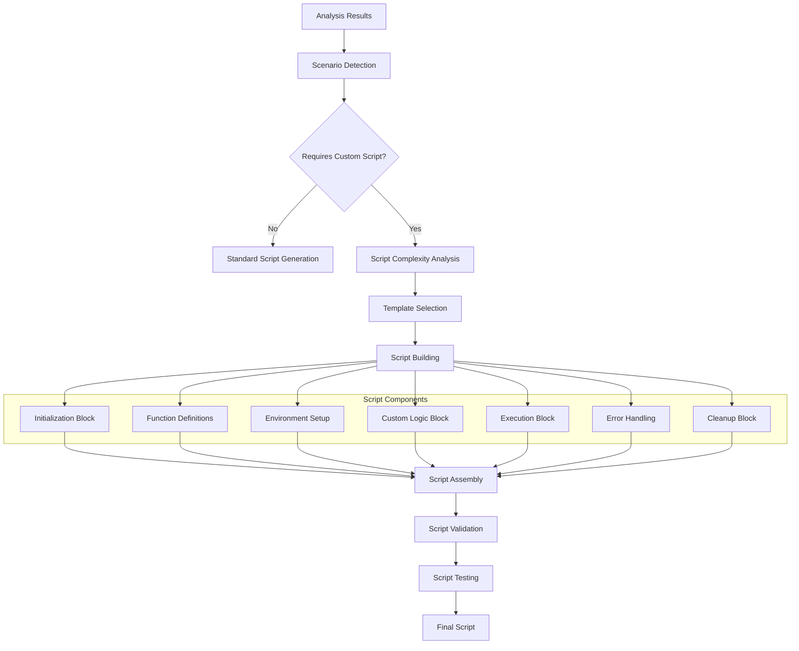

# Story 3.4: Custom Script Generation

**Status:** Draft

## Non-Technical Explanation

This story is about creating specialized PowerShell scripts for complex installation scenarios that can't be handled by standard templates. Think of it like having a tailor who can make custom clothing when off-the-rack options won't work for a particular situation.

While the standard script generation (Story 3.2) handles most cases, some applications require special handling—such as registry modifications, file system preparations, complex configuration steps, or integration with other systems. This capability ensures that even the most complex applications can be automated without requiring manual script development.

Similar to how a chef might create a special recipe for unique dietary requirements, this feature analyzes complex installation needs and generates specialized PowerShell scripts tailored to those specific requirements. The system identifies when standard approaches won't work and automatically creates custom solutions.

## Why This Matters

Custom script generation addresses several critical challenges in application packaging:

1. **Exceptional Cases**: Many enterprise applications have unique installation requirements that don't fit standard patterns.

2. **Complex Dependencies**: Some applications require intricate setup of dependencies or environment configuration that goes beyond standard pre/post commands.

3. **Multi-Step Processes**: Certain installations involve multiple sequential steps that must be carefully orchestrated.

4. **Legacy Applications**: Older applications often require special handling to work in modern environments.

5. **Application-Specific Logic**: Some applications need custom logic based on environment conditions or user settings.

Without this capability, packaging engineers would need to manually develop scripts for these complex cases, significantly increasing the time and expertise required. By automating custom script generation, the system ensures that even the most challenging applications can be packaged efficiently.

## Goal & Context

**User Story:** As a packaging engineer, I need the system to generate custom PowerShell scripts for complex installation scenarios.

**Context:** Building upon the standard script generation (Story 3.2) and pre/post command generation (Story 3.3), this story adds the ability to detect complex scenarios and generate specialized scripts that go beyond the standard PSADT template approach.

## Detailed Requirements

- Implement identification of complex installation needs
- Create generation of specialized scripts
- Develop integration with installation workflow
- Implement testing of complex scripts
- Create logging and error handling for custom scripts
- Document script generation capabilities and limitations

## Acceptance Criteria (ACs)

- AC1: System correctly identifies scenarios requiring custom scripts
- AC2: Generated scripts handle complex installation requirements
- AC3: Integration with workflow maintains execution order
- AC4: Testing verifies script functionality
- AC5: Logging and error handling provide troubleshooting capabilities

## Technical Implementation Context

**Guidance:** Use the following details for implementation. Refer to the linked `docs/` files for broader context if needed.

- **Relevant Files:**

  - Files to Create: 
    - `backend/apas/agents/psadt/custom/scenario_detector.py` - Complex scenario detection
    - `backend/apas/agents/psadt/custom/script_builder.py` - Custom script building
    - `backend/apas/agents/psadt/custom/templates/` - Custom script templates 
    - `backend/apas/agents/psadt/custom/script_tester.py` - Custom script testing
    - `backend/apas/models/custom_script.py` - Custom script models
    - `docs/developer-guide/custom-scripts.md` - Documentation
  - Files to Modify:
    - `backend/apas/agents/psadt/generator/script_generator.py` - Add custom script integration
    - `backend/apas/agents/psadt/agent.py` - Add complex scenario handling
  - _(Hint: See `docs/architecture/project-structure.md` for overall layout)_

- **Key Technologies:**

  - Python for script generation logic
  - PowerShell for script testing and execution
  - Jinja2 for template rendering
  - LangChain for complex scenario analysis
  - Rule-based pattern matching
  - _(Hint: See `docs/architecture/tech-stack.md` for technology details)_

- **API Interactions / SDK Usage:**

  - Analysis results integration
  - PowerShell execution from Python
  - File system operations
  - Template rendering
  - AI assistance for complex logic
  - _(Hint: See `docs/architecture/api-reference.md` for API patterns)_

- **Data Structures:**

  - `ComplexScenario` enum for scenario categorization
  - `CustomScriptTemplate` model for specialized templates
  - `CustomScriptBlock` model for script components
  - `ScriptDependency` model for dependencies
  - `CustomScriptResult` model for generation results
  - _(Hint: See `docs/architecture/data-models.md` for structure details)_

- **Environment Variables:**

  - `CUSTOM_TEMPLATES_DIR` - Directory for custom templates
  - `MAX_SCRIPT_COMPLEXITY` - Maximum script complexity level
  - `ENABLE_AI_SCRIPT_ENHANCEMENTS` - Toggle AI enhancements
  - _(Hint: See `docs/architecture/environment-vars.md` for details)_

- **Coding Standards Notes:**
  - Create well-documented custom scripts
  - Implement proper error handling and logging
  - Follow modular design for script components
  - Create predictable script structure
  - Provide detailed comments for complex logic
  - _(Hint: See `docs/architecture/coding-standards.md` for full standards)_

## Visual Design Reference

The custom script generation process follows this workflow:



## Tasks / Subtasks

- [ ] Design custom script architecture
  - [ ] Define complex scenario types
  - [ ] Create script component model
  - [ ] Design template structure
  - [ ] Define integration points
  - [ ] Create testing approach
- [ ] Implement complex scenario detection
  - [ ] Create pattern-based detection
  - [ ] Implement heuristic analysis
  - [ ] Develop complexity scoring
  - [ ] Create scenario classification
  - [ ] Implement detection reporting
- [ ] Implement custom script templates
  - [ ] Create multi-stage installation template
  - [ ] Implement driver installation template
  - [ ] Develop complex dependency template
  - [ ] Create database/SQL template
  - [ ] Implement legacy application template
- [ ] Implement script building
  - [ ] Create component block generation
  - [ ] Implement function library
  - [ ] Develop parameter mapping
  - [ ] Create context binding
  - [ ] Implement script assembly
- [ ] Implement specific script generators
  - [ ] Create registry-intensive scripts
  - [ ] Implement service configuration scripts
  - [ ] Develop multi-installer scripts
  - [ ] Create environment configuration scripts
  - [ ] Implement database configuration scripts
- [ ] Implement script testing
  - [ ] Create syntax validation
  - [ ] Implement logic validation
  - [ ] Develop execution simulation
  - [ ] Create test reporting
  - [ ] Implement test-based refinement
- [ ] Implement integration with workflow
  - [ ] Create handover to core script generator
  - [ ] Implement dependency tracking
  - [ ] Develop execution ordering
  - [ ] Create status reporting
  - [ ] Implement error handling
- [ ] Create test suite and documentation
  - [ ] Develop test cases for complex scenarios
  - [ ] Create validation tests
  - [ ] Implement user documentation
  - [ ] Develop developer documentation
  - [ ] Create example library

## Manual Testing Guide (For Non-Technical Users)

You can verify the custom script generation is working correctly through these checks:

1. **Complex Scenario Detection Test**:
   - Upload an installer that requires special handling (e.g., multi-stage installation)
   - Observe how the system identifies this as a complex scenario
   - Check that the appropriate custom script approach is selected
   - Verify that the scenario classification is correct

2. **Custom Script Generation Test**:
   - Select a complex installer and generate a script
   - Review the generated script to verify it contains specialized handling
   - Check that all required components are included
   - Verify that the script structure is logical and well-organized

3. **Script Functionality Test**:
   - Execute the generated script in a test environment
   - Verify that it correctly handles the complex scenario
   - Check that error handling works properly
   - Confirm that the script produces the expected results

4. **Expected Results**:
   - Complex scenarios should be correctly identified
   - Generated scripts should contain specialized logic for the scenario
   - Scripts should be well-documented and maintainable
   - Error handling should be comprehensive
   - Scripts should successfully handle the complex requirements

## Testing Requirements

**Guidance:** Verify implementation against the ACs using the following tests.

- **Unit Tests:** 
  - Test scenario detection logic
  - Verify template selection
  - Test script block generation
  - Validate component assembly
  - Test syntax validation

- **Integration Tests:** 
  - Test end-to-end generation for complex scenarios
  - Verify integration with standard script generation
  - Test with various installer types
  - Validate error handling and recovery
  - Test script execution in isolated environment

- **Manual Verification:** 
  - Test with real-world complex installers
  - Verify script functionality in test environment
  - Check error handling with intentional failures
  - Validate documentation and readability
  - Test maintainability through script modifications

## Implementation Example

Here's an example implementation of the custom script generation system:

```python
from enum import Enum, auto
from typing import Dict, Any, Optional, List, Set, Tuple, Union
from dataclasses import dataclass, field
import logging
import os
import re
import subprocess
import tempfile
from datetime import datetime
import jinja2
from pathlib import Path

# Import required models
from apas.agents.installer.integration import IntegrationResult
from apas.agents.psadt.generator.script_generator import ScriptGenerationRequest, ScriptGenerationResult
from apas.agents.psadt.templates.manager import TemplateManager

class ComplexScenario(Enum):
    """Types of complex installation scenarios."""
    MULTI_INSTALLER = auto()         # Multiple installers must be run in sequence
    CUSTOM_CONFIG = auto()           # Complex configuration required
    DATABASE_SETUP = auto()          # Requires database setup
    DRIVER_INSTALLATION = auto()     # Specialized driver installation
    SERVICE_CONFIG = auto()          # Complex service configuration
    REGISTRY_INTENSIVE = auto()      # Extensive registry modifications
    LEGACY_APPLICATION = auto()      # Legacy application with special needs
    ENVIRONMENT_CONFIG = auto()      # Extensive environment configuration
    INTEGRATION_REQUIRED = auto()    # Integration with other systems
    OTHER = auto()                   # Other complex scenarios

class ScriptComplexity(Enum):
    """Levels of script complexity."""
    LOW = 1      # Slightly more complex than standard
    MEDIUM = 2   # Moderately complex
    HIGH = 3     # Very complex
    EXTREME = 4  # Extremely complex

class ScriptComponentType(Enum):
    """Types of script components."""
    INITIALIZATION = auto()      # Script initialization
    FUNCTION_DEFINITION = auto() # Function definitions
    ENVIRONMENT_SETUP = auto()   # Environment preparation
    MAIN_LOGIC = auto()          # Main script logic
    ERROR_HANDLING = auto()      # Error handling
    CLEANUP = auto()             # Cleanup operations
    LOGGING = auto()             # Logging operations
    OTHER = auto()               # Other component types

@dataclass
class ScriptDependency:
    """Represents a dependency for a script."""
    name: str
    version: Optional[str] = None
    url: Optional[str] = None
    is_critical: bool = True
    installation_command: Optional[str] = None
    
    def __str__(self) -> str:
        """Return a string representation of the dependency."""
        version_str = f" v{self.version}" if self.version else ""
        return f"{self.name}{version_str}"

@dataclass
class CustomScriptBlock:
    """A block of code in a custom script."""
    block_type: ScriptComponentType
    content: str
    order: int = 0
    dependencies: List[str] = field(default_factory=list)
    metadata: Dict[str, Any] = field(default_factory=dict)
    
    def __str__(self) -> str:
        """Return a string representation of the script block."""
        return f"{self.block_type.name} Block (Order: {self.order})"

@dataclass
class CustomScriptTemplate:
    """Template for a custom script."""
    id: str
    name: str
    description: str
    scenario_type: ComplexScenario
    complexity: ScriptComplexity
    template_path: str
    required_parameters: List[str] = field(default_factory=list)
    optional_parameters: List[str] = field(default_factory=dict)
    blocks: List[CustomScriptBlock] = field(default_factory=list)
    metadata: Dict[str, Any] = field(default_factory=dict)
    
    def __str__(self) -> str:
        """Return a string representation of the template."""
        return f"{self.name} ({self.scenario_type.name}, Complexity: {self.complexity.name})"

@dataclass
class CustomScriptGenerationRequest:
    """Request for custom script generation."""
    analysis_result: IntegrationResult
    scenario_type: ComplexScenario
    custom_parameters: Dict[str, Any] = field(default_factory=dict)
    template_id: Optional[str] = None
    
    def to_dict(self) -> Dict[str, Any]:
        """Convert to dictionary."""
        return {
            "scenario_type": self.scenario_type.name,
            "custom_parameters": self.custom_parameters,
            "template_id": self.template_id
        }
    
    @classmethod
    def from_dict(cls, data: Dict[str, Any], analysis_result: IntegrationResult) -> "CustomScriptGenerationRequest":
        """Create from dictionary."""
        return cls(
            analysis_result=analysis_result,
            scenario_type=ComplexScenario[data.get("scenario_type", "OTHER")],
            custom_parameters=data.get("custom_parameters", {}),
            template_id=data.get("template_id")
        )

@dataclass
class CustomScriptGenerationResult:
    """Result of custom script generation."""
    script_content: str
    template_used: CustomScriptTemplate
    is_valid: bool = True
    validation_messages: List[str] = field(default_factory=list)
    generation_time: float = 0.0
    blocks: List[CustomScriptBlock] = field(default_factory=list)
    
    def to_dict(self) -> Dict[str, Any]:
        """Convert to dictionary."""
        return {
            "script_content": self.script_content,
            "template_used": {
                "id": self.template_used.id,
                "name": self.template_used.name,
                "scenario_type": self.template_used.scenario_type.name,
                "complexity": self.template_used.complexity.name
            },
            "is_valid": self.is_valid,
            "validation_messages": self.validation_messages,
            "generation_time": self.generation_time,
            "blocks": [
                {
                    "block_type": block.block_type.name,
                    "order": block.order,
                    "dependencies": block.dependencies,
                    "metadata": block.metadata
                }
                for block in self.blocks
            ]
        }

class ScenarioDetector:
    """Detects complex installation scenarios."""
    
    def __init__(self, complexity_threshold: ScriptComplexity = ScriptComplexity.MEDIUM):
        self.logger = logging.getLogger(__name__)
        self.complexity_threshold = complexity_threshold
    
    def detect_scenario(self, analysis_result: IntegrationResult) -> Tuple[bool, Optional[ComplexScenario], ScriptComplexity]:
        """
        Detect if a complex scenario is present.
        
        Args:
            analysis_result: Result of installer analysis
            
        Returns:
            Tuple[bool, Optional[ComplexScenario], ScriptComplexity]: 
                Whether a complex scenario is detected, the scenario type, and complexity level
        """
        self.logger.info("Detecting complex installation scenario")
        
        # Initialize complexity score
        complexity_score = 0
        detected_scenario = None
        
        # Check for multiple installers
        if self._has_multiple_installers(analysis_result):
            complexity_score += 3
            detected_scenario = ComplexScenario.MULTI_INSTALLER
        
        # Check for database setup
        if self._requires_database_setup(analysis_result):
            complexity_score += 3
            detected_scenario = ComplexScenario.DATABASE_SETUP
        
        # Check for driver installation
        if self._requires_driver_installation(analysis_result):
            complexity_score += 2
            detected_scenario = ComplexScenario.DRIVER_INSTALLATION
        
        # Check for extensive registry modifications
        if self._has_extensive_registry_modifications(analysis_result):
            complexity_score += 2
            detected_scenario = ComplexScenario.REGISTRY_INTENSIVE
        
        # Check for complex service configuration
        if self._requires_complex_service_config(analysis_result):
            complexity_score += 2
            detected_scenario = ComplexScenario.SERVICE_CONFIG
        
        # Check for legacy application
        if self._is_legacy_application(analysis_result):
            complexity_score += 2
            detected_scenario = ComplexScenario.LEGACY_APPLICATION
        
        # Check for extensive environment configuration
        if self._requires_environment_config(analysis_result):
            complexity_score += 1
            detected_scenario = ComplexScenario.ENVIRONMENT_CONFIG
        
        # Check for system integration
        if self._requires_system_integration(analysis_result):
            complexity_score += 2
            detected_scenario = ComplexScenario.INTEGRATION_REQUIRED
        
        # Determine complexity level
        complexity_level = ScriptComplexity.LOW
        if complexity_score >= 7:
            complexity_level = ScriptComplexity.EXTREME
        elif complexity_score >= 5:
            complexity_level = ScriptComplexity.HIGH
        elif complexity_score >= 3:
            complexity_level = ScriptComplexity.MEDIUM
        
        # Determine if scenario requires custom script
        requires_custom_script = complexity_level.value >= self.complexity_threshold.value
        
        if requires_custom_script:
            self.logger.info(f"Detected complex scenario: {detected_scenario.name if detected_scenario else 'UNKNOWN'} with complexity {complexity_level.name}")
        else:
            self.logger.info("No complex scenario detected that requires custom script")
            detected_scenario = None
        
        return requires_custom_script, detected_scenario, complexity_level
    
    def _has_multiple_installers(self, analysis_result: IntegrationResult) -> bool:
        """Check if the application requires multiple installers."""
        # In a real implementation, this would analyze the installer content
        # to detect multiple installers
        
        # Simplified check - look for indications of multiple installers
        if not analysis_result.content_inventory:
            return False
        
        # Check for multiple executables or MSIs in inventory
        exe_count = 0
        msi_count = 0
        
        for item_name, item in analysis_result.executable_files.items():
            item_path = item.value
            if not item_path:
                continue
            
            if item_path.lower().endswith(".exe"):
                exe_count += 1
            elif item_path.lower().endswith(".msi"):
                msi_count += 1
        
        return (exe_count > 1 and exe_count < 10) or (msi_count > 1 and msi_count < 10) or (exe_count + msi_count > 2 and exe_count + msi_count < 10)
    
    def _requires_database_setup(self, analysis_result: IntegrationResult) -> bool:
        """Check if the application requires database setup."""
        # Look for database indicators in analysis result
        
        # Check for database dependencies
        for name, req in analysis_result.prerequisites.items():
            value = req.value.lower() if req.value else ""
            if "sql" in value or "database" in value or "mysql" in value or "oracle" in value or "postgres" in value:
                return True
        
        # Check for database executables
        for item_name, item in analysis_result.executable_files.items():
            item_path = item.value.lower() if item.value else ""
            if "sqlservr" in item_path or "mysqld" in item_path or "pgadmin" in item_path or "oracle" in item_path:
                return True
        
        # Check for database files
        if analysis_result.content_inventory:
            for item_name, item in analysis_result.content_inventory.items():
                item_path = item.value.lower() if item.value else ""
                if item_path.endswith(".mdf") or item_path.endswith(".ldf") or item_path.endswith(".bak") or item_path.endswith(".sql"):
                    return True
        
        return False
    
    def _requires_driver_installation(self, analysis_result: IntegrationResult) -> bool:
        """Check if the application requires driver installation."""
        # Look for driver indicators in analysis result
        
        # Check for driver-related files
        if analysis_result.content_inventory:
            for item_name, item in analysis_result.content_inventory.items():
                item_path = item.value.lower() if item.value else ""
                if item_path.endswith(".sys") or item_path.endswith(".cat") or item_path.endswith(".inf"):
                    return True
        
        # Check for driver-related executables
        for item_name, item in analysis_result.executable_files.items():
            item_path = item.value.lower() if item.value else ""
            if "driver" in item_path or "setup" in item_path:
                # Further analyze to confirm it's a driver installer
                return True
        
        return False
    
    def _has_extensive_registry_modifications(self, analysis_result: IntegrationResult) -> bool:
        """Check if the application requires extensive registry modifications."""
        # In a real implementation, this would analyze the installer behavior
        # to detect extensive registry modifications
        
        # Simplified check - look for registry-related indicators
        return False  # Placeholder for demonstration
    
    def _requires_complex_service_config(self, analysis_result: IntegrationResult) -> bool:
        """Check if the application requires complex service configuration."""
        # Look for service configuration indicators
        
        # Check for service-related files
        service_count = 0
        
        if analysis_result.content_inventory:
            for item_name, item in analysis_result.content_inventory.items():
                item_path = item.value.lower() if item.value else ""
                if "service" in item_path and item_path.endswith(".exe"):
                    service_count += 1
        
        return service_count >= 2
    
    def _is_legacy_application(self, analysis_result: IntegrationResult) -> bool:
        """Check if the application is a legacy application."""
        # Look for legacy application indicators
        
        # Check product version for old versions
        product_version = analysis_result.product_version.value if analysis_result.product_version else None
        if product_version:
            # Try to extract major version
            version_match = re.search(r'^(\d+)', product_version)
            if version_match:
                major_version = int(version_match.group(1))
                if major_version < 3:
                    return True
        
        return False
    
    def _requires_environment_config(self, analysis_result: IntegrationResult) -> bool:
        """Check if the application requires extensive environment configuration."""
        # Look for environment configuration indicators
        
        # Simplified check
        return False  # Placeholder for demonstration
    
    def _requires_system_integration(self, analysis_result: IntegrationResult) -> bool:
        """Check if the application requires integration with other systems."""
        # Look for system integration indicators
        
        # Simplified check
        return False  # Placeholder for demonstration

class CustomScriptBuilder:
    """Builds custom scripts for complex scenarios."""
    
    def __init__(self, templates_dir: str):
        self.logger = logging.getLogger(__name__)
        self.templates_dir = Path(templates_dir)
        self.jinja_env = jinja2.Environment(
            loader=jinja2.FileSystemLoader(templates_dir),
            autoescape=jinja2.select_autoescape(),
            keep_trailing_newline=True
        )
        self.templates = self._load_templates()
    
    def _load_templates(self) -> Dict[str, CustomScriptTemplate]:
        """Load custom script templates."""
        templates = {}
        
        # In a real implementation, this would load templates from files
        # For demonstration, we'll create some example templates
        
        # Multi-installer template
        templates["multi_installer"] = CustomScriptTemplate(
            id="multi_installer",
            name="Multi-Installer Template",
            description="Template for applications with multiple installers",
            scenario_type=ComplexScenario.MULTI_INSTALLER,
            complexity=ScriptComplexity.MEDIUM,
            template_path="multi_installer.ps1.j2",
            required_parameters=["installers"],
            blocks=[
                CustomScriptBlock(
                    block_type=ScriptComponentType.INITIALIZATION,
                    content="# Initialize multi-installer deployment\n",
                    order=1
                ),
                CustomScriptBlock(
                    block_type=ScriptComponentType.FUNCTION_DEFINITION,
                    content="function Install-Component { param([string]$Path, [string]$Parameters) ... }\n",
                    order=2
                ),
                CustomScriptBlock(
                    block_type=ScriptComponentType.MAIN_LOGIC,
                    content="# Install each component\nforeach ($installer in $installers) { ... }\n",
                    order=3
                )
            ]
        )
        
        # Database setup template
        templates["database_setup"] = CustomScriptTemplate(
            id="database_setup",
            name="Database Setup Template",
            description="Template for applications requiring database setup",
            scenario_type=ComplexScenario.DATABASE_SETUP,
            complexity=ScriptComplexity.HIGH,
            template_path="database_setup.ps1.j2",
            required_parameters=["database_type", "connection_string"],
            blocks=[
                CustomScriptBlock(
                    block_type=ScriptComponentType.FUNCTION_DEFINITION,
                    content="function Initialize-Database { param([string]$ConnectionString) ... }\n",
                    order=1
                )
            ]
        )
        
        # Driver installation template
        templates["driver_install"] = CustomScriptTemplate(
            id="driver_install",
            name="Driver Installation Template",
            description="Template for applications requiring driver installation",
            scenario_type=ComplexScenario.DRIVER_INSTALLATION,
            complexity=ScriptComplexity.MEDIUM,
            template_path="driver_install.ps1.j2",
            required_parameters=["driver_path", "inf_file"],
            blocks=[
                CustomScriptBlock(
                    block_type=ScriptComponentType.FUNCTION_DEFINITION,
                    content="function Install-Driver { param([string]$DriverPath, [string]$InfFile) ... }\n",
                    order=1
                )
            ]
        )
        
        # Registry intensive template
        templates["registry_intensive"] = CustomScriptTemplate(
            id="registry_intensive",
            name="Registry Intensive Template",
            description="Template for applications requiring extensive registry modifications",
            scenario_type=ComplexScenario.REGISTRY_INTENSIVE,
            complexity=ScriptComplexity.MEDIUM,
            template_path="registry_intensive.ps1.j2",
            required_parameters=["registry_keys"],
            blocks=[
                CustomScriptBlock(
                    block_type=ScriptComponentType.FUNCTION_DEFINITION,
                    content="function Set-RegistrySettings { param([array]$RegistryKeys) ... }\n",
                    order=1
                )
            ]
        )
        
        return templates
    
    def select_template(self, 
                      scenario_type: ComplexScenario,
                      complexity_level: ScriptComplexity,
                      template_id: Optional[str] = None) -> Optional[CustomScriptTemplate]:
        """
        Select an appropriate template.
        
        Args:
            scenario_type: Type of complex scenario
            complexity_level: Complexity level
            template_id: Optional specific template ID
            
        Returns:
            Optional[CustomScriptTemplate]: Selected template, or None if not found
        """
        # If specific template requested, use it
        if template_id and template_id in self.templates:
            return self.templates[template_id]
        
        # Find suitable templates for scenario type
        suitable_templates = [
            template for template in self.templates.values()
            if template.scenario_type == scenario_type and template.complexity.value <= complexity_level.value
        ]
        
        if not suitable_templates:
            # Fallback to templates for OTHER scenario type
            suitable_templates = [
                template for template in self.templates.values()
                if template.scenario_type == ComplexScenario.OTHER and template.complexity.value <= complexity_level.value
            ]
        
        if not suitable_templates:
            self.logger.warning(f"No suitable template found for scenario {scenario_type.name}")
            return None
        
        # Select the template with highest complexity that doesn't exceed the specified level
        suitable_templates.sort(key=lambda t: t.complexity.value, reverse=True)
        return suitable_templates[0]
    
    def generate_script(self, 
                       request: CustomScriptGenerationRequest,
                       complexity_level: ScriptComplexity) -> CustomScriptGenerationResult:
        """
        Generate a custom script.
        
        Args:
            request: Script generation request
            complexity_level: Complexity level
            
        Returns:
            CustomScriptGenerationResult: Generation result
        """
        self.logger.info(f"Generating custom script for scenario {request.scenario_type.name}")
        start_time = datetime.now()
        
        try:
            # Select template
            template = self.select_template(
                scenario_type=request.scenario_type,
                complexity_level=complexity_level,
                template_id=request.template_id
            )
            
            if not template:
                raise ValueError(f"No suitable template found for scenario {request.scenario_type.name}")
            
            self.logger.info(f"Using template: {template.name}")
            
            # Validate parameters
            missing_params = [param for param in template.required_parameters if param not in request.custom_parameters]
            if missing_params:
                raise ValueError(f"Missing required parameters: {', '.join(missing_params)}")
            
            # Prepare template context
            analysis_result = request.analysis_result
            context = {
                # Basic application info
                "app_name": analysis_result.product_name.value if analysis_result.product_name else "Unknown Application",
                "app_version": analysis_result.product_version.value if analysis_result.product_version else "1.0.0",
                "app_publisher": analysis_result.publisher.value if analysis_result.publisher else "Unknown Publisher",
                
                # Script generation info
                "script_generation_date": datetime.now().strftime("%Y-%m-%d"),
                "script_generator": "APAS Custom Script Generator",
                
                # Custom parameters
                **request.custom_parameters
            }
            
            # Load template
            template_path = template.template_path
            if not (self.templates_dir / template_path).exists():
                # For demonstration, we'll use a basic template string
                template_str = """
# Custom Script for {{ app_name }} {{ app_version }}
# Generated on {{ script_generation_date }} by {{ script_generator }}
# Scenario: {{ scenario_type }}

# Load PSADT functions
. .\AppDeployToolkit\\AppDeployToolkitMain.ps1

# Custom functions
function Install-WithCustomLogic {
    param(
        [string]$InstallerPath,
        [string]$Parameters
    )
    
    Write-Log "Installing with custom logic: $InstallerPath $Parameters"
    Execute-Process -Path $InstallerPath -Parameters $Parameters
}

# Show installation welcome
Show-InstallationWelcome -CloseApps "notepad" -AllowDefer -DeferTimes 3

# Pre-Installation
Write-Log "Performing custom pre-installation tasks"

# Setup for multiple installers
$installersFolder = Join-Path $dirFiles "Installers"

# Database setup preparation
Write-Log "Preparing database: {{ database_type }}"

# Driver installation preparation
Write-Log "Preparing to install driver: {{ driver_path }}"


# Main Installation
Write-Log "Starting custom installation process"

# Install each component
$installers = @(

    @{
        Path = "{{ installer.path }}"
        Parameters = "{{ installer.parameters }}"
        Order = {{ installer.order }}
    }

)

foreach ($installer in $installers | Sort-Object -Property Order) {
    Install-WithCustomLogic -InstallerPath $installer.Path -Parameters $installer.Parameters
}

# Database installation
Write-Log "Installing database with connection string: {{ connection_string }}"
# Database setup commands would go here

# Driver installation
Write-Log "Installing driver from: {{ driver_path }}"
# Driver installation commands would go here


# Post-Installation
Write-Log "Performing custom post-installation tasks"

# Verify all components installed
foreach ($installer in $installers) {
    # Verification logic would go here
}

# Verify database
Write-Log "Verifying database setup"
# Database verification commands would go here

# Verify driver
Write-Log "Verifying driver installation"
# Driver verification commands would go here


# Show installation completion
Show-InstallationPrompt -Message "Installation of {{ app_name }} completed successfully." -ButtonRightText "OK" -Icon Information
"""
                template = jinja2.Template(template_str)
                script_content = template.render(scenario_type=request.scenario_type.name, **context)
            else:
                # Load template from file
                template = self.jinja_env.get_template(template_path)
                script_content = template.render(**context)
            
            # Generate blocks for result
            blocks = []
            for i, block in enumerate(template.blocks):
                blocks.append(CustomScriptBlock(
                    block_type=block.block_type,
                    content="",  # We don't have the actual content after rendering
                    order=block.order,
                    dependencies=block.dependencies,
                    metadata=block.metadata
                ))
            
            # Validate script
            validation_result = self._validate_script(script_content)
            
            # Create result
            result = CustomScriptGenerationResult(
                script_content=script_content,
                template_used=template,
                is_valid=validation_result[0],
                validation_messages=validation_result[1],
                generation_time=(datetime.now() - start_time).total_seconds(),
                blocks=blocks
            )
            
            self.logger.info(f"Custom script generation {'succeeded' if result.is_valid else 'failed'}")
            return result
            
        except Exception as e:
            self.logger.error(f"Error in custom script generation: {str(e)}")
            
            # Create error result
            if 'template' in locals() and template:
                return CustomScriptGenerationResult(
                    script_content=f"# Error: Custom script generation failed\n# {str(e)}",
                    template_used=template,
                    is_valid=False,
                    validation_messages=[f"Error: {str(e)}"],
                    generation_time=(datetime.now() - start_time).total_seconds()
                )
            else:
                # Create a minimal template for the error result
                error_template = CustomScriptTemplate(
                    id="error",
                    name="Error Template",
                    description="Template created due to error",
                    scenario_type=ComplexScenario.OTHER,
                    complexity=ScriptComplexity.LOW,
                    template_path="error.ps1.j2"
                )
                
                return CustomScriptGenerationResult(
                    script_content=f"# Error: Custom script generation failed\n# {str(e)}",
                    template_used=error_template,
                    is_valid=False,
                    validation_messages=[f"Error: {str(e)}"],
                    generation_time=(datetime.now() - start_time).total_seconds()
                )
    
    def _validate_script(self, script_content: str) -> Tuple[bool, List[str]]:
        """
        Validate a generated script.
        
        Args:
            script_content: Script content to validate
            
        Returns:
            Tuple[bool, List[str]]: Whether the script is valid, and validation messages
        """
        is_valid = True
        messages = []
        
        try:
            # Create temporary file
            with tempfile.NamedTemporaryFile(suffix=".ps1", delete=False) as temp_file:
                temp_path = temp_file.name
                temp_file.write(script_content.encode("utf-8"))
            
            # Validate PowerShell syntax
            cmd = [
                "powershell",
                "-NoProfile",
                "-NonInteractive",
                "-Command",
                f"$ErrorActionPreference = 'Stop'; try {{ [Void][System.Management.Automation.Language.Parser]::ParseFile('{temp_path}', [ref]$null, [ref]$null) }} catch {{ Write-Error $_.Exception.Message; exit 1 }}"
            ]
            
            process = subprocess.run(
                cmd,
                text=True,
                capture_output=True,
                timeout=30
            )
            
            if process.returncode != 0:
                is_valid = False
                error_msg = process.stderr.strip()
                messages.append(f"PowerShell syntax error: {error_msg}")
            else:
                messages.append("Script syntax validation passed")
        except Exception as e:
            is_valid = False
            messages.append(f"Validation error: {str(e)}")
        finally:
            # Clean up temporary file
            if 'temp_path' in locals():
                try:
                    os.unlink(temp_path)
                except:
                    pass
        
        return is_valid, messages

class ScriptTester:
    """Tests custom scripts in a safe environment."""
    
    def __init__(self, test_timeout: int = 30):
        self.logger = logging.getLogger(__name__)
        self.test_timeout = test_timeout
    
    def test_script(self, script_content: str) -> Tuple[bool, List[str]]:
        """
        Test a script in a safe environment.
        
        Args:
            script_content: Script content to test
            
        Returns:
            Tuple[bool, List[str]]: Whether the test passed, and test messages
        """
        self.logger.info("Testing custom script")
        
        # In a real implementation, this would execute the script in a safe
        # environment like a sandbox or VM
        
        # For demonstration, we'll perform static analysis
        return self._perform_static_analysis(script_content)
    
    def _perform_static_analysis(self, script_content: str) -> Tuple[bool, List[str]]:
        """Perform static analysis on a script."""
        passed = True
        messages = []
        
        # Check for PSADT function usage
        psadt_functions = [
            "Show-InstallationWelcome",
            "Show-InstallationPrompt",
            "Execute-Process",
            "Execute-MSI",
            "Write-Log"
        ]
        
        for function in psadt_functions:
            if function not in script_content:
                messages.append(f"Warning: PSADT function '{function}' not used in script")
        
        # Check for common script elements
        if "Pre-Installation" not in script_content and "pre-installation" not in script_content.lower():
            messages.append("Warning: Pre-installation section not clearly defined")
        
        if "Post-Installation" not in script_content and "post-installation" not in script_content.lower():
            messages.append("Warning: Post-installation section not clearly defined")
        
        # Check for potential issues
        if "rm -rf" in script_content or "Remove-Item -Recurse -Force /" in script_content:
            passed = False
            messages.append("Error: Potentially dangerous removal command detected")
        
        if "Format-Volume" in script_content or "Clear-Disk" in script_content:
            passed = False
            messages.append("Error: Disk formatting commands detected")
        
        return passed, messages

class CustomScriptGenerator:
    """Generates custom scripts for complex installation scenarios."""
    
    def __init__(self, 
                templates_dir: str,
                complexity_threshold: ScriptComplexity = ScriptComplexity.MEDIUM,
                enable_ai_enhancements: bool = False):
        self.logger = logging.getLogger(__name__)
        self.templates_dir = templates_dir
        self.complexity_threshold = complexity_threshold
        self.enable_ai_enhancements = enable_ai_enhancements
        self.scenario_detector = ScenarioDetector(complexity_threshold)
        self.script_builder = CustomScriptBuilder(templates_dir)
        self.script_tester = ScriptTester()
    
    def process_request(self, request: ScriptGenerationRequest) -> Union[ScriptGenerationResult, CustomScriptGenerationResult]:
        """
        Process a script generation request.
        
        Args:
            request: Standard script generation request
            
        Returns:
            Union[ScriptGenerationResult, CustomScriptGenerationResult]: Standard or custom script generation result
        """
        self.logger.info("Processing script generation request")
        
        # Check if a complex scenario is present
        requires_custom, scenario_type, complexity_level = self.scenario_detector.detect_scenario(
            request.analysis_result
        )
        
        if not requires_custom or not scenario_type:
            self.logger.info("No complex scenario detected, using standard script generation")
            # Return indicator to use standard script generation
            return None
        
        # Create custom script generation request
        custom_request = CustomScriptGenerationRequest(
            analysis_result=request.analysis_result,
            scenario_type=scenario_type,
            custom_parameters=request.custom_parameters,
            template_id=request.custom_parameters.get("custom_template_id")
        )
        
        # Generate custom script
        result = self.script_builder.generate_script(custom_request, complexity_level)
        
        # Test script if valid
        if result.is_valid:
            test_passed, test_messages = self.script_tester.test_script(result.script_content)
            
            # Update validation status based on test
            if not test_passed:
                result.is_valid = False
            
            # Add test messages to validation messages
            result.validation_messages.extend(test_messages)
        
        return result
    
    def generate_custom_script(self, request: CustomScriptGenerationRequest) -> CustomScriptGenerationResult:
        """
        Generate a custom script directly.
        
        Args:
            request: Custom script generation request
            
        Returns:
            CustomScriptGenerationResult: Custom script generation result
        """
        self.logger.info(f"Generating custom script for scenario {request.scenario_type.name}")
        
        # Determine complexity level
        # For direct requests, we'll use MEDIUM complexity by default
        complexity_level = ScriptComplexity.MEDIUM
        
        # Generate custom script
        result = self.script_builder.generate_script(request, complexity_level)
        
        # Test script if valid
        if result.is_valid:
            test_passed, test_messages = self.script_tester.test_script(result.script_content)
            
            # Update validation status based on test
            if not test_passed:
                result.is_valid = False
            
            # Add test messages to validation messages
            result.validation_messages.extend(test_messages)
        
        return result

# Example usage
if __name__ == "__main__":
    # Configure logging
    logging.basicConfig(level=logging.INFO)
    
    # Create custom script generator
    generator = CustomScriptGenerator(
        templates_dir="templates/custom",
        complexity_threshold=ScriptComplexity.MEDIUM,
        enable_ai_enhancements=True
    )
    
    # Create mock analysis result for multi-installer scenario
    analysis_result = IntegrationResult(
        installer_type=SourcedValue(value="EXE", source="INSTALLER_DETECTION", confidence=0.9),
        product_name=SourcedValue(value="Complex Application Suite", source="METADATA_EXTRACTION", confidence=0.9),
        product_version=SourcedValue(value="2.0.0", source="METADATA_EXTRACTION", confidence=0.9),
        publisher=SourcedValue(value="Example Inc.", source="METADATA_EXTRACTION", confidence=0.9),
        prerequisites={"dotnet": SourcedValue(value=".NET Framework 4.7.2", source="AI_REQUIREMENTS", confidence=0.8)},
        executable_files={
            "exe1": SourcedValue(value="setup1.exe (EXECUTABLE)", source="CONTENT_INVENTORY", confidence=0.9),
            "exe2": SourcedValue(value="setup2.exe (EXECUTABLE)", source="CONTENT_INVENTORY", confidence=0.9),
            "exe3": SourcedValue(value="setup3.exe (EXECUTABLE)", source="CONTENT_INVENTORY", confidence=0.9)
        }
    )
    
    # Create custom request
    request = CustomScriptGenerationRequest(
        analysis_result=analysis_result,
        scenario_type=ComplexScenario.MULTI_INSTALLER,
        custom_parameters={
            "installers": [
                {"path": "setup1.exe", "parameters": "/S", "order": 1},
                {"path": "setup2.exe", "parameters": "/quiet", "order": 2},
                {"path": "setup3.exe", "parameters": "/S /norestart", "order": 3}
            ]
        }
    )
    
    # Generate custom script
    result = generator.generate_custom_script(request)
    
    # Print result
    print(f"Custom script generation {'succeeded' if result.is_valid else 'failed'}")
    print(f"Template used: {result.template_used.name}")
    print(f"Generation time: {result.generation_time:.2f} seconds")
    print("\nValidation Messages:")
    for message in result.validation_messages:
        print(f"  {message}")
    print("\nGenerated Script:")
    print(result.script_content)
```

## Story Wrap Up (Agent Populates After Execution)

- **Agent Model Used:** 
- **Completion Notes:** 
- **Change Log:** 
  - Initial Draft