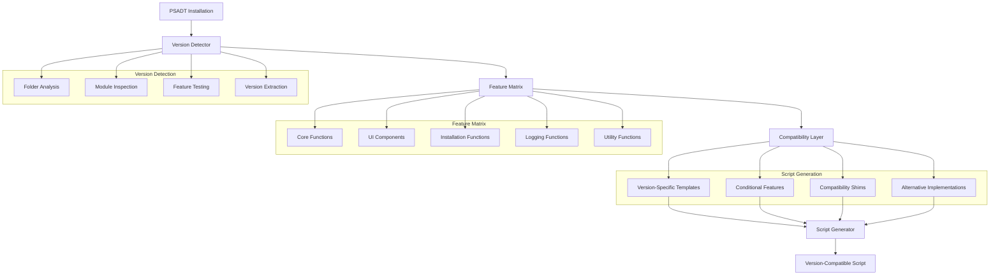

# Story 3.5: PSADT Version Compatibility

**Status:** Draft

## Non-Technical Explanation

This story is about ensuring the system works smoothly with different versions of the PowerShell AppDeploy Toolkit, including both older and newer releases. Think of it like making sure your documents work with multiple versions of Microsoft Word or Adobe Reader.

PSADT has evolved over time, with significant changes between major versions (particularly between v3.x and v4.x). Some organizations may be using older versions due to established processes, while others adopt the latest releases. The system needs to detect which version an organization is using and automatically adjust its output to match that version's requirements and capabilities.

This version compatibility is crucial for organizations that may be using different PSADT versions across their environment or transitioning between versions. Just as a document converter ensures compatibility across different software versions, this feature ensures scripts will work correctly regardless of which PSADT version is used for deployment.

## Why This Matters

PSADT version compatibility is essential for several reasons:

1. **Organizational Standardization**: Many organizations standardize on a specific PSADT version and need all scripts to follow that standard.

2. **Feature Utilization**: Newer PSADT versions include enhanced features that, when available, can improve deployment capabilities.

3. **Migration Support**: Organizations migrating from older to newer versions need support during the transition period.

4. **Legacy System Support**: Some environments require support for older PSADT versions due to legacy systems or management tools.

5. **Future-Proofing**: Supporting the latest versions ensures the system remains relevant as PSADT continues to evolve.

Without version compatibility, scripts generated for one PSADT version might fail when used with another version, requiring manual adjustments. This feature ensures scripts work correctly across different environments without modification, significantly reducing maintenance overhead.

## Goal & Context

**User Story:** As a packaging engineer, I need the system to ensure compatibility with different PSADT versions, including the latest.

**Context:** Building upon the script generation capabilities (Stories 3.2-3.4), this story adds the ability to detect PSADT version features and adjust script generation accordingly, ensuring compatibility with both v3.x and v4.x releases.

## Detailed Requirements

- Implement detection of PSADT version features
- Create compatibility layer for version differences
- Develop testing for multiple PSADT versions
- Implement version-specific templates
- Create documentation of version compatibility
- Support both older v3.x and newer v4.x releases

## Acceptance Criteria (ACs)

- AC1: System correctly detects PSADT version capabilities
- AC2: Compatibility layer handles version differences properly
- AC3: Testing verifies functionality across versions
- AC4: Templates are appropriate for specific versions
- AC5: Documentation clearly explains version compatibility

## Technical Implementation Context

**Guidance:** Use the following details for implementation. Refer to the linked `docs/` files for broader context if needed.

- **Relevant Files:**

  - Files to Create: 
    - `backend/apas/agents/psadt/version/detector.py` - PSADT version detection
    - `backend/apas/agents/psadt/version/compatibility.py` - Version compatibility layer
    - `backend/apas/agents/psadt/version/feature_matrix.py` - Feature availability matrix
    - `backend/apas/models/psadt_version.py` - Version-related models
    - `docs/developer-guide/psadt-version-compatibility.md` - Documentation
  - Files to Modify:
    - `backend/apas/agents/psadt/generator/script_generator.py` - Add version compatibility
    - `backend/apas/agents/psadt/templates/manager.py` - Add version-specific templates
    - `backend/apas/agents/psadt/agent.py` - Add version detection
  - _(Hint: See `docs/architecture/project-structure.md` for overall layout)_

- **Key Technologies:**

  - Python for version detection and compatibility
  - PowerShell for testing PSADT features
  - Semantic versioning library
  - Template inheritance for version differences
  - Feature detection algorithms
  - _(Hint: See `docs/architecture/tech-stack.md` for technology details)_

- **API Interactions / SDK Usage:**

  - PowerShell execution for version detection
  - Template manager API
  - File system operations for PSADT inspection
  - Script validation with version context
  - _(Hint: See `docs/architecture/api-reference.md` for API patterns)_

- **Data Structures:**

  - `PSADTVersion` model for version information
  - `FeatureCompatibility` model for feature support
  - `VersionCapabilities` model for version capabilities
  - `CompatibilityIssue` model for compatibility issues
  - `VersionSettings` model for version-specific settings
  - _(Hint: See `docs/architecture/data-models.md` for structure details)_

- **Environment Variables:**

  - `DEFAULT_PSADT_VERSION` - Default PSADT version to target
  - `PSADT_COMPATIBILITY_MODE` - Strict or flexible compatibility
  - `PSADT_PATH` - Path to PSADT installation
  - _(Hint: See `docs/architecture/environment-vars.md` for details)_

- **Coding Standards Notes:**
  - Implement clear version detection logic
  - Create robust fallbacks for missing features
  - Use conditional code generation for version differences
  - Provide detailed comments for version-specific code
  - Follow semantic versioning principles
  - _(Hint: See `docs/architecture/coding-standards.md` for full standards)_

## Visual Design Reference

The version compatibility system follows this architecture:



## Tasks / Subtasks

- [ ] Design version compatibility architecture
  - [ ] Define version detection approach
  - [ ] Create feature matrix structure
  - [ ] Design compatibility layer
  - [ ] Define template versioning strategy
  - [ ] Create testing methodology
- [ ] Implement PSADT version detection
  - [ ] Create folder structure analysis
  - [ ] Implement module inspection
  - [ ] Develop feature detection
  - [ ] Create version extraction
  - [ ] Implement detection reporting
- [ ] Create feature compatibility matrix
  - [ ] Document v3.x features
  - [ ] Document v4.x features
  - [ ] Identify key differences
  - [ ] Create feature availability mapping
  - [ ] Implement feature detection tests
- [ ] Implement compatibility layer
  - [ ] Create version-specific code generation
  - [ ] Implement fallback mechanisms
  - [ ] Develop compatibility warnings
  - [ ] Create alternative implementations
  - [ ] Implement feature substitution
- [ ] Create version-specific templates
  - [ ] Implement v3.x base template
  - [ ] Create v4.x base template
  - [ ] Develop shared components
  - [ ] Implement version-specific sections
  - [ ] Create template inheritance
- [ ] Implement script generation with version context
  - [ ] Modify script generator to use version information
  - [ ] Implement version-specific logic
  - [ ] Create version compatibility checks
  - [ ] Develop warning system for incompatible features
  - [ ] Implement version-specific testing
- [ ] Create version compatibility testing
  - [ ] Implement test cases for v3.x
  - [ ] Create test cases for v4.x
  - [ ] Develop cross-version validation
  - [ ] Create compatibility reports
  - [ ] Implement continuous testing
- [ ] Create documentation and examples
  - [ ] Document version differences
  - [ ] Create migration guides
  - [ ] Develop compatibility examples
  - [ ] Create troubleshooting guides
  - [ ] Implement version capability documentation

## Manual Testing Guide (For Non-Technical Users)

You can verify the PSADT version compatibility is working correctly through these checks:

1. **Version Detection Test**:
   - Configure the system with different PSADT versions
   - Verify that the system correctly identifies the version
   - Check that version features are accurately detected
   - Confirm that version information is displayed correctly

2. **Script Generation Test**:
   - Generate scripts targeting different PSADT versions
   - Compare the scripts to verify version-specific differences
   - Check that version-specific features are used appropriately
   - Confirm that incompatible features are handled correctly

3. **Compatibility Test**:
   - Execute generated scripts with the targeted PSADT version
   - Verify that scripts run correctly without errors
   - Check that script functionality is consistent across versions
   - Confirm that version-specific optimizations work properly

4. **Expected Results**:
   - Version detection should be accurate and reliable
   - Generated scripts should utilize version-specific features when available
   - Scripts should avoid using features not available in the target version
   - Compatibility warnings should be provided for potential issues
   - Documentation should clearly explain version compatibility considerations

## Testing Requirements

**Guidance:** Verify implementation against the ACs using the following tests.

- **Unit Tests:** 
  - Test version detection logic
  - Verify feature matrix accuracy
  - Test compatibility layer functionality
  - Validate template selection logic
  - Test version-specific code generation

- **Integration Tests:** 
  - Test end-to-end script generation with different versions
  - Verify script execution with different PSADT versions
  - Test handling of version-specific features
  - Validate compatibility warnings and errors
  - Test template inheritance and overrides

- **Manual Verification:** 
  - Test with actual PSADT installations
  - Verify script functionality in real environments
  - Check compatibility with edge case scenarios
  - Validate documentation accuracy
  - Test migration paths between versions

## Implementation Example

Here's an example implementation of the PSADT version compatibility system:

```python
from enum import Enum, auto
from typing import Dict, Any, Optional, List, Set, Tuple, Union
from pathlib import Path
import logging
import re
import subprocess
import semver
from dataclasses import dataclass, field
import json
import os

@dataclass
class PSADTVersion:
    """Represents a PSADT version."""
    major: int
    minor: int
    patch: int
    is_preview: bool = False
    preview_version: Optional[str] = None
    raw_version: str = ""
    
    @property
    def version_string(self) -> str:
        """Get the version as a string."""
        base = f"{self.major}.{self.minor}.{self.patch}"
        if self.is_preview and self.preview_version:
            return f"{base}-{self.preview_version}"
        return base
    
    @property
    def is_v3(self) -> bool:
        """Check if this is a v3.x version."""
        return self.major == 3
    
    @property
    def is_v4(self) -> bool:
        """Check if this is a v4.x version."""
        return self.major == 4
    
    def __str__(self) -> str:
        """Return a string representation of the version."""
        return self.version_string
    
    @classmethod
    def from_string(cls, version_str: str) -> "PSADTVersion":
        """Create from version string."""
        version_str = version_str.strip()
        
        # Check for preview/pre-release
        is_preview = False
        preview_version = None
        if "-" in version_str:
            version_parts = version_str.split("-", 1)
            base_version = version_parts[0]
            preview_version = version_parts[1]
            is_preview = True
        else:
            base_version = version_str
        
        # Parse base version
        version_match = re.match(r"(\d+)\.(\d+)\.(\d+)", base_version)
        if not version_match:
            raise ValueError(f"Invalid version format: {version_str}")
        
        major = int(version_match.group(1))
        minor = int(version_match.group(2))
        patch = int(version_match.group(3))
        
        return cls(
            major=major,
            minor=minor,
            patch=patch,
            is_preview=is_preview,
            preview_version=preview_version,
            raw_version=version_str
        )
    
    def __lt__(self, other: "PSADTVersion") -> bool:
        """Compare versions."""
        if self.major != other.major:
            return self.major < other.major
        if self.minor != other.minor:
            return self.minor < other.minor
        if self.patch != other.patch:
            return self.patch < other.patch
        # If base versions are equal, non-preview comes after preview
        if self.is_preview and not other.is_preview:
            return True
        if not self.is_preview and other.is_preview:
            return False
        # Both preview or both not preview
        if self.is_preview and other.is_preview:
            # Simple string comparison for preview version
            return self.preview_version < other.preview_version
        return False

class PSADTFeature(Enum):
    """PSADT features that might vary between versions."""
    # Core features
    APP_DEPLOY_TOOLKIT_MAIN = auto()         # Main toolkit script
    APP_DEPLOY_TOOLKIT_CONFIG = auto()       # Configuration XML
    APP_DEPLOY_TOOLKIT_EXTENSIONS = auto()   # Extensions module
    APP_DEPLOY_TOOLKIT_FUNCTIONS = auto()    # Core functions
    
    # UI features
    SHOW_INSTALLATION_WELCOME = auto()       # Welcome dialog
    SHOW_INSTALLATION_PROMPT = auto()        # Prompt dialog
    SHOW_INSTALLATION_PROGRESS = auto()      # Progress dialog
    SHOW_INSTALLATION_RESTART_PROMPT = auto() # Restart prompt
    SHOW_BALLOON_TIP = auto()                # Balloon tip notification
    
    # Installation features
    EXECUTE_PROCESS = auto()                 # Execute process
    EXECUTE_MSI = auto()                     # Execute MSI
    REMOVE_MSI = auto()                      # Remove MSI
    EXECUTE_HOTFIX = auto()                  # Execute hotfix
    EXECUTE_WINSCRIPT = auto()               # Execute Windows Script
    
    # Service features
    START_SERVICE = auto()                   # Start service
    STOP_SERVICE = auto()                    # Stop service
    START_PROCESS = auto()                   # Start process
    STOP_PROCESS = auto()                    # Stop process
    
    # Registry features
    SET_REGISTRY_KEY = auto()                # Set registry key
    REMOVE_REGISTRY_KEY = auto()             # Remove registry key
    
    # File features
    COPY_FILE = auto()                       # Copy file
    REMOVE_FILE = auto()                     # Remove file
    COPY_DIRECTORY = auto()                  # Copy directory
    REMOVE_DIRECTORY = auto()                # Remove directory
    NEW_FOLDER = auto()                      # Create new folder
    
    # Logging features
    WRITE_LOG = auto()                       # Write to log
    SHOW_DEBUG_MESSAGE = auto()              # Show debug message
    
    # Advanced features
    BLOCK_EXECUTION = auto()                 # Block script execution
    GET_DeferHistory = auto()                # Get defer history
    SET_DeferHistory = auto()                # Set defer history
    GET_PendingReboot = auto()               # Check for pending reboot
    SET_ActiveSetup = auto()                 # Set Active Setup
    SET_PERMISSION = auto()                  # Set file/folder permissions
    GET_LoggedOnUser = auto()                # Get logged on user
    
    # V4+ specific features
    SHOW_INDETERMINATE_PROGRESS_DIALOG = auto() # Indeterminate progress dialog
    SHOW_TOAST_NOTIFICATION = auto()        # Toast notification
    EXECUTE_PSScript = auto()               # Execute PowerShell script
    EXECUTE_SCHEDULED_TASK = auto()         # Execute scheduled task
    GET_INSTALLPHASE = auto()               # Get installation phase
    
    def get_function_name(self) -> str:
        """Get the actual function name for the feature."""
        # This mapping handles cases where enum name differs from function name
        function_names = {
            PSADTFeature.APP_DEPLOY_TOOLKIT_MAIN: "AppDeployToolkitMain.ps1",
            PSADTFeature.APP_DEPLOY_TOOLKIT_CONFIG: "AppDeployToolkitConfig.xml",
            PSADTFeature.APP_DEPLOY_TOOLKIT_EXTENSIONS: "AppDeployToolkitExtensions.ps1",
            PSADTFeature.APP_DEPLOY_TOOLKIT_FUNCTIONS: "AppDeployToolkitFunctions.ps1",
            PSADTFeature.SHOW_INSTALLATION_WELCOME: "Show-InstallationWelcome",
            PSADTFeature.SHOW_INSTALLATION_PROMPT: "Show-InstallationPrompt",
            PSADTFeature.SHOW_INSTALLATION_PROGRESS: "Show-InstallationProgress",
            PSADTFeature.SHOW_INSTALLATION_RESTART_PROMPT: "Show-InstallationRestartPrompt",
            PSADTFeature.SHOW_BALLOON_TIP: "Show-BalloonTip",
            PSADTFeature.EXECUTE_PROCESS: "Execute-Process",
            PSADTFeature.EXECUTE_MSI: "Execute-MSI",
            PSADTFeature.REMOVE_MSI: "Remove-MSIApplications",
            PSADTFeature.EXECUTE_HOTFIX: "Execute-MSP",
            PSADTFeature.EXECUTE_WINSCRIPT: "Execute-WindowsScript",
            PSADTFeature.START_SERVICE: "Start-ServiceAndDependencies",
            PSADTFeature.STOP_SERVICE: "Stop-ServiceAndDependencies",
            PSADTFeature.START_PROCESS: "Start-Process",
            PSADTFeature.STOP_PROCESS: "Stop-Process",
            PSADTFeature.SET_REGISTRY_KEY: "Set-RegistryKey",
            PSADTFeature.REMOVE_REGISTRY_KEY: "Remove-RegistryKey",
            PSADTFeature.COPY_FILE: "Copy-File",
            PSADTFeature.REMOVE_FILE: "Remove-File",
            PSADTFeature.COPY_DIRECTORY: "Copy-Directory",
            PSADTFeature.REMOVE_DIRECTORY: "Remove-Folder",
            PSADTFeature.NEW_FOLDER: "New-Folder",
            PSADTFeature.WRITE_LOG: "Write-Log",
            PSADTFeature.SHOW_DEBUG_MESSAGE: "Write-Log",  # Same function, different parameters
            PSADTFeature.BLOCK_EXECUTION: "Block-AppExecution",
            PSADTFeature.GET_DeferHistory: "Get-DeferHistory",
            PSADTFeature.SET_DeferHistory: "Set-DeferHistory",
            PSADTFeature.GET_PendingReboot: "Test-PendingReboot",
            PSADTFeature.SET_ActiveSetup: "Set-ActiveSetup",
            PSADTFeature.SET_PERMISSION: "Set-Permission",
            PSADTFeature.GET_LoggedOnUser: "Get-LoggedOnUser",
            PSADTFeature.SHOW_INDETERMINATE_PROGRESS_DIALOG: "Show-IndeterminateProgressDialog",
            PSADTFeature.SHOW_TOAST_NOTIFICATION: "Show-ToastNotification",
            PSADTFeature.EXECUTE_PSScript: "Execute-PSScript",
            PSADTFeature.EXECUTE_SCHEDULED_TASK: "Execute-ScheduledTask",
            PSADTFeature.GET_INSTALLPHASE: "Get-InstallPhase"
        }
        
        return function_names.get(self, self.name)

@dataclass
class FeatureCompatibility:
    """Compatibility information for a feature."""
    feature: PSADTFeature
    min_version: PSADTVersion
    max_version: Optional[PSADTVersion] = None
    alternative_feature: Optional[PSADTFeature] = None
    parameter_changes: Dict[str, Tuple[str, str]] = field(default_factory=dict)
    notes: str = ""
    
    def is_compatible_with(self, version: PSADTVersion) -> bool:
        """Check if the feature is compatible with a specific version."""
        if version < self.min_version:
            return False
        if self.max_version and version > self.max_version:
            return False
        return True
    
    def __str__(self) -> str:
        """Return a string representation of the compatibility info."""
        feature_name = self.feature.get_function_name()
        version_range = f">= {self.min_version}"
        if self.max_version:
            version_range += f", <= {self.max_version}"
        
        return f"{feature_name}: {version_range}"

@dataclass
class CompatibilityIssue:
    """Issue with compatibility for a feature."""
    feature: PSADTFeature
    target_version: PSADTVersion
    issue_type: str  # "missing", "parameter_change", etc.
    message: str
    alternative: Optional[str] = None
    
    def __str__(self) -> str:
        """Return a string representation of the issue."""
        msg = f"{self.feature.get_function_name()}: {self.message}"
        if self.alternative:
            msg += f" Alternative: {self.alternative}"
        return msg

@dataclass
class VersionCapabilities:
    """Capabilities of a specific PSADT version."""
    version: PSADTVersion
    available_features: Set[PSADTFeature] = field(default_factory=set)
    parameters_by_feature: Dict[PSADTFeature, Set[str]] = field(default_factory=dict)
    detection_method: str = "auto"  # "auto", "scan", "manual"
    
    def has_feature(self, feature: PSADTFeature) -> bool:
        """Check if the version has a specific feature."""
        return feature in self.available_features
    
    def has_parameter(self, feature: PSADTFeature, parameter: str) -> bool:
        """Check if a feature has a specific parameter."""
        if not self.has_feature(feature):
            return False
        
        parameters = self.parameters_by_feature.get(feature, set())
        return parameter in parameters
    
    def __str__(self) -> str:
        """Return a string representation of the capabilities."""
        return f"PSADT v{self.version}: {len(self.available_features)} features available"

class PSADTVersionDetector:
    """Detects PSADT version and capabilities."""
    
    def __init__(self, powershell_path: str = "powershell"):
        self.logger = logging.getLogger(__name__)
        self.powershell_path = powershell_path
        
        # Initialize feature compatibility matrix
        self.feature_matrix = self._initialize_feature_matrix()
    
    def _initialize_feature_matrix(self) -> Dict[PSADTFeature, FeatureCompatibility]:
        """Initialize the feature compatibility matrix."""
        matrix = {}
        
        # Initialize with known feature compatibility
        # Core features
        matrix[PSADTFeature.APP_DEPLOY_TOOLKIT_MAIN] = FeatureCompatibility(
            feature=PSADTFeature.APP_DEPLOY_TOOLKIT_MAIN,
            min_version=PSADTVersion.from_string("3.0.0")
        )
        
        matrix[PSADTFeature.APP_DEPLOY_TOOLKIT_CONFIG] = FeatureCompatibility(
            feature=PSADTFeature.APP_DEPLOY_TOOLKIT_CONFIG,
            min_version=PSADTVersion.from_string("3.0.0")
        )
        
        matrix[PSADTFeature.APP_DEPLOY_TOOLKIT_FUNCTIONS] = FeatureCompatibility(
            feature=PSADTFeature.APP_DEPLOY_TOOLKIT_FUNCTIONS,
            min_version=PSADTVersion.from_string("3.0.0")
        )
        
        # UI features - available in all versions but with parameter changes
        matrix[PSADTFeature.SHOW_INSTALLATION_WELCOME] = FeatureCompatibility(
            feature=PSADTFeature.SHOW_INSTALLATION_WELCOME,
            min_version=PSADTVersion.from_string("3.0.0"),
            parameter_changes={
                "TopMost": ("3.8.0", "Added in 3.8.0"),
                "CustomText": ("3.7.0", "Added in 3.7.0")
            }
        )
        
        matrix[PSADTFeature.SHOW_INSTALLATION_PROMPT] = FeatureCompatibility(
            feature=PSADTFeature.SHOW_INSTALLATION_PROMPT,
            min_version=PSADTVersion.from_string("3.0.0"),
            parameter_changes={
                "Timeout": ("3.6.0", "Added in 3.6.0"),
                "TopMost": ("3.8.0", "Added in 3.8.0")
            }
        )
        
        # v4+ specific features
        matrix[PSADTFeature.SHOW_INDETERMINATE_PROGRESS_DIALOG] = FeatureCompatibility(
            feature=PSADTFeature.SHOW_INDETERMINATE_PROGRESS_DIALOG,
            min_version=PSADTVersion.from_string("4.0.0"),
            alternative_feature=PSADTFeature.SHOW_INSTALLATION_PROGRESS,
            notes="v3.x alternative: Show-InstallationProgress with different parameters"
        )
        
        matrix[PSADTFeature.SHOW_TOAST_NOTIFICATION] = FeatureCompatibility(
            feature=PSADTFeature.SHOW_TOAST_NOTIFICATION,
            min_version=PSADTVersion.from_string("4.0.0"),
            alternative_feature=PSADTFeature.SHOW_BALLOON_TIP,
            notes="v3.x alternative: Show-BalloonTip"
        )
        
        matrix[PSADTFeature.EXECUTE_PSScript] = FeatureCompatibility(
            feature=PSADTFeature.EXECUTE_PSScript,
            min_version=PSADTVersion.from_string("4.0.0"),
            alternative_feature=PSADTFeature.EXECUTE_PROCESS,
            notes="v3.x alternative: Execute-Process with PowerShell parameters"
        )
        
        # For demonstration, a small subset of the full matrix is shown
        # A real implementation would include all features
        
        return matrix
    
    def detect_version(self, psadt_path: str) -> Optional[PSADTVersion]:
        """
        Detect the PSADT version.
        
        Args:
            psadt_path: Path to PSADT directory
            
        Returns:
            Optional[PSADTVersion]: Detected version, or None if not detected
        """
        self.logger.info(f"Detecting PSADT version at: {psadt_path}")
        
        # Check if the path exists
        if not os.path.exists(psadt_path) or not os.path.isdir(psadt_path):
            self.logger.error(f"PSADT path does not exist: {psadt_path}")
            return None
        
        # Check for AppDeployToolkit directory
        toolkit_dir = os.path.join(psadt_path, "AppDeployToolkit")
        if not os.path.exists(toolkit_dir) or not os.path.isdir(toolkit_dir):
            self.logger.error(f"AppDeployToolkit directory not found at: {toolkit_dir}")
            return None
        
        # Look for AppDeployToolkitMain.ps1
        main_script_path = os.path.join(toolkit_dir, "AppDeployToolkitMain.ps1")
        if not os.path.exists(main_script_path) or not os.path.isfile(main_script_path):
            self.logger.error(f"AppDeployToolkitMain.ps1 not found at: {main_script_path}")
            return None
        
        # Extract version from AppDeployToolkitMain.ps1
        return self._extract_version_from_script(main_script_path)
    
    def _extract_version_from_script(self, script_path: str) -> Optional[PSADTVersion]:
        """Extract version from a PowerShell script."""
        try:
            with open(script_path, "r", encoding="utf-8-sig") as f:
                content = f.read()
            
            # Look for version in script
            version_match = re.search(r'Version\s*:\s*(\d+\.\d+\.\d+)', content)
            if version_match:
                version_str = version_match.group(1)
                return PSADTVersion.from_string(version_str)
            
            # Alternative: try to execute script to get version
            version_str = self._extract_version_by_execution(script_path)
            if version_str:
                return PSADTVersion.from_string(version_str)
            
            self.logger.error(f"Could not extract version from: {script_path}")
            return None
            
        except Exception as e:
            self.logger.error(f"Error extracting version from {script_path}: {str(e)}")
            return None
    
    def _extract_version_by_execution(self, script_path: str) -> Optional[str]:
        """Extract version by executing the script."""
        try:
            # Prepare PowerShell command to extract version
            cmd = [
                self.powershell_path,
                "-NoProfile",
                "-NonInteractive",
                "-Command",
                f"$ErrorActionPreference = 'Stop'; try {{ . '{script_path}' -NoRun; $appDeployToolkitVersion }} catch {{ Write-Error $_.Exception.Message; exit 1 }}"
            ]
            
            process = subprocess.run(
                cmd,
                text=True,
                capture_output=True,
                timeout=30
            )
            
            if process.returncode == 0 and process.stdout.strip():
                return process.stdout.strip()
            
            self.logger.warning(f"Could not extract version by execution: {process.stderr}")
            return None
            
        except Exception as e:
            self.logger.error(f"Error executing script for version extraction: {str(e)}")
            return None
    
    def detect_capabilities(self, psadt_path: str) -> Optional[VersionCapabilities]:
        """
        Detect the capabilities of a PSADT installation.
        
        Args:
            psadt_path: Path to PSADT directory
            
        Returns:
            Optional[VersionCapabilities]: Detected capabilities, or None if not detected
        """
        self.logger.info(f"Detecting PSADT capabilities at: {psadt_path}")
        
        # Detect version first
        version = self.detect_version(psadt_path)
        if not version:
            self.logger.error("Could not detect PSADT version")
            return None
        
        # Create capabilities object
        capabilities = VersionCapabilities(version=version)
        
        # Detect available features
        self._detect_available_features(psadt_path, capabilities)
        
        # Detect parameters for features
        self._detect_feature_parameters(psadt_path, capabilities)
        
        return capabilities
    
    def _detect_available_features(self, psadt_path: str, capabilities: VersionCapabilities) -> None:
        """Detect available features in a PSADT installation."""
        toolkit_dir = os.path.join(psadt_path, "AppDeployToolkit")
        
        # Check for core files
        for feature in [
            PSADTFeature.APP_DEPLOY_TOOLKIT_MAIN,
            PSADTFeature.APP_DEPLOY_TOOLKIT_CONFIG,
            PSADTFeature.APP_DEPLOY_TOOLKIT_FUNCTIONS,
            PSADTFeature.APP_DEPLOY_TOOLKIT_EXTENSIONS
        ]:
            file_name = feature.get_function_name()
            if os.path.exists(os.path.join(toolkit_dir, file_name)):
                capabilities.available_features.add(feature)
        
        # Scan function files for available functions
        functions_path = os.path.join(toolkit_dir, "AppDeployToolkitFunctions.ps1")
        if os.path.exists(functions_path):
            self._scan_functions_file(functions_path, capabilities)
    
    def _scan_functions_file(self, functions_path: str, capabilities: VersionCapabilities) -> None:
        """Scan a functions file for available functions."""
        try:
            with open(functions_path, "r", encoding="utf-8-sig") as f:
                content = f.read()
            
            # Look for function definitions
            for feature in PSADTFeature:
                # Skip core files
                if feature in [
                    PSADTFeature.APP_DEPLOY_TOOLKIT_MAIN,
                    PSADTFeature.APP_DEPLOY_TOOLKIT_CONFIG,
                    PSADTFeature.APP_DEPLOY_TOOLKIT_FUNCTIONS,
                    PSADTFeature.APP_DEPLOY_TOOLKIT_EXTENSIONS
                ]:
                    continue
                
                function_name = feature.get_function_name()
                if re.search(rf"function\s+{re.escape(function_name)}\s*\{{", content, re.IGNORECASE):
                    capabilities.available_features.add(feature)
                
            self.logger.info(f"Detected {len(capabilities.available_features)} available features")
            
        except Exception as e:
            self.logger.error(f"Error scanning functions file {functions_path}: {str(e)}")
    
    def _detect_feature_parameters(self, psadt_path: str, capabilities: VersionCapabilities) -> None:
        """Detect parameters for features in a PSADT installation."""
        toolkit_dir = os.path.join(psadt_path, "AppDeployToolkit")
        functions_path = os.path.join(toolkit_dir, "AppDeployToolkitFunctions.ps1")
        
        if not os.path.exists(functions_path):
            self.logger.error(f"Functions file not found: {functions_path}")
            return
        
        try:
            with open(functions_path, "r", encoding="utf-8-sig") as f:
                content = f.read()
            
            # For each available feature, detect parameters
            for feature in capabilities.available_features:
                # Skip core files
                if feature in [
                    PSADTFeature.APP_DEPLOY_TOOLKIT_MAIN,
                    PSADTFeature.APP_DEPLOY_TOOLKIT_CONFIG,
                    PSADTFeature.APP_DEPLOY_TOOLKIT_FUNCTIONS,
                    PSADTFeature.APP_DEPLOY_TOOLKIT_EXTENSIONS
                ]:
                    continue
                
                function_name = feature.get_function_name()
                
                # Extract function definition block
                function_match = re.search(
                    rf"function\s+{re.escape(function_name)}\s*\{{(.*?)^\}}", 
                    content, 
                    re.IGNORECASE | re.DOTALL | re.MULTILINE
                )
                
                if function_match:
                    function_block = function_match.group(1)
                    
                    # Extract parameter block
                    param_match = re.search(
                        r"param\s*\((.*?)\)",
                        function_block,
                        re.IGNORECASE | re.DOTALL
                    )
                    
                    if param_match:
                        param_block = param_match.group(1)
                        
                        # Extract parameter names
                        params = set()
                        param_lines = param_block.split("\n")
                        
                        for line in param_lines:
                            line = line.strip()
                            if not line or line.startswith("#"):
                                continue
                            
                            # Various parameter syntax patterns
                            patterns = [
                                r"\[\w+\]\s*\$(\w+)",           # [type] $name
                                r"\$(\w+)\s*=",                 # $name =
                                r"\$(\w+)(?:\s*,|\s*$)",        # $name, or $name at end
                                r"\[Parameter\(.*\)\]\s*\$(\w+)" # [Parameter(...)] $name
                            ]
                            
                            for pattern in patterns:
                                param_match = re.search(pattern, line)
                                if param_match:
                                    params.add(param_match.group(1))
                                    break
                        
                        capabilities.parameters_by_feature[feature] = params
            
            self.logger.info(f"Detected parameters for {len(capabilities.parameters_by_feature)} features")
            
        except Exception as e:
            self.logger.error(f"Error detecting feature parameters: {str(e)}")
    
    def check_compatibility(self, 
                        required_features: List[PSADTFeature],
                        required_parameters: Dict[PSADTFeature, List[str]],
                        target_version: PSADTVersion) -> List[CompatibilityIssue]:
        """
        Check compatibility of features and parameters with a target version.
        
        Args:
            required_features: List of required features
            required_parameters: Dictionary of required parameters by feature
            target_version: Target PSADT version
            
        Returns:
            List[CompatibilityIssue]: List of compatibility issues
        """
        issues = []
        
        # Check feature compatibility
        for feature in required_features:
            if feature not in self.feature_matrix:
                # Feature not in matrix, assume it's available
                continue
            
            compat_info = self.feature_matrix[feature]
            if not compat_info.is_compatible_with(target_version):
                # Feature not compatible
                alternative = None
                if compat_info.alternative_feature:
                    alt_feature = compat_info.alternative_feature
                    alternative = f"Use {alt_feature.get_function_name()} instead"
                
                issues.append(CompatibilityIssue(
                    feature=feature,
                    target_version=target_version,
                    issue_type="missing",
                    message=f"Not available in PSADT {target_version}",
                    alternative=alternative
                ))
        
        # Check parameter compatibility
        for feature, params in required_parameters.items():
            if feature not in self.feature_matrix:
                # Feature not in matrix, assume parameters are available
                continue
            
            compat_info = self.feature_matrix[feature]
            
            # Skip if feature itself is not compatible
            if not compat_info.is_compatible_with(target_version):
                continue
            
            # Check each parameter
            for param in params:
                if param in compat_info.parameter_changes:
                    min_version_str, note = compat_info.parameter_changes[param]
                    min_version = PSADTVersion.from_string(min_version_str)
                    
                    if target_version < min_version:
                        issues.append(CompatibilityIssue(
                            feature=feature,
                            target_version=target_version,
                            issue_type="parameter_change",
                            message=f"Parameter '{param}' is not available in PSADT {target_version}. {note}",
                            alternative=None
                        ))
        
        return issues

class VersionCompatibilityLayer:
    """Compatibility layer for different PSADT versions."""
    
    def __init__(self, 
                detector: PSADTVersionDetector,
                default_version: str = "3.8.4",
                strict_mode: bool = False):
        self.logger = logging.getLogger(__name__)
        self.detector = detector
        self.default_version = PSADTVersion.from_string(default_version)
        self.strict_mode = strict_mode
        
        # Cache of detected capabilities by path
        self.capabilities_cache = {}
    
    def get_capabilities(self, psadt_path: str) -> Optional[VersionCapabilities]:
        """
        Get capabilities for a PSADT installation.
        
        Args:
            psadt_path: Path to PSADT directory
            
        Returns:
            Optional[VersionCapabilities]: Detected capabilities, or None if not detected
        """
        # Check cache first
        if psadt_path in self.capabilities_cache:
            return self.capabilities_cache[psadt_path]
        
        # Detect capabilities
        capabilities = self.detector.detect_capabilities(psadt_path)
        
        # Cache result
        if capabilities:
            self.capabilities_cache[psadt_path] = capabilities
        
        return capabilities
    
    def adapt_script(self, 
                  script_content: str,
                  target_version: Union[str, PSADTVersion],
                  required_features: Optional[List[PSADTFeature]] = None,
                  required_parameters: Optional[Dict[PSADTFeature, List[str]]] = None) -> Tuple[str, List[CompatibilityIssue]]:
        """
        Adapt a script to be compatible with a target PSADT version.
        
        Args:
            script_content: Script content to adapt
            target_version: Target PSADT version
            required_features: Optional list of required features
            required_parameters: Optional dictionary of required parameters by feature
            
        Returns:
            Tuple[str, List[CompatibilityIssue]]: Adapted script content and list of compatibility issues
        """
        self.logger.info(f"Adapting script for PSADT version: {target_version}")
        
        # Convert target version to PSADTVersion if needed
        if isinstance(target_version, str):
            target_version = PSADTVersion.from_string(target_version)
        
        # Extract required features and parameters from script if not provided
        if required_features is None or required_parameters is None:
            extracted_features, extracted_parameters = self._extract_script_requirements(script_content)
            required_features = required_features or extracted_features
            required_parameters = required_parameters or extracted_parameters
        
        # Check compatibility
        issues = self.detector.check_compatibility(
            required_features, 
            required_parameters, 
            target_version
        )
        
        # If no issues or not in strict mode, return original content
        if not issues or not self.strict_mode:
            return script_content, issues
        
        # Adapt script content for compatibility
        adapted_content = script_content
        
        # Process each issue
        for issue in issues:
            if issue.issue_type == "missing" and issue.alternative:
                # Replace feature with alternative
                adapted_content = self._replace_feature(
                    adapted_content, 
                    issue.feature, 
                    issue.alternative
                )
            elif issue.issue_type == "parameter_change":
                # Remove incompatible parameter
                adapted_content = self._remove_parameter(
                    adapted_content,
                    issue.feature,
                    issue.message.split("'")[1]  # Extract parameter name
                )
        
        return adapted_content, issues
    
    def _extract_script_requirements(self, script_content: str) -> Tuple[List[PSADTFeature], Dict[PSADTFeature, List[str]]]:
        """Extract required features and parameters from a script."""
        features = []
        parameters = {}
        
        # Extract function calls
        for feature in PSADTFeature:
            function_name = feature.get_function_name()
            
            # Skip core files
            if feature in [
                PSADTFeature.APP_DEPLOY_TOOLKIT_MAIN,
                PSADTFeature.APP_DEPLOY_TOOLKIT_CONFIG,
                PSADTFeature.APP_DEPLOY_TOOLKIT_FUNCTIONS,
                PSADTFeature.APP_DEPLOY_TOOLKIT_EXTENSIONS
            ]:
                continue
            
            # Look for function calls
            if re.search(rf"{re.escape(function_name)}\s*", script_content):
                features.append(feature)
                
                # Extract parameters
                param_matches = re.finditer(
                    rf"{re.escape(function_name)}\s*(?:-([A-Za-z0-9_]+)|\$([A-Za-z0-9_]+)|\[([A-Za-z0-9_]+)\])",
                    script_content
                )
                
                params = []
                for match in param_matches:
                    # Parameter can be matched in several formats
                    param = match.group(1) or match.group(2) or match.group(3)
                    if param:
                        params.append(param)
                
                if params:
                    parameters[feature] = params
        
        return features, parameters
    
    def _replace_feature(self, content: str, feature: PSADTFeature, alternative: str) -> str:
        """Replace a feature with an alternative."""
        function_name = feature.get_function_name()
        
        # Parse alternative
        alt_parts = alternative.split(" ", 3)
        if len(alt_parts) >= 3 and alt_parts[0] == "Use" and alt_parts[2] == "instead":
            alt_function = alt_parts[1]
            
            # Simple replacement of function name
            return re.sub(
                rf"{re.escape(function_name)}\s*",
                f"{alt_function} ",
                content
            )
        
        # No replacement possible
        return content
    
    def _remove_parameter(self, content: str, feature: PSADTFeature, parameter: str) -> str:
        """Remove an incompatible parameter."""
        function_name = feature.get_function_name()
        
        # Look for parameter in function calls
        return re.sub(
            rf"({re.escape(function_name)}.*)-{parameter}(?:\s+[^\s-]+|\s*$)(?=.*?\))",
            r"\1",
            content
        )

class VersionSpecificTemplateManager:
    """Manages version-specific templates."""
    
    def __init__(self, 
                template_dir: str,
                compatibility_layer: VersionCompatibilityLayer):
        self.logger = logging.getLogger(__name__)
        self.template_dir = template_dir
        self.compatibility_layer = compatibility_layer
        
        # Template cache by version
        self.template_cache = {}
    
    def get_template(self, 
                   template_id: str,
                   target_version: Union[str, PSADTVersion]) -> Optional[str]:
        """
        Get a template compatible with a target version.
        
        Args:
            template_id: Template ID
            target_version: Target PSADT version
            
        Returns:
            Optional[str]: Template content, or None if not found
        """
        self.logger.info(f"Getting template {template_id} for version {target_version}")
        
        # Convert target version to PSADTVersion if needed
        if isinstance(target_version, str):
            target_version = PSADTVersion.from_string(target_version)
        
        # Check cache
        cache_key = f"{template_id}_{target_version.version_string}"
        if cache_key in self.template_cache:
            return self.template_cache[cache_key]
        
        # Look for version-specific template
        template_content = self._get_version_specific_template(template_id, target_version)
        
        if template_content is None:
            # Fallback to generic template with adaptation
            template_content = self._get_generic_template(template_id, target_version)
        
        # Cache result
        if template_content:
            self.template_cache[cache_key] = template_content
        
        return template_content
    
    def _get_version_specific_template(self, 
                                    template_id: str,
                                    target_version: PSADTVersion) -> Optional[str]:
        """Get a version-specific template."""
        # Try exact version match
        template_path = os.path.join(
            self.template_dir,
            f"{template_id}_{target_version.version_string}.ps1"
        )
        
        if os.path.exists(template_path):
            with open(template_path, "r", encoding="utf-8-sig") as f:
                return f.read()
        
        # Try major.minor version match
        template_path = os.path.join(
            self.template_dir,
            f"{template_id}_{target_version.major}.{target_version.minor}.ps1"
        )
        
        if os.path.exists(template_path):
            with open(template_path, "r", encoding="utf-8-sig") as f:
                return f.read()
        
        # Try major version match
        template_path = os.path.join(
            self.template_dir,
            f"{template_id}_{target_version.major}.x.ps1"
        )
        
        if os.path.exists(template_path):
            with open(template_path, "r", encoding="utf-8-sig") as f:
                return f.read()
        
        return None
    
    def _get_generic_template(self, 
                           template_id: str,
                           target_version: PSADTVersion) -> Optional[str]:
        """Get a generic template and adapt it to the target version."""
        # Get generic template
        template_path = os.path.join(self.template_dir, f"{template_id}.ps1")
        
        if not os.path.exists(template_path):
            self.logger.error(f"Template not found: {template_path}")
            return None
        
        # Read template content
        with open(template_path, "r", encoding="utf-8-sig") as f:
            template_content = f.read()
        
        # Adapt template for target version
        adapted_content, issues = self.compatibility_layer.adapt_script(
            template_content,
            target_version
        )
        
        # Log compatibility issues
        if issues:
            self.logger.warning(f"Compatibility issues adapting template {template_id} for version {target_version}:")
            for issue in issues:
                self.logger.warning(f"  {issue}")
        
        return adapted_content

# Example usage
if __name__ == "__main__":
    # Configure logging
    logging.basicConfig(level=logging.INFO)
    
    # Create version detector
    detector = PSADTVersionDetector()
    
    # Create compatibility layer
    compatibility_layer = VersionCompatibilityLayer(
        detector=detector,
        default_version="3.8.4",
        strict_mode=True
    )
    
    # Create template manager
    template_manager = VersionSpecificTemplateManager(
        template_dir="templates",
        compatibility_layer=compatibility_layer
    )
    
    # Detect PSADT version
    psadt_path = r"C:\PSADT"
    version = detector.detect_version(psadt_path)
    
    if version:
        print(f"Detected PSADT version: {version}")
        
        # Detect capabilities
        capabilities = detector.detect_capabilities(psadt_path)
        
        if capabilities:
            print(f"Available features: {len(capabilities.available_features)}")
            for feature in sorted(capabilities.available_features, key=lambda f: f.name):
                print(f"  {feature.get_function_name()}")
            
            # Get template for detected version
            template_content = template_manager.get_template("standard", version)
            
            if template_content:
                print(f"Template for version {version}: {len(template_content)} characters")
    else:
        print("Could not detect PSADT version")
```

## Story Wrap Up (Agent Populates After Execution)

- **Agent Model Used:** 
- **Completion Notes:** 
- **Change Log:** 
  - Initial Draft