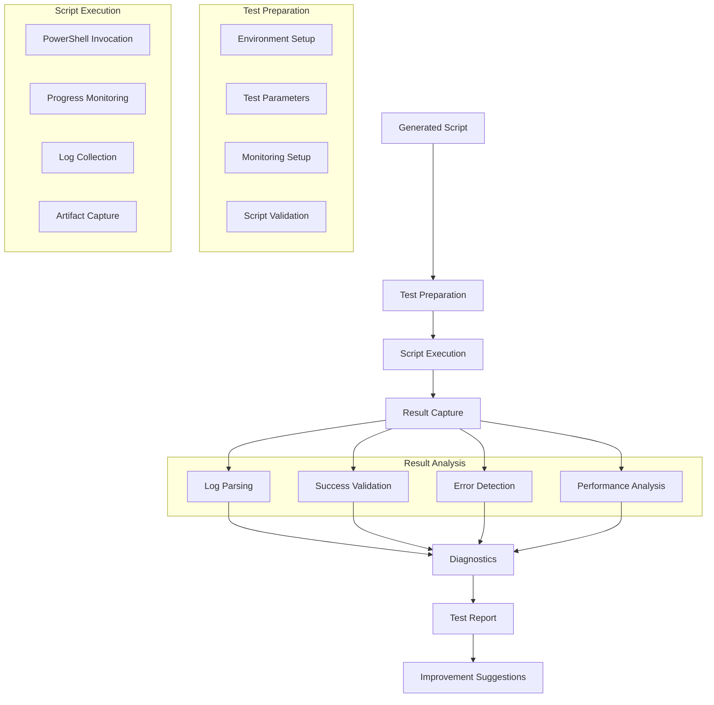

# Story 3.6: PSADT Testing Integration

**Status:** Draft

## Non-Technical Explanation

This story involves creating a system that automatically tests generated PSADT scripts to verify they work correctly before deploying them to production. Think of it like having a quality assurance team that checks your product works as intended before shipping it to customers.

The system will execute the generated scripts in a controlled test environment, monitoring for errors, validating the installation was successful, and analyzing logs for warnings or issues. This automated testing catches problems that might otherwise only be discovered during actual deployment—such as incorrect parameters, missing dependencies, or compatibility problems.

Similar to how car manufacturers test their vehicles on closed tracks before releasing them for road use, this feature allows packaging engineers to verify and refine their deployment scripts before rolling them out to users. By catching and resolving these issues early, the system helps avoid costly deployment failures and user disruption.

## Why This Matters

Automated testing of deployment scripts is crucial for several reasons:

1. **Failure Prevention**: Many deployment failures could be prevented with proper testing before release.

2. **Confidence Building**: Engineers need confidence that their packages will deploy correctly before sending them to production.

3. **Time Savings**: Automated testing dramatically reduces the manual validation effort required for each package.

4. **Consistency**: Testing ensures that all packages meet a minimum quality standard before deployment.

5. **Documentation**: Test results provide valuable documentation of what was tested and how the package performs.

Without automated testing, organizations often rely on manual testing or, worse, discover problems only after deploying to users. This feature significantly reduces deployment failures and support tickets by identifying and resolving issues earlier in the process.

## Goal & Context

**User Story:** As a packaging engineer, I need the system to test generated PSADT scripts to verify functionality.

**Context:** Building upon the script generation capabilities (Stories 3.2-3.5), this story adds the ability to execute and test scripts in a controlled environment, validating the results and providing feedback on potential issues before deployment.

## Detailed Requirements

- Implement automated execution of generated scripts
- Create validation of installation results
- Develop capture and analysis of execution logs
- Implement failure detection and diagnostics
- Create reporting of test results
- Document testing methodology and limitations

## Acceptance Criteria (ACs)

- AC1: System successfully executes generated scripts
- AC2: Validation correctly identifies successful installations
- AC3: Log analysis detects errors and warnings
- AC4: Diagnostics provide useful information for failures
- AC5: Reporting clearly communicates test results

## Technical Implementation Context

**Guidance:** Use the following details for implementation. Refer to the linked `docs/` files for broader context if needed.

- **Relevant Files:**

  - Files to Create: 
    - `backend/apas/agents/psadt/testing/test_executor.py` - Script execution engine
    - `backend/apas/agents/psadt/testing/result_validator.py` - Test result validation
    - `backend/apas/agents/psadt/testing/log_analyzer.py` - Log analysis
    - `backend/apas/agents/psadt/testing/diagnostics.py` - Diagnostic utilities
    - `backend/apas/models/test_result.py` - Test result models
    - `docs/developer-guide/psadt-testing.md` - Documentation
  - Files to Modify:
    - `backend/apas/agents/psadt/generator/script_generator.py` - Add testing integration
    - `backend/apas/agents/psadt/agent.py` - Add testing capabilities
  - _(Hint: See `docs/architecture/project-structure.md` for overall layout)_

- **Key Technologies:**

  - Python for test orchestration
  - PowerShell for script execution
  - Virtualization (optional) for isolated testing
  - Log parsing libraries
  - Pattern matching for result validation
  - _(Hint: See `docs/architecture/tech-stack.md` for technology details)_

- **API Interactions / SDK Usage:**

  - PowerShell execution from Python
  - File system operations for artifacts
  - Log file processing
  - Script modification for testing
  - Event publishing for status updates
  - _(Hint: See `docs/architecture/api-reference.md` for API patterns)_

- **Data Structures:**

  - `TestEnvironment` model for environment configuration
  - `TestExecution` model for execution details
  - `TestResult` model for structured results
  - `LogEntry` model for parsed log entries
  - `Diagnostic` model for diagnostic information
  - _(Hint: See `docs/architecture/data-models.md` for structure details)_

- **Environment Variables:**

  - `TEST_ENVIRONMENT` - Test environment configuration
  - `MAX_TEST_DURATION` - Maximum test duration in seconds
  - `CAPTURE_SCREENSHOTS` - Whether to capture screenshots during testing
  - _(Hint: See `docs/architecture/environment-vars.md` for details)_

- **Coding Standards Notes:**
  - Implement proper cleanup after testing
  - Create comprehensive error handling
  - Provide detailed logging of test process
  - Use isolated environments when possible
  - Create reproducible test cases
  - _(Hint: See `docs/architecture/coding-standards.md` for full standards)_

## Visual Design Reference

The testing process follows this workflow:



## Tasks / Subtasks

- [ ] Design testing architecture
  - [ ] Define test environment requirements
  - [ ] Create execution workflow
  - [ ] Design result validation approach
  - [ ] Define diagnostic methodology
  - [ ] Create reporting structure
- [ ] Implement test environment management
  - [ ] Create environment configuration
  - [ ] Implement preparation steps
  - [ ] Develop cleanup procedures
  - [ ] Create environment isolation
  - [ ] Implement prerequisite validation
- [ ] Implement script execution
  - [ ] Create PowerShell invocation from Python
  - [ ] Implement parameter passing
  - [ ] Develop progress monitoring
  - [ ] Create timeout handling
  - [ ] Implement execution logging
- [ ] Implement result capture
  - [ ] Create log file collection
  - [ ] Implement screenshot capture
  - [ ] Develop artifact collection
  - [ ] Create registry change tracking
  - [ ] Implement system state capture
- [ ] Implement results analysis
  - [ ] Create log parsing
  - [ ] Implement success validation
  - [ ] Develop error pattern detection
  - [ ] Create warning identification
  - [ ] Implement performance analysis
- [ ] Implement diagnostics
  - [ ] Create error diagnostics
  - [ ] Implement root cause analysis
  - [ ] Develop improvement suggestions
  - [ ] Create common issue detection
  - [ ] Implement reference lookup
- [ ] Create test reporting
  - [ ] Implement structured reports
  - [ ] Create visual result indicators
  - [ ] Develop detailed log views
  - [ ] Create diagnostic summaries
  - [ ] Implement test comparison
- [ ] Implement testing integration
  - [ ] Create integration with script generation
  - [ ] Implement inline script modification for testing
  - [ ] Develop test-based script refinement
  - [ ] Create test result persistence
  - [ ] Implement test history tracking

## Manual Testing Guide (For Non-Technical Users)

You can verify the PSADT Testing Integration is working correctly through these checks:

1. **Basic Test Execution**:
   - Generate a PSADT script for a simple installer
   - Initiate a test run using the testing system
   - Monitor the test execution in real-time
   - Review the test report after completion
   - Verify that the test results accurately reflect the installation outcome

2. **Failed Test Identification**:
   - Modify a script to include an intentional error
   - Run the test system on the modified script
   - Verify that the system correctly identifies the failure
   - Check that the diagnostic information pinpoints the error
   - Confirm that the report clearly indicates what failed and why

3. **Performance Test**:
   - Test a script with a larger application
   - Verify that the system tracks performance metrics
   - Check that any performance warnings are highlighted
   - Confirm that the report includes timing information
   - Review any optimization suggestions provided

4. **Expected Results**:
   - Test execution should complete within a reasonable time
   - Results should clearly indicate success or failure
   - Log analysis should identify any warnings or errors
   - Diagnostics should provide actionable information
   - Reports should be clear and easy to understand

## Testing Requirements

**Guidance:** Verify implementation against the ACs using the following tests.

- **Unit Tests:** 
  - Test PowerShell execution from Python
  - Verify log parsing functionality
  - Test result validation logic
  - Validate diagnostic algorithms
  - Test report generation

- **Integration Tests:** 
  - Test end-to-end execution with sample scripts
  - Verify results capture and analysis
  - Test with various script types and scenarios
  - Validate error handling and recovery
  - Test integration with script generation

- **Manual Verification:** 
  - Test with real application installers
  - Verify results match manual testing
  - Check diagnostic accuracy with known issues
  - Validate report usefulness for troubleshooting
  - Test in various environment configurations

## Implementation Example

Here's an example implementation of the PSADT testing system:

```python
from enum import Enum, auto
from typing import Dict, Any, Optional, List, Set, Tuple, Union
from pathlib import Path
import logging
import os
import re
import subprocess
import tempfile
from dataclasses import dataclass, field
import json
import time
import shutil
from datetime import datetime, timedelta

class TestStatus(Enum):
    """Status of a test execution."""
    PENDING = "pending"
    RUNNING = "running"
    SUCCEEDED = "succeeded"
    FAILED = "failed"
    TIMEOUT = "timeout"
    ERROR = "error"
    
    def is_finished(self) -> bool:
        """Check if the status indicates the test is finished."""
        return self != TestStatus.PENDING and self != TestStatus.RUNNING

@dataclass
class TestEnvironment:
    """Configuration for a test environment."""
    name: str
    description: str
    working_dir: Path
    psadt_dir: Path
    files_dir: Path
    logs_dir: Path
    temp_dir: Path
    max_duration: int = 600  # 10 minutes
    capture_screenshots: bool = False
    cleanup_after_test: bool = True
    is_isolated: bool = False  # True if using virtualization
    
    def __post_init__(self):
        """Ensure directories exist."""
        for dir_path in [self.working_dir, self.psadt_dir, self.files_dir, 
                         self.logs_dir, self.temp_dir]:
            os.makedirs(dir_path, exist_ok=True)
    
    def cleanup(self) -> None:
        """Clean up the environment."""
        if not self.cleanup_after_test:
            return
        
        # Clean up temporary files
        for item in os.listdir(self.temp_dir):
            item_path = os.path.join(self.temp_dir, item)
            try:
                if os.path.isfile(item_path):
                    os.unlink(item_path)
                elif os.path.isdir(item_path):
                    shutil.rmtree(item_path)
            except Exception as e:
                logging.error(f"Error cleaning up {item_path}: {e}")

@dataclass
class LogEntry:
    """Entry from a PSADT log file."""
    timestamp: datetime
    severity: str
    source: str
    message: str
    raw_text: str
    
    @property
    def is_error(self) -> bool:
        """Check if this is an error log entry."""
        return self.severity.lower() in ["error", "3"]
    
    @property
    def is_warning(self) -> bool:
        """Check if this is a warning log entry."""
        return self.severity.lower() in ["warning", "2"]
    
    @property
    def is_info(self) -> bool:
        """Check if this is an info log entry."""
        return self.severity.lower() in ["info", "1"]
    
    def __str__(self) -> str:
        """Return a string representation of the log entry."""
        return f"[{self.timestamp}] {self.severity}: {self.message}"

@dataclass
class TestExecutionConfig:
    """Configuration for a test execution."""
    script_path: Path
    deployment_type: str = "Install"  # "Install" or "Uninstall"
    parameters: Dict[str, Any] = field(default_factory=dict)
    timeout: int = 600  # 10 minutes
    
    def get_command_args(self) -> List[str]:
        """Get command arguments for PowerShell."""
        args = ["-DeploymentType", self.deployment_type]
        
        for name, value in self.parameters.items():
            # Boolean parameters
            if isinstance(value, bool):
                if value:
                    args.append(f"-{name}")
            # Other parameters
            else:
                args.append(f"-{name}")
                args.append(str(value))
        
        return args

@dataclass
class Diagnostic:
    """Diagnostic information for a test issue."""
    issue_type: str
    message: str
    severity: str
    source: Optional[str] = None
    timestamp: Optional[datetime] = None
    log_entry: Optional[LogEntry] = None
    context: Dict[str, Any] = field(default_factory=dict)
    recommendation: Optional[str] = None
    
    def __str__(self) -> str:
        """Return a string representation of the diagnostic."""
        ts = f" [{self.timestamp}]" if self.timestamp else ""
        src = f" ({self.source})" if self.source else ""
        rec = f"\nRecommendation: {self.recommendation}" if self.recommendation else ""
        return f"{self.severity} - {self.issue_type}{ts}{src}: {self.message}{rec}"

@dataclass
class TestResult:
    """Result of a test execution."""
    status: TestStatus
    start_time: datetime
    end_time: Optional[datetime] = None
    exit_code: Optional[int] = None
    log_entries: List[LogEntry] = field(default_factory=list)
    diagnostics: List[Diagnostic] = field(default_factory=list)
    artifacts: Dict[str, Path] = field(default_factory=dict)
    execution_time: float = 0.0
    
    @property
    def duration(self) -> timedelta:
        """Get the duration of the test."""
        if self.end_time:
            return self.end_time - self.start_time
        return datetime.now() - self.start_time
    
    @property
    def was_successful(self) -> bool:
        """Check if the test was successful."""
        return self.status == TestStatus.SUCCEEDED
    
    @property
    def has_errors(self) -> bool:
        """Check if the test had errors."""
        return any(entry.is_error for entry in self.log_entries)
    
    @property
    def has_warnings(self) -> bool:
        """Check if the test had warnings."""
        return any(entry.is_warning for entry in self.log_entries)
    
    def add_log_entry(self, entry: LogEntry) -> None:
        """Add a log entry to the results."""
        self.log_entries.append(entry)
    
    def add_diagnostic(self, diagnostic: Diagnostic) -> None:
        """Add a diagnostic to the results."""
        self.diagnostics.append(diagnostic)
    
    def add_artifact(self, name: str, path: Path) -> None:
        """Add an artifact to the results."""
        self.artifacts[name] = path
    
    def get_errors(self) -> List[LogEntry]:
        """Get all error log entries."""
        return [entry for entry in self.log_entries if entry.is_error]
    
    def get_warnings(self) -> List[LogEntry]:
        """Get all warning log entries."""
        return [entry for entry in self.log_entries if entry.is_warning]
    
    def __str__(self) -> str:
        """Return a string representation of the test result."""
        return f"Test Result: {self.status.name}, Duration: {self.duration}, Errors: {len(self.get_errors())}, Warnings: {len(self.get_warnings())}"

class TestExecutor:
    """Executes and monitors PSADT script tests."""
    
    def __init__(self, 
                environment: TestEnvironment,
                powershell_path: str = "powershell"):
        self.logger = logging.getLogger(__name__)
        self.environment = environment
        self.powershell_path = powershell_path
    
    def execute_test(self, config: TestExecutionConfig) -> TestResult:
        """
        Execute a test with the given configuration.
        
        Args:
            config: Test execution configuration
            
        Returns:
            TestResult: Test execution result
        """
        self.logger.info(f"Executing test for script: {config.script_path}")
        
        # Create test result
        result = TestResult(
            status=TestStatus.RUNNING,
            start_time=datetime.now()
        )
        
        try:
            # Prepare environment
            self._prepare_environment()
            
            # Prepare script
            prepared_script = self._prepare_script(config.script_path)
            
            # Execute script
            exit_code = self._execute_script(prepared_script, config, result)
            
            # Set exit code
            result.exit_code = exit_code
            
            # Determine status based on exit code
            if exit_code == 0:
                result.status = TestStatus.SUCCEEDED
            else:
                result.status = TestStatus.FAILED
            
            # Collect artifacts
            self._collect_artifacts(result)
            
            # Set end time
            result.end_time = datetime.now()
            result.execution_time = (result.end_time - result.start_time).total_seconds()
            
            self.logger.info(f"Test execution completed: {result}")
            return result
            
        except subprocess.TimeoutExpired:
            self.logger.error(f"Test execution timed out after {config.timeout} seconds")
            result.status = TestStatus.TIMEOUT
            result.end_time = datetime.now()
            result.execution_time = (result.end_time - result.start_time).total_seconds()
            
            # Add timeout diagnostic
            result.add_diagnostic(Diagnostic(
                issue_type="Timeout",
                message=f"Test execution timed out after {config.timeout} seconds",
                severity="Error"
            ))
            
            return result
            
        except Exception as e:
            self.logger.error(f"Error executing test: {str(e)}")
            result.status = TestStatus.ERROR
            result.end_time = datetime.now()
            result.execution_time = (result.end_time - result.start_time).total_seconds()
            
            # Add error diagnostic
            result.add_diagnostic(Diagnostic(
                issue_type="ExecutionError",
                message=f"Error executing test: {str(e)}",
                severity="Error"
            ))
            
            return result
        finally:
            # Clean up environment
            self.environment.cleanup()
    
    def _prepare_environment(self) -> None:
        """Prepare the test environment."""
        self.logger.info("Preparing test environment")
        
        # Ensure PSADT structure exists
        files_dir = os.path.join(self.environment.psadt_dir, "Files")
        supportfiles_dir = os.path.join(self.environment.psadt_dir, "SupportFiles")
        
        os.makedirs(files_dir, exist_ok=True)
        os.makedirs(supportfiles_dir, exist_ok=True)
        
        # Clear previous logs
        logs_dir = self.environment.logs_dir
        for log_file in os.listdir(logs_dir):
            if log_file.endswith(".log"):
                try:
                    os.unlink(os.path.join(logs_dir, log_file))
                except:
                    pass
    
    def _prepare_script(self, script_path: Path) -> Path:
        """
        Prepare the script for testing.
        
        Args:
            script_path: Path to the script to test
            
        Returns:
            Path: Path to the prepared script
        """
        self.logger.info(f"Preparing script for testing: {script_path}")
        
        # Copy script to the test environment
        test_script_path = os.path.join(self.environment.psadt_dir, "Deploy-Application.ps1")
        
        # Read script content
        with open(script_path, "r", encoding="utf-8-sig") as f:
            script_content = f.read()
        
        # Modify script for testing if needed
        # In a real implementation, this would make testing-specific modifications
        
        # Write modified script
        with open(test_script_path, "w", encoding="utf-8") as f:
            f.write(script_content)
        
        return Path(test_script_path)
    
    def _execute_script(self, 
                      script_path: Path, 
                      config: TestExecutionConfig,
                      result: TestResult) -> int:
        """
        Execute the script with PowerShell.
        
        Args:
            script_path: Path to the prepared script
            config: Test execution configuration
            result: Test result to update with log entries
            
        Returns:
            int: Exit code from the script execution
        """
        self.logger.info(f"Executing script: {script_path}")
        
        # Prepare command
        cmd = [
            self.powershell_path,
            "-NoProfile",
            "-ExecutionPolicy", "Bypass",
            "-File", str(script_path)
        ] + config.get_command_args()
        
        self.logger.info(f"Command: {' '.join(cmd)}")
        
        # Create log parser
        log_parser = LogParser(self.environment.logs_dir)
        
        # Start log monitoring
        log_parser.start_monitoring()
        
        try:
            # Execute script
            process = subprocess.run(
                cmd,
                cwd=self.environment.psadt_dir,
                text=True,
                capture_output=True,
                timeout=config.timeout
            )
            
            # Get exit code
            exit_code = process.returncode
            
            # Log stdout/stderr
            if process.stdout:
                self.logger.debug(f"Script stdout:\n{process.stdout}")
            
            if process.stderr:
                self.logger.warning(f"Script stderr:\n{process.stderr}")
            
            # Stop log monitoring and get log entries
            log_entries = log_parser.stop_monitoring()
            
            # Add log entries to result
            for entry in log_entries:
                result.add_log_entry(entry)
            
            return exit_code
            
        except subprocess.TimeoutExpired:
            # Stop log monitoring
            log_parser.stop_monitoring()
            raise
        except Exception as e:
            # Stop log monitoring
            log_parser.stop_monitoring()
            raise
    
    def _collect_artifacts(self, result: TestResult) -> None:
        """
        Collect artifacts from the test execution.
        
        Args:
            result: Test result to update with artifacts
        """
        self.logger.info("Collecting test artifacts")
        
        # Collect log files
        logs_dir = self.environment.logs_dir
        for log_file in os.listdir(logs_dir):
            if log_file.endswith(".log"):
                log_path = os.path.join(logs_dir, log_file)
                result.add_artifact(f"Log_{log_file}", Path(log_path))
        
        # Collect screenshots if enabled
        if self.environment.capture_screenshots:
            # In a real implementation, this would collect screenshots
            pass

class LogParser:
    """Parses and monitors PSADT log files."""
    
    def __init__(self, logs_dir: str):
        self.logger = logging.getLogger(__name__)
        self.logs_dir = logs_dir
        self.monitoring = False
        self.log_entries = []
        self._last_check_time = datetime.now()
    
    def start_monitoring(self) -> None:
        """Start monitoring log files."""
        self.logger.info("Starting log monitoring")
        self.monitoring = True
        self.log_entries = []
        self._last_check_time = datetime.now()
    
    def stop_monitoring(self) -> List[LogEntry]:
        """
        Stop monitoring log files.
        
        Returns:
            List[LogEntry]: All log entries collected during monitoring
        """
        self.logger.info("Stopping log monitoring")
        self.monitoring = False
        
        # Final check for new log entries
        self._check_for_new_entries()
        
        return self.log_entries
    
    def _check_for_new_entries(self) -> None:
        """Check for new log entries."""
        # Get all log files
        log_files = []
        for file in os.listdir(self.logs_dir):
            if file.endswith(".log"):
                log_files.append(os.path.join(self.logs_dir, file))
        
        # Parse each log file
        for log_file in log_files:
            try:
                self._parse_log_file(log_file)
            except Exception as e:
                self.logger.error(f"Error parsing log file {log_file}: {str(e)}")
        
        # Update last check time
        self._last_check_time = datetime.now()
    
    def _parse_log_file(self, log_file: str) -> None:
        """
        Parse a log file for new entries.
        
        Args:
            log_file: Path to the log file
        """
        # Get file modification time
        mod_time = datetime.fromtimestamp(os.path.getmtime(log_file))
        
        # Skip if file hasn't been modified since last check
        if mod_time < self._last_check_time:
            return
        
        try:
            with open(log_file, "r", encoding="utf-8") as f:
                log_content = f.read()
            
            # Parse log entries
            entries = self._parse_log_content(log_content)
            
            # Add new entries
            for entry in entries:
                if not any(e.raw_text == entry.raw_text for e in self.log_entries):
                    self.log_entries.append(entry)
                    
        except Exception as e:
            self.logger.error(f"Error reading log file {log_file}: {str(e)}")
    
    def _parse_log_content(self, content: str) -> List[LogEntry]:
        """
        Parse log content into entries.
        
        Args:
            content: Log file content
            
        Returns:
            List[LogEntry]: Parsed log entries
        """
        entries = []
        
        # Process each line
        for line in content.splitlines():
            line = line.strip()
            if not line:
                continue
            
            # Try to parse as a log entry
            entry = self._parse_log_line(line)
            if entry:
                entries.append(entry)
        
        return entries
    
    def _parse_log_line(self, line: str) -> Optional[LogEntry]:
        """
        Parse a log line into a log entry.
        
        Args:
            line: Log line to parse
            
        Returns:
            Optional[LogEntry]: Parsed log entry, or None if line is not a valid entry
        """
        # PSADT log format: [timestamp] severity:source: message
        log_match = re.match(r"\[(.*?)\]\s+(\w+):(.*?):\s+(.*)", line)
        if log_match:
            try:
                timestamp_str = log_match.group(1)
                severity = log_match.group(2)
                source = log_match.group(3).strip()
                message = log_match.group(4).strip()
                
                # Parse timestamp
                timestamp = datetime.strptime(timestamp_str, "%Y-%m-%d %H:%M:%S")
                
                return LogEntry(
                    timestamp=timestamp,
                    severity=severity,
                    source=source,
                    message=message,
                    raw_text=line
                )
            except Exception as e:
                self.logger.warning(f"Error parsing log line: {line}, {str(e)}")
                return None
        
        # Alternative format: [timestamp] [severity:source] message
        alt_match = re.match(r"\[(.*?)\]\s+\[(\w+):(.*?)\]\s+(.*)", line)
        if alt_match:
            try:
                timestamp_str = alt_match.group(1)
                severity = alt_match.group(2)
                source = alt_match.group(3).strip()
                message = alt_match.group(4).strip()
                
                # Parse timestamp
                timestamp = datetime.strptime(timestamp_str, "%Y-%m-%d %H:%M:%S")
                
                return LogEntry(
                    timestamp=timestamp,
                    severity=severity,
                    source=source,
                    message=message,
                    raw_text=line
                )
            except Exception as e:
                self.logger.warning(f"Error parsing alternative log line: {line}, {str(e)}")
                return None
        
        return None

class ResultValidator:
    """Validates test results and generates diagnostics."""
    
    def __init__(self):
        self.logger = logging.getLogger(__name__)
    
    def validate_result(self, result: TestResult) -> None:
        """
        Validate a test result and generate diagnostics.
        
        Args:
            result: Test result to validate
        """
        self.logger.info("Validating test result")
        
        # Check exit code
        self._check_exit_code(result)
        
        # Analyze logs
        self._analyze_logs(result)
        
        # Validate installation success
        self._validate_installation(result)
        
        # Check execution time
        self._check_execution_time(result)
    
    def _check_exit_code(self, result: TestResult) -> None:
        """Check the exit code and generate diagnostics."""
        if result.exit_code is None:
            return
        
        if result.exit_code != 0:
            result.add_diagnostic(Diagnostic(
                issue_type="ExitCodeError",
                message=f"Script exited with non-zero exit code: {result.exit_code}",
                severity="Error"
            ))
            
            # Look for common exit codes
            if result.exit_code == 1603:
                result.add_diagnostic(Diagnostic(
                    issue_type="MSIError",
                    message="MSI installation failed with error 1603 (Fatal Error)",
                    severity="Error",
                    recommendation="Check for missing prerequisites or permissions"
                ))
            elif result.exit_code == 1618:
                result.add_diagnostic(Diagnostic(
                    issue_type="MSIError",
                    message="MSI installation failed with error 1618 (Another installation is in progress)",
                    severity="Error",
                    recommendation="Ensure no other installations are running"
                ))
            elif result.exit_code == 1619:
                result.add_diagnostic(Diagnostic(
                    issue_type="MSIError",
                    message="MSI installation failed with error 1619 (Installation package could not be opened)",
                    severity="Error",
                    recommendation="Check if the MSI file exists and is not corrupted"
                ))
            elif result.exit_code == 3010:
                result.add_diagnostic(Diagnostic(
                    issue_type="RebootRequired",
                    message="Installation successful but requires a reboot (exit code 3010)",
                    severity="Warning",
                    recommendation="A reboot will be required to complete the installation"
                ))
    
    def _analyze_logs(self, result: TestResult) -> None:
        """Analyze log entries and generate diagnostics."""
        # Check for errors
        for error in result.get_errors():
            result.add_diagnostic(Diagnostic(
                issue_type="LogError",
                message=error.message,
                severity="Error",
                source=error.source,
                timestamp=error.timestamp,
                log_entry=error
            ))
        
        # Check for warnings
        for warning in result.get_warnings():
            result.add_diagnostic(Diagnostic(
                issue_type="LogWarning",
                message=warning.message,
                severity="Warning",
                source=warning.source,
                timestamp=warning.timestamp,
                log_entry=warning
            ))
        
        # Look for specific patterns in logs
        self._check_log_patterns(result)
    
    def _check_log_patterns(self, result: TestResult) -> None:
        """Check for specific patterns in log entries."""
        for entry in result.log_entries:
            # Check for common issues
            if "access denied" in entry.message.lower():
                result.add_diagnostic(Diagnostic(
                    issue_type="PermissionIssue",
                    message=f"Permission issue detected: {entry.message}",
                    severity="Error",
                    source=entry.source,
                    timestamp=entry.timestamp,
                    log_entry=entry,
                    recommendation="Check if the script is running with sufficient permissions"
                ))
            elif "file not found" in entry.message.lower():
                result.add_diagnostic(Diagnostic(
                    issue_type="FileNotFound",
                    message=f"File not found: {entry.message}",
                    severity="Error",
                    source=entry.source,
                    timestamp=entry.timestamp,
                    log_entry=entry,
                    recommendation="Check if the file exists in the correct location"
                ))
            elif "timeout" in entry.message.lower():
                result.add_diagnostic(Diagnostic(
                    issue_type="OperationTimeout",
                    message=f"Operation timed out: {entry.message}",
                    severity="Error",
                    source=entry.source,
                    timestamp=entry.timestamp,
                    log_entry=entry,
                    recommendation="Check if the operation is taking too long or is hanging"
                ))
    
    def _validate_installation(self, result: TestResult) -> None:
        """Validate if the installation was successful."""
        # Check if test failed
        if result.status == TestStatus.FAILED:
            return
        
        # Look for installation success markers in logs
        installation_succeeded = False
        
        for entry in result.log_entries:
            if "installation completed successfully" in entry.message.lower():
                installation_succeeded = True
                break
        
        if not installation_succeeded:
            # Look for other success indicators
            for entry in result.log_entries:
                if "installation successful" in entry.message.lower() or "completed successfully" in entry.message.lower():
                    installation_succeeded = True
                    break
        
        if not installation_succeeded and result.status == TestStatus.SUCCEEDED:
            # Test completed with exit code 0, but no explicit success message found
            result.add_diagnostic(Diagnostic(
                issue_type="ValidationWarning",
                message="Script completed with exit code 0, but no explicit installation success message was found in logs",
                severity="Warning",
                recommendation="Verify that the installation was actually successful"
            ))
    
    def _check_execution_time(self, result: TestResult) -> None:
        """Check the execution time and generate diagnostics."""
        if result.execution_time > 300:  # 5 minutes
            result.add_diagnostic(Diagnostic(
                issue_type="LongExecutionTime",
                message=f"Script execution took {result.execution_time:.1f} seconds, which is longer than expected",
                severity="Warning",
                recommendation="Check for performance issues or unnecessary waits in the script"
            ))

class TestReportGenerator:
    """Generates test reports from test results."""
    
    def __init__(self):
        self.logger = logging.getLogger(__name__)
    
    def generate_report(self, result: TestResult) -> Dict[str, Any]:
        """
        Generate a report from a test result.
        
        Args:
            result: Test result to report on
            
        Returns:
            Dict[str, Any]: Structured report
        """
        self.logger.info("Generating test report")
        
        # Create base report structure
        report = {
            "status": result.status.name,
            "execution_time": result.execution_time,
            "start_time": result.start_time.isoformat(),
            "end_time": result.end_time.isoformat() if result.end_time else None,
            "exit_code": result.exit_code,
            "summary": self._generate_summary(result),
            "diagnostics": self._format_diagnostics(result),
            "log_entries": self._format_log_entries(result),
            "artifacts": self._format_artifacts(result),
            "recommendations": self._generate_recommendations(result)
        }
        
        return report
    
    def _generate_summary(self, result: TestResult) -> Dict[str, Any]:
        """Generate a summary of the test result."""
        return {
            "status": result.status.name,
            "duration": str(result.duration),
            "error_count": len(result.get_errors()),
            "warning_count": len(result.get_warnings()),
            "diagnostic_count": len(result.diagnostics),
            "artifact_count": len(result.artifacts)
        }
    
    def _format_diagnostics(self, result: TestResult) -> List[Dict[str, Any]]:
        """Format diagnostics for the report."""
        diagnostics = []
        
        for diag in result.diagnostics:
            formatted = {
                "issue_type": diag.issue_type,
                "message": diag.message,
                "severity": diag.severity
            }
            
            if diag.source:
                formatted["source"] = diag.source
                
            if diag.timestamp:
                formatted["timestamp"] = diag.timestamp.isoformat()
                
            if diag.recommendation:
                formatted["recommendation"] = diag.recommendation
                
            diagnostics.append(formatted)
        
        return diagnostics
    
    def _format_log_entries(self, result: TestResult) -> List[Dict[str, Any]]:
        """Format log entries for the report."""
        entries = []
        
        for entry in result.log_entries:
            formatted = {
                "timestamp": entry.timestamp.isoformat(),
                "severity": entry.severity,
                "source": entry.source,
                "message": entry.message
            }
            
            entries.append(formatted)
        
        return entries
    
    def _format_artifacts(self, result: TestResult) -> Dict[str, str]:
        """Format artifacts for the report."""
        artifacts = {}
        
        for name, path in result.artifacts.items():
            artifacts[name] = str(path)
        
        return artifacts
    
    def _generate_recommendations(self, result: TestResult) -> List[str]:
        """Generate recommendations based on the test result."""
        recommendations = []
        
        # Add recommendations from diagnostics
        for diag in result.diagnostics:
            if diag.recommendation and diag.recommendation not in recommendations:
                recommendations.append(diag.recommendation)
        
        # Add general recommendations based on status
        if result.status == TestStatus.FAILED:
            if not result.has_errors and result.exit_code != 0:
                recommendations.append("Script failed with non-zero exit code but no errors were logged. Check for silent failures.")
            
            if not recommendations:
                recommendations.append("Check the log for errors to determine why the script failed.")
        
        elif result.status == TestStatus.TIMEOUT:
            recommendations.append("Script execution timed out. Check for operations that might be taking too long or hanging.")
        
        elif result.status == TestStatus.ERROR:
            recommendations.append("An error occurred during test execution. Check the diagnostics for details.")
        
        return recommendations

class PSADTTester:
    """Main class for PSADT testing."""
    
    def __init__(self, 
                base_dir: str,
                powershell_path: str = "powershell",
                max_duration: int = 600,
                capture_screenshots: bool = False):
        self.logger = logging.getLogger(__name__)
        self.base_dir = base_dir
        self.powershell_path = powershell_path
        self.max_duration = max_duration
        self.capture_screenshots = capture_screenshots
        
        # Create test environment
        self.environment = self._create_test_environment()
        
        # Create components
        self.executor = TestExecutor(self.environment, powershell_path)
        self.validator = ResultValidator()
        self.report_generator = TestReportGenerator()
    
    def _create_test_environment(self) -> TestEnvironment:
        """Create a test environment."""
        # Create directory structure
        working_dir = os.path.join(self.base_dir, "testing")
        psadt_dir = os.path.join(working_dir, "PSADT")
        files_dir = os.path.join(psadt_dir, "Files")
        logs_dir = os.path.join(working_dir, "logs")
        temp_dir = os.path.join(working_dir, "temp")
        
        # Create environment
        return TestEnvironment(
            name="StandardTestEnvironment",
            description="Standard test environment for PSADT scripts",
            working_dir=Path(working_dir),
            psadt_dir=Path(psadt_dir),
            files_dir=Path(files_dir),
            logs_dir=Path(logs_dir),
            temp_dir=Path(temp_dir),
            max_duration=self.max_duration,
            capture_screenshots=self.capture_screenshots
        )
    
    def test_script(self, 
                  script_path: str,
                  deployment_type: str = "Install",
                  parameters: Dict[str, Any] = None) -> Dict[str, Any]:
        """
        Test a PSADT script.
        
        Args:
            script_path: Path to the script to test
            deployment_type: Deployment type (Install or Uninstall)
            parameters: Additional parameters for the script
            
        Returns:
            Dict[str, Any]: Test report
        """
        self.logger.info(f"Testing script: {script_path}")
        
        # Create test configuration
        config = TestExecutionConfig(
            script_path=Path(script_path),
            deployment_type=deployment_type,
            parameters=parameters or {},
            timeout=self.max_duration
        )
        
        # Execute test
        result = self.executor.execute_test(config)
        
        # Validate result
        self.validator.validate_result(result)
        
        # Generate report
        report = self.report_generator.generate_report(result)
        
        return report

# Example usage
if __name__ == "__main__":
    # Configure logging
    logging.basicConfig(level=logging.INFO)
    
    # Create tester
    tester = PSADTTester(
        base_dir="C:\\PSADT_Testing",
        powershell_path="powershell",
        max_duration=300,  # 5 minutes
        capture_screenshots=False
    )
    
    # Test a script
    report = tester.test_script(
        script_path="C:\\Scripts\\Deploy-Application.ps1",
        deployment_type="Install",
        parameters={
            "DeployMode": "Silent"
        }
    )
    
    # Print report summary
    print(f"Test Status: {report['status']}")
    print(f"Execution Time: {report['execution_time']:.1f} seconds")
    print(f"Errors: {report['summary']['error_count']}")
    print(f"Warnings: {report['summary']['warning_count']}")
    
    if report['diagnostics']:
        print("\nDiagnostics:")
        for diag in report['diagnostics']:
            print(f"- {diag['severity']}: {diag['issue_type']} - {diag['message']}")
    
    if report['recommendations']:
        print("\nRecommendations:")
        for rec in report['recommendations']:
            print(f"- {rec}")
```

## Story Wrap Up (Agent Populates After Execution)

- **Agent Model Used:** 
- **Completion Notes:** 
- **Change Log:** 
  - Initial Draft