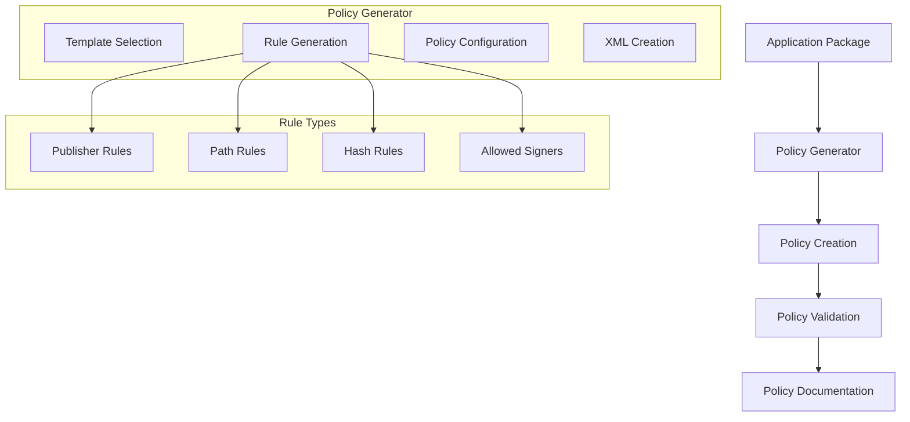

# Story 4.1: WDAC Policy Generation Framework

**Status:** Draft

## Non-Technical Explanation

This story involves creating a system that automatically generates security policies for Windows applications. Think of it like having an expert security consultant who knows exactly how to configure permissions that allow your application to work properly while keeping everything else locked down.

Windows Defender Application Control (WDAC) policies are powerful but complex security tools that control which applications and code can run on a computer. Creating these policies manually requires specialized knowledge and significant time investment. This automated system analyzes applications and generates appropriate policies that balance security with functionality.

Similar to how a home security system uses smart rules to allow family members to enter while keeping intruders out, this feature creates intelligent rules that allow legitimate application components to run while blocking potentially malicious code. By generating these policies automatically, the system saves packaging engineers hours of manual configuration while maintaining strong security postures.

## Why This Matters

Automated WDAC policy generation is essential for several reasons:

1. **Security Requirement**: Many organizations now require WDAC policies for all deployed applications to meet security standards.

2. **Configuration Complexity**: Creating effective WDAC policies manually requires deep expertise and is time-consuming.

3. **Balancing Act**: Effective policies must carefully balance security with application functionality.

4. **Consistency**: Automated generation ensures policies follow best practices and organizational standards.

5. **Time Savings**: Reduces what would typically be hours of manual work to minutes of automated processing.

Without automated policy generation, organizations must either invest significant time in manual policy creation, potentially delay application deployments, or worse, deploy applications without proper security controls.

## Goal & Context

**User Story:** As a packaging engineer, I need the system to generate baseline WDAC policies for applications that ensure proper functionality while maintaining security.

**Context:** This story establishes the core WDAC policy generation capability that will be used by subsequent stories in this epic. It creates the policy generation framework that other stories will enhance with code signing analysis, testing, refinement, and documentation.

## Detailed Requirements

- Implement policy generation based on application analysis
- Create template-based policy structure
- Develop customization options for organization requirements
- Implement policy validation against best practices
- Create policy documentation generation
- Support latest WDAC features including "App Control for Business"

## Acceptance Criteria (ACs)

- AC1: System generates valid WDAC policies for test applications
- AC2: Policies follow template structure while incorporating application specifics
- AC3: Organization requirements are properly reflected in policies
- AC4: Validation identifies potential issues before deployment
- AC5: Documentation clearly explains policy components and rationale

## Technical Implementation Context

**Guidance:** Use the following details for implementation. Refer to the linked `docs/` files for broader context if needed.

- **Relevant Files:**

  - Files to Create: 
    - `backend/apas/agents/wdac/generator/policy_generator.py` - Core policy generation engine
    - `backend/apas/agents/wdac/templates/policy_templates.py` - Policy templates
    - `backend/apas/agents/wdac/generator/policy_validator.py` - Policy validation
    - `backend/apas/agents/wdac/generator/policy_customizer.py` - Policy customization
    - `backend/apas/models/wdac_policy.py` - Policy data models
    - `backend/apas/services/wdac_policy.py` - Policy service layer
  - Files to Modify:
    - `backend/apas/agents/wdac/agent.py` - Integration with WDAC agent
    - `backend/apas/api/endpoints/wdac.py` - Add policy generation endpoints
  - _(Hint: See `docs/architecture/project-structure.md` for overall layout)_

- **Key Technologies:**

  - Python for policy generation
  - PowerShell for policy creation and manipulation
  - XML processing libraries for policy handling
  - Policy templates based on Microsoft recommendations
  - Template engine for policy customization
  - _(Hint: See `docs/architecture/tech-stack.md` for technology details)_

- **API Interactions / SDK Usage:**

  - Windows WDAC API integration
  - PowerShell execution from Python
  - File system operations for policy artifacts
  - Microsoft Recommended Block Rules (RBR) integration
  - Template inheritance and composition
  - _(Hint: See `docs/architecture/api-reference.md` for API patterns)_

- **Data Structures:**

  - `WDACPolicy` model for policy information
  - `PolicyRule` model for individual rules
  - `PolicyTemplate` model for template configuration
  - `SigningInfo` model for signing information
  - `ValidationResult` model for validation results
  - _(Hint: See `docs/architecture/data-models.md` for structure details)_

- **Environment Variables:**

  - `WDAC_TEMPLATE_DIR` - Directory for policy templates
  - `DEFAULT_POLICY_TEMPLATE` - Default template to use
  - `ORGANIZATION_POLICY_PREFIX` - Organization prefix for policy names
  - _(Hint: See `docs/architecture/environment-vars.md` for details)_

- **Coding Standards Notes:**
  - Use dataclasses for structured data
  - Implement proper error handling for PowerShell execution
  - Create modular policy generation pipeline
  - Use dependency injection for components
  - Ensure proper logging of policy generation steps
  - _(Hint: See `docs/architecture/coding-standards.md` for full standards)_

## Visual Design Reference



## Tasks / Subtasks

- [ ] Create policy generation architecture
  - [ ] Design policy generation pipeline
  - [ ] Define template structure
  - [ ] Create policy model classes
  - [ ] Design rule generation approach
  - [ ] Define validation methodology
- [ ] Implement policy templates
  - [ ] Create base policy template
  - [ ] Implement organization-specific templates
  - [ ] Develop template inheritance system
  - [ ] Create template documentation
  - [ ] Implement template selection logic
- [ ] Implement policy generator
  - [ ] Create XML generation utilities
  - [ ] Implement rule generation logic
  - [ ] Develop policy configuration system
  - [ ] Create policy file management
  - [ ] Implement GUID generation and tracking
- [ ] Implement policy validation
  - [ ] Create schema validation
  - [ ] Implement business rule validation
  - [ ] Develop security validation
  - [ ] Create syntax validation
  - [ ] Implement best practice validation
- [ ] Implement policy customization
  - [ ] Create organization requirements integration
  - [ ] Implement policy optimization
  - [ ] Develop rule priority handling
  - [ ] Create default fallback settings
  - [ ] Implement special case handling
- [ ] Create documentation generation
  - [ ] Implement policy summary generation
  - [ ] Create rule documentation
  - [ ] Develop rationale explanation
  - [ ] Create troubleshooting guidance
  - [ ] Implement visualization helpers
- [ ] Integrate with API and services
  - [ ] Create service layer methods
  - [ ] Implement API endpoints
  - [ ] Develop async processing
  - [ ] Create status tracking
  - [ ] Implement error handling

## Manual Testing Guide (For Non-Technical Users)

You can verify the WDAC Policy Generation Framework is working correctly through these checks:

1. **Basic Policy Generation**:
   - Upload an application installer to the system
   - Navigate to the WDAC Policy section
   - Click "Generate Policy"
   - Verify that a policy is generated with a unique name and GUID
   - Check that the policy contains appropriate rules for the application

2. **Template Selection**:
   - Upload another application installer
   - When generating the policy, select a different template
   - Verify that the generated policy reflects the chosen template
   - Compare with a policy using the default template to confirm differences

3. **Policy Validation**:
   - Intentionally modify a generated policy to include an invalid rule
   - Use the system's validation feature to check the policy
   - Verify that validation correctly identifies the issue
   - Check that validation provides clear information about the problem

4. **Expected Results**:
   - Policies should be generated within a reasonable time (under 2 minutes)
   - Generated policies should follow the selected template structure
   - Policies should include appropriate rules for the application
   - Validation should identify common issues
   - Documentation should explain policy contents clearly

## Testing Requirements

**Guidance:** Verify implementation against the ACs using the following tests.

- **Unit Tests:** 
  - Test template loading and inheritance
  - Verify rule generation logic
  - Test policy XML creation
  - Validate policy customization
  - Test GUID generation and uniqueness

- **Integration Tests:** 
  - Test end-to-end policy generation
  - Verify policy validation
  - Test with various application types
  - Validate integration with PowerShell
  - Test API endpoints and service methods

- **Manual Verification:** 
  - Test with real application installers
  - Verify policy structure and content
  - Check compatibility with Windows WDAC system
  - Validate documentation clarity
  - Test with various templates

## Implementation Example

Here's an example implementation of the policy generator:

```python
from dataclasses import dataclass, field
from enum import Enum, auto
from typing import Dict, List, Optional, Set, Tuple, Union
from pathlib import Path
import os
import uuid
import logging
import xml.etree.ElementTree as ET
import xml.dom.minidom as minidom
import tempfile
import subprocess
import re
import json
from datetime import datetime

class RuleType(Enum):
    """Type of WDAC policy rule."""
    PUBLISHER = "Publisher"
    FILEPATH = "FilePath"
    HASH = "FileHash"
    FILENAME = "FileName"
    SIGROOTKEYLIST = "SignerRootCertificate"
    SIGLEAFKEYLIST = "SignerLeafCertificate"

class RuleLevel(Enum):
    """Level of a WDAC policy rule."""
    ALLOW = "Allow"
    DENY = "Deny"
    AUDIT = "Audit"

@dataclass
class PolicyRule:
    """Represents a WDAC policy rule."""
    rule_type: RuleType
    rule_level: RuleLevel
    value: str
    description: str
    is_auto_generated: bool = True
    
    def to_xml(self) -> ET.Element:
        """Convert the rule to XML format."""
        rule = ET.Element("Rule")
        rule.set("Id", str(uuid.uuid4()))
        rule.set("Type", self.rule_type.value)
        rule.set("Action", self.rule_level.value)
        rule.set("Description", self.description)
        
        # Add value based on rule type
        if self.rule_type == RuleType.PUBLISHER:
            signature = ET.SubElement(rule, "PublisherSignature")
            signature.text = self.value
        elif self.rule_type == RuleType.FILEPATH:
            path = ET.SubElement(rule, "FilePath")
            path.text = self.value
        elif self.rule_type == RuleType.HASH:
            hash_elem = ET.SubElement(rule, "FileHash")
            hash_elem.text = self.value
        elif self.rule_type == RuleType.FILENAME:
            filename = ET.SubElement(rule, "FileName")
            filename.text = self.value
        elif self.rule_type == RuleType.SIGROOTKEYLIST:
            root_cert = ET.SubElement(rule, "SignerRootCertificate")
            root_cert.text = self.value
        elif self.rule_type == RuleType.SIGLEAFKEYLIST:
            leaf_cert = ET.SubElement(rule, "SignerLeafCertificate")
            leaf_cert.text = self.value
        
        return rule

@dataclass
class Publisher:
    """Information about a publisher in the policy."""
    name: str
    thumbprint: str
    file_count: int = 1
    
    def __hash__(self):
        return hash(self.thumbprint)
    
    def __eq__(self, other):
        if not isinstance(other, Publisher):
            return False
        return self.thumbprint == other.thumbprint

@dataclass
class SigningInfo:
    """Information about code signing in the policy."""
    signed_files: int = 0
    unsigned_files: int = 0
    publishers: Set[Publisher] = field(default_factory=set)
    
    def add_publisher(self, name: str, thumbprint: str) -> None:
        """Add a publisher to the signing info."""
        for publisher in self.publishers:
            if publisher.thumbprint == thumbprint:
                publisher.file_count += 1
                return
        
        self.publishers.add(Publisher(name=name, thumbprint=thumbprint))
    
    def to_dict(self) -> Dict:
        """Convert to dictionary for storage."""
        return {
            "signed_files": self.signed_files,
            "unsigned_files": self.unsigned_files,
            "publishers": [
                {
                    "name": publisher.name,
                    "thumbprint": publisher.thumbprint,
                    "file_count": publisher.file_count
                }
                for publisher in self.publishers
            ]
        }

@dataclass
class PolicyOptions:
    """Options for policy generation."""
    policy_type: str = "Audit"  # "Audit" or "Enforcement"
    is_supplemental: bool = False
    base_policy_guid: Optional[str] = None
    allow_publishers: bool = True
    allow_file_paths: bool = True
    allow_file_hashes: bool = True
    template_id: Optional[str] = None
    organization_prefix: Optional[str] = None

@dataclass
class ValidationIssue:
    """Represents an issue found during policy validation."""
    severity: str
    message: str
    location: Optional[str] = None
    suggestion: Optional[str] = None

@dataclass
class ValidationResult:
    """Result of a policy validation."""
    is_valid: bool
    issues: List[ValidationIssue] = field(default_factory=list)
    
    def add_issue(self, severity: str, message: str, location: Optional[str] = None, suggestion: Optional[str] = None) -> None:
        """Add an issue to the validation result."""
        self.issues.append(ValidationIssue(
            severity=severity,
            message=message,
            location=location,
            suggestion=suggestion
        ))
        
        # Update validity based on severity
        if severity == "Error":
            self.is_valid = False

@dataclass
class WDACPolicy:
    """Represents a WDAC policy."""
    policy_name: str
    policy_type: str
    policy_guid: str = field(default_factory=lambda: str(uuid.uuid4()))
    policy_version: int = 1
    is_supplemental: bool = False
    base_policy_guid: Optional[str] = None
    rules: List[PolicyRule] = field(default_factory=list)
    signing_info: SigningInfo = field(default_factory=SigningInfo)
    policy_content: Optional[str] = None
    
    def to_xml(self) -> ET.Element:
        """Convert the policy to XML format."""
        # Create root element
        root = ET.Element("SiPolicy")
        root.set("xmlns", "urn:schemas-microsoft-com:sipolicy")
        
        # Add policy ID attributes
        root.set("PolicyID", self.policy_guid)
        root.set("PolicyName", self.policy_name)
        root.set("Version", str(self.policy_version))
        
        # Set policy type
        policy_type = ET.SubElement(root, "PolicyType")
        policy_type.text = self.policy_type
        
        # Set supplemental policy info if necessary
        if self.is_supplemental and self.base_policy_guid:
            supplemental = ET.SubElement(root, "SupplementalPolicyID")
            supplemental.text = self.base_policy_guid
        
        # Add rule options
        rule_options = ET.SubElement(root, "RuleOptions")
        
        # Add rules
        rules = ET.SubElement(root, "Rules")
        for rule in self.rules:
            rules.append(rule.to_xml())
        
        # Add file rules
        file_rules = ET.SubElement(root, "FileRules")
        
        # Add signing rules
        signing_rules = ET.SubElement(root, "Signers")
        
        # Add signing scenarios
        signing_scenarios = ET.SubElement(root, "SigningScenarios")
        
        # Add update policy signers
        update_policy_signers = ET.SubElement(root, "UpdatePolicySigners")
        
        # Add supplemental policy signers if necessary
        if self.is_supplemental:
            supplemental_policy_signers = ET.SubElement(root, "SupplementalPolicySigners")
        
        # Add settings
        settings = ET.SubElement(root, "Settings")
        
        return root
    
    def to_xml_string(self) -> str:
        """Convert the policy to XML string format with pretty printing."""
        rough_string = ET.tostring(self.to_xml(), encoding='unicode')
        reparsed = minidom.parseString(rough_string)
        return reparsed.toprettyxml(indent="  ")
    
    def save_to_file(self, file_path: str) -> None:
        """Save the policy to an XML file."""
        with open(file_path, 'w', encoding='utf-8') as f:
            f.write(self.to_xml_string())
        
        # Update policy content
        self.policy_content = self.to_xml_string()
    
    def add_rule(self, rule: PolicyRule) -> None:
        """Add a rule to the policy."""
        self.rules.append(rule)
    
    def to_dict(self) -> Dict:
        """Convert to dictionary for API responses and storage."""
        return {
            "policy_name": self.policy_name,
            "policy_type": self.policy_type,
            "policy_guid": self.policy_guid,
            "policy_version": self.policy_version,
            "is_supplemental": self.is_supplemental,
            "base_policy_guid": self.base_policy_guid,
            "rules": [
                {
                    "rule_type": rule.rule_type.value,
                    "rule_level": rule.rule_level.value,
                    "value": rule.value,
                    "description": rule.description,
                    "is_auto_generated": rule.is_auto_generated
                }
                for rule in self.rules
            ],
            "signing_info": self.signing_info.to_dict(),
            "policy_content": self.policy_content
        }

class PolicyTemplate:
    """Template for WDAC policy generation."""
    
    def __init__(self, template_id: str, template_path: str):
        self.template_id = template_id
        self.template_path = template_path
        self.logger = logging.getLogger(__name__)
        
        # Load template
        self._load_template()
    
    def _load_template(self) -> None:
        """Load the template from the template path."""
        try:
            self.logger.info(f"Loading template from {self.template_path}")
            tree = ET.parse(self.template_path)
            self.root = tree.getroot()
        except Exception as e:
            self.logger.error(f"Error loading template: {str(e)}")
            raise ValueError(f"Failed to load template from {self.template_path}: {str(e)}")
    
    def create_policy(self, policy_name: str, policy_type: str, is_supplemental: bool = False, base_policy_guid: Optional[str] = None) -> WDACPolicy:
        """Create a new policy from this template."""
        policy = WDACPolicy(
            policy_name=policy_name,
            policy_type=policy_type,
            is_supplemental=is_supplemental,
            base_policy_guid=base_policy_guid
        )
        
        # Apply template settings
        self._apply_template(policy)
        
        return policy
    
    def _apply_template(self, policy: WDACPolicy) -> None:
        """Apply the template settings to the policy."""
        # Apply template rules
        self._apply_template_rules(policy)
        
        # Apply template options
        self._apply_template_options(policy)
    
    def _apply_template_rules(self, policy: WDACPolicy) -> None:
        """Apply template rules to the policy."""
        # Find rules in template
        rules_elem = self.root.find(".//Rules")
        if rules_elem is None:
            return
        
        for rule_elem in rules_elem.findall("./Rule"):
            rule_type_str = rule_elem.get("Type")
            rule_level_str = rule_elem.get("Action")
            description = rule_elem.get("Description", "")
            
            # Convert string values to enums
            try:
                rule_type = RuleType(rule_type_str)
                rule_level = RuleLevel(rule_level_str)
            except ValueError:
                self.logger.warning(f"Skipping rule with invalid type/level: {rule_type_str}/{rule_level_str}")
                continue
            
            # Extract value based on rule type
            value = None
            if rule_type == RuleType.PUBLISHER:
                value_elem = rule_elem.find("./PublisherSignature")
                if value_elem is not None:
                    value = value_elem.text
            elif rule_type == RuleType.FILEPATH:
                value_elem = rule_elem.find("./FilePath")
                if value_elem is not None:
                    value = value_elem.text
            elif rule_type == RuleType.HASH:
                value_elem = rule_elem.find("./FileHash")
                if value_elem is not None:
                    value = value_elem.text
            elif rule_type == RuleType.FILENAME:
                value_elem = rule_elem.find("./FileName")
                if value_elem is not None:
                    value = value_elem.text
            elif rule_type == RuleType.SIGROOTKEYLIST:
                value_elem = rule_elem.find("./SignerRootCertificate")
                if value_elem is not None:
                    value = value_elem.text
            elif rule_type == RuleType.SIGLEAFKEYLIST:
                value_elem = rule_elem.find("./SignerLeafCertificate")
                if value_elem is not None:
                    value = value_elem.text
            
            # Skip rule if value is missing
            if value is None:
                self.logger.warning(f"Skipping rule with missing value: {rule_type_str}")
                continue
            
            # Create and add rule
            rule = PolicyRule(
                rule_type=rule_type,
                rule_level=rule_level,
                value=value,
                description=description,
                is_auto_generated=False  # Rules from template are not auto-generated
            )
            
            policy.add_rule(rule)
    
    def _apply_template_options(self, policy: WDACPolicy) -> None:
        """Apply template options to the policy."""
        # Apply template options here
        pass

class PolicyTemplateManager:
    """Manager for WDAC policy templates."""
    
    def __init__(self, template_dir: str):
        self.template_dir = template_dir
        self.templates = {}
        self.logger = logging.getLogger(__name__)
        
        # Load templates
        self._load_templates()
    
    def _load_templates(self) -> None:
        """Load all templates from the template directory."""
        self.logger.info(f"Loading templates from {self.template_dir}")
        
        try:
            # Create template directory if it doesn't exist
            os.makedirs(self.template_dir, exist_ok=True)
            
            # Find all XML files in the template directory
            for file_name in os.listdir(self.template_dir):
                if file_name.endswith(".xml"):
                    template_path = os.path.join(self.template_dir, file_name)
                    template_id = file_name.replace(".xml", "")
                    
                    try:
                        template = PolicyTemplate(template_id, template_path)
                        self.templates[template_id] = template
                        self.logger.info(f"Loaded template: {template_id}")
                    except Exception as e:
                        self.logger.error(f"Error loading template {template_id}: {str(e)}")
        except Exception as e:
            self.logger.error(f"Error loading templates: {str(e)}")
    
    def get_template(self, template_id: str) -> Optional[PolicyTemplate]:
        """Get a template by ID."""
        return self.templates.get(template_id)
    
    def get_default_template(self) -> Optional[PolicyTemplate]:
        """Get the default template."""
        default_id = os.environ.get("DEFAULT_POLICY_TEMPLATE", "default")
        return self.get_template(default_id)
    
    def list_templates(self) -> List[str]:
        """List all available template IDs."""
        return list(self.templates.keys())

class PolicyGenerator:
    """Generator for WDAC policies."""
    
    def __init__(self, template_manager: PolicyTemplateManager):
        self.template_manager = template_manager
        self.logger = logging.getLogger(__name__)
    
    def generate_policy(self, package_id: str, package_name: str, options: PolicyOptions) -> WDACPolicy:
        """Generate a WDAC policy for a package."""
        self.logger.info(f"Generating policy for package {package_id} ({package_name})")
        
        # Get template
        template_id = options.template_id
        if template_id:
            template = self.template_manager.get_template(template_id)
            if template is None:
                self.logger.warning(f"Template {template_id} not found, using default")
                template = self.template_manager.get_default_template()
        else:
            template = self.template_manager.get_default_template()
        
        if template is None:
            raise ValueError("No template available for policy generation")
        
        # Generate policy name
        org_prefix = options.organization_prefix or os.environ.get("ORGANIZATION_POLICY_PREFIX", "Org")
        policy_name = f"{org_prefix} - {package_name} - {options.policy_type}"
        
        # Create policy from template
        policy = template.create_policy(
            policy_name=policy_name,
            policy_type=options.policy_type,
            is_supplemental=options.is_supplemental,
            base_policy_guid=options.base_policy_guid
        )
        
        # Add package-specific rules
        self._add_package_rules(policy, package_id, options)
        
        # Generate policy XML
        policy.policy_content = policy.to_xml_string()
        
        return policy
    
    def _add_package_rules(self, policy: WDACPolicy, package_id: str, options: PolicyOptions) -> None:
        """Add package-specific rules to the policy."""
        # Add rules based on package analysis
        # This would be expanded in a real implementation
        
        # Example rule
        if options.allow_file_paths:
            policy.add_rule(PolicyRule(
                rule_type=RuleType.FILEPATH,
                rule_level=RuleLevel.ALLOW,
                value=r"C:\Program Files\Example\*",
                description="Allow files in the Example application directory"
            ))

class PolicyValidator:
    """Validator for WDAC policies."""
    
    def __init__(self):
        self.logger = logging.getLogger(__name__)
    
    def validate_policy(self, policy: WDACPolicy) -> ValidationResult:
        """Validate a WDAC policy."""
        self.logger.info(f"Validating policy {policy.policy_name}")
        
        # Create validation result
        result = ValidationResult(is_valid=True)
        
        # Validate basic structure
        self._validate_structure(policy, result)
        
        # Validate rules
        self._validate_rules(policy, result)
        
        # Validate policy type
        self._validate_policy_type(policy, result)
        
        # Validate supplemental policy
        if policy.is_supplemental:
            self._validate_supplemental(policy, result)
        
        return result
    
    def _validate_structure(self, policy: WDACPolicy, result: ValidationResult) -> None:
        """Validate the basic structure of the policy."""
        # Check policy name
        if not policy.policy_name:
            result.add_issue(
                severity="Error",
                message="Policy name is required",
                suggestion="Provide a name for the policy"
            )
        
        # Check policy GUID
        if not policy.policy_guid:
            result.add_issue(
                severity="Error",
                message="Policy GUID is required",
                suggestion="Generate a GUID for the policy"
            )
        
        # Check policy version
        if policy.policy_version < 1:
            result.add_issue(
                severity="Error",
                message="Policy version must be at least 1",
                suggestion="Set the policy version to 1 or higher"
            )
        
        # Check policy content
        if policy.policy_content is None:
            result.add_issue(
                severity="Warning",
                message="Policy content is not generated",
                suggestion="Generate the policy content"
            )
    
    def _validate_rules(self, policy: WDACPolicy, result: ValidationResult) -> None:
        """Validate the rules in the policy."""
        # Check if there are any rules
        if not policy.rules:
            result.add_issue(
                severity="Error",
                message="Policy contains no rules",
                suggestion="Add at least one rule to the policy"
            )
            return
        
        # Check for publisher rules
        has_publisher_rules = any(rule.rule_type == RuleType.PUBLISHER for rule in policy.rules)
        if not has_publisher_rules:
            result.add_issue(
                severity="Warning",
                message="Policy does not contain any publisher rules",
                suggestion="Add publisher rules for better flexibility"
            )
    
    def _validate_policy_type(self, policy: WDACPolicy, result: ValidationResult) -> None:
        """Validate the policy type."""
        valid_types = ["Audit", "Enforcement"]
        if policy.policy_type not in valid_types:
            result.add_issue(
                severity="Error",
                message=f"Invalid policy type: {policy.policy_type}",
                suggestion=f"Use one of the valid policy types: {', '.join(valid_types)}"
            )
    
    def _validate_supplemental(self, policy: WDACPolicy, result: ValidationResult) -> None:
        """Validate supplemental policy settings."""
        if not policy.base_policy_guid:
            result.add_issue(
                severity="Error",
                message="Supplemental policy requires a base policy GUID",
                suggestion="Provide a base policy GUID"
            )

class PolicyService:
    """Service for WDAC policy operations."""
    
    def __init__(self, generator: PolicyGenerator, validator: PolicyValidator):
        self.generator = generator
        self.validator = validator
        self.logger = logging.getLogger(__name__)
    
    async def create_policy(self, package_id: str, package_name: str, options: PolicyOptions) -> Dict:
        """Create a WDAC policy for a package."""
        self.logger.info(f"Creating policy for package {package_id} ({package_name})")
        
        try:
            # Generate policy
            policy = self.generator.generate_policy(package_id, package_name, options)
            
            # Validate policy
            validation_result = self.validator.validate_policy(policy)
            
            # Save policy to a temporary file
            with tempfile.NamedTemporaryFile(suffix=".xml", delete=False) as f:
                policy_path = f.name
            
            policy.save_to_file(policy_path)
            
            # Return policy with validation results
            response = policy.to_dict()
            response["validation"] = {
                "is_valid": validation_result.is_valid,
                "issues": [
                    {
                        "severity": issue.severity,
                        "message": issue.message,
                        "location": issue.location,
                        "suggestion": issue.suggestion
                    }
                    for issue in validation_result.issues
                ]
            }
            
            # Add path to response
            response["policy_path"] = policy_path
            
            return response
        except Exception as e:
            self.logger.error(f"Error creating policy: {str(e)}")
            raise

# Example usage
if __name__ == "__main__":
    # Configure logging
    logging.basicConfig(level=logging.INFO)
    
    # Set up template manager
    template_dir = "templates"
    template_manager = PolicyTemplateManager(template_dir)
    
    # Create policy generator
    generator = PolicyGenerator(template_manager)
    
    # Create policy validator
    validator = PolicyValidator()
    
    # Create policy service
    service = PolicyService(generator, validator)
    
    # Create policy options
    options = PolicyOptions(
        policy_type="Audit",
        is_supplemental=False,
        allow_publishers=True,
        allow_file_paths=True,
        allow_file_hashes=True,
        organization_prefix="ACME"
    )
    
    # Create policy
    import asyncio
    policy_response = asyncio.run(service.create_policy(
        package_id="123e4567-e89b-12d3-a456-426614174000",
        package_name="Example Application",
        options=options
    ))
    
    # Print policy details
    print(f"Generated policy: {policy_response['policy_name']}")
    print(f"Policy GUID: {policy_response['policy_guid']}")
    print(f"Rule count: {len(policy_response['rules'])}")
    print(f"Policy file: {policy_response['policy_path']}")
    
    if policy_response['validation']['is_valid']:
        print("Policy is valid")
    else:
        print("Policy validation failed:")
        for issue in policy_response['validation']['issues']:
            print(f"- {issue['severity']}: {issue['message']}")
            if issue['suggestion']:
                print(f"  Suggestion: {issue['suggestion']}")
```

## Story Wrap Up (Agent Populates After Execution)

- **Agent Model Used:** `claude-3.7-sonnet-20250219`
- **Completion Notes:**
- **Change Log:**
  - Initial Draft
