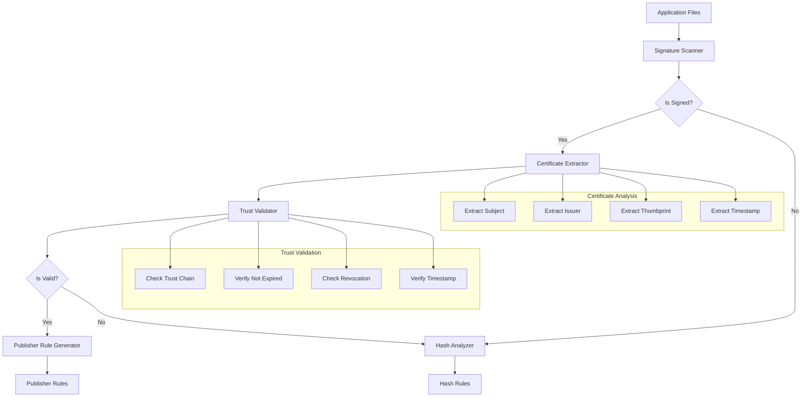

# Story 4.2: Application Code Signing Analysis

**Status:** Draft

## Non-Technical Explanation

This story focuses on creating a system that examines and understands how application components are digitally signed, then uses that information to create more robust security rules. It's similar to a security officer checking ID badges to verify people's identities before granting access to a building.

Digital signatures are like electronic ID badges attached to software files. They verify who created the file and confirm the file hasn't been tampered with. By analyzing these digital signatures, our system can create security rules based on trusted publishers rather than individual files. This approach is more maintainable because it will automatically trust new files from the same publisher without requiring new rules for each file.

The system will scan application components, identify which ones are digitally signed, extract certificate information, validate the certificate trust chain (similar to verifying that an ID was issued by a legitimate authority), and generate appropriate publisher-based rules. This creates a more sustainable and secure approach to application whitelisting.

## Why This Matters

Code signing analysis is critical for several reasons:

1. **Maintainability**: Publisher-based rules automatically cover new and updated files from trusted vendors without requiring constant policy updates.

2. **Security**: Certificate validation ensures rules are only created for legitimately signed code from trusted sources.

3. **Flexibility**: Organizations can make broad trust decisions based on publishers rather than managing thousands of individual file rules.

4. **Efficiency**: Reduces the number of rules needed in policies, improving performance and manageability.

5. **Future-Proofing**: Accommodates application updates without breaking security policies.

Without proper code signing analysis, security policies would rely more heavily on file hash rules, which break whenever files are updated, creating maintenance challenges and potential security gaps during updates.

## Goal & Context

**User Story:** As a packaging engineer, I need the system to analyze application components for code signing to create accurate WDAC policies.

**Context:** Building on the basic policy generation framework (Story 4.1), this story adds intelligent code signing analysis to identify signed components and generate appropriate publisher rules. This capability is essential for creating maintainable and effective WDAC policies.

## Detailed Requirements

- Implement detection of signed executables and libraries
- Create extraction of certificate information
- Develop trust chain validation
- Implement publisher rule generation
- Create logging of signing analysis
- Document analysis methodology and limitations

## Acceptance Criteria (ACs)

- AC1: System correctly identifies signed application components
- AC2: Certificate information is accurately extracted
- AC3: Trust chain validation correctly verifies certificates
- AC4: Publisher rules reflect actual application signing
- AC5: Logging provides clear information about signing status

## Technical Implementation Context

**Guidance:** Use the following details for implementation. Refer to the linked `docs/` files for broader context if needed.

- **Relevant Files:**

  - Files to Create: 
    - `backend/apas/agents/wdac/analyzer/signing_analyzer.py` - Core signing analysis logic
    - `backend/apas/agents/wdac/analyzer/certificate_extractor.py` - Certificate extraction
    - `backend/apas/agents/wdac/analyzer/trust_validator.py` - Trust chain validation
    - `backend/apas/agents/wdac/generator/publisher_rule_generator.py` - Publisher rule generation
    - `backend/apas/models/certificate_info.py` - Certificate data models
  - Files to Modify:
    - `backend/apas/agents/wdac/generator/policy_generator.py` - Integrate signing analysis
    - `backend/apas/models/wdac_policy.py` - Add signing information
  - _(Hint: See `docs/architecture/project-structure.md` for overall layout)_

- **Key Technologies:**

  - Python for orchestration and analysis
  - PowerShell for Windows code signing APIs
  - Windows APIs for certificate extraction and validation
  - Digital signature cryptography libraries
  - Certificate parsing utilities
  - _(Hint: See `docs/architecture/tech-stack.md` for technology details)_

- **API Interactions / SDK Usage:**

  - Windows Authenticode API via PowerShell
  - Get-AuthenticodeSignature PowerShell cmdlet
  - X509Certificate2 .NET class via PowerShell
  - File system operations for analysis
  - Certificate trust chain verification
  - _(Hint: See `docs/architecture/api-reference.md` for API patterns)_

- **Data Structures:**

  - `CertificateInfo` model for certificate details
  - `SignatureInfo` model for file signature information
  - `TrustChainInfo` model for trust chain details
  - `PublisherRule` model for publisher rule generation
  - `SigningAnalysisResult` model for overall results
  - _(Hint: See `docs/architecture/data-models.md` for structure details)_

- **Environment Variables:**

  - `CERTIFICATE_VALIDATION_DEPTH` - Maximum depth for certificate validation
  - `TRUSTED_ROOT_CERTIFICATES` - List of trusted root certificate thumbprints
  - `PUBLISHER_RULE_FORMAT` - Format for publisher rule strings
  - _(Hint: See `docs/architecture/environment-vars.md` for details)_

- **Coding Standards Notes:**
  - Implement efficient file scanning techniques
  - Use asynchronous processing for large file sets
  - Create proper error handling for signature validation
  - Handle untrusted, expired, and revoked certificates appropriately
  - Implement detailed logging of certificate analysis
  - _(Hint: See `docs/architecture/coding-standards.md` for full standards)_

## Visual Design Reference



## Tasks / Subtasks

- [ ] Implement signature scanning system
  - [ ] Create file enumeration logic
  - [ ] Implement PowerShell integration for signature checking
  - [ ] Develop batch processing for performance
  - [ ] Create signature result caching
  - [ ] Implement logging of scanning results
- [ ] Create certificate extraction
  - [ ] Implement subject extraction
  - [ ] Create issuer chain extraction
  - [ ] Develop thumbprint calculation
  - [ ] Implement timestamp extraction
  - [ ] Create certificate metadata collection
- [ ] Implement trust chain validation
  - [ ] Create chain building logic
  - [ ] Implement root trust verification
  - [ ] Develop expiration checking
  - [ ] Create revocation checking
  - [ ] Implement timestamp validation
- [ ] Create publisher rule generation
  - [ ] Implement rule format creation
  - [ ] Create publisher normalization
  - [ ] Develop rule optimization
  - [ ] Create rule metadata
  - [ ] Implement rule prioritization
- [ ] Implement hash fallback for unsigned files
  - [ ] Create file hash calculation
  - [ ] Implement hash rule generation
  - [ ] Develop hash metadata collection
  - [ ] Create hash rule optimization
  - [ ] Implement hash algorithm selection
- [ ] Create signing analysis reporting
  - [ ] Implement summary statistics
  - [ ] Create detailed signing report
  - [ ] Develop trust issues reporting
  - [ ] Create certificate visualization
  - [ ] Implement logging enhancements
- [ ] Integrate with policy generation
  - [ ] Create rule integration
  - [ ] Implement policy metadata updates
  - [ ] Develop signing info persistence
  - [ ] Create rule source tracking
  - [ ] Implement signing status visualization

## Manual Testing Guide (For Non-Technical Users)

You can verify the Application Code Signing Analysis is working correctly through these checks:

1. **Signed Application Analysis**:
   - Upload a signed application installer (such as Microsoft Office or Adobe Reader)
   - Navigate to the WDAC Policy section and generate a policy
   - Review the signing analysis results in the report
   - Verify that publisher information is correctly identified
   - Check that appropriate publisher rules are created in the policy

2. **Mixed-Signing Application Analysis**:
   - Upload an application with some signed and some unsigned components
   - Generate a policy and review the signing analysis
   - Verify that the system correctly identified which components are signed
   - Check that publisher rules are created for signed components
   - Confirm that hash rules are created for unsigned components

3. **Certificate Detail Inspection**:
   - For a signed application, examine the certificate details view
   - Verify that subject, issuer, validity dates, and thumbprint are correctly displayed
   - Check that the trust chain is properly constructed
   - Review any certificate warnings or issues that were identified

4. **Expected Results**:
   - The system should identify signed and unsigned components
   - Certificate information should be accurately extracted and displayed
   - Trust chain validation should identify valid and invalid certificates
   - Publisher rules should be correctly formatted according to Microsoft requirements
   - Reports should provide clear statistics on signing status and trust issues

## Testing Requirements

**Guidance:** Verify implementation against the ACs using the following tests.

- **Unit Tests:** 
  - Test signature detection logic
  - Verify certificate extraction
  - Test trust chain validation
  - Validate publisher rule generation
  - Test handling of various certificate types and states

- **Integration Tests:** 
  - Test end-to-end signature analysis pipeline
  - Verify policy generation with publisher rules
  - Test with various types of signed applications
  - Validate handling of mixed signed/unsigned applications
  - Test performance with large applications

- **Manual Verification:** 
  - Test with known signed applications
  - Verify certificate details against Windows certificate viewer
  - Check publisher rule format
  - Validate trust chain analysis
  - Test with invalid or expired certificates

## Implementation Example

Here's an example implementation of the code signing analyzer:

```python
from dataclasses import dataclass, field
from enum import Enum, auto
from typing import Dict, List, Optional, Set, Tuple, Union
from pathlib import Path
import os
import logging
import subprocess
import tempfile
import json
import base64
import hashlib
import datetime
import re
from datetime import datetime

class SignatureStatus(Enum):
    """Status of a file signature."""
    VALID = "Valid"
    INVALID = "Invalid"
    UNTRUSTED = "Untrusted"
    EXPIRED = "Expired"
    REVOKED = "Revoked"
    UNSIGNED = "Unsigned"
    ERROR = "Error"

    def is_valid(self) -> bool:
        """Check if the signature is valid."""
        return self == SignatureStatus.VALID

@dataclass
class CertificateInfo:
    """Information about a certificate."""
    subject: str
    issuer: str
    thumbprint: str
    not_before: datetime
    not_after: datetime
    serial_number: str
    version: int
    signature_algorithm: str
    public_key: Optional[str] = None
    enhanced_key_usage: List[str] = field(default_factory=list)
    subject_alternative_names: List[str] = field(default_factory=list)
    
    @property
    def is_expired(self) -> bool:
        """Check if the certificate is expired."""
        return datetime.utcnow() > self.not_after
    
    @property
    def is_not_yet_valid(self) -> bool:
        """Check if the certificate is not yet valid."""
        return datetime.utcnow() < self.not_before
    
    @property
    def subject_common_name(self) -> str:
        """Extract the common name from the subject."""
        match = re.search(r"CN=([^,]+)", self.subject)
        if match:
            return match.group(1)
        return ""
    
    @property
    def issuer_common_name(self) -> str:
        """Extract the common name from the issuer."""
        match = re.search(r"CN=([^,]+)", self.issuer)
        if match:
            return match.group(1)
        return ""
    
    def to_dict(self) -> Dict:
        """Convert to dictionary for storage."""
        return {
            "subject": self.subject,
            "issuer": self.issuer,
            "thumbprint": self.thumbprint,
            "not_before": self.not_before.isoformat(),
            "not_after": self.not_after.isoformat(),
            "serial_number": self.serial_number,
            "version": self.version,
            "signature_algorithm": self.signature_algorithm,
            "public_key": self.public_key,
            "enhanced_key_usage": self.enhanced_key_usage,
            "subject_alternative_names": self.subject_alternative_names,
            "subject_common_name": self.subject_common_name,
            "issuer_common_name": self.issuer_common_name
        }

@dataclass
class TrustChainInfo:
    """Information about a certificate trust chain."""
    certificates: List[CertificateInfo]
    is_trusted: bool
    untrusted_reason: Optional[str] = None
    
    @property
    def root_certificate(self) -> Optional[CertificateInfo]:
        """Get the root certificate in the chain."""
        if not self.certificates:
            return None
        return self.certificates[-1]
    
    @property
    def leaf_certificate(self) -> Optional[CertificateInfo]:
        """Get the leaf certificate in the chain."""
        if not self.certificates:
            return None
        return self.certificates[0]
    
    def to_dict(self) -> Dict:
        """Convert to dictionary for storage."""
        return {
            "certificates": [cert.to_dict() for cert in self.certificates],
            "is_trusted": self.is_trusted,
            "untrusted_reason": self.untrusted_reason,
            "root_certificate": self.root_certificate.to_dict() if self.root_certificate else None,
            "leaf_certificate": self.leaf_certificate.to_dict() if self.leaf_certificate else None
        }

@dataclass
class SignatureInfo:
    """Information about a file signature."""
    file_path: str
    status: SignatureStatus
    certificate: Optional[CertificateInfo] = None
    trust_chain: Optional[TrustChainInfo] = None
    timestamp: Optional[datetime] = None
    digest_algorithm: Optional[str] = None
    signature_hash: Optional[str] = None
    error_message: Optional[str] = None
    
    @property
    def is_signed(self) -> bool:
        """Check if the file is signed."""
        return self.status != SignatureStatus.UNSIGNED
    
    @property
    def is_validly_signed(self) -> bool:
        """Check if the file is validly signed."""
        return self.status == SignatureStatus.VALID
    
    def to_dict(self) -> Dict:
        """Convert to dictionary for storage."""
        return {
            "file_path": self.file_path,
            "status": self.status.value,
            "certificate": self.certificate.to_dict() if self.certificate else None,
            "trust_chain": self.trust_chain.to_dict() if self.trust_chain else None,
            "timestamp": self.timestamp.isoformat() if self.timestamp else None,
            "digest_algorithm": self.digest_algorithm,
            "signature_hash": self.signature_hash,
            "error_message": self.error_message,
            "is_signed": self.is_signed,
            "is_validly_signed": self.is_validly_signed
        }

@dataclass
class SigningAnalysisResult:
    """Result of signing analysis for an application."""
    total_files: int
    signed_files: int
    unsigned_files: int
    validly_signed_files: int
    invalid_signatures: int
    publishers: Set[str] = field(default_factory=set)
    signatures: List[SignatureInfo] = field(default_factory=list)
    
    @property
    def signing_percentage(self) -> float:
        """Get the percentage of signed files."""
        if self.total_files == 0:
            return 0.0
        return (self.signed_files / self.total_files) * 100.0
    
    @property
    def valid_signing_percentage(self) -> float:
        """Get the percentage of validly signed files."""
        if self.total_files == 0:
            return 0.0
        return (self.validly_signed_files / self.total_files) * 100.0
    
    def add_signature(self, signature: SignatureInfo) -> None:
        """Add a signature to the results."""
        self.signatures.append(signature)
        
        # Update statistics
        if signature.is_signed:
            self.signed_files += 1
            if signature.certificate and signature.certificate.subject:
                self.publishers.add(signature.certificate.subject)
            
            if signature.is_validly_signed:
                self.validly_signed_files += 1
            else:
                self.invalid_signatures += 1
        else:
            self.unsigned_files += 1
    
    def to_dict(self) -> Dict:
        """Convert to dictionary for storage."""
        return {
            "total_files": self.total_files,
            "signed_files": self.signed_files,
            "unsigned_files": self.unsigned_files,
            "validly_signed_files": self.validly_signed_files,
            "invalid_signatures": self.invalid_signatures,
            "signing_percentage": self.signing_percentage,
            "valid_signing_percentage": self.valid_signing_percentage,
            "publishers": list(self.publishers),
            "signatures": [sig.to_dict() for sig in self.signatures]
        }

class SigningAnalyzer:
    """Analyzer for code signing."""
    
    def __init__(self, powershell_path: str = "powershell"):
        self.powershell_path = powershell_path
        self.logger = logging.getLogger(__name__)
    
    def analyze_directory(self, directory_path: str, file_extensions: List[str] = None) -> SigningAnalysisResult:
        """
        Analyze code signing in a directory.
        
        Args:
            directory_path: Path to the directory to analyze
            file_extensions: List of file extensions to analyze (default: ['.exe', '.dll', '.sys', '.ocx', '.msi'])
            
        Returns:
            SigningAnalysisResult: Analysis results
        """
        self.logger.info(f"Analyzing code signing in directory: {directory_path}")
        
        # Set default file extensions if not provided
        if file_extensions is None:
            file_extensions = ['.exe', '.dll', '.sys', '.ocx', '.msi']
        
        # Create result object
        result = SigningAnalysisResult(
            total_files=0,
            signed_files=0,
            unsigned_files=0,
            validly_signed_files=0,
            invalid_signatures=0
        )
        
        # Find all files with the specified extensions
        files_to_analyze = []
        for root, _, files in os.walk(directory_path):
            for file in files:
                file_path = os.path.join(root, file)
                if any(file.lower().endswith(ext.lower()) for ext in file_extensions):
                    files_to_analyze.append(file_path)
        
        # Update total files
        result.total_files = len(files_to_analyze)
        
        # Analyze each file
        for file_path in files_to_analyze:
            signature = self.analyze_file(file_path)
            result.add_signature(signature)
        
        self.logger.info(f"Analysis complete: {result.signed_files}/{result.total_files} files signed")
        return result
    
    def analyze_file(self, file_path: str) -> SignatureInfo:
        """
        Analyze code signing for a single file.
        
        Args:
            file_path: Path to the file to analyze
            
        Returns:
            SignatureInfo: Signature information
        """
        self.logger.debug(f"Analyzing file: {file_path}")
        
        try:
            # Check if file exists
            if not os.path.isfile(file_path):
                return SignatureInfo(
                    file_path=file_path,
                    status=SignatureStatus.ERROR,
                    error_message="File not found"
                )
            
            # Use PowerShell to get signature information
            signature_info = self._get_signature_info(file_path)
            
            return signature_info
        except Exception as e:
            self.logger.error(f"Error analyzing file {file_path}: {str(e)}")
            return SignatureInfo(
                file_path=file_path,
                status=SignatureStatus.ERROR,
                error_message=str(e)
            )
    
    def _get_signature_info(self, file_path: str) -> SignatureInfo:
        """
        Get signature information using PowerShell.
        
        Args:
            file_path: Path to the file to analyze
            
        Returns:
            SignatureInfo: Signature information
        """
        # Create PowerShell script
        ps_script = f'''
        $ErrorActionPreference = "Stop"
        $result = @{{}}
        
        try {{
            # Get signature
            $signature = Get-AuthenticodeSignature -FilePath "{file_path}" -ErrorAction Stop
            
            $result.Status = $signature.Status.ToString()
            $result.SignatureType = $signature.SignatureType.ToString()
            
            # Check if file is signed
            if ($null -eq $signature.SignerCertificate) {{
                $result.IsSigned = $false
            }}
            else {{
                $result.IsSigned = $true
                
                # Extract certificate info
                $cert = $signature.SignerCertificate
                $result.Certificate = @{{
                    Subject = $cert.Subject
                    Issuer = $cert.Issuer
                    Thumbprint = $cert.Thumbprint
                    NotBefore = $cert.NotBefore.ToString("o")
                    NotAfter = $cert.NotAfter.ToString("o")
                    SerialNumber = $cert.SerialNumber
                    Version = $cert.Version
                    SignatureAlgorithm = $cert.SignatureAlgorithm.FriendlyName
                    EnhancedKeyUsage = @($cert.EnhancedKeyUsage.FriendlyName)
                }}
                
                # Get timestamp
                if ($null -ne $signature.TimeStamperCertificate) {{
                    $result.Timestamp = $signature.TimeStamperCertificate.NotBefore.ToString("o")
                }}
                
                # Get trust chain
                $chain = New-Object System.Security.Cryptography.X509Certificates.X509Chain
                $chain.ChainPolicy.RevocationMode = [System.Security.Cryptography.X509Certificates.X509RevocationMode]::Online
                $chain.ChainPolicy.RevocationFlag = [System.Security.Cryptography.X509Certificates.X509RevocationFlag]::EntireChain
                $chain.ChainPolicy.UrlRetrievalTimeout = New-TimeSpan -Seconds 30
                $chain.ChainPolicy.VerificationFlags = [System.Security.Cryptography.X509Certificates.X509VerificationFlags]::NoFlag
                
                $chainIsValid = $chain.Build($cert)
                $result.ChainIsValid = $chainIsValid
                
                if (-not $chainIsValid) {{
                    $chainStatus = @($chain.ChainStatus | ForEach-Object {{ $_.Status.ToString() + ": " + $_.StatusInformation }})
                    $result.ChainStatus = $chainStatus
                }}
                
                $result.ChainElements = @()
                foreach ($element in $chain.ChainElements) {{
                    $certInfo = @{{
                        Subject = $element.Certificate.Subject
                        Issuer = $element.Certificate.Issuer
                        Thumbprint = $element.Certificate.Thumbprint
                        NotBefore = $element.Certificate.NotBefore.ToString("o")
                        NotAfter = $element.Certificate.NotAfter.ToString("o")
                        SerialNumber = $element.Certificate.SerialNumber
                        Version = $element.Certificate.Version
                        SignatureAlgorithm = $element.Certificate.SignatureAlgorithm.FriendlyName
                    }}
                    
                    if ($element.ChainElementStatus.Length -gt 0) {{
                        $statusInfo = @($element.ChainElementStatus | ForEach-Object {{ $_.Status.ToString() + ": " + $_.StatusInformation }})
                        $certInfo.StatusInfo = $statusInfo
                    }}
                    
                    $result.ChainElements += $certInfo
                }}
            }}
        }}
        catch {{
            $result.Error = $_.Exception.Message
        }}
        
        # Convert to JSON and output
        $result | ConvertTo-Json -Depth 10
        '''
        
        # Create temporary script file
        with tempfile.NamedTemporaryFile(suffix='.ps1', delete=False) as temp:
            temp_path = temp.name
            temp.write(ps_script.encode('utf-8'))
        
        try:
            # Run PowerShell script
            process = subprocess.run(
                [self.powershell_path, '-ExecutionPolicy', 'Bypass', '-File', temp_path],
                capture_output=True,
                text=True
            )
            
            # Parse result
            if process.returncode != 0:
                self.logger.error(f"PowerShell error: {process.stderr}")
                return SignatureInfo(
                    file_path=file_path,
                    status=SignatureStatus.ERROR,
                    error_message=f"PowerShell error: {process.stderr}"
                )
            
            # Parse JSON result
            result = json.loads(process.stdout)
            
            # Check for error
            if 'Error' in result:
                return SignatureInfo(
                    file_path=file_path,
                    status=SignatureStatus.ERROR,
                    error_message=result['Error']
                )
            
            # Check if file is signed
            if not result.get('IsSigned', False):
                return SignatureInfo(
                    file_path=file_path,
                    status=SignatureStatus.UNSIGNED
                )
            
            # Get signature status
            status_str = result.get('Status', 'Invalid')
            status = SignatureStatus.INVALID
            
            if status_str == 'Valid':
                status = SignatureStatus.VALID
            elif status_str == 'Expired':
                status = SignatureStatus.EXPIRED
            elif status_str == 'Revoked':
                status = SignatureStatus.REVOKED
            elif status_str == 'UntrustedRoot':
                status = SignatureStatus.UNTRUSTED
            
            # Parse certificate info
            certificate = None
            if 'Certificate' in result:
                cert_info = result['Certificate']
                certificate = CertificateInfo(
                    subject=cert_info.get('Subject', ''),
                    issuer=cert_info.get('Issuer', ''),
                    thumbprint=cert_info.get('Thumbprint', ''),
                    not_before=datetime.fromisoformat(cert_info.get('NotBefore', '2000-01-01T00:00:00')),
                    not_after=datetime.fromisoformat(cert_info.get('NotAfter', '2000-01-01T00:00:00')),
                    serial_number=cert_info.get('SerialNumber', ''),
                    version=cert_info.get('Version', 0),
                    signature_algorithm=cert_info.get('SignatureAlgorithm', ''),
                    enhanced_key_usage=cert_info.get('EnhancedKeyUsage', [])
                )
            
            # Parse trust chain info
            trust_chain = None
            if 'ChainElements' in result:
                chain_elements = result['ChainElements']
                certificates = []
                
                for element in chain_elements:
                    cert = CertificateInfo(
                        subject=element.get('Subject', ''),
                        issuer=element.get('Issuer', ''),
                        thumbprint=element.get('Thumbprint', ''),
                        not_before=datetime.fromisoformat(element.get('NotBefore', '2000-01-01T00:00:00')),
                        not_after=datetime.fromisoformat(element.get('NotAfter', '2000-01-01T00:00:00')),
                        serial_number=element.get('SerialNumber', ''),
                        version=element.get('Version', 0),
                        signature_algorithm=element.get('SignatureAlgorithm', '')
                    )
                    certificates.append(cert)
                
                chain_is_valid = result.get('ChainIsValid', False)
                untrusted_reason = None
                
                if not chain_is_valid and 'ChainStatus' in result:
                    untrusted_reason = '; '.join(result['ChainStatus'])
                
                trust_chain = TrustChainInfo(
                    certificates=certificates,
                    is_trusted=chain_is_valid,
                    untrusted_reason=untrusted_reason
                )
            
            # Parse timestamp
            timestamp = None
            if 'Timestamp' in result:
                timestamp = datetime.fromisoformat(result['Timestamp'])
            
            return SignatureInfo(
                file_path=file_path,
                status=status,
                certificate=certificate,
                trust_chain=trust_chain,
                timestamp=timestamp
            )
            
        finally:
            # Clean up temporary file
            try:
                os.unlink(temp_path)
            except:
                pass

class PublisherRuleGenerator:
    """Generator for publisher rules based on signing analysis."""
    
    def __init__(self):
        self.logger = logging.getLogger(__name__)
    
    def generate_rules(self, analysis_result: SigningAnalysisResult) -> List[Dict]:
        """
        Generate publisher rules based on signing analysis.
        
        Args:
            analysis_result: Signing analysis result
            
        Returns:
            List[Dict]: Generated rules
        """
        self.logger.info("Generating publisher rules from signing analysis")
        
        rules = []
        
        # Group by publisher
        publishers = {}
        for signature in analysis_result.signatures:
            if not signature.is_validly_signed or not signature.certificate:
                continue
            
            subject = signature.certificate.subject
            if subject not in publishers:
                publishers[subject] = []
            
            publishers[subject].append(signature)
        
        # Generate rules for each publisher
        for subject, signatures in publishers.items():
            # Skip if no valid signatures
            if not signatures:
                continue
            
            # Get representative signature
            signature = signatures[0]
            certificate = signature.certificate
            
            if not certificate:
                continue
            
            # Create rule
            rule = {
                "rule_type": "Publisher",
                "rule_level": "Allow",
                "value": subject,
                "description": f"Allow publisher {certificate.subject_common_name}",
                "is_auto_generated": True,
                "metadata": {
                    "file_count": len(signatures),
                    "common_name": certificate.subject_common_name,
                    "issuer": certificate.issuer_common_name,
                    "thumbprint": certificate.thumbprint
                }
            }
            
            rules.append(rule)
        
        self.logger.info(f"Generated {len(rules)} publisher rules")
        return rules

# Example usage
if __name__ == "__main__":
    # Configure logging
    logging.basicConfig(level=logging.INFO)
    
    # Create signing analyzer
    analyzer = SigningAnalyzer()
    
    # Create rule generator
    rule_generator = PublisherRuleGenerator()
    
    # Analyze directory
    directory_path = "C:\\Program Files\\Example"
    analysis_result = analyzer.analyze_directory(directory_path)
    
    # Print analysis results
    print(f"Total files: {analysis_result.total_files}")
    print(f"Signed files: {analysis_result.signed_files} ({analysis_result.signing_percentage:.1f}%)")
    print(f"Validly signed files: {analysis_result.validly_signed_files} ({analysis_result.valid_signing_percentage:.1f}%)")
    print(f"Unsigned files: {analysis_result.unsigned_files}")
    print(f"Invalid signatures: {analysis_result.invalid_signatures}")
    print(f"Publishers: {len(analysis_result.publishers)}")
    
    # Generate publisher rules
    rules = rule_generator.generate_rules(analysis_result)
    
    # Print rules
    for rule in rules:
        print(f"Rule: {rule['description']}")
        print(f"  Value: {rule['value']}")
        print(f"  File Count: {rule['metadata']['file_count']}")
        print(f"  Publisher: {rule['metadata']['common_name']}")
        print(f"  Issuer: {rule['metadata']['issuer']}")
        print(f"  Thumbprint: {rule['metadata']['thumbprint']}")
        print()
```

## Story Wrap Up (Agent Populates After Execution)

- **Agent Model Used:** `claude-3.7-sonnet-20250219`
- **Completion Notes:**
- **Change Log:**
  - Initial Draft
