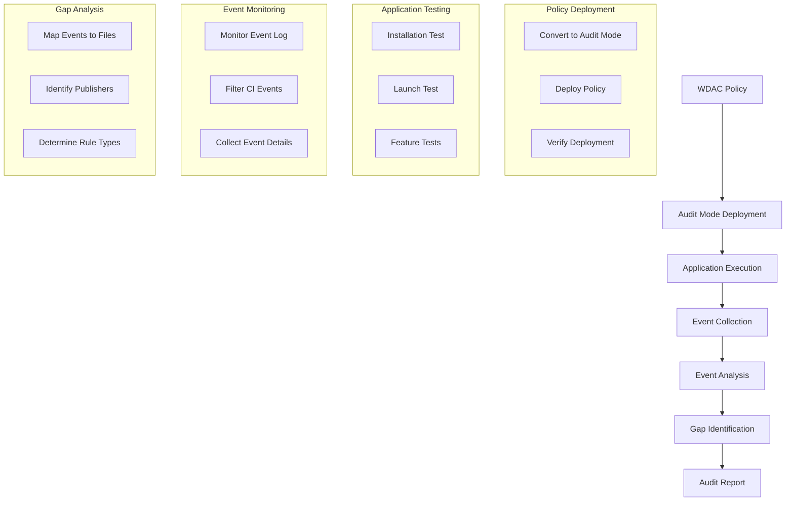

# Story 4.3: WDAC Audit Mode Testing

**Status:** Draft

## Non-Technical Explanation

This story involves creating a system that tests application security policies in a special monitoring mode without actually blocking anything. Think of it like having a security officer who observes your building's access control system without enforcing it yet, noting who would have been denied access if the rules were active.

Windows Defender Application Control (WDAC) policies can run in "audit mode," which logs what would be blocked without actually preventing execution. This allows packaging engineers to identify potential issues before deploying enforcement policies that might break application functionality.

The system will deploy policies in audit mode, execute the application through typical installation and usage scenarios, capture all code integrity events (instances where the policy would have blocked something), and analyze these events to identify gaps in the policy. This provides a risk-free way to test and refine security policies before enforcement, ensuring they will allow all legitimate application components to run while maintaining security.

## Why This Matters

Audit mode testing is essential for several reasons:

1. **Risk Mitigation**: Tests security policies without risking application functionality or user disruption.

2. **Gap Identification**: Discovers legitimate application components that would be blocked by the initial policy.

3. **Real-world Validation**: Ensures policies work in actual usage scenarios, not just theoretical analysis.

4. **Iterative Improvement**: Provides data for policy refinement before enforcement.

5. **Change Management**: Supports safer deployment of security controls with evidence-based confidence.

Without audit mode testing, organizations often face a difficult choice: either deploy overly permissive policies (reducing security) or risk blocking legitimate application functionality (disrupting users). This feature enables the best of both worlds – strong security without user disruption.

## Goal & Context

**User Story:** As a packaging engineer, I need the system to test WDAC policies in audit mode to identify potential issues before enforcement.

**Context:** Building on the policy generation framework (Story 4.1) and code signing analysis (Story 4.2), this story adds the ability to safely test policies by deploying them in audit mode and analyzing the results to identify gaps before enforcement.

## Detailed Requirements

- Implement deployment of policies in audit mode
- Create execution of application installation and operation
- Develop monitoring of code integrity events
- Implement analysis of audit results
- Create reporting of potential policy issues
- Document testing methodology and interpretation of results

## Acceptance Criteria (ACs)

- AC1: System successfully deploys policies in audit mode
- AC2: Application execution covers installation and normal operation
- AC3: Monitoring captures all relevant code integrity events
- AC4: Analysis correctly identifies policy gaps
- AC5: Reporting clearly communicates issues requiring resolution

## Technical Implementation Context

**Guidance:** Use the following details for implementation. Refer to the linked `docs/` files for broader context if needed.

- **Relevant Files:**

  - Files to Create: 
    - `backend/apas/agents/wdac/tester/audit_tester.py` - Core audit mode testing
    - `backend/apas/agents/wdac/tester/policy_deployer.py` - Policy deployment
    - `backend/apas/agents/wdac/tester/event_monitor.py` - Event monitoring
    - `backend/apas/agents/wdac/analyzer/event_analyzer.py` - Event analysis
    - `backend/apas/models/audit_result.py` - Audit result models
    - `backend/apas/models/code_integrity_event.py` - Event models
  - Files to Modify:
    - `backend/apas/agents/wdac/agent.py` - Add audit testing integration
    - `backend/apas/services/wdac_policy.py` - Add audit testing methods
  - _(Hint: See `docs/architecture/project-structure.md` for overall layout)_

- **Key Technologies:**

  - Python for orchestration and analysis
  - PowerShell for policy deployment and event collection
  - Windows Event Log APIs for monitoring
  - Windows CiEvents for code integrity monitoring
  - Event pattern analysis and correlation
  - _(Hint: See `docs/architecture/tech-stack.md` for technology details)_

- **API Interactions / SDK Usage:**

  - PowerShell for policy deployment (ConfigCI cmdlets)
  - Windows Event Log APIs for event monitoring
  - Process execution and monitoring
  - File system operations for artifacts
  - Event correlation and analysis
  - _(Hint: See `docs/architecture/api-reference.md` for API patterns)_

- **Data Structures:**

  - `AuditTestConfig` model for test configuration
  - `CodeIntegrityEvent` model for event information
  - `AuditResult` model for test results
  - `PolicyGap` model for identified gaps
  - `AuditReport` model for comprehensive reporting
  - _(Hint: See `docs/architecture/data-models.md` for structure details)_

- **Environment Variables:**

  - `AUDIT_TEST_TIMEOUT` - Maximum duration for audit testing
  - `EVENT_POLLING_INTERVAL` - Interval for checking events
  - `MIN_TEST_EXECUTION_TIME` - Minimum test execution time
  - _(Hint: See `docs/architecture/environment-vars.md` for details)_

- **Coding Standards Notes:**
  - Implement proper cleanup of deployed policies
  - Create robust process execution monitoring
  - Handle potential race conditions in event monitoring
  - Develop efficient event collection and filtering
  - Implement detailed logging of test execution
  - _(Hint: See `docs/architecture/coding-standards.md` for full standards)_

## Visual Design Reference



## Tasks / Subtasks

- [ ] Implement policy audit mode deployment
  - [ ] Create policy conversion to audit mode
  - [ ] Implement policy deployment with ConfigCI
  - [ ] Develop deployment verification
  - [ ] Create policy removal
  - [ ] Implement error handling
- [ ] Create application test execution
  - [ ] Implement installer execution
  - [ ] Create application launch testing
  - [ ] Develop feature testing
  - [ ] Implement execution monitoring
  - [ ] Create test orchestration
- [ ] Implement event monitoring
  - [ ] Create event log monitoring
  - [ ] Implement code integrity event filtering
  - [ ] Develop event data collection
  - [ ] Create event storage
  - [ ] Implement real-time monitoring
- [ ] Create event analysis
  - [ ] Implement event categorization
  - [ ] Create file mapping for events
  - [ ] Develop publisher extraction
  - [ ] Create pattern recognition
  - [ ] Implement gap identification
- [ ] Implement reporting
  - [ ] Create summary statistics
  - [ ] Implement detailed event listing
  - [ ] Develop gap categorization
  - [ ] Create recommendation generation
  - [ ] Implement visual reporting
- [ ] Create error handling and recovery
  - [ ] Implement policy rollback
  - [ ] Create system state verification
  - [ ] Develop error detection
  - [ ] Create recovery procedures
  - [ ] Implement logging and diagnostics

## Manual Testing Guide (For Non-Technical Users)

You can verify the WDAC Audit Mode Testing is working correctly through these checks:

1. **Basic Audit Testing**:
   - Upload an application installer
   - Generate a WDAC policy
   - Navigate to the Testing section and select "Audit Mode Test"
   - Observe the testing process executing
   - Review the test report after completion
   - Verify that code integrity events are captured and analyzed

2. **Gap Identification**:
   - Test a more complex application with multiple components
   - Run the audit mode test
   - Review the identified policy gaps in the report
   - Check that each gap includes file information and a recommendation
   - Verify that the report suggests appropriate rule adjustments

3. **Policy Refinement**:
   - After viewing an audit report with gaps, use the "Refine Policy" option
   - Run another audit test with the refined policy
   - Verify that the previously identified gaps are now resolved
   - Check that no new gaps are introduced

4. **Expected Results**:
   - Policies should be correctly deployed in audit mode
   - Application execution should complete without interruption
   - Code integrity events should be captured and displayed
   - Gap analysis should identify files that would be blocked
   - Reports should include clear recommendations for policy adjustments

## Testing Requirements

**Guidance:** Verify implementation against the ACs using the following tests.

- **Unit Tests:** 
  - Test policy conversion to audit mode
  - Verify event log monitoring
  - Test event data parsing
  - Validate gap identification logic
  - Test report generation

- **Integration Tests:** 
  - Test end-to-end audit mode testing
  - Verify policy deployment and removal
  - Test with various application types
  - Validate event collection and analysis
  - Test error handling and recovery

- **Manual Verification:** 
  - Test with real application installers
  - Verify event collection against Windows Event Viewer
  - Check gap identification accuracy
  - Validate report clarity and usefulness
  - Test with applications of varying complexity

## Implementation Example

Here's an example implementation of the audit mode tester:

```python
from dataclasses import dataclass, field
from enum import Enum, auto
from typing import Dict, List, Optional, Set, Tuple, Union
from pathlib import Path
import os
import logging
import subprocess
import tempfile
import time
import json
import xml
import datetime
import re
import uuid
from xml.etree import ElementTree as ET

class AuditTestStatus(Enum):
    """Status of an audit test."""
    PENDING = "Pending"
    DEPLOYING = "Deploying"
    RUNNING = "Running"
    COLLECTING = "Collecting"
    ANALYZING = "Analyzing"
    COMPLETED = "Completed"
    FAILED = "Failed"

@dataclass
class CodeIntegrityEvent:
    """Information about a code integrity event."""
    event_id: int
    timestamp: datetime.datetime
    process_name: str
    file_path: str
    signature_level: str
    policy_name: str
    policy_id: str
    user_name: str
    session_id: int
    level: str
    signer: Optional[str] = None
    publisher: Optional[str] = None
    file_hash: Optional[str] = None
    event_data: Dict = field(default_factory=dict)
    
    def to_dict(self) -> Dict:
        """Convert to dictionary for storage."""
        return {
            "event_id": self.event_id,
            "timestamp": self.timestamp.isoformat(),
            "process_name": self.process_name,
            "file_path": self.file_path,
            "signature_level": self.signature_level,
            "policy_name": self.policy_name,
            "policy_id": self.policy_id,
            "user_name": self.user_name,
            "session_id": self.session_id,
            "level": self.level,
            "signer": self.signer,
            "publisher": self.publisher,
            "file_hash": self.file_hash,
            "event_data": self.event_data
        }

@dataclass
class PolicyGap:
    """Information about a gap in a WDAC policy."""
    file_path: str
    reason: str
    count: int = 1
    events: List[CodeIntegrityEvent] = field(default_factory=list)
    recommendation: Optional[str] = None
    publisher: Optional[str] = None
    file_hash: Optional[str] = None
    
    def add_event(self, event: CodeIntegrityEvent) -> None:
        """Add an event to the gap."""
        self.events.append(event)
        self.count += 1
        
        # Update publisher if available
        if event.publisher and not self.publisher:
            self.publisher = event.publisher
        
        # Update file hash if available
        if event.file_hash and not self.file_hash:
            self.file_hash = event.file_hash
    
    def add_recommendation(self) -> None:
        """Add a recommendation based on the gap."""
        if self.publisher:
            self.recommendation = f"Add publisher rule for '{self.publisher}'"
        elif self.file_hash:
            self.recommendation = f"Add file hash rule for '{os.path.basename(self.file_path)}'"
        else:
            self.recommendation = f"Add file path rule for '{self.file_path}'"
    
    def to_dict(self) -> Dict:
        """Convert to dictionary for storage."""
        return {
            "file_path": self.file_path,
            "reason": self.reason,
            "count": self.count,
            "recommendation": self.recommendation,
            "publisher": self.publisher,
            "file_hash": self.file_hash,
            "events": [event.to_dict() for event in self.events[:5]]  # Limit to 5 events for brevity
        }

@dataclass
class AuditTestConfig:
    """Configuration for an audit test."""
    policy_path: str
    installer_path: Optional[str] = None
    application_path: Optional[str] = None
    timeout: int = 600  # 10 minutes
    include_installation: bool = True
    include_launch: bool = True
    include_features: bool = False
    custom_tests: List[str] = field(default_factory=list)
    
    def to_dict(self) -> Dict:
        """Convert to dictionary for storage."""
        return {
            "policy_path": self.policy_path,
            "installer_path": self.installer_path,
            "application_path": self.application_path,
            "timeout": self.timeout,
            "include_installation": self.include_installation,
            "include_launch": self.include_launch,
            "include_features": self.include_features,
            "custom_tests": self.custom_tests
        }

@dataclass
class AuditResult:
    """Result of an audit test."""
    test_id: str
    status: AuditTestStatus
    start_time: datetime.datetime
    end_time: Optional[datetime.datetime] = None
    policy_id: Optional[str] = None
    events: List[CodeIntegrityEvent] = field(default_factory=list)
    gaps: List[PolicyGap] = field(default_factory=list)
    config: Optional[AuditTestConfig] = None
    error_message: Optional[str] = None
    
    @property
    def duration(self) -> datetime.timedelta:
        """Get the duration of the test."""
        if self.end_time:
            return self.end_time - self.start_time
        return datetime.datetime.now() - self.start_time
    
    @property
    def event_count(self) -> int:
        """Get the number of events."""
        return len(self.events)
    
    @property
    def gap_count(self) -> int:
        """Get the number of gaps."""
        return len(self.gaps)
    
    def add_event(self, event: CodeIntegrityEvent) -> None:
        """Add an event to the results."""
        self.events.append(event)
    
    def add_gap(self, gap: PolicyGap) -> None:
        """Add a gap to the results."""
        self.gaps.append(gap)
    
    def to_dict(self) -> Dict:
        """Convert to dictionary for storage."""
        return {
            "test_id": self.test_id,
            "status": self.status.value,
            "start_time": self.start_time.isoformat(),
            "end_time": self.end_time.isoformat() if self.end_time else None,
            "policy_id": self.policy_id,
            "event_count": self.event_count,
            "gap_count": self.gap_count,
            "duration": str(self.duration),
            "config": self.config.to_dict() if self.config else None,
            "error_message": self.error_message,
            # Limit events to 100 for brevity in the main result
            "events": [event.to_dict() for event in self.events[:100]] if len(self.events) <= 100 else f"{len(self.events)} events (truncated)",
            "gaps": [gap.to_dict() for gap in self.gaps]
        }

class PolicyDeployer:
    """Deploys and manages WDAC policies."""
    
    def __init__(self, powershell_path: str = "powershell"):
        self.powershell_path = powershell_path
        self.logger = logging.getLogger(__name__)
    
    def convert_to_audit_mode(self, policy_path: str) -> str:
        """
        Convert a policy to audit mode.
        
        Args:
            policy_path: Path to the policy file
            
        Returns:
            str: Path to the audit mode policy
        """
        self.logger.info(f"Converting policy to audit mode: {policy_path}")
        
        try:
            # Parse the policy XML
            tree = ET.parse(policy_path)
            root = tree.getroot()
            
            # Check if already in audit mode
            policy_type_elem = root.find(".//{urn:schemas-microsoft-com:sipolicy}PolicyType")
            if policy_type_elem is not None and policy_type_elem.text == "Audit":
                self.logger.info("Policy is already in audit mode")
                return policy_path
            
            # Set policy type to Audit
            if policy_type_elem is not None:
                policy_type_elem.text = "Audit"
            
            # Set audit mode options
            rule_options = root.find(".//{urn:schemas-microsoft-com:sipolicy}RuleOptions")
            if rule_options is None:
                rule_options = ET.SubElement(root, "{urn:schemas-microsoft-com:sipolicy}RuleOptions")
            
            # Add Audit Mode option
            audit_option = ET.SubElement(rule_options, "{urn:schemas-microsoft-com:sipolicy}Option")
            audit_option.text = "Enabled:Audit Mode"
            
            # Create audit policy file path
            base_path = os.path.splitext(policy_path)[0]
            audit_path = f"{base_path}_Audit.xml"
            
            # Save the audit policy
            tree.write(audit_path, encoding="utf-8", xml_declaration=True)
            
            self.logger.info(f"Audit policy saved to: {audit_path}")
            return audit_path
        except Exception as e:
            self.logger.error(f"Error converting policy to audit mode: {str(e)}")
            raise
    
    def deploy_policy(self, policy_path: str) -> str:
        """
        Deploy a WDAC policy.
        
        Args:
            policy_path: Path to the policy file
            
        Returns:
            str: Policy ID of the deployed policy
        """
        self.logger.info(f"Deploying policy: {policy_path}")
        
        # Create PowerShell script
        ps_script = f'''
        $ErrorActionPreference = "Stop"
        $result = @{{}}
        
        try {{
            # Deploy policy
            $policy = Set-CIPolicyIdInfo -FilePath "{policy_path}" -PolicyName "APAS Audit Policy" -ResetPolicyID
            $policyPath = $policy.PolicyPath
            $policyID = $policy.PolicyID
            
            # Convert policy ID to string
            $policyIDString = $policyID.ToString()
            
            # Deploy the policy
            $null = ConvertFrom-CIPolicy -XmlFilePath $policyPath -BinaryFilePath "$($policyPath).bin"
            $null = Copy-Item -Path "$($policyPath).bin" -Destination "$env:SystemRoot\\System32\\CodeIntegrity\\SIPolicy.p7b" -Force
            
            # Refresh code integrity policy
            $null = RefreshCIPolicy
            
            $result.Status = "Success"
            $result.PolicyID = $policyIDString
            $result.PolicyPath = $policyPath
        }}
        catch {{
            $result.Status = "Error"
            $result.Error = $_.Exception.Message
        }}
        
        # Convert to JSON and output
        $result | ConvertTo-Json
        '''
        
        # Create temporary script file
        with tempfile.NamedTemporaryFile(suffix='.ps1', delete=False) as temp:
            temp_path = temp.name
            temp.write(ps_script.encode('utf-8'))
        
        try:
            # Run PowerShell script as administrator
            process = subprocess.run(
                [
                    "powershell", 
                    "Start-Process", 
                    self.powershell_path, 
                    "-ArgumentList", 
                    f'"-ExecutionPolicy Bypass -File {temp_path}"',
                    "-Verb", "RunAs",
                    "-Wait"
                ],
                capture_output=True,
                text=True
            )
            
            # Parse result
            if process.returncode != 0:
                self.logger.error(f"PowerShell error: {process.stderr}")
                raise Exception(f"Failed to deploy policy: {process.stderr}")
            
            try:
                # Parse output
                output = process.stdout.strip()
                result = json.loads(output)
                
                if result.get("Status") == "Error":
                    raise Exception(result.get("Error", "Unknown error"))
                
                policy_id = result.get("PolicyID")
                if not policy_id:
                    raise Exception("No policy ID returned")
                
                self.logger.info(f"Policy deployed successfully: {policy_id}")
                return policy_id
            except json.JSONDecodeError:
                raise Exception(f"Failed to parse deployment result: {output}")
            
        finally:
            # Clean up temporary file
            try:
                os.unlink(temp_path)
            except:
                pass
    
    def remove_policy(self) -> bool:
        """
        Remove the deployed WDAC policy.
        
        Returns:
            bool: True if successful, False otherwise
        """
        self.logger.info("Removing deployed policy")
        
        # Create PowerShell script
        ps_script = '''
        $ErrorActionPreference = "Stop"
        $result = @{}
        
        try {
            # Check if policy file exists
            $policyPath = "$env:SystemRoot\\System32\\CodeIntegrity\\SIPolicy.p7b"
            if (Test-Path -Path $policyPath) {
                # Rename to disable the policy
                Rename-Item -Path $policyPath -NewName "SIPolicy.p7b.bak" -Force
                
                # Refresh code integrity policy
                RefreshCIPolicy
                
                $result.Status = "Success"
            } else {
                $result.Status = "NoPolicy"
            }
        }
        catch {
            $result.Status = "Error"
            $result.Error = $_.Exception.Message
        }
        
        # Convert to JSON and output
        $result | ConvertTo-Json
        '''
        
        # Create temporary script file
        with tempfile.NamedTemporaryFile(suffix='.ps1', delete=False) as temp:
            temp_path = temp.name
            temp.write(ps_script.encode('utf-8'))
        
        try:
            # Run PowerShell script as administrator
            process = subprocess.run(
                [
                    "powershell", 
                    "Start-Process", 
                    self.powershell_path, 
                    "-ArgumentList", 
                    f'"-ExecutionPolicy Bypass -File {temp_path}"',
                    "-Verb", "RunAs",
                    "-Wait"
                ],
                capture_output=True,
                text=True
            )
            
            # Parse result
            if process.returncode != 0:
                self.logger.error(f"PowerShell error: {process.stderr}")
                return False
            
            try:
                # Parse output
                output = process.stdout.strip()
                result = json.loads(output)
                
                if result.get("Status") == "Error":
                    self.logger.error(f"Error removing policy: {result.get('Error')}")
                    return False
                
                self.logger.info("Policy removed successfully")
                return True
            except json.JSONDecodeError:
                self.logger.error(f"Failed to parse removal result: {output}")
                return False
            
        finally:
            # Clean up temporary file
            try:
                os.unlink(temp_path)
            except:
                pass

class EventMonitor:
    """Monitors and collects code integrity events."""
    
    def __init__(self, powershell_path: str = "powershell"):
        self.powershell_path = powershell_path
        self.logger = logging.getLogger(__name__)
        self.polling_interval = int(os.environ.get("EVENT_POLLING_INTERVAL", "5"))
    
    def start_monitoring(self, policy_id: str) -> None:
        """
        Start monitoring code integrity events.
        
        Args:
            policy_id: Policy ID to filter events
        """
        self.logger.info(f"Starting event monitoring for policy ID: {policy_id}")
        self.policy_id = policy_id
        self.monitoring = True
        self.last_event_time = datetime.datetime.now()
    
    def stop_monitoring(self) -> None:
        """Stop monitoring code integrity events."""
        self.logger.info("Stopping event monitoring")
        self.monitoring = False
    
    def collect_events(self, start_time: datetime.datetime) -> List[CodeIntegrityEvent]:
        """
        Collect code integrity events since the start time.
        
        Args:
            start_time: Start time for event collection
            
        Returns:
            List[CodeIntegrityEvent]: Collected events
        """
        self.logger.info(f"Collecting events since: {start_time}")
        
        # Create PowerShell script
        ps_script = f'''
        $ErrorActionPreference = "Stop"
        $result = @{{}}
        
        try {{
            # Convert start time to PowerShell format
            $startTime = [datetime]::Parse("{start_time.isoformat()}")
            
            # Get Microsoft-Windows-CodeIntegrity events
            $events = Get-WinEvent -FilterHashtable @{{
                LogName = "Microsoft-Windows-CodeIntegrity/Operational"
                StartTime = $startTime
            }} -ErrorAction SilentlyContinue
            
            if ($null -eq $events) {{
                $events = @()
            }}
            
            # Process events
            $processedEvents = @()
            foreach ($event in $events) {{
                $eventData = @{{
                    EventID = $event.Id
                    TimeCreated = $event.TimeCreated.ToString("o")
                    Level = $event.LevelDisplayName
                    Message = $event.Message
                    Properties = @()
                }}
                
                # Extract event properties
                for ($i = 0; $i -lt $event.Properties.Count; $i++) {{
                    $prop = @{{
                        Value = if ($null -ne $event.Properties[$i].Value) {{ $event.Properties[$i].Value.ToString() }} else {{ "" }}
                    }}
                    $eventData.Properties += $prop
                }}
                
                $processedEvents += $eventData
            }}
            
            $result.Status = "Success"
            $result.Events = $processedEvents
        }}
        catch {{
            $result.Status = "Error"
            $result.Error = $_.Exception.Message
        }}
        
        # Convert to JSON and output
        $result | ConvertTo-Json -Depth 10
        '''
        
        # Create temporary script file
        with tempfile.NamedTemporaryFile(suffix='.ps1', delete=False) as temp:
            temp_path = temp.name
            temp.write(ps_script.encode('utf-8'))
        
        try:
            # Run PowerShell script
            process = subprocess.run(
                [self.powershell_path, "-ExecutionPolicy", "Bypass", "-File", temp_path],
                capture_output=True,
                text=True
            )
            
            # Parse result
            if process.returncode != 0:
                self.logger.error(f"PowerShell error: {process.stderr}")
                return []
            
            try:
                # Parse output
                output = process.stdout.strip()
                result = json.loads(output)
                
                if result.get("Status") == "Error":
                    self.logger.error(f"Error collecting events: {result.get('Error')}")
                    return []
                
                events = result.get("Events", [])
                self.logger.info(f"Collected {len(events)} events")
                
                # Parse events into CodeIntegrityEvent objects
                ci_events = []
                for event in events:
                    try:
                        ci_event = self._parse_event(event)
                        if ci_event and (not self.policy_id or ci_event.policy_id == self.policy_id):
                            ci_events.append(ci_event)
                    except Exception as e:
                        self.logger.error(f"Error parsing event: {str(e)}")
                
                return ci_events
            except json.JSONDecodeError:
                self.logger.error(f"Failed to parse events: {output}")
                return []
            
        finally:
            # Clean up temporary file
            try:
                os.unlink(temp_path)
            except:
                pass
    
    def monitor_events(self, result: AuditResult) -> None:
        """
        Monitor code integrity events and update the result.
        
        Args:
            result: Audit result to update
        """
        self.logger.info("Starting continuous event monitoring")
        
        try:
            # Start monitoring
            self.start_monitoring(result.policy_id)
            
            while self.monitoring:
                # Collect events
                events = self.collect_events(self.last_event_time)
                
                # Update last event time
                if events:
                    self.last_event_time = max(event.timestamp for event in events)
                
                # Add events to result
                for event in events:
                    result.add_event(event)
                
                # Sleep before next collection
                time.sleep(self.polling_interval)
        finally:
            # Stop monitoring
            self.stop_monitoring()
    
    def _parse_event(self, event: Dict) -> Optional[CodeIntegrityEvent]:
        """
        Parse an event into a CodeIntegrityEvent object.
        
        Args:
            event: Event data from PowerShell
            
        Returns:
            Optional[CodeIntegrityEvent]: Parsed event or None if not relevant
        """
        event_id = event.get("EventID")
        
        # Filter for relevant events
        # 3076 = Code integrity determined that a process attempted to load a driver that did not meet the security requirements
        # 3033 = Code integrity determined that a process attempted to load a driver that did not meet the Microsoft signing level requirements.
        # 3077 = Code integrity determined that a process attempted to load an unsigned file.
        if event_id not in [3076, 3033, 3077]:
            return None
        
        timestamp = datetime.datetime.fromisoformat(event.get("TimeCreated", "2000-01-01T00:00:00"))
        level = event.get("Level", "Information")
        message = event.get("Message", "")
        properties = event.get("Properties", [])
        
        # Extract properties based on event ID
        file_path = ""
        process_name = ""
        signature_level = ""
        policy_name = ""
        policy_id = ""
        user_name = ""
        session_id = 0
        signer = None
        publisher = None
        file_hash = None
        
        try:
            if event_id == 3076:
                file_path = properties[1].get("Value", "") if len(properties) > 1 else ""
                process_name = properties[0].get("Value", "") if len(properties) > 0 else ""
                signature_level = properties[2].get("Value", "") if len(properties) > 2 else ""
                policy_name = properties[3].get("Value", "") if len(properties) > 3 else ""
                policy_id = properties[4].get("Value", "") if len(properties) > 4 else ""
                user_name = properties[6].get("Value", "") if len(properties) > 6 else ""
                session_id = int(properties[7].get("Value", "0")) if len(properties) > 7 else 0
            elif event_id == 3033:
                file_path = properties[1].get("Value", "") if len(properties) > 1 else ""
                process_name = properties[0].get("Value", "") if len(properties) > 0 else ""
                signature_level = properties[2].get("Value", "") if len(properties) > 2 else ""
                policy_name = properties[3].get("Value", "") if len(properties) > 3 else ""
                policy_id = properties[4].get("Value", "") if len(properties) > 4 else ""
                user_name = properties[5].get("Value", "") if len(properties) > 5 else ""
                session_id = int(properties[6].get("Value", "0")) if len(properties) > 6 else 0
            elif event_id == 3077:
                file_path = properties[1].get("Value", "") if len(properties) > 1 else ""
                process_name = properties[0].get("Value", "") if len(properties) > 0 else ""
                policy_name = properties[2].get("Value", "") if len(properties) > 2 else ""
                policy_id = properties[3].get("Value", "") if len(properties) > 3 else ""
                user_name = properties[4].get("Value", "") if len(properties) > 4 else ""
                session_id = int(properties[5].get("Value", "0")) if len(properties) > 5 else 0
        except Exception as e:
            self.logger.error(f"Error extracting properties from event: {str(e)}")
        
        # Extract publisher from message if available
        publisher_match = re.search(r"Publisher:\s+([^\r\n]+)", message)
        if publisher_match:
            publisher = publisher_match.group(1).strip()
        
        # Extract signer from message if available
        signer_match = re.search(r"Signer:\s+([^\r\n]+)", message)
        if signer_match:
            signer = signer_match.group(1).strip()
        
        # Extract file hash from message if available
        hash_match = re.search(r"Hash:\s+([^\r\n]+)", message)
        if hash_match:
            file_hash = hash_match.group(1).strip()
        
        return CodeIntegrityEvent(
            event_id=event_id,
            timestamp=timestamp,
            process_name=process_name,
            file_path=file_path,
            signature_level=signature_level,
            policy_name=policy_name,
            policy_id=policy_id,
            user_name=user_name,
            session_id=session_id,
            level=level,
            signer=signer,
            publisher=publisher,
            file_hash=file_hash,
            event_data={"message": message, "properties": properties}
        )

class ApplicationTester:
    """Executes and tests applications."""
    
    def __init__(self):
        self.logger = logging.getLogger(__name__)
    
    def execute_installer(self, installer_path: str) -> Tuple[bool, str]:
        """
        Execute an installer.
        
        Args:
            installer_path: Path to the installer
            
        Returns:
            Tuple[bool, str]: Success flag and output/error message
        """
        self.logger.info(f"Executing installer: {installer_path}")
        
        try:
            # Determine installer type and create command
            installer_ext = os.path.splitext(installer_path)[1].lower()
            
            if installer_ext == ".msi":
                # MSI installer
                cmd = ["msiexec", "/i", installer_path, "/qn", "/norestart"]
            elif installer_ext == ".exe":
                # EXE installer
                cmd = [installer_path, "/S", "/q", "/norestart"]
            else:
                raise ValueError(f"Unsupported installer type: {installer_ext}")
            
            # Execute installer
            process = subprocess.run(cmd, capture_output=True, text=True)
            
            # Check result
            if process.returncode == 0:
                self.logger.info("Installer executed successfully")
                return True, process.stdout
            else:
                self.logger.warning(f"Installer failed with code {process.returncode}: {process.stderr}")
                return False, process.stderr
        except Exception as e:
            self.logger.error(f"Error executing installer: {str(e)}")
            return False, str(e)
    
    def execute_application(self, application_path: str) -> Tuple[bool, str]:
        """
        Execute an application.
        
        Args:
            application_path: Path to the application
            
        Returns:
            Tuple[bool, str]: Success flag and output/error message
        """
        self.logger.info(f"Executing application: {application_path}")
        
        try:
            # Execute application
            process = subprocess.Popen(
                [application_path],
                stdout=subprocess.PIPE,
                stderr=subprocess.PIPE,
                text=True
            )
            
            # Wait for startup (5 seconds)
            time.sleep(5)
            
            # Check if process is running
            if process.poll() is None:
                self.logger.info("Application is running")
                
                # Terminate process
                process.terminate()
                try:
                    process.wait(timeout=5)
                except subprocess.TimeoutExpired:
                    process.kill()
                
                return True, "Application executed successfully"
            else:
                stdout, stderr = process.communicate()
                self.logger.warning(f"Application exited immediately with code {process.returncode}: {stderr}")
                return False, stderr
        except Exception as e:
            self.logger.error(f"Error executing application: {str(e)}")
            return False, str(e)

class EventAnalyzer:
    """Analyzes code integrity events."""
    
    def __init__(self):
        self.logger = logging.getLogger(__name__)
    
    def analyze_events(self, events: List[CodeIntegrityEvent]) -> List[PolicyGap]:
        """
        Analyze code integrity events to identify policy gaps.
        
        Args:
            events: List of code integrity events
            
        Returns:
            List[PolicyGap]: Identified policy gaps
        """
        self.logger.info(f"Analyzing {len(events)} events")
        
        # Group events by file path
        file_events = {}
        for event in events:
            if event.file_path not in file_events:
                file_events[event.file_path] = []
            
            file_events[event.file_path].append(event)
        
        # Create gaps for each file
        gaps = []
        for file_path, file_events_list in file_events.items():
            # Get representative event
            event = file_events_list[0]
            
            # Create gap
            gap = PolicyGap(
                file_path=file_path,
                reason=self._determine_reason(event),
                events=[event]
            )
            
            # Add publisher or file hash if available
            if event.publisher:
                gap.publisher = event.publisher
            elif event.file_hash:
                gap.file_hash = event.file_hash
            
            # Add recommendation
            gap.add_recommendation()
            
            gaps.append(gap)
        
        self.logger.info(f"Identified {len(gaps)} policy gaps")
        return gaps
    
    def _determine_reason(self, event: CodeIntegrityEvent) -> str:
        """
        Determine the reason for a code integrity event.
        
        Args:
            event: Code integrity event
            
        Returns:
            str: Reason for the event
        """
        if event.event_id == 3076:
            return "Failed to meet security requirements"
        elif event.event_id == 3033:
            return "Failed to meet Microsoft signing level requirements"
        elif event.event_id == 3077:
            return "Unsigned file"
        else:
            return "Code integrity violation"

class AuditTester:
    """Performs audit mode testing of WDAC policies."""
    
    def __init__(self):
        self.logger = logging.getLogger(__name__)
        self.policy_deployer = PolicyDeployer()
        self.event_monitor = EventMonitor()
        self.application_tester = ApplicationTester()
        self.event_analyzer = EventAnalyzer()
    
    def run_audit_test(self, config: AuditTestConfig) -> AuditResult:
        """
        Run an audit test for a WDAC policy.
        
        Args:
            config: Audit test configuration
            
        Returns:
            AuditResult: Audit test result
        """
        self.logger.info(f"Starting audit test for policy: {config.policy_path}")
        
        # Create test ID
        test_id = str(uuid.uuid4())
        
        # Create result
        result = AuditResult(
            test_id=test_id,
            status=AuditTestStatus.PENDING,
            start_time=datetime.datetime.now(),
            config=config
        )
        
        try:
            # Convert policy to audit mode
            result.status = AuditTestStatus.DEPLOYING
            audit_policy_path = self.policy_deployer.convert_to_audit_mode(config.policy_path)
            
            # Deploy policy
            policy_id = self.policy_deployer.deploy_policy(audit_policy_path)
            result.policy_id = policy_id
            
            # Start event monitoring
            result.status = AuditTestStatus.RUNNING
            start_time = datetime.datetime.now()
            self.event_monitor.start_monitoring(policy_id)
            
            # Run tests
            try:
                # Test installer if provided
                if config.include_installation and config.installer_path:
                    self.logger.info("Testing installer")
                    self.application_tester.execute_installer(config.installer_path)
                
                # Test application if provided
                if config.include_launch and config.application_path:
                    self.logger.info("Testing application")
                    self.application_tester.execute_application(config.application_path)
                
                # Run custom tests
                for custom_test in config.custom_tests:
                    self.logger.info(f"Running custom test: {custom_test}")
                    subprocess.run(custom_test, shell=True, check=False)
                
                # Ensure minimum test duration
                min_duration = int(os.environ.get("MIN_TEST_EXECUTION_TIME", "30"))
                elapsed = (datetime.datetime.now() - start_time).total_seconds()
                if elapsed < min_duration:
                    self.logger.info(f"Waiting for minimum test duration: {min_duration - elapsed:.1f} seconds")
                    time.sleep(min_duration - elapsed)
            finally:
                # Stop event monitoring
                self.event_monitor.stop_monitoring()
            
            # Collect events
            result.status = AuditTestStatus.COLLECTING
            events = self.event_monitor.collect_events(start_time)
            for event in events:
                result.add_event(event)
            
            # Analyze events
            result.status = AuditTestStatus.ANALYZING
            gaps = self.event_analyzer.analyze_events(events)
            for gap in gaps:
                result.add_gap(gap)
            
            # Complete test
            result.status = AuditTestStatus.COMPLETED
            result.end_time = datetime.datetime.now()
            
            self.logger.info(f"Audit test completed: {len(events)} events, {len(gaps)} gaps")
            return result
        except Exception as e:
            self.logger.error(f"Error in audit test: {str(e)}")
            result.status = AuditTestStatus.FAILED
            result.error_message = str(e)
            result.end_time = datetime.datetime.now()
            return result
        finally:
            # Clean up
            try:
                self.policy_deployer.remove_policy()
            except Exception as e:
                self.logger.error(f"Error removing policy: {str(e)}")

class AuditService:
    """Service for WDAC audit testing."""
    
    def __init__(self):
        self.logger = logging.getLogger(__name__)
        self.tester = AuditTester()
    
    async def run_audit_test(self, policy_path: str, installer_path: Optional[str] = None, application_path: Optional[str] = None) -> Dict:
        """
        Run an audit test for a WDAC policy.
        
        Args:
            policy_path: Path to the policy file
            installer_path: Path to the installer (optional)
            application_path: Path to the application (optional)
            
        Returns:
            Dict: Audit test result
        """
        self.logger.info(f"Running audit test for policy: {policy_path}")
        
        try:
            # Create test configuration
            config = AuditTestConfig(
                policy_path=policy_path,
                installer_path=installer_path,
                application_path=application_path,
                timeout=int(os.environ.get("AUDIT_TEST_TIMEOUT", "600")),
                include_installation=installer_path is not None,
                include_launch=application_path is not None
            )
            
            # Run audit test
            result = self.tester.run_audit_test(config)
            
            # Convert result to dictionary
            return result.to_dict()
        except Exception as e:
            self.logger.error(f"Error running audit test: {str(e)}")
            raise

# Example usage
if __name__ == "__main__":
    # Configure logging
    logging.basicConfig(level=logging.INFO)
    
    # Create audit service
    service = AuditService()
    
    # Run audit test
    import asyncio
    result = asyncio.run(service.run_audit_test(
        policy_path="C:\\Policies\\Example.xml",
        installer_path="C:\\Installers\\Example.msi"
    ))
    
    # Print result summary
    print(f"Audit Test Result: {result['status']}")
    print(f"Duration: {result['duration']}")
    print(f"Event Count: {result['event_count']}")
    print(f"Gap Count: {result['gap_count']}")
    
    # Print gaps
    if result['gap_count'] > 0:
        print("\nIdentified Gaps:")
        for gap in result['gaps']:
            print(f"- {gap['file_path']}")
            print(f"  Reason: {gap['reason']}")
            print(f"  Recommendation: {gap['recommendation']}")
            print()
```

## Story Wrap Up (Agent Populates After Execution)

- **Agent Model Used:** `claude-3.7-sonnet-20250219`
- **Completion Notes:**
- **Change Log:**
  - Initial Draft
