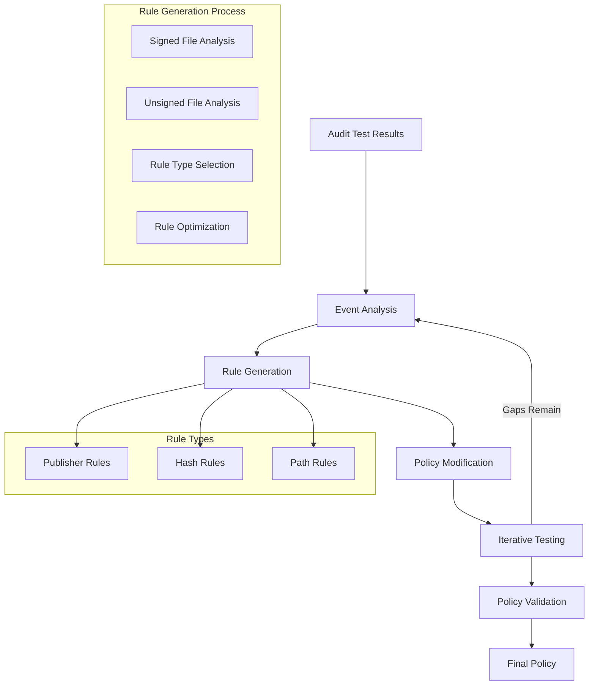

# Story 4.4: WDAC Policy Refinement

**Status:** Draft

## Non-Technical Explanation

This story focuses on creating a system that automatically improves security policies based on testing results. Think of it like having an architect who can modify building plans after walking through a prototype to fix any issues discovered during the walkthrough.

When we test Windows Defender Application Control (WDAC) policies in audit mode (Story 4.3), we discover legitimate application components that would be blocked if the policy were enforced. This feature analyzes those potential blocks, called "code integrity violations," and automatically adds appropriate rules to allow those legitimate components.

The system examines each violation, determines what type of rule would be most appropriate (publisher rule, file hash rule, or path rule), and adds it to the policy. This iterative refinement process ensures the final policy will allow all required application functionality while maintaining the strongest possible security posture.

## Why This Matters

Automatic policy refinement is essential for several reasons:

1. **Completeness**: Ensures policies cover all legitimate application components, preventing application failures.

2. **Efficiency**: Automates what would otherwise be a tedious manual process of identifying and addressing policy gaps.

3. **Optimization**: Intelligently chooses the most appropriate rule types based on file characteristics.

4. **Risk Reduction**: Minimizes the chance of deployment issues by addressing gaps before enforcement.

5. **Time Savings**: Reduces what could be hours of manual policy editing to minutes of automated processing.

Without automated policy refinement, organizations would need to manually analyze audit logs and modify policies, a time-consuming and error-prone process that often leads to either overly permissive policies or application failures.

## Goal & Context

**User Story:** As a packaging engineer, I need the system to automatically refine WDAC policies based on audit testing results.

**Context:** Building on the audit mode testing capability (Story 4.3), this story adds automatic policy refinement to address identified gaps. This capability connects testing results to policy improvements, creating an iterative refinement process that results in accurate, comprehensive policies.

## Detailed Requirements

- Implement analysis of code integrity violations
- Create policy adjustments based on audit results
- Develop iterative testing and refinement
- Implement categorization of policy additions
- Create documentation of refinement decisions
- Document refinement methodology and limitations

## Acceptance Criteria (ACs)

- AC1: System correctly analyzes code integrity violations
- AC2: Policy adjustments address identified issues
- AC3: Iterative refinement eliminates false positives
- AC4: Categorization provides context for policy additions
- AC5: Documentation explains refinement decisions

## Technical Implementation Context

**Guidance:** Use the following details for implementation. Refer to the linked `docs/` files for broader context if needed.

- **Relevant Files:**

  - Files to Create: 
    - `backend/apas/agents/wdac/refiner/policy_refiner.py` - Core policy refinement
    - `backend/apas/agents/wdac/refiner/rule_generator.py` - Rule generation from events
    - `backend/apas/agents/wdac/refiner/rule_optimizer.py` - Rule optimization
    - `backend/apas/models/policy_refinement.py` - Refinement data models
    - `backend/apas/services/policy_refinement.py` - Refinement service layer
  - Files to Modify:
    - `backend/apas/agents/wdac/agent.py` - Add refinement integration
    - `backend/apas/agents/wdac/generator/policy_generator.py` - Update with refinement capabilities
    - `backend/apas/api/endpoints/wdac.py` - Add refinement endpoints
  - _(Hint: See `docs/architecture/project-structure.md` for overall layout)_

- **Key Technologies:**

  - Python for policy manipulation and rule generation
  - PowerShell for policy integration
  - XML processing for policy editing
  - Rule prioritization algorithms
  - Policy merging utilities
  - _(Hint: See `docs/architecture/tech-stack.md` for technology details)_

- **API Interactions / SDK Usage:**

  - PolicyFile PowerShell cmdlets
  - XML document operations
  - Event analysis and correlation
  - Certificate extraction for publisher rules
  - File hash calculation
  - _(Hint: See `docs/architecture/api-reference.md` for API patterns)_

- **Data Structures:**

  - `PolicyRefinement` model for refinement information
  - `RuleGeneration` model for rule generation details
  - `RuleAddition` model for tracking added rules
  - `RuleCategory` model for categorizing rules
  - `RefinementSession` model for tracking refinement process
  - _(Hint: See `docs/architecture/data-models.md` for structure details)_

- **Environment Variables:**

  - `MAX_REFINEMENT_ITERATIONS` - Maximum number of refinement iterations
  - `PUBLISHER_RULE_PREFERENCE` - Preference weight for publisher rules
  - `FILE_HASH_FALLBACK` - Whether to use file hash rules as fallback
  - _(Hint: See `docs/architecture/environment-vars.md` for details)_

- **Coding Standards Notes:**
  - Implement idempotent policy modifications
  - Create version tracking for policy changes
  - Develop proper error handling for iterative operations
  - Implement logging of all policy modifications
  - Create efficient rule deduplication
  - _(Hint: See `docs/architecture/coding-standards.md` for full standards)_

## Visual Design Reference



## Tasks / Subtasks

- [ ] Implement audit result analysis
  - [ ] Create event categorization
  - [ ] Implement file information extraction
  - [ ] Develop signature analysis
  - [ ] Create rule type determination
  - [ ] Implement priority assignment
- [ ] Create rule generation
  - [ ] Implement publisher rule generation
  - [ ] Create file hash rule generation
  - [ ] Develop path rule generation
  - [ ] Implement rule metadata
  - [ ] Create rule deduplication
- [ ] Implement policy modification
  - [ ] Create policy versioning
  - [ ] Implement XML manipulation
  - [ ] Develop rule insertion
  - [ ] Create policy validation
  - [ ] Implement change tracking
- [ ] Develop iterative refinement
  - [ ] Create refinement workflow
  - [ ] Implement progress tracking
  - [ ] Develop termination conditions
  - [ ] Create results correlation
  - [ ] Implement gap detection
- [ ] Create refinement reporting
  - [ ] Implement rule categorization
  - [ ] Create change documentation
  - [ ] Develop decision explanation
  - [ ] Create visual rule presentation
  - [ ] Implement impact analysis
- [ ] Implement service integration
  - [ ] Create refinement service
  - [ ] Implement API endpoints
  - [ ] Develop user interface
  - [ ] Create progress feedback
  - [ ] Implement error handling

## Manual Testing Guide (For Non-Technical Users)

You can verify the WDAC Policy Refinement is working correctly through these checks:

1. **Basic Refinement Flow**:
   - Upload an application installer
   - Generate a WDAC policy
   - Run an audit mode test (from Story 4.3)
   - When gaps are found, use the "Refine Policy" option
   - Verify that a new policy version is created
   - Check that each identified gap has been addressed with appropriate rules

2. **Rule Type Verification**:
   - For a refinement that added rules, examine the rule details
   - Verify that signed files received publisher rules
   - Check that unsigned files received hash or path rules
   - Confirm that rule types match the system's explanation of why each rule was chosen

3. **Iterative Refinement**:
   - After an initial refinement, run another audit test
   - Verify that the number of gaps decreases
   - Continue refinement until no gaps remain
   - Check that the final policy allows all legitimate application functionality

4. **Expected Results**:
   - Each refinement should add rules that address specific gaps
   - The refinement report should clearly explain what rules were added and why
   - The number of gaps should decrease with each refinement iteration
   - The final policy should allow all legitimate application functionality
   - The policy should maintain a strong security posture, using the most appropriate rule types

## Testing Requirements

**Guidance:** Verify implementation against the ACs using the following tests.

- **Unit Tests:** 
  - Test event analysis logic
  - Verify rule generation for different file types
  - Test policy modification
  - Validate rule optimization
  - Test iterative refinement workflow

- **Integration Tests:** 
  - Test end-to-end refinement process
  - Verify policy modification and testing
  - Test with various application types
  - Validate handling of complex rule scenarios
  - Test error handling and recovery

- **Manual Verification:** 
  - Test with real application installers
  - Verify rule creation against file properties
  - Check policy effect on application functionality
  - Validate report clarity and usefulness
  - Test with applications of varying complexity

## Implementation Example

Here's an example implementation of the policy refiner:

```python
from dataclasses import dataclass, field
from enum import Enum, auto
from typing import Dict, List, Optional, Set, Tuple, Union
from pathlib import Path
import os
import logging
import xml.etree.ElementTree as ET
import xml.dom.minidom as minidom
import subprocess
import tempfile
import time
import json
import uuid
import hashlib
import re
from datetime import datetime

# Import models from previous stories
from apas.models.code_integrity_event import CodeIntegrityEvent
from apas.models.wdac_policy import WDACPolicy, PolicyRule, RuleType, RuleLevel

class RuleCategory(Enum):
    """Category of a rule addition."""
    PUBLISHER = "Publisher"
    HASH = "FileHash"
    PATH = "FilePath"
    FALLBACK = "Fallback"
    EXCEPTION = "Exception"

@dataclass
class RuleAddition:
    """Information about a rule addition."""
    rule: PolicyRule
    category: RuleCategory
    source_event: Optional[CodeIntegrityEvent] = None
    file_path: Optional[str] = None
    rationale: Optional[str] = None
    
    def to_dict(self) -> Dict:
        """Convert to dictionary for storage."""
        return {
            "rule": {
                "rule_type": self.rule.rule_type.value,
                "rule_level": self.rule.rule_level.value,
                "value": self.rule.value,
                "description": self.rule.description,
                "is_auto_generated": self.rule.is_auto_generated
            },
            "category": self.category.value,
            "file_path": self.file_path,
            "rationale": self.rationale
        }

@dataclass
class PolicyRefinementResult:
    """Result of a policy refinement."""
    original_policy_id: str
    refined_policy_id: str
    original_rule_count: int
    added_rule_count: int
    total_rule_count: int
    rule_additions: List[RuleAddition] = field(default_factory=list)
    remaining_gaps: List[Dict] = field(default_factory=list)
    iteration_count: int = 1
    
    def to_dict(self) -> Dict:
        """Convert to dictionary for storage."""
        return {
            "original_policy_id": self.original_policy_id,
            "refined_policy_id": self.refined_policy_id,
            "original_rule_count": self.original_rule_count,
            "added_rule_count": self.added_rule_count,
            "total_rule_count": self.total_rule_count,
            "rule_additions": [addition.to_dict() for addition in self.rule_additions],
            "remaining_gaps": self.remaining_gaps,
            "iteration_count": self.iteration_count
        }

class RuleGenerator:
    """Generates rules from code integrity events."""
    
    def __init__(self):
        self.logger = logging.getLogger(__name__)
        self.publisher_preference = float(os.environ.get("PUBLISHER_RULE_PREFERENCE", "0.8"))
        self.use_hash_fallback = os.environ.get("FILE_HASH_FALLBACK", "True").lower() == "true"
    
    def generate_rules_from_events(self, events: List[CodeIntegrityEvent]) -> List[Tuple[PolicyRule, RuleAddition]]:
        """
        Generate rules from code integrity events.
        
        Args:
            events: List of code integrity events
            
        Returns:
            List[Tuple[PolicyRule, RuleAddition]]: Generated rules with addition info
        """
        self.logger.info(f"Generating rules from {len(events)} events")
        
        # Group events by file path
        file_events = {}
        for event in events:
            file_path = event.file_path
            if file_path not in file_events:
                file_events[file_path] = []
            
            file_events[file_path].append(event)
        
        # Generate rules for each file
        rules = []
        for file_path, file_events_list in file_events.items():
            # Get representative event
            event = file_events_list[0]
            
            try:
                # Generate rules for this file
                file_rules = self._generate_rules_for_file(event, file_path)
                rules.extend(file_rules)
            except Exception as e:
                self.logger.error(f"Error generating rules for {file_path}: {str(e)}")
        
        self.logger.info(f"Generated {len(rules)} rules")
        return rules
    
    def _generate_rules_for_file(self, event: CodeIntegrityEvent, file_path: str) -> List[Tuple[PolicyRule, RuleAddition]]:
        """
        Generate rules for a file.
        
        Args:
            event: Code integrity event
            file_path: File path
            
        Returns:
            List[Tuple[PolicyRule, RuleAddition]]: Generated rules with addition info
        """
        rules = []
        
        # Try to generate publisher rule
        publisher_rule = self._generate_publisher_rule(event, file_path)
        if publisher_rule:
            rules.append(publisher_rule)
        
        # Generate file hash rule as fallback
        if self.use_hash_fallback and not publisher_rule:
            hash_rule = self._generate_hash_rule(event, file_path)
            if hash_rule:
                rules.append(hash_rule)
        
        # Generate file path rule as last resort
        if not rules:
            path_rule = self._generate_path_rule(event, file_path)
            if path_rule:
                rules.append(path_rule)
        
        return rules
    
    def _generate_publisher_rule(self, event: CodeIntegrityEvent, file_path: str) -> Optional[Tuple[PolicyRule, RuleAddition]]:
        """
        Generate a publisher rule.
        
        Args:
            event: Code integrity event
            file_path: File path
            
        Returns:
            Optional[Tuple[PolicyRule, RuleAddition]]: Generated rule with addition info
        """
        # Check if publisher is available
        if not event.publisher:
            return None
        
        try:
            # Create rule
            rule = PolicyRule(
                rule_type=RuleType.PUBLISHER,
                rule_level=RuleLevel.ALLOW,
                value=event.publisher,
                description=f"Allow publisher {self._extract_cn(event.publisher)}",
                is_auto_generated=True
            )
            
            # Create addition info
            addition = RuleAddition(
                rule=rule,
                category=RuleCategory.PUBLISHER,
                source_event=event,
                file_path=file_path,
                rationale="Publisher rule created based on digital signature"
            )
            
            return (rule, addition)
        except Exception as e:
            self.logger.error(f"Error generating publisher rule: {str(e)}")
            return None
    
    def _generate_hash_rule(self, event: CodeIntegrityEvent, file_path: str) -> Optional[Tuple[PolicyRule, RuleAddition]]:
        """
        Generate a file hash rule.
        
        Args:
            event: Code integrity event
            file_path: File path
            
        Returns:
            Optional[Tuple[PolicyRule, RuleAddition]]: Generated rule with addition info
        """
        try:
            # Check if file exists
            if not os.path.isfile(file_path):
                return None
            
            # Calculate file hash
            file_hash = self._calculate_file_hash(file_path)
            if not file_hash:
                return None
            
            # Create rule
            rule = PolicyRule(
                rule_type=RuleType.HASH,
                rule_level=RuleLevel.ALLOW,
                value=file_hash,
                description=f"Allow file hash for {os.path.basename(file_path)}",
                is_auto_generated=True
            )
            
            # Create addition info
            addition = RuleAddition(
                rule=rule,
                category=RuleCategory.HASH,
                source_event=event,
                file_path=file_path,
                rationale="File hash rule created for unsigned file"
            )
            
            return (rule, addition)
        except Exception as e:
            self.logger.error(f"Error generating hash rule: {str(e)}")
            return None
    
    def _generate_path_rule(self, event: CodeIntegrityEvent, file_path: str) -> Optional[Tuple[PolicyRule, RuleAddition]]:
        """
        Generate a file path rule.
        
        Args:
            event: Code integrity event
            file_path: File path
            
        Returns:
            Optional[Tuple[PolicyRule, RuleAddition]]: Generated rule with addition info
        """
        try:
            # Normalize path
            normalized_path = file_path
            
            # Create rule
            rule = PolicyRule(
                rule_type=RuleType.FILEPATH,
                rule_level=RuleLevel.ALLOW,
                value=normalized_path,
                description=f"Allow file path {os.path.basename(normalized_path)}",
                is_auto_generated=True
            )
            
            # Create addition info
            addition = RuleAddition(
                rule=rule,
                category=RuleCategory.PATH,
                source_event=event,
                file_path=file_path,
                rationale="File path rule created as fallback"
            )
            
            return (rule, addition)
        except Exception as e:
            self.logger.error(f"Error generating path rule: {str(e)}")
            return None
    
    def _calculate_file_hash(self, file_path: str) -> Optional[str]:
        """
        Calculate SHA256 hash for a file.
        
        Args:
            file_path: Path to the file
            
        Returns:
            Optional[str]: Calculated hash
        """
        try:
            # Open file in binary mode
            with open(file_path, "rb") as f:
                # Calculate SHA256 hash
                file_hash = hashlib.sha256(f.read()).hexdigest()
                return file_hash
        except Exception as e:
            self.logger.error(f"Error calculating file hash: {str(e)}")
            return None
    
    def _extract_cn(self, subject: str) -> str:
        """
        Extract CN from a certificate subject.
        
        Args:
            subject: Certificate subject
            
        Returns:
            str: Extracted CN or original subject
        """
        match = re.search(r"CN=([^,]+)", subject)
        if match:
            return match.group(1).strip()
        return subject

class PolicyRefiner:
    """Refines WDAC policies based on audit results."""
    
    def __init__(self, powershell_path: str = "powershell"):
        self.powershell_path = powershell_path
        self.logger = logging.getLogger(__name__)
        self.rule_generator = RuleGenerator()
        self.max_iterations = int(os.environ.get("MAX_REFINEMENT_ITERATIONS", "3"))
    
    def refine_policy(self, policy_path: str, audit_results: Dict) -> PolicyRefinementResult:
        """
        Refine a WDAC policy based on audit results.
        
        Args:
            policy_path: Path to the policy file
            audit_results: Audit results from testing
            
        Returns:
            PolicyRefinementResult: Refinement result
        """
        self.logger.info(f"Refining policy: {policy_path}")
        
        try:
            # Load original policy
            tree = ET.parse(policy_path)
            root = tree.getroot()
            
            # Get original policy ID
            policy_id = root.get("PolicyID", str(uuid.uuid4()))
            
            # Extract events from audit results
            events = []
            for event_data in audit_results.get("events", []):
                # Convert dictionary to CodeIntegrityEvent
                event = self._dict_to_event(event_data)
                if event:
                    events.append(event)
            
            # Count original rules
            original_rule_count = len(root.findall(".//{urn:schemas-microsoft-com:sipolicy}Rule"))
            
            # Generate rules from events
            rule_additions = []
            rules_with_additions = self.rule_generator.generate_rules_from_events(events)
            
            # Add rules to policy
            for rule, addition in rules_with_additions:
                # Add rule XML to policy
                self._add_rule_to_policy(root, rule)
                
                # Track addition
                rule_additions.append(addition)
            
            # Create new policy file path
            base_path = os.path.splitext(policy_path)[0]
            refined_path = f"{base_path}_Refined.xml"
            
            # Write refined policy
            tree.write(refined_path, encoding="utf-8", xml_declaration=True)
            
            # Count total rules
            total_rule_count = len(root.findall(".//{urn:schemas-microsoft-com:sipolicy}Rule"))
            
            # Create result
            result = PolicyRefinementResult(
                original_policy_id=policy_id,
                refined_policy_id=str(uuid.uuid4()),  # New policy ID
                original_rule_count=original_rule_count,
                added_rule_count=total_rule_count - original_rule_count,
                total_rule_count=total_rule_count,
                rule_additions=rule_additions,
                remaining_gaps=[]  # To be determined by subsequent testing
            )
            
            self.logger.info(f"Policy refined: {result.added_rule_count} rules added")
            return result
        except Exception as e:
            self.logger.error(f"Error refining policy: {str(e)}")
            raise
    
    def _dict_to_event(self, event_data: Dict) -> Optional[CodeIntegrityEvent]:
        """
        Convert dictionary to CodeIntegrityEvent.
        
        Args:
            event_data: Event data dictionary
            
        Returns:
            Optional[CodeIntegrityEvent]: Converted event
        """
        try:
            return CodeIntegrityEvent(
                event_id=event_data.get("event_id", 0),
                timestamp=datetime.fromisoformat(event_data.get("timestamp", "2000-01-01T00:00:00")),
                process_name=event_data.get("process_name", ""),
                file_path=event_data.get("file_path", ""),
                signature_level=event_data.get("signature_level", ""),
                policy_name=event_data.get("policy_name", ""),
                policy_id=event_data.get("policy_id", ""),
                user_name=event_data.get("user_name", ""),
                session_id=event_data.get("session_id", 0),
                level=event_data.get("level", ""),
                signer=event_data.get("signer"),
                publisher=event_data.get("publisher"),
                file_hash=event_data.get("file_hash"),
                event_data=event_data.get("event_data", {})
            )
        except Exception as e:
            self.logger.error(f"Error converting event data: {str(e)}")
            return None
    
    def _add_rule_to_policy(self, root: ET.Element, rule: PolicyRule) -> None:
        """
        Add a rule to a policy XML.
        
        Args:
            root: Policy XML root
            rule: Rule to add
        """
        # Find rules element
        rules_elem = root.find(".//{urn:schemas-microsoft-com:sipolicy}Rules")
        if rules_elem is None:
            # Create rules element if it doesn't exist
            rules_elem = ET.SubElement(root, "{urn:schemas-microsoft-com:sipolicy}Rules")
        
        # Create rule element
        rule_elem = ET.SubElement(rules_elem, "{urn:schemas-microsoft-com:sipolicy}Rule")
        rule_elem.set("Id", str(uuid.uuid4()))
        rule_elem.set("Action", rule.rule_level.value)
        
        # Set rule type-specific attributes and elements
        if rule.rule_type == RuleType.PUBLISHER:
            rule_elem.set("Type", "Publisher")
            
            # Add publisher signature
            sig_elem = ET.SubElement(rule_elem, "{urn:schemas-microsoft-com:sipolicy}PublisherSignature")
            sig_elem.text = rule.value
            
            # Add friendly name
            name_elem = ET.SubElement(rule_elem, "{urn:schemas-microsoft-com:sipolicy}FriendlyName")
            name_elem.text = rule.description
        elif rule.rule_type == RuleType.HASH:
            rule_elem.set("Type", "Hash")
            
            # Add file hash
            hash_elem = ET.SubElement(rule_elem, "{urn:schemas-microsoft-com:sipolicy}Hash")
            hash_elem.text = rule.value
            
            # Add file name
            name_elem = ET.SubElement(rule_elem, "{urn:schemas-microsoft-com:sipolicy}FileName")
            name_elem.text = os.path.basename(rule.description)
        elif rule.rule_type == RuleType.FILEPATH:
            rule_elem.set("Type", "Path")
            
            # Add file path
            path_elem = ET.SubElement(rule_elem, "{urn:schemas-microsoft-com:sipolicy}Path")
            path_elem.text = rule.value

class RefinementService:
    """Service for WDAC policy refinement."""
    
    def __init__(self):
        self.logger = logging.getLogger(__name__)
        self.refiner = PolicyRefiner()
    
    async def refine_policy(self, policy_path: str, audit_results: Dict) -> Dict:
        """
        Refine a WDAC policy based on audit results.
        
        Args:
            policy_path: Path to the policy file
            audit_results: Audit results from testing
            
        Returns:
            Dict: Refinement result
        """
        self.logger.info(f"Refining policy: {policy_path}")
        
        try:
            # Refine policy
            result = self.refiner.refine_policy(policy_path, audit_results)
            
            # Convert result to dictionary
            return result.to_dict()
        except Exception as e:
            self.logger.error(f"Error refining policy: {str(e)}")
            raise

    async def iterative_refinement(self, policy_path: str, audit_service) -> Dict:
        """
        Perform iterative policy refinement with testing.
        
        Args:
            policy_path: Path to the policy file
            audit_service: Audit service for testing
            
        Returns:
            Dict: Final refinement result
        """
        self.logger.info(f"Starting iterative refinement for: {policy_path}")
        
        current_policy_path = policy_path
        iteration_count = 0
        max_iterations = self.refiner.max_iterations
        
        # Track overall additions
        all_additions = []
        
        try:
            while iteration_count < max_iterations:
                iteration_count += 1
                self.logger.info(f"Refinement iteration {iteration_count}/{max_iterations}")
                
                # Run audit test
                audit_result = await audit_service.run_audit_test(current_policy_path)
                
                # Check if there are any events
                if not audit_result.get("events", []):
                    self.logger.info("No events found, refinement complete")
                    break
                
                # Refine policy
                refinement_result = await self.refine_policy(current_policy_path, audit_result)
                
                # Track additions
                all_additions.extend(refinement_result.get("rule_additions", []))
                
                # Update current policy path to refined policy
                base_path = os.path.splitext(current_policy_path)[0]
                current_policy_path = f"{base_path}_Refined.xml"
                
                # Check if we added any rules
                if refinement_result.get("added_rule_count", 0) == 0:
                    self.logger.info("No rules added, refinement complete")
                    break
            
            # Create final result
            final_result = {
                "original_policy_path": policy_path,
                "final_policy_path": current_policy_path,
                "iteration_count": iteration_count,
                "total_rules_added": len(all_additions),
                "rule_additions": all_additions,
                "reached_max_iterations": iteration_count >= max_iterations
            }
            
            self.logger.info(f"Iterative refinement complete: {iteration_count} iterations, {len(all_additions)} rules added")
            return final_result
        except Exception as e:
            self.logger.error(f"Error in iterative refinement: {str(e)}")
            raise

# Example usage
if __name__ == "__main__":
    # Configure logging
    logging.basicConfig(level=logging.INFO)
    
    # Mock audit results for testing
    audit_results = {
        "events": [
            {
                "event_id": 3076,
                "timestamp": "2023-01-01T12:00:00",
                "process_name": "example.exe",
                "file_path": "C:\\Program Files\\Example\\lib.dll",
                "signature_level": "Microsoft",
                "policy_name": "Example Policy",
                "policy_id": "12345678-1234-1234-1234-123456789012",
                "user_name": "User",
                "session_id": 1,
                "level": "Information",
                "publisher": "O=Example, CN=Example Publisher"
            }
        ]
    }
    
    # Create refinement service
    service = RefinementService()
    
    # Refine policy
    import asyncio
    result = asyncio.run(service.refine_policy(
        policy_path="C:\\Policies\\Example.xml",
        audit_results=audit_results
    ))
    
    # Print result summary
    print(f"Original Rule Count: {result['original_rule_count']}")
    print(f"Added Rule Count: {result['added_rule_count']}")
    print(f"Total Rule Count: {result['total_rule_count']}")
    
    # Print rule additions
    if result['added_rule_count'] > 0:
        print("\nAdded Rules:")
        for addition in result['rule_additions']:
            print(f"- {addition['rule']['description']}")
            print(f"  Category: {addition['category']}")
            print(f"  File: {addition['file_path']}")
            print(f"  Rationale: {addition['rationale']}")
            print()
```

## Story Wrap Up (Agent Populates After Execution)

- **Agent Model Used:** `claude-3.7-sonnet-20250219`
- **Completion Notes:**
- **Change Log:**
  - Initial Draft
