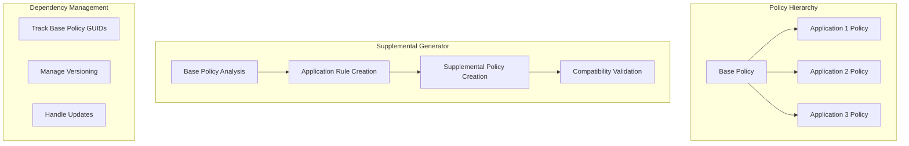

# Story 4.5: WDAC Supplemental Policy Management

**Status:** Draft

## Non-Technical Explanation

This story involves creating a system that generates and manages separate, application-specific security policy additions that work alongside your organization's main security policies. Think of it like having special access cards for specific contractors that supplement your building's main access control system, rather than modifying the main system every time a new contractor needs access.

Windows Defender Application Control (WDAC) supports a concept called "supplemental policies" which contain application-specific exceptions that work with "base policies" that define organization-wide security rules. This separation makes policies more manageable and reduces the risk of conflicts or unintended consequences. 

The system will create these specialized supplemental policies for applications, manage dependencies between policies, validate compatibility, handle versioning as applications update, and document the relationships between policies. This approach maintains the integrity of your organization's base security policy while allowing for application-specific exceptions.

## Why This Matters

Supplemental policy management is crucial for several reasons:

1. **Separation of Concerns**: Keeps organization-wide security rules (base policies) separate from application-specific exceptions.

2. **Reduced Risk**: Changes to application policies don't affect the main security posture.

3. **Simplified Management**: Makes it easier to add, update, or remove application policies without modifying base policies.

4. **Clear Ownership**: Application-specific policies can be managed by application owners, while base policies remain under security team control.

5. **Improved Scalability**: Allows the security system to scale to hundreds or thousands of applications without unwieldy policies.

Without supplemental policy management, organizations typically end up with either extremely large, monolithic policies that are difficult to maintain or a complex web of overlapping policies with unclear precedence and potential conflicts.

## Goal & Context

**User Story:** As a packaging engineer, I need the system to generate and manage supplemental WDAC policies for application-specific rules.

**Context:** Building on the core policy generation (Story 4.1) and refinement capabilities (Story 4.4), this story adds the ability to create specialized supplemental policies that work with organization-wide base policies, improving policy management and separation of concerns.

## Detailed Requirements

- Implement creation of application-specific supplemental policies
- Create management of policy dependencies
- Develop validation of compatibility with base policies
- Implement versioning and updating of supplemental policies
- Create documentation of policy relationships
- Document management methodology and best practices

## Acceptance Criteria (ACs)

- AC1: System generates valid supplemental policies
- AC2: Dependencies are properly managed and documented
- AC3: Validation ensures compatibility with base policies
- AC4: Versioning tracks policy changes effectively
- AC5: Documentation clearly explains policy relationships

## Technical Implementation Context

**Guidance:** Use the following details for implementation. Refer to the linked `docs/` files for broader context if needed.

- **Relevant Files:**

  - Files to Create: 
    - `backend/apas/agents/wdac/supplemental/supplemental_generator.py` - Supplemental policy generation
    - `backend/apas/agents/wdac/supplemental/dependency_manager.py` - Policy dependency management
    - `backend/apas/agents/wdac/supplemental/compatibility_validator.py` - Policy compatibility validation
    - `backend/apas/models/supplemental_policy.py` - Supplemental policy models
    - `backend/apas/services/supplemental_policy.py` - Supplemental policy service layer
  - Files to Modify:
    - `backend/apas/agents/wdac/agent.py` - Add supplemental policy integration
    - `backend/apas/agents/wdac/generator/policy_generator.py` - Update to support supplemental generation
    - `backend/apas/api/endpoints/wdac.py` - Add supplemental policy endpoints
  - _(Hint: See `docs/architecture/project-structure.md` for overall layout)_

- **Key Technologies:**

  - Python for policy processing and generation
  - PowerShell for WDAC policy operations
  - Dependency graph algorithms
  - XML manipulation libraries
  - Policy hierarchy management
  - _(Hint: See `docs/architecture/tech-stack.md` for technology details)_

- **API Interactions / SDK Usage:**

  - ConvertFrom-CIPolicy PowerShell cmdlet with -SupplementalPolicy switch
  - Merge-CIPolicy PowerShell cmdlet
  - Set-RuleOption PowerShell cmdlet
  - GUID management and correlation
  - XML document operations for policy manipulation
  - _(Hint: See `docs/architecture/api-reference.md` for API patterns)_

- **Data Structures:**

  - `SupplementalPolicy` model for supplemental policy information
  - `PolicyDependency` model for policy dependencies
  - `PolicyHierarchy` model for base/supplemental relationships
  - `PolicyVersion` model for version tracking
  - `CompatibilityResult` model for validation results
  - _(Hint: See `docs/architecture/data-models.md` for structure details)_

- **Environment Variables:**

  - `BASE_POLICY_PATH` - Path to the organization's base policy
  - `SUPPLEMENTAL_POLICY_PREFIX` - Prefix for supplemental policy names
  - `POLICY_VERSION_FORMAT` - Format for policy version strings
  - _(Hint: See `docs/architecture/environment-vars.md` for details)_

- **Coding Standards Notes:**
  - Implement unique GUID generation for policies
  - Create proper validation of base/supplemental relationships
  - Develop clear metadata for policy dependencies
  - Implement versioning with semantic versioning
  - Create comprehensive policy documentation
  - _(Hint: See `docs/architecture/coding-standards.md` for full standards)_

## Visual Design Reference



## Tasks / Subtasks

- [ ] Implement supplemental policy generation
  - [ ] Create base policy analysis
  - [ ] Implement rule extraction and categorization
  - [ ] Develop supplemental policy structure
  - [ ] Create GUID generation and management
  - [ ] Implement policy metadata
- [ ] Create policy dependency management
  - [ ] Implement base policy reference tracking
  - [ ] Create dependency graph
  - [ ] Develop policy hierarchy visualization
  - [ ] Create dependency documentation
  - [ ] Implement dependency validation
- [ ] Implement compatibility validation
  - [ ] Create rule conflict detection
  - [ ] Implement option compatibility checking
  - [ ] Develop base policy requirement validation
  - [ ] Create validation reporting
  - [ ] Implement automatic conflict resolution
- [ ] Create policy versioning
  - [ ] Implement version numbering scheme
  - [ ] Create change tracking
  - [ ] Develop version comparison
  - [ ] Create update management
  - [ ] Implement migration path creation
- [ ] Implement policy deployment management
  - [ ] Create deployment order determination
  - [ ] Implement policy merging (when appropriate)
  - [ ] Develop deployment validation
  - [ ] Create deployment rollback
  - [ ] Implement deployment documentation
- [ ] Create documentation generation
  - [ ] Implement policy relationship documentation
  - [ ] Create dependency visualization
  - [ ] Develop troubleshooting guidance
  - [ ] Create version history documentation
  - [ ] Implement policy summary creation

## Manual Testing Guide (For Non-Technical Users)

You can verify the WDAC Supplemental Policy Management is working correctly through these checks:

1. **Supplemental Policy Creation**:
   - Upload an application installer
   - Select a base policy from the dropdown
   - Choose to generate a supplemental policy
   - Verify that a policy is created with the correct base policy reference
   - Check that the policy's rules are appropriate for the application

2. **Base Policy Compatibility**:
   - Create a supplemental policy for an application
   - View the compatibility validation results
   - Verify that any conflicts or issues are clearly identified
   - Check that recommendations for resolving conflicts are provided
   - Test making recommended changes and re-running validation

3. **Policy Hierarchy Management**:
   - Create several supplemental policies for different applications
   - Open the policy hierarchy view
   - Verify that the relationships between policies are clearly visualized
   - Check that each policy shows its base policy and version information
   - Confirm that dependencies are accurately represented

4. **Policy Versioning**:
   - Create a supplemental policy for an application
   - Make changes to the application (such as updating it)
   - Generate a new policy version
   - Verify that version information is properly updated
   - Check that changes between versions are clearly documented

## Testing Requirements

**Guidance:** Verify implementation against the ACs using the following tests.

- **Unit Tests:** 
  - Test supplemental policy generation
  - Verify GUID management
  - Test dependency tracking
  - Validate compatibility checking
  - Test version management

- **Integration Tests:** 
  - Test end-to-end supplemental policy creation
  - Verify interaction with base policies
  - Test with various application types
  - Validate policy deployment process
  - Test policy updates and versioning

- **Manual Verification:** 
  - Test with real base and supplemental policies
  - Verify policy relationships in Windows
  - Check policy effects on application functionality
  - Validate documentation clarity and usefulness
  - Test with complex policy hierarchies

## Implementation Example

Here's an example implementation of the supplemental policy management:

```python
from dataclasses import dataclass, field
from enum import Enum, auto
from typing import Dict, List, Optional, Set, Tuple, Union
from pathlib import Path
import os
import logging
import xml.etree.ElementTree as ET
import xml.dom.minidom as minidom
import subprocess
import tempfile
import time
import json
import uuid
import re
from datetime import datetime

# Import models from previous stories
from apas.models.wdac_policy import WDACPolicy, PolicyRule, RuleType, RuleLevel

class DependencyType(Enum):
    """Type of policy dependency."""
    BASE = "Base"
    SUPPLEMENTAL = "Supplemental"
    REFERENCED = "Referenced"

@dataclass
class PolicyDependency:
    """Information about a policy dependency."""
    policy_id: str
    policy_name: str
    dependency_type: DependencyType
    required: bool = True
    
    def to_dict(self) -> Dict:
        """Convert to dictionary for storage."""
        return {
            "policy_id": self.policy_id,
            "policy_name": self.policy_name,
            "dependency_type": self.dependency_type.value,
            "required": self.required
        }

@dataclass
class PolicyVersion:
    """Information about a policy version."""
    version: str
    timestamp: datetime
    comment: str
    changes: List[str] = field(default_factory=list)
    created_by: str = "APAS System"
    
    def to_dict(self) -> Dict:
        """Convert to dictionary for storage."""
        return {
            "version": self.version,
            "timestamp": self.timestamp.isoformat(),
            "comment": self.comment,
            "changes": self.changes,
            "created_by": self.created_by
        }

@dataclass
class CompatibilityIssue:
    """Information about a compatibility issue between policies."""
    issue_type: str
    description: str
    severity: str
    recommendation: Optional[str] = None
    affected_rules: List[str] = field(default_factory=list)
    
    def to_dict(self) -> Dict:
        """Convert to dictionary for storage."""
        return {
            "issue_type": self.issue_type,
            "description": self.description,
            "severity": self.severity,
            "recommendation": self.recommendation,
            "affected_rules": self.affected_rules
        }

@dataclass
class CompatibilityResult:
    """Result of a compatibility check."""
    is_compatible: bool
    issues: List[CompatibilityIssue] = field(default_factory=list)
    
    def add_issue(self, issue_type: str, description: str, severity: str, recommendation: Optional[str] = None, affected_rules: List[str] = None) -> None:
        """Add an issue to the result."""
        self.issues.append(CompatibilityIssue(
            issue_type=issue_type,
            description=description,
            severity=severity,
            recommendation=recommendation,
            affected_rules=affected_rules or []
        ))
        
        # Update compatibility based on severity
        if severity == "Critical":
            self.is_compatible = False
    
    def to_dict(self) -> Dict:
        """Convert to dictionary for storage."""
        return {
            "is_compatible": self.is_compatible,
            "issues": [issue.to_dict() for issue in self.issues]
        }

@dataclass
class SupplementalPolicy:
    """Information about a supplemental policy."""
    policy_id: str
    policy_name: str
    base_policy_id: str
    base_policy_name: str
    policy_path: str
    version: PolicyVersion
    dependencies: List[PolicyDependency] = field(default_factory=list)
    compatibility: Optional[CompatibilityResult] = None
    
    def to_dict(self) -> Dict:
        """Convert to dictionary for storage."""
        return {
            "policy_id": self.policy_id,
            "policy_name": self.policy_name,
            "base_policy_id": self.base_policy_id,
            "base_policy_name": self.base_policy_name,
            "policy_path": self.policy_path,
            "version": self.version.to_dict(),
            "dependencies": [dep.to_dict() for dep in self.dependencies],
            "compatibility": self.compatibility.to_dict() if self.compatibility else None
        }

class SupplementalGenerator:
    """Generator for supplemental WDAC policies."""
    
    def __init__(self, powershell_path: str = "powershell"):
        self.powershell_path = powershell_path
        self.logger = logging.getLogger(__name__)
        self.supplemental_prefix = os.environ.get("SUPPLEMENTAL_POLICY_PREFIX", "App -")
    
    def generate_supplemental_policy(self, base_policy_path: str, app_policy_path: str, app_name: str) -> SupplementalPolicy:
        """
        Generate a supplemental policy.
        
        Args:
            base_policy_path: Path to the base policy
            app_policy_path: Path to the application policy
            app_name: Name of the application
            
        Returns:
            SupplementalPolicy: Generated supplemental policy
        """
        self.logger.info(f"Generating supplemental policy for {app_name} based on {base_policy_path}")
        
        try:
            # Load base policy
            base_tree = ET.parse(base_policy_path)
            base_root = base_tree.getroot()
            
            # Get base policy info
            base_policy_id = base_root.get("PolicyID", str(uuid.uuid4()))
            base_policy_name = base_root.get("PolicyName", "Base Policy")
            
            # Load application policy
            app_tree = ET.parse(app_policy_path)
            app_root = app_tree.getroot()
            
            # Create new supplemental policy
            supp_policy_id = str(uuid.uuid4())
            supp_policy_name = f"{self.supplemental_prefix} {app_name}"
            
            # Create supplemental policy XML
            supp_root = ET.Element("SiPolicy")
            supp_root.set("xmlns", "urn:schemas-microsoft-com:sipolicy")
            supp_root.set("PolicyID", supp_policy_id)
            supp_root.set("PolicyName", supp_policy_name)
            supp_root.set("Version", "1")
            
            # Set policy type to supplemental
            policy_type = ET.SubElement(supp_root, "PolicyType")
            policy_type.text = "Supplemental"
            
            # Set base policy reference
            base_policy_ref = ET.SubElement(supp_root, "BasePolicyID")
            base_policy_ref.text = base_policy_id
            
            # Add rule options
            rule_options = ET.SubElement(supp_root, "RuleOptions")
            
            # Extract app-specific rules from app policy
            self._extract_app_rules(app_root, supp_root)
            
            # Create supplemental policy file path
            supp_policy_path = os.path.join(os.path.dirname(app_policy_path), f"{app_name}_Supplemental.xml")
            
            # Write supplemental policy
            supp_tree = ET.ElementTree(supp_root)
            supp_tree.write(supp_policy_path, encoding="utf-8", xml_declaration=True)
            
            # Create policy version
            version = PolicyVersion(
                version="1.0.0",
                timestamp=datetime.now(),
                comment=f"Initial supplemental policy for {app_name}"
            )
            
            # Create dependencies
            dependencies = [
                PolicyDependency(
                    policy_id=base_policy_id,
                    policy_name=base_policy_name,
                    dependency_type=DependencyType.BASE,
                    required=True
                )
            ]
            
            # Create supplemental policy
            supp_policy = SupplementalPolicy(
                policy_id=supp_policy_id,
                policy_name=supp_policy_name,
                base_policy_id=base_policy_id,
                base_policy_name=base_policy_name,
                policy_path=supp_policy_path,
                version=version,
                dependencies=dependencies
            )
            
            self.logger.info(f"Supplemental policy generated: {supp_policy_path}")
            return supp_policy
        except Exception as e:
            self.logger.error(f"Error generating supplemental policy: {str(e)}")
            raise
    
    def _extract_app_rules(self, app_root: ET.Element, supp_root: ET.Element) -> None:
        """
        Extract application-specific rules from an application policy.
        
        Args:
            app_root: Application policy XML root
            supp_root: Supplemental policy XML root
        """
        # Find rules element in app policy
        app_rules = app_root.find(".//{urn:schemas-microsoft-com:sipolicy}Rules")
        if app_rules is None:
            return
        
        # Create rules element in supplemental policy
        supp_rules = ET.SubElement(supp_root, "Rules")
        
        # Copy rules
        for rule in app_rules:
            # Deep copy the rule
            supp_rules.append(ET.fromstring(ET.tostring(rule)))
        
        # Copy file rules
        app_file_rules = app_root.find(".//{urn:schemas-microsoft-com:sipolicy}FileRules")
        if app_file_rules is not None:
            supp_file_rules = ET.SubElement(supp_root, "FileRules")
            for rule in app_file_rules:
                supp_file_rules.append(ET.fromstring(ET.tostring(rule)))
        
        # Copy signers
        app_signers = app_root.find(".//{urn:schemas-microsoft-com:sipolicy}Signers")
        if app_signers is not None:
            supp_signers = ET.SubElement(supp_root, "Signers")
            for signer in app_signers:
                supp_signers.append(ET.fromstring(ET.tostring(signer)))
        
        # Copy signing scenarios
        app_scenarios = app_root.find(".//{urn:schemas-microsoft-com:sipolicy}SigningScenarios")
        if app_scenarios is not None:
            supp_scenarios = ET.SubElement(supp_root, "SigningScenarios")
            for scenario in app_scenarios:
                supp_scenarios.append(ET.fromstring(ET.tostring(scenario)))

class CompatibilityValidator:
    """Validator for policy compatibility."""
    
    def __init__(self):
        self.logger = logging.getLogger(__name__)
    
    def validate_compatibility(self, base_policy_path: str, supp_policy_path: str) -> CompatibilityResult:
        """
        Validate compatibility between a base policy and a supplemental policy.
        
        Args:
            base_policy_path: Path to the base policy
            supp_policy_path: Path to the supplemental policy
            
        Returns:
            CompatibilityResult: Compatibility result
        """
        self.logger.info(f"Validating compatibility: {supp_policy_path} with {base_policy_path}")
        
        try:
            # Create result with default compatibility
            result = CompatibilityResult(is_compatible=True)
            
            # Load policies
            base_tree = ET.parse(base_policy_path)
            base_root = base_tree.getroot()
            
            supp_tree = ET.parse(supp_policy_path)
            supp_root = supp_tree.getroot()
            
            # Check policy types
            self._validate_policy_types(base_root, supp_root, result)
            
            # Check base policy reference
            self._validate_base_reference(base_root, supp_root, result)
            
            # Check rule options
            self._validate_rule_options(base_root, supp_root, result)
            
            # Check for rule conflicts
            self._validate_rules(base_root, supp_root, result)
            
            self.logger.info(f"Compatibility validation completed: {result.is_compatible}")
            return result
        except Exception as e:
            self.logger.error(f"Error validating compatibility: {str(e)}")
            result = CompatibilityResult(is_compatible=False)
            result.add_issue(
                issue_type="ValidationError",
                description=f"Error validating compatibility: {str(e)}",
                severity="Critical",
                recommendation="Check policy files for validity"
            )
            return result
    
    def _validate_policy_types(self, base_root: ET.Element, supp_root: ET.Element, result: CompatibilityResult) -> None:
        """
        Validate policy types.
        
        Args:
            base_root: Base policy XML root
            supp_root: Supplemental policy XML root
            result: Compatibility result to update
        """
        # Check base policy type
        base_type_elem = base_root.find(".//{urn:schemas-microsoft-com:sipolicy}PolicyType")
        if base_type_elem is not None:
            base_type = base_type_elem.text
            if base_type == "Supplemental":
                result.add_issue(
                    issue_type="PolicyTypeError",
                    description="Base policy is already a supplemental policy",
                    severity="Critical",
                    recommendation="Use a base policy type as the base"
                )
        
        # Check supplemental policy type
        supp_type_elem = supp_root.find(".//{urn:schemas-microsoft-com:sipolicy}PolicyType")
        if supp_type_elem is not None:
            supp_type = supp_type_elem.text
            if supp_type != "Supplemental":
                result.add_issue(
                    issue_type="PolicyTypeError",
                    description="Supplemental policy is not of type 'Supplemental'",
                    severity="Critical",
                    recommendation="Set the policy type to 'Supplemental'"
                )
    
    def _validate_base_reference(self, base_root: ET.Element, supp_root: ET.Element, result: CompatibilityResult) -> None:
        """
        Validate base policy reference.
        
        Args:
            base_root: Base policy XML root
            supp_root: Supplemental policy XML root
            result: Compatibility result to update
        """
        # Get base policy ID
        base_policy_id = base_root.get("PolicyID")
        if not base_policy_id:
            result.add_issue(
                issue_type="PolicyIDError",
                description="Base policy does not have a PolicyID",
                severity="Critical",
                recommendation="Ensure the base policy has a valid PolicyID"
            )
            return
        
        # Check supplemental policy base reference
        base_ref_elem = supp_root.find(".//{urn:schemas-microsoft-com:sipolicy}BasePolicyID")
        if base_ref_elem is None:
            result.add_issue(
                issue_type="BaseReferenceError",
                description="Supplemental policy does not reference a base policy",
                severity="Critical",
                recommendation="Add a BasePolicyID element to the supplemental policy"
            )
            return
        
        # Check if the reference matches
        base_ref = base_ref_elem.text
        if base_ref != base_policy_id:
            result.add_issue(
                issue_type="BaseReferenceError",
                description=f"Supplemental policy references a different base policy ID: {base_ref} vs {base_policy_id}",
                severity="Critical",
                recommendation="Update the BasePolicyID element to reference the correct base policy"
            )
    
    def _validate_rule_options(self, base_root: ET.Element, supp_root: ET.Element, result: CompatibilityResult) -> None:
        """
        Validate rule options.
        
        Args:
            base_root: Base policy XML root
            supp_root: Supplemental policy XML root
            result: Compatibility result to update
        """
        # Get base policy rule options
        base_options_elem = base_root.find(".//{urn:schemas-microsoft-com:sipolicy}RuleOptions")
        if base_options_elem is None:
            return
        
        # Get supplemental policy rule options
        supp_options_elem = supp_root.find(".//{urn:schemas-microsoft-com:sipolicy}RuleOptions")
        if supp_options_elem is None:
            return
        
        # Check for conflicting options
        base_options = set()
        for option_elem in base_options_elem.findall(".//{urn:schemas-microsoft-com:sipolicy}Option"):
            if option_elem.text:
                base_options.add(option_elem.text)
        
        supp_options = set()
        for option_elem in supp_options_elem.findall(".//{urn:schemas-microsoft-com:sipolicy}Option"):
            if option_elem.text:
                supp_options.add(option_elem.text)
        
        # Check for specific conflicts
        conflicts = []
        if "Enabled:Audit Mode" in base_options and "Enabled:Enforcement Mode" in supp_options:
            conflicts.append("Base policy is in audit mode but supplemental policy is in enforcement mode")
        
        if "Enabled:Enforcement Mode" in base_options and "Enabled:Audit Mode" in supp_options:
            conflicts.append("Base policy is in enforcement mode but supplemental policy is in audit mode")
        
        if conflicts:
            result.add_issue(
                issue_type="RuleOptionConflict",
                description="Conflicting rule options between base and supplemental policies",
                severity="Critical",
                recommendation="Ensure rule options are compatible",
                affected_rules=conflicts
            )
    
    def _validate_rules(self, base_root: ET.Element, supp_root: ET.Element, result: CompatibilityResult) -> None:
        """
        Validate rules.
        
        Args:
            base_root: Base policy XML root
            supp_root: Supplemental policy XML root
            result: Compatibility result to update
        """
        # Check for rule conflicts
        # In a real implementation, this would check for specific rule conflicts
        # For example, a rule in the supplemental policy that contradicts a rule in the base policy
        pass

class DependencyManager:
    """Manager for policy dependencies."""
    
    def __init__(self):
        self.logger = logging.getLogger(__name__)
    
    def create_dependency_graph(self, policies: List[Dict]) -> Dict:
        """
        Create a dependency graph for policies.
        
        Args:
            policies: List of policies
            
        Returns:
            Dict: Dependency graph
        """
        self.logger.info(f"Creating dependency graph for {len(policies)} policies")
        
        try:
            # Create graph
            graph = {
                "nodes": [],
                "edges": []
            }
            
            # Add nodes
            for policy in policies:
                graph["nodes"].append({
                    "id": policy.get("policy_id", ""),
                    "name": policy.get("policy_name", ""),
                    "type": "Base" if policy.get("policy_type", "") != "Supplemental" else "Supplemental"
                })
            
            # Add edges
            for policy in policies:
                if policy.get("policy_type", "") == "Supplemental" and policy.get("base_policy_id"):
                    graph["edges"].append({
                        "source": policy.get("base_policy_id", ""),
                        "target": policy.get("policy_id", ""),
                        "type": "base_to_supplemental"
                    })
            
            self.logger.info(f"Dependency graph created: {len(graph['nodes'])} nodes, {len(graph['edges'])} edges")
            return graph
        except Exception as e:
            self.logger.error(f"Error creating dependency graph: {str(e)}")
            return {"nodes": [], "edges": []}
    
    def get_dependent_policies(self, policy_id: str, policies: List[Dict]) -> List[Dict]:
        """
        Get policies that depend on a policy.
        
        Args:
            policy_id: Policy ID
            policies: List of policies
            
        Returns:
            List[Dict]: Dependent policies
        """
        self.logger.info(f"Getting dependent policies for {policy_id}")
        
        try:
            dependent_policies = []
            
            for policy in policies:
                if policy.get("policy_type", "") == "Supplemental" and policy.get("base_policy_id") == policy_id:
                    dependent_policies.append(policy)
            
            self.logger.info(f"Found {len(dependent_policies)} dependent policies")
            return dependent_policies
        except Exception as e:
            self.logger.error(f"Error getting dependent policies: {str(e)}")
            return []
    
    def validate_dependencies(self, policy: Dict, all_policies: List[Dict]) -> CompatibilityResult:
        """
        Validate policy dependencies.
        
        Args:
            policy: Policy to validate
            all_policies: List of all policies
            
        Returns:
            CompatibilityResult: Validation result
        """
        self.logger.info(f"Validating dependencies for {policy.get('policy_id', '')}")
        
        try:
            # Create result with default compatibility
            result = CompatibilityResult(is_compatible=True)
            
            # Check if policy is supplemental
            if policy.get("policy_type", "") != "Supplemental":
                return result
            
            # Check base policy reference
            base_policy_id = policy.get("base_policy_id")
            if not base_policy_id:
                result.add_issue(
                    issue_type="MissingBaseReference",
                    description="Supplemental policy does not reference a base policy",
                    severity="Critical",
                    recommendation="Add a base policy reference"
                )
                return result
            
            # Check if base policy exists
            base_policy = None
            for p in all_policies:
                if p.get("policy_id") == base_policy_id:
                    base_policy = p
                    break
            
            if not base_policy:
                result.add_issue(
                    issue_type="MissingBasePolicy",
                    description=f"Base policy {base_policy_id} not found",
                    severity="Critical",
                    recommendation="Ensure the base policy exists"
                )
            
            # Check if base policy is actually a base policy
            elif base_policy.get("policy_type", "") == "Supplemental":
                result.add_issue(
                    issue_type="InvalidBasePolicy",
                    description="Base policy is actually a supplemental policy",
                    severity="Warning",
                    recommendation="Use a base policy instead"
                )
            
            self.logger.info(f"Dependency validation completed: {result.is_compatible}")
            return result
        except Exception as e:
            self.logger.error(f"Error validating dependencies: {str(e)}")
            result = CompatibilityResult(is_compatible=False)
            result.add_issue(
                issue_type="ValidationError",
                description=f"Error validating dependencies: {str(e)}",
                severity="Critical",
                recommendation="Check policy data for validity"
            )
            return result

class SupplementalService:
    """Service for supplemental WDAC policies."""
    
    def __init__(self):
        self.logger = logging.getLogger(__name__)
        self.generator = SupplementalGenerator()
        self.validator = CompatibilityValidator()
        self.dependency_manager = DependencyManager()
    
    async def generate_supplemental_policy(self, base_policy_path: str, app_policy_path: str, app_name: str) -> Dict:
        """
        Generate a supplemental policy.
        
        Args:
            base_policy_path: Path to the base policy
            app_policy_path: Path to the application policy
            app_name: Name of the application
            
        Returns:
            Dict: Supplemental policy info
        """
        self.logger.info(f"Generating supplemental policy for {app_name}")
        
        try:
            # Generate supplemental policy
            supp_policy = self.generator.generate_supplemental_policy(base_policy_path, app_policy_path, app_name)
            
            # Validate compatibility
            compatibility = self.validator.validate_compatibility(base_policy_path, supp_policy.policy_path)
            supp_policy.compatibility = compatibility
            
            # Convert to dictionary
            return supp_policy.to_dict()
        except Exception as e:
            self.logger.error(f"Error generating supplemental policy: {str(e)}")
            raise
    
    async def validate_compatibility(self, base_policy_path: str, supp_policy_path: str) -> Dict:
        """
        Validate compatibility between a base policy and a supplemental policy.
        
        Args:
            base_policy_path: Path to the base policy
            supp_policy_path: Path to the supplemental policy
            
        Returns:
            Dict: Compatibility result
        """
        self.logger.info(f"Validating compatibility")
        
        try:
            # Validate compatibility
            result = self.validator.validate_compatibility(base_policy_path, supp_policy_path)
            
            # Convert to dictionary
            return result.to_dict()
        except Exception as e:
            self.logger.error(f"Error validating compatibility: {str(e)}")
            raise
    
    async def create_dependency_graph(self, policies: List[Dict]) -> Dict:
        """
        Create a dependency graph for policies.
        
        Args:
            policies: List of policies
            
        Returns:
            Dict: Dependency graph
        """
        self.logger.info(f"Creating dependency graph")
        
        try:
            # Create dependency graph
            graph = self.dependency_manager.create_dependency_graph(policies)
            
            return graph
        except Exception as e:
            self.logger.error(f"Error creating dependency graph: {str(e)}")
            raise

# Example usage
if __name__ == "__main__":
    # Configure logging
    logging.basicConfig(level=logging.INFO)
    
    # Create supplemental service
    service = SupplementalService()
    
    # Generate supplemental policy
    import asyncio
    result = asyncio.run(service.generate_supplemental_policy(
        base_policy_path="C:\\Policies\\Base.xml",
        app_policy_path="C:\\Policies\\App.xml",
        app_name="Example Application"
    ))
    
    # Print result summary
    print(f"Policy ID: {result['policy_id']}")
    print(f"Policy Name: {result['policy_name']}")
    print(f"Base Policy ID: {result['base_policy_id']}")
    print(f"Base Policy Name: {result['base_policy_name']}")
    print(f"Policy Path: {result['policy_path']}")
    print(f"Version: {result['version']['version']}")
    
    # Print compatibility result
    if result['compatibility']:
        print(f"\nCompatibility: {result['compatibility']['is_compatible']}")
        
        if result['compatibility']['issues']:
            print("\nIssues:")
            for issue in result['compatibility']['issues']:
                print(f"- {issue['severity']}: {issue['issue_type']} - {issue['description']}")
                if issue['recommendation']:
                    print(f"  Recommendation: {issue['recommendation']}")
```

## Story Wrap Up (Agent Populates After Execution)

- **Agent Model Used:** `claude-3.7-sonnet-20250219`
- **Completion Notes:**
- **Change Log:**
  - Initial Draft
