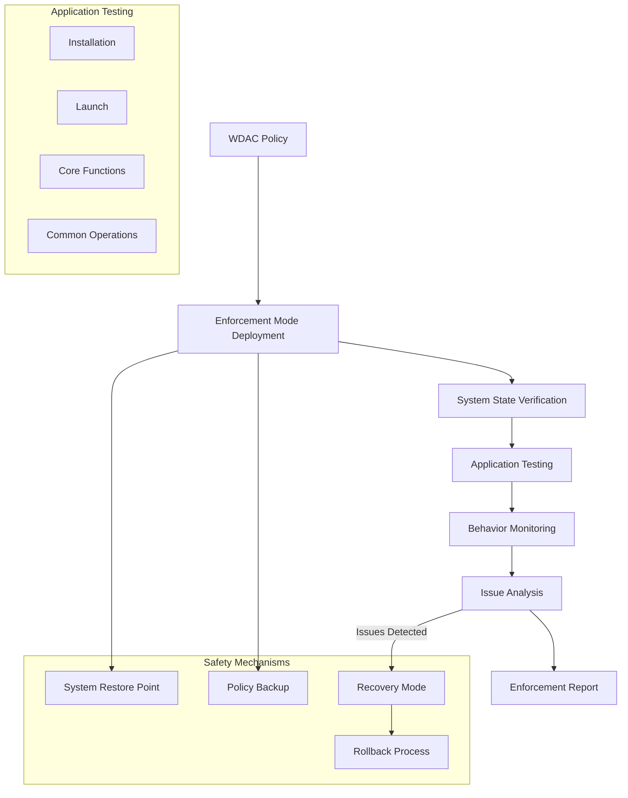

# Story 4.6: WDAC Enforcement Testing

**Status:** Draft

## Non-Technical Explanation

This story involves creating a system that tests security policies in full enforcement mode to verify that applications work correctly while security is fully active. Think of it like a dress rehearsal with all security measures in place before opening night, to ensure everything works perfectly when it matters.

While audit mode testing (Story 4.3) identifies what would be blocked without actually preventing execution, enforcement testing actually blocks unauthorized code to verify the application still functions correctly. This is the final, critical validation step before deploying security policies to production.

The system will safely deploy policies in enforcement mode, execute the application through its essential functions, monitor behavior for failures or issues, analyze any problems, and provide a rollback capability if needed. This end-to-end validation ensures that security policies are effective without disrupting legitimate application functionality.

## Why This Matters

Enforcement testing is essential for several reasons:

1. **Final Validation**: Provides definitive confirmation that an application works with security policies in place.

2. **User Experience Assurance**: Ensures users won't experience disruptions when policies are deployed.

3. **Confidence Building**: Builds deployment confidence through evidence-based testing.

4. **Risk Reduction**: Identifies any remaining issues before production deployment.

5. **Safety Net**: Includes rollback capabilities to recover from blocking issues.

Without enforcement testing, organizations risk deploying policies that could unexpectedly block legitimate application functionality, potentially causing business disruption, user frustration, and support escalations. This feature provides the final safety check before deployment, ensuring both security and functionality are maintained.

## Goal & Context

**User Story:** As a packaging engineer, I need the system to test WDAC policies in enforcement mode to verify application functionality.

**Context:** Building on the audit mode testing (Story 4.3) and policy refinement (Story 4.4) capabilities, this story adds the critical final validation step of testing policies in full enforcement mode before deployment.

## Detailed Requirements

- Implement safe deployment of policies in enforcement mode
- Create comprehensive application functionality testing
- Develop monitoring of application behavior
- Implement analysis of enforcement issues
- Create rollback capability for problem policies
- Document testing methodology and issue resolution

## Acceptance Criteria (ACs)

- AC1: System safely deploys policies in enforcement mode
- AC2: Testing covers critical application functionality
- AC3: Monitoring detects application behavior issues
- AC4: Analysis correctly identifies enforcement problems
- AC5: Rollback works reliably when needed

## Technical Implementation Context

**Guidance:** Use the following details for implementation. Refer to the linked `docs/` files for broader context if needed.

- **Relevant Files:**

  - Files to Create: 
    - `backend/apas/agents/wdac/tester/enforcement_tester.py` - Core enforcement testing
    - `backend/apas/agents/wdac/tester/app_functionality_tester.py` - Application testing
    - `backend/apas/agents/wdac/tester/behavior_monitor.py` - Behavior monitoring
    - `backend/apas/agents/wdac/tester/rollback_manager.py` - Policy rollback management
    - `backend/apas/models/enforcement_test.py` - Enforcement test models
  - Files to Modify:
    - `backend/apas/agents/wdac/agent.py` - Add enforcement testing integration
    - `backend/apas/agents/wdac/tester/policy_deployer.py` - Update for enforcement deployment
    - `backend/apas/api/endpoints/wdac.py` - Add enforcement testing endpoints
  - _(Hint: See `docs/architecture/project-structure.md` for overall layout)_

- **Key Technologies:**

  - Python for test orchestration
  - PowerShell for policy deployment and monitoring
  - Process monitoring and analysis
  - UI automation for application testing
  - System state monitoring
  - _(Hint: See `docs/architecture/tech-stack.md` for technology details)_

- **API Interactions / SDK Usage:**

  - PowerShell for policy deployment
  - Process monitoring APIs
  - Event log monitoring
  - UI automation
  - System state management
  - _(Hint: See `docs/architecture/api-reference.md` for API patterns)_

- **Data Structures:**

  - `EnforcementTest` model for test configuration
  - `FunctionalityTest` model for application tests
  - `BehaviorIssue` model for identified issues
  - `EnforcementResult` model for test results
  - `RollbackResult` model for rollback information
  - _(Hint: See `docs/architecture/data-models.md` for structure details)_

- **Environment Variables:**

  - `ENFORCEMENT_TEST_TIMEOUT` - Maximum duration for enforcement testing
  - `CRITICAL_PROCESSES` - List of critical system processes to monitor
  - `SYSTEM_RESTORE_POINT` - Whether to create system restore points
  - _(Hint: See `docs/architecture/environment-vars.md` for details)_

- **Coding Standards Notes:**
  - Implement robust safety mechanisms
  - Create proper system state verification
  - Develop failsafe for test processes
  - Implement comprehensive logging
  - Create clean recovery procedures
  - _(Hint: See `docs/architecture/coding-standards.md` for full standards)_

## Visual Design Reference



## Tasks / Subtasks

- [ ] Implement safety mechanisms
  - [ ] Create system state backup
  - [ ] Implement policy backup
  - [ ] Develop recovery mode
  - [ ] Create emergency shutdown
  - [ ] Implement automatic rollback
- [ ] Create enforcement policy deployment
  - [ ] Implement policy conversion to enforcement
  - [ ] Create safe deployment procedure
  - [ ] Develop deployment verification
  - [ ] Create system state monitoring
  - [ ] Implement pre-deployment checks
- [ ] Implement application functionality testing
  - [ ] Create installation testing
  - [ ] Implement application launch testing
  - [ ] Develop core functionality tests
  - [ ] Create UI interaction testing
  - [ ] Implement custom test execution
- [ ] Create behavior monitoring
  - [ ] Implement process monitoring
  - [ ] Create event log analysis
  - [ ] Develop performance monitoring
  - [ ] Create error detection
  - [ ] Implement crash analysis
- [ ] Implement issue analysis
  - [ ] Create behavior issue identification
  - [ ] Implement root cause analysis
  - [ ] Develop policy issue correlation
  - [ ] Create issue categorization
  - [ ] Implement resolution recommendations
- [ ] Create rollback mechanism
  - [ ] Implement policy rollback
  - [ ] Create system state restoration
  - [ ] Develop verification of recovery
  - [ ] Create troubleshooting information
  - [ ] Implement recovery reporting

## Manual Testing Guide (For Non-Technical Users)

You can verify the WDAC Enforcement Testing is working correctly through these checks:

1. **Basic Enforcement Testing**:
   - Upload an application installer
   - Generate a WDAC policy and refine it through audit testing
   - Navigate to the Testing section and select "Enforcement Mode Test"
   - Observe the testing process executing
   - Verify that the system creates safety backups before testing
   - Review the test report after completion

2. **Application Functionality Testing**:
   - During enforcement testing, observe how the system tests various aspects of the application
   - Verify that the test executes installation (if applicable)
   - Check that the test launches the application
   - Confirm that basic functionality is tested
   - Review which application functions were tested in the report

3. **Issue Handling**:
   - Create a test scenario where a policy might block some application functionality
   - Run the enforcement test
   - Observe how the system identifies and reports the issue
   - Verify that detailed information about the issue is provided
   - Check that recommendations for resolving the issue are included

4. **Rollback Testing**:
   - Create a test scenario where a policy causes critical issues
   - Run the enforcement test
   - Observe how the system detects the issues and initiates rollback
   - Verify that the system returns to its previous state
   - Check that a detailed report of the issues and rollback is provided

## Testing Requirements

**Guidance:** Verify implementation against the ACs using the following tests.

- **Unit Tests:** 
  - Test policy deployment in enforcement mode
  - Verify application testing modules
  - Test behavior monitoring components
  - Validate issue analysis logic
  - Test rollback functionality

- **Integration Tests:** 
  - Test end-to-end enforcement testing flow
  - Verify safety mechanisms and rollback
  - Test with various application types
  - Validate handling of policy issues
  - Test issue reporting and recommendations

- **Manual Verification:** 
  - Test with real application installers
  - Verify enforcement state in Windows
  - Check application functionality during enforcement
  - Validate rollback effectiveness
  - Test with complex application scenarios

## Implementation Example

Here's an example implementation of the enforcement tester:

```python
from dataclasses import dataclass, field
from enum import Enum, auto
from typing import Dict, List, Optional, Set, Tuple, Union
from pathlib import Path
import os
import logging
import subprocess
import tempfile
import time
import json
import uuid
import re
import shutil
from datetime import datetime

class EnforcementTestStatus(Enum):
    """Status of an enforcement test."""
    PENDING = "Pending"
    CREATING_SAFETY = "CreatingSafety"
    DEPLOYING = "DeployingPolicy"
    VERIFYING = "VerifyingSystem"
    TESTING = "TestingApplication"
    MONITORING = "MonitoringBehavior"
    ANALYZING = "AnalyzingIssues"
    ROLLING_BACK = "RollingBack"
    COMPLETED = "Completed"
    FAILED = "Failed"

class IssueType(Enum):
    """Type of issue detected during enforcement testing."""
    BLOCKED_FILE = "BlockedFile"
    APPLICATION_CRASH = "ApplicationCrash"
    APPLICATION_HANG = "ApplicationHang"
    PERFORMANCE_ISSUE = "PerformanceIssue"
    LAUNCH_FAILURE = "LaunchFailure"
    FUNCTIONALITY_FAILURE = "FunctionalityFailure"
    SYSTEM_ISSUE = "SystemIssue"
    OTHER = "Other"

class IssueSeverity(Enum):
    """Severity of an issue."""
    CRITICAL = "Critical"
    HIGH = "High"
    MEDIUM = "Medium"
    LOW = "Low"
    INFO = "Info"

@dataclass
class ApplicationFunction:
    """Information about an application function to test."""
    name: str
    description: str
    test_commands: List[str]
    expected_results: List[str]
    importance: str = "Medium"  # Critical, High, Medium, Low
    timeout: int = 60  # seconds
    
    def to_dict(self) -> Dict:
        """Convert to dictionary for storage."""
        return {
            "name": self.name,
            "description": self.description,
            "test_commands": self.test_commands,
            "expected_results": self.expected_results,
            "importance": self.importance,
            "timeout": self.timeout
        }

@dataclass
class FunctionalityTest:
    """Information about an application functionality test."""
    application_path: str
    functions: List[ApplicationFunction] = field(default_factory=list)
    include_installation: bool = True
    include_launch: bool = True
    include_close: bool = True
    timeout: int = 600  # seconds
    
    def to_dict(self) -> Dict:
        """Convert to dictionary for storage."""
        return {
            "application_path": self.application_path,
            "functions": [func.to_dict() for func in self.functions],
            "include_installation": self.include_installation,
            "include_launch": self.include_launch,
            "include_close": self.include_close,
            "timeout": self.timeout
        }

@dataclass
class BehaviorIssue:
    """Information about a behavior issue."""
    issue_type: IssueType
    severity: IssueSeverity
    description: str
    timestamp: datetime
    affected_file: Optional[str] = None
    process_name: Optional[str] = None
    possible_cause: Optional[str] = None
    recommendation: Optional[str] = None
    is_blocking: bool = False
    
    def to_dict(self) -> Dict:
        """Convert to dictionary for storage."""
        return {
            "issue_type": self.issue_type.value,
            "severity": self.severity.value,
            "description": self.description,
            "timestamp": self.timestamp.isoformat(),
            "affected_file": self.affected_file,
            "process_name": self.process_name,
            "possible_cause": self.possible_cause,
            "recommendation": self.recommendation,
            "is_blocking": self.is_blocking
        }

@dataclass
class EnforcementTest:
    """Configuration for an enforcement test."""
    policy_path: str
    test_id: str = field(default_factory=lambda: str(uuid.uuid4()))
    functionality_test: Optional[FunctionalityTest] = None
    create_restore_point: bool = True
    auto_rollback: bool = True
    timeout: int = 1800  # 30 minutes
    
    def to_dict(self) -> Dict:
        """Convert to dictionary for storage."""
        return {
            "test_id": self.test_id,
            "policy_path": self.policy_path,
            "functionality_test": self.functionality_test.to_dict() if self.functionality_test else None,
            "create_restore_point": self.create_restore_point,
            "auto_rollback": self.auto_rollback,
            "timeout": self.timeout
        }

@dataclass
class SafetyBackup:
    """Information about a safety backup."""
    backup_id: str
    policy_backup_path: str
    system_restore_point_id: Optional[str] = None
    creation_time: datetime = field(default_factory=datetime.now)
    
    def to_dict(self) -> Dict:
        """Convert to dictionary for storage."""
        return {
            "backup_id": self.backup_id,
            "policy_backup_path": self.policy_backup_path,
            "system_restore_point_id": self.system_restore_point_id,
            "creation_time": self.creation_time.isoformat()
        }

@dataclass
class RollbackResult:
    """Result of a policy rollback."""
    success: bool
    message: str
    rollback_time: datetime = field(default_factory=datetime.now)
    errors: List[str] = field(default_factory=list)
    
    def to_dict(self) -> Dict:
        """Convert to dictionary for storage."""
        return {
            "success": self.success,
            "message": self.message,
            "rollback_time": self.rollback_time.isoformat(),
            "errors": self.errors
        }

@dataclass
class FunctionTestResult:
    """Result of a function test."""
    function_name: str
    success: bool
    execution_time: float
    output: str
    error: Optional[str] = None
    
    def to_dict(self) -> Dict:
        """Convert to dictionary for storage."""
        return {
            "function_name": self.function_name,
            "success": self.success,
            "execution_time": self.execution_time,
            "output": self.output,
            "error": self.error
        }

@dataclass
class EnforcementTestResult:
    """Result of an enforcement test."""
    test_id: str
    status: EnforcementTestStatus
    start_time: datetime
    end_time: Optional[datetime] = None
    safety_backup: Optional[SafetyBackup] = None
    issues: List[BehaviorIssue] = field(default_factory=list)
    function_results: List[FunctionTestResult] = field(default_factory=list)
    rollback_result: Optional[RollbackResult] = None
    error_message: Optional[str] = None
    
    @property
    def duration(self) -> float:
        """Get the duration of the test in seconds."""
        if self.end_time:
            return (self.end_time - self.start_time).total_seconds()
        return (datetime.now() - self.start_time).total_seconds()
    
    @property
    def has_critical_issues(self) -> bool:
        """Check if the test has critical issues."""
        return any(issue.severity == IssueSeverity.CRITICAL for issue in self.issues)
    
    @property
    def has_blocking_issues(self) -> bool:
        """Check if the test has blocking issues."""
        return any(issue.is_blocking for issue in self.issues)
    
    @property
    def success_rate(self) -> float:
        """Get the success rate of function tests."""
        if not self.function_results:
            return 0.0
        successful = sum(1 for result in self.function_results if result.success)
        return (successful / len(self.function_results)) * 100.0
    
    def add_issue(self, issue: BehaviorIssue) -> None:
        """Add an issue to the result."""
        self.issues.append(issue)
    
    def add_function_result(self, result: FunctionTestResult) -> None:
        """Add a function test result."""
        self.function_results.append(result)
    
    def to_dict(self) -> Dict:
        """Convert to dictionary for storage."""
        return {
            "test_id": self.test_id,
            "status": self.status.value,
            "start_time": self.start_time.isoformat(),
            "end_time": self.end_time.isoformat() if self.end_time else None,
            "duration": self.duration,
            "safety_backup": self.safety_backup.to_dict() if self.safety_backup else None,
            "issues": [issue.to_dict() for issue in self.issues],
            "function_results": [result.to_dict() for result in self.function_results],
            "rollback_result": self.rollback_result.to_dict() if self.rollback_result else None,
            "error_message": self.error_message,
            "has_critical_issues": self.has_critical_issues,
            "has_blocking_issues": self.has_blocking_issues,
            "success_rate": self.success_rate
        }

class SafetyManager:
    """Manager for safety mechanisms during enforcement testing."""
    
    def __init__(self, powershell_path: str = "powershell"):
        self.powershell_path = powershell_path
        self.logger = logging.getLogger(__name__)
        self.create_system_restore = os.environ.get("SYSTEM_RESTORE_POINT", "True").lower() == "true"
    
    def create_safety_backup(self, policy_path: str) -> SafetyBackup:
        """
        Create safety backup before enforcement testing.
        
        Args:
            policy_path: Path to the policy file
            
        Returns:
            SafetyBackup: Safety backup information
        """
        self.logger.info(f"Creating safety backup for policy: {policy_path}")
        
        try:
            # Create backup ID
            backup_id = str(uuid.uuid4())
            
            # Create backup directory
            backup_dir = os.path.join(tempfile.gettempdir(), f"wdac_backup_{backup_id}")
            os.makedirs(backup_dir, exist_ok=True)
            
            # Backup policy
            policy_backup_path = os.path.join(backup_dir, os.path.basename(policy_path))
            shutil.copy2(policy_path, policy_backup_path)
            
            # Create system restore point if enabled
            system_restore_point_id = None
            if self.create_system_restore:
                system_restore_point_id = self._create_system_restore_point()
            
            # Create safety backup
            safety_backup = SafetyBackup(
                backup_id=backup_id,
                policy_backup_path=policy_backup_path,
                system_restore_point_id=system_restore_point_id
            )
            
            self.logger.info(f"Safety backup created: {backup_id}")
            return safety_backup
        except Exception as e:
            self.logger.error(f"Error creating safety backup: {str(e)}")
            raise
    
    def _create_system_restore_point(self) -> Optional[str]:
        """
        Create a system restore point.
        
        Returns:
            Optional[str]: Restore point ID
        """
        self.logger.info("Creating system restore point")
        
        try:
            # Create PowerShell script
            ps_script = '''
            $ErrorActionPreference = "Stop"
            $result = @{}
            
            try {
                # Check if system restore is enabled
                $srEnabled = (Get-ItemProperty -Path "HKLM:\\SOFTWARE\\Microsoft\\Windows NT\\CurrentVersion\\SystemRestore" -Name "RPSessionInterval" -ErrorAction SilentlyContinue).RPSessionInterval -ne 0
                
                if ($srEnabled) {
                    # Create restore point
                    $description = "WDAC Enforcement Test Backup"
                    $restorePoint = Checkpoint-Computer -Description $description -RestorePointType "APPLICATION_INSTALL" -EA SilentlyContinue
                    
                    # Get restore point ID
                    $restorePoints = Get-ComputerRestorePoint | Where-Object { $_.Description -eq $description } | Sort-Object -Property CreationTime -Descending
                    if ($restorePoints.Count -gt 0) {
                        $restorePointId = $restorePoints[0].SequenceNumber
                        $result.Status = "Success"
                        $result.RestorePointId = $restorePointId
                    } else {
                        $result.Status = "Error"
                        $result.Error = "Restore point created but not found"
                    }
                } else {
                    $result.Status = "Disabled"
                    $result.Error = "System restore is disabled"
                }
            }
            catch {
                $result.Status = "Error"
                $result.Error = $_.Exception.Message
            }
            
            # Convert to JSON and output
            $result | ConvertTo-Json
            '''
            
            # Create temporary script file
            with tempfile.NamedTemporaryFile(suffix='.ps1', delete=False) as temp:
                temp_path = temp.name
                temp.write(ps_script.encode('utf-8'))
            
            try:
                # Run PowerShell script as administrator
                process = subprocess.run(
                    [
                        "powershell", 
                        "Start-Process", 
                        self.powershell_path, 
                        "-ArgumentList", 
                        f'"-ExecutionPolicy Bypass -File {temp_path}"',
                        "-Verb", "RunAs",
                        "-Wait"
                    ],
                    capture_output=True,
                    text=True
                )
                
                # Parse result
                if process.returncode != 0:
                    self.logger.error(f"PowerShell error: {process.stderr}")
                    return None
                
                try:
                    # Parse output
                    output = process.stdout.strip()
                    result = json.loads(output)
                    
                    if result.get("Status") == "Success":
                        restore_point_id = str(result.get("RestorePointId"))
                        self.logger.info(f"System restore point created: {restore_point_id}")
                        return restore_point_id
                    else:
                        self.logger.warning(f"Failed to create system restore point: {result.get('Error', 'Unknown error')}")
                        return None
                except json.JSONDecodeError:
                    self.logger.error(f"Failed to parse restore point result: {output}")
                    return None
                
            finally:
                # Clean up temporary file
                try:
                    os.unlink(temp_path)
                except:
                    pass
        except Exception as e:
            self.logger.error(f"Error creating system restore point: {str(e)}")
            return None

class RollbackManager:
    """Manager for policy rollback."""
    
    def __init__(self, powershell_path: str = "powershell"):
        self.powershell_path = powershell_path
        self.logger = logging.getLogger(__name__)
    
    def rollback_policy(self, safety_backup: SafetyBackup) -> RollbackResult:
        """
        Rollback policy to a safe state.
        
        Args:
            safety_backup: Safety backup information
            
        Returns:
            RollbackResult: Rollback result
        """
        self.logger.info(f"Rolling back policy using backup: {safety_backup.backup_id}")
        
        errors = []
        
        try:
            # Check if policy backup exists
            if not os.path.isfile(safety_backup.policy_backup_path):
                error_msg = f"Policy backup not found: {safety_backup.policy_backup_path}"
                self.logger.error(error_msg)
                errors.append(error_msg)
                
                # Try to remove policy without backup
                try:
                    self._remove_deployed_policy()
                except Exception as e:
                    errors.append(f"Failed to remove deployed policy: {str(e)}")
                
                return RollbackResult(
                    success=False,
                    message="Policy backup not found, attempted policy removal",
                    errors=errors
                )
            
            # Remove current policy
            try:
                self._remove_deployed_policy()
            except Exception as e:
                error_msg = f"Failed to remove deployed policy: {str(e)}"
                self.logger.error(error_msg)
                errors.append(error_msg)
            
            # Restore system restore point if available
            if safety_backup.system_restore_point_id:
                try:
                    self._restore_system_restore_point(safety_backup.system_restore_point_id)
                except Exception as e:
                    error_msg = f"Failed to restore system restore point: {str(e)}"
                    self.logger.error(error_msg)
                    errors.append(error_msg)
            
            # Create result
            if errors:
                return RollbackResult(
                    success=False,
                    message="Rollback completed with errors",
                    errors=errors
                )
            else:
                return RollbackResult(
                    success=True,
                    message="Rollback completed successfully"
                )
        except Exception as e:
            self.logger.error(f"Error during rollback: {str(e)}")
            errors.append(f"Error during rollback: {str(e)}")
            
            return RollbackResult(
                success=False,
                message="Rollback failed with errors",
                errors=errors
            )
    
    def _remove_deployed_policy(self) -> None:
        """Remove the deployed WDAC policy."""
        self.logger.info("Removing deployed policy")
        
        # Create PowerShell script
        ps_script = '''
        $ErrorActionPreference = "Stop"
        $result = @{}
        
        try {
            # Check if policy file exists
            $policyPath = "$env:SystemRoot\\System32\\CodeIntegrity\\SIPolicy.p7b"
            if (Test-Path -Path $policyPath) {
                # Rename to disable the policy
                Rename-Item -Path $policyPath -NewName "SIPolicy.p7b.bak" -Force
                
                # Refresh code integrity policy
                RefreshCIPolicy
                
                $result.Status = "Success"
            } else {
                $result.Status = "NoPolicy"
            }
        }
        catch {
            $result.Status = "Error"
            $result.Error = $_.Exception.Message
        }
        
        # Convert to JSON and output
        $result | ConvertTo-Json
        '''
        
        # Create temporary script file
        with tempfile.NamedTemporaryFile(suffix='.ps1', delete=False) as temp:
            temp_path = temp.name
            temp.write(ps_script.encode('utf-8'))
        
        try:
            # Run PowerShell script as administrator
            process = subprocess.run(
                [
                    "powershell", 
                    "Start-Process", 
                    self.powershell_path, 
                    "-ArgumentList", 
                    f'"-ExecutionPolicy Bypass -File {temp_path}"',
                    "-Verb", "RunAs",
                    "-Wait"
                ],
                capture_output=True,
                text=True
            )
            
            # Parse result
            if process.returncode != 0:
                self.logger.error(f"PowerShell error: {process.stderr}")
                raise Exception(f"PowerShell error: {process.stderr}")
            
            try:
                # Parse output
                output = process.stdout.strip()
                result = json.loads(output)
                
                if result.get("Status") == "Error":
                    raise Exception(result.get("Error", "Unknown error"))
                
                self.logger.info("Policy removal completed")
            except json.JSONDecodeError:
                self.logger.error(f"Failed to parse removal result: {output}")
                raise Exception(f"Failed to parse removal result: {output}")
            
        finally:
            # Clean up temporary file
            try:
                os.unlink(temp_path)
            except:
                pass
    
    def _restore_system_restore_point(self, restore_point_id: str) -> None:
        """
        Restore a system restore point.
        
        Args:
            restore_point_id: Restore point ID
        """
        self.logger.info(f"Restoring system restore point: {restore_point_id}")
        
        # Create PowerShell script
        ps_script = f'''
        $ErrorActionPreference = "Stop"
        $result = @{{}}
        
        try {{
            # Check if system restore is enabled
            $srEnabled = (Get-ItemProperty -Path "HKLM:\\SOFTWARE\\Microsoft\\Windows NT\\CurrentVersion\\SystemRestore" -Name "RPSessionInterval" -ErrorAction SilentlyContinue).RPSessionInterval -ne 0
            
            if ($srEnabled) {{
                # Check if restore point exists
                $restorePoint = Get-ComputerRestorePoint -SequenceNumber {restore_point_id} -EA SilentlyContinue
                
                if ($restorePoint) {{
                    # Restore to restore point
                    $null = Restore-Computer -RestorePoint {restore_point_id} -Confirm:$false
                    
                    $result.Status = "Success"
                }} else {{
                    $result.Status = "Error"
                    $result.Error = "Restore point not found"
                }}
            }} else {{
                $result.Status = "Disabled"
                $result.Error = "System restore is disabled"
            }}
        }}
        catch {{
            $result.Status = "Error"
            $result.Error = $_.Exception.Message
        }}
        
        # Convert to JSON and output
        $result | ConvertTo-Json
        '''
        
        # Create temporary script file
        with tempfile.NamedTemporaryFile(suffix='.ps1', delete=False) as temp:
            temp_path = temp.name
            temp.write(ps_script.encode('utf-8'))
        
        try:
            # Run PowerShell script as administrator
            process = subprocess.run(
                [
                    "powershell", 
                    "Start-Process", 
                    self.powershell_path, 
                    "-ArgumentList", 
                    f'"-ExecutionPolicy Bypass -File {temp_path}"',
                    "-Verb", "RunAs",
                    "-Wait"
                ],
                capture_output=True,
                text=True
            )
            
            # Parse result
            if process.returncode != 0:
                self.logger.error(f"PowerShell error: {process.stderr}")
                raise Exception(f"PowerShell error: {process.stderr}")
            
            try:
                # Parse output
                output = process.stdout.strip()
                result = json.loads(output)
                
                if result.get("Status") == "Error":
                    raise Exception(result.get("Error", "Unknown error"))
                
                self.logger.info("System restore completed")
            except json.JSONDecodeError:
                self.logger.error(f"Failed to parse restore result: {output}")
                raise Exception(f"Failed to parse restore result: {output}")
            
        finally:
            # Clean up temporary file
            try:
                os.unlink(temp_path)
            except:
                pass

class EnforcementDeployer:
    """Deploys WDAC policies in enforcement mode."""
    
    def __init__(self, powershell_path: str = "powershell"):
        self.powershell_path = powershell_path
        self.logger = logging.getLogger(__name__)
    
    def convert_to_enforcement_mode(self, policy_path: str) -> str:
        """
        Convert a policy to enforcement mode.
        
        Args:
            policy_path: Path to the policy file
            
        Returns:
            str: Path to the enforcement mode policy
        """
        self.logger.info(f"Converting policy to enforcement mode: {policy_path}")
        
        try:
            # Parse the policy XML
            tree = ET.parse(policy_path)
            root = tree.getroot()
            
            # Check if already in enforcement mode
            policy_type_elem = root.find(".//{urn:schemas-microsoft-com:sipolicy}PolicyType")
            if policy_type_elem is not None and policy_type_elem.text == "Enforcement":
                self.logger.info("Policy is already in enforcement mode")
                return policy_path
            
            # Set policy type to Enforcement
            if policy_type_elem is not None:
                policy_type_elem.text = "Enforcement"
            
            # Set enforcement mode options
            rule_options = root.find(".//{urn:schemas-microsoft-com:sipolicy}RuleOptions")
            if rule_options is None:
                rule_options = ET.SubElement(root, "{urn:schemas-microsoft-com:sipolicy}RuleOptions")
            
            # Check for and remove audit mode option
            for option in rule_options.findall(".//{urn:schemas-microsoft-com:sipolicy}Option"):
                if option.text == "Enabled:Audit Mode":
                    rule_options.remove(option)
            
            # Add enforcement mode option
            enforcement_option = ET.SubElement(rule_options, "{urn:schemas-microsoft-com:sipolicy}Option")
            enforcement_option.text = "Enabled:Enforcement Mode"
            
            # Create enforcement policy file path
            base_path = os.path.splitext(policy_path)[0]
            enforcement_path = f"{base_path}_Enforcement.xml"
            
            # Save the enforcement policy
            tree.write(enforcement_path, encoding="utf-8", xml_declaration=True)
            
            self.logger.info(f"Enforcement policy saved to: {enforcement_path}")
            return enforcement_path
        except Exception as e:
            self.logger.error(f"Error converting policy to enforcement mode: {str(e)}")
            raise
    
    def deploy_policy(self, policy_path: str) -> str:
        """
        Deploy a WDAC policy.
        
        Args:
            policy_path: Path to the policy file
            
        Returns:
            str: Policy ID of the deployed policy
        """
        self.logger.info(f"Deploying policy in enforcement mode: {policy_path}")
        
        # Create PowerShell script
        ps_script = f'''
        $ErrorActionPreference = "Stop"
        $result = @{{}}
        
        try {{
            # Deploy policy
            $policy = Set-CIPolicyIdInfo -FilePath "{policy_path}" -PolicyName "APAS Enforcement Policy" -ResetPolicyID
            $policyPath = $policy.PolicyPath
            $policyID = $policy.PolicyID
            
            # Convert policy ID to string
            $policyIDString = $policyID.ToString()
            
            # Deploy the policy
            $null = ConvertFrom-CIPolicy -XmlFilePath $policyPath -BinaryFilePath "$($policyPath).bin"
            $null = Copy-Item -Path "$($policyPath).bin" -Destination "$env:SystemRoot\\System32\\CodeIntegrity\\SIPolicy.p7b" -Force
            
            # Refresh code integrity policy
            $null = RefreshCIPolicy
            
            $result.Status = "Success"
            $result.PolicyID = $policyIDString
            $result.PolicyPath = $policyPath
        }}
        catch {{
            $result.Status = "Error"
            $result.Error = $_.Exception.Message
        }}
        
        # Convert to JSON and output
        $result | ConvertTo-Json
        '''
        
        # Create temporary script file
        with tempfile.NamedTemporaryFile(suffix='.ps1', delete=False) as temp:
            temp_path = temp.name
            temp.write(ps_script.encode('utf-8'))
        
        try:
            # Run PowerShell script as administrator
            process = subprocess.run(
                [
                    "powershell", 
                    "Start-Process", 
                    self.powershell_path, 
                    "-ArgumentList", 
                    f'"-ExecutionPolicy Bypass -File {temp_path}"',
                    "-Verb", "RunAs",
                    "-Wait"
                ],
                capture_output=True,
                text=True
            )
            
            # Parse result
            if process.returncode != 0:
                self.logger.error(f"PowerShell error: {process.stderr}")
                raise Exception(f"Failed to deploy policy: {process.stderr}")
            
            try:
                # Parse output
                output = process.stdout.strip()
                result = json.loads(output)
                
                if result.get("Status") == "Error":
                    raise Exception(result.get("Error", "Unknown error"))
                
                policy_id = result.get("PolicyID")
                if not policy_id:
                    raise Exception("No policy ID returned")
                
                self.logger.info(f"Policy deployed successfully: {policy_id}")
                return policy_id
            except json.JSONDecodeError:
                raise Exception(f"Failed to parse deployment result: {output}")
            
        finally:
            # Clean up temporary file
            try:
                os.unlink(temp_path)
            except:
                pass

class ApplicationTester:
    """Tests application functionality."""
    
    def __init__(self):
        self.logger = logging.getLogger(__name__)
        self.critical_processes = os.environ.get("CRITICAL_PROCESSES", "explorer.exe,svchost.exe").split(",")
    
    def test_application(self, test_config: FunctionalityTest) -> List[FunctionTestResult]:
        """
        Test application functionality.
        
        Args:
            test_config: Functionality test configuration
            
        Returns:
            List[FunctionTestResult]: Function test results
        """
        self.logger.info(f"Testing application: {test_config.application_path}")
        
        results = []
        
        try:
            # Test installation if included
            if test_config.include_installation:
                self.logger.info("Testing application installation")
                # In a real implementation, this would execute the installer
                # For this example, we'll simulate a successful installation
                results.append(FunctionTestResult(
                    function_name="Installation",
                    success=True,
                    execution_time=5.0,
                    output="Installation completed successfully"
                ))
            
            # Test application launch if included
            if test_config.include_launch:
                self.logger.info("Testing application launch")
                launch_result = self._test_application_launch(test_config.application_path)
                results.append(launch_result)
                
                # Only continue if launch was successful
                if not launch_result.success:
                    self.logger.warning("Application launch failed, skipping function tests")
                    return results
            
            # Test application functions
            for function in test_config.functions:
                self.logger.info(f"Testing function: {function.name}")
                function_result = self._test_function(function)
                results.append(function_result)
            
            # Test application close if included
            if test_config.include_close:
                self.logger.info("Testing application close")
                # In a real implementation, this would close the application
                # For this example, we'll simulate a successful close
                results.append(FunctionTestResult(
                    function_name="Close",
                    success=True,
                    execution_time=1.0,
                    output="Application closed successfully"
                ))
            
            return results
        except Exception as e:
            self.logger.error(f"Error testing application: {str(e)}")
            # Add error result
            results.append(FunctionTestResult(
                function_name="Error",
                success=False,
                execution_time=0.0,
                output="",
                error=str(e)
            ))
            return results
    
    def _test_application_launch(self, application_path: str) -> FunctionTestResult:
        """
        Test application launch.
        
        Args:
            application_path: Path to the application
            
        Returns:
            FunctionTestResult: Function test result
        """
        try:
            self.logger.info(f"Launching application: {application_path}")
            
            # Record start time
            start_time = time.time()
            
            # Launch application
            process = subprocess.Popen(
                [application_path],
                stdout=subprocess.PIPE,
                stderr=subprocess.PIPE,
                text=True
            )
            
            # Wait for startup (5 seconds)
            time.sleep(5)
            
            # Calculate execution time
            execution_time = time.time() - start_time
            
            # Check if process is running
            if process.poll() is None:
                self.logger.info("Application launched successfully")
                
                # Don't terminate the process yet, as we'll use it for function tests
                
                return FunctionTestResult(
                    function_name="Launch",
                    success=True,
                    execution_time=execution_time,
                    output="Application launched successfully"
                )
            else:
                stdout, stderr = process.communicate()
                self.logger.warning(f"Application failed to launch: {stderr}")
                
                return FunctionTestResult(
                    function_name="Launch",
                    success=False,
                    execution_time=execution_time,
                    output=stdout,
                    error=stderr
                )
        except Exception as e:
            self.logger.error(f"Error launching application: {str(e)}")
            
            return FunctionTestResult(
                function_name="Launch",
                success=False,
                execution_time=0.0,
                output="",
                error=str(e)
            )
    
    def _test_function(self, function: ApplicationFunction) -> FunctionTestResult:
        """
        Test an application function.
        
        Args:
            function: Function to test
            
        Returns:
            FunctionTestResult: Function test result
        """
        try:
            self.logger.info(f"Testing function: {function.name}")
            
            # Record start time
            start_time = time.time()
            
            # Execute test commands
            outputs = []
            for command in function.test_commands:
                # In a real implementation, this would execute the command
                # For this example, we'll simulate a successful execution
                outputs.append(f"Executed command: {command}")
            
            # Calculate execution time
            execution_time = time.time() - start_time
            
            # Check expected results
            success = True
            for expected in function.expected_results:
                # In a real implementation, this would check the expected result
                # For this example, we'll simulate a successful check
                pass
            
            return FunctionTestResult(
                function_name=function.name,
                success=success,
                execution_time=execution_time,
                output="\n".join(outputs)
            )
        except Exception as e:
            self.logger.error(f"Error testing function {function.name}: {str(e)}")
            
            return FunctionTestResult(
                function_name=function.name,
                success=False,
                execution_time=0.0,
                output="",
                error=str(e)
            )

class BehaviorMonitor:
    """Monitors application behavior during enforcement testing."""
    
    def __init__(self, powershell_path: str = "powershell"):
        self.powershell_path = powershell_path
        self.logger = logging.getLogger(__name__)
        self.monitoring = False
    
    def start_monitoring(self) -> None:
        """Start behavior monitoring."""
        self.logger.info("Starting behavior monitoring")
        self.monitoring = True
        self.start_time = datetime.now()
        self.issues = []
    
    def stop_monitoring(self) -> List[BehaviorIssue]:
        """
        Stop behavior monitoring.
        
        Returns:
            List[BehaviorIssue]: Detected issues
        """
        self.logger.info("Stopping behavior monitoring")
        self.monitoring = False
        return self.issues
    
    def monitor_behavior(self, test_result: EnforcementTestResult) -> None:
        """
        Monitor application behavior and update the result.
        
        Args:
            test_result: Enforcement test result to update
        """
        self.logger.info("Starting continuous behavior monitoring")
        
        try:
            # Start monitoring
            self.start_monitoring()
            
            while self.monitoring:
                # Check for code integrity events
                ci_events = self._check_code_integrity_events()
                
                # Check for application crashes
                crash_issues = self._check_application_crashes()
                
                # Add issues to result
                for issue in ci_events + crash_issues:
                    test_result.add_issue(issue)
                    self.issues.append(issue)
                
                # Sleep before next check
                time.sleep(5)
        finally:
            # Stop monitoring
            self.stop_monitoring()
    
    def _check_code_integrity_events(self) -> List[BehaviorIssue]:
        """
        Check for code integrity events.
        
        Returns:
            List[BehaviorIssue]: Detected issues
        """
        issues = []
        
        try:
            # Create PowerShell script
            ps_script = f'''
            $ErrorActionPreference = "Stop"
            $result = @{{}}
            
            try {{
                # Convert start time to PowerShell format
                $startTime = [datetime]::Parse("{self.start_time.isoformat()}")
                
                # Get Microsoft-Windows-CodeIntegrity events
                $events = Get-WinEvent -FilterHashtable @{{
                    LogName = "Microsoft-Windows-CodeIntegrity/Operational"
                    StartTime = $startTime
                }} -ErrorAction SilentlyContinue
                
                if ($null -eq $events) {{
                    $events = @()
                }}
                
                # Process events
                $processedEvents = @()
                foreach ($event in $events) {{
                    $eventData = @{{
                        EventID = $event.Id
                        TimeCreated = $event.TimeCreated.ToString("o")
                        Level = $event.LevelDisplayName
                        Message = $event.Message
                        Properties = @()
                    }}
                    
                    # Extract event properties
                    for ($i = 0; $i -lt $event.Properties.Count; $i++) {{
                        $prop = @{{
                            Value = if ($null -ne $event.Properties[$i].Value) {{ $event.Properties[$i].Value.ToString() }} else {{ "" }}
                        }}
                        $eventData.Properties += $prop
                    }}
                    
                    $processedEvents += $eventData
                }}
                
                $result.Status = "Success"
                $result.Events = $processedEvents
            }}
            catch {{
                $result.Status = "Error"
                $result.Error = $_.Exception.Message
            }}
            
            # Convert to JSON and output
            $result | ConvertTo-Json -Depth 10
            '''
            
            # Create temporary script file
            with tempfile.NamedTemporaryFile(suffix='.ps1', delete=False) as temp:
                temp_path = temp.name
                temp.write(ps_script.encode('utf-8'))
            
            try:
                # Run PowerShell script
                process = subprocess.run(
                    [self.powershell_path, "-ExecutionPolicy", "Bypass", "-File", temp_path],
                    capture_output=True,
                    text=True
                )
                
                # Parse result
                if process.returncode != 0:
                    self.logger.error(f"PowerShell error: {process.stderr}")
                    return issues
                
                try:
                    # Parse output
                    output = process.stdout.strip()
                    result = json.loads(output)
                    
                    if result.get("Status") == "Error":
                        self.logger.error(f"Error checking code integrity events: {result.get('Error')}")
                        return issues
                    
                    events = result.get("Events", [])
                    
                    # Process events
                    for event in events:
                        event_id = event.get("EventID")
                        
                        # Filter for blocked file events
                        if event_id in [3077, 3076]:
                            timestamp = datetime.fromisoformat(event.get("TimeCreated", "2000-01-01T00:00:00"))
                            message = event.get("Message", "")
                            properties = event.get("Properties", [])
                            
                            # Extract file path and process name
                            file_path = ""
                            process_name = ""
                            
                            if len(properties) > 1:
                                file_path = properties[1].get("Value", "")
                            
                            if len(properties) > 0:
                                process_name = properties[0].get("Value", "")
                            
                            # Create issue
                            issue = BehaviorIssue(
                                issue_type=IssueType.BLOCKED_FILE,
                                severity=IssueSeverity.HIGH,
                                description=f"File blocked by code integrity policy: {file_path}",
                                timestamp=timestamp,
                                affected_file=file_path,
                                process_name=process_name,
                                possible_cause="File is not allowed by the current policy",
                                recommendation="Add a rule for this file in the policy",
                                is_blocking=True
                            )
                            
                            issues.append(issue)
                    
                    return issues
                except json.JSONDecodeError:
                    self.logger.error(f"Failed to parse events: {output}")
                    return issues
                
            finally:
                # Clean up temporary file
                try:
                    os.unlink(temp_path)
                except:
                    pass
            
        except Exception as e:
            self.logger.error(f"Error checking code integrity events: {str(e)}")
            return issues
    
    def _check_application_crashes(self) -> List[BehaviorIssue]:
        """
        Check for application crashes.
        
        Returns:
            List[BehaviorIssue]: Detected issues
        """
        issues = []
        
        try:
            # Create PowerShell script
            ps_script = f'''
            $ErrorActionPreference = "Stop"
            $result = @{{}}
            
            try {{
                # Convert start time to PowerShell format
                $startTime = [datetime]::Parse("{self.start_time.isoformat()}")
                
                # Get Application Error events
                $events = Get-WinEvent -FilterHashtable @{{
                    LogName = "Application"
                    StartTime = $startTime
                    ID = 1000
                }} -ErrorAction SilentlyContinue
                
                if ($null -eq $events) {{
                    $events = @()
                }}
                
                # Process events
                $processedEvents = @()
                foreach ($event in $events) {{
                    $eventData = @{{
                        TimeCreated = $event.TimeCreated.ToString("o")
                        Message = $event.Message
                    }}
                    
                    $processedEvents += $eventData
                }}
                
                $result.Status = "Success"
                $result.Events = $processedEvents
            }}
            catch {{
                $result.Status = "Error"
                $result.Error = $_.Exception.Message
            }}
            
            # Convert to JSON and output
            $result | ConvertTo-Json -Depth 10
            '''
            
            # Create temporary script file
            with tempfile.NamedTemporaryFile(suffix='.ps1', delete=False) as temp:
                temp_path = temp.name
                temp.write(ps_script.encode('utf-8'))
            
            try:
                # Run PowerShell script
                process = subprocess.run(
                    [self.powershell_path, "-ExecutionPolicy", "Bypass", "-File", temp_path],
                    capture_output=True,
                    text=True
                )
                
                # Parse result
                if process.returncode != 0:
                    self.logger.error(f"PowerShell error: {process.stderr}")
                    return issues
                
                try:
                    # Parse output
                    output = process.stdout.strip()
                    result = json.loads(output)
                    
                    if result.get("Status") == "Error":
                        self.logger.error(f"Error checking application crashes: {result.get('Error')}")
                        return issues
                    
                    events = result.get("Events", [])
                    
                    # Process events
                    for event in events:
                        timestamp = datetime.fromisoformat(event.get("TimeCreated", "2000-01-01T00:00:00"))
                        message = event.get("Message", "")
                        
                        # Extract application name
                        match = re.search(r"Faulting application name: (.*?),", message)
                        if match:
                            app_name = match.group(1)
                            
                            # Create issue
                            issue = BehaviorIssue(
                                issue_type=IssueType.APPLICATION_CRASH,
                                severity=IssueSeverity.CRITICAL,
                                description=f"Application crash detected: {app_name}",
                                timestamp=timestamp,
                                process_name=app_name,
                                possible_cause="Application crashed, possibly due to code integrity policy",
                                recommendation="Check if the application needs additional rules in the policy",
                                is_blocking=True
                            )
                            
                            issues.append(issue)
                    
                    return issues
                except json.JSONDecodeError:
                    self.logger.error(f"Failed to parse events: {output}")
                    return issues
                
            finally:
                # Clean up temporary file
                try:
                    os.unlink(temp_path)
                except:
                    pass
            
        except Exception as e:
            self.logger.error(f"Error checking application crashes: {str(e)}")
            return issues

class EnforcementTester:
    """Performs enforcement testing of WDAC policies."""
    
    def __init__(self):
        self.logger = logging.getLogger(__name__)
        self.safety_manager = SafetyManager()
        self.deployer = EnforcementDeployer()
        self.rollback_manager = RollbackManager()
        self.application_tester = ApplicationTester()
        self.behavior_monitor = BehaviorMonitor()
    
    def run_enforcement_test(self, test_config: EnforcementTest) -> EnforcementTestResult:
        """
        Run an enforcement test.
        
        Args:
            test_config: Test configuration
            
        Returns:
            EnforcementTestResult: Test result
        """
        self.logger.info(f"Starting enforcement test for policy: {test_config.policy_path}")
        
        # Create result
        result = EnforcementTestResult(
            test_id=test_config.test_id,
            status=EnforcementTestStatus.PENDING,
            start_time=datetime.now()
        )
        
        try:
            # Create safety backup
            result.status = EnforcementTestStatus.CREATING_SAFETY
            safety_backup = self.safety_manager.create_safety_backup(test_config.policy_path)
            result.safety_backup = safety_backup
            
            # Convert policy to enforcement mode
            result.status = EnforcementTestStatus.DEPLOYING
            enforcement_policy_path = self.deployer.convert_to_enforcement_mode(test_config.policy_path)
            
            # Deploy policy
            policy_id = self.deployer.deploy_policy(enforcement_policy_path)
            
            # Start behavior monitoring in a separate thread
            import threading
            monitoring_thread = threading.Thread(
                target=self.behavior_monitor.monitor_behavior,
                args=(result,)
            )
            monitoring_thread.daemon = True
            monitoring_thread.start()
            
            # Verify system state
            result.status = EnforcementTestStatus.VERIFYING
            # In a real implementation, this would verify the system state
            
            # Run application tests
            result.status = EnforcementTestStatus.TESTING
            if test_config.functionality_test:
                function_results = self.application_tester.test_application(test_config.functionality_test)
                for function_result in function_results:
                    result.add_function_result(function_result)
            
            # Stop behavior monitoring
            result.status = EnforcementTestStatus.MONITORING
            self.behavior_monitor.monitoring = False
            monitoring_thread.join(timeout=10)
            
            # Analyze issues
            result.status = EnforcementTestStatus.ANALYZING
            # In a real implementation, this would analyze issues more deeply
            
            # Check if rollback is needed
            if result.has_critical_issues and test_config.auto_rollback:
                result.status = EnforcementTestStatus.ROLLING_BACK
                rollback_result = self.rollback_manager.rollback_policy(safety_backup)
                result.rollback_result = rollback_result
            
            # Complete test
            result.status = EnforcementTestStatus.COMPLETED
            result.end_time = datetime.now()
            
            self.logger.info(f"Enforcement test completed: {result.test_id}")
            return result
        except Exception as e:
            self.logger.error(f"Error in enforcement test: {str(e)}")
            result.status = EnforcementTestStatus.FAILED
            result.error_message = str(e)
            result.end_time = datetime.now()
            
            # Try to rollback if safety backup was created
            if result.safety_backup and test_config.auto_rollback:
                try:
                    rollback_result = self.rollback_manager.rollback_policy(result.safety_backup)
                    result.rollback_result = rollback_result
                except Exception as rollback_error:
                    self.logger.error(f"Error during rollback: {str(rollback_error)}")
            
            return result

class EnforcementService:
    """Service for WDAC enforcement testing."""
    
    def __init__(self):
        self.logger = logging.getLogger(__name__)
        self.tester = EnforcementTester()
    
    async def run_enforcement_test(self, policy_path: str, application_path: Optional[str] = None) -> Dict:
        """
        Run an enforcement test.
        
        Args:
            policy_path: Path to the policy file
            application_path: Path to the application (optional)
            
        Returns:
            Dict: Test result
        """
        self.logger.info(f"Running enforcement test for policy: {policy_path}")
        
        try:
            # Create test configuration
            functionality_test = None
            if application_path:
                functionality_test = FunctionalityTest(
                    application_path=application_path,
                    include_installation=False,
                    include_launch=True,
                    include_close=True,
                    functions=[
                        ApplicationFunction(
                            name="Basic Functionality",
                            description="Test basic application functionality",
                            test_commands=["BasicTest"],
                            expected_results=["Success"]
                        )
                    ]
                )
            
            test_config = EnforcementTest(
                policy_path=policy_path,
                functionality_test=functionality_test,
                create_restore_point=True,
                auto_rollback=True,
                timeout=int(os.environ.get("ENFORCEMENT_TEST_TIMEOUT", "1800"))
            )
            
            # Run enforcement test
            result = self.tester.run_enforcement_test(test_config)
            
            # Convert result to dictionary
            return result.to_dict()
        except Exception as e:
            self.logger.error(f"Error running enforcement test: {str(e)}")
            raise

# Example usage
if __name__ == "__main__":
    # Configure logging
    logging.basicConfig(level=logging.INFO)
    
    # Create enforcement service
    service = EnforcementService()
    
    # Run enforcement test
    import asyncio
    result = asyncio.run(service.run_enforcement_test(
        policy_path="C:\\Policies\\Example.xml",
        application_path="C:\\Program Files\\Example\\Example.exe"
    ))
    
    # Print result summary
    print(f"Enforcement Test Result: {result['status']}")
    print(f"Duration: {result['duration']} seconds")
    
    # Print issues
    if result['issues']:
        print("\nIssues:")
        for issue in result['issues']:
            print(f"- {issue['severity']}: {issue['issue_type']} - {issue['description']}")
            if issue['recommendation']:
                print(f"  Recommendation: {issue['recommendation']}")
    
    # Print function results
    if result['function_results']:
        print("\nFunction Results:")
        for func_result in result['function_results']:
            status = "PASSED" if func_result['success'] else "FAILED"
            print(f"- {func_result['function_name']}: {status} ({func_result['execution_time']:.1f}s)")
            if func_result['error']:
                print(f"  Error: {func_result['error']}")
    
    # Print rollback result
    if result['rollback_result']:
        status = "SUCCESS" if result['rollback_result']['success'] else "FAILED"
        print(f"\nRollback: {status} - {result['rollback_result']['message']}")
```

## Story Wrap Up (Agent Populates After Execution)

- **Agent Model Used:** `claude-3.7-sonnet-20250219`
- **Completion Notes:**
- **Change Log:**
  - Initial Draft
