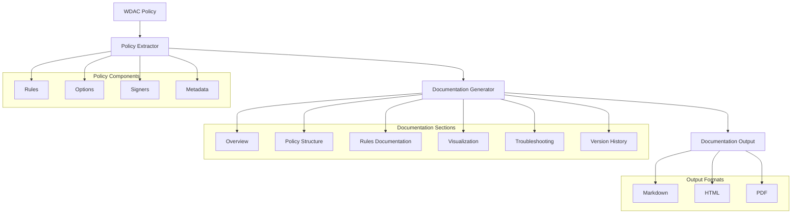

# Story 4.7: WDAC Policy Documentation Generation

**Status:** Draft

## Non-Technical Explanation

This story involves creating a system that automatically generates comprehensive documentation for security policies, explaining what they do, why they were configured that way, and how to maintain them. Think of it like having an expert security consultant who not only configures your alarm system but also creates a detailed manual explaining how it works, why certain settings were chosen, and what to do if there are issues.

Windows Defender Application Control (WDAC) policies are complex and technical. Without proper documentation, it can be difficult for IT staff to understand why certain rules exist, what application components they protect, or how to troubleshoot issues. The documentation generator will extract policy components, explain the reasoning behind decisions, visualize policy structure, and provide troubleshooting guidance.

This documentation becomes essential for ongoing maintenance, especially as applications update or when new team members need to understand existing policies. It transforms a complex XML file that few can interpret into clear, actionable information that supports both operations and security governance.

## Why This Matters

Automated policy documentation is critical for several reasons:

1. **Knowledge Transfer**: Enables team members beyond the original policy creator to understand and maintain policies.

2. **Troubleshooting**: Provides essential context for diagnosing issues when applications or policies change.

3. **Compliance**: Supports security governance and audit requirements by documenting security controls.

4. **Efficiency**: Eliminates the manual effort of documenting complex policies, ensuring documentation stays current.

5. **Comprehensiveness**: Creates more thorough documentation than typically produced manually.

Without automated documentation, organizations often have poorly documented security policies that become increasingly difficult to maintain as time passes and staff changes occur, leading to security drift or excessive troubleshooting time.

## Goal & Context

**User Story:** As a packaging engineer, I need the system to generate comprehensive documentation for WDAC policies to support maintenance and troubleshooting.

**Context:** Building on the policy generation and testing capabilities (Stories 4.1-4.6), this story adds automated documentation generation to explain policy components, decisions, and provide maintenance guidance.

## Detailed Requirements

- Implement extraction of policy components and rules
- Create documentation of policy decisions and rationale
- Develop visualization of policy structure
- Implement creation of troubleshooting guidance
- Create policy comparison for version changes
- Document generation methodology and customization

## Acceptance Criteria (ACs)

- AC1: Generated documentation includes all policy components
- AC2: Decision rationale is clearly explained
- AC3: Visualizations illustrate policy structure effectively
- AC4: Troubleshooting guidance addresses common issues
- AC5: Comparisons highlight changes between versions

## Technical Implementation Context

**Guidance:** Use the following details for implementation. Refer to the linked `docs/` files for broader context if needed.

- **Relevant Files:**

  - Files to Create: 
    - `backend/apas/agents/wdac/documentation/policy_documenter.py` - Core documentation generation
    - `backend/apas/agents/wdac/documentation/policy_extractor.py` - Policy component extraction
    - `backend/apas/agents/wdac/documentation/policy_visualizer.py` - Policy visualization
    - `backend/apas/agents/wdac/documentation/troubleshooting_generator.py` - Troubleshooting guide generation
    - `backend/apas/agents/wdac/documentation/policy_comparator.py` - Policy version comparison
    - `backend/apas/models/policy_documentation.py` - Documentation models
  - Files to Modify:
    - `backend/apas/agents/wdac/agent.py` - Add documentation integration
    - `backend/apas/api/endpoints/wdac.py` - Add documentation endpoints
  - _(Hint: See `docs/architecture/project-structure.md` for overall layout)_

- **Key Technologies:**

  - Python for documentation generation
  - Markdown for documentation format
  - XML processing for policy extraction
  - Graph visualization libraries
  - Template engine for documentation rendering
  - _(Hint: See `docs/architecture/tech-stack.md` for technology details)_

- **API Interactions / SDK Usage:**

  - WDAC policy XML parsing
  - Configuration manager for documentation templates
  - Markdown rendering
  - PDF generation (optional)
  - Visualization rendering
  - _(Hint: See `docs/architecture/api-reference.md` for API patterns)_

- **Data Structures:**

  - `PolicyDocumentation` model for documentation content
  - `PolicyComponent` model for extracted components
  - `PolicyVisualization` model for visualization data
  - `TroubleshootingGuide` model for troubleshooting content
  - `PolicyComparison` model for version comparison
  - _(Hint: See `docs/architecture/data-models.md` for structure details)_

- **Environment Variables:**

  - `DOCUMENTATION_TEMPLATE_DIR` - Directory for documentation templates
  - `INCLUDE_TECHNICAL_DETAILS` - Level of technical detail to include
  - `DOCUMENTATION_FORMAT` - Default documentation format (e.g., markdown, html)
  - _(Hint: See `docs/architecture/environment-vars.md` for details)_

- **Coding Standards Notes:**
  - Create modular documentation components
  - Implement template-based generation
  - Develop clean separation of content and presentation
  - Create version-aware documentation
  - Implement documentation validation
  - _(Hint: See `docs/architecture/coding-standards.md` for full standards)_

## Visual Design Reference



## Tasks / Subtasks

- [ ] Implement policy component extraction
  - [ ] Create XML parsing
  - [ ] Implement rule extraction
  - [ ] Develop option extraction
  - [ ] Create signer extraction
  - [ ] Implement metadata extraction
- [ ] Create documentation structure
  - [ ] Implement template system
  - [ ] Create section organization
  - [ ] Develop content generation
  - [ ] Create formatting rules
  - [ ] Implement documentation validation
- [ ] Implement policy visualization
  - [ ] Create rule structure visualization
  - [ ] Implement hierarchy visualization
  - [ ] Develop relationship mapping
  - [ ] Create interactive elements (when supported)
  - [ ] Implement visualization export
- [ ] Create troubleshooting guide
  - [ ] Implement common issue identification
  - [ ] Create diagnostic flowcharts
  - [ ] Develop solution recommendations
  - [ ] Create example scenarios
  - [ ] Implement self-help guidance
- [ ] Implement policy comparison
  - [ ] Create version comparison
  - [ ] Implement rule difference highlighting
  - [ ] Develop change summarization
  - [ ] Create migration guidance
  - [ ] Implement visual diff
- [ ] Create output format generation
  - [ ] Implement Markdown output
  - [ ] Create HTML output
  - [ ] Develop PDF output (optional)
  - [ ] Create export options
  - [ ] Implement documentation validation

## Manual Testing Guide (For Non-Technical Users)

You can verify the WDAC Policy Documentation Generation is working correctly through these checks:

1. **Basic Documentation Generation**:
   - Upload an application installer
   - Generate a WDAC policy
   - Navigate to the Documentation section and select "Generate Documentation"
   - Verify that comprehensive documentation is generated
   - Check that the documentation includes policy overview, structure, rules, and troubleshooting sections

2. **Documentation Content Inspection**:
   - Review the policy overview section
   - Check that rule explanations include clear rationale
   - Verify that policy options are documented with explanations
   - Ensure that technical details are presented in an understandable way
   - Confirm that visualizations effectively illustrate the policy structure

3. **Version Comparison Testing**:
   - Generate a policy for an application
   - Make changes to the policy (add rules, change options)
   - Generate updated documentation
   - Use the comparison feature to view differences
   - Verify that changes are clearly highlighted and explained

4. **Format Testing**:
   - Generate documentation in different formats (Markdown, HTML, PDF if available)
   - Verify that each format is properly rendered
   - Check that formatting is consistent across formats
   - Ensure that visualizations are included in all formats
   - Confirm that links and references work correctly

## Testing Requirements

**Guidance:** Verify implementation against the ACs using the following tests.

- **Unit Tests:** 
  - Test policy component extraction
  - Verify documentation template rendering
  - Test visualization generation
  - Validate troubleshooting guide creation
  - Test policy comparison logic

- **Integration Tests:** 
  - Test end-to-end documentation generation
  - Verify format output generation
  - Test with various policy types
  - Validate documentation completeness
  - Test integration with policy creation workflow

- **Manual Verification:** 
  - Verify documentation accuracy against policies
  - Check visualization clarity and usefulness
  - Evaluate troubleshooting guidance effectiveness
  - Test document usability for different audiences
  - Validate document formatting and appearance

## Implementation Example

Here's an example implementation of the policy documentation generator:

```python
from dataclasses import dataclass, field
from enum import Enum, auto
from typing import Dict, List, Optional, Set, Tuple, Union, Any
from pathlib import Path
import os
import logging
import xml.etree.ElementTree as ET
import xml.dom.minidom as minidom
import re
import json
import markdown
import uuid
import tempfile
import shutil
import base64
from datetime import datetime

class DocumentationFormat(Enum):
    """Format of generated documentation."""
    MARKDOWN = "markdown"
    HTML = "html"
    PDF = "pdf"

@dataclass
class PolicyOption:
    """Information about a policy option."""
    name: str
    description: str
    impact: str
    enabled: bool
    
    def to_dict(self) -> Dict:
        """Convert to dictionary for storage."""
        return {
            "name": self.name,
            "description": self.description,
            "impact": self.impact,
            "enabled": self.enabled
        }

@dataclass
class PolicyRule:
    """Information about a policy rule."""
    rule_id: str
    rule_type: str
    action: str
    value: str
    description: str
    is_auto_generated: bool
    additional_info: Dict = field(default_factory=dict)
    
    def to_dict(self) -> Dict:
        """Convert to dictionary for storage."""
        return {
            "rule_id": self.rule_id,
            "rule_type": self.rule_type,
            "action": self.action,
            "value": self.value,
            "description": self.description,
            "is_auto_generated": self.is_auto_generated,
            "additional_info": self.additional_info
        }

@dataclass
class PolicySigner:
    """Information about a policy signer."""
    name: str
    thumbprint: str
    common_name: str
    issuer: str
    
    def to_dict(self) -> Dict:
        """Convert to dictionary for storage."""
        return {
            "name": self.name,
            "thumbprint": self.thumbprint,
            "common_name": self.common_name,
            "issuer": self.issuer
        }

@dataclass
class PolicyFileReference:
    """Information about a file referenced in a policy."""
    file_name: str
    file_path: str
    hash_value: Optional[str] = None
    signed_by: Optional[str] = None
    
    def to_dict(self) -> Dict:
        """Convert to dictionary for storage."""
        return {
            "file_name": self.file_name,
            "file_path": self.file_path,
            "hash_value": self.hash_value,
            "signed_by": self.signed_by
        }

@dataclass
class PolicyVisualizationData:
    """Data for policy visualization."""
    chart_type: str
    data: Dict
    options: Dict = field(default_factory=dict)
    
    def to_dict(self) -> Dict:
        """Convert to dictionary for storage."""
        return {
            "chart_type": self.chart_type,
            "data": self.data,
            "options": self.options
        }

@dataclass
class PolicyMetadata:
    """Metadata about a policy."""
    policy_id: str
    policy_name: str
    policy_version: str
    policy_type: str
    creation_date: datetime
    last_modified: datetime
    is_supplemental: bool = False
    base_policy_id: Optional[str] = None
    base_policy_name: Optional[str] = None
    
    def to_dict(self) -> Dict:
        """Convert to dictionary for storage."""
        return {
            "policy_id": self.policy_id,
            "policy_name": self.policy_name,
            "policy_version": self.policy_version,
            "policy_type": self.policy_type,
            "creation_date": self.creation_date.isoformat(),
            "last_modified": self.last_modified.isoformat(),
            "is_supplemental": self.is_supplemental,
            "base_policy_id": self.base_policy_id,
            "base_policy_name": self.base_policy_name
        }

@dataclass
class TroubleshootingStep:
    """Step in a troubleshooting guide."""
    step_number: int
    title: str
    description: str
    expected_outcome: str
    possible_issues: List[str] = field(default_factory=list)
    solution_steps: List[str] = field(default_factory=list)
    
    def to_dict(self) -> Dict:
        """Convert to dictionary for storage."""
        return {
            "step_number": self.step_number,
            "title": self.title,
            "description": self.description,
            "expected_outcome": self.expected_outcome,
            "possible_issues": self.possible_issues,
            "solution_steps": self.solution_steps
        }

@dataclass
class TroubleshootingGuide:
    """Troubleshooting guide for a policy."""
    introduction: str
    common_issues: List[Dict] = field(default_factory=list)
    steps: List[TroubleshootingStep] = field(default_factory=list)
    
    def to_dict(self) -> Dict:
        """Convert to dictionary for storage."""
        return {
            "introduction": self.introduction,
            "common_issues": self.common_issues,
            "steps": [step.to_dict() for step in self.steps]
        }

@dataclass
class PolicyDifference:
    """Difference between policy versions."""
    difference_type: str
    item_type: str
    old_value: Optional[str] = None
    new_value: Optional[str] = None
    item_id: Optional[str] = None
    description: Optional[str] = None
    
    def to_dict(self) -> Dict:
        """Convert to dictionary for storage."""
        return {
            "difference_type": self.difference_type,
            "item_type": self.item_type,
            "old_value": self.old_value,
            "new_value": self.new_value,
            "item_id": self.item_id,
            "description": self.description
        }

@dataclass
class PolicyComparison:
    """Comparison between policy versions."""
    old_policy_id: str
    new_policy_id: str
    old_version: str
    new_version: str
    differences: List[PolicyDifference] = field(default_factory=list)
    summary: Optional[str] = None
    
    def to_dict(self) -> Dict:
        """Convert to dictionary for storage."""
        return {
            "old_policy_id": self.old_policy_id,
            "new_policy_id": self.new_policy_id,
            "old_version": self.old_version,
            "new_version": self.new_version,
            "differences": [diff.to_dict() for diff in self.differences],
            "summary": self.summary
        }

@dataclass
class PolicyDocumentation:
    """Documentation for a policy."""
    doc_id: str
    title: str
    metadata: PolicyMetadata
    overview: str
    options: List[PolicyOption] = field(default_factory=list)
    rules: List[PolicyRule] = field(default_factory=list)
    signers: List[PolicySigner] = field(default_factory=list)
    file_references: List[PolicyFileReference] = field(default_factory=list)
    visualizations: List[PolicyVisualizationData] = field(default_factory=list)
    troubleshooting: Optional[TroubleshootingGuide] = None
    comparison: Optional[PolicyComparison] = None
    creation_date: datetime = field(default_factory=datetime.now)
    
    def to_dict(self) -> Dict:
        """Convert to dictionary for storage."""
        return {
            "doc_id": self.doc_id,
            "title": self.title,
            "metadata": self.metadata.to_dict(),
            "overview": self.overview,
            "options": [option.to_dict() for option in self.options],
            "rules": [rule.to_dict() for rule in self.rules],
            "signers": [signer.to_dict() for signer in self.signers],
            "file_references": [ref.to_dict() for ref in self.file_references],
            "visualizations": [viz.to_dict() for viz in self.visualizations],
            "troubleshooting": self.troubleshooting.to_dict() if self.troubleshooting else None,
            "comparison": self.comparison.to_dict() if self.comparison else None,
            "creation_date": self.creation_date.isoformat()
        }

class PolicyExtractor:
    """Extracts components from a WDAC policy."""
    
    def __init__(self):
        self.logger = logging.getLogger(__name__)
        self.namespace = {"ns": "urn:schemas-microsoft-com:sipolicy"}
    
    def extract_policy_data(self, policy_path: str) -> Tuple[PolicyMetadata, List[PolicyOption], List[PolicyRule], List[PolicySigner], List[PolicyFileReference]]:
        """
        Extract data from a WDAC policy.
        
        Args:
            policy_path: Path to the policy file
            
        Returns:
            Tuple[PolicyMetadata, List[PolicyOption], List[PolicyRule], List[PolicySigner], List[PolicyFileReference]]:
                Extracted policy data
        """
        self.logger.info(f"Extracting policy data from: {policy_path}")
        
        try:
            # Parse the policy XML
            tree = ET.parse(policy_path)
            root = tree.getroot()
            
            # Extract metadata
            metadata = self._extract_metadata(root)
            
            # Extract options
            options = self._extract_options(root)
            
            # Extract rules
            rules = self._extract_rules(root)
            
            # Extract signers
            signers = self._extract_signers(root)
            
            # Extract file references
            file_references = self._extract_file_references(root)
            
            return metadata, options, rules, signers, file_references
        except Exception as e:
            self.logger.error(f"Error extracting policy data: {str(e)}")
            raise
    
    def _extract_metadata(self, root: ET.Element) -> PolicyMetadata:
        """
        Extract metadata from a policy.
        
        Args:
            root: Policy XML root element
            
        Returns:
            PolicyMetadata: Extracted metadata
        """
        # Get basic metadata
        policy_id = root.get("PolicyID", str(uuid.uuid4()))
        policy_name = root.get("PolicyName", "Unknown Policy")
        policy_version = root.get("Version", "1")
        
        # Get policy type
        policy_type_elem = root.find(".//ns:PolicyType", self.namespace)
        policy_type = policy_type_elem.text if policy_type_elem is not None else "Unknown"
        
        # Check if supplemental
        is_supplemental = policy_type == "Supplemental"
        base_policy_id = None
        base_policy_name = None
        
        if is_supplemental:
            base_policy_elem = root.find(".//ns:BasePolicyID", self.namespace)
            base_policy_id = base_policy_elem.text if base_policy_elem is not None else None
        
        # Get dates from file if available
        file_stat = os.stat(root.base)
        creation_date = datetime.fromtimestamp(file_stat.st_ctime)
        last_modified = datetime.fromtimestamp(file_stat.st_mtime)
        
        return PolicyMetadata(
            policy_id=policy_id,
            policy_name=policy_name,
            policy_version=policy_version,
            policy_type=policy_type,
            creation_date=creation_date,
            last_modified=last_modified,
            is_supplemental=is_supplemental,
            base_policy_id=base_policy_id,
            base_policy_name=base_policy_name
        )
    
    def _extract_options(self, root: ET.Element) -> List[PolicyOption]:
        """
        Extract options from a policy.
        
        Args:
            root: Policy XML root element
            
        Returns:
            List[PolicyOption]: Extracted options
        """
        options = []
        
        # Find rule options
        options_elem = root.find(".//ns:RuleOptions", self.namespace)
        if options_elem is None:
            return options
        
        # Process each option
        for option_elem in options_elem.findall(".//ns:Option", self.namespace):
            if option_elem.text:
                # Parse option
                option_text = option_elem.text.strip()
                
                # Check if enabled
                enabled = not option_text.startswith("Disabled:")
                
                # Remove Enabled:/Disabled: prefix
                if option_text.startswith("Enabled:"):
                    option_name = option_text[len("Enabled:"):]
                elif option_text.startswith("Disabled:"):
                    option_name = option_text[len("Disabled:"):]
                else:
                    option_name = option_text
                
                # Get description and impact
                description, impact = self._get_option_details(option_name)
                
                # Create option
                option = PolicyOption(
                    name=option_name,
                    description=description,
                    impact=impact,
                    enabled=enabled
                )
                
                options.append(option)
        
        return options
    
    def _get_option_details(self, option_name: str) -> Tuple[str, str]:
        """
        Get description and impact for an option.
        
        Args:
            option_name: Option name
            
        Returns:
            Tuple[str, str]: Description and impact
        """
        # Option descriptions (would be loaded from a config file in a real implementation)
        option_details = {
            "Audit Mode": (
                "Enables audit mode for the policy.",
                "Events are logged but code is not blocked."
            ),
            "Enforcement Mode": (
                "Enables enforcement mode for the policy.",
                "Unauthorized code is blocked from execution."
            ),
            "Unsigned System Code": (
                "Allows unsigned code running as system.",
                "Reduces security but may be needed for compatibility."
            ),
            "Advanced Boot Options Menu": (
                "Whether to allow Advanced Boot Options menu.",
                "Disabling increases security but prevents boot troubleshooting."
            ),
            "Boot Audit On Failure": (
                "Whether to boot into audit mode on failure.",
                "Enables recovery from policy issues."
            ),
            "Inherit Default Policy": (
                "Whether to inherit the default policy.",
                "Applies the base default policy rules."
            ),
            "Required And Supplemental Policy": (
                "Enables both required and supplemental policies.",
                "Applies both policy types."
            ),
            "Unsigned Policy": (
                "Whether to allow unsigned policies.",
                "Reduces security but enables easier management."
            )
        }
        
        # Get details or provide defaults
        if option_name in option_details:
            return option_details[option_name]
        else:
            return (
                f"Configuration option for {option_name}",
                "Impact depends on specific configuration"
            )
    
    def _extract_rules(self, root: ET.Element) -> List[PolicyRule]:
        """
        Extract rules from a policy.
        
        Args:
            root: Policy XML root element
            
        Returns:
            List[PolicyRule]: Extracted rules
        """
        rules = []
        
        # Find rules element
        rules_elem = root.find(".//ns:Rules", self.namespace)
        if rules_elem is None:
            return rules
        
        # Process each rule
        for rule_elem in rules_elem.findall(".//ns:Rule", self.namespace):
            # Get rule attributes
            rule_id = rule_elem.get("Id", str(uuid.uuid4()))
            rule_type = rule_elem.get("Type", "Unknown")
            action = rule_elem.get("Action", "Allow")
            
            # Get description
            description = ""
            description_elem = rule_elem.find(".//ns:FriendlyName", self.namespace)
            if description_elem is not None and description_elem.text:
                description = description_elem.text
            
            # Get value based on rule type
            value = ""
            if rule_type == "Publisher":
                value_elem = rule_elem.find(".//ns:PublisherSignature", self.namespace)
                value = value_elem.text if value_elem is not None and value_elem.text else ""
            elif rule_type == "FileAttrib":
                value_elem = rule_elem.find(".//ns:FileAttribute", self.namespace)
                value = value_elem.text if value_elem is not None and value_elem.text else ""
            elif rule_type == "Hash":
                value_elem = rule_elem.find(".//ns:Hash", self.namespace)
                value = value_elem.text if value_elem is not None and value_elem.text else ""
            elif rule_type == "Path":
                value_elem = rule_elem.find(".//ns:Path", self.namespace)
                value = value_elem.text if value_elem is not None and value_elem.text else ""
            
            # Create rule
            rule = PolicyRule(
                rule_id=rule_id,
                rule_type=rule_type,
                action=action,
                value=value,
                description=description if description else f"{action} {rule_type} rule",
                is_auto_generated=False  # Assume manual creation for documentation
            )
            
            rules.append(rule)
        
        return rules
    
    def _extract_signers(self, root: ET.Element) -> List[PolicySigner]:
        """
        Extract signers from a policy.
        
        Args:
            root: Policy XML root element
            
        Returns:
            List[PolicySigner]: Extracted signers
        """
        signers = []
        
        # Find signers element
        signers_elem = root.find(".//ns:Signers", self.namespace)
        if signers_elem is None:
            return signers
        
        # Process each signer
        for signer_elem in signers_elem.findall(".//ns:Signer", self.namespace):
            # Get signer name
            name = signer_elem.get("Name", "Unknown")
            
            # Get thumbprint
            thumbprint = ""
            thumbprint_elem = signer_elem.find(".//ns:CertificateThumbprint", self.namespace)
            if thumbprint_elem is not None and thumbprint_elem.text:
                thumbprint = thumbprint_elem.text
            
            # Extract common name and issuer from name
            common_name = "Unknown"
            issuer = "Unknown"
            
            # Parse common name from O= and CN= format
            cn_match = re.search(r"CN=([^,]+)", name)
            if cn_match:
                common_name = cn_match.group(1)
            
            # Parse issuer from issuer's CN=
            issuer_match = re.search(r"CN=([^,]+)", name.split("O=")[-1] if "O=" in name else "")
            if issuer_match:
                issuer = issuer_match.group(1)
            
            # Create signer
            signer = PolicySigner(
                name=name,
                thumbprint=thumbprint,
                common_name=common_name,
                issuer=issuer
            )
            
            signers.append(signer)
        
        return signers
    
    def _extract_file_references(self, root: ET.Element) -> List[PolicyFileReference]:
        """
        Extract file references from a policy.
        
        Args:
            root: Policy XML root element
            
        Returns:
            List[PolicyFileReference]: Extracted file references
        """
        file_references = []
        
        # Find file rules
        file_rules_elem = root.find(".//ns:FileRules", self.namespace)
        if file_rules_elem is None:
            return file_references
        
        # Process each file rule
        for rule_elem in file_rules_elem.findall(".//ns:FileRule", self.namespace):
            # Get file name
            file_name = "Unknown"
            file_name_elem = rule_elem.find(".//ns:FileName", self.namespace)
            if file_name_elem is not None and file_name_elem.text:
                file_name = file_name_elem.text
            
            # Get file path
            file_path = ""
            file_path_elem = rule_elem.find(".//ns:FilePath", self.namespace)
            if file_path_elem is not None and file_path_elem.text:
                file_path = file_path_elem.text
            
            # Get hash value
            hash_value = None
            hash_elem = rule_elem.find(".//ns:Hash", self.namespace)
            if hash_elem is not None and hash_elem.text:
                hash_value = hash_elem.text
            
            # Get signer
            signed_by = None
            signer_elem = rule_elem.find(".//ns:Signer", self.namespace)
            if signer_elem is not None and signer_elem.text:
                signed_by = signer_elem.text
            
            # Create file reference
            file_reference = PolicyFileReference(
                file_name=file_name,
                file_path=file_path,
                hash_value=hash_value,
                signed_by=signed_by
            )
            
            file_references.append(file_reference)
        
        return file_references

class PolicyVisualizer:
    """Creates visualizations for WDAC policies."""
    
    def __init__(self):
        self.logger = logging.getLogger(__name__)
    
    def create_visualizations(self, metadata: PolicyMetadata, options: List[PolicyOption], rules: List[PolicyRule], signers: List[PolicySigner]) -> List[PolicyVisualizationData]:
        """
        Create visualizations for a policy.
        
        Args:
            metadata: Policy metadata
            options: Policy options
            rules: Policy rules
            signers: Policy signers
            
        Returns:
            List[PolicyVisualizationData]: Visualization data
        """
        self.logger.info("Creating policy visualizations")
        
        visualizations = []
        
        # Create rule type distribution visualization
        rule_viz = self._create_rule_distribution_viz(rules)
        visualizations.append(rule_viz)
        
        # Create policy structure visualization
        structure_viz = self._create_policy_structure_viz(metadata, options, rules, signers)
        visualizations.append(structure_viz)
        
        return visualizations
    
    def _create_rule_distribution_viz(self, rules: List[PolicyRule]) -> PolicyVisualizationData:
        """
        Create rule distribution visualization.
        
        Args:
            rules: Policy rules
            
        Returns:
            PolicyVisualizationData: Visualization data
        """
        # Count rules by type
        rule_counts = {}
        for rule in rules:
            rule_type = rule.rule_type
            if rule_type not in rule_counts:
                rule_counts[rule_type] = 0
            rule_counts[rule_type] += 1
        
        # Create data for visualization
        data = {
            "labels": list(rule_counts.keys()),
            "datasets": [
                {
                    "label": "Rule Types",
                    "data": list(rule_counts.values()),
                    "backgroundColor": [
                        "#FF6384",
                        "#36A2EB",
                        "#FFCE56",
                        "#4BC0C0",
                        "#9966FF"
                    ]
                }
            ]
        }
        
        # Create visualization
        viz = PolicyVisualizationData(
            chart_type="pie",
            data=data,
            options={
                "title": {
                    "display": True,
                    "text": "Rule Type Distribution"
                }
            }
        )
        
        return viz
    
    def _create_policy_structure_viz(self, metadata: PolicyMetadata, options: List[PolicyOption], rules: List[PolicyRule], signers: List[PolicySigner]) -> PolicyVisualizationData:
        """
        Create policy structure visualization.
        
        Args:
            metadata: Policy metadata
            options: Policy options
            rules: Policy rules
            signers: Policy signers
            
        Returns:
            PolicyVisualizationData: Visualization data
        """
        # Create nodes for visualization
        nodes = [
            {
                "id": "policy",
                "label": metadata.policy_name,
                "group": "policy"
            }
        ]
        
        # Add option nodes
        for i, option in enumerate(options):
            nodes.append({
                "id": f"option_{i}",
                "label": option.name,
                "group": "option"
            })
        
        # Add rule nodes (limit to 10 for visualization)
        for i, rule in enumerate(rules[:10]):
            nodes.append({
                "id": f"rule_{i}",
                "label": f"{rule.rule_type}: {rule.value[:20]}...",
                "group": "rule"
            })
        
        # Add signer nodes
        for i, signer in enumerate(signers):
            nodes.append({
                "id": f"signer_{i}",
                "label": signer.common_name,
                "group": "signer"
            })
        
        # Create edges for visualization
        edges = []
        
        # Connect options to policy
        for i in range(len(options)):
            edges.append({
                "from": "policy",
                "to": f"option_{i}",
                "label": "has option"
            })
        
        # Connect rules to policy
        for i in range(min(10, len(rules))):
            edges.append({
                "from": "policy",
                "to": f"rule_{i}",
                "label": "has rule"
            })
        
        # Connect signers to policy
        for i in range(len(signers)):
            edges.append({
                "from": "policy",
                "to": f"signer_{i}",
                "label": "has signer"
            })
        
        # Create data for visualization
        data = {
            "nodes": nodes,
            "edges": edges
        }
        
        # Create visualization
        viz = PolicyVisualizationData(
            chart_type="network",
            data=data,
            options={
                "groups": {
                    "policy": { "color": "#FF6384" },
                    "option": { "color": "#36A2EB" },
                    "rule": { "color": "#FFCE56" },
                    "signer": { "color": "#4BC0C0" }
                }
            }
        )
        
        return viz

class TroubleshootingGenerator:
    """Generates troubleshooting guides for WDAC policies."""
    
    def __init__(self):
        self.logger = logging.getLogger(__name__)
    
    def create_troubleshooting_guide(self, metadata: PolicyMetadata, options: List[PolicyOption], rules: List[PolicyRule]) -> TroubleshootingGuide:
        """
        Create a troubleshooting guide for a policy.
        
        Args:
            metadata: Policy metadata
            options: Policy options
            rules: Policy rules
            
        Returns:
            TroubleshootingGuide: Troubleshooting guide
        """
        self.logger.info("Creating troubleshooting guide")
        
        # Create introduction
        introduction = f"""
        This troubleshooting guide provides information for diagnosing and resolving issues with the {metadata.policy_name} WDAC policy. 
        Use this guide if you experience application execution failures or other issues related to code integrity policies.
        """
        
        # Create common issues
        common_issues = [
            {
                "issue": "Application fails to launch",
                "possible_causes": [
                    "Application binary is blocked by the policy",
                    "Required DLL is blocked by the policy",
                    "Missing publisher rule for application component"
                ],
                "resolution_steps": [
                    "Check event log for code integrity violations",
                    "Add rules for blocked components",
                    "Verify application installation is complete"
                ]
            },
            {
                "issue": "Application launches but certain features don't work",
                "possible_causes": [
                    "Plugin or extension is blocked by the policy",
                    "Dynamically loaded module is blocked",
                    "Script or interpreted code is blocked"
                ],
                "resolution_steps": [
                    "Enable policy audit mode to identify blocked components",
                    "Add rules for plugins or extensions",
                    "Check if script rules are needed"
                ]
            },
            {
                "issue": "System performance degradation",
                "possible_causes": [
                    "Excessive code integrity checking",
                    "Too many rules in the policy",
                    "Inefficient rule types (hash rules vs. publisher rules)"
                ],
                "resolution_steps": [
                    "Consolidate rules using publisher rules where possible",
                    "Optimize rule ordering",
                    "Consider using supplemental policies"
                ]
            }
        ]
        
        # Create troubleshooting steps
        steps = [
            TroubleshootingStep(
                step_number=1,
                title="Check Event Logs for Code Integrity Events",
                description="Examine the Windows Event Log for Code Integrity events that indicate blocked files.",
                expected_outcome="Identification of specific files being blocked by the policy.",
                possible_issues=[
                    "No events found despite application failures",
                    "Too many events to analyze effectively"
                ],
                solution_steps=[
                    "Open Event Viewer and navigate to Microsoft → Windows → CodeIntegrity → Operational",
                    "Look for events with IDs 3076, 3077, or 3033",
                    "Note the file paths and process names in the events"
                ]
            ),
            TroubleshootingStep(
                step_number=2,
                title="Verify Policy Deployment",
                description="Ensure the policy is correctly deployed and active on the system.",
                expected_outcome="Confirmation that the correct policy is active.",
                possible_issues=[
                    "Policy not deployed correctly",
                    "Wrong policy version deployed",
                    "Policy conflicts with other policies"
                ],
                solution_steps=[
                    "Check if SIPolicy.p7b exists in %windir%\\System32\\CodeIntegrity",
                    "Use ConvertFrom-CIPolicy to convert the XML policy to binary format",
                    "Deploy the binary policy to the correct location"
                ]
            ),
            TroubleshootingStep(
                step_number=3,
                title="Test in Audit Mode",
                description="Deploy the policy in audit mode to identify all potential blocks without disrupting operation.",
                expected_outcome="List of all files that would be blocked without actual enforcement.",
                possible_issues=[
                    "Audit events not generated",
                    "System already has an enforced policy"
                ],
                solution_steps=[
                    "Convert the policy to audit mode using Set-RuleOption -FilePath <policy> -Option 3",
                    "Deploy the audit policy and run the application",
                    "Collect and analyze the audit events"
                ]
            ),
            TroubleshootingStep(
                step_number=4,
                title="Add Rules for Blocked Components",
                description="Update the policy to include rules for legitimate blocked components.",
                expected_outcome="Updated policy that allows all required application components.",
                possible_issues=[
                    "Difficulty determining appropriate rule type",
                    "Unknown publisher for some components",
                    "Policy size becoming too large"
                ],
                solution_steps=[
                    "Prefer publisher rules for signed components",
                    "Use hash rules for unsigned components",
                    "Use path rules sparingly and only when necessary",
                    "Update and redeploy the policy"
                ]
            ),
            TroubleshootingStep(
                step_number=5,
                title="Verify Fixed Application",
                description="Test the application with the updated policy to ensure all issues are resolved.",
                expected_outcome="Application functions correctly with the policy enforced.",
                possible_issues=[
                    "New components still blocked",
                    "Application updates introducing new blocks",
                    "Performance issues"
                ],
                solution_steps=[
                    "Test all application functions thoroughly",
                    "Monitor for any new code integrity events",
                    "Document the final working policy configuration"
                ]
            )
        ]
        
        # Create guide
        guide = TroubleshootingGuide(
            introduction=introduction,
            common_issues=common_issues,
            steps=steps
        )
        
        return guide

class PolicyComparator:
    """Compares WDAC policies."""
    
    def __init__(self):
        self.logger = logging.getLogger(__name__)
        self.namespace = {"ns": "urn:schemas-microsoft-com:sipolicy"}
    
    def compare_policies(self, old_policy_path: str, new_policy_path: str) -> PolicyComparison:
        """
        Compare two policy versions.
        
        Args:
            old_policy_path: Path to the old policy
            new_policy_path: Path to the new policy
            
        Returns:
            PolicyComparison: Policy comparison
        """
        self.logger.info(f"Comparing policies: {old_policy_path} and {new_policy_path}")
        
        try:
            # Extract policy data
            extractor = PolicyExtractor()
            old_metadata, old_options, old_rules, old_signers, old_files = extractor.extract_policy_data(old_policy_path)
            new_metadata, new_options, new_rules, new_signers, new_files = extractor.extract_policy_data(new_policy_path)
            
            # Create comparison
            comparison = PolicyComparison(
                old_policy_id=old_metadata.policy_id,
                new_policy_id=new_metadata.policy_id,
                old_version=old_metadata.policy_version,
                new_version=new_metadata.policy_version
            )
            
            # Compare options
            self._compare_options(comparison, old_options, new_options)
            
            # Compare rules
            self._compare_rules(comparison, old_rules, new_rules)
            
            # Compare signers
            self._compare_signers(comparison, old_signers, new_signers)
            
            # Compare file references
            self._compare_files(comparison, old_files, new_files)
            
            # Create summary
            summary = self._create_summary(comparison)
            comparison.summary = summary
            
            return comparison
        except Exception as e:
            self.logger.error(f"Error comparing policies: {str(e)}")
            raise
    
    def _compare_options(self, comparison: PolicyComparison, old_options: List[PolicyOption], new_options: List[PolicyOption]) -> None:
        """
        Compare options between policy versions.
        
        Args:
            comparison: Policy comparison to update
            old_options: Options from old policy
            new_options: Options from new policy
        """
        # Create option maps by name
        old_option_map = {option.name: option for option in old_options}
        new_option_map = {option.name: option for option in new_options}
        
        # Find added options
        for name, option in new_option_map.items():
            if name not in old_option_map:
                comparison.differences.append(PolicyDifference(
                    difference_type="added",
                    item_type="option",
                    new_value=f"{name} ({option.enabled})",
                    description=f"Added option: {name} ({option.description})"
                ))
        
        # Find removed options
        for name, option in old_option_map.items():
            if name not in new_option_map:
                comparison.differences.append(PolicyDifference(
                    difference_type="removed",
                    item_type="option",
                    old_value=f"{name} ({option.enabled})",
                    description=f"Removed option: {name} ({option.description})"
                ))
        
        # Find changed options
        for name, old_option in old_option_map.items():
            if name in new_option_map:
                new_option = new_option_map[name]
                if old_option.enabled != new_option.enabled:
                    comparison.differences.append(PolicyDifference(
                        difference_type="changed",
                        item_type="option",
                        old_value=f"{name} ({old_option.enabled})",
                        new_value=f"{name} ({new_option.enabled})",
                        description=f"Changed option: {name} from {old_option.enabled} to {new_option.enabled}"
                    ))
    
    def _compare_rules(self, comparison: PolicyComparison, old_rules: List[PolicyRule], new_rules: List[PolicyRule]) -> None:
        """
        Compare rules between policy versions.
        
        Args:
            comparison: Policy comparison to update
            old_rules: Rules from old policy
            new_rules: Rules from new policy
        """
        # Create rule maps by ID
        old_rule_map = {rule.rule_id: rule for rule in old_rules}
        new_rule_map = {rule.rule_id: rule for rule in new_rules}
        
        # Find added rules
        for rule_id, rule in new_rule_map.items():
            if rule_id not in old_rule_map:
                comparison.differences.append(PolicyDifference(
                    difference_type="added",
                    item_type="rule",
                    item_id=rule_id,
                    new_value=f"{rule.rule_type}: {rule.value[:50]}{'...' if len(rule.value) > 50 else ''}",
                    description=f"Added {rule.rule_type} rule: {rule.description}"
                ))
        
        # Find removed rules
        for rule_id, rule in old_rule_map.items():
            if rule_id not in new_rule_map:
                comparison.differences.append(PolicyDifference(
                    difference_type="removed",
                    item_type="rule",
                    item_id=rule_id,
                    old_value=f"{rule.rule_type}: {rule.value[:50]}{'...' if len(rule.value) > 50 else ''}",
                    description=f"Removed {rule.rule_type} rule: {rule.description}"
                ))
        
        # Find changed rules
        for rule_id, old_rule in old_rule_map.items():
            if rule_id in new_rule_map:
                new_rule = new_rule_map[rule_id]
                if old_rule.value != new_rule.value or old_rule.action != new_rule.action:
                    comparison.differences.append(PolicyDifference(
                        difference_type="changed",
                        item_type="rule",
                        item_id=rule_id,
                        old_value=f"{old_rule.rule_type} ({old_rule.action}): {old_rule.value[:50]}{'...' if len(old_rule.value) > 50 else ''}",
                        new_value=f"{new_rule.rule_type} ({new_rule.action}): {new_rule.value[:50]}{'...' if len(new_rule.value) > 50 else ''}",
                        description=f"Changed {old_rule.rule_type} rule: {old_rule.description}"
                    ))
    
    def _compare_signers(self, comparison: PolicyComparison, old_signers: List[PolicySigner], new_signers: List[PolicySigner]) -> None:
        """
        Compare signers between policy versions.
        
        Args:
            comparison: Policy comparison to update
            old_signers: Signers from old policy
            new_signers: Signers from new policy
        """
        # Create signer maps by thumbprint
        old_signer_map = {signer.thumbprint: signer for signer in old_signers}
        new_signer_map = {signer.thumbprint: signer for signer in new_signers}
        
        # Find added signers
        for thumbprint, signer in new_signer_map.items():
            if thumbprint not in old_signer_map:
                comparison.differences.append(PolicyDifference(
                    difference_type="added",
                    item_type="signer",
                    item_id=thumbprint,
                    new_value=signer.common_name,
                    description=f"Added signer: {signer.common_name} ({thumbprint[:8]}...)"
                ))
        
        # Find removed signers
        for thumbprint, signer in old_signer_map.items():
            if thumbprint not in new_signer_map:
                comparison.differences.append(PolicyDifference(
                    difference_type="removed",
                    item_type="signer",
                    item_id=thumbprint,
                    old_value=signer.common_name,
                    description=f"Removed signer: {signer.common_name} ({thumbprint[:8]}...)"
                ))
    
    def _compare_files(self, comparison: PolicyComparison, old_files: List[PolicyFileReference], new_files: List[PolicyFileReference]) -> None:
        """
        Compare file references between policy versions.
        
        Args:
            comparison: Policy comparison to update
            old_files: File references from old policy
            new_files: File references from new policy
        """
        # Create file maps by path
        old_file_map = {file.file_path: file for file in old_files if file.file_path}
        new_file_map = {file.file_path: file for file in new_files if file.file_path}
        
        # Find added files
        for path, file in new_file_map.items():
            if path not in old_file_map:
                comparison.differences.append(PolicyDifference(
                    difference_type="added",
                    item_type="file",
                    item_id=path,
                    new_value=file.file_name,
                    description=f"Added file reference: {file.file_name} ({path})"
                ))
        
        # Find removed files
        for path, file in old_file_map.items():
            if path not in new_file_map:
                comparison.differences.append(PolicyDifference(
                    difference_type="removed",
                    item_type="file",
                    item_id=path,
                    old_value=file.file_name,
                    description=f"Removed file reference: {file.file_name} ({path})"
                ))
    
    def _create_summary(self, comparison: PolicyComparison) -> str:
        """
        Create a summary of policy differences.
        
        Args:
            comparison: Policy comparison
            
        Returns:
            str: Summary text
        """
        # Count differences by type
        added = len([d for d in comparison.differences if d.difference_type == "added"])
        removed = len([d for d in comparison.differences if d.difference_type == "removed"])
        changed = len([d for d in comparison.differences if d.difference_type == "changed"])
        
        # Count differences by item type
        options = len([d for d in comparison.differences if d.item_type == "option"])
        rules = len([d for d in comparison.differences if d.item_type == "rule"])
        signers = len([d for d in comparison.differences if d.item_type == "signer"])
        files = len([d for d in comparison.differences if d.item_type == "file"])
        
        # Create summary
        summary = f"""
        Policy Comparison Summary:
        
        This comparison found {len(comparison.differences)} differences between version {comparison.old_version} and {comparison.new_version}.
        
        Changes by Type:
        - Added: {added}
        - Removed: {removed}
        - Changed: {changed}
        
        Changes by Component:
        - Options: {options}
        - Rules: {rules}
        - Signers: {signers}
        - File References: {files}
        """
        
        return summary

class DocumentationGenerator:
    """Generates documentation for WDAC policies."""
    
    def __init__(self):
        self.logger = logging.getLogger(__name__)
        self.include_technical_details = os.environ.get("INCLUDE_TECHNICAL_DETAILS", "True").lower() == "true"
        self.template_dir = os.environ.get("DOCUMENTATION_TEMPLATE_DIR", "templates")
    
    def generate_documentation(self, policy_path: str, output_format: DocumentationFormat = DocumentationFormat.MARKDOWN, previous_policy_path: Optional[str] = None) -> Tuple[str, PolicyDocumentation]:
        """
        Generate documentation for a policy.
        
        Args:
            policy_path: Path to the policy file
            output_format: Output format
            previous_policy_path: Path to previous policy version for comparison
            
        Returns:
            Tuple[str, PolicyDocumentation]: Documentation content and data
        """
        self.logger.info(f"Generating documentation for policy: {policy_path}")
        
        try:
            # Extract policy data
            extractor = PolicyExtractor()
            metadata, options, rules, signers, file_references = extractor.extract_policy_data(policy_path)
            
            # Create overview
            overview = self._create_overview(metadata, options, rules, signers)
            
            # Create visualizations
            visualizer = PolicyVisualizer()
            visualizations = visualizer.create_visualizations(metadata, options, rules, signers)
            
            # Create troubleshooting guide
            troubleshooting_generator = TroubleshootingGenerator()
            troubleshooting = troubleshooting_generator.create_troubleshooting_guide(metadata, options, rules)
            
            # Create comparison if previous policy provided
            comparison = None
            if previous_policy_path:
                comparator = PolicyComparator()
                comparison = comparator.compare_policies(previous_policy_path, policy_path)
            
            # Create documentation
            doc_id = str(uuid.uuid4())
            title = f"{metadata.policy_name} Documentation"
            
            documentation = PolicyDocumentation(
                doc_id=doc_id,
                title=title,
                metadata=metadata,
                overview=overview,
                options=options,
                rules=rules,
                signers=signers,
                file_references=file_references,
                visualizations=visualizations,
                troubleshooting=troubleshooting,
                comparison=comparison
            )
            
            # Generate documentation content
            content = self._generate_content(documentation, output_format)
            
            self.logger.info(f"Documentation generated: {doc_id}")
            return content, documentation
        except Exception as e:
            self.logger.error(f"Error generating documentation: {str(e)}")
            raise
    
    def _create_overview(self, metadata: PolicyMetadata, options: List[PolicyOption], rules: List[PolicyRule], signers: List[PolicySigner]) -> str:
        """
        Create overview section.
        
        Args:
            metadata: Policy metadata
            options: Policy options
            rules: Policy rules
            signers: Policy signers
            
        Returns:
            str: Overview text
        """
        # Create policy type description
        policy_type_desc = "Base policy"
        if metadata.is_supplemental:
            policy_type_desc = f"Supplemental policy (references base policy {metadata.base_policy_id})"
        
        # Create rule type counts
        rule_types = {}
        for rule in rules:
            rule_type = rule.rule_type
            if rule_type not in rule_types:
                rule_types[rule_type] = 0
            rule_types[rule_type] += 1
        
        rule_type_desc = ", ".join([f"{count} {rule_type}" for rule_type, count in rule_types.items()])
        
        # Create overview text
        overview = f"""
        # {metadata.policy_name}
        
        ## Policy Overview
        
        This is a Windows Defender Application Control (WDAC) {metadata.policy_type.lower()} policy that defines rules for allowed code execution. {policy_type_desc}.
        
        **Policy ID:** {metadata.policy_id}  
        **Version:** {metadata.policy_version}  
        **Created:** {metadata.creation_date.strftime("%Y-%m-%d %H:%M:%S")}  
        **Last Modified:** {metadata.last_modified.strftime("%Y-%m-%d %H:%M:%S")}  
        
        ## Policy Summary
        
        This policy contains:
        
        - {len(options)} configuration options
        - {len(rules)} execution rules ({rule_type_desc})
        - {len(signers)} trusted signers
        - {len(rule_types)} different rule types
        
        The policy is configured to {metadata.policy_type.lower()} execution of code that does not meet the policy rules.
        """
        
        return overview
    
    def _generate_content(self, documentation: PolicyDocumentation, output_format: DocumentationFormat) -> str:
        """
        Generate documentation content.
        
        Args:
            documentation: Policy documentation
            output_format: Output format
            
        Returns:
            str: Documentation content
        """
        if output_format == DocumentationFormat.MARKDOWN:
            return self._generate_markdown(documentation)
        elif output_format == DocumentationFormat.HTML:
            return self._generate_html(documentation)
        elif output_format == DocumentationFormat.PDF:
            return self._generate_pdf(documentation)
        else:
            raise ValueError(f"Unsupported output format: {output_format}")
    
    def _generate_markdown(self, documentation: PolicyDocumentation) -> str:
        """
        Generate Markdown documentation.
        
        Args:
            documentation: Policy documentation
            
        Returns:
            str: Markdown content
        """
        # Start with overview
        content = documentation.overview
        
        # Add options section
        content += "\n\n## Policy Options\n\n"
        for option in documentation.options:
            enabled_text = "Enabled" if option.enabled else "Disabled"
            content += f"### {option.name} ({enabled_text})\n\n"
            content += f"{option.description}\n\n"
            content += f"**Impact:** {option.impact}\n\n"
        
        # Add rules section
        content += "\n\n## Policy Rules\n\n"
        
        # Group rules by type
        rule_types = {}
        for rule in documentation.rules:
            rule_type = rule.rule_type
            if rule_type not in rule_types:
                rule_types[rule_type] = []
            rule_types[rule_type].append(rule)
        
        # Add rules by type
        for rule_type, rules in rule_types.items():
            content += f"### {rule_type} Rules ({len(rules)})\n\n"
            
            # Add rule table
            content += "| Action | Value | Description |\n"
            content += "| ------ | ----- | ----------- |\n"
            
            for rule in rules[:10]:  # Limit to 10 rules per type for readability
                value = rule.value[:50] + ("..." if len(rule.value) > 50 else "")
                content += f"| {rule.action} | {value} | {rule.description} |\n"
            
            if len(rules) > 10:
                content += f"\n*{len(rules) - 10} additional {rule_type} rules not shown*\n\n"
            
            content += "\n"
        
        # Add signers section if present
        if documentation.signers:
            content += "\n\n## Trusted Signers\n\n"
            content += "| Common Name | Issuer | Thumbprint |\n"
            content += "| ----------- | ------ | ---------- |\n"
            
            for signer in documentation.signers:
                thumbprint = signer.thumbprint[:8] + "..." if signer.thumbprint else "N/A"
                content += f"| {signer.common_name} | {signer.issuer} | {thumbprint} |\n"
        
        # Add troubleshooting section
        if documentation.troubleshooting:
            content += "\n\n## Troubleshooting Guide\n\n"
            content += documentation.troubleshooting.introduction.strip()
            
            content += "\n\n### Common Issues\n\n"
            for issue in documentation.troubleshooting.common_issues:
                content += f"#### {issue['issue']}\n\n"
                
                content += "**Possible Causes:**\n\n"
                for cause in issue['possible_causes']:
                    content += f"- {cause}\n"
                
                content += "\n**Resolution Steps:**\n\n"
                for step in issue['resolution_steps']:
                    content += f"- {step}\n"
                
                content += "\n"
            
            content += "\n\n### Troubleshooting Steps\n\n"
            for step in documentation.troubleshooting.steps:
                content += f"#### Step {step.step_number}: {step.title}\n\n"
                content += f"{step.description}\n\n"
                content += f"**Expected Outcome:** {step.expected_outcome}\n\n"
                
                if step.possible_issues:
                    content += "**Possible Issues:**\n\n"
                    for issue in step.possible_issues:
                        content += f"- {issue}\n"
                    content += "\n"
                
                if step.solution_steps:
                    content += "**Solution Steps:**\n\n"
                    for solution in step.solution_steps:
                        content += f"- {solution}\n"
                    content += "\n"
        
        # Add comparison section if present
        if documentation.comparison:
            content += "\n\n## Policy Comparison\n\n"
            content += documentation.comparison.summary.strip()
            
            if documentation.comparison.differences:
                content += "\n\n### Detailed Changes\n\n"
                
                # Group differences by type
                added = [d for d in documentation.comparison.differences if d.difference_type == "added"]
                removed = [d for d in documentation.comparison.differences if d.difference_type == "removed"]
                changed = [d for d in documentation.comparison.differences if d.difference_type == "changed"]
                
                # Add added items
                if added:
                    content += "\n#### Added Items\n\n"
                    for diff in added:
                        content += f"- {diff.description}\n"
                
                # Add removed items
                if removed:
                    content += "\n#### Removed Items\n\n"
                    for diff in removed:
                        content += f"- {diff.description}\n"
                
                # Add changed items
                if changed:
                    content += "\n#### Changed Items\n\n"
                    for diff in changed:
                        content += f"- {diff.description}\n"
        
        return content
    
    def _generate_html(self, documentation: PolicyDocumentation) -> str:
        """
        Generate HTML documentation.
        
        Args:
            documentation: Policy documentation
            
        Returns:
            str: HTML content
        """
        # Convert Markdown to HTML
        md_content = self._generate_markdown(documentation)
        html_content = markdown.markdown(md_content, extensions=['tables', 'fenced_code'])
        
        # Create HTML document
        html = f"""
        <!DOCTYPE html>
        <html>
        <head>
            <meta charset="utf-8">
            <meta name="viewport" content="width=device-width, initial-scale=1">
            <title>{documentation.title}</title>
            <style>
                body {{
                    font-family: -apple-system, BlinkMacSystemFont, "Segoe UI", Roboto, Helvetica, Arial, sans-serif;
                    line-height: 1.6;
                    color: #333;
                    max-width: 800px;
                    margin: 0 auto;
                    padding: 20px;
                }}
                h1, h2, h3, h4 {{
                    margin-top: 24px;
                    margin-bottom: 16px;
                    font-weight: 600;
                    line-height: 1.25;
                }}
                h1 {{
                    padding-bottom: 0.3em;
                    font-size: 2em;
                    border-bottom: 1px solid #eaecef;
                }}
                h2 {{
                    padding-bottom: 0.3em;
                    font-size: 1.5em;
                    border-bottom: 1px solid #eaecef;
                }}
                table {{
                    border-collapse: collapse;
                    width: 100%;
                    margin-bottom: 20px;
                }}
                th, td {{
                    border: 1px solid #ddd;
                    padding: 8px;
                    text-align: left;
                }}
                th {{
                    background-color: #f2f2f2;
                }}
                tr:nth-child(even) {{
                    background-color: #f9f9f9;
                }}
            </style>
        </head>
        <body>
            {html_content}
        </body>
        </html>
        """
        
        return html
    
    def _generate_pdf(self, documentation: PolicyDocumentation) -> str:
        """
        Generate PDF documentation.
        
        Args:
            documentation: Policy documentation
            
        Returns:
            str: PDF content (base64 encoded)
        """
        # Note: In a real implementation, this would convert the HTML to PDF
        # For this example, we'll just create a placeholder message
        
        return "PDF generation not implemented in this example"

class DocumentationService:
    """Service for WDAC policy documentation."""
    
    def __init__(self):
        self.logger = logging.getLogger(__name__)
        self.generator = DocumentationGenerator()
    
    async def generate_documentation(self, policy_path: str, output_format: str = "markdown", previous_policy_path: Optional[str] = None) -> Dict:
        """
        Generate documentation for a policy.
        
        Args:
            policy_path: Path to the policy file
            output_format: Output format ("markdown", "html", or "pdf")
            previous_policy_path: Path to previous policy version for comparison
            
        Returns:
            Dict: Documentation info
        """
        self.logger.info(f"Generating documentation for policy: {policy_path}")
        
        try:
            # Convert output format string to enum
            format_enum = DocumentationFormat.MARKDOWN
            if output_format.lower() == "html":
                format_enum = DocumentationFormat.HTML
            elif output_format.lower() == "pdf":
                format_enum = DocumentationFormat.PDF
            
            # Generate documentation
            content, documentation = self.generator.generate_documentation(
                policy_path=policy_path,
                output_format=format_enum,
                previous_policy_path=previous_policy_path
            )
            
            # Create output file
            output_dir = os.path.dirname(policy_path)
            output_filename = f"{os.path.splitext(os.path.basename(policy_path))[0]}_Documentation"
            
            if format_enum == DocumentationFormat.MARKDOWN:
                output_path = os.path.join(output_dir, f"{output_filename}.md")
                with open(output_path, "w", encoding="utf-8") as f:
                    f.write(content)
            elif format_enum == DocumentationFormat.HTML:
                output_path = os.path.join(output_dir, f"{output_filename}.html")
                with open(output_path, "w", encoding="utf-8") as f:
                    f.write(content)
            elif format_enum == DocumentationFormat.PDF:
                output_path = os.path.join(output_dir, f"{output_filename}.pdf")
                # In a real implementation, this would write the PDF content
                with open(output_path, "w", encoding="utf-8") as f:
                    f.write("PDF content would be written here")
            
            # Convert to dictionary
            result = {
                "doc_id": documentation.doc_id,
                "title": documentation.title,
                "output_format": output_format,
                "output_path": output_path,
                "policy_name": documentation.metadata.policy_name,
                "policy_id": documentation.metadata.policy_id,
                "policy_version": documentation.metadata.policy_version,
                "rule_count": len(documentation.rules),
                "has_comparison": documentation.comparison is not None,
                "creation_date": documentation.creation_date.isoformat()
            }
            
            return result
        except Exception as e:
            self.logger.error(f"Error generating documentation: {str(e)}")
            raise

# Example usage
if __name__ == "__main__":
    # Configure logging
    logging.basicConfig(level=logging.INFO)
    
    # Create documentation service
    service = DocumentationService()
    
    # Generate documentation
    import asyncio
    result = asyncio.run(service.generate_documentation(
        policy_path="C:\\Policies\\Example.xml",
        output_format="markdown"
    ))
    
    # Print result
    print(f"Documentation generated: {result['title']}")
    print(f"Output path: {result['output_path']}")
    print(f"Format: {result['output_format']}")
    print(f"Rule count: {result['rule_count']}")
```

## Story Wrap Up (Agent Populates After Execution)

- **Agent Model Used:** `claude-3.7-sonnet-20250219`
- **Completion Notes:**
- **Change Log:**
  - Initial Draft
