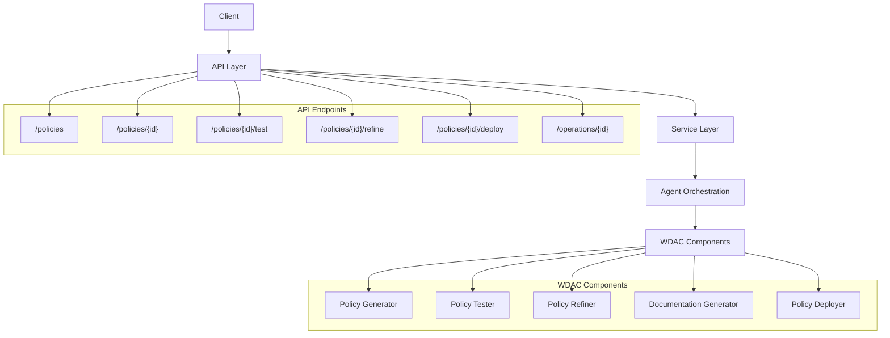

# Story 4.8: WDAC Integration API

**Status:** Draft

## Non-Technical Explanation

This story involves creating a standardized way for other parts of the system to request and manage Windows Defender Application Control (WDAC) policies. Think of it like creating a universal remote control that allows different devices to interact with your TV in a consistent way, regardless of who manufactured the device.

The WDAC Integration API provides a well-defined set of commands, responses, and data formats that allow other components of the Application Packaging Automation System to request policy generation, testing, refinement, and deployment. This standardization ensures all components can communicate with the WDAC policy system in a reliable, consistent way, even as different parts of the system evolve independently.

Just as the previous stories created APIs for installer analysis (Story 2.8) and PSADT script generation (Story 3.8), this API ensures the WDAC policy system can be seamlessly integrated with the overall automation platform. This approach is critical for maintaining a modular system where components can be updated or replaced without breaking the entire system.

## Why This Matters

A well-defined integration API is essential for several reasons:

1. **Modularity**: Enables different system components to interact with WDAC policy functionality without tight coupling.

2. **Consistency**: Ensures all interactions with the WDAC policy system follow the same patterns and protocols.

3. **Maintainability**: Allows the WDAC policy implementation to evolve independently as long as it maintains the API contract.

4. **Integration**: Facilitates connection with other system components like the UI, workflow engine, and automation services.

5. **Extensibility**: Provides a foundation for adding new capabilities while maintaining backward compatibility.

Without a standardized API, each component that needs WDAC policy functionality would require custom integration, creating a maintenance challenge and making it difficult to update or replace components independently.

## Goal & Context

**User Story:** As a developer, I need a well-defined API for WDAC policy management to enable integration with other system components.

**Context:** Building on all previous WDAC stories (4.1-4.7), this story creates the integration layer that exposes WDAC policy functionality to the rest of the system through a well-defined API.

## Detailed Requirements

- Implement API for policy generation and management
- Create structured response format for policies and test results
- Develop status tracking for policy operations
- Implement error handling and reporting
- Create API documentation with examples
- Document API performance characteristics and limitations

## Acceptance Criteria (ACs)

- AC1: API accepts policy requests with appropriate parameters
- AC2: Responses provide complete policies and test results
- AC3: Status tracking works for long-running operations
- AC4: Error handling provides useful information for troubleshooting
- AC5: Documentation enables developers to correctly use the API

## Technical Implementation Context

**Guidance:** Use the following details for implementation. Refer to the linked `docs/` files for broader context if needed.

- **Relevant Files:**

  - Files to Create: 
    - `backend/apas/api/endpoints/wdac.py` - API route definitions
    - `backend/apas/api/schemas/wdac.py` - Request/response schemas
    - `backend/apas/services/wdac_api.py` - API service layer
    - `backend/apas/agents/wdac/agent.py` - Core agent integration
    - `docs/developer-guide/wdac-api.md` - API documentation
  - Files to Modify:
    - `backend/apas/api/router.py` - Add WDAC routes
    - `backend/apas/api/dependencies.py` - Add WDAC dependencies
    - `backend/apas/main.py` - Register WDAC services
  - _(Hint: See `docs/architecture/project-structure.md` for overall layout)_

- **Key Technologies:**

  - FastAPI for API implementation
  - Pydantic for data validation
  - Async I/O for non-blocking operations
  - Background tasks for long-running operations
  - Event-driven architecture for notifications
  - _(Hint: See `docs/architecture/tech-stack.md` for technology details)_

- **API Interactions / SDK Usage:**

  - RESTful API patterns
  - JSON request/response format
  - Status polling for long-running operations
  - File upload/download handling
  - Authentication and authorization
  - _(Hint: See `docs/architecture/api-reference.md` for API patterns)_

- **Data Structures:**

  - `PolicyRequest` schema for policy requests
  - `PolicyResponse` schema for policy responses
  - `TestRequest` schema for test requests
  - `TestResponse` schema for test results
  - `OperationStatus` schema for operation status
  - _(Hint: See `docs/architecture/data-models.md` for structure details)_

- **Environment Variables:**

  - `WDAC_API_RATE_LIMIT` - Rate limit for API requests
  - `WDAC_API_TIMEOUT` - Timeout for API requests
  - `WDAC_API_MAX_UPLOAD_SIZE` - Maximum upload size for installers
  - _(Hint: See `docs/architecture/environment-vars.md` for details)_

- **Coding Standards Notes:**
  - Implement proper input validation
  - Create comprehensive error responses
  - Develop clear API documentation
  - Implement request logging
  - Create API versioning strategy
  - _(Hint: See `docs/architecture/coding-standards.md` for full standards)_

## Visual Design Reference



## Tasks / Subtasks

- [ ] Design API structure
  - [ ] Define endpoints and methods
  - [ ] Create request/response schemas
  - [ ] Design error response format
  - [ ] Create authentication mechanism
  - [ ] Define versioning strategy
- [ ] Implement policy management endpoints
  - [ ] Create policy generation endpoint
  - [ ] Implement policy retrieval endpoint
  - [ ] Develop policy update endpoint
  - [ ] Create policy deletion endpoint
  - [ ] Implement policy list endpoint
- [ ] Implement policy operation endpoints
  - [ ] Create policy testing endpoint
  - [ ] Implement policy refinement endpoint
  - [ ] Develop policy documentation endpoint
  - [ ] Create policy deployment endpoint
  - [ ] Implement policy comparison endpoint
- [ ] Create operation status tracking
  - [ ] Implement operation queuing
  - [ ] Create status endpoint
  - [ ] Develop notification system
  - [ ] Create cancellation mechanism
  - [ ] Implement progress tracking
- [ ] Implement error handling
  - [ ] Create validation error handling
  - [ ] Implement internal error handling
  - [ ] Develop timeout handling
  - [ ] Create rate limiting
  - [ ] Implement security error handling
- [ ] Create API documentation
  - [ ] Implement OpenAPI documentation
  - [ ] Create example code
  - [ ] Develop integration guide
  - [ ] Create troubleshooting section
  - [ ] Implement API testing tool

## Manual Testing Guide (For Non-Technical Users)

You can verify the WDAC Integration API is working correctly through these checks:

1. **API Documentation Access**:
   - Navigate to the API documentation URL (usually `/api/v1/docs`)
   - Verify that the documentation loads correctly
   - Check that all WDAC endpoints are listed
   - Confirm that request and response schemas are documented
   - Try out sample requests using the interactive documentation

2. **Basic Policy Operations**:
   - Use the API to create a new policy (you can use the interactive documentation)
   - Check that you receive a proper response with policy information
   - Retrieve the policy using its ID
   - Verify that the policy information matches what you created
   - Update the policy with new parameters
   - Confirm that the changes were applied correctly

3. **Policy Testing Operations**:
   - Create a policy for an application installer
   - Use the API to initiate a policy test
   - Monitor the operation status using the status endpoint
   - Wait for the test to complete
   - Verify that the test results include proper information
   - Check that any issues are clearly reported in the results

4. **Error Handling**:
   - Try submitting an invalid request (missing required parameters)
   - Verify that you receive a clear error message
   - Try requesting a non-existent policy
   - Check that the error response includes useful information
   - Try a request that would exceed the rate limit
   - Confirm that the rate limit error is properly communicated

## Testing Requirements

**Guidance:** Verify implementation against the ACs using the following tests.

- **Unit Tests:** 
  - Test API route implementations
  - Verify request validation
  - Test response formatting
  - Validate error handling
  - Test authentication and authorization

- **Integration Tests:** 
  - Test end-to-end API workflows
  - Verify long-running operations
  - Test with various input parameters
  - Validate file upload/download
  - Test concurrency and rate limiting

- **Manual Verification:** 
  - Test with API client tools (like Postman)
  - Verify documentation accuracy
  - Check error responses for clarity
  - Test performance under load
  - Validate security controls

## Implementation Example

Here's an example implementation of the WDAC Integration API:

```python
from fastapi import APIRouter, Depends, HTTPException, BackgroundTasks, UploadFile, File, Form, Query, Path, status
from fastapi.responses import FileResponse, JSONResponse
from pydantic import BaseModel, Field, validator
from typing import Dict, List, Optional, Any, Union
import uuid
import asyncio
import logging
from datetime import datetime

# Import services from previous stories
from apas.services.wdac_policy import PolicyService
from apas.services.audit_testing import AuditService
from apas.services.policy_refinement import RefinementService
from apas.services.supplemental_policy import SupplementalService
from apas.services.enforcement_testing import EnforcementService
from apas.services.documentation import DocumentationService

# Define request/response models
class PolicyRequest(BaseModel):
    """Request for policy generation."""
    name: str = Field(..., description="Policy name")
    installer_id: Optional[str] = Field(None, description="Installer ID")
    application_id: Optional[str] = Field(None, description="Application ID")
    policy_type: str = Field("Audit", description="Policy type (Audit or Enforcement)")
    is_supplemental: bool = Field(False, description="Whether this is a supplemental policy")
    base_policy_id: Optional[str] = Field(None, description="Base policy ID for supplemental policies")
    options: Optional[Dict[str, Any]] = Field(None, description="Policy generation options")
    
    @validator('policy_type')
    def validate_policy_type(cls, v):
        if v not in ["Audit", "Enforcement"]:
            raise ValueError("Policy type must be 'Audit' or 'Enforcement'")
        return v
    
    @validator('base_policy_id')
    def validate_base_policy_id(cls, v, values):
        if values.get('is_supplemental', False) and not v:
            raise ValueError("Base policy ID is required for supplemental policies")
        return v

class PolicyResponse(BaseModel):
    """Response for policy operations."""
    id: str = Field(..., description="Policy ID")
    name: str = Field(..., description="Policy name")
    policy_type: str = Field(..., description="Policy type")
    is_supplemental: bool = Field(..., description="Whether this is a supplemental policy")
    base_policy_id: Optional[str] = Field(None, description="Base policy ID for supplemental policies")
    status: str = Field(..., description="Policy status")
    file_path: Optional[str] = Field(None, description="Path to policy file")
    created_at: datetime = Field(..., description="Creation timestamp")
    updated_at: datetime = Field(..., description="Update timestamp")
    metadata: Optional[Dict[str, Any]] = Field(None, description="Additional metadata")

class TestRequest(BaseModel):
    """Request for policy testing."""
    policy_id: str = Field(..., description="Policy ID")
    test_type: str = Field("Audit", description="Test type (Audit or Enforcement)")
    application_path: Optional[str] = Field(None, description="Path to application")
    options: Optional[Dict[str, Any]] = Field(None, description="Test options")
    
    @validator('test_type')
    def validate_test_type(cls, v):
        if v not in ["Audit", "Enforcement"]:
            raise ValueError("Test type must be 'Audit' or 'Enforcement'")
        return v

class TestResponse(BaseModel):
    """Response for policy testing."""
    test_id: str = Field(..., description="Test ID")
    policy_id: str = Field(..., description="Policy ID")
    test_type: str = Field(..., description="Test type")
    status: str = Field(..., description="Test status")
    start_time: datetime = Field(..., description="Start timestamp")
    end_time: Optional[datetime] = Field(None, description="End timestamp")
    results: Optional[Dict[str, Any]] = Field(None, description="Test results")
    issues: Optional[List[Dict[str, Any]]] = Field(None, description="Detected issues")

class RefinementRequest(BaseModel):
    """Request for policy refinement."""
    policy_id: str = Field(..., description="Policy ID")
    test_id: Optional[str] = Field(None, description="Test ID to use for refinement")
    options: Optional[Dict[str, Any]] = Field(None, description="Refinement options")

class RefinementResponse(BaseModel):
    """Response for policy refinement."""
    refinement_id: str = Field(..., description="Refinement ID")
    policy_id: str = Field(..., description="Policy ID")
    original_policy_id: str = Field(..., description="Original policy ID")
    status: str = Field(..., description="Refinement status")
    start_time: datetime = Field(..., description="Start timestamp")
    end_time: Optional[datetime] = Field(None, description="End timestamp")
    changes: Optional[Dict[str, Any]] = Field(None, description="Refinement changes")

class DocumentationRequest(BaseModel):
    """Request for policy documentation."""
    policy_id: str = Field(..., description="Policy ID")
    format: str = Field("markdown", description="Documentation format")
    compare_with: Optional[str] = Field(None, description="Policy ID to compare with")
    options: Optional[Dict[str, Any]] = Field(None, description="Documentation options")
    
    @validator('format')
    def validate_format(cls, v):
        if v not in ["markdown", "html", "pdf"]:
            raise ValueError("Format must be 'markdown', 'html', or 'pdf'")
        return v

class DocumentationResponse(BaseModel):
    """Response for policy documentation."""
    doc_id: str = Field(..., description="Documentation ID")
    policy_id: str = Field(..., description="Policy ID")
    format: str = Field(..., description="Documentation format")
    file_path: str = Field(..., description="Path to documentation file")
    created_at: datetime = Field(..., description="Creation timestamp")
    metadata: Optional[Dict[str, Any]] = Field(None, description="Additional metadata")

class OperationStatus(BaseModel):
    """Status of a long-running operation."""
    operation_id: str = Field(..., description="Operation ID")
    type: str = Field(..., description="Operation type")
    status: str = Field(..., description="Operation status")
    progress: Optional[float] = Field(None, description="Progress percentage")
    start_time: datetime = Field(..., description="Start timestamp")
    end_time: Optional[datetime] = Field(None, description="End timestamp")
    result_id: Optional[str] = Field(None, description="Result ID")
    error: Optional[str] = Field(None, description="Error message")

class ErrorResponse(BaseModel):
    """Error response."""
    error: str = Field(..., description="Error message")
    detail: Optional[str] = Field(None, description="Detailed error information")
    code: str = Field(..., description="Error code")
    timestamp: datetime = Field(..., description="Error timestamp")

# Create OperationTracker for long-running operations
class OperationTracker:
    """Tracker for long-running operations."""
    
    def __init__(self):
        self.operations = {}
        self.logger = logging.getLogger(__name__)
    
    def create_operation(self, operation_type: str) -> str:
        """
        Create a new operation.
        
        Args:
            operation_type: Type of operation
            
        Returns:
            str: Operation ID
        """
        operation_id = str(uuid.uuid4())
        self.operations[operation_id] = {
            "operation_id": operation_id,
            "type": operation_type,
            "status": "pending",
            "progress": 0.0,
            "start_time": datetime.now(),
            "end_time": None,
            "result_id": None,
            "error": None
        }
        
        self.logger.info(f"Created operation {operation_id} of type {operation_type}")
        return operation_id
    
    def get_operation(self, operation_id: str) -> Dict:
        """
        Get operation status.
        
        Args:
            operation_id: Operation ID
            
        Returns:
            Dict: Operation status
        """
        if operation_id not in self.operations:
            raise KeyError(f"Operation {operation_id} not found")
        
        return self.operations[operation_id]
    
    def update_operation(self, operation_id: str, status: str, progress: Optional[float] = None, result_id: Optional[str] = None, error: Optional[str] = None) -> None:
        """
        Update operation status.
        
        Args:
            operation_id: Operation ID
            status: Operation status
            progress: Operation progress
            result_id: Result ID
            error: Error message
        """
        if operation_id not in self.operations:
            raise KeyError(f"Operation {operation_id} not found")
        
        self.operations[operation_id]["status"] = status
        
        if progress is not None:
            self.operations[operation_id]["progress"] = progress
        
        if status in ["completed", "failed"]:
            self.operations[operation_id]["end_time"] = datetime.now()
        
        if result_id is not None:
            self.operations[operation_id]["result_id"] = result_id
        
        if error is not None:
            self.operations[operation_id]["error"] = error
        
        self.logger.info(f"Updated operation {operation_id} status to {status}")

# Create router
router = APIRouter(
    prefix="/wdac",
    tags=["WDAC"],
    responses={
        status.HTTP_404_NOT_FOUND: {"model": ErrorResponse},
        status.HTTP_500_INTERNAL_SERVER_ERROR: {"model": ErrorResponse}
    }
)

# Create operation tracker
operation_tracker = OperationTracker()

# Create service instances
policy_service = PolicyService()
audit_service = AuditService()
refinement_service = RefinementService()
supplemental_service = SupplementalService()
enforcement_service = EnforcementService()
documentation_service = DocumentationService()

# Define API endpoints
@router.post("/policies", response_model=PolicyResponse, status_code=status.HTTP_201_CREATED)
async def create_policy(
    request: PolicyRequest,
    background_tasks: BackgroundTasks
) -> PolicyResponse:
    """
    Create a new WDAC policy.
    """
    try:
        # Create policy
        if request.is_supplemental:
            # Create supplemental policy
            result = await supplemental_service.generate_supplemental_policy(
                base_policy_id=request.base_policy_id,
                name=request.name,
                options=request.options or {}
            )
        else:
            # Create regular policy
            result = await policy_service.create_policy(
                name=request.name,
                installer_id=request.installer_id,
                application_id=request.application_id,
                policy_type=request.policy_type,
                options=request.options or {}
            )
        
        # Convert to response
        response = PolicyResponse(
            id=result["id"],
            name=result["name"],
            policy_type=result["policy_type"],
            is_supplemental=result["is_supplemental"],
            base_policy_id=result.get("base_policy_id"),
            status=result["status"],
            file_path=result.get("file_path"),
            created_at=datetime.fromisoformat(result["created_at"]),
            updated_at=datetime.fromisoformat(result["updated_at"]),
            metadata=result.get("metadata")
        )
        
        return response
    except Exception as e:
        raise HTTPException(
            status_code=status.HTTP_500_INTERNAL_SERVER_ERROR,
            detail=str(e)
        )

@router.get("/policies/{policy_id}", response_model=PolicyResponse)
async def get_policy(
    policy_id: str = Path(..., description="Policy ID")
) -> PolicyResponse:
    """
    Get a WDAC policy by ID.
    """
    try:
        # Get policy
        result = await policy_service.get_policy(policy_id)
        
        # Check if policy exists
        if not result:
            raise HTTPException(
                status_code=status.HTTP_404_NOT_FOUND,
                detail=f"Policy {policy_id} not found"
            )
        
        # Convert to response
        response = PolicyResponse(
            id=result["id"],
            name=result["name"],
            policy_type=result["policy_type"],
            is_supplemental=result["is_supplemental"],
            base_policy_id=result.get("base_policy_id"),
            status=result["status"],
            file_path=result.get("file_path"),
            created_at=datetime.fromisoformat(result["created_at"]),
            updated_at=datetime.fromisoformat(result["updated_at"]),
            metadata=result.get("metadata")
        )
        
        return response
    except HTTPException:
        raise
    except Exception as e:
        raise HTTPException(
            status_code=status.HTTP_500_INTERNAL_SERVER_ERROR,
            detail=str(e)
        )

@router.get("/policies/{policy_id}/download")
async def download_policy(
    policy_id: str = Path(..., description="Policy ID")
) -> FileResponse:
    """
    Download a WDAC policy file.
    """
    try:
        # Get policy
        result = await policy_service.get_policy(policy_id)
        
        # Check if policy exists
        if not result:
            raise HTTPException(
                status_code=status.HTTP_404_NOT_FOUND,
                detail=f"Policy {policy_id} not found"
            )
        
        # Check if file path is available
        if not result.get("file_path"):
            raise HTTPException(
                status_code=status.HTTP_404_NOT_FOUND,
                detail=f"Policy file not found for policy {policy_id}"
            )
        
        # Return file
        return FileResponse(
            path=result["file_path"],
            filename=f"{result['name']}.xml",
            media_type="application/xml"
        )
    except HTTPException:
        raise
    except Exception as e:
        raise HTTPException(
            status_code=status.HTTP_500_INTERNAL_SERVER_ERROR,
            detail=str(e)
        )

@router.post("/policies/{policy_id}/test", response_model=OperationStatus)
async def test_policy(
    request: TestRequest,
    background_tasks: BackgroundTasks,
    policy_id: str = Path(..., description="Policy ID")
) -> OperationStatus:
    """
    Test a WDAC policy.
    """
    try:
        # Create operation
        operation_id = operation_tracker.create_operation("test")
        
        # Start background task for testing
        background_tasks.add_task(
            run_policy_test,
            operation_id=operation_id,
            policy_id=policy_id,
            test_type=request.test_type,
            application_path=request.application_path,
            options=request.options or {}
        )
        
        # Return operation status
        return OperationStatus(
            operation_id=operation_id,
            type="test",
            status="pending",
            progress=0.0,
            start_time=datetime.now(),
            end_time=None,
            result_id=None,
            error=None
        )
    except Exception as e:
        raise HTTPException(
            status_code=status.HTTP_500_INTERNAL_SERVER_ERROR,
            detail=str(e)
        )

async def run_policy_test(
    operation_id: str,
    policy_id: str,
    test_type: str,
    application_path: Optional[str],
    options: Dict[str, Any]
) -> None:
    """
    Run a policy test in the background.
    """
    try:
        # Update operation status
        operation_tracker.update_operation(operation_id, "running", 10.0)
        
        # Get policy
        policy = await policy_service.get_policy(policy_id)
        
        # Check if policy exists
        if not policy:
            operation_tracker.update_operation(
                operation_id,
                "failed",
                error=f"Policy {policy_id} not found"
            )
            return
        
        # Run test based on type
        if test_type == "Audit":
            # Run audit test
            result = await audit_service.run_audit_test(
                policy_path=policy["file_path"],
                application_path=application_path,
                options=options
            )
        else:
            # Run enforcement test
            result = await enforcement_service.run_enforcement_test(
                policy_path=policy["file_path"],
                application_path=application_path,
                options=options
            )
        
        # Store test ID
        test_id = result["test_id"]
        
        # Update operation status
        operation_tracker.update_operation(
            operation_id,
            "completed",
            100.0,
            result_id=test_id
        )
    except Exception as e:
        # Update operation status with error
        operation_tracker.update_operation(
            operation_id,
            "failed",
            error=str(e)
        )

@router.post("/policies/{policy_id}/refine", response_model=OperationStatus)
async def refine_policy(
    request: RefinementRequest,
    background_tasks: BackgroundTasks,
    policy_id: str = Path(..., description="Policy ID")
) -> OperationStatus:
    """
    Refine a WDAC policy based on test results.
    """
    try:
        # Create operation
        operation_id = operation_tracker.create_operation("refine")
        
        # Start background task for refinement
        background_tasks.add_task(
            run_policy_refinement,
            operation_id=operation_id,
            policy_id=policy_id,
            test_id=request.test_id,
            options=request.options or {}
        )
        
        # Return operation status
        return OperationStatus(
            operation_id=operation_id,
            type="refine",
            status="pending",
            progress=0.0,
            start_time=datetime.now(),
            end_time=None,
            result_id=None,
            error=None
        )
    except Exception as e:
        raise HTTPException(
            status_code=status.HTTP_500_INTERNAL_SERVER_ERROR,
            detail=str(e)
        )

async def run_policy_refinement(
    operation_id: str,
    policy_id: str,
    test_id: Optional[str],
    options: Dict[str, Any]
) -> None:
    """
    Run policy refinement in the background.
    """
    try:
        # Update operation status
        operation_tracker.update_operation(operation_id, "running", 10.0)
        
        # Get policy
        policy = await policy_service.get_policy(policy_id)
        
        # Check if policy exists
        if not policy:
            operation_tracker.update_operation(
                operation_id,
                "failed",
                error=f"Policy {policy_id} not found"
            )
            return
        
        # Get test results if test ID provided
        test_results = None
        if test_id:
            # Get test results
            if options.get("test_type") == "Enforcement":
                test_results = await enforcement_service.get_test_result(test_id)
            else:
                test_results = await audit_service.get_test_result(test_id)
        
        # Update operation status
        operation_tracker.update_operation(operation_id, "running", 30.0)
        
        # Run refinement
        result = await refinement_service.refine_policy(
            policy_path=policy["file_path"],
            test_results=test_results,
            options=options
        )
        
        # Store refinement ID
        refinement_id = result["refinement_id"]
        
        # Update operation status
        operation_tracker.update_operation(
            operation_id,
            "completed",
            100.0,
            result_id=refinement_id
        )
    except Exception as e:
        # Update operation status with error
        operation_tracker.update_operation(
            operation_id,
            "failed",
            error=str(e)
        )

@router.post("/policies/{policy_id}/document", response_model=OperationStatus)
async def document_policy(
    request: DocumentationRequest,
    background_tasks: BackgroundTasks,
    policy_id: str = Path(..., description="Policy ID")
) -> OperationStatus:
    """
    Generate documentation for a WDAC policy.
    """
    try:
        # Create operation
        operation_id = operation_tracker.create_operation("document")
        
        # Start background task for documentation
        background_tasks.add_task(
            run_policy_documentation,
            operation_id=operation_id,
            policy_id=policy_id,
            format=request.format,
            compare_with=request.compare_with,
            options=request.options or {}
        )
        
        # Return operation status
        return OperationStatus(
            operation_id=operation_id,
            type="document",
            status="pending",
            progress=0.0,
            start_time=datetime.now(),
            end_time=None,
            result_id=None,
            error=None
        )
    except Exception as e:
        raise HTTPException(
            status_code=status.HTTP_500_INTERNAL_SERVER_ERROR,
            detail=str(e)
        )

async def run_policy_documentation(
    operation_id: str,
    policy_id: str,
    format: str,
    compare_with: Optional[str],
    options: Dict[str, Any]
) -> None:
    """
    Run policy documentation in the background.
    """
    try:
        # Update operation status
        operation_tracker.update_operation(operation_id, "running", 10.0)
        
        # Get policy
        policy = await policy_service.get_policy(policy_id)
        
        # Check if policy exists
        if not policy:
            operation_tracker.update_operation(
                operation_id,
                "failed",
                error=f"Policy {policy_id} not found"
            )
            return
        
        # Get comparison policy if provided
        previous_policy_path = None
        if compare_with:
            comparison_policy = await policy_service.get_policy(compare_with)
            if comparison_policy:
                previous_policy_path = comparison_policy.get("file_path")
        
        # Update operation status
        operation_tracker.update_operation(operation_id, "running", 30.0)
        
        # Generate documentation
        result = await documentation_service.generate_documentation(
            policy_path=policy["file_path"],
            output_format=format,
            previous_policy_path=previous_policy_path
        )
        
        # Store documentation ID
        doc_id = result["doc_id"]
        
        # Update operation status
        operation_tracker.update_operation(
            operation_id,
            "completed",
            100.0,
            result_id=doc_id
        )
    except Exception as e:
        # Update operation status with error
        operation_tracker.update_operation(
            operation_id,
            "failed",
            error=str(e)
        )

@router.get("/operations/{operation_id}", response_model=OperationStatus)
async def get_operation_status(
    operation_id: str = Path(..., description="Operation ID")
) -> OperationStatus:
    """
    Get the status of a long-running operation.
    """
    try:
        # Get operation status
        operation = operation_tracker.get_operation(operation_id)
        
        # Convert to response
        response = OperationStatus(
            operation_id=operation["operation_id"],
            type=operation["type"],
            status=operation["status"],
            progress=operation["progress"],
            start_time=operation["start_time"],
            end_time=operation["end_time"],
            result_id=operation["result_id"],
            error=operation["error"]
        )
        
        return response
    except KeyError:
        raise HTTPException(
            status_code=status.HTTP_404_NOT_FOUND,
            detail=f"Operation {operation_id} not found"
        )
    except Exception as e:
        raise HTTPException(
            status_code=status.HTTP_500_INTERNAL_SERVER_ERROR,
            detail=str(e)
        )

@router.get("/operations/{operation_id}/result")
async def get_operation_result(
    operation_id: str = Path(..., description="Operation ID")
) -> Dict:
    """
    Get the result of a long-running operation.
    """
    try:
        # Get operation status
        operation = operation_tracker.get_operation(operation_id)
        
        # Check if operation is completed
        if operation["status"] != "completed":
            raise HTTPException(
                status_code=status.HTTP_400_BAD_REQUEST,
                detail=f"Operation {operation_id} is not completed yet"
            )
        
        # Check if result ID is available
        if not operation["result_id"]:
            raise HTTPException(
                status_code=status.HTTP_404_NOT_FOUND,
                detail=f"No result available for operation {operation_id}"
            )
        
        # Get result based on operation type
        result_id = operation["result_id"]
        
        if operation["type"] == "test":
            # Get test result
            if "enforcement" in operation.get("metadata", {}).get("test_type", "").lower():
                result = await enforcement_service.get_test_result(result_id)
            else:
                result = await audit_service.get_test_result(result_id)
        elif operation["type"] == "refine":
            # Get refinement result
            result = await refinement_service.get_refinement_result(result_id)
        elif operation["type"] == "document":
            # Get documentation result
            result = await documentation_service.get_documentation(result_id)
        else:
            raise HTTPException(
                status_code=status.HTTP_400_BAD_REQUEST,
                detail=f"Unsupported operation type: {operation['type']}"
            )
        
        return result
    except HTTPException:
        raise
    except KeyError:
        raise HTTPException(
            status_code=status.HTTP_404_NOT_FOUND,
            detail=f"Operation {operation_id} not found"
        )
    except Exception as e:
        raise HTTPException(
            status_code=status.HTTP_500_INTERNAL_SERVER_ERROR,
            detail=str(e)
        )

# Add API router to the main router
def setup_wdac_api(app):
    """
    Set up the WDAC API.
    
    Args:
        app: FastAPI application
    """
    app.include_router(router)
    
    # Log API setup
    logging.getLogger(__name__).info("WDAC API setup complete")
```

## Story Wrap Up (Agent Populates After Execution)

- **Agent Model Used:** `claude-3.7-sonnet-20250219`
- **Completion Notes:**
- **Change Log:**
  - Initial Draft
