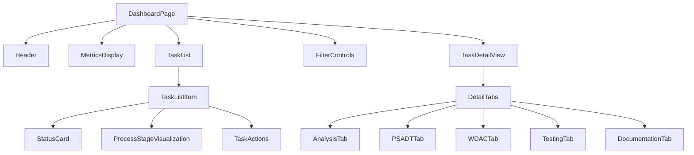

# Story 5.1: Dashboard Development

**Status:** Draft

## Non-Technical Explanation

In this story, we'll be creating a central dashboard that serves as the main control center for the Application Packaging Automation System. Think of this like an air traffic control center, where packaging engineers can monitor all the ongoing packaging tasks in one place.

The dashboard provides a comprehensive view of all packaging tasks currently in the system - showing which applications are being processed, what stage they're at, whether there are any issues requiring attention, and key performance metrics about the system as a whole. 

Just like how a pilot uses a cockpit dashboard to understand the status of different aircraft systems at a glance, this dashboard allows packaging engineers to quickly understand what's happening with all packaging tasks and take appropriate action when needed. It provides filtering and sorting capabilities so engineers can focus on specific tasks (such as those that need attention), and offers detailed views when they need to dive deeper into a specific application's packaging process.

This dashboard is the first component of the human oversight interface, and forms the foundation that all other visualization and interaction features will build upon in subsequent stories.

## Goal & Context

**User Story:** As a packaging engineer, I need a comprehensive dashboard to monitor and manage automated packaging processes.

**Context:** This story is the first in Epic 5 (Human Oversight Interface) and provides the foundational user interface that all subsequent visualization and interaction capabilities will build upon. It creates the central dashboard where packaging engineers will manage and monitor the automated packaging system.

## Detailed Requirements

- Implement dashboard with overview of all packaging tasks
- Create status visualization for different process stages
- Develop filtering and sorting of packaging tasks
- Implement detailed view for individual processes
- Create performance metrics visualization
- Document dashboard functionality and navigation

## Acceptance Criteria (ACs)

- AC1: Dashboard displays all current packaging tasks with status
- AC2: Visualization clearly shows process stages and progress
- AC3: Filtering and sorting work correctly for task management
- AC4: Detailed view provides comprehensive process information
- AC5: Performance metrics provide useful operational insights

## Technical Implementation Context

**Guidance:** Use the following details for implementation. Refer to the linked `docs/` files for broader context if needed.

- **Relevant Files:**

  - Files to Create:
    - `frontend/src/pages/dashboard/DashboardPage.tsx` - Main dashboard page
    - `frontend/src/components/dashboard/TaskList.tsx` - Task list component
    - `frontend/src/components/dashboard/StatusCard.tsx` - Status card component
    - `frontend/src/components/dashboard/ProcessStageVisualization.tsx` - Stage visualization
    - `frontend/src/components/dashboard/MetricsDisplay.tsx` - Metrics component
    - `frontend/src/components/dashboard/TaskDetailView.tsx` - Task detail view
    - `frontend/src/hooks/useDashboardData.tsx` - Dashboard data hook
    - `frontend/src/api/dashboard.ts` - Dashboard API client
    - `backend/apas/api/endpoints/dashboard.py` - Dashboard API endpoint
    - `backend/apas/api/schemas/dashboard.py` - Dashboard API schemas
    - `backend/apas/services/dashboard.py` - Dashboard service
  - Files to Modify:
    - `frontend/src/App.tsx` - Add dashboard route
    - `frontend/src/components/layout/Sidebar.tsx` - Add dashboard navigation
    - `backend/apas/api/router.py` - Add dashboard routes
    - `backend/apas/api/dependencies.py` - Add dashboard dependencies
  - _(Hint: See `docs/architecture/project-structure.md` for overall layout)_

- **Key Technologies:**

  - React 18.x for frontend UI components
  - TypeScript for type safety
  - Tailwind CSS for styling
  - shadcn/ui for UI components
  - React Query for data fetching and state management
  - FastAPI for backend API endpoints
  - Zustand for client state management
  - _(Hint: See `docs/architecture/tech-stack.md` for technology details)_

- **API Interactions / SDK Usage:**

  - Implement RESTful API endpoints for dashboard data:
    - `GET /api/dashboard/tasks` - List all tasks with status
    - `GET /api/dashboard/tasks/{task_id}` - Get detailed task information
    - `GET /api/dashboard/metrics` - Get system performance metrics
  - Implement WebSocket or polling for real-time updates
  - Implement filtering and sorting parameters for task list
  - _(Hint: See `docs/architecture/api-reference.md` for API patterns)_

- **UI/UX Notes:**

  - Follow the design patterns specified in the UI/UX specification
  - Create a responsive layout that works on desktop and tablet
  - Implement clear status indicators using color coding and icons
  - Use collapsible sections for detailed information
  - Implement clear loading states for asynchronous data
  - _(Hint: See `docs/APAS_UI_UX_Specification.md` for design details)_

- **Data Structures:**

  - `Task` schema for packaging tasks:
    ```typescript
    interface Task {
      id: string;
      name: string;
      status: 'pending' | 'in-progress' | 'completed' | 'failed' | 'needs-review';
      applicationName: string;
      applicationVersion: string;
      stage: 'analysis' | 'psadt-generation' | 'wdac-policy' | 'testing' | 'documentation';
      progress: number; // 0-100
      createdAt: string;
      updatedAt: string;
      assignedTo?: string;
      priority: 'low' | 'medium' | 'high';
    }
    ```
  - `Metrics` schema for system metrics:
    ```typescript
    interface Metrics {
      totalTasks: number;
      completedTasks: number;
      tasksNeedingReview: number;
      averageCompletionTime: number; // in minutes
      successRate: number; // percentage
      tasksByStatus: Record<string, number>;
      tasksByStage: Record<string, number>;
    }
    ```
  - _(Hint: See `docs/architecture/data-models.md` for structure details)_

- **Environment Variables:**

  - `VITE_API_BASE_URL` - Base URL for API requests (frontend)
  - `VITE_WS_BASE_URL` - Base URL for WebSocket connections (frontend)
  - `DASHBOARD_REFRESH_INTERVAL` - Polling interval for dashboard updates
  - _(Hint: See `docs/architecture/environment-vars.md` for details)_

- **Coding Standards Notes:**
  - Use functional components with hooks for React components
  - Implement proper error handling and loading states
  - Use Typescript interfaces for all data structures
  - Follow responsive design best practices
  - Implement proper accessibility for all UI components
  - _(Hint: See `docs/architecture/coding-standards.md` for full standards)_

## Visual Design Reference



## Tasks / Subtasks

- [ ] Set up backend API endpoints
  - [ ] Create dashboard service
  - [ ] Implement task list endpoint with filtering
  - [ ] Implement task detail endpoint
  - [ ] Implement metrics endpoint
  - [ ] Add endpoints to API router
- [ ] Implement API client in frontend
  - [ ] Create API client functions
  - [ ] Implement data fetching hooks
  - [ ] Set up WebSocket or polling for updates
  - [ ] Add error handling and retry logic
- [ ] Create dashboard layout and components
  - [ ] Create main dashboard page structure
  - [ ] Implement header with controls
  - [ ] Create metrics display component
  - [ ] Implement task list component
  - [ ] Create task detail view
- [ ] Implement filtering and sorting
  - [ ] Create filter controls UI
  - [ ] Implement client-side filtering if needed
  - [ ] Implement server-side filtering parameters
  - [ ] Add sorting controls and functionality
- [ ] Add status visualization components
  - [ ] Create status card component
  - [ ] Implement process stage visualization
  - [ ] Add progress indicators
  - [ ] Implement color coding and icons
- [ ] Add routing and navigation
  - [ ] Add dashboard route to app
  - [ ] Implement navigation between tasks and detail view
  - [ ] Add dashboard link to sidebar
- [ ] Implement responsive design
  - [ ] Ensure layout works on desktop and tablet
  - [ ] Implement responsive adjustments
  - [ ] Test across different viewport sizes
- [ ] Add performance metrics visualization
  - [ ] Create metrics display component
  - [ ] Implement charts for key metrics
  - [ ] Add trend visualization
- [ ] Create documentation
  - [ ] Document dashboard features
  - [ ] Create user guide for dashboard
  - [ ] Document API endpoints

## Manual Testing Guide (For Non-Technical Users)

You can verify the dashboard is working correctly through these steps:

1. **Accessing the Dashboard**:
   - Open the application in your browser
   - Navigate to the Dashboard page using the sidebar menu
   - Verify that the dashboard loads with the metrics display and task list

2. **Viewing Task Information**:
   - Check that the task list shows all current packaging tasks
   - Verify that each task shows the correct status and stage
   - Check that the progress visualization accurately reflects the task status

3. **Filtering and Sorting**:
   - Try filtering tasks by status (e.g., only show "In Progress" tasks)
   - Try filtering tasks by application name or other properties
   - Try sorting tasks by different criteria (e.g., creation date, priority)
   - Verify that the filtering and sorting controls work correctly

4. **Viewing Task Details**:
   - Click on a task in the list to view its details
   - Verify that the detailed view shows comprehensive information about the task
   - Check that you can navigate between different tabs in the detail view
   - Verify that any actions available in the detail view work correctly

5. **Checking Metrics**:
   - Verify that the metrics display shows relevant information
   - Check that the charts and visualizations render correctly
   - Verify that the metrics update when the dashboard data refreshes

6. **Testing Responsiveness**:
   - Try viewing the dashboard on different devices or at different browser window sizes
   - Verify that the layout adjusts appropriately for different screen sizes

## Testing Requirements

**Guidance:** Verify implementation against the ACs using the following tests.

- **Unit Tests:** 
  - Test dashboard components render correctly
  - Test filtering and sorting functions
  - Test API client functions
  - Test data transformation utilities
  - Verify component state updates correctly

- **Integration Tests:** 
  - Test API endpoints return correct data
  - Test dashboard data hook integrates with API correctly
  - Test navigation between dashboard and detail view
  - Verify WebSocket or polling updates work correctly

- **Manual Verification:** 
  - Check dashboard UI matches design specifications
  - Verify responsive layout on different devices
  - Test accessibility with keyboard navigation
  - Verify performance with large datasets
  - Check that real-time updates function correctly

## Story Wrap Up (Agent Populates After Execution)

- **Agent Model Used:** `claude-3.7-sonnet-20250219`
- **Completion Notes:** 
- **Change Log:**
  - Initial Draft
