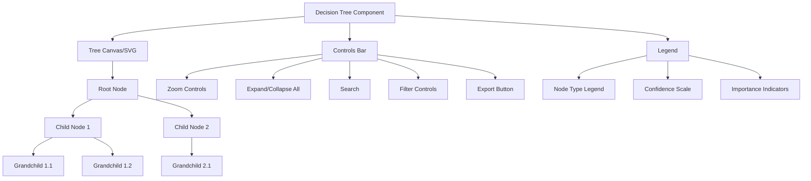

# Story 5.2: Interactive Decision Tree Visualization

**Status:** Draft

## Non-Technical Explanation

In this story, we're creating the system's ability to show packaging engineers how the AI made its decisions. Imagine if you used a GPS navigation app, but instead of just giving you directions, it also showed you why it chose a particular route—displaying the factors it considered like traffic conditions, distance, and road closures, and how each affected the final route recommendation.

Similarly, our interactive decision tree visualization will show the step-by-step reasoning process the AI went through when making packaging decisions. Engineers will see a tree-like structure where each node represents a decision point, like "What type of installer is this?" or "Which installation parameters should be used?" Users can click on different parts of the tree to expand them and see more detailed information about specific decisions.

This transparency is crucial because it allows packaging engineers to understand why the AI system made certain choices, building trust in the automation process. It also helps identify points where the system's reasoning might be incorrect, allowing for more precise human intervention when needed. Rather than just seeing the end result of what the AI decided, engineers get visibility into the entire decision-making journey.

## Goal & Context

**User Story:** As a packaging engineer, I need interactive decision tree visualizations to understand the AI's reasoning process for packaging decisions.

**Context:** Building on the dashboard foundation (Story 5.1), this story implements the interactive decision tree visualization component that will show how the AI agents made decisions throughout the packaging process. This is a key component of the explainable AI approach that builds trust in the system.

## Detailed Requirements

- Design interactive decision tree visualization components
- Implement collapsible/expandable decision nodes for managing complexity
- Create highlighting for critical decision points
- Develop visualization of decision weights and importance factors
- Implement zoom and navigation controls for large decision trees
- Create export functionality for decision trees
- Document visualization interaction patterns and interpretation

## Acceptance Criteria (ACs)

- AC1: Decision trees accurately reflect the AI agents' actual decision-making process
- AC2: Interactive elements work properly (expand/collapse, navigation, highlighting)
- AC3: Visual design clearly communicates decision hierarchy and importance
- AC4: Large decision trees remain navigable and understandable
- AC5: Exported visualizations maintain all necessary context

## Technical Implementation Context

**Guidance:** Use the following details for implementation. Refer to the linked `docs/` files for broader context if needed.

- **Relevant Files:**

  - Files to Create:
    - `frontend/src/components/visualization/DecisionTree.tsx` - Main decision tree component
    - `frontend/src/components/visualization/DecisionNode.tsx` - Node component for tree
    - `frontend/src/components/visualization/TreeControls.tsx` - Zoom/navigation controls
    - `frontend/src/components/visualization/TreeLegend.tsx` - Legend explaining tree elements
    - `frontend/src/components/visualization/TreeExport.tsx` - Export functionality
    - `frontend/src/hooks/useDecisionTree.tsx` - Hook for tree data management
    - `frontend/src/utils/treeLayout.ts` - Utilities for tree layout calculations
    - `frontend/src/api/decisionTree.ts` - API client for decision tree data
    - `backend/apas/api/endpoints/decisions.py` - Decision tree API endpoint
    - `backend/apas/api/schemas/decisions.py` - Decision tree API schemas
    - `backend/apas/services/decisions.py` - Decision tree service
  - Files to Modify:
    - `frontend/src/components/dashboard/TaskDetailView.tsx` - Add decision tree tab
    - `backend/apas/api/router.py` - Add decision tree routes
    - `backend/apas/core/orchestration/decision_tracking.py` - Enhance decision tracking
  - _(Hint: See `docs/architecture/project-structure.md` for overall layout)_

- **Key Technologies:**

  - React Flow or D3.js for interactive tree visualization
  - React 18.x for component architecture
  - TypeScript for type safety
  - Tailwind CSS for styling
  - React Query for data fetching
  - HTML5 Canvas for handling large trees
  - SVG for exporting visualizations
  - _(Hint: See `docs/architecture/tech-stack.md` for technology details)_

- **API Interactions / SDK Usage:**

  - Implement API endpoints for decision tree data:
    - `GET /api/decisions/{task_id}` - Get complete decision tree for a task
    - `GET /api/decisions/{task_id}/node/{node_id}` - Get detailed info for a specific node
  - Structure decision tree data for efficient rendering
  - Support filtering decision tree by agent type or confidence threshold
  - _(Hint: See `docs/architecture/api-reference.md` for API patterns)_

- **UI/UX Notes:**

  - Implement collapsible/expandable nodes for complex trees
  - Use color coding to indicate decision confidence and importance
  - Provide tooltips with detailed information on hover
  - Implement search functionality for finding specific decisions
  - Create zoom and pan controls for navigating large trees
  - _(Hint: See `docs/APAS_UI_UX_Specification.md` for design details)_

- **Data Structures:**

  - `DecisionTree` schema:
    ```typescript
    interface DecisionTree {
      id: string;
      taskId: string;
      rootNodeId: string;
      nodes: DecisionNode[];
      edges: DecisionEdge[];
      metadata: {
        agent: string;
        timestamp: string;
        context: string;
      };
    }
    ```
  - `DecisionNode` schema:
    ```typescript
    interface DecisionNode {
      id: string;
      label: string;
      description: string;
      type: 'decision' | 'observation' | 'action' | 'conclusion';
      confidence: number; // 0-1
      importance: number; // 0-1
      data: {
        reasoning: string;
        alternatives?: string[];
        evidence?: string[];
        [key: string]: any; // Additional context-specific data
      };
      position?: { x: number; y: number }; // For layout persistence
      collapsed?: boolean;
    }
    ```
  - `DecisionEdge` schema:
    ```typescript
    interface DecisionEdge {
      id: string;
      source: string; // Node ID
      target: string; // Node ID
      label?: string;
      weight?: number; // 0-1
    }
    ```
  - _(Hint: See `docs/architecture/data-models.md` for structure details)_

- **Environment Variables:**

  - `DECISION_TREE_MAX_NODES` - Maximum nodes to display at once
  - `DECISION_TREE_LAYOUT_ALGORITHM` - Tree layout algorithm to use
  - _(Hint: See `docs/architecture/environment-vars.md` for details)_

- **Coding Standards Notes:**
  - Optimize rendering for large trees using virtualization
  - Implement proper keyboard navigation for accessibility
  - Use semantic SVG structure for screen readers
  - Apply efficient React patterns to prevent unnecessary re-renders
  - Support high-DPI displays for crisp visualization
  - _(Hint: See `docs/architecture/coding-standards.md` for full standards)_

## Visual Design Reference



## Tasks / Subtasks

- [ ] Implement decision tracking in agent orchestration
  - [ ] Create decision tracking system
  - [ ] Add decision points to agent workflows
  - [ ] Store decision trees with context
  - [ ] Add confidence and importance scoring
- [ ] Set up backend API endpoints
  - [ ] Create decision tree service
  - [ ] Implement decision tree retrieval endpoint
  - [ ] Implement node detail endpoint
  - [ ] Add endpoints to API router
- [ ] Implement API client in frontend
  - [ ] Create API client functions
  - [ ] Implement data fetching hooks
  - [ ] Add error handling
- [ ] Create core tree visualization components
  - [ ] Implement base decision tree component
  - [ ] Create decision node component
  - [ ] Implement edge rendering
  - [ ] Create tree layout algorithm
- [ ] Add interactive features
  - [ ] Implement node expand/collapse
  - [ ] Add zoom and pan controls
  - [ ] Create highlighting for important nodes
  - [ ] Implement search functionality
- [ ] Implement tree navigation
  - [ ] Create minimap for large trees
  - [ ] Implement keyboard navigation
  - [ ] Add focus tracking
  - [ ] Create breadcrumb navigation
- [ ] Create visual design elements
  - [ ] Implement color coding for nodes
  - [ ] Add icons for node types
  - [ ] Create visual indicators for confidence
  - [ ] Implement styling for edges based on weight
- [ ] Add detail visualization
  - [ ] Create tooltips for nodes
  - [ ] Implement detail panel for selected node
  - [ ] Add evidence visualization
  - [ ] Create alternative decision display
- [ ] Implement export functionality
  - [ ] Create PNG export
  - [ ] Implement SVG export
  - [ ] Add JSON data export
  - [ ] Create PDF report export
- [ ] Add tree filtering and customization
  - [ ] Implement filtering by node type
  - [ ] Add filtering by confidence threshold
  - [ ] Create customization for visual display
  - [ ] Implement saved views
- [ ] Integrate with task detail view
  - [ ] Add decision tree tab to detail view
  - [ ] Implement context loading
  - [ ] Create navigation between task and tree view
- [ ] Create documentation
  - [ ] Document node types and meanings
  - [ ] Create user guide for tree interaction
  - [ ] Document API endpoints
  - [ ] Add visualization interpretation guide

## Manual Testing Guide (For Non-Technical Users)

You can verify the interactive decision tree visualization through these steps:

1. **Accessing the Decision Tree**:
   - Open the application and navigate to the Dashboard
   - Select an existing packaging task
   - In the task detail view, select the "Decisions" tab
   - Verify that the decision tree loads and displays correctly

2. **Interacting with the Tree**:
   - Click on different nodes to see their details displayed
   - Try expanding collapsed nodes by clicking the expand icon
   - Try collapsing expanded branches using the collapse icon
   - Verify that the expand/collapse functionality works correctly

3. **Navigating Large Trees**:
   - Use the zoom controls to zoom in and out of the tree
   - Try panning around the tree by clicking and dragging
   - Use the minimap (if available) to navigate to different parts of the tree
   - Verify that you can effectively navigate even complex decision trees

4. **Examining Decision Details**:
   - Hover over nodes to see tooltips with additional information
   - Click on a node to select it and view its details in the detail panel
   - Check that the detail panel shows reasoning, confidence, and other relevant information
   - Verify that evidence and alternatives are displayed when available

5. **Using Search and Filters**:
   - Try searching for specific terms within the decision tree
   - Use the filter controls to show only certain types of nodes
   - Try filtering by confidence level
   - Verify that the search and filter functions work correctly

6. **Exporting the Visualization**:
   - Try exporting the decision tree as an image
   - Try exporting the tree as a data file
   - Open the exported files to verify they contain the correct information
   - Check that the exported visualization includes all necessary context

## Testing Requirements

**Guidance:** Verify implementation against the ACs using the following tests.

- **Unit Tests:** 
  - Test tree rendering with various data structures
  - Test node expansion/collapse functionality
  - Test layout algorithm for different tree sizes
  - Test node and edge styling based on properties
  - Verify search and filter functions

- **Integration Tests:** 
  - Test API endpoints return correct tree data
  - Test data transformation from backend to frontend
  - Test tree component integration with detail view
  - Verify export functionality produces correct files

- **Manual Verification:** 
  - Verify tree readability and navigability
  - Check performance with large decision trees
  - Verify visual design matches specifications
  - Test accessibility with keyboard navigation
  - Verify exported visualizations are complete and readable

## Story Wrap Up (Agent Populates After Execution)

- **Agent Model Used:** `claude-3.7-sonnet-20250219`
- **Completion Notes:** 
- **Change Log:**
  - Initial Draft
