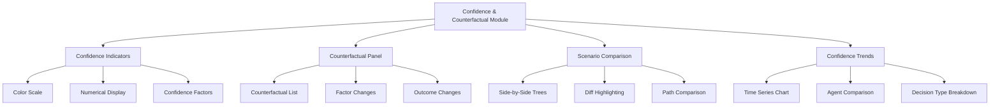

# Story 5.3: Confidence Visualization and Counterfactual Explanations

**Status:** Draft

## Non-Technical Explanation

This story focuses on creating visualizations that show how confident the AI system is in its decisions and what would have happened if different factors were present. 

Imagine you're consulting a financial advisor who doesn't just tell you "invest in this stock" but also tells you "I'm 90% confident this is the right choice based on current market conditions" and "If interest rates were 1% higher, I would have recommended bonds instead." This additional context helps you judge whether to trust the recommendation or seek more information.

Similarly, our confidence visualization will show packaging engineers exactly how certain the AI is about each decision it makes. For example, the system might be 95% confident about the installer type but only 70% confident about the best silent installation parameters. These visual indicators help engineers know which aspects might need closer human review.

The counterfactual explanations take this a step further by showing "what if" scenarios. For instance, "If the installer contained a setup.ini file instead of an MSI database, the system would have used a different installation approach." This helps engineers understand the key factors driving decisions and how sensitive those decisions are to changes in the input data.

Together, these features make the AI's decision-making more transparent and trustworthy, helping engineers know when to rely on automation and when human judgment is needed.

## Goal & Context

**User Story:** As a packaging engineer, I need to understand the AI's confidence in its decisions and how alternative factors would change outcomes.

**Context:** This story builds upon the interactive decision tree visualization (Story 5.2) by adding confidence indicators and counterfactual explanations to the visualization. This further enhances the explainability of the AI system by showing both how certain the system is about each decision and how different input factors would affect outcomes.

## Detailed Requirements

- Implement confidence indicator visualization for all AI predictions
- Create visual scale that accurately represents certainty levels
- Develop counterfactual explanation generation ("If X were different, the decision would be Y")
- Implement interactive comparison of actual versus counterfactual outcomes
- Create visualization of confidence trends over time
- Document confidence interpretation and counterfactual usage

## Acceptance Criteria (ACs)

- AC1: Confidence indicators accurately reflect actual prediction reliability
- AC2: Confidence visualization is easy to interpret at a glance
- AC3: Counterfactual explanations provide meaningful insight into decision factors
- AC4: Interactive comparisons clearly highlight differences between scenarios
- AC5: Documentation explains how to interpret and use these visualizations effectively

## Technical Implementation Context

**Guidance:** Use the following details for implementation. Refer to the linked `docs/` files for broader context if needed.

- **Relevant Files:**

  - Files to Create:
    - `frontend/src/components/visualization/ConfidenceIndicator.tsx` - Confidence visualization component
    - `frontend/src/components/visualization/CounterfactualView.tsx` - Counterfactual explanation component
    - `frontend/src/components/visualization/ScenarioComparison.tsx` - Comparison visualization
    - `frontend/src/components/visualization/ConfidenceTrend.tsx` - Confidence trend visualization
    - `frontend/src/hooks/useCounterfactuals.tsx` - Hook for counterfactual data
    - `frontend/src/utils/confidenceCalculation.ts` - Utilities for confidence calculations
    - `frontend/src/api/counterfactual.ts` - API client for counterfactual data
    - `backend/apas/api/endpoints/counterfactuals.py` - Counterfactual API endpoint
    - `backend/apas/api/schemas/counterfactuals.py` - Counterfactual API schemas
    - `backend/apas/services/counterfactuals.py` - Counterfactual service
    - `backend/apas/core/explainability/counterfactual_generator.py` - Counterfactual generation logic
  - Files to Modify:
    - `frontend/src/components/visualization/DecisionNode.tsx` - Add confidence visualization
    - `frontend/src/components/visualization/DecisionTree.tsx` - Add counterfactual integration
    - `frontend/src/components/dashboard/TaskDetailView.tsx` - Add counterfactual tab
    - `backend/apas/api/router.py` - Add counterfactual routes
    - `backend/apas/core/orchestration/decision_tracking.py` - Add confidence tracking
  - _(Hint: See `docs/architecture/project-structure.md` for overall layout)_

- **Key Technologies:**

  - D3.js for advanced visualizations
  - React 18.x for component architecture
  - TypeScript for type safety
  - Tailwind CSS for styling
  - React Query for data fetching
  - Zustand for state management
  - _(Hint: See `docs/architecture/tech-stack.md` for technology details)_

- **API Interactions / SDK Usage:**

  - Implement API endpoints for counterfactual data:
    - `GET /api/counterfactuals/{task_id}` - Get available counterfactuals for a task
    - `GET /api/counterfactuals/{task_id}/node/{node_id}` - Get counterfactuals for a specific node
    - `POST /api/counterfactuals/generate` - Generate new counterfactual explanations
  - Structure confidence data for interpretation
  - Support comparing multiple counterfactual scenarios
  - _(Hint: See `docs/architecture/api-reference.md` for API patterns)_

- **UI/UX Notes:**

  - Use intuitive visual indicators for confidence (progress bars, colors)
  - Create side-by-side views for comparing actual vs. counterfactual scenarios
  - Implement interactive elements for exploring counterfactuals
  - Use animation for transitions between scenarios
  - Provide tooltips explaining confidence metrics
  - _(Hint: See `docs/APAS_UI_UX_Specification.md` for design details)_

- **Data Structures:**

  - Enhanced `DecisionNode` schema with confidence:
    ```typescript
    interface DecisionNode {
      // Existing fields from Story 5.2
      confidence: {
        overall: number; // 0-1
        factors: {
          [factor: string]: number; // Individual confidence factors
        };
        reasoning: string;
        calibration: number; // How well past confidence scores predicted accuracy
      };
    }
    ```
  - `Counterfactual` schema:
    ```typescript
    interface Counterfactual {
      id: string;
      nodeId: string;
      description: string; // Human-readable explanation
      changedFactors: {
        factor: string;
        originalValue: any;
        counterfactualValue: any;
      }[];
      result: {
        decision: string;
        confidence: number;
        reasoning: string;
      };
      decisionTree?: Partial<DecisionTree>; // Modified subtree for visualization
    }
    ```
  - `ConfidenceTrend` schema:
    ```typescript
    interface ConfidenceTrend {
      agentType: string;
      decisionType: string;
      timePoints: {
        date: string;
        averageConfidence: number;
        accuracy: number;
        sampleSize: number;
      }[];
    }
    ```
  - _(Hint: See `docs/architecture/data-models.md` for structure details)_

- **Environment Variables:**

  - `COUNTERFACTUAL_GENERATION_LIMIT` - Max number of counterfactuals per node
  - `MIN_CONFIDENCE_THRESHOLD` - Threshold for highlighting low confidence
  - _(Hint: See `docs/architecture/environment-vars.md` for details)_

- **Coding Standards Notes:**
  - Use semantic colors for confidence levels (red/yellow/green)
  - Include accessibility considerations for color-blind users
  - Implement proper ARIA attributes for screen readers
  - Use efficient rendering for complex visualizations
  - Apply consistent interaction patterns across visualizations
  - _(Hint: See `docs/architecture/coding-standards.md` for full standards)_

## Visual Design Reference



## Tasks / Subtasks

- [ ] Enhance decision tracking with confidence metrics
  - [ ] Add confidence scoring to agent decisions
  - [ ] Implement factor-based confidence breakdown
  - [ ] Create confidence history tracking
  - [ ] Add confidence calibration metrics
- [ ] Implement confidence visualization components
  - [ ] Create basic confidence indicator component
  - [ ] Implement color-coded confidence scale
  - [ ] Develop detailed confidence breakdown view
  - [ ] Add tooltips explaining confidence factors
- [ ] Create counterfactual generation system
  - [ ] Implement counterfactual logic in backend
  - [ ] Create factor modification algorithm
  - [ ] Develop counterfactual result prediction
  - [ ] Add counterfactual storage in database
- [ ] Set up backend API endpoints
  - [ ] Create counterfactual service
  - [ ] Implement counterfactual generation endpoint
  - [ ] Create counterfactual retrieval endpoints
  - [ ] Add confidence trend endpoints
- [ ] Implement API client in frontend
  - [ ] Create API client functions
  - [ ] Implement data fetching hooks
  - [ ] Add error handling and loading states
- [ ] Develop counterfactual visualization components
  - [ ] Create counterfactual list component
  - [ ] Implement factor change visualization
  - [ ] Develop outcome change display
  - [ ] Add interactive controls for counterfactual exploration
- [ ] Create scenario comparison visualization
  - [ ] Implement side-by-side tree view
  - [ ] Create diff highlighting for changes
  - [ ] Develop path comparison visualization
  - [ ] Add animation for transitions between scenarios
- [ ] Implement confidence trend visualization
  - [ ] Create time series chart component
  - [ ] Implement agent comparison view
  - [ ] Develop decision type breakdown
  - [ ] Add trend analysis
- [ ] Integrate with decision tree visualization
  - [ ] Add confidence visualization to tree nodes
  - [ ] Implement node highlighting based on confidence
  - [ ] Create counterfactual generation from node context menu
  - [ ] Add counterfactual indicator to affected nodes
- [ ] Add interactive features
  - [ ] Implement confidence threshold filtering
  - [ ] Create interactive confidence exploration
  - [ ] Develop custom counterfactual generation
  - [ ] Add saving of interesting counterfactuals
- [ ] Create documentation
  - [ ] Document confidence interpretation guide
  - [ ] Create counterfactual usage guide
  - [ ] Develop troubleshooting guide for low confidence
  - [ ] Add API documentation

## Manual Testing Guide (For Non-Technical Users)

You can verify the confidence visualization and counterfactual explanations through these steps:

1. **Viewing Confidence Indicators**:
   - Open the application and navigate to the Dashboard
   - Select an existing packaging task
   - In the task detail view, select the "Decisions" tab
   - Look for confidence indicators on the decision nodes
   - Verify that the confidence is displayed clearly with appropriate colors
   - Try hovering over a confidence indicator to see detailed confidence information

2. **Exploring Confidence Details**:
   - Click on a decision node to select it
   - Look for the confidence breakdown in the node details panel
   - Check that the confidence factors are displayed with their individual scores
   - Verify that the confidence reasoning is clear and understandable

3. **Viewing Counterfactual Explanations**:
   - With a decision node selected, look for the "Counterfactuals" section
   - Check if there are counterfactual explanations available
   - Read a counterfactual explanation to see if it clearly explains what would change
   - Verify that the changed factors and resulting different outcomes are clearly shown

4. **Comparing Scenarios**:
   - Select a counterfactual from the list
   - Look for the scenario comparison view
   - Check that the original and counterfactual scenarios are displayed side by side
   - Verify that the differences between scenarios are highlighted clearly
   - Try navigating through the comparison to understand the changes

5. **Exploring Confidence Trends**:
   - Navigate to the "Confidence Trends" section if available
   - Check that the trend chart displays data correctly
   - Try filtering by agent type or decision type
   - Verify that the trend information is useful for understanding system reliability

6. **Testing Interactive Features**:
   - Try adjusting confidence thresholds to highlight nodes below a certain confidence
   - Try generating a new counterfactual if that option is available
   - Test any other interactive features to ensure they work correctly

## Testing Requirements

**Guidance:** Verify implementation against the ACs using the following tests.

- **Unit Tests:** 
  - Test confidence calculation algorithms
  - Test counterfactual generation logic
  - Test visualization components with various data
  - Test color scale generation
  - Verify accessibility of color choices

- **Integration Tests:** 
  - Test API endpoints for confidence and counterfactual data
  - Test integration of confidence with decision tree visualization
  - Test counterfactual generation and display flow
  - Verify confidence trend data aggregation

- **Manual Verification:** 
  - Verify confidence indicators are intuitive and meaningful
  - Check that counterfactual explanations provide useful insights
  - Test scenario comparison with complex decision trees
  - Verify color vision deficiency accommodations
  - Test performance with multiple counterfactuals

## Story Wrap Up (Agent Populates After Execution)

- **Agent Model Used:** `claude-3.7-sonnet-20250219`
- **Completion Notes:** 
- **Change Log:**
  - Initial Draft
