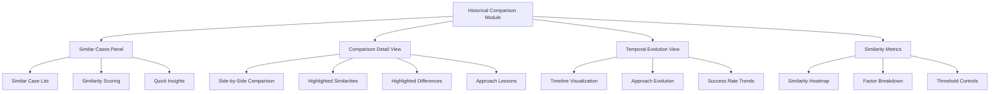

# Story 5.4: Historical Pattern Comparison

**Status:** Draft

## Non-Technical Explanation

This story is about giving packaging engineers the ability to compare current packaging tasks with similar past cases, helping them understand patterns and put current work in context.

Imagine you're a doctor examining a patient. Having access to similar past cases would be incredibly valuable—you could see what symptoms were similar, what treatments worked, and how those patients progressed. This historical context would help you make better-informed decisions about the current patient.

Similarly, our historical pattern comparison feature will show packaging engineers how the current application relates to previously packaged applications. Engineers will be able to see side-by-side comparisons showing similarities and differences between the current application and similar past ones. For example, they might see that the current application has installation characteristics similar to three previous applications and how the packaging approaches used for those applications might be relevant.

The system will also show how packaging approaches have evolved over time for similar types of applications, helping engineers understand long-term trends and improvements. This historical context helps engineers leverage past experience, identify potential issues based on historical patterns, and make more informed decisions about the current packaging task.

## Goal & Context

**User Story:** As a packaging engineer, I need to compare current packaging processes with similar historical cases to understand patterns and context.

**Context:** Building on the dashboard and visualization components from previous stories (5.1-5.3), this story adds the ability to compare current packaging tasks with similar historical cases. This feature provides valuable context by showing how similar applications were packaged in the past and how packaging approaches have evolved over time.

## Detailed Requirements

- Implement side-by-side visual comparison with similar historical packaging jobs
- Create pattern matching visualization to highlight similarities and differences
- Develop temporal view showing evolution of packaging approaches over time
- Implement filtering for different comparison criteria
- Create metrics for similarity scoring
- Document comparison methodology and interpretation

## Acceptance Criteria (ACs)

- AC1: Comparisons accurately identify genuinely similar cases
- AC2: Visualization clearly highlights relevant similarities and differences
- AC3: Temporal view effectively shows evolution of approaches
- AC4: Filtering provides useful ways to explore different comparison dimensions
- AC5: Similarity metrics correlate with actual relevance to current case

## Technical Implementation Context

**Guidance:** Use the following details for implementation. Refer to the linked `docs/` files for broader context if needed.

- **Relevant Files:**

  - Files to Create:
    - `frontend/src/components/visualization/HistoricalComparison.tsx` - Main comparison component
    - `frontend/src/components/visualization/SimilarityMatrix.tsx` - Similarity scoring visualization
    - `frontend/src/components/visualization/TemporalEvolution.tsx` - Temporal view component
    - `frontend/src/components/visualization/ComparisonFilters.tsx` - Filtering controls
    - `frontend/src/hooks/useHistoricalComparison.tsx` - Hook for comparison data
    - `frontend/src/utils/similarityCalculation.ts` - Utilities for similarity calculation
    - `frontend/src/api/historicalComparison.ts` - API client for historical data
    - `backend/apas/api/endpoints/history.py` - Historical comparison API endpoint
    - `backend/apas/api/schemas/history.py` - Historical comparison API schemas
    - `backend/apas/services/history.py` - Historical comparison service
    - `backend/apas/core/analytics/similarity_engine.py` - Similarity calculation logic
  - Files to Modify:
    - `frontend/src/components/dashboard/TaskDetailView.tsx` - Add historical comparison tab
    - `backend/apas/api/router.py` - Add historical comparison routes
    - `backend/apas/core/knowledge/package_repository.py` - Enhance with similarity search
  - _(Hint: See `docs/architecture/project-structure.md` for overall layout)_

- **Key Technologies:**

  - Vector embeddings for similarity matching
  - D3.js for advanced visualizations
  - React 18.x for component architecture
  - TypeScript for type safety
  - React Query for data fetching
  - Tailwind CSS for styling
  - _(Hint: See `docs/architecture/tech-stack.md` for technology details)_

- **API Interactions / SDK Usage:**

  - Implement API endpoints for historical comparison:
    - `GET /api/history/similar/{task_id}` - Get similar historical tasks
    - `GET /api/history/similar/{task_id}/{historical_id}` - Get detailed comparison
    - `GET /api/history/evolution/{application_type}` - Get temporal evolution data
  - Implement filtering parameters for comparison criteria
  - Support different similarity metrics and algorithms
  - _(Hint: See `docs/architecture/api-reference.md` for API patterns)_

- **UI/UX Notes:**

  - Create clean, side-by-side comparisons for easy visual parsing
  - Use highlighting to emphasize similarities and differences
  - Implement timeline visualization for temporal evolution
  - Create intuitive filtering controls for different comparison dimensions
  - Use heatmaps or similar visualizations for similarity scoring
  - _(Hint: See `docs/APAS_UI_UX_Specification.md` for design details)_

- **Data Structures:**

  - `SimilarTask` schema:
    ```typescript
    interface SimilarTask {
      id: string;
      applicationName: string;
      applicationVersion: string;
      packagedDate: string;
      similarityScore: number; // 0-1
      similarityFactors: {
        [factor: string]: number; // Individual similarity scores by factor
      };
      keyCharacteristics: string[];
      approachHighlights: string[];
    }
    ```
  - `ComparisonDetail` schema:
    ```typescript
    interface ComparisonDetail {
      currentTask: TaskSummary;
      historicalTask: TaskSummary;
      similarities: ComparisonPoint[];
      differences: ComparisonPoint[];
      approachLessons: string[];
      potentialIssues: string[];
    }
    ```
  - `ComparisonPoint` schema:
    ```typescript
    interface ComparisonPoint {
      aspect: string;
      currentValue: any;
      historicalValue: any;
      significance: number; // 0-1
      notes: string;
    }
    ```
  - `TemporalEvolution` schema:
    ```typescript
    interface TemporalEvolution {
      applicationType: string;
      timePoints: {
        date: string;
        approaches: {
          technique: string;
          frequency: number;
          successRate: number;
        }[];
        commonIssues: {
          issue: string;
          frequency: number;
        }[];
      }[];
    }
    ```
  - _(Hint: See `docs/architecture/data-models.md` for structure details)_

- **Environment Variables:**

  - `SIMILARITY_THRESHOLD` - Minimum similarity score for inclusion
  - `MAX_SIMILAR_TASKS` - Maximum number of similar tasks to display
  - `SIMILARITY_ALGORITHM` - Algorithm to use for similarity calculation
  - _(Hint: See `docs/architecture/environment-vars.md` for details)_

- **Coding Standards Notes:**
  - Implement efficient similarity calculation for large datasets
  - Create responsive visualizations that work at different screen sizes
  - Use semantic color coding for similarity and difference highlighting
  - Include proper accessibility features for all visualizations
  - Apply consistent date formatting across temporal visualizations
  - _(Hint: See `docs/architecture/coding-standards.md` for full standards)_

## Visual Design Reference



## Tasks / Subtasks

- [ ] Implement similarity engine in backend
  - [ ] Create vector embedding for package characteristics
  - [ ] Implement similarity calculation algorithms
  - [ ] Develop factor-based similarity breakdown
  - [ ] Create similarity threshold configuration
- [ ] Implement historical data repository
  - [ ] Create historical package data structure
  - [ ] Implement efficient storage and retrieval
  - [ ] Add indexing for fast similarity search
  - [ ] Develop temporal data aggregation
- [ ] Set up backend API endpoints
  - [ ] Create historical comparison service
  - [ ] Implement similar tasks endpoint
  - [ ] Create detailed comparison endpoint
  - [ ] Implement temporal evolution endpoint
  - [ ] Add endpoints to API router
- [ ] Implement API client in frontend
  - [ ] Create API client functions
  - [ ] Implement data fetching hooks
  - [ ] Add error handling and loading states
  - [ ] Create caching for comparison data
- [ ] Create similar cases panel
  - [ ] Implement similar case list component
  - [ ] Create similarity score visualization
  - [ ] Develop quick insights summary
  - [ ] Add sorting and filtering controls
- [ ] Develop detailed comparison view
  - [ ] Create side-by-side comparison component
  - [ ] Implement similarity highlighting
  - [ ] Develop difference highlighting
  - [ ] Create approach lessons display
  - [ ] Add potential issues warning
- [ ] Implement temporal evolution visualization
  - [ ] Create timeline component
  - [ ] Implement approach evolution visualization
  - [ ] Develop success rate trend display
  - [ ] Add filtering by time range
- [ ] Create similarity metrics visualization
  - [ ] Implement similarity heatmap
  - [ ] Create factor breakdown component
  - [ ] Develop threshold controls
  - [ ] Add metric explanation tooltips
- [ ] Add interactive filtering
  - [ ] Create filter controls component
  - [ ] Implement filtering by different criteria
  - [ ] Develop saved filter presets
  - [ ] Add quick filter suggestions
- [ ] Integrate with task detail view
  - [ ] Add historical comparison tab
  - [ ] Implement context loading
  - [ ] Create navigation between comparison views
  - [ ] Add deep linking to specific comparisons
- [ ] Create documentation
  - [ ] Document similarity calculation methodology
  - [ ] Create user guide for comparison features
  - [ ] Develop interpretation guide for similarity metrics
  - [ ] Add guide for applying historical lessons

## Manual Testing Guide (For Non-Technical Users)

You can verify the historical pattern comparison features through these steps:

1. **Finding Similar Cases**:
   - Open the application and navigate to the Dashboard
   - Select an existing packaging task
   - In the task detail view, select the "Historical Comparison" tab
   - Look for the similar cases panel
   - Verify that the system shows relevant similar cases with similarity scores
   - Check that the similarity scores make sense based on the application characteristics

2. **Exploring Detailed Comparisons**:
   - Select a similar case from the list to see a detailed comparison
   - Check that the side-by-side comparison clearly shows similarities and differences
   - Verify that important similarities are highlighted appropriately
   - Check that significant differences are clearly marked
   - Look for approach lessons or insights based on the historical case
   - Verify that the information is presented in a way that provides useful context

3. **Using Filtering Options**:
   - Try filtering the similar cases by different criteria
   - Check that the filtering controls work correctly
   - Verify that the filtered results make sense based on your criteria
   - Try combining multiple filters to narrow down results
   - Test resetting filters to return to the full list

4. **Viewing Temporal Evolution**:
   - Navigate to the temporal evolution view
   - Check that the timeline visualization works correctly
   - Verify that you can see how approaches have evolved over time
   - Try filtering by different time ranges
   - Look for trends in success rates or common issues
   - Verify that the temporal information provides useful context

5. **Examining Similarity Metrics**:
   - Look for the similarity metrics visualization
   - Check that the heatmap or other visualization shows similarity factors clearly
   - Try adjusting similarity thresholds if that option is available
   - Verify that the metric explanation makes sense and helps with interpretation

## Testing Requirements

**Guidance:** Verify implementation against the ACs using the following tests.

- **Unit Tests:** 
  - Test similarity calculation algorithms
  - Test temporal data aggregation
  - Test visualization components with varied data
  - Test filtering logic
  - Verify similarity threshold functions

- **Integration Tests:** 
  - Test API endpoints return appropriate similar cases
  - Test detailed comparison data generation
  - Test temporal evolution data aggregation
  - Verify integration with knowledge repository
  - Test end-to-end workflow from selection to comparison

- **Manual Verification:** 
  - Verify similar cases are genuinely relevant
  - Check visualization clarity for similarities and differences
  - Test temporal view with various data patterns
  - Verify filter effectiveness for different criteria
  - Test with edge cases (very similar or very different applications)

## Story Wrap Up (Agent Populates After Execution)

- **Agent Model Used:** `claude-3.7-sonnet-20250219`
- **Completion Notes:** 
- **Change Log:**
  - Initial Draft
