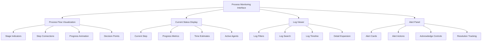

# Story 5.5: Process Monitoring Interface

**Status:** Draft

## Non-Technical Explanation

This story focuses on creating a detailed monitoring interface that shows packaging engineers exactly what's happening during automated packaging processes. 

Think of it like a cockpit view in a flight simulator, where you can see all the gauges, indicators, and system statuses in real-time. Instead of just seeing a progress bar moving from 0% to 100%, you'll be able to see each step of the process as it happens—the installer being analyzed, decisions being made about installation parameters, PowerShell scripts being generated, WDAC policies being created and tested, and more.

What makes this monitoring interface special is that it doesn't just show what's happening, but also why. When the system decides to use a particular installation parameter, you'll see the reasoning behind that decision. When it detects a potential issue, you'll see what factors triggered the warning. This transparency helps packaging engineers understand and trust the automation process.

The interface also includes comprehensive logging with context, so you can review what happened at each stage and understand the decision-making process. This is particularly valuable for debugging issues or understanding why the system took a certain approach. It's like having a detailed flight recorder that captures not just what happened but the reasoning behind each action.

## Goal & Context

**User Story:** As a packaging engineer, I need detailed monitoring capabilities for automated processes with explainable visualizations to understand system operations.

**Context:** Building on the dashboard (Story 5.1) and visualization components (Stories 5.2-5.4), this story creates a detailed process monitoring interface that shows real-time progress of packaging operations along with explainable visualizations of the system's decision-making process.

## Detailed Requirements

- Implement real-time process monitoring views
- Create interactive visualization of process steps and stages
- Develop explainable display of critical decision points
- Implement log viewing and filtering with decision context
- Create alerting for process issues with explanation of causes
- Integrate decision visualization with process monitoring
- Document monitoring capabilities and interpretation

## Acceptance Criteria (ACs)

- AC1: Monitoring view shows real-time process information with decision context
- AC2: Visualization clearly illustrates process flow and reasoning
- AC3: Decision points are highlighted with interactive explanations
- AC4: Log viewing provides filtered access to process details with decision context
- AC5: Alerts effectively notify of important issues with clear explanations

## Technical Implementation Context

**Guidance:** Use the following details for implementation. Refer to the linked `docs/` files for broader context if needed.

- **Relevant Files:**

  - Files to Create:
    - `frontend/src/components/monitoring/ProcessMonitor.tsx` - Main monitoring component
    - `frontend/src/components/monitoring/ProcessStepVisualizer.tsx` - Step visualization
    - `frontend/src/components/monitoring/DecisionPointDisplay.tsx` - Decision point display
    - `frontend/src/components/monitoring/LogViewer.tsx` - Log viewing component
    - `frontend/src/components/monitoring/AlertBanner.tsx` - Alert notification component
    - `frontend/src/hooks/useProcessMonitoring.tsx` - Process monitoring hook
    - `frontend/src/utils/logParser.ts` - Utilities for log parsing and filtering
    - `frontend/src/api/monitoring.ts` - API client for monitoring data
    - `backend/apas/api/endpoints/monitoring.py` - Monitoring API endpoint
    - `backend/apas/api/schemas/monitoring.py` - Monitoring API schemas
    - `backend/apas/services/monitoring.py` - Monitoring service
    - `backend/apas/core/monitoring/process_tracker.py` - Process tracking implementation
  - Files to Modify:
    - `frontend/src/components/dashboard/TaskDetailView.tsx` - Add monitoring tab
    - `backend/apas/api/router.py` - Add monitoring routes
    - `backend/apas/core/orchestration/mediator.py` - Enhance with detailed event tracking
    - `backend/apas/core/event_bus/event_bus.py` - Add monitoring event publishing
  - _(Hint: See `docs/architecture/project-structure.md` for overall layout)_

- **Key Technologies:**

  - WebSockets for real-time updates
  - D3.js for interactive process visualization
  - React 18.x for component architecture
  - TypeScript for type safety
  - Tailwind CSS for styling
  - React Query for data fetching
  - _(Hint: See `docs/architecture/tech-stack.md` for technology details)_

- **API Interactions / SDK Usage:**

  - Implement API endpoints for monitoring data:
    - `GET /api/monitoring/tasks/{task_id}` - Get current process state
    - `GET /api/monitoring/tasks/{task_id}/logs` - Get process logs
    - `GET /api/monitoring/tasks/{task_id}/decisions` - Get decision points
    - `WebSocket /ws/monitoring/tasks/{task_id}` - Real-time process updates
  - Implement filtering parameters for log viewing
  - Support event sourcing pattern for state reconstruction
  - _(Hint: See `docs/architecture/api-reference.md` for API patterns)_

- **UI/UX Notes:**

  - Create clear process flow visualization with distinct stages
  - Use animation for real-time updates without being distracting
  - Implement interactive elements for exploring decision points
  - Create color coding for different log types and severity levels
  - Provide filtering and search capabilities for logs
  - _(Hint: See `docs/APAS_UI_UX_Specification.md` for design details)_

- **Data Structures:**

  - `ProcessState` schema:
    ```typescript
    interface ProcessState {
      taskId: string;
      status: 'initializing' | 'running' | 'paused' | 'completed' | 'failed';
      currentStage: string;
      currentStep: string;
      progress: number; // 0-100
      startTime: string;
      estimatedCompletionTime?: string;
      activeAgents: string[];
      lastUpdateTime: string;
      alerts: ProcessAlert[];
      metrics: {
        [key: string]: number;
      };
    }
    ```
  - `ProcessStep` schema:
    ```typescript
    interface ProcessStep {
      id: string;
      taskId: string;
      stage: string;
      name: string;
      status: 'pending' | 'in-progress' | 'completed' | 'failed' | 'skipped';
      startTime?: string;
      endTime?: string;
      duration?: number; // in milliseconds
      agent: string;
      dependencies: string[]; // IDs of steps this step depends on
      outputs?: {
        [key: string]: any;
      };
      decisionPoints?: string[]; // IDs of associated decision points
    }
    ```
  - `ProcessLog` schema:
    ```typescript
    interface ProcessLog {
      id: string;
      taskId: string;
      timestamp: string;
      level: 'debug' | 'info' | 'warning' | 'error';
      agent: string;
      stage: string;
      step: string;
      message: string;
      details?: {
        [key: string]: any;
      };
      decisionId?: string; // ID of associated decision if relevant
    }
    ```
  - `ProcessAlert` schema:
    ```typescript
    interface ProcessAlert {
      id: string;
      taskId: string;
      timestamp: string;
      level: 'info' | 'warning' | 'error';
      title: string;
      message: string;
      source: string;
      details?: {
        [key: string]: any;
      };
      recommended_actions?: string[];
      acknowledged: boolean;
      resolved: boolean;
    }
    ```
  - _(Hint: See `docs/architecture/data-models.md` for structure details)_

- **Environment Variables:**

  - `PROCESS_LOGGING_LEVEL` - Detail level for process logs
  - `WEBSOCKET_UPDATE_INTERVAL` - Interval for WebSocket updates
  - `MAX_LOG_ENTRIES` - Maximum log entries to return
  - _(Hint: See `docs/architecture/environment-vars.md` for details)_

- **Coding Standards Notes:**
  - Implement efficient WebSocket connection management
  - Use virtualization for large log lists
  - Create responsive visualizations that work at different screen sizes
  - Implement proper error handling for WebSocket disconnections
  - Use semantic logging levels consistently
  - _(Hint: See `docs/architecture/coding-standards.md` for full standards)_

## Visual Design Reference



## Tasks / Subtasks

- [ ] Implement backend process tracking
  - [ ] Create process tracking service
  - [ ] Implement detailed event logging
  - [ ] Develop state management for process tracking
  - [ ] Add metrics collection
  - [ ] Create alert generation logic
- [ ] Set up real-time communication
  - [ ] Implement WebSocket server
  - [ ] Create event subscription system
  - [ ] Develop state synchronization
  - [ ] Add reconnection handling
  - [ ] Implement event batching for efficiency
- [ ] Create backend API endpoints
  - [ ] Implement process state endpoint
  - [ ] Create log retrieval endpoint
  - [ ] Develop decision point endpoint
  - [ ] Add WebSocket endpoint for real-time updates
  - [ ] Implement alert management endpoints
- [ ] Implement API client in frontend
  - [ ] Create API client functions
  - [ ] Implement WebSocket connection management
  - [ ] Develop state synchronization logic
  - [ ] Add error handling and reconnection
  - [ ] Create data transformation utilities
- [ ] Develop process visualization components
  - [ ] Create process flow visualization
  - [ ] Implement stage and step visualization
  - [ ] Develop progress indicators
  - [ ] Create animation for active steps
  - [ ] Add decision point indicators
- [ ] Implement current status display
  - [ ] Create current step component
  - [ ] Implement progress metrics
  - [ ] Develop time estimation
  - [ ] Add active agent visualization
  - [ ] Create status summary
- [ ] Create log viewer component
  - [ ] Implement log display with virtualization
  - [ ] Create log filtering controls
  - [ ] Develop log search functionality
  - [ ] Add log detail expansion
  - [ ] Create log timeline visualization
- [ ] Implement alert system
  - [ ] Create alert notification component
  - [ ] Implement alert detail view
  - [ ] Develop alert acknowledgment
  - [ ] Add resolution tracking
  - [ ] Create alert filtering
- [ ] Add interactive decision exploration
  - [ ] Implement decision point highlighting
  - [ ] Create decision detail display
  - [ ] Develop context linking between logs and decisions
  - [ ] Add confidence visualization integration
- [ ] Integrate with decision visualization
  - [ ] Link monitoring view with decision tree
  - [ ] Create context preservation between views
  - [ ] Implement synchronized highlighting
  - [ ] Add navigation between related components
- [ ] Create documentation
  - [ ] Document monitoring capabilities
  - [ ] Create log interpretation guide
  - [ ] Develop alert response guidelines
  - [ ] Add troubleshooting documentation

## Manual Testing Guide (For Non-Technical Users)

You can verify the process monitoring interface through these steps:

1. **Accessing the Monitoring Interface**:
   - Open the application and navigate to the Dashboard
   - Select an active packaging task
   - In the task detail view, select the "Monitoring" tab
   - Verify that the monitoring interface loads with the current process state

2. **Viewing Process Flow**:
   - Check that the process flow visualization shows the overall packaging process
   - Verify that the current stage and step are clearly highlighted
   - Watch for real-time updates as the process progresses
   - Try interacting with different stages and steps to see more information

3. **Exploring Decision Points**:
   - Look for decision point indicators in the process flow
   - Click on a decision point to see detailed information
   - Verify that the decision explanation is clear and understandable
   - Check that you can see the factors that influenced the decision

4. **Viewing Logs**:
   - Check that the log viewer shows process logs with appropriate detail
   - Try filtering logs by level (debug, info, warning, error)
   - Try filtering logs by stage or agent
   - Search for specific terms in the logs
   - Click on a log entry to see more details
   - Verify that decision-related logs link to the relevant decision points

5. **Handling Alerts**:
   - If any alerts are present, check that they are clearly displayed
   - Verify that alert information includes useful explanation of the issue
   - Try acknowledging an alert if that functionality is available
   - Check that alerts with different severity levels are appropriately distinguished

6. **Testing Real-Time Updates**:
   - Watch the interface as the process progresses
   - Verify that updates appear in real-time without requiring manual refresh
   - Check that the progress indicators update correctly
   - Verify that completed steps are marked appropriately

## Testing Requirements

**Guidance:** Verify implementation against the ACs using the following tests.

- **Unit Tests:** 
  - Test process tracking state management
  - Test log filtering and search functions
  - Test visualization components with various data
  - Test WebSocket connection handling
  - Verify alert generation and management

- **Integration Tests:** 
  - Test end-to-end process tracking
  - Test WebSocket communication
  - Test integration between process tracking and decision tracking
  - Verify log collection and retrieval
  - Test alert system workflow

- **Manual Verification:** 
  - Verify real-time updates work correctly
  - Check visualization clarity and intuitiveness
  - Test with complex multi-stage processes
  - Verify performance with large log volumes
  - Test alert notification effectiveness

## Story Wrap Up (Agent Populates After Execution)

- **Agent Model Used:** `claude-3.7-sonnet-20250219`
- **Completion Notes:** 
- **Change Log:**
  - Initial Draft
