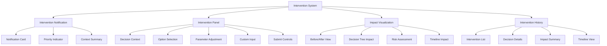

# Story 5.6: Manual Intervention Controls

**Status:** Draft

## Non-Technical Explanation

This story focuses on creating the controls that allow packaging engineers to step in and guide the automation system when needed. 

Imagine you're using a GPS navigation system that can usually drive your car automatically, but occasionally it encounters a situation it's not confident about—like an unmarked construction zone or an unusual intersection. In those cases, the system would alert you, explain why it's uncertain, and ask for your guidance before proceeding.

Similarly, our manual intervention controls create specific points in the automated packaging process where human expertise can be applied. The system will identify situations where it lacks confidence or where human judgment would be valuable, pause the process, and present the situation with clear context about what's happening and why intervention might be necessary.

For example, if the system is uncertain about the correct installation parameters for an unusual installer, it might pause, show you its analysis so far, explain why it's uncertain, and present options for how to proceed. You'll be able to see how your intervention will impact the rest of the process, with the system showing you the predicted outcomes of different choices.

These intervention controls ensure that human expertise is applied precisely where it's most valuable, while still allowing automation to handle the routine aspects of packaging. This creates an effective partnership between human engineers and the AI system.

## Goal & Context

**User Story:** As a packaging engineer, I need to intervene in automated processes with clear understanding of decision context and impact.

**Context:** Building on the process monitoring interface (Story 5.5) and decision visualization components (Stories 5.2-5.4), this story implements the controls and interfaces that allow packaging engineers to intervene in the automated process when necessary. This creates an effective human-in-the-loop system where automation handles routine tasks but human expertise can be applied precisely where needed.

## Detailed Requirements

- Implement identification of intervention points with decision context
- Create intervention interfaces with explanation of why intervention is needed
- Develop guidance for intervention decisions with predicted outcomes
- Implement visualization of intervention impact on the decision tree
- Create documentation of intervention impact with before/after comparison
- Document intervention capabilities and best practices

## Acceptance Criteria (ACs)

- AC1: System correctly identifies situations requiring intervention with clear explanations
- AC2: Interfaces provide appropriate controls with context for each intervention type
- AC3: Guidance helps engineers make informed decisions with predictive visualization
- AC4: Tracking maintains record of all interventions with decision context
- AC5: Documentation clearly shows impact of interventions with visual comparison

## Technical Implementation Context

**Guidance:** Use the following details for implementation. Refer to the linked `docs/` files for broader context if needed.

- **Relevant Files:**

  - Files to Create:
    - `frontend/src/components/intervention/InterventionPanel.tsx` - Main intervention component
    - `frontend/src/components/intervention/InterventionControls.tsx` - Control interface
    - `frontend/src/components/intervention/DecisionGuidance.tsx` - Decision guidance component
    - `frontend/src/components/intervention/ImpactVisualization.tsx` - Impact visualization
    - `frontend/src/components/intervention/InterventionHistory.tsx` - Intervention history
    - `frontend/src/hooks/useIntervention.tsx` - Intervention management hook
    - `frontend/src/utils/interventionImpact.ts` - Impact calculation utilities
    - `frontend/src/api/intervention.ts` - API client for intervention
    - `backend/apas/api/endpoints/intervention.py` - Intervention API endpoint
    - `backend/apas/api/schemas/intervention.py` - Intervention API schemas
    - `backend/apas/services/intervention.py` - Intervention service
    - `backend/apas/core/orchestration/intervention_manager.py` - Intervention management
  - Files to Modify:
    - `frontend/src/components/dashboard/TaskDetailView.tsx` - Add intervention tab/panel
    - `frontend/src/components/monitoring/ProcessMonitor.tsx` - Add intervention triggers
    - `backend/apas/api/router.py` - Add intervention routes
    - `backend/apas/core/orchestration/mediator.py` - Add intervention pausing
    - `backend/apas/core/agents/base.py` - Add intervention points
  - _(Hint: See `docs/architecture/project-structure.md` for overall layout)_

- **Key Technologies:**

  - WebSockets for real-time communication
  - React 18.x for component architecture
  - TypeScript for type safety
  - Tailwind CSS and shadcn/ui for UI components
  - React Query for data fetching
  - D3.js for impact visualization
  - _(Hint: See `docs/architecture/tech-stack.md` for technology details)_

- **API Interactions / SDK Usage:**

  - Implement API endpoints for intervention:
    - `GET /api/intervention/points/{task_id}` - Get intervention points
    - `GET /api/intervention/point/{point_id}` - Get intervention point details
    - `POST /api/intervention/decide/{point_id}` - Submit intervention decision
    - `GET /api/intervention/impact/{point_id}/{option_id}` - Get predicted impact
    - `GET /api/intervention/history/{task_id}` - Get intervention history
    - `WebSocket /ws/intervention/{task_id}` - Real-time intervention notifications
  - Support different intervention types (approval, selection, parameter adjustment)
  - Enable cancellation and resumption of processes
  - _(Hint: See `docs/architecture/api-reference.md` for API patterns)_

- **UI/UX Notes:**

  - Create clear, focused intervention interfaces that highlight needed decisions
  - Use visual indicators for confidence and uncertainty
  - Implement side-by-side comparisons for decision options
  - Provide "quick action" options for common interventions
  - Create visual feedback for intervention impacts
  - _(Hint: See `docs/APAS_UI_UX_Specification.md` for design details)_

- **Data Structures:**

  - `InterventionPoint` schema:
    ```typescript
    interface InterventionPoint {
      id: string;
      taskId: string;
      timestamp: string;
      type: 'approval' | 'selection' | 'parameter' | 'decision' | 'error';
      status: 'pending' | 'in-progress' | 'completed' | 'cancelled';
      stage: string;
      agent: string;
      title: string;
      description: string;
      context: {
        [key: string]: any; // Context-specific data
      };
      options?: InterventionOption[];
      parameters?: InterventionParameter[];
      decisionId?: string; // ID of associated decision point
      timeoutAt?: string; // When system will use default if no intervention
      priority: 'low' | 'medium' | 'high' | 'critical';
    }
    ```
  - `InterventionOption` schema:
    ```typescript
    interface InterventionOption {
      id: string;
      label: string;
      description: string;
      isDefault: boolean;
      confidence: number; // 0-1
      impact: {
        description: string;
        severity: 'low' | 'medium' | 'high';
        affectedComponents: string[];
      };
    }
    ```
  - `InterventionParameter` schema:
    ```typescript
    interface InterventionParameter {
      id: string;
      name: string;
      description: string;
      type: 'string' | 'number' | 'boolean' | 'select';
      defaultValue: any;
      currentValue: any;
      options?: { label: string; value: any }[]; // For select type
      constraints?: {
        min?: number;
        max?: number;
        pattern?: string;
        required?: boolean;
      };
    }
    ```
  - `InterventionDecision` schema:
    ```typescript
    interface InterventionDecision {
      pointId: string;
      timestamp: string;
      userId: string;
      selectedOptionId?: string;
      parameterValues?: {
        [parameterId: string]: any;
      };
      customValue?: any; // For custom input
      notes?: string; // Engineer's notes on decision
    }
    ```
  - `InterventionImpact` schema:
    ```typescript
    interface InterventionImpact {
      optionId: string;
      impactDescription: string;
      modifiedDecisionTree?: Partial<DecisionTree>; // How decision tree would change
      predictedOutcomes: {
        component: string;
        outcome: string;
        confidence: number;
      }[];
      risks: {
        description: string;
        probability: number; // 0-1
        severity: 'low' | 'medium' | 'high';
      }[];
    }
    ```
  - _(Hint: See `docs/architecture/data-models.md` for structure details)_

- **Environment Variables:**

  - `INTERVENTION_CONFIDENCE_THRESHOLD` - Confidence threshold for automatic intervention
  - `INTERVENTION_TIMEOUT_DEFAULT` - Default timeout for intervention points
  - `MAX_PARALLEL_INTERVENTIONS` - Maximum number of parallel intervention points
  - _(Hint: See `docs/architecture/environment-vars.md` for details)_

- **Coding Standards Notes:**
  - Implement clear error handling for failed interventions
  - Create responsive designs that work on different devices
  - Use consistent patterns for different intervention types
  - Apply proper focus management for accessibility
  - Implement form validation for parameter inputs
  - _(Hint: See `docs/architecture/coding-standards.md` for full standards)_

## Visual Design Reference



## Tasks / Subtasks

- [ ] Implement intervention points in agent system
  - [ ] Create intervention point identification
  - [ ] Implement process pausing mechanism
  - [ ] Develop confidence-based intervention triggers
  - [ ] Add timeout handling for interventions
  - [ ] Create intervention priority system
- [ ] Implement impact prediction
  - [ ] Create option impact prediction
  - [ ] Implement decision tree modification preview
  - [ ] Develop risk assessment for options
  - [ ] Add timeline impact prediction
  - [ ] Create visualization of predicted outcomes
- [ ] Set up backend API endpoints
  - [ ] Create intervention service
  - [ ] Implement intervention point endpoints
  - [ ] Develop decision submission endpoint
  - [ ] Add impact prediction endpoint
  - [ ] Create history tracking endpoint
  - [ ] Implement WebSocket notification endpoint
- [ ] Implement API client in frontend
  - [ ] Create API client functions
  - [ ] Implement WebSocket connection for notifications
  - [ ] Develop data fetching hooks
  - [ ] Add error handling and recovery
  - [ ] Create caching for intervention data
- [ ] Create notification system
  - [ ] Implement intervention notification component
  - [ ] Create priority visualization
  - [ ] Develop context summary display
  - [ ] Add notification sound/visual cues
  - [ ] Implement notification management
- [ ] Develop intervention panel
  - [ ] Create decision context visualization
  - [ ] Implement option selection interface
  - [ ] Develop parameter adjustment controls
  - [ ] Add custom input capabilities
  - [ ] Create submission controls with validation
- [ ] Implement impact visualization
  - [ ] Create before/after comparison view
  - [ ] Implement decision tree impact visualization
  - [ ] Develop risk assessment display
  - [ ] Add timeline impact visualization
  - [ ] Create real-time impact preview
- [ ] Create intervention history tracking
  - [ ] Implement intervention history list
  - [ ] Create decision detail view
  - [ ] Develop impact summary visualization
  - [ ] Add timeline view of interventions
  - [ ] Create filtering and search for history
- [ ] Integrate with monitoring interface
  - [ ] Add intervention triggers to process monitoring
  - [ ] Implement seamless context transition
  - [ ] Create highlighting of intervention points
  - [ ] Develop status indicators for interventions
- [ ] Create documentation
  - [ ] Document intervention capabilities
  - [ ] Create best practices guide
  - [ ] Develop troubleshooting documentation
  - [ ] Add impact interpretation guide

## Manual Testing Guide (For Non-Technical Users)

You can verify the manual intervention controls through these steps:

1. **Receiving Intervention Notifications**:
   - Start or monitor an active packaging task
   - Wait for an intervention notification or trigger one (if test controls are available)
   - Verify that you receive a clear notification when intervention is needed
   - Check that the notification includes priority information and context summary
   - Confirm that clicking the notification takes you to the intervention panel

2. **Using the Intervention Panel**:
   - Open the intervention panel from a notification or from the task monitoring view
   - Verify that the panel clearly explains why intervention is needed
   - Check that you can see the context information relevant to the decision
   - Try viewing different option details if multiple options are available
   - For parameter adjustments, try changing parameters and see if validation works correctly

3. **Exploring Impact Visualization**:
   - When viewing intervention options, check that impact visualization is available
   - Try selecting different options to see how the impact visualization changes
   - Verify that the before/after comparison clearly shows differences
   - Check that risk assessments are provided for different options
   - For parameter adjustments, try changing values to see how it affects the predicted impact

4. **Making and Submitting Decisions**:
   - Select an option or adjust parameters based on your judgment
   - Add notes explaining your decision if that feature is available
   - Submit your decision using the appropriate controls
   - Verify that the system acknowledges your decision
   - Check that the process continues after your intervention

5. **Viewing Intervention History**:
   - Navigate to the intervention history view
   - Look for your recent intervention in the history list
   - Select the intervention to view details
   - Verify that the history shows what decision was made and why
   - Check that impact summary information is available

6. **Testing Different Intervention Types**:
   - If possible, try to test different types of interventions:
     - Simple approval (yes/no decision)
     - Option selection (choosing from multiple options)
     - Parameter adjustment (changing configuration values)
     - Error handling (responding to an error condition)
   - Verify that each type provides appropriate context and controls

## Testing Requirements

**Guidance:** Verify implementation against the ACs using the following tests.

- **Unit Tests:** 
  - Test intervention point identification logic
  - Test impact prediction algorithms
  - Test intervention UI components with various data
  - Test parameter validation
  - Verify notification priority logic

- **Integration Tests:** 
  - Test end-to-end intervention workflow
  - Test process pausing and resumption
  - Test WebSocket notification delivery
  - Verify intervention history recording
  - Test timeout handling

- **Manual Verification:** 
  - Verify intervention explanations are clear and helpful
  - Check that impact visualizations accurately represent outcomes
  - Test with different intervention types and scenarios
  - Verify usability on different devices
  - Test multiple concurrent interventions if supported

## Story Wrap Up (Agent Populates After Execution)

- **Agent Model Used:** `claude-3.7-sonnet-20250219`
- **Completion Notes:** 
- **Change Log:**
  - Initial Draft
