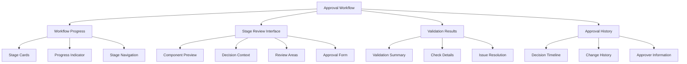

# Story 5.7: Approval Workflow with Decision Validation

**Status:** Draft

## Non-Technical Explanation

This story focuses on creating a structured process for packaging engineers to review and approve the final results of automated packaging before they're deployed to production systems.

Think of it like a quality control checkpoint at the end of a manufacturing process. Even though automated systems have done most of the work, a human expert reviews the final product to ensure everything meets standards before it goes out the door. Unlike ad-hoc interventions (which happen during the process when the system encounters uncertainty), this approval workflow is a deliberate, consistent review step that happens for every package.

The approval workflow will guide engineers through reviewing each aspect of the package—the installer analysis, the deployment script, the security policy, and the documentation—with visualizations showing how the system made decisions for each component. The workflow will highlight key points that need validation, show confidence levels for various aspects, and provide context to help engineers make informed decisions.

For example, the system might highlight that it's highly confident about the installation parameters but less certain about a security policy exception, helping the engineer focus their attention where human judgment is most valuable. When engineers approve or modify a component, the system tracks those decisions with the context, creating an audit trail of the approval process.

This structured approach ensures thorough validation while making the process as efficient as possible—helping engineers focus on the aspects that matter most rather than manually reviewing every detail.

## Goal & Context

**User Story:** As a packaging engineer, I need a structured approval workflow with clear visualization of AI decisions to effectively validate packaging results.

**Context:** Building on the dashboard (Story 5.1), decision visualization (Stories 5.2-5.4), and intervention capabilities (Story 5.6), this story implements a structured approval workflow for validating completed packaging tasks before deployment. This ensures human oversight of the final results while maintaining efficiency.

## Detailed Requirements

- Implement multi-stage approval process with decision context for each stage
- Create review interfaces with interactive decision visualization
- Develop approval validation with confidence indicators
- Implement tracking of approval decisions with decision context
- Create documentation of approval history with decision rationale
- Document workflow stages and decision validation requirements

## Acceptance Criteria (ACs)

- AC1: Approval process covers all critical packaging components with decision visualization
- AC2: Review interfaces provide interactive decision context for informed decisions
- AC3: Validation ensures all requirements are met with confidence indicators
- AC4: Tracking maintains complete audit trail of approvals with decision context
- AC5: Documentation provides visual context for approval decisions

## Technical Implementation Context

**Guidance:** Use the following details for implementation. Refer to the linked `docs/` files for broader context if needed.

- **Relevant Files:**

  - Files to Create:
    - `frontend/src/components/approval/ApprovalWorkflow.tsx` - Main approval workflow component
    - `frontend/src/components/approval/ApprovalStageCard.tsx` - Stage card component
    - `frontend/src/components/approval/ComponentReview.tsx` - Component review interface
    - `frontend/src/components/approval/ValidationChecklist.tsx` - Validation checklist component
    - `frontend/src/components/approval/ApprovalHistory.tsx` - Approval history component
    - `frontend/src/hooks/useApprovalWorkflow.tsx` - Approval workflow hook
    - `frontend/src/utils/validationChecks.ts` - Validation utility functions
    - `frontend/src/api/approval.ts` - API client for approval workflow
    - `backend/apas/api/endpoints/approval.py` - Approval API endpoint
    - `backend/apas/api/schemas/approval.py` - Approval API schemas
    - `backend/apas/services/approval.py` - Approval service
    - `backend/apas/core/validation/validator.py` - Validation engine
  - Files to Modify:
    - `frontend/src/components/dashboard/TaskDetailView.tsx` - Add approval tab
    - `frontend/src/components/dashboard/TaskList.tsx` - Add pending approval filter
    - `backend/apas/api/router.py` - Add approval routes
    - `backend/apas/core/orchestration/mediator.py` - Add approval stage
  - _(Hint: See `docs/architecture/project-structure.md` for overall layout)_

- **Key Technologies:**

  - React 18.x for component architecture
  - TypeScript for type safety
  - Tailwind CSS and shadcn/ui for UI components
  - React Query for data fetching
  - Stepper component for workflow progression
  - _(Hint: See `docs/architecture/tech-stack.md` for technology details)_

- **API Interactions / SDK Usage:**

  - Implement API endpoints for approval workflow:
    - `GET /api/approval/tasks/{task_id}` - Get approval workflow state
    - `GET /api/approval/tasks/{task_id}/stage/{stage_id}` - Get stage details
    - `POST /api/approval/tasks/{task_id}/stage/{stage_id}` - Submit stage approval
    - `GET /api/approval/tasks/{task_id}/validation` - Get validation results
    - `GET /api/approval/tasks/{task_id}/history` - Get approval history
  - Support different approval decisions (approve, reject, approve with changes)
  - Enable comments and annotations on approvals
  - _(Hint: See `docs/architecture/api-reference.md` for API patterns)_

- **UI/UX Notes:**

  - Create clear workflow progression visualization
  - Use color coding for approval status
  - Implement side-by-side views for review and context
  - Provide clear validation feedback
  - Create visual cues for areas needing attention
  - _(Hint: See `docs/APAS_UI_UX_Specification.md` for design details)_

- **Data Structures:**

  - `ApprovalWorkflow` schema:
    ```typescript
    interface ApprovalWorkflow {
      taskId: string;
      status: 'not_started' | 'in_progress' | 'completed' | 'rejected';
      currentStage: string;
      stages: ApprovalStage[];
      startedAt?: string;
      completedAt?: string;
      assignedTo?: string;
      validationStatus: 'pending' | 'passed' | 'failed';
      validationResults?: ValidationResult[];
    }
    ```
  - `ApprovalStage` schema:
    ```typescript
    interface ApprovalStage {
      id: string;
      name: string;
      description: string;
      status: 'pending' | 'in_progress' | 'approved' | 'rejected' | 'approved_with_changes';
      component: 'installer' | 'psadt' | 'wdac' | 'documentation' | 'testing' | 'final';
      confidence: number; // 0-1
      reviewAreas: {
        id: string;
        name: string;
        description: string;
        status: 'pending' | 'reviewed' | 'needs_attention';
        confidence: number; // 0-1
        decisionIds?: string[]; // Associated decision points
      }[];
      validationChecks: {
        id: string;
        description: string;
        status: 'pending' | 'passed' | 'failed' | 'warning';
        details?: string;
      }[];
      startedAt?: string;
      completedAt?: string;
      approvalDecision?: ApprovalDecision;
    }
    ```
  - `ApprovalDecision` schema:
    ```typescript
    interface ApprovalDecision {
      decision: 'approve' | 'reject' | 'approve_with_changes';
      userId: string;
      timestamp: string;
      comments?: string;
      changes?: {
        field: string;
        originalValue: any;
        newValue: any;
        reason: string;
      }[];
      attachments?: {
        id: string;
        name: string;
        type: string;
        url: string;
      }[];
    }
    ```
  - `ValidationResult` schema:
    ```typescript
    interface ValidationResult {
      id: string;
      category: string;
      name: string;
      description: string;
      status: 'passed' | 'failed' | 'warning';
      details?: string;
      component: string;
      severity: 'low' | 'medium' | 'high' | 'critical';
    }
    ```
  - _(Hint: See `docs/architecture/data-models.md` for structure details)_

- **Environment Variables:**

  - `APPROVAL_REQUIRED_ROLES` - Roles authorized to approve packages
  - `APPROVAL_VALIDATION_LEVEL` - Validation strictness level
  - `MIN_APPROVAL_CONFIDENCE` - Minimum confidence threshold for auto-approval
  - _(Hint: See `docs/architecture/environment-vars.md` for details)_

- **Coding Standards Notes:**
  - Implement clear status indicators at each stage
  - Create responsive designs that work on different devices
  - Use semantic HTML for forms and validation
  - Apply proper focus management for accessibility
  - Implement form validation for comments and changes
  - _(Hint: See `docs/architecture/coding-standards.md` for full standards)_

## Visual Design Reference



## Tasks / Subtasks

- [ ] Implement validation engine in backend
  - [ ] Create component-specific validation rules
  - [ ] Implement rule execution engine
  - [ ] Develop validation result aggregation
  - [ ] Add confidence-based validation
  - [ ] Create custom validation rule support
- [ ] Set up approval workflow management
  - [ ] Create workflow state tracking
  - [ ] Implement stage progression logic
  - [ ] Develop approval decision recording
  - [ ] Add change tracking for modifications
  - [ ] Create workflow assignment and ownership
- [ ] Create backend API endpoints
  - [ ] Implement workflow status endpoint
  - [ ] Create stage detail endpoint
  - [ ] Develop approval submission endpoint
  - [ ] Add validation results endpoint
  - [ ] Implement history tracking endpoint
- [ ] Implement API client in frontend
  - [ ] Create API client functions
  - [ ] Implement data fetching hooks
  - [ ] Develop state management for workflow
  - [ ] Add error handling and recovery
  - [ ] Create optimistic updates for better UX
- [ ] Develop workflow progress visualization
  - [ ] Create stage card components
  - [ ] Implement progress indicator
  - [ ] Develop stage navigation
  - [ ] Add status visualization
  - [ ] Create responsive layout for different devices
- [ ] Implement stage review interface
  - [ ] Create component preview with context
  - [ ] Implement decision visualization integration
  - [ ] Develop review area highlighting
  - [ ] Add confidence visualization
  - [ ] Create review checklist
- [ ] Create approval forms
  - [ ] Implement approval decision controls
  - [ ] Create rejection workflow
  - [ ] Develop change submission interface
  - [ ] Add comment and annotation capabilities
  - [ ] Implement attachment support
- [ ] Implement validation visualization
  - [ ] Create validation summary component
  - [ ] Implement check detail visualization
  - [ ] Develop issue resolution workflow
  - [ ] Add severity indication
  - [ ] Create action recommendations
- [ ] Create approval history tracking
  - [ ] Implement decision timeline
  - [ ] Create change history visualization
  - [ ] Develop approver information display
  - [ ] Add comparison between versions
  - [ ] Create filtering and search for history
- [ ] Integrate with dashboard
  - [ ] Add pending approval filter to task list
  - [ ] Implement approval tab in task detail
  - [ ] Create approval notifications
  - [ ] Develop status indicators
  - [ ] Add quick approval actions
- [ ] Create documentation
  - [ ] Document approval workflow stages
  - [ ] Create validation rules documentation
  - [ ] Develop best practices guide
  - [ ] Add troubleshooting documentation

## Manual Testing Guide (For Non-Technical Users)

You can verify the approval workflow with decision validation through these steps:

1. **Accessing the Approval Workflow**:
   - Open the application and navigate to the Dashboard
   - Find a task that is ready for approval (it should have a status indicator showing this)
   - Click on the task to open its details
   - Select the "Approval" tab
   - Verify that the approval workflow interface loads correctly

2. **Navigating the Workflow**:
   - Check that the workflow shows all required approval stages
   - Verify that stages are clearly labeled and their status is indicated
   - Try navigating between different stages
   - Confirm that the current stage is highlighted
   - Check that completed stages show their approval status

3. **Reviewing Components**:
   - Select a stage to review
   - Check that you can see a preview of the component being reviewed
   - Verify that decision context is provided to help understand how the component was created
   - Try exploring different review areas within the component
   - Confirm that areas with low confidence or potential issues are highlighted

4. **Checking Validation Results**:
   - Look for the validation results section
   - Check that validation checks are clearly listed with their status
   - Try viewing details for any failed or warning validations
   - Verify that severity levels are indicated for issues
   - Confirm that any critical issues are prominently displayed

5. **Making Approval Decisions**:
   - After reviewing a stage, try making an approval decision
   - Verify that you can choose between approve, reject, or approve with changes
   - If approving with changes, try specifying the changes
   - Add comments explaining your decision
   - Submit the approval decision
   - Verify that the stage status updates correctly

6. **Viewing Approval History**:
   - Navigate to the approval history section if available
   - Check that previous approval decisions are recorded
   - Verify that the history shows who made each decision and when
   - Try viewing the details of a previous decision
   - Confirm that any changes or comments are displayed

7. **Completing the Workflow**:
   - Work through all stages of the approval workflow
   - After approving all stages, check if a final approval step is presented
   - Complete the final approval if applicable
   - Verify that the task status changes to reflect the completed approval
   - Confirm that the approved package is available for deployment

## Testing Requirements

**Guidance:** Verify implementation against the ACs using the following tests.

- **Unit Tests:** 
  - Test validation rule execution
  - Test approval workflow state management
  - Test UI components with various approval states
  - Test approval form validation
  - Verify history tracking functions

- **Integration Tests:** 
  - Test end-to-end approval workflow
  - Test validation across different components
  - Test approval submission and state changes
  - Verify integration with decision visualization
  - Test history recording and retrieval

- **Manual Verification:** 
  - Verify approval interfaces are intuitive and effective
  - Check that validation results are clear and actionable
  - Test with different package types and complexity levels
  - Verify usability on different devices
  - Test approval workflow with different edge cases (major changes, rejections)

## Story Wrap Up (Agent Populates After Execution)

- **Agent Model Used:** `claude-3.7-sonnet-20250219`
- **Completion Notes:** 
- **Change Log:**
  - Initial Draft
