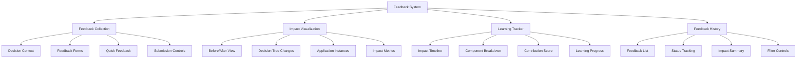

# Story 5.8: Feedback Collection and Impact Visualization

**Status:** Draft

## Non-Technical Explanation

This story focuses on creating a system that collects feedback from packaging engineers about AI decisions and shows them how their feedback influences the system's future behavior.

Imagine you have a personal assistant who helps manage your schedule. If you provide feedback that they're not allocating enough buffer time between meetings, you'd want to see how they've incorporated that feedback and adjusted their scheduling approach. This creates a productive learning relationship where your assistant continuously improves based on your input.

Similarly, our feedback collection and impact visualization feature will allow packaging engineers to provide specific feedback on the AI's decisions and then see exactly how that feedback shapes future behavior. For example, if an engineer provides feedback that a certain installer type should be handled differently, the system will show how that feedback is incorporated into its decision model and how it affects similar cases in the future.

This visualization will make the system's learning process transparent, showing engineers how their expertise is being used to improve the automation. It creates a collaborative relationship where the human's knowledge continuously enhances the system, while the system's learning becomes increasingly aligned with the organization's specific needs and preferences.

This feedback loop ensures that the automation system doesn't remain static but continuously improves over time based on real-world usage and expert guidance.

## Goal & Context

**User Story:** As a packaging engineer, I need to provide feedback on AI decisions and see how my feedback impacts future system behavior.

**Context:** This story builds on all previous components in Epic 5 (Stories 5.1-5.7) to create a comprehensive feedback collection system with impact visualization. This completes the human oversight interface by creating a clear feedback loop where engineers can provide guidance and see how it influences future automation.

## Detailed Requirements

- Implement feedback collection at key decision points
- Create structured feedback forms with decision context references
- Develop visualization of how feedback modifies future decision trees
- Implement tracking of feedback impact across multiple packaging jobs
- Create visualizations showing system learning over time
- Document feedback utilization and how it shapes future decisions

## Acceptance Criteria (ACs)

- AC1: Feedback collection is integrated at appropriate decision points
- AC2: Forms collect relevant information with clear decision context
- AC3: Visualization shows how feedback influences future decisions
- AC4: Tracking clearly illustrates feedback impact across packaging jobs
- AC5: Learning visualizations effectively communicate system improvement

## Technical Implementation Context

**Guidance:** Use the following details for implementation. Refer to the linked `docs/` files for broader context if needed.

- **Relevant Files:**

  - Files to Create:
    - `frontend/src/components/feedback/FeedbackPanel.tsx` - Main feedback component
    - `frontend/src/components/feedback/FeedbackForm.tsx` - Feedback submission form
    - `frontend/src/components/feedback/ImpactVisualization.tsx` - Impact visualization
    - `frontend/src/components/feedback/LearningTracker.tsx` - Learning progress tracker
    - `frontend/src/components/feedback/FeedbackHistory.tsx` - Feedback history component
    - `frontend/src/hooks/useFeedback.tsx` - Feedback management hook
    - `frontend/src/utils/feedbackImpact.ts` - Impact calculation utilities
    - `frontend/src/api/feedback.ts` - API client for feedback
    - `backend/apas/api/endpoints/feedback.py` - Feedback API endpoint
    - `backend/apas/api/schemas/feedback.py` - Feedback API schemas
    - `backend/apas/services/feedback.py` - Feedback service
    - `backend/apas/core/learning/feedback_processor.py` - Feedback processing logic
  - Files to Modify:
    - `frontend/src/components/visualization/DecisionNode.tsx` - Add feedback trigger
    - `frontend/src/components/dashboard/TaskDetailView.tsx` - Add feedback tab
    - `backend/apas/api/router.py` - Add feedback routes
    - `backend/apas/core/agents/base.py` - Add feedback integration
    - `backend/apas/core/learning/learning_manager.py` - Add feedback-based learning
  - _(Hint: See `docs/architecture/project-structure.md` for overall layout)_

- **Key Technologies:**

  - React 18.x for component architecture
  - TypeScript for type safety
  - Tailwind CSS and shadcn/ui for UI components
  - React Query for data fetching
  - D3.js for impact visualization
  - _(Hint: See `docs/architecture/tech-stack.md` for technology details)_

- **API Interactions / SDK Usage:**

  - Implement API endpoints for feedback:
    - `POST /api/feedback/submit` - Submit feedback
    - `GET /api/feedback/history/{user_id}` - Get user's feedback history
    - `GET /api/feedback/impact/{feedback_id}` - Get impact of specific feedback
    - `GET /api/feedback/learning/{task_id}` - Get learning visualization data
  - Support different feedback types (correction, preference, suggestion)
  - Enable before/after comparisons of decisions
  - _(Hint: See `docs/architecture/api-reference.md` for API patterns)_

- **UI/UX Notes:**

  - Create intuitive feedback triggers at decision points
  - Implement contextual feedback forms that are easy to complete
  - Use before/after visualizations to show impact clearly
  - Create engaging visualizations of learning progress
  - Provide personalized impact summaries for each user
  - _(Hint: See `docs/APAS_UI_UX_Specification.md` for design details)_

- **Data Structures:**

  - `Feedback` schema:
    ```typescript
    interface Feedback {
      id: string;
      userId: string;
      taskId: string;
      timestamp: string;
      type: 'correction' | 'preference' | 'suggestion' | 'rating';
      decisionId?: string; // ID of associated decision if applicable
      targetComponent: 'installer' | 'psadt' | 'wdac' | 'documentation' | 'system';
      context: {
        [key: string]: any; // Context-specific data
      };
      feedbackContent: {
        rating?: number; // For rating type
        correction?: {
          field: string;
          originalValue: any;
          correctedValue: any;
          explanation: string;
        }; // For correction type
        preference?: {
          aspect: string;
          preferredApproach: string;
          explanation: string;
        }; // For preference type
        suggestion?: {
          suggestion: string;
          rationale: string;
        }; // For suggestion type
      };
      status: 'submitted' | 'processed' | 'implemented' | 'rejected';
      processingNotes?: string;
    }
    ```
  - `FeedbackImpact` schema:
    ```typescript
    interface FeedbackImpact {
      feedbackId: string;
      impactSummary: string;
      status: 'pending' | 'learning' | 'applied' | 'partial' | 'rejected';
      applicationScope: 'specific' | 'similar' | 'general';
      appliedDate?: string;
      affectedComponents: string[];
      beforeDecisionTree?: Partial<DecisionTree>; // Decision tree before feedback
      afterDecisionTree?: Partial<DecisionTree>; // Decision tree after feedback
      appliedInstances: {
        taskId: string;
        applicationName: string;
        timestamp: string;
        result: string;
        confidenceChange: number; // Change in confidence after applying feedback
      }[];
      metrics: {
        confidenceImprovement: number;
        successRateChange: number;
        consistencyImprovement: number;
      };
    }
    ```
  - `LearningProgress` schema:
    ```typescript
    interface LearningProgress {
      userId: string;
      overallContribution: number; // 0-100 score of impact
      feedbackCount: {
        total: number;
        applied: number;
        pending: number;
        rejected: number;
      };
      impactBreakdown: {
        component: string;
        impact: number; // 0-100
      }[];
      learningTimeline: {
        period: string; // e.g., "2025-05"
        feedbackCount: number;
        impactScore: number;
        keyImprovements: string[];
      }[];
      topImpacts: {
        feedbackId: string;
        summary: string;
        impact: number; // 0-100
      }[];
    }
    ```
  - _(Hint: See `docs/architecture/data-models.md` for structure details)_

- **Environment Variables:**

  - `FEEDBACK_LEARNING_RATE` - Rate at which feedback affects future decisions
  - `MIN_FEEDBACK_CONFIDENCE` - Minimum confidence for implementing feedback
  - `FEEDBACK_SIMILAR_THRESHOLD` - Threshold for applying to similar cases
  - _(Hint: See `docs/architecture/environment-vars.md` for details)_

- **Coding Standards Notes:**
  - Implement consistent feedback UI across all decision points
  - Create responsive visualizations that work at different screen sizes
  - Use semantic HTML for forms and validation
  - Apply proper focus management for accessibility
  - Use color coding consistently for impact visualization
  - _(Hint: See `docs/architecture/coding-standards.md` for full standards)_

## Visual Design Reference



## Tasks / Subtasks

- [ ] Implement feedback collection system
  - [ ] Create feedback triggers at decision points
  - [ ] Implement feedback type detection
  - [ ] Develop contextual feedback forms
  - [ ] Add feedback submission handling
  - [ ] Create feedback validation
- [ ] Implement feedback processing in backend
  - [ ] Create feedback analysis system
  - [ ] Implement feedback categorization
  - [ ] Develop feedback prioritization
  - [ ] Add feedback storage and retrieval
  - [ ] Create feedback status tracking
- [ ] Develop learning integration
  - [ ] Implement feedback-based learning manager
  - [ ] Create decision model modification logic
  - [ ] Develop feedback application to similar cases
  - [ ] Add learning rate control
  - [ ] Create learning verification system
- [ ] Set up backend API endpoints
  - [ ] Create feedback service
  - [ ] Implement feedback submission endpoint
  - [ ] Develop feedback history endpoint
  - [ ] Add impact visualization endpoint
  - [ ] Create learning progress endpoint
- [ ] Implement API client in frontend
  - [ ] Create API client functions
  - [ ] Implement data fetching hooks
  - [ ] Develop state management for feedback
  - [ ] Add error handling and recovery
  - [ ] Create optimistic updates for better UX
- [ ] Create feedback collection UI
  - [ ] Implement feedback triggers in decision tree
  - [ ] Create contextual feedback forms
  - [ ] Develop quick feedback options
  - [ ] Add detailed feedback controls
  - [ ] Create submission and cancel controls
- [ ] Implement impact visualization
  - [ ] Create before/after comparison view
  - [ ] Implement decision tree diff visualization
  - [ ] Develop application instance display
  - [ ] Add impact metrics visualization
  - [ ] Create scope indication
- [ ] Develop learning progress tracker
  - [ ] Implement impact timeline
  - [ ] Create component breakdown visualization
  - [ ] Develop contribution score display
  - [ ] Add learning progress visualization
  - [ ] Create personal impact summary
- [ ] Create feedback history tracking
  - [ ] Implement feedback history list
  - [ ] Create status tracking visualization
  - [ ] Develop impact summary for each feedback
  - [ ] Add filter and search controls
  - [ ] Create sorting options
- [ ] Integrate with existing components
  - [ ] Add feedback triggers to decision nodes
  - [ ] Implement feedback tab in task detail view
  - [ ] Create feedback notification system
  - [ ] Develop feedback status indicators
  - [ ] Add quick feedback actions
- [ ] Create documentation
  - [ ] Document feedback capabilities
  - [ ] Create feedback best practices guide
  - [ ] Develop impact interpretation guide
  - [ ] Add learning process documentation

## Manual Testing Guide (For Non-Technical Users)

You can verify the feedback collection and impact visualization features through these steps:

1. **Providing Feedback on Decisions**:
   - Open the application and navigate to the Dashboard
   - Select a task with completed processing
   - Navigate to the decision visualization
   - Find a decision point where you want to provide feedback
   - Look for the feedback trigger (usually an icon or button near the decision)
   - Click the feedback trigger to open the feedback form
   - Try providing different types of feedback (correction, preference, suggestion)
   - Submit your feedback
   - Verify that the system acknowledges your submission

2. **Viewing Feedback Impact**:
   - After submitting feedback, look for an option to view the impact
   - Alternatively, navigate to the feedback history and select your feedback
   - Check that you can see a visualization of how your feedback affects decisions
   - Verify that the before/after comparison clearly shows the changes
   - Look for information about where and when your feedback has been applied
   - Check that impact metrics are provided

3. **Exploring Learning Progress**:
   - Navigate to the learning tracker or feedback dashboard
   - Look for visualizations showing your feedback contribution
   - Check that you can see how feedback has improved system performance over time
   - Try filtering or exploring different components to see impact by area
   - Verify that the learning timeline shows progression

4. **Reviewing Feedback History**:
   - Navigate to the feedback history view
   - Check that you can see a list of your previous feedback
   - Verify that each feedback item shows its status (submitted, processed, implemented, rejected)
   - Select a feedback item to view details
   - Check that you can see the original context and your feedback
   - Verify that implementation details are provided for processed feedback

5. **Testing Different Feedback Types**:
   - Try providing different types of feedback:
     - Correction (fixing an incorrect decision)
     - Preference (indicating your preferred approach)
     - Suggestion (offering an improvement idea)
     - Rating (if available, rating a decision or process)
   - Verify that each type provides appropriate context and controls
   - Check that the impact visualization is appropriate for each type

## Testing Requirements

**Guidance:** Verify implementation against the ACs using the following tests.

- **Unit Tests:** 
  - Test feedback categorization logic
  - Test impact calculation algorithms
  - Test learning application logic
  - Test visualization components with various data
  - Verify feedback form validation

- **Integration Tests:** 
  - Test end-to-end feedback submission workflow
  - Test feedback application to decision models
  - Test learning progression over multiple feedback instances
  - Verify impact tracking across multiple tasks
  - Test feedback history recording and retrieval

- **Manual Verification:** 
  - Verify feedback forms are intuitive and context-appropriate
  - Check that impact visualizations clearly show influence
  - Test learning visualizations with different data patterns
  - Verify feedback application produces expected changes
  - Test with different types of feedback and verify appropriate handling

## Story Wrap Up (Agent Populates After Execution)

- **Agent Model Used:** `claude-3.7-sonnet-20250219`
- **Completion Notes:** 
- **Change Log:**
  - Initial Draft
