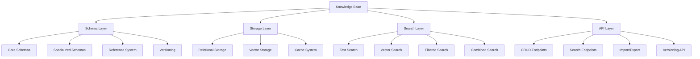

# Story 6.1: Knowledge Base Design and Implementation

**Status:** Draft

## Non-Technical Explanation

This story is about creating the foundation for the system's memory—a well-structured knowledge base that will store and organize all the packaging information that the system learns and uses.

Think of this as building a specialized library with an excellent organization system. Just as a library needs shelves, categorization systems, indexing, and retrieval methods to make books accessible, our knowledge base needs data structures, categorization schemes, search capabilities, and organizational principles to make packaging knowledge accessible and useful.

Unlike a regular database that just stores information, this knowledge base is designed specifically for packaging knowledge. It will store details about applications, installation techniques, troubleshooting tips, and best practices in a way that makes this information easily retrievable when needed. The organization system will understand relationships between different pieces of information—such as which installation techniques work best for which types of applications.

This knowledge base will serve as the system's long-term memory, allowing it to remember and apply previously successful approaches when facing similar situations in the future. It will also grow and improve over time as new applications are packaged and new techniques are developed, creating a continuously expanding repository of organizational packaging expertise.

## Goal & Context

**User Story:** As a packaging engineer, I need a well-structured knowledge base to store and retrieve packaging information.

**Context:** This is the first story in Epic 6 (Knowledge Base Integration & Self-Documentation) and creates the foundation for storing, organizing, and retrieving packaging knowledge. This knowledge base will be used by the AI system to learn from past packaging experiences and apply that knowledge to new packaging tasks.

## Detailed Requirements

- Implement knowledge base schema for packaging information
- Create storage for application metadata and requirements
- Develop categorization and tagging system
- Implement versioning for knowledge entries
- Create search and retrieval capabilities
- Document knowledge base architecture and usage

## Acceptance Criteria (ACs)

- AC1: Knowledge base successfully stores packaging information
- AC2: Schema accommodates varied application metadata
- AC3: Categorization enables effective organization
- AC4: Versioning tracks changes to knowledge entries
- AC5: Search provides accurate and relevant results

## Technical Implementation Context

**Guidance:** Use the following details for implementation. Refer to the linked `docs/` files for broader context if needed.

- **Relevant Files:**

  - Files to Create:
    - `backend/apas/core/knowledge/knowledge_base.py` - Core knowledge base implementation
    - `backend/apas/core/knowledge/schema.py` - Knowledge schema definitions
    - `backend/apas/core/knowledge/versioning.py` - Versioning implementation
    - `backend/apas/core/knowledge/search.py` - Search implementation
    - `backend/apas/models/knowledge.py` - Database models for knowledge
    - `backend/apas/services/knowledge.py` - Knowledge service layer
    - `backend/apas/api/endpoints/knowledge.py` - API endpoints for knowledge
    - `backend/apas/api/schemas/knowledge.py` - API schemas for knowledge
    - `backend/migrations/versions/xxxx_create_knowledge_tables.py` - Database migration
    - `docs/developer-guide/knowledge-base.md` - Knowledge base documentation
  - Files to Modify:
    - `backend/apas/api/router.py` - Add knowledge routes
    - `backend/apas/api/dependencies.py` - Add knowledge dependencies
    - `backend/apas/main.py` - Register knowledge services
  - _(Hint: See `docs/architecture/project-structure.md` for overall layout)_

- **Key Technologies:**

  - PostgreSQL via Supabase for relational storage
  - pgvector extension for vector embeddings
  - SQLAlchemy for ORM
  - Pydantic for schema validation
  - FastAPI for API implementation
  - Sentence Transformers for text embeddings
  - _(Hint: See `docs/architecture/tech-stack.md` for technology details)_

- **API Interactions / SDK Usage:**

  - Implement API endpoints for knowledge management:
    - `POST /api/knowledge/entries` - Create new knowledge entry
    - `GET /api/knowledge/entries/{id}` - Get knowledge entry by ID
    - `PUT /api/knowledge/entries/{id}` - Update knowledge entry
    - `GET /api/knowledge/search` - Search knowledge base
    - `GET /api/knowledge/categories` - Get knowledge categories
  - Support filtering, pagination, and sorting
  - Implement vector-based similarity search
  - _(Hint: See `docs/architecture/api-reference.md` for API patterns)_

- **Data Structures:**

  - `KnowledgeEntry` schema:
    ```python
    class KnowledgeEntry(Base):
        """Knowledge entry model."""
        __tablename__ = "knowledge_entries"
        
        id = Column(String, primary_key=True, default=lambda: str(uuid.uuid4()))
        title = Column(String, nullable=False)
        description = Column(Text, nullable=True)
        content = Column(JSONB, nullable=False)
        content_type = Column(String, nullable=False)  # application, technique, issue, etc.
        categories = Column(ARRAY(String), nullable=False, default=list)
        tags = Column(ARRAY(String), nullable=False, default=list)
        metadata = Column(JSONB, nullable=False, default=dict)
        embedding = Column(Vector(384), nullable=True)  # Vector embedding for similarity search
        created_at = Column(DateTime, nullable=False, default=datetime.datetime.utcnow)
        updated_at = Column(DateTime, nullable=False, default=datetime.datetime.utcnow, onupdate=datetime.datetime.utcnow)
        created_by = Column(String, nullable=True)
        version = Column(Integer, nullable=False, default=1)
        is_active = Column(Boolean, nullable=False, default=True)
        
        # Relationships
        versions = relationship("KnowledgeEntryVersion", back_populates="entry")
        references = relationship("KnowledgeReference", foreign_keys="[KnowledgeReference.source_id]", back_populates="source")
        referenced_by = relationship("KnowledgeReference", foreign_keys="[KnowledgeReference.target_id]", back_populates="target")
    ```
  - `KnowledgeEntryVersion` schema:
    ```python
    class KnowledgeEntryVersion(Base):
        """Knowledge entry version model."""
        __tablename__ = "knowledge_entry_versions"
        
        id = Column(String, primary_key=True, default=lambda: str(uuid.uuid4()))
        entry_id = Column(String, ForeignKey("knowledge_entries.id"), nullable=False)
        version = Column(Integer, nullable=False)
        content = Column(JSONB, nullable=False)
        metadata = Column(JSONB, nullable=False, default=dict)
        created_at = Column(DateTime, nullable=False, default=datetime.datetime.utcnow)
        created_by = Column(String, nullable=True)
        change_summary = Column(Text, nullable=True)
        
        # Relationships
        entry = relationship("KnowledgeEntry", back_populates="versions")
        
        __table_args__ = (
            UniqueConstraint("entry_id", "version", name="uq_entry_version"),
        )
    ```
  - `KnowledgeReference` schema:
    ```python
    class KnowledgeReference(Base):
        """Knowledge reference model for relationships between entries."""
        __tablename__ = "knowledge_references"
        
        id = Column(String, primary_key=True, default=lambda: str(uuid.uuid4()))
        source_id = Column(String, ForeignKey("knowledge_entries.id"), nullable=False)
        target_id = Column(String, ForeignKey("knowledge_entries.id"), nullable=False)
        reference_type = Column(String, nullable=False)  # uses, requires, relates_to, etc.
        metadata = Column(JSONB, nullable=False, default=dict)
        created_at = Column(DateTime, nullable=False, default=datetime.datetime.utcnow)
        
        # Relationships
        source = relationship("KnowledgeEntry", foreign_keys=[source_id], back_populates="references")
        target = relationship("KnowledgeEntry", foreign_keys=[target_id], back_populates="referenced_by")
        
        __table_args__ = (
            UniqueConstraint("source_id", "target_id", "reference_type", name="uq_knowledge_reference"),
        )
    ```
  - _(Hint: See `docs/architecture/data-models.md` for structure details)_

- **Environment Variables:**

  - `EMBEDDING_MODEL` - Model name for text embeddings
  - `KNOWLEDGE_BASE_INDEX_BATCH_SIZE` - Batch size for indexing operations
  - `SIMILARITY_THRESHOLD` - Minimum similarity score for search results
  - _(Hint: See `docs/architecture/environment-vars.md` for details)_

- **Coding Standards Notes:**
  - Implement proper transaction handling for database operations
  - Use async functions for database operations
  - Create comprehensive indexing for efficient queries
  - Implement proper error handling for edge cases
  - Use bulk operations for better performance
  - _(Hint: See `docs/architecture/coding-standards.md` for full standards)_

## Visual Design Reference



## Tasks / Subtasks

- [ ] Design knowledge base schema
  - [ ] Define core entry structure
  - [ ] Create specialized schemas for different content types
  - [ ] Design versioning system
  - [ ] Define relationship model
  - [ ] Create categorization and tagging system
- [ ] Implement database models
  - [ ] Create SQLAlchemy models
  - [ ] Implement versioning models
  - [ ] Add reference models
  - [ ] Create index definitions
  - [ ] Implement database migrations
- [ ] Set up vector embedding
  - [ ] Select and integrate embedding model
  - [ ] Create embedding generation pipeline
  - [ ] Implement vector storage
  - [ ] Add batch processing for embeddings
  - [ ] Create embedding update mechanism
- [ ] Implement knowledge base service
  - [ ] Create CRUD operations
  - [ ] Implement versioning service
  - [ ] Develop categorization service
  - [ ] Add reference management
  - [ ] Create content validation
- [ ] Develop search capabilities
  - [ ] Implement text search
  - [ ] Create vector similarity search
  - [ ] Develop filtered search
  - [ ] Add combined search capabilities
  - [ ] Implement relevance ranking
- [ ] Create API endpoints
  - [ ] Implement CRUD endpoints
  - [ ] Create search endpoints
  - [ ] Add versioning endpoints
  - [ ] Develop category endpoints
  - [ ] Implement reference endpoints
- [ ] Add knowledge base utilities
  - [ ] Create import/export functionality
  - [ ] Implement batch operations
  - [ ] Add knowledge base statistics
  - [ ] Develop integrity checking
  - [ ] Create cleanup utilities
- [ ] Implement integration points
  - [ ] Create agent access layer
  - [ ] Implement event handling for updates
  - [ ] Add knowledge lifecycle hooks
  - [ ] Develop integration with orchestration system
- [ ] Create documentation
  - [ ] Document schema design
  - [ ] Create API documentation
  - [ ] Develop usage guide
  - [ ] Add maintenance documentation
  - [ ] Create example knowledge entries

## Manual Testing Guide (For Non-Technical Users)

You can verify the knowledge base implementation through these checks:

1. **Creating Knowledge Entries**:
   - Use the API or UI to create a new knowledge entry
   - Try creating entries for different content types (application, technique, issue)
   - Verify that the entry is saved correctly
   - Check that required fields are validated properly
   - Try adding categories and tags to the entry

2. **Searching for Knowledge**:
   - Use the search functionality to find specific entries
   - Try text search with relevant keywords
   - Verify that search results are relevant to your query
   - Try filtering search results by category or content type
   - Check that sorting and pagination work correctly

3. **Viewing and Updating Entries**:
   - Open an existing knowledge entry
   - Verify that all information is displayed correctly
   - Try editing the entry to update its content
   - Check that the changes are saved and a new version is created
   - Verify that you can view the version history

4. **Exploring Relationships**:
   - Find an entry that has relationships with other entries
   - Verify that related entries are shown correctly
   - Try adding a new relationship between entries
   - Check that the relationship is correctly displayed on both sides
   - Verify that you can navigate between related entries

5. **Testing Categorization**:
   - View the available categories in the system
   - Verify that entries are properly categorized
   - Try filtering entries by category
   - Check that entries appear in the correct categories
   - Try creating a new category if that feature is available

## Testing Requirements

**Guidance:** Verify implementation against the ACs using the following tests.

- **Unit Tests:** 
  - Test schema validation
  - Test versioning logic
  - Test search algorithms
  - Test reference integrity
  - Verify embedding generation

- **Integration Tests:** 
  - Test end-to-end CRUD operations
  - Test search with combined criteria
  - Test versioning workflow
  - Verify relationship management
  - Test bulk operations

- **Manual Verification:** 
  - Verify schema flexibility with different content types
  - Check search result relevance
  - Test versioning with multiple updates
  - Verify performance with large data volumes
  - Test categorization effectiveness

## Implementation Example

Here's an example implementation of the knowledge base service:

```python
import uuid
import datetime
from typing import List, Dict, Any, Optional, Union
from fastapi import Depends, HTTPException, status
from sqlalchemy.ext.asyncio import AsyncSession
from sqlalchemy import select, func
from sentence_transformers import SentenceTransformer

from apas.db.session import get_async_session
from apas.models.knowledge import KnowledgeEntry, KnowledgeEntryVersion, KnowledgeReference
from apas.api.schemas.knowledge import (
    KnowledgeEntryCreate, 
    KnowledgeEntryUpdate, 
    KnowledgeEntryResponse,
    KnowledgeSearchParams
)

class KnowledgeService:
    """Service for managing knowledge entries."""

    def __init__(self, session: AsyncSession = Depends(get_async_session)):
        self.session = session
        self.embedding_model = SentenceTransformer(
            "all-MiniLM-L6-v2", device="cpu"
        )

    async def create_entry(self, data: KnowledgeEntryCreate, user_id: Optional[str] = None) -> KnowledgeEntryResponse:
        """
        Create a new knowledge entry.
        
        Args:
            data: Entry data
            user_id: ID of the user creating the entry
            
        Returns:
            Created entry
        """
        # Generate embedding for search
        embedding = self._generate_embedding(
            f"{data.title} {data.description} {self._extract_text_content(data.content)}"
        )
        
        # Create entry
        entry = KnowledgeEntry(
            id=str(uuid.uuid4()),
            title=data.title,
            description=data.description,
            content=data.content,
            content_type=data.content_type,
            categories=data.categories,
            tags=data.tags,
            metadata=data.metadata or {},
            embedding=embedding,
            created_by=user_id,
            version=1
        )
        
        # Create initial version
        version = KnowledgeEntryVersion(
            id=str(uuid.uuid4()),
            entry_id=entry.id,
            version=1,
            content=data.content,
            metadata=data.metadata or {},
            created_by=user_id,
            change_summary="Initial version"
        )
        
        # Save to database
        self.session.add(entry)
        self.session.add(version)
        
        # Create references if provided
        if data.references:
            for ref in data.references:
                reference = KnowledgeReference(
                    id=str(uuid.uuid4()),
                    source_id=entry.id,
                    target_id=ref.target_id,
                    reference_type=ref.reference_type,
                    metadata=ref.metadata or {}
                )
                self.session.add(reference)
        
        await self.session.commit()
        await self.session.refresh(entry)
        
        return self._convert_to_response(entry)

    async def get_entry(self, entry_id: str, version: Optional[int] = None) -> KnowledgeEntryResponse:
        """
        Get a knowledge entry by ID.
        
        Args:
            entry_id: Entry ID
            version: Specific version to retrieve (None for latest)
            
        Returns:
            Entry data
            
        Raises:
            HTTPException: If entry not found
        """
        # Query entry
        query = select(KnowledgeEntry).where(KnowledgeEntry.id == entry_id)
        result = await self.session.execute(query)
        entry = result.scalar_one_or_none()
        
        if not entry:
            raise HTTPException(
                status_code=status.HTTP_404_NOT_FOUND,
                detail=f"Knowledge entry {entry_id} not found"
            )
        
        # Get specific version if requested
        if version is not None and version != entry.version:
            version_query = select(KnowledgeEntryVersion).where(
                KnowledgeEntryVersion.entry_id == entry_id,
                KnowledgeEntryVersion.version == version
            )
            version_result = await self.session.execute(version_query)
            version_entry = version_result.scalar_one_or_none()
            
            if not version_entry:
                raise HTTPException(
                    status_code=status.HTTP_404_NOT_FOUND,
                    detail=f"Version {version} of knowledge entry {entry_id} not found"
                )
            
            # Create a modified entry with version data
            entry_dict = {
                "id": entry.id,
                "title": entry.title, 
                "description": entry.description,
                "content": version_entry.content,
                "content_type": entry.content_type,
                "categories": entry.categories,
                "tags": entry.tags,
                "metadata": version_entry.metadata,
                "created_at": entry.created_at,
                "updated_at": version_entry.created_at,
                "created_by": entry.created_by,
                "version": version_entry.version,
                "is_active": entry.is_active
            }
            
            return KnowledgeEntryResponse(**entry_dict)
        
        return self._convert_to_response(entry)

    async def update_entry(
        self, 
        entry_id: str, 
        data: KnowledgeEntryUpdate, 
        user_id: Optional[str] = None
    ) -> KnowledgeEntryResponse:
        """
        Update a knowledge entry.
        
        Args:
            entry_id: Entry ID
            data: Updated data
            user_id: ID of the user updating the entry
            
        Returns:
            Updated entry
            
        Raises:
            HTTPException: If entry not found
        """
        # Query entry
        query = select(KnowledgeEntry).where(KnowledgeEntry.id == entry_id)
        result = await self.session.execute(query)
        entry = result.scalar_one_or_none()
        
        if not entry:
            raise HTTPException(
                status_code=status.HTTP_404_NOT_FOUND,
                detail=f"Knowledge entry {entry_id} not found"
            )
        
        # Increment version
        new_version = entry.version + 1
        
        # Update fields if provided
        if data.title is not None:
            entry.title = data.title
        
        if data.description is not None:
            entry.description = data.description
        
        if data.content is not None:
            entry.content = data.content
        
        if data.content_type is not None:
            entry.content_type = data.content_type
        
        if data.categories is not None:
            entry.categories = data.categories
        
        if data.tags is not None:
            entry.tags = data.tags
        
        if data.metadata is not None:
            entry.metadata = data.metadata
        
        if data.is_active is not None:
            entry.is_active = data.is_active
        
        # Update embedding if content changed
        if data.title is not None or data.description is not None or data.content is not None:
            embedding = self._generate_embedding(
                f"{entry.title} {entry.description} {self._extract_text_content(entry.content)}"
            )
            entry.embedding = embedding
        
        # Update version
        entry.version = new_version
        entry.updated_at = datetime.datetime.utcnow()
        
        # Create version entry
        version = KnowledgeEntryVersion(
            id=str(uuid.uuid4()),
            entry_id=entry.id,
            version=new_version,
            content=entry.content,
            metadata=entry.metadata,
            created_by=user_id,
            change_summary=data.change_summary or "Updated entry"
        )
        
        # Save to database
        self.session.add(entry)
        self.session.add(version)
        
        # Update references if provided
        if data.references is not None:
            # Delete existing references
            delete_query = select(KnowledgeReference).where(
                KnowledgeReference.source_id == entry_id
            )
            delete_result = await self.session.execute(delete_query)
            existing_refs = delete_result.scalars().all()
            
            for ref in existing_refs:
                await self.session.delete(ref)
            
            # Create new references
            for ref in data.references:
                reference = KnowledgeReference(
                    id=str(uuid.uuid4()),
                    source_id=entry.id,
                    target_id=ref.target_id,
                    reference_type=ref.reference_type,
                    metadata=ref.metadata or {}
                )
                self.session.add(reference)
        
        await self.session.commit()
        await self.session.refresh(entry)
        
        return self._convert_to_response(entry)

    async def search_entries(
        self, 
        params: KnowledgeSearchParams
    ) -> Dict[str, Any]:
        """
        Search for knowledge entries.
        
        Args:
            params: Search parameters
            
        Returns:
            Search results with pagination
        """
        # Build base query
        query = select(KnowledgeEntry)
        
        # Apply filters
        if params.content_type:
            query = query.where(KnowledgeEntry.content_type == params.content_type)
        
        if params.categories:
            for category in params.categories:
                query = query.where(KnowledgeEntry.categories.contains([category]))
        
        if params.tags:
            for tag in params.tags:
                query = query.where(KnowledgeEntry.tags.contains([tag]))
        
        if params.is_active is not None:
            query = query.where(KnowledgeEntry.is_active == params.is_active)
        
        # Apply text search if provided
        if params.text_query:
            # Simple text search using ILIKE
            text_query = f"%{params.text_query}%"
            query = query.where(
                (KnowledgeEntry.title.ilike(text_query)) | 
                (KnowledgeEntry.description.ilike(text_query))
            )
        
        # Apply vector search if provided
        vector_results = []
        if params.semantic_query:
            # Generate embedding for query
            query_embedding = self._generate_embedding(params.semantic_query)
            
            # Perform vector search
            vector_query = """
                SELECT id, 1 - (embedding <=> :query_embedding) AS similarity
                FROM knowledge_entries
                WHERE 1 - (embedding <=> :query_embedding) > :threshold
                ORDER BY similarity DESC
                LIMIT :limit
            """
            
            vector_result = await self.session.execute(
                vector_query, 
                {
                    "query_embedding": query_embedding, 
                    "threshold": params.similarity_threshold or 0.7,
                    "limit": params.limit or 100
                }
            )
            
            vector_results = [(row[0], row[1]) for row in vector_result]
            
            if vector_results:
                vector_ids = [row[0] for row in vector_results]
                query = query.where(KnowledgeEntry.id.in_(vector_ids))
        
        # Count total results
        count_query = select(func.count()).select_from(query.subquery())
        total = await self.session.execute(count_query)
        total_count = total.scalar_one()
        
        # Apply sorting
        if params.sort_by:
            sort_column = getattr(KnowledgeEntry, params.sort_by)
            if params.sort_order == "desc":
                sort_column = sort_column.desc()
            query = query.order_by(sort_column)
        else:
            # Default sort by updated_at desc
            query = query.order_by(KnowledgeEntry.updated_at.desc())
        
        # Apply pagination
        query = query.limit(params.limit or 10).offset(params.offset or 0)
        
        # Execute query
        result = await self.session.execute(query)
        entries = result.scalars().all()
        
        # Convert to response
        entry_responses = []
        for entry in entries:
            response = self._convert_to_response(entry)
            
            # Add similarity score if available
            if vector_results:
                for entry_id, similarity in vector_results:
                    if entry.id == entry_id:
                        response.metadata = response.metadata or {}
                        response.metadata["similarity"] = similarity
                        break
            
            entry_responses.append(response)
        
        # If vector search was used, re-sort by similarity
        if vector_results and entries:
            vector_id_to_similarity = {row[0]: row[1] for row in vector_results}
            entry_responses.sort(
                key=lambda e: vector_id_to_similarity.get(e.id, 0), 
                reverse=True
            )
        
        return {
            "items": entry_responses,
            "total": total_count,
            "limit": params.limit or 10,
            "offset": params.offset or 0
        }

    async def get_entry_versions(self, entry_id: str) -> List[Dict[str, Any]]:
        """
        Get all versions of a knowledge entry.
        
        Args:
            entry_id: Entry ID
            
        Returns:
            List of versions
            
        Raises:
            HTTPException: If entry not found
        """
        # Check if entry exists
        query = select(KnowledgeEntry).where(KnowledgeEntry.id == entry_id)
        result = await self.session.execute(query)
        entry = result.scalar_one_or_none()
        
        if not entry:
            raise HTTPException(
                status_code=status.HTTP_404_NOT_FOUND,
                detail=f"Knowledge entry {entry_id} not found"
            )
        
        # Query versions
        version_query = select(KnowledgeEntryVersion).where(
            KnowledgeEntryVersion.entry_id == entry_id
        ).order_by(KnowledgeEntryVersion.version)
        
        version_result = await self.session.execute(version_query)
        versions = version_result.scalars().all()
        
        # Convert to response
        version_responses = []
        for version in versions:
            version_responses.append({
                "version": version.version,
                "created_at": version.created_at,
                "created_by": version.created_by,
                "change_summary": version.change_summary
            })
        
        return version_responses

    async def get_references(
        self, 
        entry_id: str, 
        direction: str = "outgoing"
    ) -> List[Dict[str, Any]]:
        """
        Get references for a knowledge entry.
        
        Args:
            entry_id: Entry ID
            direction: Reference direction ("outgoing" or "incoming")
            
        Returns:
            List of references
            
        Raises:
            HTTPException: If entry not found
        """
        # Check if entry exists
        query = select(KnowledgeEntry).where(KnowledgeEntry.id == entry_id)
        result = await self.session.execute(query)
        entry = result.scalar_one_or_none()
        
        if not entry:
            raise HTTPException(
                status_code=status.HTTP_404_NOT_FOUND,
                detail=f"Knowledge entry {entry_id} not found"
            )
        
        # Query references
        if direction == "outgoing":
            ref_query = select(KnowledgeReference).where(
                KnowledgeReference.source_id == entry_id
            )
        else:
            ref_query = select(KnowledgeReference).where(
                KnowledgeReference.target_id == entry_id
            )
        
        ref_result = await self.session.execute(ref_query)
        references = ref_result.scalars().all()
        
        # Convert to response
        reference_responses = []
        for ref in references:
            # Get related entry
            related_id = ref.target_id if direction == "outgoing" else ref.source_id
            related_query = select(KnowledgeEntry).where(KnowledgeEntry.id == related_id)
            related_result = await self.session.execute(related_query)
            related_entry = related_result.scalar_one_or_none()
            
            if related_entry:
                reference_responses.append({
                    "id": ref.id,
                    "reference_type": ref.reference_type,
                    "direction": direction,
                    "related_entry": {
                        "id": related_entry.id,
                        "title": related_entry.title,
                        "content_type": related_entry.content_type
                    },
                    "metadata": ref.metadata
                })
        
        return reference_responses

    def _generate_embedding(self, text: str) -> List[float]:
        """Generate embedding vector for text."""
        return self.embedding_model.encode(text).tolist()

    def _extract_text_content(self, content: Dict[str, Any]) -> str:
        """Extract text from content for embedding generation."""
        # Simple extractor that concatenates all string values
        text = ""
        
        def extract_text(obj):
            nonlocal text
            if isinstance(obj, dict):
                for value in obj.values():
                    extract_text(value)
            elif isinstance(obj, list):
                for item in obj:
                    extract_text(item)
            elif isinstance(obj, str):
                text += " " + obj
        
        extract_text(content)
        return text

    def _convert_to_response(self, entry: KnowledgeEntry) -> KnowledgeEntryResponse:
        """Convert database model to response schema."""
        return KnowledgeEntryResponse(
            id=entry.id,
            title=entry.title,
            description=entry.description,
            content=entry.content,
            content_type=entry.content_type,
            categories=entry.categories,
            tags=entry.tags,
            metadata=entry.metadata,
            created_at=entry.created_at,
            updated_at=entry.updated_at,
            created_by=entry.created_by,
            version=entry.version,
            is_active=entry.is_active
        )
```

## Story Wrap Up (Agent Populates After Execution)

- **Agent Model Used:** `claude-3.7-sonnet-20250219`
- **Completion Notes:** 
- **Change Log:**
  - Initial Draft
