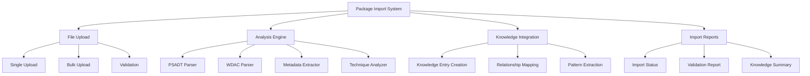

# Story 6.2: Existing Package Import

**Status:** Draft

## Non-Technical Explanation

This story is about teaching the system by showing it examples of work that has already been done—importing existing packaged applications to build up the system's knowledge base.

Imagine you're training a new employee. One of the most effective ways to teach them is to show them examples of successfully completed work. Instead of just telling them abstract principles, you'd show them actual packages your team has created, explaining the techniques used and why certain decisions were made.

Similarly, our package import functionality will analyze existing application packages that your organization has already created. It will extract the key information—such as installation parameters, script techniques, security policies, and troubleshooting approaches—and store this information in the knowledge base created in Story 6.1.

This approach gives the system a head start by leveraging your organization's accumulated expertise. Rather than starting from scratch, the system learns from proven approaches that have already worked in your specific environment. This accelerates the system's ability to produce quality results and ensures that automated packaging aligns with your organization's standards and preferences.

As more packages are imported, the system builds a comprehensive understanding of different application types and the most effective approaches for packaging them, creating a valuable repository of organizational knowledge.

## Goal & Context

**User Story:** As a packaging engineer, I need to import existing packaged applications to build the system's knowledge base.

**Context:** Building on the knowledge base infrastructure (Story 6.1), this story implements the functionality to import existing PSADT packages and WDAC policies. This allows the system to learn from existing successful packages, building a knowledge base that reflects the organization's packaging practices and expertise.

## Detailed Requirements

- Implement import of existing PSADT packages
- Create extraction of package metadata and structure
- Develop analysis of installation techniques
- Implement import of existing WDAC policies
- Create validation of imported packages
- Document import process and requirements

## Acceptance Criteria (ACs)

- AC1: Import successfully processes existing PSADT packages
- AC2: Metadata extraction captures relevant information
- AC3: Technique analysis identifies reusable patterns
- AC4: WDAC policy import preserves security rules
- AC5: Validation identifies potential issues with imports

## Technical Implementation Context

**Guidance:** Use the following details for implementation. Refer to the linked `docs/` files for broader context if needed.

- **Relevant Files:**

  - Files to Create:
    - `backend/apas/core/import/package_importer.py` - Package import core logic
    - `backend/apas/core/import/psadt_analyzer.py` - PSADT script analysis
    - `backend/apas/core/import/wdac_analyzer.py` - WDAC policy analysis
    - `backend/apas/core/import/metadata_extractor.py` - Metadata extraction
    - `backend/apas/core/import/technique_analyzer.py` - Installation technique analysis
    - `backend/apas/services/import_service.py` - Import service
    - `backend/apas/api/endpoints/import.py` - Import API endpoints
    - `backend/apas/api/schemas/import.py` - Import API schemas
    - `frontend/src/components/import/ImportPanel.tsx` - Import UI component
    - `frontend/src/components/import/ImportForm.tsx` - Import form component
    - `frontend/src/components/import/ImportResults.tsx` - Import results component
    - `frontend/src/hooks/useImport.tsx` - Import hook
    - `frontend/src/api/import.ts` - Import API client
    - `docs/developer-guide/package-import.md` - Import documentation
  - Files to Modify:
    - `backend/apas/api/router.py` - Add import routes
    - `backend/apas/services/knowledge.py` - Add import integration
    - `frontend/src/App.tsx` - Add import route
    - `frontend/src/components/layout/Sidebar.tsx` - Add import navigation
  - _(Hint: See `docs/architecture/project-structure.md` for overall layout)_

- **Key Technologies:**

  - Python for script parsing and analysis
  - AST module for PowerShell script parsing
  - XML processing for WDAC policy parsing
  - FastAPI for API implementation
  - React for UI components
  - File upload handling with multipart/form-data
  - _(Hint: See `docs/architecture/tech-stack.md` for technology details)_

- **API Interactions / SDK Usage:**

  - Implement API endpoints for package import:
    - `POST /api/import/package` - Import a package
    - `POST /api/import/bulk` - Bulk import multiple packages
    - `GET /api/import/status/{job_id}` - Check import job status
    - `GET /api/import/history` - Get import history
  - Use background tasks for long-running imports
  - Support file upload for package files
  - _(Hint: See `docs/architecture/api-reference.md` for API patterns)_

- **UI/UX Notes:**

  - Create clear import workflow with progress indication
  - Implement drag-and-drop file upload
  - Provide clear feedback on import success/failure
  - Show detailed validation results
  - Allow customizing import settings
  - _(Hint: See `docs/APAS_UI_UX_Specification.md` for design details)_

- **Data Structures:**

  - `ImportJob` schema:
    ```python
    class ImportJob(Base):
        """Import job model."""
        __tablename__ = "import_jobs"
        
        id = Column(String, primary_key=True, default=lambda: str(uuid.uuid4()))
        status = Column(String, nullable=False, default="pending")  # pending, processing, completed, failed
        job_type = Column(String, nullable=False)  # single, bulk
        created_at = Column(DateTime, nullable=False, default=datetime.datetime.utcnow)
        completed_at = Column(DateTime, nullable=True)
        created_by = Column(String, nullable=True)
        stats = Column(JSONB, nullable=False, default=dict)
        errors = Column(JSONB, nullable=True)
        
        # Relationships
        import_items = relationship("ImportItem", back_populates="job")
    ```
  - `ImportItem` schema:
    ```python
    class ImportItem(Base):
        """Import item model for individual package imports within a job."""
        __tablename__ = "import_items"
        
        id = Column(String, primary_key=True, default=lambda: str(uuid.uuid4()))
        job_id = Column(String, ForeignKey("import_jobs.id"), nullable=False)
        status = Column(String, nullable=False, default="pending")  # pending, processing, completed, failed
        item_type = Column(String, nullable=False)  # psadt, wdac
        file_path = Column(String, nullable=False)
        file_name = Column(String, nullable=False)
        file_size = Column(Integer, nullable=False)
        application_name = Column(String, nullable=True)
        application_version = Column(String, nullable=True)
        imported_at = Column(DateTime, nullable=True)
        knowledge_entry_id = Column(String, nullable=True)  # ID of the created knowledge entry
        validation_results = Column(JSONB, nullable=True)
        extraction_results = Column(JSONB, nullable=True)
        error = Column(String, nullable=True)
        
        # Relationships
        job = relationship("ImportJob", back_populates="import_items")
    ```
  - `ImportRequest` schema:
    ```python
    class ImportRequest(BaseModel):
        """Import request schema."""
        import_type: str  # "psadt" or "wdac"
        metadata: Optional[Dict[str, Any]] = None
        options: Optional[Dict[str, Any]] = None
        
        class Config:
            extra = "forbid"
    ```
  - `ImportResponse` schema:
    ```python
    class ImportResponse(BaseModel):
        """Import response schema."""
        job_id: str
        status: str
        created_at: datetime
        import_items: List[Dict[str, Any]]
        
        class Config:
            orm_mode = True
    ```
  - _(Hint: See `docs/architecture/data-models.md` for structure details)_

- **Environment Variables:**

  - `IMPORT_STORAGE_PATH` - Path for storing uploaded import files
  - `MAX_IMPORT_FILE_SIZE` - Maximum file size for imports
  - `IMPORT_BATCH_SIZE` - Batch size for bulk imports
  - `IMPORT_WORKERS` - Number of worker threads for imports
  - _(Hint: See `docs/architecture/environment-vars.md` for details)_

- **Coding Standards Notes:**
  - Use async processing for long-running imports
  - Implement proper error handling for corrupt files
  - Create detailed logging for import operations
  - Implement secure file handling
  - Use transactions for database operations
  - _(Hint: See `docs/architecture/coding-standards.md` for full standards)_

## Visual Design Reference



## Tasks / Subtasks

- [ ] Implement file handling for package imports
  - [ ] Create file upload functionality
  - [ ] Implement secure storage for uploaded files
  - [ ] Add file validation
  - [ ] Create cleanup mechanism
  - [ ] Implement bulk upload support
- [ ] Develop PSADT package analysis
  - [ ] Create PowerShell script parser
  - [ ] Implement structure analysis
  - [ ] Develop function identification
  - [ ] Add parameter extraction
  - [ ] Create technique classification
- [ ] Implement WDAC policy analysis
  - [ ] Create XML parser for policies
  - [ ] Implement rule extraction
  - [ ] Develop signer analysis
  - [ ] Add exception identification
  - [ ] Create policy pattern detection
- [ ] Develop metadata extraction
  - [ ] Create application information extraction
  - [ ] Implement version detection
  - [ ] Develop publisher identification
  - [ ] Add dependency analysis
  - [ ] Create categorization system
- [ ] Implement installation technique analysis
  - [ ] Create technique pattern recognition
  - [ ] Implement code block classification
  - [ ] Develop common pattern identification
  - [ ] Add technique effectiveness assessment
  - [ ] Create technique relationships
- [ ] Set up knowledge base integration
  - [ ] Create knowledge entry generation
  - [ ] Implement categorization
  - [ ] Develop relationship mapping
  - [ ] Add metadata enrichment
  - [ ] Create search indexing
- [ ] Implement import validation
  - [ ] Create package structure validation
  - [ ] Implement script validation
  - [ ] Develop policy validation
  - [ ] Add quality assessment
  - [ ] Create validation reporting
- [ ] Set up import service
  - [ ] Create job management
  - [ ] Implement background processing
  - [ ] Develop progress tracking
  - [ ] Add error handling
  - [ ] Create reporting
- [ ] Develop API endpoints
  - [ ] Implement package import endpoint
  - [ ] Create bulk import endpoint
  - [ ] Develop status endpoint
  - [ ] Add history endpoint
  - [ ] Create validation endpoint
- [ ] Implement frontend components
  - [ ] Create import panel
  - [ ] Implement file upload component
  - [ ] Develop import form
  - [ ] Add progress visualization
  - [ ] Create results display
- [ ] Create documentation
  - [ ] Document import process
  - [ ] Create file requirements guide
  - [ ] Develop troubleshooting guide
  - [ ] Add examples of valid packages
  - [ ] Create import best practices

## Manual Testing Guide (For Non-Technical Users)

You can verify the package import functionality through these steps:

1. **Accessing the Import Interface**:
   - Open the application and navigate to the Import section
   - Verify that the import interface loads correctly
   - Check that both single and bulk import options are available
   - Confirm that the interface explains the requirements for valid packages

2. **Importing a PSADT Package**:
   - Select a PSADT package from your existing packages
   - Upload the package using the file upload control
   - Verify that the upload progress is displayed
   - Check that the import process starts automatically after upload
   - Monitor the import progress indicators
   - Wait for the import to complete

3. **Checking Import Results**:
   - After the import completes, check the import results
   - Verify that the package metadata is correctly extracted
   - Check that the techniques used in the package are identified
   - Look for any validation warnings or errors
   - Confirm that the successfully imported package appears in the knowledge base

4. **Importing a WDAC Policy**:
   - Select a WDAC policy from your existing policies
   - Upload the policy using the file upload control
   - Monitor the import progress
   - Check the results after import completes
   - Verify that the policy rules and structure are correctly captured

5. **Testing Bulk Import**:
   - Prepare multiple packages for import
   - Use the bulk import option to upload them
   - Monitor the bulk import progress
   - Check the summary results after completion
   - Verify that all successfully imported packages appear in the knowledge base

6. **Verifying Knowledge Integration**:
   - Navigate to the knowledge base
   - Search for one of your imported packages
   - Verify that the package information is correctly stored
   - Check that related information (techniques, patterns) is properly linked
   - Try using the search functionality to find packages by different criteria

## Testing Requirements

**Guidance:** Verify implementation against the ACs using the following tests.

- **Unit Tests:** 
  - Test PSADT script parsing
  - Test WDAC policy parsing
  - Test metadata extraction
  - Test technique analysis
  - Verify validation functions

- **Integration Tests:** 
  - Test end-to-end import workflow
  - Test knowledge base integration
  - Test bulk import with multiple files
  - Verify error handling for invalid files
  - Test concurrent imports

- **Manual Verification:** 
  - Verify import interface usability
  - Check import results for accuracy
  - Test with real-world packages of different complexity
  - Verify knowledge extraction quality
  - Test with edge cases (very large scripts, complex policies)

## Implementation Example

Here's an example implementation of the PSADT analyzer:

```python
import os
import re
import ast
import json
from typing import Dict, List, Any, Optional, Tuple
from pathlib import Path

class PSADTAnalyzer:
    """Analyzer for PowerShell App Deployment Toolkit packages."""
    
    def __init__(self):
        self.common_functions = {
            "Show-InstallationWelcome": "user interaction",
            "Show-InstallationPrompt": "user interaction",
            "Show-DialogBox": "user interaction",
            "Show-BalloonTip": "user interaction",
            "Show-InstallationProgress": "user interaction",
            "Close-InstallationProgress": "user interaction",
            "Set-RegistryKey": "registry modification",
            "Remove-RegistryKey": "registry modification",
            "Set-RegistryValue": "registry modification",
            "Remove-RegistryValue": "registry modification",
            "Execute-Process": "process execution",
            "Execute-MSI": "msi installation",
            "Execute-MSP": "msp installation",
            "Execute-MSU": "msu installation",
            "Execute-ServiceStop": "service management",
            "Execute-ServiceStart": "service management",
            "Remove-File": "file operation",
            "Copy-File": "file operation",
            "Update-Desktop": "environment refresh",
            "Install-MSUpdates": "windows update",
            "Invoke-SCCMTask": "sccm integration",
            "Get-PendingReboot": "system state check",
        }
        
        self.installation_switches_pattern = re.compile(r'^\s*\$installPhase\s*=\s*[\'"]{1}Installation[\'"]{1}', re.MULTILINE)
        self.uninstallation_switches_pattern = re.compile(r'^\s*\$installPhase\s*=\s*[\'"]{1}Uninstallation[\'"]{1}', re.MULTILINE)
        self.app_name_pattern = re.compile(r'^\s*\$appName\s*=\s*[\'"]{1}([^\'"]*)[\'"]{1}', re.MULTILINE)
        self.app_vendor_pattern = re.compile(r'^\s*\$appVendor\s*=\s*[\'"]{1}([^\'"]*)[\'"]{1}', re.MULTILINE)
        self.app_version_pattern = re.compile(r'^\s*\$appVersion\s*=\s*[\'"]{1}([^\'"]*)[\'"]{1}', re.MULTILINE)
        
    async def analyze_package(self, package_path: str) -> Dict[str, Any]:
        """
        Analyze a PSADT package.
        
        Args:
            package_path: Path to the package directory or zip file
            
        Returns:
            Analysis results
        """
        results = {
            "package_type": "psadt",
            "metadata": {},
            "structure": {},
            "techniques": {},
            "functions": {},
            "validation": {}
        }
        
        # Handle both directory and zip file
        if package_path.endswith(".zip"):
            # Extract zip to temp directory
            import tempfile
            import zipfile
            
            with tempfile.TemporaryDirectory() as temp_dir:
                with zipfile.ZipFile(package_path, 'r') as zip_ref:
                    zip_ref.extractall(temp_dir)
                
                return await self._analyze_directory(temp_dir, results)
        else:
            # Directory path
            return await self._analyze_directory(package_path, results)
    
    async def _analyze_directory(self, directory_path: str, results: Dict[str, Any]) -> Dict[str, Any]:
        """Analyze PSADT directory."""
        # Check for Deploy-Application.ps1
        deploy_script_path = os.path.join(directory_path, "Deploy-Application.ps1")
        if not os.path.exists(deploy_script_path):
            results["validation"]["status"] = "failed"
            results["validation"]["errors"] = ["Deploy-Application.ps1 not found"]
            return results
        
        # Analyze directory structure
        results["structure"] = await self._analyze_structure(directory_path)
        
        # Read deploy script
        with open(deploy_script_path, "r", encoding="utf-8") as f:
            deploy_script = f.read()
        
        # Extract metadata
        results["metadata"] = await self._extract_metadata(deploy_script)
        
        # Analyze installation techniques
        results["techniques"] = await self._analyze_techniques(deploy_script)
        
        # Extract functions
        results["functions"] = await self._extract_functions(deploy_script)
        
        # Validate package
        results["validation"] = await self._validate_package(directory_path, deploy_script, results)
        
        return results
    
    async def _analyze_structure(self, directory_path: str) -> Dict[str, Any]:
        """Analyze package directory structure."""
        structure = {
            "files": [],
            "directories": [],
            "has_files_directory": False,
            "has_src_directory": False,
            "has_supportfiles_directory": False,
            "has_appdeploytoolkit_directory": False,
        }
        
        # Walk directory
        for root, dirs, files in os.walk(directory_path):
            rel_path = os.path.relpath(root, directory_path)
            if rel_path == ".":
                # Root directory
                structure["files"].extend(files)
                structure["directories"].extend(dirs)
                
                # Check for standard directories
                structure["has_files_directory"] = "Files" in dirs
                structure["has_src_directory"] = "SupportFiles" in dirs
                structure["has_supportfiles_directory"] = "SupportFiles" in dirs
                structure["has_appdeploytoolkit_directory"] = "AppDeployToolkit" in dirs
            
        return structure
    
    async def _extract_metadata(self, deploy_script: str) -> Dict[str, Any]:
        """Extract metadata from deploy script."""
        metadata = {}
        
        # Extract app name
        app_name_match = self.app_name_pattern.search(deploy_script)
        if app_name_match:
            metadata["app_name"] = app_name_match.group(1)
        
        # Extract app vendor
        app_vendor_match = self.app_vendor_pattern.search(deploy_script)
        if app_vendor_match:
            metadata["app_vendor"] = app_vendor_match.group(1)
        
        # Extract app version
        app_version_match = self.app_version_pattern.search(deploy_script)
        if app_version_match:
            metadata["app_version"] = app_version_match.group(1)
        
        # Extract installation switches
        installation_section = self._extract_section(deploy_script, self.installation_switches_pattern)
        if installation_section:
            metadata["installation_switches"] = self._extract_switches(installation_section)
        
        # Extract uninstallation switches
        uninstallation_section = self._extract_section(deploy_script, self.uninstallation_switches_pattern)
        if uninstallation_section:
            metadata["uninstallation_switches"] = self._extract_switches(uninstallation_section)
        
        return metadata
    
    async def _analyze_techniques(self, deploy_script: str) -> Dict[str, Any]:
        """Analyze installation techniques used in the script."""
        techniques = {
            "installation_method": "unknown",
            "uses_detection_method": False,
            "has_custom_actions": False,
            "uses_registry": False,
            "uses_services": False,
            "has_user_interaction": False,
            "detected_techniques": [],
        }
        
        # Detect installation method
        if "Execute-MSI" in deploy_script:
            techniques["installation_method"] = "msi"
        elif "Execute-Process" in deploy_script and ".exe" in deploy_script:
            techniques["installation_method"] = "exe"
        elif "Start-Process" in deploy_script and ".exe" in deploy_script:
            techniques["installation_method"] = "exe"
        
        # Check for detection method
        if "Get-RegistryKey" in deploy_script or "Test-Path" in deploy_script:
            techniques["uses_detection_method"] = True
        
        # Check for custom actions
        if "function" in deploy_script.lower() and "}" in deploy_script:
            techniques["has_custom_actions"] = True
        
        # Check for registry usage
        if "Registry" in deploy_script or "HKLM:" in deploy_script or "HKCU:" in deploy_script:
            techniques["uses_registry"] = True
        
        # Check for service manipulation
        if "Service" in deploy_script or "-Service" in deploy_script:
            techniques["uses_services"] = True
        
        # Check for user interaction
        if "Show-" in deploy_script or "Dialog" in deploy_script:
            techniques["has_user_interaction"] = True
        
        # Detect specific techniques
        for function_name, technique_type in self.common_functions.items():
            if function_name in deploy_script:
                if technique_type not in techniques["detected_techniques"]:
                    techniques["detected_techniques"].append(technique_type)
        
        return techniques
    
    async def _extract_functions(self, deploy_script: str) -> Dict[str, Any]:
        """Extract functions used in the script."""
        functions = {
            "toolkit_functions": [],
            "custom_functions": [],
        }
        
        # Extract toolkit functions
        for function_name in self.common_functions:
            if function_name in deploy_script:
                # Extract parameters for this function
                function_calls = self._extract_function_calls(deploy_script, function_name)
                if function_calls:
                    functions["toolkit_functions"].append({
                        "name": function_name,
                        "type": self.common_functions[function_name],
                        "calls": function_calls
                    })
        
        # Extract custom functions (simplified approach)
        function_pattern = re.compile(r'Function\s+([A-Za-z0-9_-]+)', re.IGNORECASE)
        custom_functions = function_pattern.findall(deploy_script)
        if custom_functions:
            for func_name in custom_functions:
                functions["custom_functions"].append({
                    "name": func_name,
                    "type": "custom"
                })
        
        return functions
    
    async def _validate_package(
        self, 
        directory_path: str, 
        deploy_script: str, 
        results: Dict[str, Any]
    ) -> Dict[str, Any]:
        """Validate the package."""
        validation = {
            "status": "passed",
            "warnings": [],
            "errors": [],
        }
        
        # Check for required files
        required_files = ["Deploy-Application.ps1"]
        for file in required_files:
            file_path = os.path.join(directory_path, file)
            if not os.path.exists(file_path):
                validation["status"] = "failed"
                validation["errors"].append(f"Required file {file} not found")
        
        # Check for AppDeployToolkit directory
        toolkit_dir = os.path.join(directory_path, "AppDeployToolkit")
        if not os.path.exists(toolkit_dir):
            validation["status"] = "failed"
            validation["errors"].append("AppDeployToolkit directory not found")
        
        # Check for common issues in deploy script
        if not results["metadata"].get("app_name"):
            validation["warnings"].append("Application name not found in script")
        
        if not results["metadata"].get("app_version"):
            validation["warnings"].append("Application version not found in script")
        
        if "$installPhase = 'Installation'" not in deploy_script and "$installPhase = \"Installation\"" not in deploy_script:
            validation["warnings"].append("Installation phase not found in script")
        
        # If warnings but no errors, status is partial
        if validation["warnings"] and not validation["errors"]:
            validation["status"] = "partial"
        
        return validation
    
    def _extract_section(self, script: str, pattern: re.Pattern) -> Optional[str]:
        """Extract a section from the script based on a pattern."""
        match = pattern.search(script)
        if not match:
            return None
        
        start_pos = match.start()
        # Find the next section or end of script
        next_section = re.search(r'^\s*\$installPhase\s*=', script[start_pos+1:], re.MULTILINE)
        if next_section:
            end_pos = start_pos + 1 + next_section.start()
            return script[start_pos:end_pos]
        else:
            return script[start_pos:]
    
    def _extract_switches(self, section: str) -> List[Dict[str, str]]:
        """Extract installation/uninstallation switches from a script section."""
        switches = []
        
        # Look for Execute-Process, Execute-MSI, etc.
        execute_pattern = re.compile(r'Execute-(?:Process|MSI|MSP|MSU)\s+(?:-[a-zA-Z]+\s+(?:[\'"][^\'"]*)?\s*)*(?:-Path\s+[\'"]([^\'"]*)[\'"])?(?:\s+-Parameters\s+[\'"]([^\'"]*)[\'"])?', re.MULTILINE)
        
        for match in execute_pattern.finditer(section):
            path = match.group(1)
            params = match.group(2)
            
            if path:
                switch = {"path": path}
                if params:
                    switch["parameters"] = params
                switches.append(switch)
        
        return switches
    
    def _extract_function_calls(self, script: str, function_name: str) -> List[Dict[str, str]]:
        """Extract function calls with parameters."""
        calls = []
        
        # Simple regex to extract function calls (not perfect but good enough for analysis)
        pattern = re.compile(r'{0}\s+(?:-[a-zA-Z]+\s+[\'"]?[^\'"]*[\'"]?\s*)+'.format(re.escape(function_name)))
        
        for match in pattern.finditer(script):
            call = match.group(0)
            params = {}
            
            # Extract parameters (simplified approach)
            param_pattern = re.compile(r'-([a-zA-Z]+)\s+[\'"]?([^\'"]+)[\'"]?')
            for param_match in param_pattern.finditer(call):
                param_name = param_match.group(1)
                param_value = param_match.group(2)
                params[param_name] = param_value
            
            calls.append(params)
        
        return calls
```

## Story Wrap Up (Agent Populates After Execution)

- **Agent Model Used:** `claude-3.7-sonnet-20250219`
- **Completion Notes:** 
- **Change Log:**
  - Initial Draft
