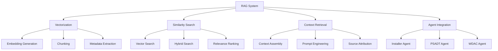

# Story 6.3: RAG Implementation for Similar Packages

**Status:** Draft

## Non-Technical Explanation

This story is about enhancing the system's ability to find and learn from similar packaging approaches when faced with new applications.

Imagine you're a chef trying to create a dish you've never made before. Instead of starting from scratch, you'd likely search through your cookbook or online for similar recipes that could guide your approach. You'd find recipes with similar ingredients or techniques, then adapt them to your specific needs.

Similarly, our RAG (Retrieval Augmented Generation) implementation will allow the system to search through its knowledge base for applications similar to the one it's currently packaging. When faced with a new video editing application, for example, the system might find three other multimedia applications in its knowledge base and apply the successful approaches used for those applications.

RAG is a more sophisticated approach than simple keyword searching. It uses AI to understand the semantic meaning and context of applications, finding relevant matches even when the exact terminology differs. For instance, it might recognize that a "photo manipulation tool" and an "image editing suite" are conceptually similar, even though the words are different.

By retrieving and learning from similar past experiences, the system can generate more effective packaging approaches, building on proven techniques rather than inventing everything from scratch. This leads to higher quality packaging with fewer errors, as the system leverages accumulated expertise for each new task.

## Goal & Context

**User Story:** As a packaging engineer, I need the system to use Retrieval Augmented Generation (RAG) to find similar packaging approaches for new applications.

**Context:** Building on the knowledge base (Story 6.1) and package import functionality (Story 6.2), this story implements a RAG system to enable the AI to find and learn from similar packages when creating packaging approaches for new applications. This improves the quality of automated packaging by leveraging previously successful approaches.

## Detailed Requirements

- Implement vectorization of package information
- Create similarity search algorithms
- Develop context retrieval for AI processing
- Implement ranking of relevant examples
- Create integration with AI generation components
- Document RAG implementation and effectiveness

## Acceptance Criteria (ACs)

- AC1: Vectorization effectively captures package characteristics
- AC2: Search algorithms find genuinely similar packages
- AC3: Context retrieval provides relevant information to AI
- AC4: Ranking prioritizes most useful examples
- AC5: Integration improves AI generation quality

## Technical Implementation Context

**Guidance:** Use the following details for implementation. Refer to the linked `docs/` files for broader context if needed.

- **Relevant Files:**

  - Files to Create:
    - `backend/apas/core/knowledge/vectorization.py` - Vectorization implementation
    - `backend/apas/core/knowledge/similarity_search.py` - Similarity search implementation
    - `backend/apas/core/knowledge/context_retrieval.py` - Context retrieval for AI
    - `backend/apas/core/knowledge/ranking.py` - Relevance ranking
    - `backend/apas/core/rag/rag_engine.py` - Main RAG implementation
    - `backend/apas/core/rag/prompts.py` - RAG prompt templates
    - `backend/apas/services/rag_service.py` - RAG service
    - `backend/apas/api/endpoints/rag.py` - RAG API endpoints
    - `backend/apas/api/schemas/rag.py` - RAG API schemas
    - `docs/developer-guide/rag-system.md` - RAG documentation
  - Files to Modify:
    - `backend/apas/api/router.py` - Add RAG routes
    - `backend/apas/core/agents/installer/agent.py` - Add RAG integration
    - `backend/apas/core/agents/psadt/agent.py` - Add RAG integration
    - `backend/apas/core/agents/wdac/agent.py` - Add RAG integration
    - `backend/apas/core/orchestration/mediator.py` - Add RAG coordination
  - _(Hint: See `docs/architecture/project-structure.md` for overall layout)_

- **Key Technologies:**

  - Sentence Transformers for text embeddings
  - pgvector extension for vector storage and search
  - LangChain for RAG implementation
  - FastAPI for API implementation
  - Pydantic for schema validation
  - _(Hint: See `docs/architecture/tech-stack.md` for technology details)_

- **API Interactions / SDK Usage:**

  - Implement API endpoints for RAG:
    - `POST /api/rag/similar` - Find similar packages
    - `POST /api/rag/retrieve-context` - Retrieve context for AI
    - `POST /api/rag/evaluate` - Evaluate RAG effectiveness
  - Implement integration with agent APIs
  - Support different similarity metrics and algorithms
  - _(Hint: See `docs/architecture/api-reference.md` for API patterns)_

- **Data Structures:**

  - `SimilaritySearchRequest` schema:
    ```python
    class SimilaritySearchRequest(BaseModel):
        """Similarity search request."""
        query: str
        content_type: Optional[str] = None
        categories: Optional[List[str]] = None
        tags: Optional[List[str]] = None
        limit: Optional[int] = 5
        similarity_threshold: Optional[float] = 0.7
        include_content: Optional[bool] = False
        
        class Config:
            extra = "forbid"
    ```
  - `SimilaritySearchResponse` schema:
    ```python
    class SimilaritySearchResponse(BaseModel):
        """Similarity search response."""
        results: List[Dict[str, Any]]
        total: int
        query: str
        
        class Config:
            extra = "allow"
    ```
  - `ContextRetrievalRequest` schema:
    ```python
    class ContextRetrievalRequest(BaseModel):
        """Context retrieval request."""
        application_info: Dict[str, Any]
        query: Optional[str] = None
        content_type: Optional[str] = None
        context_window_size: Optional[int] = 10000
        max_chunks: Optional[int] = 10
        
        class Config:
            extra = "forbid"
    ```
  - `ContextRetrievalResponse` schema:
    ```python
    class ContextRetrievalResponse(BaseModel):
        """Context retrieval response."""
        context: str
        sources: List[Dict[str, Any]]
        token_count: int
        
        class Config:
            extra = "allow"
    ```
  - `RAGVectorStore` model:
    ```python
    class RAGVectorStore:
        """RAG vector store for efficient retrieval."""
        
        def __init__(self, session, embedding_model):
            self.session = session
            self.embedding_model = embedding_model
        
        async def search(self, query, filters=None, limit=5, threshold=0.7):
            """Search for similar documents."""
            # Implementation details
            
        async def add_documents(self, documents):
            """Add documents to the vector store."""
            # Implementation details
            
        async def update_document(self, document_id, document):
            """Update a document in the vector store."""
            # Implementation details
            
        async def delete_document(self, document_id):
            """Delete a document from the vector store."""
            # Implementation details
    ```
  - _(Hint: See `docs/architecture/data-models.md` for structure details)_

- **Environment Variables:**

  - `RAG_EMBEDDING_MODEL` - Model name for text embeddings
  - `RAG_SIMILARITY_THRESHOLD` - Default similarity threshold
  - `RAG_MAX_CONTEXT_SIZE` - Maximum context size in tokens
  - `RAG_CHUNK_SIZE` - Size of chunks for document splitting
  - _(Hint: See `docs/architecture/environment-vars.md` for details)_

- **Coding Standards Notes:**
  - Implement efficient vector search for large datasets
  - Use chunking for large documents
  - Create comprehensive metadata for effective filtering
  - Implement proper error handling for search edge cases
  - Use async functions for database operations
  - _(Hint: See `docs/architecture/coding-standards.md` for full standards)_

## Visual Design Reference



## Tasks / Subtasks

- [ ] Implement document vectorization
  - [ ] Create embedding pipeline
  - [ ] Implement document chunking
  - [ ] Develop metadata extraction
  - [ ] Add embedding storage
  - [ ] Create automatic updates
- [ ] Develop similarity search
  - [ ] Implement vector search
  - [ ] Create hybrid search (vector + keyword)
  - [ ] Develop filtered search
  - [ ] Add relevance ranking
  - [ ] Create search optimization
- [ ] Implement context retrieval
  - [ ] Create context assembly
  - [ ] Implement token counting
  - [ ] Develop context truncation
  - [ ] Add source attribution
  - [ ] Create context formatting
- [ ] Develop RAG prompt engineering
  - [ ] Create base prompt templates
  - [ ] Implement dynamic prompt generation
  - [ ] Develop context injection
  - [ ] Add instruction optimization
  - [ ] Create few-shot examples
- [ ] Implement RAG engine
  - [ ] Create core RAG implementation
  - [ ] Implement retrieval-generation pipeline
  - [ ] Develop caching mechanism
  - [ ] Add error handling
  - [ ] Create performance optimization
- [ ] Create agent integration
  - [ ] Implement installer agent integration
  - [ ] Create PSADT agent integration
  - [ ] Develop WDAC agent integration
  - [ ] Add orchestration integration
  - [ ] Create context sharing
- [ ] Implement API layer
  - [ ] Create similarity search endpoint
  - [ ] Implement context retrieval endpoint
  - [ ] Develop evaluation endpoint
  - [ ] Add metrics endpoint
  - [ ] Create documentation endpoint
- [ ] Develop evaluation metrics
  - [ ] Implement relevance metrics
  - [ ] Create coverage metrics
  - [ ] Develop effectiveness metrics
  - [ ] Add performance metrics
  - [ ] Create human evaluation tools
- [ ] Implement system monitoring
  - [ ] Create usage tracking
  - [ ] Implement performance monitoring
  - [ ] Develop quality assurance
  - [ ] Add continuous improvement
  - [ ] Create feedback incorporation
- [ ] Create documentation
  - [ ] Document RAG architecture
  - [ ] Create usage guide
  - [ ] Develop tuning guide
  - [ ] Add troubleshooting documentation
  - [ ] Create example implementations

## Manual Testing Guide (For Non-Technical Users)

You can verify the RAG implementation through these checks:

1. **Testing Similarity Search**:
   - Navigate to the knowledge base search interface
   - Enter a query for a type of application (e.g., "PDF editor")
   - Verify that the search returns relevant similar applications
   - Check that the results are ranked by relevance
   - Try different queries to test the search's flexibility

2. **Checking RAG Integration**:
   - Create a new packaging task for an application
   - During the analysis phase, observe if the system mentions similar applications it found
   - Verify that it applies relevant techniques from those similar applications
   - Check that it properly attributes where it got its approaches from
   - Confirm that the packaging decisions make sense in context

3. **Evaluating Context Retrieval**:
   - If there's a debugging or explanation view available, use it to see what context the system retrieved
   - Verify that the retrieved context is relevant to the current application
   - Check that the system includes diverse types of relevant information
   - Confirm that the context includes practical examples and techniques

4. **Testing with Different Applications**:
   - Try packaging applications of different types to test versatility
   - For each type, verify that it finds genuinely similar applications
   - Check that the similarities are based on relevant characteristics
   - Verify that the system adapts its approach based on the retrieved examples

5. **Verifying Quality Improvement**:
   - Compare packaging results before and after RAG implementation
   - Check if the RAG-enhanced approach includes more effective techniques
   - Verify that the system makes fewer errors or requires less intervention
   - Test how it handles unusual or complex applications

## Testing Requirements

**Guidance:** Verify implementation against the ACs using the following tests.

- **Unit Tests:** 
  - Test embedding generation
  - Test similarity calculation algorithms
  - Test context retrieval functions
  - Test document chunking
  - Verify prompt generation

- **Integration Tests:** 
  - Test end-to-end RAG workflow
  - Test agent integration with RAG
  - Test search with various query types
  - Verify context assembly with different applications
  - Test performance with large knowledge base

- **Manual Verification:** 
  - Verify relevance of similar packages found
  - Check quality of context retrieved
  - Test effectiveness for different application types
  - Verify performance improvements from RAG
  - Test with edge cases (rare application types)

## Implementation Example

Here's an example implementation of the RAG engine:

```python
import uuid
import datetime
from typing import List, Dict, Any, Optional, Union
from fastapi import Depends
from sqlalchemy.ext.asyncio import AsyncSession
from sentence_transformers import SentenceTransformer
import numpy as np

from apas.db.session import get_async_session
from apas.models.knowledge import KnowledgeEntry
from apas.core.knowledge.similarity_search import SimilaritySearch
from apas.core.knowledge.context_retrieval import ContextRetrieval
from apas.core.rag.prompts import PromptTemplates

class RAGEngine:
    """Retrieval Augmented Generation engine for packaging knowledge."""
    
    def __init__(
        self, 
        session: AsyncSession = Depends(get_async_session),
        embedding_model: Optional[str] = None,
        similarity_threshold: float = 0.7,
        max_context_size: int = 10000
    ):
        self.session = session
        self.embedding_model_name = embedding_model or "all-MiniLM-L6-v2"
        self.embedding_model = SentenceTransformer(self.embedding_model_name)
        self.similarity_threshold = similarity_threshold
        self.max_context_size = max_context_size
        
        self.similarity_search = SimilaritySearch(self.session, self.embedding_model)
        self.context_retrieval = ContextRetrieval(self.session, self.max_context_size)
        self.prompt_templates = PromptTemplates()
    
    async def find_similar_packages(
        self, 
        application_info: Dict[str, Any],
        content_type: Optional[str] = None,
        categories: Optional[List[str]] = None,
        limit: int = 5
    ) -> List[Dict[str, Any]]:
        """
        Find similar packages based on application info.
        
        Args:
            application_info: Application information
            content_type: Content type filter
            categories: Categories filter
            limit: Maximum number of results
            
        Returns:
            List of similar packages
        """
        # Generate query from application info
        query = self._generate_query_from_app_info(application_info)
        
        # Prepare filters
        filters = {}
        if content_type:
            filters["content_type"] = content_type
        if categories:
            filters["categories"] = categories
        
        # Perform search
        results = await self.similarity_search.search(
            query=query,
            filters=filters,
            limit=limit,
            threshold=self.similarity_threshold
        )
        
        # Enhance results with relevance information
        enhanced_results = []
        for result in results:
            relevant_aspects = self._identify_relevant_aspects(application_info, result)
            result["relevant_aspects"] = relevant_aspects
            enhanced_results.append(result)
        
        return enhanced_results
    
    async def retrieve_context(
        self,
        application_info: Dict[str, Any],
        agent_type: str,
        task_type: str,
        context_window_size: int = 10000,
        max_chunks: int = 10
    ) -> Dict[str, Any]:
        """
        Retrieve context for AI processing.
        
        Args:
            application_info: Application information
            agent_type: Agent type (installer, psadt, wdac)
            task_type: Task type (analysis, generation, validation)
            context_window_size: Maximum context window size in tokens
            max_chunks: Maximum number of chunks to retrieve
            
        Returns:
            Context for AI processing
        """
        # Find similar packages
        content_type = self._agent_to_content_type(agent_type)
        similar_packages = await self.find_similar_packages(
            application_info=application_info,
            content_type=content_type,
            limit=max_chunks
        )
        
        # Retrieve context chunks
        context_chunks = await self.context_retrieval.retrieve_chunks(
            similar_packages=similar_packages,
            task_type=task_type,
            max_chunks=max_chunks
        )
        
        # Assemble context
        context = self.context_retrieval.assemble_context(
            chunks=context_chunks,
            max_tokens=context_window_size
        )
        
        # Generate RAG prompt
        prompt = self.prompt_templates.generate_prompt(
            agent_type=agent_type,
            task_type=task_type,
            application_info=application_info,
            context=context
        )
        
        return {
            "prompt": prompt,
            "context": context,
            "sources": [chunk["source"] for chunk in context_chunks],
            "token_count": self.context_retrieval.count_tokens(prompt),
            "similar_packages": [pkg["id"] for pkg in similar_packages]
        }
    
    async def evaluate_rag(
        self,
        application_info: Dict[str, Any],
        agent_type: str,
        task_type: str,
        generated_output: str
    ) -> Dict[str, Any]:
        """
        Evaluate RAG effectiveness.
        
        Args:
            application_info: Application information
            agent_type: Agent type
            task_type: Task type
            generated_output: Generated output
            
        Returns:
            Evaluation metrics
        """
        # Find similar packages
        content_type = self._agent_to_content_type(agent_type)
        similar_packages = await self.find_similar_packages(
            application_info=application_info,
            content_type=content_type,
            limit=5
        )
        
        # Extract techniques from similar packages
        techniques = []
        for pkg in similar_packages:
            pkg_techniques = self._extract_techniques(pkg)
            techniques.extend(pkg_techniques)
        
        # Extract techniques from generated output
        output_techniques = self._extract_techniques_from_output(generated_output)
        
        # Calculate technique coverage
        coverage = self._calculate_technique_coverage(techniques, output_techniques)
        
        # Calculate relevance score
        relevance = self._calculate_relevance_score(output_techniques, application_info)
        
        return {
            "coverage": coverage,
            "relevance": relevance,
            "technique_count": len(output_techniques),
            "similar_packages_count": len(similar_packages),
            "similar_techniques_count": len(techniques),
            "applied_techniques_count": sum(1 for t in output_techniques if t in techniques)
        }
    
    def _generate_query_from_app_info(self, application_info: Dict[str, Any]) -> str:
        """Generate search query from application info."""
        query_parts = []
        
        # Add application name
        if "name" in application_info:
            query_parts.append(application_info["name"])
        
        # Add application type/category
        if "type" in application_info:
            query_parts.append(application_info["type"])
        elif "category" in application_info:
            query_parts.append(application_info["category"])
        
        # Add vendor
        if "vendor" in application_info:
            query_parts.append(application_info["vendor"])
        
        # Add installer type
        if "installer_type" in application_info:
            query_parts.append(f"installer type: {application_info['installer_type']}")
        
        # Add any specific requirements
        if "requirements" in application_info:
            requirements = application_info["requirements"]
            if isinstance(requirements, list):
                query_parts.extend(requirements)
            elif isinstance(requirements, str):
                query_parts.append(requirements)
        
        # Join all parts
        query = " ".join(query_parts)
        
        return query
    
    def _agent_to_content_type(self, agent_type: str) -> Optional[str]:
        """Convert agent type to content type."""
        mapping = {
            "installer": "application",
            "psadt": "psadt_script",
            "wdac": "wdac_policy"
        }
        return mapping.get(agent_type.lower())
    
    def _identify_relevant_aspects(
        self, 
        application_info: Dict[str, Any], 
        similar_package: Dict[str, Any]
    ) -> List[Dict[str, Any]]:
        """Identify relevant aspects between application info and similar package."""
        relevant_aspects = []
        
        # Check installer type
        if "installer_type" in application_info and "installer_type" in similar_package.get("metadata", {}):
            if application_info["installer_type"] == similar_package["metadata"]["installer_type"]:
                relevant_aspects.append({
                    "aspect": "installer_type",
                    "value": application_info["installer_type"],
                    "relevance": "high"
                })
        
        # Check application category
        app_category = application_info.get("type") or application_info.get("category")
        pkg_category = similar_package.get("metadata", {}).get("application_type") or similar_package.get("metadata", {}).get("category")
        
        if app_category and pkg_category:
            if app_category.lower() == pkg_category.lower():
                relevant_aspects.append({
                    "aspect": "category",
                    "value": app_category,
                    "relevance": "high"
                })
        
        # Check vendor
        if "vendor" in application_info and "vendor" in similar_package.get("metadata", {}):
            if application_info["vendor"].lower() == similar_package["metadata"]["vendor"].lower():
                relevant_aspects.append({
                    "aspect": "vendor",
                    "value": application_info["vendor"],
                    "relevance": "medium"
                })
        
        # Check requirements
        if "requirements" in application_info and "requirements" in similar_package.get("metadata", {}):
            app_reqs = application_info["requirements"]
            pkg_reqs = similar_package["metadata"]["requirements"]
            
            if isinstance(app_reqs, list) and isinstance(pkg_reqs, list):
                common_reqs = [req for req in app_reqs if req in pkg_reqs]
                if common_reqs:
                    relevant_aspects.append({
                        "aspect": "requirements",
                        "value": common_reqs,
                        "relevance": "high"
                    })
        
        return relevant_aspects
    
    def _extract_techniques(self, package: Dict[str, Any]) -> List[str]:
        """Extract techniques from a package."""
        techniques = []
        
        # Extract from techniques field
        if "techniques" in package:
            pkg_techniques = package["techniques"]
            if isinstance(pkg_techniques, dict) and "detected_techniques" in pkg_techniques:
                techniques.extend(pkg_techniques["detected_techniques"])
            elif isinstance(pkg_techniques, list):
                techniques.extend(pkg_techniques)
        
        # Extract from functions
        if "functions" in package and "toolkit_functions" in package["functions"]:
            for func in package["functions"]["toolkit_functions"]:
                if "type" in func and func["type"] not in techniques:
                    techniques.append(func["type"])
        
        return techniques
    
    def _extract_techniques_from_output(self, output: str) -> List[str]:
        """Extract techniques from generated output."""
        # This is a simplified implementation
        # In a real system, this would use more sophisticated parsing
        
        techniques = []
        common_techniques = [
            "msi installation",
            "exe installation",
            "registry modification",
            "file operation",
            "service management",
            "process execution",
            "user interaction",
            "environment refresh",
            "windows update",
            "code signing",
            "hash verification"
        ]
        
        for technique in common_techniques:
            if technique.lower() in output.lower():
                techniques.append(technique)
        
        return techniques
    
    def _calculate_technique_coverage(
        self, 
        reference_techniques: List[str], 
        output_techniques: List[str]
    ) -> float:
        """Calculate technique coverage."""
        if not reference_techniques:
            return 0.0
        
        common_techniques = [t for t in output_techniques if t in reference_techniques]
        coverage = len(common_techniques) / len(reference_techniques)
        
        return min(1.0, coverage)
    
    def _calculate_relevance_score(
        self, 
        techniques: List[str], 
        application_info: Dict[str, Any]
    ) -> float:
        """Calculate relevance score."""
        # This is a simplified implementation
        # In a real system, this would use more sophisticated relevance scoring
        
        score = 0.0
        
        # Check installer type relevance
        if "installer_type" in application_info:
            installer_type = application_info["installer_type"].lower()
            if installer_type == "msi" and "msi installation" in techniques:
                score += 0.3
            elif installer_type == "exe" and "exe installation" in techniques:
                score += 0.3
        
        # Check for basic operations
        if "registry modification" in techniques:
            score += 0.2
        if "file operation" in techniques:
            score += 0.2
        
        # Check for advanced techniques
        advanced_techniques_count = 0
        advanced_techniques = [
            "service management",
            "user interaction",
            "windows update",
            "code signing",
            "hash verification"
        ]
        
        for technique in advanced_techniques:
            if technique in techniques:
                advanced_techniques_count += 1
        
        if advanced_techniques_count > 0:
            score += 0.3 * (advanced_techniques_count / len(advanced_techniques))
        
        return min(1.0, score)
```

## Story Wrap Up (Agent Populates After Execution)

- **Agent Model Used:** `claude-3.7-sonnet-20250219`
- **Completion Notes:** 
- **Change Log:**
  - Initial Draft
