# Story 6.4: Packaging Memory System

**Status:** Draft

## Non-Technical Explanation

This story is about creating a system that allows the AI to learn from experience over time, by remembering and analyzing past packaging successes and failures.

Think of it like the institutional memory of an organization. When a team has been doing a job for years, they don't just have documented processes—they've developed an intuition about what works and what doesn't based on experience. They remember that "every time we try approach X with this type of application, we run into problem Y" or "technique Z works particularly well for applications from vendor W."

Similarly, our packaging memory system will track outcomes of different packaging approaches, identify patterns in what leads to success or failure, and adjust future approaches based on this accumulated experience. Unlike a static knowledge base, the memory system actively learns from results, becoming more effective over time.

For example, if the system notices that a certain installation approach consistently causes problems with a specific type of application, it will learn to avoid that approach in similar situations. Or if it discovers that adding a particular registry key resolves an issue with applications from a certain vendor, it will remember to apply that fix proactively in similar cases.

This continuous learning ensures the system gets better over time rather than repeating the same mistakes. It's the difference between a system that simply follows rules and one that develops expertise through experience.

## Goal & Context

**User Story:** As a packaging engineer, I need the system to remember and learn from past packaging successes and failures.

**Context:** Building on the knowledge base (Story 6.1), package import (Story 6.2), and RAG implementation (Story 6.3), this story creates a memory system that tracks packaging outcomes, identifies patterns of success and failure, and applies these learnings to improve future packaging approaches. This enables continuous improvement of the system over time.

## Detailed Requirements

- Implement tracking of packaging outcomes
- Create analysis of success and failure patterns
- Develop identification of key success factors
- Implement adjustment of future approaches based on history
- Create visualization of learning progress
- Document memory system architecture and benefits

## Acceptance Criteria (ACs)

- AC1: Tracking captures meaningful outcome information
- AC2: Analysis correctly identifies result patterns
- AC3: Key factors are accurately associated with outcomes
- AC4: Future approaches improve based on historical learning
- AC5: Visualization clearly shows learning progression

## Technical Implementation Context

**Guidance:** Use the following details for implementation. Refer to the linked `docs/` files for broader context if needed.

- **Relevant Files:**

  - Files to Create:
    - `backend/apas/core/memory/memory_system.py` - Core memory system implementation
    - `backend/apas/core/memory/outcome_tracker.py` - Outcome tracking implementation
    - `backend/apas/core/memory/pattern_analysis.py` - Pattern analysis implementation
    - `backend/apas/core/memory/factor_identification.py` - Success factor identification
    - `backend/apas/core/memory/approach_adjustment.py` - Approach adjustment implementation
    - `backend/apas/models/memory.py` - Memory system database models
    - `backend/apas/services/memory_service.py` - Memory system service
    - `backend/apas/api/endpoints/memory.py` - Memory system API endpoints
    - `backend/apas/api/schemas/memory.py` - Memory system API schemas
    - `frontend/src/components/memory/LearningVisualization.tsx` - Learning visualization component
    - `frontend/src/hooks/useMemory.tsx` - Memory hook
    - `frontend/src/api/memory.ts` - Memory API client
    - `docs/developer-guide/memory-system.md` - Memory system documentation
  - Files to Modify:
    - `backend/apas/api/router.py` - Add memory routes
    - `backend/apas/core/agents/base.py` - Add memory integration
    - `backend/apas/core/orchestration/mediator.py` - Add memory coordination
    - `frontend/src/components/dashboard/TaskDetailView.tsx` - Add memory visualization
  - _(Hint: See `docs/architecture/project-structure.md` for overall layout)_

- **Key Technologies:**

  - Scikit-learn for pattern analysis and statistics
  - PostgreSQL for relational data storage
  - D3.js for visualizations
  - FastAPI for API implementation
  - React for UI components
  - _(Hint: See `docs/architecture/tech-stack.md` for technology details)_

- **API Interactions / SDK Usage:**

  - Implement API endpoints for memory system:
    - `POST /api/memory/outcomes` - Record packaging outcome
    - `GET /api/memory/patterns` - Get identified patterns
    - `GET /api/memory/factors` - Get key success factors
    - `GET /api/memory/visualizations` - Get learning visualizations
    - `GET /api/memory/recommendations` - Get approach recommendations
  - Implement integration with agent APIs
  - Support different visualization types
  - _(Hint: See `docs/architecture/api-reference.md` for API patterns)_

- **UI/UX Notes:**

  - Create clear visualizations of learning progress
  - Implement interactive exploration of patterns
  - Provide transparency into system recommendations
  - Show confidence levels for identified patterns
  - Use appropriate charts for different data types
  - _(Hint: See `docs/APAS_UI_UX_Specification.md` for design details)_

- **Data Structures:**

  - `PackagingOutcome` model:
    ```python
    class PackagingOutcome(Base):
        """Packaging outcome model."""
        __tablename__ = "packaging_outcomes"
        
        id = Column(String, primary_key=True, default=lambda: str(uuid.uuid4()))
        task_id = Column(String, nullable=False)
        application_name = Column(String, nullable=False)
        application_version = Column(String, nullable=True)
        application_vendor = Column(String, nullable=True)
        installer_type = Column(String, nullable=True)
        approach_details = Column(JSONB, nullable=False)
        outcome_status = Column(String, nullable=False)  # success, failure, partial
        success_factors = Column(JSONB, nullable=True)
        failure_reasons = Column(JSONB, nullable=True)
        manual_interventions = Column(JSONB, nullable=True)
        performance_metrics = Column(JSONB, nullable=True)
        feedback = Column(JSONB, nullable=True)
        created_at = Column(DateTime, nullable=False, default=datetime.datetime.utcnow)
        
        # Indexes
        __table_args__ = (
            Index("ix_packaging_outcomes_application_name", "application_name"),
            Index("ix_packaging_outcomes_outcome_status", "outcome_status"),
            Index("ix_packaging_outcomes_installer_type", "installer_type"),
        )
    ```
  - `PatternIdentification` model:
    ```python
    class PatternIdentification(Base):
        """Pattern identification model."""
        __tablename__ = "pattern_identifications"
        
        id = Column(String, primary_key=True, default=lambda: str(uuid.uuid4()))
        pattern_type = Column(String, nullable=False)  # success, failure, intervention
        pattern_name = Column(String, nullable=False)
        description = Column(Text, nullable=False)
        conditions = Column(JSONB, nullable=False)
        impact = Column(JSONB, nullable=False)
        confidence = Column(Float, nullable=False)
        sample_size = Column(Integer, nullable=False)
        related_outcomes = Column(ARRAY(String), nullable=False)
        created_at = Column(DateTime, nullable=False, default=datetime.datetime.utcnow)
        updated_at = Column(DateTime, nullable=False, default=datetime.datetime.utcnow, onupdate=datetime.datetime.utcnow)
        active = Column(Boolean, nullable=False, default=True)
        
        # Indexes
        __table_args__ = (
            Index("ix_pattern_identifications_pattern_type", "pattern_type"),
            Index("ix_pattern_identifications_confidence", "confidence"),
        )
    ```
  - `SuccessFactor` model:
    ```python
    class SuccessFactor(Base):
        """Success factor model."""
        __tablename__ = "success_factors"
        
        id = Column(String, primary_key=True, default=lambda: str(uuid.uuid4()))
        factor_name = Column(String, nullable=False)
        description = Column(Text, nullable=False)
        applicability_conditions = Column(JSONB, nullable=False)
        effectiveness = Column(Float, nullable=False)
        confidence = Column(Float, nullable=False)
        sample_size = Column(Integer, nullable=False)
        implementation_details = Column(JSONB, nullable=False)
        created_at = Column(DateTime, nullable=False, default=datetime.datetime.utcnow)
        updated_at = Column(DateTime, nullable=False, default=datetime.datetime.utcnow, onupdate=datetime.datetime.utcnow)
        
        # Indexes
        __table_args__ = (
            Index("ix_success_factors_effectiveness", "effectiveness"),
            Index("ix_success_factors_confidence", "confidence"),
        )
    ```
  - `ApproachRecommendation` model:
    ```python
    class ApproachRecommendation(Base):
        """Approach recommendation model."""
        __tablename__ = "approach_recommendations"
        
        id = Column(String, primary_key=True, default=lambda: str(uuid.uuid4()))
        application_type = Column(String, nullable=False)
        installer_type = Column(String, nullable=False)
        conditions = Column(JSONB, nullable=False)
        recommended_approach = Column(JSONB, nullable=False)
        avoid_approach = Column(JSONB, nullable=True)
        success_rate = Column(Float, nullable=False)
        confidence = Column(Float, nullable=False)
        sample_size = Column(Integer, nullable=False)
        supporting_patterns = Column(ARRAY(String), nullable=False)
        created_at = Column(DateTime, nullable=False, default=datetime.datetime.utcnow)
        updated_at = Column(DateTime, nullable=False, default=datetime.datetime.utcnow, onupdate=datetime.datetime.utcnow)
        
        # Indexes
        __table_args__ = (
            Index("ix_approach_recommendations_application_type", "application_type"),
            Index("ix_approach_recommendations_installer_type", "installer_type"),
            Index("ix_approach_recommendations_success_rate", "success_rate"),
        )
    ```
  - _(Hint: See `docs/architecture/data-models.md` for structure details)_

- **Environment Variables:**

  - `MEMORY_MIN_SAMPLE_SIZE` - Minimum sample size for pattern identification
  - `MEMORY_CONFIDENCE_THRESHOLD` - Minimum confidence for approach recommendations
  - `MEMORY_UPDATE_INTERVAL` - Interval for background pattern analysis
  - `MEMORY_MAX_PATTERNS` - Maximum number of patterns to track
  - _(Hint: See `docs/architecture/environment-vars.md` for details)_

- **Coding Standards Notes:**
  - Implement efficient pattern analysis for large datasets
  - Use statistical significance testing for pattern validation
  - Create comprehensive logging for memory operations
  - Implement proper error handling for analysis edge cases
  - Use background tasks for computationally intensive analysis
  - _(Hint: See `docs/architecture/coding-standards.md` for full standards)_

## Visual Design Reference

```mermaid
graph TD
    A[Memory System] --> B[Outcome Tracking]
    A --> C[Pattern Analysis]
    A --> D[Factor Identification]
    A --> E[Approach Adjustment]
    A --> F[Learning Visualization]
    
    B --> B1[Success Recording]
    B --> B2[Failure Recording]
    B --> B3[Intervention Recording]
    
    C --> C1[Statistical Analysis]
    C --> C2[Correlation Detection]
    C --> C3[Classification]
    C --> C4[Pattern Validation]
    
    D --> D1[Factor Extraction]
    D --> D2[Impact Assessment]
    D --> D3[Confidence Calculation]
    
    E --> E1[Recommendation Generation]
    E --> E2[Approach Refinement]
    E --> E3[Verification Loop]
    
    F --> F1[Progress Charts]
    F --> F2[Pattern Visualization]
    F --> F3[Factor Impact Display]
```



## Tasks / Subtasks

- [ ] Implement outcome tracking system
  - [ ] Create success outcome recording
  - [ ] Implement failure outcome recording
  - [ ] Develop intervention tracking
  - [ ] Add performance metrics collection
  - [ ] Create feedback integration
- [ ] Develop pattern analysis engine
  - [ ] Implement statistical analysis
  - [ ] Create correlation detection
  - [ ] Develop classification algorithms
  - [ ] Add pattern validation
  - [ ] Create pattern storage
- [ ] Implement success factor identification
  - [ ] Create factor extraction
  - [ ] Implement impact assessment
  - [ ] Develop confidence calculation
  - [ ] Add factor ranking
  - [ ] Create factor documentation
- [ ] Develop approach adjustment system
  - [ ] Create recommendation generation
  - [ ] Implement approach refinement
  - [ ] Develop verification loop
  - [ ] Add adaptability tuning
  - [ ] Create recommendation storage
- [ ] Implement learning visualization
  - [ ] Create progress charts
  - [ ] Implement pattern visualization
  - [ ] Develop factor impact display
  - [ ] Add trend analysis
  - [ ] Create interactive exploration
- [ ] Set up agent integration
  - [ ] Implement memory system API
  - [ ] Create outcome reporting
  - [ ] Develop recommendation retrieval
  - [ ] Add pattern utilization
  - [ ] Create learning feedback
- [ ] Develop monitoring and metrics
  - [ ] Implement system effectiveness metrics
  - [ ] Create learning rate tracking
  - [ ] Develop performance impact assessment
  - [ ] Add quality improvement metrics
  - [ ] Create usage analytics
- [ ] Implement administrative tools
  - [ ] Create pattern management interface
  - [ ] Implement factor adjustment tools
  - [ ] Develop system configuration
  - [ ] Add data export/import
  - [ ] Create backup/restore
- [ ] Set up background analysis
  - [ ] Implement periodic analysis jobs
  - [ ] Create incremental analysis
  - [ ] Develop notification system
  - [ ] Add threshold alerts
  - [ ] Create analysis logging
- [ ] Create documentation
  - [ ] Document memory system architecture
  - [ ] Create usage guide
  - [ ] Develop analysis interpretation guide
  - [ ] Add pattern management documentation
  - [ ] Create troubleshooting guide

## Manual Testing Guide (For Non-Technical Users)

You can verify the packaging memory system through these checks:

1. **Viewing Packaging Outcomes**:
   - Navigate to the packaging history or memory dashboard
   - Verify that you can see records of past packaging outcomes
   - Check that each outcome shows relevant details (application, approach, success/failure)
   - Confirm that the system captures both successful and unsuccessful outcomes
   - Try filtering outcomes by different criteria to test the tracking system

2. **Exploring Identified Patterns**:
   - Look for a patterns section in the dashboard
   - Verify that the system shows patterns it has identified
   - Check that each pattern includes supporting evidence
   - Confirm that patterns make sense based on the outcomes they reference
   - Try sorting patterns by confidence or impact to find the most significant ones

3. **Reviewing Success Factors**:
   - Navigate to the success factors view if available
   - Check that factors show their applicability conditions
   - Verify that each factor includes effectiveness and confidence ratings
   - Confirm that the system links factors to specific patterns or outcomes
   - Try filtering factors by application type to find relevant ones

4. **Testing Approach Recommendations**:
   - Create a new packaging task for an application
   - Observe if the system suggests approaches based on past learning
   - Check that recommendations include reasoning about why they're suggested
   - Verify that suggestions reference relevant past successes or failures
   - Confirm that the system is adjusting its approach based on historical data

5. **Exploring Learning Visualizations**:
   - Navigate to the learning or analytics section
   - Check that visualizations show the system's learning progression
   - Verify that charts display meaningful metrics about success rates or factors
   - Try interacting with visualizations to explore different aspects
   - Confirm that you can see how the system has improved over time

## Testing Requirements

**Guidance:** Verify implementation against the ACs using the following tests.

- **Unit Tests:** 
  - Test pattern analysis algorithms
  - Test success factor extraction
  - Test recommendation generation
  - Test visualization data preparation
  - Verify statistical significance calculations

- **Integration Tests:** 
  - Test end-to-end outcome recording and analysis
  - Test pattern identification from multiple outcomes
  - Test recommendation application to new tasks
  - Verify agent integration with memory system
  - Test visualization data flow

- **Manual Verification:** 
  - Verify pattern identification accuracy
  - Check recommendation relevance for different applications
  - Test system adaptability to new information
  - Verify visualization clarity and usefulness
  - Test with various outcome scenarios

## Implementation Example

Here's an example implementation of the pattern analysis engine:

```python
import uuid
import datetime
import numpy as np
import pandas as pd
from typing import List, Dict, Any, Optional, Tuple
from sqlalchemy.ext.asyncio import AsyncSession
from sqlalchemy import select, and_, or_, func
from sklearn.cluster import DBSCAN
from sklearn.feature_extraction.text import TfidfVectorizer
from sklearn.preprocessing import StandardScaler
from sklearn.model_selection import train_test_split
from sklearn.ensemble import RandomForestClassifier
from sklearn.metrics import accuracy_score, precision_score, recall_score, f1_score

from apas.models.memory import PackagingOutcome, PatternIdentification
from apas.db.session import get_async_session

class PatternAnalysisEngine:
    """Pattern analysis engine for packaging memory system."""
    
    def __init__(
        self, 
        session: AsyncSession = None,
        min_sample_size: int = 5,
        confidence_threshold: float = 0.7,
        max_patterns: int = 100
    ):
        self.session = session
        self.min_sample_size = min_sample_size
        self.confidence_threshold = confidence_threshold
        self.max_patterns = max_patterns
    
    async def analyze_patterns(self) -> Dict[str, Any]:
        """
        Analyze patterns from packaging outcomes.
        
        Returns:
            Analysis results
        """
        # Get packaging outcomes
        query = select(PackagingOutcome)
        result = await self.session.execute(query)
        outcomes = result.scalars().all()
        
        if len(outcomes) < self.min_sample_size:
            return {
                "status": "insufficient_data",
                "message": f"Insufficient data for pattern analysis. Need at least {self.min_sample_size} outcomes."
            }
        
        # Convert to DataFrame for analysis
        df = self._convert_to_dataframe(outcomes)
        
        # Perform analysis
        success_patterns = await self._analyze_success_patterns(df)
        failure_patterns = await self._analyze_failure_patterns(df)
        intervention_patterns = await self._analyze_intervention_patterns(df)
        
        # Combine results
        all_patterns = success_patterns + failure_patterns + intervention_patterns
        
        # Store patterns in database
        await self._store_patterns(all_patterns)
        
        return {
            "status": "success",
            "patterns_identified": len(all_patterns),
            "success_patterns": len(success_patterns),
            "failure_patterns": len(failure_patterns),
            "intervention_patterns": len(intervention_patterns)
        }
    
    async def get_patterns(
        self,
        pattern_type: Optional[str] = None,
        min_confidence: float = 0.0,
        limit: int = 100
    ) -> List[Dict[str, Any]]:
        """
        Get identified patterns.
        
        Args:
            pattern_type: Pattern type filter
            min_confidence: Minimum confidence threshold
            limit: Maximum number of patterns to return
            
        Returns:
            List of patterns
        """
        # Build query
        query = select(PatternIdentification).where(
            PatternIdentification.confidence >= min_confidence,
            PatternIdentification.active == True
        )
        
        if pattern_type:
            query = query.where(PatternIdentification.pattern_type == pattern_type)
        
        query = query.order_by(PatternIdentification.confidence.desc()).limit(limit)
        
        # Execute query
        result = await self.session.execute(query)
        patterns = result.scalars().all()
        
        # Convert to response format
        return [
            {
                "id": pattern.id,
                "pattern_type": pattern.pattern_type,
                "pattern_name": pattern.pattern_name,
                "description": pattern.description,
                "conditions": pattern.conditions,
                "impact": pattern.impact,
                "confidence": pattern.confidence,
                "sample_size": pattern.sample_size,
                "created_at": pattern.created_at
            }
            for pattern in patterns
        ]
    
    async def get_pattern_details(self, pattern_id: str) -> Dict[str, Any]:
        """
        Get detailed information about a pattern.
        
        Args:
            pattern_id: Pattern ID
            
        Returns:
            Pattern details
            
        Raises:
            Exception: If pattern not found
        """
        # Get pattern
        query = select(PatternIdentification).where(PatternIdentification.id == pattern_id)
        result = await self.session.execute(query)
        pattern = result.scalar_one_or_none()
        
        if not pattern:
            raise Exception(f"Pattern {pattern_id} not found")
        
        # Get related outcomes
        outcome_query = select(PackagingOutcome).where(
            PackagingOutcome.id.in_(pattern.related_outcomes)
        )
        outcome_result = await self.session.execute(outcome_query)
        outcomes = outcome_result.scalars().all()
        
        # Convert to response format
        return {
            "id": pattern.id,
            "pattern_type": pattern.pattern_type,
            "pattern_name": pattern.pattern_name,
            "description": pattern.description,
            "conditions": pattern.conditions,
            "impact": pattern.impact,
            "confidence": pattern.confidence,
            "sample_size": pattern.sample_size,
            "created_at": pattern.created_at,
            "updated_at": pattern.updated_at,
            "related_outcomes": [
                {
                    "id": outcome.id,
                    "application_name": outcome.application_name,
                    "outcome_status": outcome.outcome_status,
                    "created_at": outcome.created_at
                }
                for outcome in outcomes
            ]
        }
    
    def _convert_to_dataframe(self, outcomes: List[PackagingOutcome]) -> pd.DataFrame:
        """Convert outcomes to DataFrame for analysis."""
        data = []
        
        for outcome in outcomes:
            row = {
                "id": outcome.id,
                "application_name": outcome.application_name,
                "application_version": outcome.application_version,
                "application_vendor": outcome.application_vendor,
                "installer_type": outcome.installer_type,
                "outcome_status": outcome.outcome_status,
                "created_at": outcome.created_at
            }
            
            # Extract approach details
            for key, value in outcome.approach_details.items():
                row[f"approach_{key}"] = value
            
            # Extract success factors
            if outcome.success_factors:
                for key, value in outcome.success_factors.items():
                    row[f"success_{key}"] = value
            
            # Extract failure reasons
            if outcome.failure_reasons:
                for key, value in outcome.failure_reasons.items():
                    row[f"failure_{key}"] = value
            
            # Extract manual interventions
            if outcome.manual_interventions:
                for key, value in outcome.manual_interventions.items():
                    row[f"intervention_{key}"] = value
            
            # Extract performance metrics
            if outcome.performance_metrics:
                for key, value in outcome.performance_metrics.items():
                    row[f"metric_{key}"] = value
            
            data.append(row)
        
        # Create DataFrame
        df = pd.DataFrame(data)
        
        return df
    
    async def _analyze_success_patterns(self, df: pd.DataFrame) -> List[Dict[str, Any]]:
        """Analyze patterns in successful outcomes."""
        # Filter for successful outcomes
        success_df = df[df["outcome_status"] == "success"].copy()
        
        if len(success_df) < self.min_sample_size:
            return []
        
        patterns = []
        
        # Analyze installer type success rates
        installer_patterns = self._analyze_categorical_success_factor(
            success_df, "installer_type", "Installer Type Success Pattern"
        )
        patterns.extend(installer_patterns)
        
        # Analyze vendor success rates
        vendor_patterns = self._analyze_categorical_success_factor(
            success_df, "application_vendor", "Vendor Success Pattern"
        )
        patterns.extend(vendor_patterns)
        
        # Analyze approach techniques
        approach_columns = [col for col in success_df.columns if col.startswith("approach_")]
        for col in approach_columns:
            technique_name = col.replace("approach_", "")
            technique_patterns = self._analyze_approach_technique(
                success_df, col, f"{technique_name.title()} Success Pattern"
            )
            patterns.extend(technique_patterns)
        
        # Filter by confidence threshold
        return [p for p in patterns if p["confidence"] >= self.confidence_threshold]
    
    async def _analyze_failure_patterns(self, df: pd.DataFrame) -> List[Dict[str, Any]]:
        """Analyze patterns in failed outcomes."""
        # Filter for failed outcomes
        failure_df = df[df["outcome_status"] == "failure"].copy()
        
        if len(failure_df) < self.min_sample_size:
            return []
        
        patterns = []
        
        # Analyze failure reasons
        failure_columns = [col for col in failure_df.columns if col.startswith("failure_")]
        for col in failure_columns:
            reason_name = col.replace("failure_", "")
            reason_patterns = self._analyze_failure_reason(
                failure_df, col, f"{reason_name.title()} Failure Pattern"
            )
            patterns.extend(reason_patterns)
        
        # Analyze problematic approaches
        approach_columns = [col for col in failure_df.columns if col.startswith("approach_")]
        for col in approach_columns:
            technique_name = col.replace("approach_", "")
            technique_patterns = self._analyze_problematic_approach(
                df, col, f"{technique_name.title()} Failure Pattern"
            )
            patterns.extend(technique_patterns)
        
        # Filter by confidence threshold
        return [p for p in patterns if p["confidence"] >= self.confidence_threshold]
    
    async def _analyze_intervention_patterns(self, df: pd.DataFrame) -> List[Dict[str, Any]]:
        """Analyze patterns in interventions."""
        # Check if interventions exist
        intervention_columns = [col for col in df.columns if col.startswith("intervention_")]
        
        if not intervention_columns or len(df) < self.min_sample_size:
            return []
        
        patterns = []
        
        # Analyze intervention types
        for col in intervention_columns:
            intervention_name = col.replace("intervention_", "")
            intervention_patterns = self._analyze_intervention_type(
                df, col, f"{intervention_name.title()} Intervention Pattern"
            )
            patterns.extend(intervention_patterns)
        
        # Filter by confidence threshold
        return [p for p in patterns if p["confidence"] >= self.confidence_threshold]
    
    def _analyze_categorical_success_factor(
        self, 
        df: pd.DataFrame, 
        column: str, 
        pattern_prefix: str
    ) -> List[Dict[str, Any]]:
        """Analyze success patterns for categorical factors."""
        patterns = []
        
        # Skip if column doesn't exist
        if column not in df.columns:
            return patterns
        
        # Calculate success rates by category
        category_counts = df[column].value_counts()
        
        for category, count in category_counts.items():
            if count < self.min_sample_size or pd.isna(category):
                continue
            
            # Calculate confidence based on sample size
            confidence = min(1.0, count / (self.min_sample_size * 2))
            
            # Create pattern
            pattern = {
                "id": str(uuid.uuid4()),
                "pattern_type": "success",
                "pattern_name": f"{pattern_prefix}: {category}",
                "description": f"Applications with {column} = '{category}' have a high success rate with the identified approaches.",
                "conditions": {
                    column: category
                },
                "impact": {
                    "success_rate": 1.0,  # These are all successes
                    "applicability": count / len(df)
                },
                "confidence": confidence,
                "sample_size": count,
                "related_outcomes": df[df[column] == category]["id"].tolist()
            }
            
            patterns.append(pattern)
        
        return patterns
    
    def _analyze_approach_technique(
        self, 
        df: pd.DataFrame, 
        column: str, 
        pattern_prefix: str
    ) -> List[Dict[str, Any]]:
        """Analyze success patterns for approach techniques."""
        patterns = []
        
        # Skip if column doesn't exist
        if column not in df.columns:
            return patterns
        
        # Calculate distribution of values
        value_counts = df[column].value_counts()
        
        for value, count in value_counts.items():
            if count < self.min_sample_size or pd.isna(value):
                continue
            
            # Calculate confidence based on sample size
            confidence = min(1.0, count / (self.min_sample_size * 2))
            
            # Create pattern
            pattern = {
                "id": str(uuid.uuid4()),
                "pattern_type": "success",
                "pattern_name": f"{pattern_prefix}: {value}",
                "description": f"Using approach technique {column.replace('approach_', '')} = '{value}' leads to successful outcomes.",
                "conditions": {
                    column: value
                },
                "impact": {
                    "success_rate": 1.0,  # These are all successes
                    "applicability": count / len(df)
                },
                "confidence": confidence,
                "sample_size": count,
                "related_outcomes": df[df[column] == value]["id"].tolist()
            }
            
            patterns.append(pattern)
        
        return patterns
    
    def _analyze_failure_reason(
        self, 
        df: pd.DataFrame, 
        column: str, 
        pattern_prefix: str
    ) -> List[Dict[str, Any]]:
        """Analyze patterns for failure reasons."""
        patterns = []
        
        # Skip if column doesn't exist
        if column not in df.columns:
            return patterns
        
        # Calculate distribution of values
        value_counts = df[column].value_counts()
        
        for value, count in value_counts.items():
            if count < self.min_sample_size or pd.isna(value):
                continue
            
            # Calculate confidence based on sample size
            confidence = min(1.0, count / (self.min_sample_size * 2))
            
            # Create pattern
            pattern = {
                "id": str(uuid.uuid4()),
                "pattern_type": "failure",
                "pattern_name": f"{pattern_prefix}: {value}",
                "description": f"Failure reason {column.replace('failure_', '')} = '{value}' is associated with failed outcomes.",
                "conditions": {
                    column: value
                },
                "impact": {
                    "failure_rate": 1.0,  # These are all failures
                    "severity": 0.8  # Default severity, could be calculated
                },
                "confidence": confidence,
                "sample_size": count,
                "related_outcomes": df[df[column] == value]["id"].tolist()
            }
            
            patterns.append(pattern)
        
        return patterns
    
    def _analyze_problematic_approach(
        self, 
        df: pd.DataFrame, 
        column: str, 
        pattern_prefix: str
    ) -> List[Dict[str, Any]]:
        """Analyze patterns for problematic approaches."""
        patterns = []
        
        # Skip if column doesn't exist
        if column not in df.columns:
            return patterns
        
        # Create contingency table of outcome vs. approach
        if "outcome_status" not in df.columns:
            return patterns
        
        # Calculate success and failure rates for each approach value
        value_counts = df[column].value_counts()
        
        for value, total_count in value_counts.items():
            if total_count < self.min_sample_size or pd.isna(value):
                continue
            
            # Count successes and failures for this value
            success_count = len(df[(df[column] == value) & (df["outcome_status"] == "success")])
            failure_count = len(df[(df[column] == value) & (df["outcome_status"] == "failure")])
            
            # Calculate failure rate
            failure_rate = failure_count / total_count
            
            # Only consider as problematic if failure rate is high
            if failure_rate < 0.5:
                continue
            
            # Calculate confidence based on sample size
            confidence = min(1.0, total_count / (self.min_sample_size * 2))
            
            # Create pattern
            pattern = {
                "id": str(uuid.uuid4()),
                "pattern_type": "failure",
                "pattern_name": f"{pattern_prefix}: {value}",
                "description": f"Using approach technique {column.replace('approach_', '')} = '{value}' leads to a high failure rate ({failure_rate:.0%}).",
                "conditions": {
                    column: value
                },
                "impact": {
                    "failure_rate": failure_rate,
                    "severity": 0.7  # Default severity, could be calculated
                },
                "confidence": confidence,
                "sample_size": total_count,
                "related_outcomes": df[df[column] == value]["id"].tolist()
            }
            
            patterns.append(pattern)
        
        return patterns
    
    def _analyze_intervention_type(
        self, 
        df: pd.DataFrame, 
        column: str, 
        pattern_prefix: str
    ) -> List[Dict[str, Any]]:
        """Analyze patterns for intervention types."""
        patterns = []
        
        # Skip if column doesn't exist
        if column not in df.columns:
            return patterns
        
        # Calculate distribution of values
        value_counts = df[column].value_counts()
        
        for value, count in value_counts.items():
            if count < self.min_sample_size or pd.isna(value):
                continue
            
            # Calculate confidence based on sample size
            confidence = min(1.0, count / (self.min_sample_size * 2))
            
            # Look for correlations with application types
            correlations = {}
            for app_col in ["installer_type", "application_vendor"]:
                if app_col in df.columns:
                    # Get distribution for this intervention
                    intervention_df = df[df[column] == value]
                    app_value_counts = intervention_df[app_col].value_counts()
                    
                    # Find most common value
                    if not app_value_counts.empty:
                        most_common = app_value_counts.index[0]
                        frequency = app_value_counts[most_common] / count
                        
                        if frequency > 0.5:  # Only include if strong correlation
                            correlations[app_col] = most_common
            
            # Create pattern
            pattern = {
                "id": str(uuid.uuid4()),
                "pattern_type": "intervention",
                "pattern_name": f"{pattern_prefix}: {value}",
                "description": f"Intervention type {column.replace('intervention_', '')} = '{value}' is commonly needed" +
                              (f" for {', '.join([f'{k}={v}' for k, v in correlations.items()])}" if correlations else ""),
                "conditions": {
                    column: value,
                    **correlations
                },
                "impact": {
                    "intervention_frequency": count / len(df),
                    "correlation_strength": len(correlations) / 2  # Simple measure of correlation
                },
                "confidence": confidence,
                "sample_size": count,
                "related_outcomes": df[df[column] == value]["id"].tolist()
            }
            
            patterns.append(pattern)
        
        return patterns
    
    async def _store_patterns(self, patterns: List[Dict[str, Any]]) -> None:
        """Store patterns in database."""
        for pattern_data in patterns:
            # Check if pattern already exists
            query = select(PatternIdentification).where(
                PatternIdentification.pattern_name == pattern_data["pattern_name"]
            )
            result = await self.session.execute(query)
            existing_pattern = result.scalar_one_or_none()
            
            if existing_pattern:
                # Update existing pattern
                existing_pattern.description = pattern_data["description"]
                existing_pattern.conditions = pattern_data["conditions"]
                existing_pattern.impact = pattern_data["impact"]
                existing_pattern.confidence = pattern_data["confidence"]
                existing_pattern.sample_size = pattern_data["sample_size"]
                existing_pattern.related_outcomes = pattern_data["related_outcomes"]
                existing_pattern.updated_at = datetime.datetime.utcnow()
            else:
                # Create new pattern
                new_pattern = PatternIdentification(
                    id=pattern_data["id"],
                    pattern_type=pattern_data["pattern_type"],
                    pattern_name=pattern_data["pattern_name"],
                    description=pattern_data["description"],
                    conditions=pattern_data["conditions"],
                    impact=pattern_data["impact"],
                    confidence=pattern_data["confidence"],
                    sample_size=pattern_data["sample_size"],
                    related_outcomes=pattern_data["related_outcomes"],
                    created_at=datetime.datetime.utcnow(),
                    updated_at=datetime.datetime.utcnow(),
                    active=True
                )
                self.session.add(new_pattern)
        
        await self.session.commit()
```

## Story Wrap Up (Agent Populates After Execution)

- **Agent Model Used:** `claude-3.7-sonnet-20250219`
- **Completion Notes:** 
- **Change Log:**
  - Initial Draft
