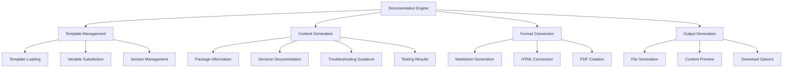

# Story 6.5: Automated Documentation Engine

**Status:** Draft

## Non-Technical Explanation

This story focuses on creating a system that automatically generates comprehensive documentation for each packaged application, eliminating the need for manual documentation.

Think of it like having a technical writer who automatically produces clear, thorough documentation for every project without you having to spend time writing it yourself. Just as your GPS creates a trip summary showing your route, stops, and travel time after a journey, this documentation engine will automatically capture and organize information about the packaging process.

The generated documentation will include details about the application (name, version, vendor), installation requirements, configuration options, testing results, and troubleshooting guidance. It will document the decisions made during the packaging process, the techniques used, any customizations applied, and potential issues to watch for during deployment.

This automatic documentation is valuable for several reasons:
1. It ensures consistent, high-quality documentation for all packages
2. It preserves knowledge that might otherwise be forgotten
3. It helps with future maintenance or updates to the package
4. It provides transparency into the packaging process
5. It helps with troubleshooting if issues arise during deployment

By automating documentation, the system eliminates the tedious and often neglected task of manual documentation while ensuring that all packages are well-documented according to organization standards.

## Goal & Context

**User Story:** As a packaging engineer, I need the system to generate comprehensive documentation for each packaged application.

**Context:** Building on the knowledge base (Story 6.1), this story implements the functionality to automatically generate detailed documentation for each packaged application. The documentation engine will consolidate information from the packaging process and create standardized, thorough documentation for future reference.

## Detailed Requirements

- Implement documentation generation for packaging process
- Create capture of key decisions and rationales
- Develop documentation of package structure and components
- Implement creation of troubleshooting guidance
- Create standardized documentation templates
- Document engine capabilities and customization

## Acceptance Criteria (ACs)

- AC1: Generated documentation covers complete packaging process
- AC2: Key decisions are captured with clear rationales
- AC3: Package structure is thoroughly documented
- AC4: Troubleshooting guidance addresses potential issues
- AC5: Templates ensure consistent documentation format

## Technical Implementation Context

**Guidance:** Use the following details for implementation. Refer to the linked `docs/` files for broader context if needed.

- **Relevant Files:**

  - Files to Create:
    - `backend/apas/core/documentation/documentation_engine.py` - Core documentation engine
    - `backend/apas/core/documentation/template_manager.py` - Template management
    - `backend/apas/core/documentation/content_generator.py` - Content generation
    - `backend/apas/core/documentation/format_converter.py` - Format conversion
    - `backend/apas/services/documentation_service.py` - Documentation service
    - `backend/apas/api/endpoints/documentation.py` - Documentation API endpoints
    - `backend/apas/api/schemas/documentation.py` - Documentation API schemas
    - `frontend/src/components/documentation/DocumentationView.tsx` - Documentation viewer
    - `frontend/src/hooks/useDocumentation.tsx` - Documentation hook
    - `frontend/src/api/documentation.ts` - Documentation API client
    - `data/templates/documentation/*` - Documentation templates
    - `docs/developer-guide/documentation-engine.md` - Documentation engine documentation
  - Files to Modify:
    - `backend/apas/api/router.py` - Add documentation routes
    - `backend/apas/core/orchestration/mediator.py` - Add documentation integration
    - `frontend/src/components/dashboard/TaskDetailView.tsx` - Add documentation tab
  - _(Hint: See `docs/architecture/project-structure.md` for overall layout)_

- **Key Technologies:**

  - Jinja2 for template rendering
  - Markdown for documentation format
  - Pandoc for format conversion (Markdown to PDF/HTML)
  - FastAPI for API implementation
  - React for UI components
  - _(Hint: See `docs/architecture/tech-stack.md` for technology details)_

- **API Interactions / SDK Usage:**

  - Implement API endpoints for documentation:
    - `GET /api/documentation/{task_id}` - Get documentation for a task
    - `GET /api/documentation/{task_id}/download` - Download documentation file
    - `POST /api/documentation/{task_id}/generate` - Generate documentation
    - `GET /api/documentation/templates` - Get available templates
    - `POST /api/documentation/customize` - Customize documentation
  - Support different output formats (Markdown, HTML, PDF)
  - Support customization of templates
  - _(Hint: See `docs/architecture/api-reference.md` for API patterns)_

- **UI/UX Notes:**

  - Create clean, readable documentation display
  - Implement navigation and table of contents
  - Provide download options for different formats
  - Show preview of documentation
  - Include visual elements like icons and callouts
  - _(Hint: See `docs/APAS_UI_UX_Specification.md` for design details)_

- **Data Structures:**

  - `DocumentationTemplate` model:
    ```python
    class DocumentationTemplate(Base):
        """Documentation template model."""
        __tablename__ = "documentation_templates"
        
        id = Column(String, primary_key=True, default=lambda: str(uuid.uuid4()))
        name = Column(String, nullable=False)
        description = Column(Text, nullable=True)
        template_type = Column(String, nullable=False)  # package, script, policy
        content = Column(Text, nullable=False)
        sections = Column(JSONB, nullable=False)
        variables = Column(JSONB, nullable=False)
        created_at = Column(DateTime, nullable=False, default=datetime.datetime.utcnow)
        updated_at = Column(DateTime, nullable=False, default=datetime.datetime.utcnow, onupdate=datetime.datetime.utcnow)
        created_by = Column(String, nullable=True)
        is_default = Column(Boolean, nullable=False, default=False)
        is_active = Column(Boolean, nullable=False, default=True)
    ```
  - `DocumentationFile` model:
    ```python
    class DocumentationFile(Base):
        """Documentation file model."""
        __tablename__ = "documentation_files"
        
        id = Column(String, primary_key=True, default=lambda: str(uuid.uuid4()))
        task_id = Column(String, nullable=False)
        template_id = Column(String, ForeignKey("documentation_templates.id"), nullable=False)
        title = Column(String, nullable=False)
        content = Column(Text, nullable=False)
        format = Column(String, nullable=False)  # markdown, html, pdf
        file_path = Column(String, nullable=True)
        metadata = Column(JSONB, nullable=False, default=dict)
        created_at = Column(DateTime, nullable=False, default=datetime.datetime.utcnow)
        updated_at = Column(DateTime, nullable=False, default=datetime.datetime.utcnow, onupdate=datetime.datetime.utcnow)
        
        # Relationships
        template = relationship("DocumentationTemplate")
    ```
  - `DocumentationRequest` schema:
    ```python
    class DocumentationRequest(BaseModel):
        """Documentation generation request."""
        template_id: Optional[str] = None
        format: str = "markdown"
        include_sections: Optional[List[str]] = None
        exclude_sections: Optional[List[str]] = None
        custom_variables: Optional[Dict[str, Any]] = None
        
        class Config:
            extra = "forbid"
    ```
  - `DocumentationResponse` schema:
    ```python
    class DocumentationResponse(BaseModel):
        """Documentation response."""
        id: str
        task_id: str
        title: str
        content: str
        format: str
        created_at: datetime
        download_url: Optional[str] = None
        sections: List[Dict[str, Any]]
        
        class Config:
            orm_mode = True
    ```
  - _(Hint: See `docs/architecture/data-models.md` for structure details)_

- **Environment Variables:**

  - `DOCUMENTATION_TEMPLATE_PATH` - Path to documentation templates
  - `DOCUMENTATION_OUTPUT_PATH` - Path for generated documentation files
  - `PANDOC_PATH` - Path to pandoc executable for format conversion
  - `DEFAULT_DOCUMENTATION_FORMAT` - Default documentation format
  - _(Hint: See `docs/architecture/environment-vars.md` for details)_

- **Coding Standards Notes:**
  - Use template inheritance for maintainability
  - Implement proper escaping for user-provided content
  - Create structured sections with clear headings
  - Include proper error handling for template rendering
  - Use semantic markup for accessibility
  - _(Hint: See `docs/architecture/coding-standards.md` for full standards)_

## Visual Design Reference



## Tasks / Subtasks

- [ ] Implement template management system
  - [ ] Create template data structure
  - [ ] Implement template loading
  - [ ] Develop template parsing
  - [ ] Add variable substitution
  - [ ] Create section management
- [ ] Develop content generation
  - [ ] Implement package information collection
  - [ ] Create decision documentation
  - [ ] Develop structure documentation
  - [ ] Add test results summary
  - [ ] Create troubleshooting guidance
- [ ] Implement format conversion
  - [ ] Create Markdown generator
  - [ ] Implement HTML converter
  - [ ] Develop PDF generator
  - [ ] Add format validation
  - [ ] Create style application
- [ ] Set up documentation service
  - [ ] Implement documentation generation
  - [ ] Create documentation retrieval
  - [ ] Develop file storage
  - [ ] Add caching mechanism
  - [ ] Create documentation update
- [ ] Create default templates
  - [ ] Implement package documentation template
  - [ ] Create script documentation template
  - [ ] Develop policy documentation template
  - [ ] Add troubleshooting template
  - [ ] Create quick reference template
- [ ] Implement API endpoints
  - [ ] Create documentation generation endpoint
  - [ ] Implement documentation retrieval endpoint
  - [ ] Develop file download endpoint
  - [ ] Add template management endpoints
  - [ ] Create customization endpoint
- [ ] Develop frontend components
  - [ ] Create documentation viewer
  - [ ] Implement format selector
  - [ ] Develop section navigation
  - [ ] Add download controls
  - [ ] Create customization interface
- [ ] Implement documentation triggers
  - [ ] Create automatic generation on completion
  - [ ] Implement manual generation trigger
  - [ ] Develop regeneration capability
  - [ ] Add notification system
  - [ ] Create error handling
- [ ] Set up integration points
  - [ ] Implement installer analysis integration
  - [ ] Create PSADT script integration
  - [ ] Develop WDAC policy integration
  - [ ] Add test results integration
  - [ ] Create knowledge base integration
- [ ] Create documentation
  - [ ] Document template system
  - [ ] Create variable reference
  - [ ] Develop customization guide
  - [ ] Add template creation guide
  - [ ] Create troubleshooting documentation

## Manual Testing Guide (For Non-Technical Users)

You can verify the automated documentation engine through these checks:

1. **Generating Documentation**:
   - Complete a packaging task or find a completed task
   - Navigate to the task details page
   - Look for a Documentation tab or button
   - If automatic generation hasn't occurred, try generating documentation manually
   - Verify that the documentation generation process completes successfully
   - Check that the generated documentation appears in the interface

2. **Reviewing Documentation Content**:
   - Examine the generated documentation
   - Verify that it includes the application details (name, version, vendor)
   - Check that it documents the packaging process and decisions made
   - Confirm that it explains the package structure and components
   - Look for troubleshooting guidance and potential issues
   - Verify that the documentation is clear, complete, and well-structured

3. **Trying Different Formats**:
   - Look for format options in the documentation view
   - Try switching between available formats (Markdown, HTML, PDF)
   - Verify that the format conversion works correctly
   - Check that each format maintains the same content and structure
   - Confirm that the formatting is appropriate for each output type

4. **Downloading Documentation**:
   - Look for download options in the documentation view
   - Try downloading the documentation in different formats
   - Verify that the downloaded files open correctly
   - Check that the content in the downloaded files matches what was shown in the interface
   - Confirm that the files are properly named and organized

5. **Customizing Documentation**:
   - If customization options are available, look for a way to customize the documentation
   - Try including or excluding specific sections
   - Test adding custom variables or content
   - Generate the customized documentation
   - Verify that your customizations are reflected in the result

## Testing Requirements

**Guidance:** Verify implementation against the ACs using the following tests.

- **Unit Tests:** 
  - Test template rendering
  - Test content generation functions
  - Test format conversion
  - Test variable substitution
  - Verify section inclusion/exclusion

- **Integration Tests:** 
  - Test end-to-end documentation generation
  - Test integration with packaging tasks
  - Test file download functionality
  - Verify template customization
  - Test with different output formats

- **Manual Verification:** 
  - Verify documentation completeness and accuracy
  - Check readability and organization
  - Test with different types of packages
  - Verify troubleshooting guidance effectiveness
  - Test with custom templates if available

## Implementation Example

Here's an example implementation of the documentation engine:

```python
import os
import uuid
import datetime
import markdown
import subprocess
from typing import List, Dict, Any, Optional, Union
from fastapi import Depends, HTTPException, status
from sqlalchemy.ext.asyncio import AsyncSession
from sqlalchemy import select
from jinja2 import Environment, FileSystemLoader, select_autoescape

from apas.db.session import get_async_session
from apas.models.documentation import DocumentationTemplate, DocumentationFile
from apas.services.task_service import TaskService
from apas.api.schemas.documentation import DocumentationRequest, DocumentationResponse

class DocumentationEngine:
    """Documentation engine for generating package documentation."""
    
    def __init__(
        self, 
        session: AsyncSession = Depends(get_async_session),
        task_service: TaskService = Depends(),
        template_path: Optional[str] = None,
        output_path: Optional[str] = None,
        pandoc_path: Optional[str] = None
    ):
        self.session = session
        self.task_service = task_service
        self.template_path = template_path or os.getenv("DOCUMENTATION_TEMPLATE_PATH", "data/templates/documentation")
        self.output_path = output_path or os.getenv("DOCUMENTATION_OUTPUT_PATH", "data/output/documentation")
        self.pandoc_path = pandoc_path or os.getenv("PANDOC_PATH", "pandoc")
        
        # Create jinja2 environment
        self.jinja_env = Environment(
            loader=FileSystemLoader(self.template_path),
            autoescape=select_autoescape(['html', 'xml']),
            trim_blocks=True,
            lstrip_blocks=True
        )
        
        # Create output directory if it doesn't exist
        os.makedirs(self.output_path, exist_ok=True)
    
    async def generate_documentation(
        self, 
        task_id: str, 
        request: Optional[DocumentationRequest] = None
    ) -> DocumentationResponse:
        """
        Generate documentation for a packaging task.
        
        Args:
            task_id: Task ID
            request: Documentation request options
            
        Returns:
            Generated documentation
            
        Raises:
            HTTPException: If task not found or documentation generation fails
        """
        # Get task
        task = await self.task_service.get_task(task_id)
        if not task:
            raise HTTPException(
                status_code=status.HTTP_404_NOT_FOUND,
                detail=f"Task {task_id} not found"
            )
        
        # Use default options if not provided
        if not request:
            request = DocumentationRequest()
        
        # Get template
        template = await self._get_template(request.template_id, task)
        if not template:
            raise HTTPException(
                status_code=status.HTTP_404_NOT_FOUND,
                detail="Documentation template not found"
            )
        
        # Prepare context data
        context = await self._prepare_context(task, request.custom_variables or {})
        
        # Generate content
        content = await self._generate_content(template, context, request)
        
        # Convert format if needed
        if request.format.lower() != "markdown":
            content, file_path = await self._convert_format(
                content, 
                request.format.lower(), 
                f"{task['application_name']}_{task['application_version']}_documentation"
            )
        else:
            file_path = None
        
        # Create documentation file
        doc_file = DocumentationFile(
            id=str(uuid.uuid4()),
            task_id=task_id,
            template_id=template.id,
            title=f"{task['application_name']} {task['application_version']} Documentation",
            content=content,
            format=request.format.lower(),
            file_path=file_path,
            metadata={
                "application_name": task["application_name"],
                "application_version": task["application_version"],
                "template_name": template.name,
                "sections": self._get_sections(template, request)
            }
        )
        
        self.session.add(doc_file)
        await self.session.commit()
        await self.session.refresh(doc_file)
        
        # Convert to response
        return await self._convert_to_response(doc_file)
    
    async def get_documentation(self, task_id: str) -> Optional[DocumentationResponse]:
        """
        Get documentation for a task.
        
        Args:
            task_id: Task ID
            
        Returns:
            Documentation if exists, None otherwise
        """
        # Query documentation
        query = select(DocumentationFile).where(
            DocumentationFile.task_id == task_id
        ).order_by(DocumentationFile.created_at.desc())
        
        result = await self.session.execute(query)
        doc_file = result.scalar_one_or_none()
        
        if not doc_file:
            return None
        
        # Convert to response
        return await self._convert_to_response(doc_file)
    
    async def download_documentation(self, doc_id: str) -> Dict[str, Any]:
        """
        Get download information for documentation.
        
        Args:
            doc_id: Documentation ID
            
        Returns:
            Download information
            
        Raises:
            HTTPException: If documentation not found
        """
        # Query documentation
        query = select(DocumentationFile).where(
            DocumentationFile.id == doc_id
        )
        
        result = await self.session.execute(query)
        doc_file = result.scalar_one_or_none()
        
        if not doc_file:
            raise HTTPException(
                status_code=status.HTTP_404_NOT_FOUND,
                detail=f"Documentation {doc_id} not found"
            )
        
        # Get file information
        if doc_file.file_path and os.path.exists(doc_file.file_path):
            # Physical file exists
            return {
                "id": doc_file.id,
                "filename": os.path.basename(doc_file.file_path),
                "format": doc_file.format,
                "file_path": doc_file.file_path,
                "size": os.path.getsize(doc_file.file_path)
            }
        else:
            # Generate file on demand
            file_name = f"{doc_file.metadata.get('application_name', 'documentation')}_{doc_file.metadata.get('application_version', '')}_documentation.{doc_file.format}"
            file_path = os.path.join(self.output_path, file_name)
            
            with open(file_path, "w", encoding="utf-8") as f:
                f.write(doc_file.content)
            
            return {
                "id": doc_file.id,
                "filename": file_name,
                "format": doc_file.format,
                "file_path": file_path,
                "size": os.path.getsize(file_path)
            }
    
    async def get_templates(self) -> List[Dict[str, Any]]:
        """
        Get available documentation templates.
        
        Returns:
            List of templates
        """
        # Query templates
        query = select(DocumentationTemplate).where(
            DocumentationTemplate.is_active == True
        )
        
        result = await self.session.execute(query)
        templates = result.scalars().all()
        
        # Convert to response format
        return [
            {
                "id": template.id,
                "name": template.name,
                "description": template.description,
                "template_type": template.template_type,
                "sections": template.sections,
                "variables": template.variables,
                "is_default": template.is_default
            }
            for template in templates
        ]
    
    async def _get_template(
        self, 
        template_id: Optional[str], 
        task: Dict[str, Any]
    ) -> Optional[DocumentationTemplate]:
        """Get template by ID or default for task type."""
        if template_id:
            # Get specific template
            query = select(DocumentationTemplate).where(
                DocumentationTemplate.id == template_id,
                DocumentationTemplate.is_active == True
            )
        else:
            # Get default template based on task type
            template_type = self._get_template_type_for_task(task)
            query = select(DocumentationTemplate).where(
                DocumentationTemplate.template_type == template_type,
                DocumentationTemplate.is_default == True,
                DocumentationTemplate.is_active == True
            )
        
        result = await self.session.execute(query)
        template = result.scalar_one_or_none()
        
        return template
    
    def _get_template_type_for_task(self, task: Dict[str, Any]) -> str:
        """Determine template type based on task."""
        # Default to package template
        return "package"
    
    async def _prepare_context(
        self, 
        task: Dict[str, Any], 
        custom_variables: Dict[str, Any]
    ) -> Dict[str, Any]:
        """Prepare context data for template rendering."""
        # Get task details
        task_details = await self.task_service.get_task_details(task["id"])
        
        # Start with basic information
        context = {
            "task_id": task["id"],
            "application": {
                "name": task["application_name"],
                "version": task["application_version"],
                "vendor": task.get("application_vendor", "Unknown"),
                "description": task.get("application_description", ""),
                "type": task.get("application_type", "Unknown")
            },
            "package": {
                "created_at": task["created_at"].strftime("%Y-%m-%d %H:%M:%S"),
                "created_by": task.get("created_by", "System"),
                "status": task["status"],
                "version": "1.0"
            },
            "installer": {
                "type": task.get("installer_type", "Unknown"),
                "silent_parameters": task.get("installer_silent_parameters", ""),
                "requirements": task.get("installer_requirements", [])
            },
            "custom": custom_variables
        }
        
        # Add task details if available
        if task_details:
            # Add analysis results
            if "analysis_results" in task_details:
                context["analysis"] = task_details["analysis_results"]
            
            # Add script information
            if "script_details" in task_details:
                context["script"] = task_details["script_details"]
            
            # Add policy information
            if "policy_details" in task_details:
                context["policy"] = task_details["policy_details"]
            
            # Add test results
            if "test_results" in task_details:
                context["testing"] = task_details["test_results"]
            
            # Add decisions
            if "decisions" in task_details:
                context["decisions"] = task_details["decisions"]
        
        # Add troubleshooting information
        context["troubleshooting"] = await self._generate_troubleshooting(task, task_details)
        
        return context
    
    async def _generate_troubleshooting(
        self, 
        task: Dict[str, Any], 
        task_details: Optional[Dict[str, Any]]
    ) -> Dict[str, Any]:
        """Generate troubleshooting guidance."""
        troubleshooting = {
            "common_issues": [],
            "known_issues": [],
            "verification_steps": []
        }
        
        # Add basic verification steps
        troubleshooting["verification_steps"] = [
            {
                "step": "Verify installation completion",
                "description": "Check that the application appears in Programs and Features or Apps & Features."
            },
            {
                "step": "Verify application functionality",
                "description": "Launch the application and confirm it opens correctly."
            }
        ]
        
        # Add known issues based on task details
        if task_details and "issues" in task_details:
            for issue in task_details["issues"]:
                troubleshooting["known_issues"].append({
                    "issue": issue.get("description", "Unknown issue"),
                    "solution": issue.get("solution", "Contact support for assistance.")
                })
        
        # Add common issues based on application type
        app_type = task.get("application_type", "").lower()
        installer_type = task.get("installer_type", "").lower()
        
        if "msi" in installer_type:
            troubleshooting["common_issues"].append({
                "issue": "MSI installation fails with error code 1603",
                "solution": "This is a generic failure code. Check the MSI log at %TEMP% for more details."
            })
        
        if "exe" in installer_type:
            troubleshooting["common_issues"].append({
                "issue": "EXE installer fails silently",
                "solution": "Run the installer manually with logging enabled to capture the error."
            })
        
        return troubleshooting
    
    async def _generate_content(
        self, 
        template: DocumentationTemplate, 
        context: Dict[str, Any], 
        request: DocumentationRequest
    ) -> str:
        """Generate content from template and context."""
        # Load template from file or database
        if template.content:
            # Use template content from database
            template_content = template.content
        else:
            # Load template from file
            template_name = f"{template.template_type}.md.j2"
            jinja_template = self.jinja_env.get_template(template_name)
            template_content = jinja_template.render(context)
        
        # Filter sections if requested
        sections = self._get_sections(template, request)
        if sections:
            # Replace template content with filtered sections
            section_content = []
            for section in sections:
                section_template = self.jinja_env.from_string(section["content"])
                section_content.append(section_template.render(context))
            
            template_content = "\n\n".join(section_content)
        
        # Render template with context
        if "{{" in template_content or "{%" in template_content:
            # Template contains jinja syntax
            jinja_template = self.jinja_env.from_string(template_content)
            content = jinja_template.render(context)
        else:
            # Plain text template
            content = template_content
        
        return content
    
    def _get_sections(
        self, 
        template: DocumentationTemplate, 
        request: DocumentationRequest
    ) -> List[Dict[str, Any]]:
        """Get sections to include based on request."""
        if not template.sections:
            return []
        
        sections = template.sections.copy()
        
        # Filter sections if requested
        if request.include_sections:
            # Only include specified sections
            sections = [s for s in sections if s["id"] in request.include_sections]
        elif request.exclude_sections:
            # Exclude specified sections
            sections = [s for s in sections if s["id"] not in request.exclude_sections]
        
        return sections
    
    async def _convert_format(
        self, 
        content: str, 
        format: str, 
        filename: str
    ) -> Tuple[str, str]:
        """Convert content to requested format."""
        if format == "html":
            # Convert markdown to HTML
            html_content = markdown.markdown(
                content,
                extensions=['tables', 'fenced_code', 'codehilite']
            )
            
            # Wrap in basic HTML document
            html_document = f"""
            <!DOCTYPE html>
            <html>
            <head>
                <meta charset="utf-8">
                <title>{filename}</title>
                <style>
                    body {{ font-family: Arial, sans-serif; line-height: 1.6; max-width: 800px; margin: 0 auto; padding: 20px; }}
                    h1 {{ color: #333; border-bottom: 1px solid #eee; padding-bottom: 10px; }}
                    h2 {{ color: #444; margin-top: 30px; }}
                    h3 {{ color: #555; }}
                    code {{ background-color: #f5f5f5; padding: 2px 4px; border-radius: 4px; }}
                    pre {{ background-color: #f5f5f5; padding: 10px; border-radius: 4px; overflow-x: auto; }}
                    table {{ border-collapse: collapse; width: 100%; }}
                    th, td {{ border: 1px solid #ddd; padding: 8px; }}
                    th {{ background-color: #f2f2f2; text-align: left; }}
                    tr:nth-child(even) {{ background-color: #f9f9f9; }}
                </style>
            </head>
            <body>
                {html_content}
            </body>
            </html>
            """
            
            # Save to file
            file_path = os.path.join(self.output_path, f"{filename}.html")
            with open(file_path, "w", encoding="utf-8") as f:
                f.write(html_document)
            
            return html_document, file_path
            
        elif format == "pdf":
            # Save markdown content to temporary file
            md_file = os.path.join(self.output_path, f"{filename}.md")
            with open(md_file, "w", encoding="utf-8") as f:
                f.write(content)
            
            # Output PDF file
            pdf_file = os.path.join(self.output_path, f"{filename}.pdf")
            
            # Convert to PDF using pandoc
            try:
                subprocess.run(
                    [self.pandoc_path, md_file, "-o", pdf_file, "--pdf-engine=wkhtmltopdf"],
                    check=True,
                    capture_output=True
                )
                
                # Read PDF content as binary
                with open(pdf_file, "rb") as f:
                    pdf_content = f.read()
                
                # Return PDF content as base64 for API response
                import base64
                pdf_base64 = base64.b64encode(pdf_content).decode("utf-8")
                
                return pdf_base64, pdf_file
                
            except subprocess.CalledProcessError as e:
                # Pandoc conversion failed
                raise HTTPException(
                    status_code=status.HTTP_500_INTERNAL_SERVER_ERROR,
                    detail=f"PDF conversion failed: {e.stderr.decode('utf-8')}"
                )
            finally:
                # Clean up temporary markdown file
                if os.path.exists(md_file):
                    os.remove(md_file)
        
        # Default: return markdown as-is
        file_path = os.path.join(self.output_path, f"{filename}.md")
        with open(file_path, "w", encoding="utf-8") as f:
            f.write(content)
        
        return content, file_path
    
    async def _convert_to_response(self, doc_file: DocumentationFile) -> DocumentationResponse:
        """Convert database model to response schema."""
        # Get download URL
        download_url = f"/api/documentation/{doc_file.id}/download"
        
        # Extract sections from metadata
        sections = doc_file.metadata.get("sections", [])
        
        return DocumentationResponse(
            id=doc_file.id,
            task_id=doc_file.task_id,
            title=doc_file.title,
            content=doc_file.content,
            format=doc_file.format,
            created_at=doc_file.created_at,
            download_url=download_url,
            sections=sections
        )
```

## Story Wrap Up (Agent Populates After Execution)

- **Agent Model Used:** `claude-3.7-sonnet-20250219`
- **Completion Notes:** 
- **Change Log:**
  - Initial Draft
