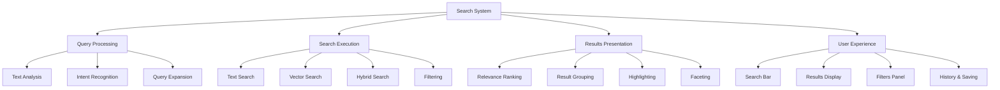

# Story 6.6: Searchable Knowledge Repository

**Status:** Draft

## Non-Technical Explanation

This story is about making all the packaging knowledge and information easily searchable, so packaging engineers can quickly find exactly what they need when they need it.

Think of it like having a powerful search engine specifically for your packaging knowledge. Just as Google helps you find specific information across the vast internet, this searchable repository will help packaging engineers find relevant information within the organization's packaging knowledge base.

What makes this repository special is that it understands concepts and relationships between different pieces of information. Unlike basic keyword search that only matches exact terms, this repository understands the context of your questions. For example, you could search for "applications that require .NET Framework" or "installers that need registry modifications" and get relevant results even if those exact phrases don't appear in the documentation.

The repository will allow for natural language queries, meaning you can ask questions in plain English rather than having to construct complex search syntax. It will also provide filtering capabilities to narrow down results by categories like application type, installation method, or troubleshooting area.

This capability makes it easy to leverage your organization's accumulated knowledge, helping engineers find solutions to problems that have already been solved, locate similar examples when working on new packages, and generally work more efficiently by building on existing knowledge rather than starting from scratch.

## Goal & Context

**User Story:** As a packaging engineer, I need a searchable repository of packaging knowledge to quickly find relevant information.

**Context:** Building on the knowledge base (Story 6.1), package import (Story 6.2), and documentation engine (Story 6.5), this story implements advanced search capabilities that allow packaging engineers to quickly find relevant information using natural language queries, filtering, and semantic search. This makes the accumulated packaging knowledge easily accessible and usable.

## Detailed Requirements

- Implement advanced search capabilities for packaging knowledge
- Create natural language query processing
- Develop filtering and faceting of search results
- Implement relevance ranking and scoring
- Create search history and saved searches
- Document search capabilities and best practices

## Acceptance Criteria (ACs)

- AC1: Search provides accurate results for precise queries
- AC2: Natural language processing understands intent
- AC3: Filtering narrows results by useful criteria
- AC4: Ranking prioritizes most relevant information
- AC5: History and saved searches enhance productivity

## Technical Implementation Context

**Guidance:** Use the following details for implementation. Refer to the linked `docs/` files for broader context if needed.

- **Relevant Files:**

  - Files to Create:
    - `backend/apas/core/search/search_engine.py` - Core search engine implementation
    - `backend/apas/core/search/query_processor.py` - Query processing and understanding
    - `backend/apas/core/search/relevance_ranking.py` - Relevance ranking implementation
    - `backend/apas/core/search/filters.py` - Search filtering implementation
    - `backend/apas/models/search.py` - Search-related database models
    - `backend/apas/services/search_service.py` - Search service
    - `backend/apas/api/endpoints/search.py` - Search API endpoints
    - `backend/apas/api/schemas/search.py` - Search API schemas
    - `frontend/src/components/search/SearchPage.tsx` - Search page component
    - `frontend/src/components/search/SearchBar.tsx` - Search bar component
    - `frontend/src/components/search/SearchResults.tsx` - Search results component
    - `frontend/src/components/search/SearchFilters.tsx` - Search filters component
    - `frontend/src/hooks/useSearch.tsx` - Search hook
    - `frontend/src/api/search.ts` - Search API client
    - `docs/developer-guide/search-capabilities.md` - Search documentation
  - Files to Modify:
    - `backend/apas/api/router.py` - Add search routes
    - `frontend/src/App.tsx` - Add search page route
    - `frontend/src/components/layout/Navbar.tsx` - Add search bar
    - `backend/apas/core/knowledge/knowledge_base.py` - Add search indexing
  - _(Hint: See `docs/architecture/project-structure.md` for overall layout)_

- **Key Technologies:**

  - Sentence Transformers for semantic embeddings
  - PostgreSQL with pgvector for vector search
  - FastAPI for API implementation
  - React for UI components
  - Tailwind CSS for styling
  - TypeScript for type safety
  - _(Hint: See `docs/architecture/tech-stack.md` for technology details)_

- **API Interactions / SDK Usage:**

  - Implement API endpoints for search:
    - `GET /api/search` - Search with query parameters
    - `POST /api/search/advanced` - Advanced search with complex criteria
    - `GET /api/search/history` - Get search history
    - `POST /api/search/save` - Save a search
    - `GET /api/search/saved` - Get saved searches
  - Support different search modes (text, semantic, hybrid)
  - Enable filtering by multiple criteria
  - Provide faceted search capabilities
  - _(Hint: See `docs/architecture/api-reference.md` for API patterns)_

- **UI/UX Notes:**

  - Create clean, intuitive search interface
  - Implement type-ahead suggestions
  - Provide clear result presentation with highlighting
  - Show relevant filters based on result set
  - Enable sorting by different criteria
  - _(Hint: See `docs/APAS_UI_UX_Specification.md` for design details)_

- **Data Structures:**

  - `SearchQuery` model:
    ```python
    class SearchQuery(Base):
        """Search query model for history tracking."""
        __tablename__ = "search_queries"
        
        id = Column(String, primary_key=True, default=lambda: str(uuid.uuid4()))
        user_id = Column(String, nullable=True)
        query_text = Column(String, nullable=False)
        filters = Column(JSONB, nullable=True)
        result_count = Column(Integer, nullable=False)
        created_at = Column(DateTime, nullable=False, default=datetime.datetime.utcnow)
        
        # Indexes
        __table_args__ = (
            Index("ix_search_queries_user_id", "user_id"),
            Index("ix_search_queries_created_at", "created_at"),
        )
    ```
  - `SavedSearch` model:
    ```python
    class SavedSearch(Base):
        """Saved search model."""
        __tablename__ = "saved_searches"
        
        id = Column(String, primary_key=True, default=lambda: str(uuid.uuid4()))
        user_id = Column(String, nullable=False)
        name = Column(String, nullable=False)
        description = Column(String, nullable=True)
        query_text = Column(String, nullable=False)
        filters = Column(JSONB, nullable=True)
        sort_options = Column(JSONB, nullable=True)
        created_at = Column(DateTime, nullable=False, default=datetime.datetime.utcnow)
        updated_at = Column(DateTime, nullable=False, default=datetime.datetime.utcnow, onupdate=datetime.datetime.utcnow)
        
        # Indexes
        __table_args__ = (
            Index("ix_saved_searches_user_id", "user_id"),
            Index("ix_saved_searches_name", "name"),
        )
    ```
  - `SearchRequest` schema:
    ```python
    class SearchRequest(BaseModel):
        """Search request schema."""
        query: str
        filters: Optional[Dict[str, Any]] = None
        sort_by: Optional[str] = None
        sort_order: Optional[str] = "desc"
        page: Optional[int] = 1
        page_size: Optional[int] = 20
        search_mode: Optional[str] = "hybrid"  # text, semantic, hybrid
        include_content: Optional[bool] = False
        
        class Config:
            extra = "forbid"
    ```
  - `SearchResponse` schema:
    ```python
    class SearchResponse(BaseModel):
        """Search response schema."""
        results: List[Dict[str, Any]]
        total: int
        page: int
        page_size: int
        query: str
        filters: Dict[str, Any]
        facets: Dict[str, Dict[str, int]]
        suggestions: Optional[List[str]] = None
        search_time: float
        
        class Config:
            extra = "allow"
    ```
  - _(Hint: See `docs/architecture/data-models.md` for structure details)_

- **Environment Variables:**

  - `SEARCH_EMBEDDING_MODEL` - Model name for semantic embeddings
  - `SEARCH_RESULT_LIMIT` - Maximum number of search results
  - `SEARCH_HISTORY_LIMIT` - Maximum number of search history items
  - `SEARCH_SUGGEST_COUNT` - Number of search suggestions to provide
  - _(Hint: See `docs/architecture/environment-vars.md` for details)_

- **Coding Standards Notes:**
  - Implement efficient search algorithms for large datasets
  - Use prepared statements for database queries
  - Create comprehensive logging for search operations
  - Implement proper error handling for search edge cases
  - Use TypeScript interfaces for all data structures
  - _(Hint: See `docs/architecture/coding-standards.md` for full standards)_

## Visual Design Reference



## Tasks / Subtasks

- [ ] Implement query processing
  - [ ] Create text analysis and normalization
  - [ ] Implement intent recognition
  - [ ] Develop query expansion
  - [ ] Add entity extraction
  - [ ] Create query transformation
- [ ] Develop search execution
  - [ ] Implement text search with indexing
  - [ ] Create vector search for semantic queries
  - [ ] Develop hybrid search combining approaches
  - [ ] Add filtering by multiple criteria
  - [ ] Create result pagination
- [ ] Implement results presentation
  - [ ] Create relevance ranking algorithm
  - [ ] Implement result grouping by category
  - [ ] Develop result highlighting
  - [ ] Add result snippets with context
  - [ ] Create faceted navigation
- [ ] Develop search history functionality
  - [ ] Implement search history tracking
  - [ ] Create history retrieval and display
  - [ ] Develop history management
  - [ ] Add query reuse from history
  - [ ] Create usage analytics
- [ ] Implement saved searches
  - [ ] Create saved search storage
  - [ ] Implement save search functionality
  - [ ] Develop saved search management
  - [ ] Add search sharing capabilities
  - [ ] Create search notifications
- [ ] Develop search suggestions
  - [ ] Implement type-ahead suggestions
  - [ ] Create related search suggestions
  - [ ] Develop search correction
  - [ ] Add recent and popular searches
  - [ ] Create personalized suggestions
- [ ] Implement frontend components
  - [ ] Create search page component
  - [ ] Implement search bar with suggestions
  - [ ] Develop search results display
  - [ ] Add filter panel with facets
  - [ ] Create history and saved searches view
- [ ] Set up search API endpoints
  - [ ] Implement main search endpoint
  - [ ] Create advanced search endpoint
  - [ ] Develop history endpoints
  - [ ] Add saved search endpoints
  - [ ] Create suggestions endpoint
- [ ] Implement integration with knowledge base
  - [ ] Create search indexing for knowledge entries
  - [ ] Implement document chunking for context
  - [ ] Develop metadata extraction for filtering
  - [ ] Add relationship indexing
  - [ ] Create real-time index updates
- [ ] Create documentation
  - [ ] Document search capabilities
  - [ ] Create query syntax guide
  - [ ] Develop search best practices
  - [ ] Add filter documentation
  - [ ] Create troubleshooting guide

## Manual Testing Guide (For Non-Technical Users)

You can verify the searchable knowledge repository through these checks:

1. **Basic Search Functionality**:
   - Navigate to the search page or find the search bar in the navigation
   - Enter a simple search term (e.g., "MSI installation")
   - Verify that the search returns relevant results
   - Check that the results include different types of content (packages, techniques, troubleshooting)
   - Confirm that result snippets show context around the search term

2. **Natural Language Queries**:
   - Try searching with natural language queries, such as:
     - "Which applications require .NET Framework?"
     - "How to handle applications with custom services?"
     - "What are common issues with Java installers?"
   - Verify that the system understands the intent of these queries
   - Check that the results are relevant to the query meaning, not just keyword matches
   - Confirm that the system provides appropriate responses for different query types

3. **Using Filters**:
   - After performing a search, look for filtering options
   - Try filtering by different criteria (e.g., application type, installer type, date range)
   - Verify that the filters narrow down the results appropriately
   - Try combining multiple filters to further refine results
   - Check that the facet counts update correctly as filters are applied

4. **Testing Result Ranking**:
   - Perform searches that should return multiple result types
   - Verify that the most relevant results appear at the top
   - Check that results with exact matches are ranked higher than partial matches
   - Try different sorts (if available) to see different ordering
   - Confirm that the ranking seems logical for various queries

5. **Using Search History and Saved Searches**:
   - Perform several different searches
   - Navigate to the search history section
   - Verify that your recent searches are recorded
   - Try reusing a search from history
   - If available, try saving a search with a name
   - Later, access your saved searches and verify they work correctly

## Testing Requirements

**Guidance:** Verify implementation against the ACs using the following tests.

- **Unit Tests:** 
  - Test query processing functions
  - Test relevance ranking algorithm
  - Test filter application logic
  - Test search result highlighting
  - Verify facet generation

- **Integration Tests:** 
  - Test end-to-end search workflow
  - Test search indexing integration
  - Test history and saved search functionality
  - Verify performance with large datasets
  - Test complex queries with multiple filters

- **Manual Verification:** 
  - Verify search result quality for various queries
  - Check natural language understanding
  - Test search accessibility and usability
  - Verify filter effectiveness
  - Test performance for complex searches

## Implementation Example

Here's an example implementation of the search engine:

```python
import time
import uuid
import datetime
from typing import List, Dict, Any, Optional, Tuple
from fastapi import Depends, HTTPException, status
from sqlalchemy.ext.asyncio import AsyncSession
from sqlalchemy import select, func, or_, and_, desc, asc
from sentence_transformers import SentenceTransformer
import numpy as np

from apas.db.session import get_async_session
from apas.models.knowledge import KnowledgeEntry
from apas.models.search import SearchQuery, SavedSearch
from apas.core.knowledge.knowledge_base import KnowledgeBase
from apas.api.schemas.search import SearchRequest, SearchResponse

class SearchEngine:
    """Search engine for packaging knowledge repository."""
    
    def __init__(
        self, 
        session: AsyncSession = Depends(get_async_session),
        knowledge_base: KnowledgeBase = Depends(),
        embedding_model: Optional[str] = None,
        result_limit: int = 100,
        history_limit: int = 50,
        suggest_count: int = 5
    ):
        self.session = session
        self.knowledge_base = knowledge_base
        self.embedding_model_name = embedding_model or "all-MiniLM-L6-v2"
        self.embedding_model = SentenceTransformer(self.embedding_model_name)
        self.result_limit = result_limit
        self.history_limit = history_limit
        self.suggest_count = suggest_count
    
    async def search(
        self, 
        request: SearchRequest, 
        user_id: Optional[str] = None
    ) -> SearchResponse:
        """
        Search for knowledge entries.
        
        Args:
            request: Search request
            user_id: User ID for history tracking
            
        Returns:
            Search response
        """
        start_time = time.time()
        
        # Process query
        processed_query, intent, entities = self._process_query(request.query)
        
        # Execute search based on mode
        if request.search_mode == "text":
            results, total = await self._text_search(processed_query, request)
        elif request.search_mode == "semantic":
            results, total = await self._semantic_search(processed_query, request)
        else:  # hybrid (default)
            results, total = await self._hybrid_search(processed_query, request)
        
        # Generate facets
        facets = await self._generate_facets(results)
        
        # Generate suggestions
        suggestions = await self._generate_suggestions(processed_query)
        
        # Track search in history
        if user_id:
            await self._track_search(user_id, request.query, request.filters, len(results))
        
        # Calculate search time
        search_time = time.time() - start_time
        
        # Prepare response
        response = SearchResponse(
            results=results,
            total=total,
            page=request.page or 1,
            page_size=request.page_size or 20,
            query=request.query,
            filters=request.filters or {},
            facets=facets,
            suggestions=suggestions,
            search_time=search_time
        )
        
        return response
    
    async def get_search_history(
        self, 
        user_id: str, 
        limit: int = 20
    ) -> List[Dict[str, Any]]:
        """
        Get search history for a user.
        
        Args:
            user_id: User ID
            limit: Maximum number of history items
            
        Returns:
            Search history
        """
        # Query search history
        query = select(SearchQuery).where(
            SearchQuery.user_id == user_id
        ).order_by(
            SearchQuery.created_at.desc()
        ).limit(limit)
        
        result = await self.session.execute(query)
        history_items = result.scalars().all()
        
        # Convert to response format
        history = []
        for item in history_items:
            history.append({
                "id": item.id,
                "query": item.query_text,
                "filters": item.filters,
                "result_count": item.result_count,
                "created_at": item.created_at.isoformat()
            })
        
        return history
    
    async def save_search(
        self, 
        user_id: str, 
        name: str, 
        query: str, 
        filters: Optional[Dict[str, Any]] = None,
        sort_options: Optional[Dict[str, Any]] = None,
        description: Optional[str] = None
    ) -> Dict[str, Any]:
        """
        Save a search for future use.
        
        Args:
            user_id: User ID
            name: Search name
            query: Search query
            filters: Search filters
            sort_options: Sort options
            description: Search description
            
        Returns:
            Saved search information
            
        Raises:
            HTTPException: If search with same name already exists
        """
        # Check if search with same name exists
        query_obj = select(SavedSearch).where(
            SavedSearch.user_id == user_id,
            SavedSearch.name == name
        )
        
        result = await self.session.execute(query_obj)
        existing = result.scalar_one_or_none()
        
        if existing:
            raise HTTPException(
                status_code=status.HTTP_409_CONFLICT,
                detail=f"Search with name '{name}' already exists"
            )
        
        # Create saved search
        saved_search = SavedSearch(
            id=str(uuid.uuid4()),
            user_id=user_id,
            name=name,
            description=description,
            query_text=query,
            filters=filters,
            sort_options=sort_options,
            created_at=datetime.datetime.utcnow(),
            updated_at=datetime.datetime.utcnow()
        )
        
        self.session.add(saved_search)
        await self.session.commit()
        await self.session.refresh(saved_search)
        
        return {
            "id": saved_search.id,
            "name": saved_search.name,
            "description": saved_search.description,
            "query": saved_search.query_text,
            "filters": saved_search.filters,
            "sort_options": saved_search.sort_options,
            "created_at": saved_search.created_at.isoformat()
        }
    
    async def get_saved_searches(
        self, 
        user_id: str
    ) -> List[Dict[str, Any]]:
        """
        Get saved searches for a user.
        
        Args:
            user_id: User ID
            
        Returns:
            Saved searches
        """
        # Query saved searches
        query = select(SavedSearch).where(
            SavedSearch.user_id == user_id
        ).order_by(
            SavedSearch.name
        )
        
        result = await self.session.execute(query)
        saved_searches = result.scalars().all()
        
        # Convert to response format
        searches = []
        for search in saved_searches:
            searches.append({
                "id": search.id,
                "name": search.name,
                "description": search.description,
                "query": search.query_text,
                "filters": search.filters,
                "sort_options": search.sort_options,
                "created_at": search.created_at.isoformat()
            })
        
        return searches
    
    def _process_query(self, query: str) -> Tuple[str, Optional[str], List[Dict[str, Any]]]:
        """
        Process and understand search query.
        
        Args:
            query: Search query
            
        Returns:
            Tuple of (processed query, intent, entities)
        """
        # This is a simplified implementation
        # In a real system, this would use more sophisticated NLP
        
        # Basic normalization
        processed_query = query.strip().lower()
        
        # Simple intent detection
        intent = None
        if "how" in processed_query or "what" in processed_query:
            intent = "question"
        elif "find" in processed_query or "search" in processed_query:
            intent = "search"
        elif "show" in processed_query or "list" in processed_query:
            intent = "list"
        
        # Simple entity extraction
        entities = []
        
        # Look for application types
        app_types = ["msi", "exe", "web", "java", "dotnet", "python"]
        for app_type in app_types:
            if app_type in processed_query:
                entities.append({
                    "type": "application_type",
                    "value": app_type,
                    "position": processed_query.find(app_type)
                })
        
        # Look for actions
        actions = ["install", "uninstall", "configure", "deploy", "test"]
        for action in actions:
            if action in processed_query:
                entities.append({
                    "type": "action",
                    "value": action,
                    "position": processed_query.find(action)
                })
        
        return processed_query, intent, entities
    
    async def _text_search(
        self, 
        query: str, 
        request: SearchRequest
    ) -> Tuple[List[Dict[str, Any]], int]:
        """
        Perform text-based search.
        
        Args:
            query: Processed query string
            request: Search request
            
        Returns:
            Tuple of (results, total count)
        """
        # Build base query
        db_query = select(KnowledgeEntry).where(
            KnowledgeEntry.is_active == True
        )
        
        # Add text search conditions
        search_terms = query.split()
        if search_terms:
            search_conditions = []
            for term in search_terms:
                search_conditions.append(
                    or_(
                        KnowledgeEntry.title.ilike(f"%{term}%"),
                        KnowledgeEntry.description.ilike(f"%{term}%")
                    )
                )
            db_query = db_query.where(and_(*search_conditions))
        
        # Apply filters
        db_query = self._apply_filters(db_query, request.filters)
        
        # Get total count
        count_query = select(func.count()).select_from(db_query.subquery())
        count_result = await self.session.execute(count_query)
        total = count_result.scalar_one()
        
        # Apply sorting
        db_query = self._apply_sorting(db_query, request.sort_by, request.sort_order)
        
        # Apply pagination
        page = request.page or 1
        page_size = request.page_size or 20
        db_query = db_query.offset((page - 1) * page_size).limit(page_size)
        
        # Execute query
        result = await self.session.execute(db_query)
        entries = result.scalars().all()
        
        # Convert to response format
        results = []
        for entry in entries:
            results.append(self._entry_to_result(entry, query, request.include_content))
        
        return results, total
    
    async def _semantic_search(
        self, 
        query: str, 
        request: SearchRequest
    ) -> Tuple[List[Dict[str, Any]], int]:
        """
        Perform semantic search using embeddings.
        
        Args:
            query: Processed query string
            request: Search request
            
        Returns:
            Tuple of (results, total count)
        """
        # Generate embedding for query
        query_embedding = self.embedding_model.encode(query).tolist()
        
        # Build vector search query
        vector_query = """
            SELECT id, 1 - (embedding <=> :query_embedding) AS similarity
            FROM knowledge_entries
            WHERE is_active = TRUE
            AND 1 - (embedding <=> :query_embedding) > 0.7
            ORDER BY similarity DESC
            LIMIT :limit
        """
        
        vector_result = await self.session.execute(
            vector_query, 
            {
                "query_embedding": query_embedding, 
                "limit": self.result_limit
            }
        )
        
        vector_results = [(row[0], row[1]) for row in vector_result]
        
        if not vector_results:
            return [], 0
        
        # Get entry IDs and relevance scores
        entry_ids = [row[0] for row in vector_results]
        relevance_scores = {row[0]: row[1] for row in vector_results}
        
        # Build query to get entries
        db_query = select(KnowledgeEntry).where(
            KnowledgeEntry.id.in_(entry_ids),
            KnowledgeEntry.is_active == True
        )
        
        # Apply filters
        db_query = self._apply_filters(db_query, request.filters)
        
        # Execute query to get filtered entries
        result = await self.session.execute(db_query)
        entries = result.scalars().all()
        
        # Get total count after filtering
        total = len(entries)
        
        # Sort by relevance score
        entries_with_score = [(entry, relevance_scores[entry.id]) for entry in entries]
        entries_with_score.sort(key=lambda x: x[1], reverse=True)
        
        # Apply pagination
        page = request.page or 1
        page_size = request.page_size or 20
        paginated_entries = entries_with_score[(page - 1) * page_size:page * page_size]
        
        # Convert to response format
        results = []
        for entry, score in paginated_entries:
            result = self._entry_to_result(entry, query, request.include_content)
            result["relevance"] = round(score, 4)
            results.append(result)
        
        return results, total
    
    async def _hybrid_search(
        self, 
        query: str, 
        request: SearchRequest
    ) -> Tuple[List[Dict[str, Any]], int]:
        """
        Perform hybrid search combining text and semantic search.
        
        Args:
            query: Processed query string
            request: Search request
            
        Returns:
            Tuple of (results, total count)
        """
        # Get results from both search methods
        text_results, text_total = await self._text_search(query, request)
        semantic_results, semantic_total = await self._semantic_search(query, request)
        
        # Combine and deduplicate results
        combined_results = {}
        
        # Add text search results
        for result in text_results:
            result["search_type"] = "text"
            result["relevance"] = result.get("relevance", 0.7)  # Default relevance for text results
            combined_results[result["id"]] = result
        
        # Add semantic search results with higher relevance
        for result in semantic_results:
            if result["id"] in combined_results:
                # Already in results from text search, update if semantic relevance is higher
                if result.get("relevance", 0) > combined_results[result["id"]].get("relevance", 0):
                    combined_results[result["id"]]["relevance"] = result["relevance"]
                    combined_results[result["id"]]["search_type"] = "hybrid"
            else:
                # New result
                result["search_type"] = "semantic"
                combined_results[result["id"]] = result
        
        # Convert to list and sort by relevance
        results = list(combined_results.values())
        results.sort(key=lambda x: x.get("relevance", 0), reverse=True)
        
        # Apply pagination
        page = request.page or 1
        page_size = request.page_size or 20
        paginated_results = results[(page - 1) * page_size:page * page_size]
        
        return paginated_results, len(results)
    
    def _apply_filters(self, query, filters: Optional[Dict[str, Any]]) -> Any:
        """Apply filters to database query."""
        if not filters:
            return query
        
        for field, value in filters.items():
            if field == "content_type" and value:
                query = query.where(KnowledgeEntry.content_type == value)
            
            elif field == "categories" and value:
                if isinstance(value, list):
                    for category in value:
                        query = query.where(KnowledgeEntry.categories.contains([category]))
                else:
                    query = query.where(KnowledgeEntry.categories.contains([value]))
            
            elif field == "tags" and value:
                if isinstance(value, list):
                    for tag in value:
                        query = query.where(KnowledgeEntry.tags.contains([tag]))
                else:
                    query = query.where(KnowledgeEntry.tags.contains([value]))
            
            elif field == "created_after" and value:
                try:
                    date = datetime.datetime.fromisoformat(value)
                    query = query.where(KnowledgeEntry.created_at >= date)
                except (ValueError, TypeError):
                    pass
            
            elif field == "created_before" and value:
                try:
                    date = datetime.datetime.fromisoformat(value)
                    query = query.where(KnowledgeEntry.created_at <= date)
                except (ValueError, TypeError):
                    pass
            
            elif field == "application_type" and value:
                query = query.where(KnowledgeEntry.metadata["application_type"].astext == value)
            
            elif field == "installer_type" and value:
                query = query.where(KnowledgeEntry.metadata["installer_type"].astext == value)
        
        return query
    
    def _apply_sorting(self, query, sort_by: Optional[str], sort_order: Optional[str]) -> Any:
        """Apply sorting to database query."""
        if not sort_by:
            # Default sort by updated_at
            return query.order_by(KnowledgeEntry.updated_at.desc())
        
        # Handle specific sort fields
        if sort_by == "title":
            sort_column = KnowledgeEntry.title
        elif sort_by == "created_at":
            sort_column = KnowledgeEntry.created_at
        elif sort_by == "updated_at":
            sort_column = KnowledgeEntry.updated_at
        else:
            # Default to updated_at if unknown field
            sort_column = KnowledgeEntry.updated_at
        
        # Apply sort order
        if sort_order and sort_order.lower() == "asc":
            return query.order_by(asc(sort_column))
        else:
            return query.order_by(desc(sort_column))
    
    async def _generate_facets(self, results: List[Dict[str, Any]]) -> Dict[str, Dict[str, int]]:
        """Generate facets from search results."""
        facets = {
            "content_type": {},
            "categories": {},
            "tags": {},
            "application_type": {},
            "installer_type": {}
        }
        
        # Count occurrences for each facet
        for result in results:
            # Content type
            content_type = result.get("content_type")
            if content_type:
                facets["content_type"][content_type] = facets["content_type"].get(content_type, 0) + 1
            
            # Categories
            categories = result.get("categories", [])
            for category in categories:
                facets["categories"][category] = facets["categories"].get(category, 0) + 1
            
            # Tags
            tags = result.get("tags", [])
            for tag in tags:
                facets["tags"][tag] = facets["tags"].get(tag, 0) + 1
            
            # Application type
            metadata = result.get("metadata", {})
            app_type = metadata.get("application_type")
            if app_type:
                facets["application_type"][app_type] = facets["application_type"].get(app_type, 0) + 1
            
            # Installer type
            installer_type = metadata.get("installer_type")
            if installer_type:
                facets["installer_type"][installer_type] = facets["installer_type"].get(installer_type, 0) + 1
        
        return facets
    
    async def _generate_suggestions(self, query: str) -> List[str]:
        """Generate search suggestions based on query."""
        suggestions = []
        
        # Get similar queries from history
        history_query = select(SearchQuery.query_text).where(
            SearchQuery.query_text.ilike(f"{query}%")
        ).distinct().order_by(
            func.length(SearchQuery.query_text)
        ).limit(self.suggest_count)
        
        history_result = await self.session.execute(history_query)
        history_suggestions = [row[0] for row in history_result if row[0] != query]
        
        suggestions.extend(history_suggestions)
        
        # Get related terms from knowledge base
        if len(suggestions) < self.suggest_count:
            # Get common terms related to query
            term_query = select(KnowledgeEntry.title).where(
                KnowledgeEntry.title.ilike(f"%{query}%")
            ).distinct().limit(self.suggest_count - len(suggestions))
            
            term_result = await self.session.execute(term_query)
            term_suggestions = [row[0] for row in term_result]
            
            # Add query prefix to suggestions
            for term in term_suggestions:
                if query.lower() not in term.lower():
                    suggestion = f"{query} {term}"
                else:
                    suggestion = term
                
                if suggestion not in suggestions and suggestion != query:
                    suggestions.append(suggestion)
        
        return suggestions[:self.suggest_count]
    
    async def _track_search(
        self, 
        user_id: str, 
        query: str, 
        filters: Optional[Dict[str, Any]], 
        result_count: int
    ) -> None:
        """Track search in history."""
        # Create search query record
        search_query = SearchQuery(
            id=str(uuid.uuid4()),
            user_id=user_id,
            query_text=query,
            filters=filters,
            result_count=result_count,
            created_at=datetime.datetime.utcnow()
        )
        
        self.session.add(search_query)
        await self.session.commit()
        
        # Clean up old history if needed
        if self.history_limit > 0:
            # Get count of history items
            count_query = select(func.count()).where(
                SearchQuery.user_id == user_id
            )
            
            count_result = await self.session.execute(count_query)
            count = count_result.scalar_one()
            
            # Delete oldest entries if over limit
            if count > self.history_limit:
                delete_count = count - self.history_limit
                
                # Get oldest entries to delete
                oldest_query = select(SearchQuery.id).where(
                    SearchQuery.user_id == user_id
                ).order_by(
                    SearchQuery.created_at
                ).limit(delete_count)
                
                oldest_result = await self.session.execute(oldest_query)
                oldest_ids = [row[0] for row in oldest_result]
                
                # Delete oldest entries
                if oldest_ids:
                    await self.session.execute(
                        f"DELETE FROM search_queries WHERE id IN ({','.join(['?'] * len(oldest_ids))})",
                        oldest_ids
                    )
                    await self.session.commit()
    
    def _entry_to_result(
        self, 
        entry: KnowledgeEntry, 
        query: str, 
        include_content: bool
    ) -> Dict[str, Any]:
        """Convert knowledge entry to search result."""
        # Extract snippet with highlighted query terms
        description = entry.description or ""
        
        if query and description:
            # Find position of query terms in description
            query_terms = query.split()
            best_pos = -1
            for term in query_terms:
                pos = description.lower().find(term.lower())
                if pos >= 0 and (best_pos < 0 or pos < best_pos):
                    best_pos = pos
            
            # Create snippet around best position
            if best_pos >= 0:
                start = max(0, best_pos - 50)
                end = min(len(description), best_pos + 200)
                
                if start > 0:
                    snippet = "..." + description[start:end]
                else:
                    snippet = description[start:end]
                
                if end < len(description):
                    snippet += "..."
            else:
                # No match found, use first part of description
                snippet = description[:200]
                if len(description) > 200:
                    snippet += "..."
        else:
            # No query or description, use first part of description
            snippet = description[:200]
            if len(description) > 200:
                snippet += "..."
        
        # Prepare result
        result = {
            "id": entry.id,
            "title": entry.title,
            "snippet": snippet,
            "content_type": entry.content_type,
            "categories": entry.categories,
            "tags": entry.tags,
            "created_at": entry.created_at.isoformat(),
            "updated_at": entry.updated_at.isoformat(),
            "metadata": entry.metadata
        }
        
        # Include content if requested
        if include_content:
            result["content"] = entry.content
        
        return result
```

## Story Wrap Up (Agent Populates After Execution)

- **Agent Model Used:** `claude-3.7-sonnet-20250219`
- **Completion Notes:** 
- **Change Log:**
  - Initial Draft
