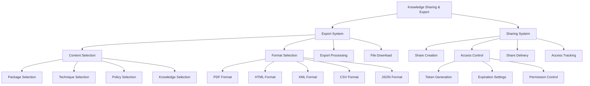

# Story 6.7: Knowledge Sharing and Export

**Status:** Draft

## Non-Technical Explanation

This story is about creating functionality that allows packaging engineers to share and export the packaging knowledge stored in the system for use in other contexts beyond the system itself.

Think of it like being able to create takeaway versions of the knowledge in your system's repository. Just as you might export data from a CRM system to create reports or share customer information with colleagues who don't have access to the system, this functionality lets packaging engineers extract and share packaging knowledge in formats suitable for different needs.

The knowledge sharing and export capability enables engineers to create documentation or reference guides from the knowledge base, export data for analysis in other tools, share specific information with colleagues who might not have access to the full system, create archives for compliance or regulatory purposes, or transfer knowledge to other systems.

For example, an engineer might want to:
- Export a detailed package specification as a PDF to share with team members
- Create an XML file containing WDAC policies for import into another system
- Generate a PowerPoint presentation summarizing packaging techniques for a training session
- Export troubleshooting guides in HTML format for a department wiki
- Create a CSV export of package metadata for analysis in Excel

This capability ensures that valuable packaging knowledge isn't trapped within the system but can be leveraged in whatever ways best serve the organization's needs.

## Goal & Context

**User Story:** As a packaging engineer, I need to share and export packaging knowledge for use outside the system.

**Context:** Building on the knowledge base (Story 6.1), documentation engine (Story 6.5), and searchable repository (Story 6.6), this story implements functionality to export and share packaging knowledge in various formats for use outside the system. This makes the accumulated knowledge more versatile and accessible across different contexts.

## Detailed Requirements

- Implement export of package documentation
- Create sharing of packaging techniques
- Develop export of WDAC policies
- Implement standardized export formats
- Create controlled sharing with permissions
- Document export capabilities and limitations

## Acceptance Criteria (ACs)

- AC1: Export produces complete package documentation
- AC2: Shared techniques maintain all relevant context
- AC3: WDAC policies export with proper structure
- AC4: Export formats are compatible with common tools
- AC5: Permissions correctly control sharing scope

## Technical Implementation Context

**Guidance:** Use the following details for implementation. Refer to the linked `docs/` files for broader context if needed.

- **Relevant Files:**

  - Files to Create:
    - `backend/apas/core/export/export_engine.py` - Core export engine
    - `backend/apas/core/export/pdf_exporter.py` - PDF export implementation
    - `backend/apas/core/export/html_exporter.py` - HTML export implementation
    - `backend/apas/core/export/xml_exporter.py` - XML export implementation
    - `backend/apas/core/export/csv_exporter.py` - CSV export implementation
    - `backend/apas/core/sharing/sharing_controller.py` - Sharing controller
    - `backend/apas/models/sharing.py` - Sharing-related database models
    - `backend/apas/services/export_service.py` - Export service
    - `backend/apas/services/sharing_service.py` - Sharing service
    - `backend/apas/api/endpoints/export.py` - Export API endpoints
    - `backend/apas/api/endpoints/sharing.py` - Sharing API endpoints
    - `backend/apas/api/schemas/export.py` - Export API schemas
    - `backend/apas/api/schemas/sharing.py` - Sharing API schemas
    - `frontend/src/components/export/ExportPanel.tsx` - Export panel component
    - `frontend/src/components/sharing/SharingPanel.tsx` - Sharing panel component
    - `frontend/src/hooks/useExport.tsx` - Export hook
    - `frontend/src/hooks/useSharing.tsx` - Sharing hook
    - `frontend/src/api/export.ts` - Export API client
    - `frontend/src/api/sharing.ts` - Sharing API client
    - `docs/developer-guide/export-formats.md` - Export formats documentation
    - `docs/developer-guide/sharing-system.md` - Sharing system documentation
  - Files to Modify:
    - `backend/apas/api/router.py` - Add export and sharing routes
    - `frontend/src/components/dashboard/TaskDetailView.tsx` - Add export/share options
    - `frontend/src/components/knowledge/KnowledgeEntryView.tsx` - Add export/share options
  - _(Hint: See `docs/architecture/project-structure.md` for overall layout)_

- **Key Technologies:**

  - Jinja2 for template rendering
  - WeasyPrint for PDF generation
  - ElementTree for XML processing
  - Pandas for CSV data handling
  - FastAPI for API implementation
  - React for UI components
  - _(Hint: See `docs/architecture/tech-stack.md` for technology details)_

- **API Interactions / SDK Usage:**

  - Implement API endpoints for export:
    - `POST /api/export/package/{package_id}` - Export package documentation
    - `POST /api/export/technique/{technique_id}` - Export packaging technique
    - `POST /api/export/policy/{policy_id}` - Export WDAC policy
    - `POST /api/export/knowledge/{entry_id}` - Export knowledge entry
    - `POST /api/export/search` - Export search results
  - Implement API endpoints for sharing:
    - `POST /api/sharing/create` - Create share
    - `GET /api/sharing/{share_id}` - Get shared content
    - `GET /api/sharing/outgoing` - Get outgoing shares
    - `GET /api/sharing/incoming` - Get incoming shares
    - `DELETE /api/sharing/{share_id}` - Delete share
  - Support different export formats (PDF, HTML, XML, CSV, JSON)
  - Enable token-based sharing with expiration
  - _(Hint: See `docs/architecture/api-reference.md` for API patterns)_

- **UI/UX Notes:**

  - Create intuitive export format selection
  - Implement preview of export when possible
  - Provide progress indicator for large exports
  - Create clear sharing controls with permission options
  - Show share status and expiration information
  - _(Hint: See `docs/APAS_UI_UX_Specification.md` for design details)_

- **Data Structures:**

  - `ExportJob` model:
    ```python
    class ExportJob(Base):
        """Export job model."""
        __tablename__ = "export_jobs"
        
        id = Column(String, primary_key=True, default=lambda: str(uuid.uuid4()))
        user_id = Column(String, nullable=True)
        export_type = Column(String, nullable=False)  # package, technique, policy, knowledge, search
        content_id = Column(String, nullable=True)  # ID of the content being exported
        format = Column(String, nullable=False)  # pdf, html, xml, csv, json
        status = Column(String, nullable=False, default="pending")  # pending, processing, completed, failed
        file_path = Column(String, nullable=True)  # Path to exported file
        file_size = Column(Integer, nullable=True)  # Size of exported file in bytes
        options = Column(JSONB, nullable=True)  # Export options
        created_at = Column(DateTime, nullable=False, default=datetime.datetime.utcnow)
        completed_at = Column(DateTime, nullable=True)
        error = Column(String, nullable=True)
        
        # Indexes
        __table_args__ = (
            Index("ix_export_jobs_user_id", "user_id"),
            Index("ix_export_jobs_export_type", "export_type"),
            Index("ix_export_jobs_status", "status"),
        )
    ```
  - `SharedContent` model:
    ```python
    class SharedContent(Base):
        """Shared content model."""
        __tablename__ = "shared_content"
        
        id = Column(String, primary_key=True, default=lambda: str(uuid.uuid4()))
        share_token = Column(String, nullable=False, unique=True)
        content_type = Column(String, nullable=False)  # package, technique, policy, knowledge, search
        content_id = Column(String, nullable=False)  # ID of the content being shared
        title = Column(String, nullable=False)
        description = Column(String, nullable=True)
        created_by = Column(String, nullable=False)  # User ID who created the share
        created_at = Column(DateTime, nullable=False, default=datetime.datetime.utcnow)
        expires_at = Column(DateTime, nullable=True)  # When the share expires
        access_count = Column(Integer, nullable=False, default=0)  # Number of times accessed
        last_accessed_at = Column(DateTime, nullable=True)  # When the share was last accessed
        permissions = Column(JSONB, nullable=False, default=dict)  # Permission settings
        is_active = Column(Boolean, nullable=False, default=True)
        
        # Indexes
        __table_args__ = (
            Index("ix_shared_content_share_token", "share_token"),
            Index("ix_shared_content_created_by", "created_by"),
            Index("ix_shared_content_content_type", "content_type"),
        )
    ```
  - `ExportRequest` schema:
    ```python
    class ExportRequest(BaseModel):
        """Export request schema."""
        format: str  # pdf, html, xml, csv, json
        options: Optional[Dict[str, Any]] = None
        
        class Config:
            extra = "forbid"
    ```
  - `SharingRequest` schema:
    ```python
    class SharingRequest(BaseModel):
        """Sharing request schema."""
        content_type: str  # package, technique, policy, knowledge, search
        content_id: str
        title: str
        description: Optional[str] = None
        expires_days: Optional[int] = 30  # Number of days until expiration, 0 for no expiration
        permissions: Optional[Dict[str, Any]] = None
        
        class Config:
            extra = "forbid"
    ```
  - _(Hint: See `docs/architecture/data-models.md` for structure details)_

- **Environment Variables:**

  - `EXPORT_OUTPUT_PATH` - Path where exported files are stored
  - `MAX_EXPORT_SIZE` - Maximum size of exported files
  - `EXPORT_RETENTION_DAYS` - Number of days to retain exported files
  - `SHARING_BASE_URL` - Base URL for shared content
  - `MAX_SHARING_DURATION` - Maximum sharing duration in days
  - _(Hint: See `docs/architecture/environment-vars.md` for details)_

- **Coding Standards Notes:**
  - Implement memory-efficient export for large data
  - Create consistent styling across export formats
  - Implement proper error handling for export failures
  - Use secure token generation for sharing
  - Create access control validation for shared content
  - _(Hint: See `docs/architecture/coding-standards.md` for full standards)_

## Visual Design Reference



## Tasks / Subtasks

- [ ] Implement export system core
  - [ ] Create export job management
  - [ ] Implement export processing pipeline
  - [ ] Develop format selection logic
  - [ ] Add export status tracking
  - [ ] Create file storage for exports
- [ ] Develop PDF export functionality
  - [ ] Create PDF template system
  - [ ] Implement PDF generation
  - [ ] Develop styling and formatting
  - [ ] Add table of contents generation
  - [ ] Create page header/footer
- [ ] Implement HTML export functionality
  - [ ] Create HTML template system
  - [ ] Implement HTML generation
  - [ ] Develop CSS styling
  - [ ] Add interactive elements
  - [ ] Create responsive design
- [ ] Develop XML export functionality
  - [ ] Create XML schema design
  - [ ] Implement XML generation
  - [ ] Develop structure validation
  - [ ] Add metadata inclusion
  - [ ] Create schema documentation
- [ ] Implement CSV export functionality
  - [ ] Create CSV structure design
  - [ ] Implement data extraction
  - [ ] Develop column mapping
  - [ ] Add data processing
  - [ ] Create header generation
- [ ] Develop content-specific exports
  - [ ] Implement package documentation export
  - [ ] Create technique export
  - [ ] Develop policy export
  - [ ] Add knowledge entry export
  - [ ] Create search results export
- [ ] Implement sharing system
  - [ ] Create share token generation
  - [ ] Implement expiration management
  - [ ] Develop permission control
  - [ ] Add access tracking
  - [ ] Create share revocation
- [ ] Develop frontend export components
  - [ ] Create export panel component
  - [ ] Implement format selection
  - [ ] Develop options configuration
  - [ ] Add progress indication
  - [ ] Create download handling
- [ ] Implement frontend sharing components
  - [ ] Create sharing panel component
  - [ ] Implement permission controls
  - [ ] Develop expiration settings
  - [ ] Add share link generation
  - [ ] Create share management
- [ ] Set up API endpoints
  - [ ] Implement export endpoints
  - [ ] Create sharing endpoints
  - [ ] Develop file download handling
  - [ ] Add error handling
  - [ ] Create request validation
- [ ] Create documentation
  - [ ] Document export formats
  - [ ] Create sharing system guide
  - [ ] Develop best practices
  - [ ] Add troubleshooting guide
  - [ ] Create API documentation

## Manual Testing Guide (For Non-Technical Users)

You can verify the knowledge sharing and export functionality through these checks:

1. **Exporting Package Documentation**:
   - Find a completed package in the system
   - Look for an export option in the package details view
   - Select "Export Package Documentation"
   - Choose PDF format from the available options
   - Click Export and wait for the export to complete
   - Download the exported file
   - Open the PDF and verify that it contains complete package documentation
   - Check that the formatting, images, and tables are displayed correctly

2. **Exporting Packaging Techniques**:
   - Navigate to a packaging technique in the knowledge base
   - Find the export option for the technique
   - Choose HTML format from the available options
   - Click Export and wait for the export to complete
   - Download the exported file
   - Open the HTML file in a browser
   - Verify that the technique is completely documented with all context
   - Check that any code samples, diagrams, or steps are properly included

3. **Exporting WDAC Policies**:
   - Find a WDAC policy in the system
   - Look for an export option in the policy details view
   - Select "Export WDAC Policy"
   - Choose XML format from the available options
   - Click Export and wait for the export to complete
   - Download the exported file
   - Verify that the XML file has the correct structure for a WDAC policy
   - Check that all policy rules, signers, and settings are properly included

4. **Sharing Knowledge Content**:
   - Navigate to a knowledge entry you want to share
   - Find the share option for the entry
   - Click "Share" to open the sharing panel
   - Set an expiration date for the share
   - Adjust any permission settings if available
   - Create the share and copy the generated share link
   - Open the share link in a new browser window or incognito mode
   - Verify that the shared content loads correctly
   - Check that the content includes all relevant information

5. **Managing Shares**:
   - Navigate to a "My Shares" or "Sharing" section if available
   - Verify that you can see a list of your created shares
   - Check that each share shows its status, expiration date, and access count
   - Try deactivating or deleting a share
   - Verify that the share link no longer works after deactivation or deletion
   - Try creating a new share with different permission settings
   - Verify that the permissions work as expected when accessing the share

## Testing Requirements

**Guidance:** Verify implementation against the ACs using the following tests.

- **Unit Tests:** 
  - Test export generation for different formats
  - Test sharing token generation and validation
  - Test permission checking logic
  - Test expiration handling
  - Verify content extraction for export

- **Integration Tests:** 
  - Test end-to-end export workflow
  - Test sharing creation and access
  - Test export file generation and download
  - Verify content rendering in different formats
  - Test expiration and access tracking

- **Manual Verification:** 
  - Verify export quality for different content types
  - Check formatting and structure in exported files
  - Test sharing with different permission settings
  - Verify expiration works correctly
  - Test export of large content (performance)

## Implementation Example

Here's an example implementation of the export engine:

```python
import os
import uuid
import datetime
import tempfile
import shutil
from typing import List, Dict, Any, Optional, BinaryIO
from fastapi import Depends, HTTPException, status, BackgroundTasks
from sqlalchemy.ext.asyncio import AsyncSession
from sqlalchemy import select
import jinja2
import weasyprint
import pandas as pd
import xml.etree.ElementTree as ET
import json

from apas.db.session import get_async_session
from apas.models.export import ExportJob
from apas.services.knowledge_service import KnowledgeService
from apas.services.package_service import PackageService
from apas.services.policy_service import PolicyService
from apas.services.documentation_service import DocumentationService
from apas.api.schemas.export import ExportRequest, ExportResponse

class ExportEngine:
    """Export engine for packaging knowledge export."""
    
    def __init__(
        self, 
        session: AsyncSession = Depends(get_async_session),
        knowledge_service: KnowledgeService = Depends(),
        package_service: PackageService = Depends(),
        policy_service: PolicyService = Depends(),
        documentation_service: DocumentationService = Depends(),
        output_path: Optional[str] = None,
        max_export_size: Optional[int] = None,
        retention_days: Optional[int] = None,
        base_url: Optional[str] = None
    ):
        self.session = session
        self.knowledge_service = knowledge_service
        self.package_service = package_service
        self.policy_service = policy_service
        self.documentation_service = documentation_service
        
        self.output_path = output_path or os.getenv("EXPORT_OUTPUT_PATH", "data/exports")
        self.max_export_size = max_export_size or int(os.getenv("MAX_EXPORT_SIZE", "10485760"))  # 10MB default
        self.retention_days = retention_days or int(os.getenv("EXPORT_RETENTION_DAYS", "30"))
        self.base_url = base_url or os.getenv("API_BASE_URL", "http://localhost:8000")
        
        # Create output directory if it doesn't exist
        os.makedirs(self.output_path, exist_ok=True)
        
        # Initialize template environment
        self.template_env = jinja2.Environment(
            loader=jinja2.FileSystemLoader("data/templates/export"),
            autoescape=jinja2.select_autoescape(['html', 'xml']),
            trim_blocks=True,
            lstrip_blocks=True
        )
    
    async def export_package(
        self, 
        package_id: str, 
        request: ExportRequest, 
        user_id: Optional[str] = None,
        background_tasks: Optional[BackgroundTasks] = None
    ) -> ExportResponse:
        """
        Export package documentation.
        
        Args:
            package_id: Package ID
            request: Export request
            user_id: User ID for tracking
            background_tasks: Background tasks for async processing
            
        Returns:
            Export response
            
        Raises:
            HTTPException: If package not found or format not supported
        """
        # Validate format
        if request.format not in ["pdf", "html", "docx", "markdown", "json"]:
            raise HTTPException(
                status_code=status.HTTP_400_BAD_REQUEST,
                detail=f"Format {request.format} not supported for package export"
            )
        
        # Get package
        package = await self.package_service.get_package(package_id)
        if not package:
            raise HTTPException(
                status_code=status.HTTP_404_NOT_FOUND,
                detail=f"Package {package_id} not found"
            )
        
        # Create export job
        export_job = ExportJob(
            id=str(uuid.uuid4()),
            user_id=user_id,
            export_type="package",
            content_id=package_id,
            format=request.format,
            status="pending",
            options=request.options,
            created_at=datetime.datetime.utcnow()
        )
        
        self.session.add(export_job)
        await self.session.commit()
        await self.session.refresh(export_job)
        
        # Process export in background if background_tasks provided
        if background_tasks:
            background_tasks.add_task(
                self._process_package_export,
                export_job.id,
                package_id,
                request.format,
                request.options
            )
            
            # Return initial response
            return ExportResponse(
                id=export_job.id,
                status="pending",
                content_type="package",
                content_id=package_id,
                format=request.format,
                created_at=export_job.created_at.isoformat(),
                download_url=f"{self.base_url}/api/export/{export_job.id}/download"
            )
        else:
            # Process export synchronously
            await self._process_package_export(
                export_job.id,
                package_id,
                request.format,
                request.options
            )
            
            # Refresh export job
            await self.session.refresh(export_job)
            
            # Return response
            return ExportResponse(
                id=export_job.id,
                status=export_job.status,
                content_type="package",
                content_id=package_id,
                format=request.format,
                created_at=export_job.created_at.isoformat(),
                completed_at=export_job.completed_at.isoformat() if export_job.completed_at else None,
                file_size=export_job.file_size,
                download_url=f"{self.base_url}/api/export/{export_job.id}/download" if export_job.status == "completed" else None,
                error=export_job.error
            )
    
    async def export_technique(
        self, 
        technique_id: str, 
        request: ExportRequest, 
        user_id: Optional[str] = None,
        background_tasks: Optional[BackgroundTasks] = None
    ) -> ExportResponse:
        """
        Export packaging technique.
        
        Args:
            technique_id: Technique ID (knowledge entry ID)
            request: Export request
            user_id: User ID for tracking
            background_tasks: Background tasks for async processing
            
        Returns:
            Export response
            
        Raises:
            HTTPException: If technique not found or format not supported
        """
        # Validate format
        if request.format not in ["pdf", "html", "markdown", "json"]:
            raise HTTPException(
                status_code=status.HTTP_400_BAD_REQUEST,
                detail=f"Format {request.format} not supported for technique export"
            )
        
        # Get technique (knowledge entry)
        knowledge_entry = await self.knowledge_service.get_entry(technique_id)
        if not knowledge_entry or knowledge_entry.get("content_type") != "technique":
            raise HTTPException(
                status_code=status.HTTP_404_NOT_FOUND,
                detail=f"Technique {technique_id} not found"
            )
        
        # Create export job
        export_job = ExportJob(
            id=str(uuid.uuid4()),
            user_id=user_id,
            export_type="technique",
            content_id=technique_id,
            format=request.format,
            status="pending",
            options=request.options,
            created_at=datetime.datetime.utcnow()
        )
        
        self.session.add(export_job)
        await self.session.commit()
        await self.session.refresh(export_job)
        
        # Process export in background if background_tasks provided
        if background_tasks:
            background_tasks.add_task(
                self._process_technique_export,
                export_job.id,
                technique_id,
                request.format,
                request.options
            )
            
            # Return initial response
            return ExportResponse(
                id=export_job.id,
                status="pending",
                content_type="technique",
                content_id=technique_id,
                format=request.format,
                created_at=export_job.created_at.isoformat(),
                download_url=f"{self.base_url}/api/export/{export_job.id}/download"
            )
        else:
            # Process export synchronously
            await self._process_technique_export(
                export_job.id,
                technique_id,
                request.format,
                request.options
            )
            
            # Refresh export job
            await self.session.refresh(export_job)
            
            # Return response
            return ExportResponse(
                id=export_job.id,
                status=export_job.status,
                content_type="technique",
                content_id=technique_id,
                format=request.format,
                created_at=export_job.created_at.isoformat(),
                completed_at=export_job.completed_at.isoformat() if export_job.completed_at else None,
                file_size=export_job.file_size,
                download_url=f"{self.base_url}/api/export/{export_job.id}/download" if export_job.status == "completed" else None,
                error=export_job.error
            )
    
    async def export_policy(
        self, 
        policy_id: str, 
        request: ExportRequest, 
        user_id: Optional[str] = None,
        background_tasks: Optional[BackgroundTasks] = None
    ) -> ExportResponse:
        """
        Export WDAC policy.
        
        Args:
            policy_id: Policy ID
            request: Export request
            user_id: User ID for tracking
            background_tasks: Background tasks for async processing
            
        Returns:
            Export response
            
        Raises:
            HTTPException: If policy not found or format not supported
        """
        # Validate format
        if request.format not in ["xml", "pdf", "json"]:
            raise HTTPException(
                status_code=status.HTTP_400_BAD_REQUEST,
                detail=f"Format {request.format} not supported for policy export"
            )
        
        # Get policy
        policy = await self.policy_service.get_policy(policy_id)
        if not policy:
            raise HTTPException(
                status_code=status.HTTP_404_NOT_FOUND,
                detail=f"Policy {policy_id} not found"
            )
        
        # Create export job
        export_job = ExportJob(
            id=str(uuid.uuid4()),
            user_id=user_id,
            export_type="policy",
            content_id=policy_id,
            format=request.format,
            status="pending",
            options=request.options,
            created_at=datetime.datetime.utcnow()
        )
        
        self.session.add(export_job)
        await self.session.commit()
        await self.session.refresh(export_job)
        
        # Process export in background if background_tasks provided
        if background_tasks:
            background_tasks.add_task(
                self._process_policy_export,
                export_job.id,
                policy_id,
                request.format,
                request.options
            )
            
            # Return initial response
            return ExportResponse(
                id=export_job.id,
                status="pending",
                content_type="policy",
                content_id=policy_id,
                format=request.format,
                created_at=export_job.created_at.isoformat(),
                download_url=f"{self.base_url}/api/export/{export_job.id}/download"
            )
        else:
            # Process export synchronously
            await self._process_policy_export(
                export_job.id,
                policy_id,
                request.format,
                request.options
            )
            
            # Refresh export job
            await self.session.refresh(export_job)
            
            # Return response
            return ExportResponse(
                id=export_job.id,
                status=export_job.status,
                content_type="policy",
                content_id=policy_id,
                format=request.format,
                created_at=export_job.created_at.isoformat(),
                completed_at=export_job.completed_at.isoformat() if export_job.completed_at else None,
                file_size=export_job.file_size,
                download_url=f"{self.base_url}/api/export/{export_job.id}/download" if export_job.status == "completed" else None,
                error=export_job.error
            )
    
    async def export_knowledge(
        self, 
        entry_id: str, 
        request: ExportRequest, 
        user_id: Optional[str] = None,
        background_tasks: Optional[BackgroundTasks] = None
    ) -> ExportResponse:
        """
        Export knowledge entry.
        
        Args:
            entry_id: Knowledge entry ID
            request: Export request
            user_id: User ID for tracking
            background_tasks: Background tasks for async processing
            
        Returns:
            Export response
            
        Raises:
            HTTPException: If entry not found or format not supported
        """
        # Validate format
        if request.format not in ["pdf", "html", "markdown", "json"]:
            raise HTTPException(
                status_code=status.HTTP_400_BAD_REQUEST,
                detail=f"Format {request.format} not supported for knowledge export"
            )
        
        # Get knowledge entry
        entry = await self.knowledge_service.get_entry(entry_id)
        if not entry:
            raise HTTPException(
                status_code=status.HTTP_404_NOT_FOUND,
                detail=f"Knowledge entry {entry_id} not found"
            )
        
        # Create export job
        export_job = ExportJob(
            id=str(uuid.uuid4()),
            user_id=user_id,
            export_type="knowledge",
            content_id=entry_id,
            format=request.format,
            status="pending",
            options=request.options,
            created_at=datetime.datetime.utcnow()
        )
        
        self.session.add(export_job)
        await self.session.commit()
        await self.session.refresh(export_job)
        
        # Process export in background if background_tasks provided
        if background_tasks:
            background_tasks.add_task(
                self._process_knowledge_export,
                export_job.id,
                entry_id,
                request.format,
                request.options
            )
            
            # Return initial response
            return ExportResponse(
                id=export_job.id,
                status="pending",
                content_type="knowledge",
                content_id=entry_id,
                format=request.format,
                created_at=export_job.created_at.isoformat(),
                download_url=f"{self.base_url}/api/export/{export_job.id}/download"
            )
        else:
            # Process export synchronously
            await self._process_knowledge_export(
                export_job.id,
                entry_id,
                request.format,
                request.options
            )
            
            # Refresh export job
            await self.session.refresh(export_job)
            
            # Return response
            return ExportResponse(
                id=export_job.id,
                status=export_job.status,
                content_type="knowledge",
                content_id=entry_id,
                format=request.format,
                created_at=export_job.created_at.isoformat(),
                completed_at=export_job.completed_at.isoformat() if export_job.completed_at else None,
                file_size=export_job.file_size,
                download_url=f"{self.base_url}/api/export/{export_job.id}/download" if export_job.status == "completed" else None,
                error=export_job.error
            )
    
    async def get_export_job(self, export_id: str) -> Optional[Dict[str, Any]]:
        """
        Get export job by ID.
        
        Args:
            export_id: Export job ID
            
        Returns:
            Export job information or None if not found
        """
        # Query export job
        query = select(ExportJob).where(ExportJob.id == export_id)
        result = await self.session.execute(query)
        export_job = result.scalar_one_or_none()
        
        if not export_job:
            return None
        
        # Convert to dictionary
        return {
            "id": export_job.id,
            "user_id": export_job.user_id,
            "export_type": export_job.export_type,
            "content_id": export_job.content_id,
            "format": export_job.format,
            "status": export_job.status,
            "file_path": export_job.file_path,
            "file_size": export_job.file_size,
            "options": export_job.options,
            "created_at": export_job.created_at,
            "completed_at": export_job.completed_at,
            "error": export_job.error
        }
    
    async def get_export_file(self, export_id: str) -> Tuple[Optional[str], Optional[str], Optional[int]]:
        """
        Get export file path and details.
        
        Args:
            export_id: Export job ID
            
        Returns:
            Tuple of (file_path, content_type, file_size) or (None, None, None) if not found
        """
        # Query export job
        query = select(ExportJob).where(ExportJob.id == export_id)
        result = await self.session.execute(query)
        export_job = result.scalar_one_or_none()
        
        if not export_job or export_job.status != "completed" or not export_job.file_path:
            return None, None, None
        
        # Check if file exists
        if not os.path.exists(export_job.file_path):
            return None, None, None
        
        # Determine content type
        content_type = self._get_content_type(export_job.format)
        
        return export_job.file_path, content_type, export_job.file_size
    
    async def clean_old_exports(self) -> int:
        """
        Clean up old export files.
        
        Returns:
            Number of exports cleaned up
        """
        if self.retention_days <= 0:
            return 0
        
        # Calculate cutoff date
        cutoff_date = datetime.datetime.utcnow() - datetime.timedelta(days=self.retention_days)
        
        # Query export jobs older than cutoff date
        query = select(ExportJob).where(
            ExportJob.created_at < cutoff_date,
            ExportJob.file_path.isnot(None)
        )
        result = await self.session.execute(query)
        old_exports = result.scalars().all()
        
        # Delete export files
        count = 0
        for export_job in old_exports:
            if os.path.exists(export_job.file_path):
                try:
                    os.remove(export_job.file_path)
                    export_job.file_path = None
                    export_job.file_size = None
                    count += 1
                except OSError:
                    # Ignore errors when removing files
                    pass
        
        # Update database
        if count > 0:
            await self.session.commit()
        
        return count
    
    async def _process_package_export(
        self, 
        export_id: str, 
        package_id: str, 
        format: str, 
        options: Optional[Dict[str, Any]]
    ) -> None:
        """Process package export in background."""
        try:
            # Update status to processing
            await self._update_export_status(export_id, "processing")
            
            # Get package
            package = await self.package_service.get_package(package_id)
            if not package:
                raise ValueError(f"Package {package_id} not found")
            
            # Get documentation
            documentation = await self.documentation_service.get_documentation(package_id)
            if not documentation:
                # Generate documentation if not available
                documentation = await self.documentation_service.generate_documentation(package_id)
            
            # Process based on format
            if format == "pdf":
                file_path = await self._generate_pdf(
                    export_id, 
                    "package", 
                    f"{package['name']}_{package['version']}",
                    documentation['content'],
                    options
                )
            elif format == "html":
                file_path = await self._generate_html(
                    export_id, 
                    "package", 
                    f"{package['name']}_{package['version']}",
                    documentation['content'],
                    options
                )
            elif format == "markdown":
                file_path = await self._save_markdown(
                    export_id, 
                    "package", 
                    f"{package['name']}_{package['version']}",
                    documentation['content']
                )
            elif format == "docx":
                file_path = await self._generate_docx(
                    export_id, 
                    "package", 
                    f"{package['name']}_{package['version']}",
                    documentation['content'],
                    options
                )
            elif format == "json":
                file_path = await self._generate_json(
                    export_id, 
                    "package", 
                    f"{package['name']}_{package['version']}",
                    package
                )
            else:
                raise ValueError(f"Unsupported format: {format}")
            
            # Update export job with file information
            file_size = os.path.getsize(file_path)
            await self._update_export_completed(export_id, file_path, file_size)
            
        except Exception as e:
            # Update export job with error
            await self._update_export_error(export_id, str(e))
    
    async def _process_technique_export(
        self, 
        export_id: str, 
        technique_id: str, 
        format: str, 
        options: Optional[Dict[str, Any]]
    ) -> None:
        """Process technique export in background."""
        try:
            # Update status to processing
            await self._update_export_status(export_id, "processing")
            
            # Get technique
            technique = await self.knowledge_service.get_entry(technique_id)
            if not technique:
                raise ValueError(f"Technique {technique_id} not found")
            
            # Process based on format
            if format == "pdf":
                # Convert content to markdown
                markdown_content = self._convert_technique_to_markdown(technique)
                file_path = await self._generate_pdf(
                    export_id, 
                    "technique", 
                    technique['title'],
                    markdown_content,
                    options
                )
            elif format == "html":
                # Convert content to markdown
                markdown_content = self._convert_technique_to_markdown(technique)
                file_path = await self._generate_html(
                    export_id, 
                    "technique", 
                    technique['title'],
                    markdown_content,
                    options
                )
            elif format == "markdown":
                # Convert content to markdown
                markdown_content = self._convert_technique_to_markdown(technique)
                file_path = await self._save_markdown(
                    export_id, 
                    "technique", 
                    technique['title'],
                    markdown_content
                )
            elif format == "json":
                file_path = await self._generate_json(
                    export_id, 
                    "technique", 
                    technique['title'],
                    technique
                )
            else:
                raise ValueError(f"Unsupported format: {format}")
            
            # Update export job with file information
            file_size = os.path.getsize(file_path)
            await self._update_export_completed(export_id, file_path, file_size)
            
        except Exception as e:
            # Update export job with error
            await self._update_export_error(export_id, str(e))
    
    async def _process_policy_export(
        self, 
        export_id: str, 
        policy_id: str, 
        format: str, 
        options: Optional[Dict[str, Any]]
    ) -> None:
        """Process policy export in background."""
        try:
            # Update status to processing
            await self._update_export_status(export_id, "processing")
            
            # Get policy
            policy = await self.policy_service.get_policy(policy_id)
            if not policy:
                raise ValueError(f"Policy {policy_id} not found")
            
            # Process based on format
            if format == "xml":
                file_path = await self._generate_policy_xml(
                    export_id, 
                    policy['name'],
                    policy
                )
            elif format == "pdf":
                # Generate markdown documentation
                markdown_content = self._convert_policy_to_markdown(policy)
                file_path = await self._generate_pdf(
                    export_id, 
                    "policy", 
                    policy['name'],
                    markdown_content,
                    options
                )
            elif format == "json":
                file_path = await self._generate_json(
                    export_id, 
                    "policy", 
                    policy['name'],
                    policy
                )
            else:
                raise ValueError(f"Unsupported format: {format}")
            
            # Update export job with file information
            file_size = os.path.getsize(file_path)
            await self._update_export_completed(export_id, file_path, file_size)
            
        except Exception as e:
            # Update export job with error
            await self._update_export_error(export_id, str(e))
    
    async def _process_knowledge_export(
        self, 
        export_id: str, 
        entry_id: str, 
        format: str, 
        options: Optional[Dict[str, Any]]
    ) -> None:
        """Process knowledge export in background."""
        try:
            # Update status to processing
            await self._update_export_status(export_id, "processing")
            
            # Get knowledge entry
            entry = await self.knowledge_service.get_entry(entry_id)
            if not entry:
                raise ValueError(f"Knowledge entry {entry_id} not found")
            
            # Process based on format
            if format == "pdf":
                # Convert content to markdown
                markdown_content = self._convert_knowledge_to_markdown(entry)
                file_path = await self._generate_pdf(
                    export_id, 
                    "knowledge", 
                    entry['title'],
                    markdown_content,
                    options
                )
            elif format == "html":
                # Convert content to markdown
                markdown_content = self._convert_knowledge_to_markdown(entry)
                file_path = await self._generate_html(
                    export_id, 
                    "knowledge", 
                    entry['title'],
                    markdown_content,
                    options
                )
            elif format == "markdown":
                # Convert content to markdown
                markdown_content = self._convert_knowledge_to_markdown(entry)
                file_path = await self._save_markdown(
                    export_id, 
                    "knowledge", 
                    entry['title'],
                    markdown_content
                )
            elif format == "json":
                file_path = await self._generate_json(
                    export_id, 
                    "knowledge", 
                    entry['title'],
                    entry
                )
            else:
                raise ValueError(f"Unsupported format: {format}")
            
            # Update export job with file information
            file_size = os.path.getsize(file_path)
            await self._update_export_completed(export_id, file_path, file_size)
            
        except Exception as e:
            # Update export job with error
            await self._update_export_error(export_id, str(e))
    
    async def _update_export_status(self, export_id: str, status: str) -> None:
        """Update export job status."""
        # Query export job
        query = select(ExportJob).where(ExportJob.id == export_id)
        result = await self.session.execute(query)
        export_job = result.scalar_one_or_none()
        
        if export_job:
            # Update status
            export_job.status = status
            await self.session.commit()
    
    async def _update_export_completed(self, export_id: str, file_path: str, file_size: int) -> None:
        """Update export job as completed."""
        # Query export job
        query = select(ExportJob).where(ExportJob.id == export_id)
        result = await self.session.execute(query)
        export_job = result.scalar_one_or_none()
        
        if export_job:
            # Update status
            export_job.status = "completed"
            export_job.file_path = file_path
            export_job.file_size = file_size
            export_job.completed_at = datetime.datetime.utcnow()
            await self.session.commit()
    
    async def _update_export_error(self, export_id: str, error: str) -> None:
        """Update export job with error."""
        # Query export job
        query = select(ExportJob).where(ExportJob.id == export_id)
        result = await self.session.execute(query)
        export_job = result.scalar_one_or_none()
        
        if export_job:
            # Update status
            export_job.status = "failed"
            export_job.error = error
            export_job.completed_at = datetime.datetime.utcnow()
            await self.session.commit()
    
    async def _generate_pdf(
        self, 
        export_id: str, 
        export_type: str, 
        title: str, 
        content: str, 
        options: Optional[Dict[str, Any]]
    ) -> str:
        """
        Generate PDF from markdown content.
        
        Args:
            export_id: Export job ID
            export_type: Export type
            title: Document title
            content: Markdown content
            options: Export options
            
        Returns:
            File path of generated PDF
        """
        # Create output file path
        file_name = f"{export_type}_{title.replace(' ', '_')}_{export_id[:8]}.pdf"
        file_path = os.path.join(self.output_path, file_name)
        
        # Convert markdown to HTML
        import markdown
        html_content = markdown.markdown(
            content,
            extensions=['tables', 'fenced_code', 'codehilite']
        )
        
        # Create HTML document with styling
        html_document = f"""
        <!DOCTYPE html>
        <html>
        <head>
            <meta charset="utf-8">
            <title>{title}</title>
            <style>
                @page {{
                    size: letter;
                    margin: 2cm;
                }}
                body {{
                    font-family: Arial, sans-serif;
                    line-height: 1.6;
                    margin: 0;
                    padding: 0;
                }}
                h1 {{
                    color: #333;
                    border-bottom: 1px solid #eee;
                    padding-bottom: 10px;
                    font-size: 24pt;
                }}
                h2 {{
                    color: #444;
                    margin-top: 20px;
                    font-size: 18pt;
                }}
                h3 {{
                    color: #555;
                    font-size: 14pt;
                }}
                table {{
                    border-collapse: collapse;
                    width: 100%;
                    margin-bottom: 20px;
                }}
                th, td {{
                    border: 1px solid #ddd;
                    padding: 8px;
                    text-align: left;
                }}
                th {{
                    background-color: #f2f2f2;
                }}
                code {{
                    background-color: #f5f5f5;
                    padding: 2px 4px;
                    border-radius: 4px;
                    font-family: Consolas, monospace;
                }}
                pre {{
                    background-color: #f5f5f5;
                    padding: 10px;
                    border-radius: 4px;
                    overflow-x: auto;
                    font-family: Consolas, monospace;
                }}
                .header {{
                    text-align: center;
                    margin-bottom: 30px;
                }}
                .footer {{
                    text-align: center;
                    font-size: 9pt;
                    color: #777;
                    margin-top: 30px;
                }}
            </style>
        </head>
        <body>
            <div class="header">
                <h1>{title}</h1>
                <p>Generated on {datetime.datetime.utcnow().strftime('%Y-%m-%d %H:%M:%S')} UTC</p>
            </div>
            
            {html_content}
            
            <div class="footer">
                <p>Generated by Application Packaging Automation System</p>
            </div>
        </body>
        </html>
        """
        
        # Save HTML to temporary file
        with tempfile.NamedTemporaryFile(suffix=".html", delete=False) as temp_file:
            temp_file.write(html_document.encode('utf-8'))
            temp_html_path = temp_file.name
        
        try:
            # Convert HTML to PDF
            pdf = weasyprint.HTML(filename=temp_html_path).write_pdf()
            
            # Write PDF to file
            with open(file_path, 'wb') as f:
                f.write(pdf)
            
            return file_path
        finally:
            # Clean up temporary file
            if os.path.exists(temp_html_path):
                os.remove(temp_html_path)
    
    async def _generate_html(
        self, 
        export_id: str, 
        export_type: str, 
        title: str, 
        content: str, 
        options: Optional[Dict[str, Any]]
    ) -> str:
        """
        Generate HTML from markdown content.
        
        Args:
            export_id: Export job ID
            export_type: Export type
            title: Document title
            content: Markdown content
            options: Export options
            
        Returns:
            File path of generated HTML
        """
        # Create output file path
        file_name = f"{export_type}_{title.replace(' ', '_')}_{export_id[:8]}.html"
        file_path = os.path.join(self.output_path, file_name)
        
        # Convert markdown to HTML
        import markdown
        html_content = markdown.markdown(
            content,
            extensions=['tables', 'fenced_code', 'codehilite']
        )
        
        # Create HTML document with styling
        html_document = f"""
        <!DOCTYPE html>
        <html>
        <head>
            <meta charset="utf-8">
            <title>{title}</title>
            <style>
                body {{
                    font-family: Arial, sans-serif;
                    line-height: 1.6;
                    max-width: 800px;
                    margin: 0 auto;
                    padding: 20px;
                }}
                h1 {{
                    color: #333;
                    border-bottom: 1px solid #eee;
                    padding-bottom: 10px;
                }}
                h2 {{
                    color: #444;
                    margin-top: 30px;
                }}
                h3 {{
                    color: #555;
                }}
                code {{
                    background-color: #f5f5f5;
                    padding: 2px 4px;
                    border-radius: 4px;
                    font-family: Consolas, monospace;
                }}
                pre {{
                    background-color: #f5f5f5;
                    padding: 10px;
                    border-radius: 4px;
                    overflow-x: auto;
                    font-family: Consolas, monospace;
                }}
                table {{
                    border-collapse: collapse;
                    width: 100%;
                    margin-bottom: 20px;
                }}
                th, td {{
                    border: 1px solid #ddd;
                    padding: 8px;
                    text-align: left;
                }}
                th {{
                    background-color: #f2f2f2;
                }}
                .header {{
                    text-align: center;
                    margin-bottom: 30px;
                }}
                .footer {{
                    text-align: center;
                    font-size: 12px;
                    color: #777;
                    margin-top: 30px;
                    padding-top: 10px;
                    border-top: 1px solid #eee;
                }}
            </style>
        </head>
        <body>
            <div class="header">
                <h1>{title}</h1>
                <p>Generated on {datetime.datetime.utcnow().strftime('%Y-%m-%d %H:%M:%S')} UTC</p>
            </div>
            
            {html_content}
            
            <div class="footer">
                <p>Generated by Application Packaging Automation System</p>
            </div>
        </body>
        </html>
        """
        
        # Write HTML to file
        with open(file_path, 'w', encoding='utf-8') as f:
            f.write(html_document)
        
        return file_path
    
    async def _save_markdown(
        self, 
        export_id: str, 
        export_type: str, 
        title: str, 
        content: str
    ) -> str:
        """
        Save markdown content to file.
        
        Args:
            export_id: Export job ID
            export_type: Export type
            title: Document title
            content: Markdown content
            
        Returns:
            File path of saved markdown
        """
        # Create output file path
        file_name = f"{export_type}_{title.replace(' ', '_')}_{export_id[:8]}.md"
        file_path = os.path.join(self.output_path, file_name)
        
        # Add title and timestamp to content
        full_content = f"""# {title}

Generated on {datetime.datetime.utcnow().strftime('%Y-%m-%d %H:%M:%S')} UTC

{content}

---

Generated by Application Packaging Automation System
"""
        
        # Write markdown to file
        with open(file_path, 'w', encoding='utf-8') as f:
            f.write(full_content)
        
        return file_path
    
    async def _generate_docx(
        self, 
        export_id: str, 
        export_type: str, 
        title: str, 
        content: str, 
        options: Optional[Dict[str, Any]]
    ) -> str:
        """
        Generate DOCX from markdown content.
        
        Args:
            export_id: Export job ID
            export_type: Export type
            title: Document title
            content: Markdown content
            options: Export options
            
        Returns:
            File path of generated DOCX
        """
        # Create output file path
        file_name = f"{export_type}_{title.replace(' ', '_')}_{export_id[:8]}.docx"
        file_path = os.path.join(self.output_path, file_name)
        
        # Save markdown to temporary file
        with tempfile.NamedTemporaryFile(suffix=".md", delete=False) as temp_file:
            temp_file.write(content.encode('utf-8'))
            temp_md_path = temp_file.name
        
        try:
            # Convert markdown to DOCX using pandoc
            cmd = [
                "pandoc", 
                temp_md_path, 
                "-o", file_path, 
                "-f", "markdown", 
                "-t", "docx",
                "--toc"
            ]
            
            # Add title if provided
            if title:
                cmd.extend(["--metadata", f"title={title}"])
            
            # Run pandoc
            subprocess.run(cmd, check=True)
            
            return file_path
        finally:
            # Clean up temporary file
            if os.path.exists(temp_md_path):
                os.remove(temp_md_path)
    
    async def _generate_json(
        self, 
        export_id: str, 
        export_type: str, 
        title: str, 
        data: Dict[str, Any]
    ) -> str:
        """
        Generate JSON from data.
        
        Args:
            export_id: Export job ID
            export_type: Export type
            title: Document title
            data: Data to convert to JSON
            
        Returns:
            File path of generated JSON
        """
        # Create output file path
        file_name = f"{export_type}_{title.replace(' ', '_')}_{export_id[:8]}.json"
        file_path = os.path.join(self.output_path, file_name)
        
        # Write JSON to file
        with open(file_path, 'w', encoding='utf-8') as f:
            json.dump(data, f, indent=2, default=str)
        
        return file_path
    
    async def _generate_policy_xml(
        self, 
        export_id: str, 
        title: str, 
        policy: Dict[str, Any]
    ) -> str:
        """
        Generate XML for WDAC policy.
        
        Args:
            export_id: Export job ID
            title: Policy title
            policy: Policy data
            
        Returns:
            File path of generated XML
        """
        # Create output file path
        file_name = f"policy_{title.replace(' ', '_')}_{export_id[:8]}.xml"
        file_path = os.path.join(self.output_path, file_name)
        
        # Check if policy has XML content
        if "xml_content" in policy:
            # Write XML directly to file
            with open(file_path, 'w', encoding='utf-8') as f:
                f.write(policy["xml_content"])
            
            return file_path
        
        # Create basic XML structure
        policy_root = ET.Element("SiPolicy")
        policy_root.set("xmlns", "urn:schemas-microsoft-com:sipolicy")
        
        # Add policy information
        policy_info = ET.SubElement(policy_root, "PolicyInfo")
        ET.SubElement(policy_info, "PolicyId").text = policy.get("policy_id", "")
        ET.SubElement(policy_info, "PolicyName").text = policy.get("name", "")
        ET.SubElement(policy_info, "PolicyVersion").text = policy.get("version", "1.0")
        
        # Add rules, signers, etc. based on policy data
        # (This is a simplified implementation - in a real system, 
        # this would use the actual policy data structure)
        
        # Generate XML string
        xml_string = ET.tostring(policy_root, encoding='utf-8', xml_declaration=True)
        
        # Write XML to file
        with open(file_path, 'wb') as f:
            f.write(xml_string)
        
        return file_path
    
    def _convert_technique_to_markdown(self, technique: Dict[str, Any]) -> str:
        """Convert technique data to markdown."""
        # Create markdown content
        markdown = f"# {technique['title']}\n\n"
        
        if technique.get('description'):
            markdown += f"{technique['description']}\n\n"
        
        # Add metadata
        markdown += "## Metadata\n\n"
        markdown += f"- **Type:** {technique.get('content_type', 'Technique')}\n"
        
        if technique.get('categories'):
            markdown += f"- **Categories:** {', '.join(technique['categories'])}\n"
        
        if technique.get('tags'):
            markdown += f"- **Tags:** {', '.join(technique['tags'])}\n"
        
        # Add content sections based on technique structure
        if technique.get('content'):
            content = technique['content']
            
            # Implementation details
            if 'implementation' in content:
                markdown += "\n## Implementation Details\n\n"
                markdown += content['implementation'] + "\n\n"
            
            # Code examples
            if 'code_examples' in content:
                markdown += "\n## Code Examples\n\n"
                for example in content['code_examples']:
                    if isinstance(example, dict):
                        markdown += f"### {example.get('title', 'Example')}\n\n"
                        markdown += f"```{example.get('language', '')}\n{example.get('code', '')}\n```\n\n"
                    else:
                        markdown += f"```\n{example}\n```\n\n"
            
            # Usage examples
            if 'usage' in content:
                markdown += "\n## Usage Examples\n\n"
                markdown += content['usage'] + "\n\n"
            
            # Considerations
            if 'considerations' in content:
                markdown += "\n## Considerations\n\n"
                markdown += content['considerations'] + "\n\n"
        
        return markdown
    
    def _convert_policy_to_markdown(self, policy: Dict[str, Any]) -> str:
        """Convert policy data to markdown."""
        # Create markdown content
        markdown = f"# {policy['name']}\n\n"
        
        if policy.get('description'):
            markdown += f"{policy['description']}\n\n"
        
        # Add metadata
        markdown += "## Policy Information\n\n"
        markdown += f"- **Policy ID:** {policy.get('policy_id', 'N/A')}\n"
        markdown += f"- **Version:** {policy.get('version', '1.0')}\n"
        markdown += f"- **Type:** {policy.get('policy_type', 'Application Control')}\n"
        
        # Add rules section
        if policy.get('rules'):
            markdown += "\n## Rules\n\n"
            for rule in policy['rules']:
                if isinstance(rule, dict):
                    markdown += f"### {rule.get('name', 'Rule')}\n\n"
                    markdown += f"- **Type:** {rule.get('type', 'N/A')}\n"
                    markdown += f"- **Action:** {rule.get('action', 'N/A')}\n"
                    
                    if rule.get('description'):
                        markdown += f"\n{rule['description']}\n\n"
                    
                    if rule.get('conditions'):
                        markdown += "**Conditions:**\n\n"
                        for condition in rule['conditions']:
                            markdown += f"- {condition}\n"
                        
                        markdown += "\n"
                else:
                    markdown += f"- {rule}\n"
            
            markdown += "\n"
        
        # Add signers section
        if policy.get('signers'):
            markdown += "\n## Signers\n\n"
            for signer in policy['signers']:
                if isinstance(signer, dict):
                    markdown += f"### {signer.get('name', 'Signer')}\n\n"
                    markdown += f"- **Type:** {signer.get('type', 'N/A')}\n"
                    
                    if signer.get('thumbprint'):
                        markdown += f"- **Thumbprint:** {signer['thumbprint']}\n"
                    
                    if signer.get('common_name'):
                        markdown += f"- **Common Name:** {signer['common_name']}\n"
                    
                    markdown += "\n"
                else:
                    markdown += f"- {signer}\n"
            
            markdown += "\n"
        
        return markdown
    
    def _convert_knowledge_to_markdown(self, entry: Dict[str, Any]) -> str:
        """Convert knowledge entry to markdown."""
        # Create markdown content
        markdown = f"# {entry['title']}\n\n"
        
        if entry.get('description'):
            markdown += f"{entry['description']}\n\n"
        
        # Add metadata
        markdown += "## Metadata\n\n"
        markdown += f"- **Type:** {entry.get('content_type', 'Knowledge')}\n"
        
        if entry.get('categories'):
            markdown += f"- **Categories:** {', '.join(entry['categories'])}\n"
        
        if entry.get('tags'):
            markdown += f"- **Tags:** {', '.join(entry['tags'])}\n"
        
        # Add content based on structure
        if entry.get('content'):
            content = entry['content']
            
            # Handle different content types
            if isinstance(content, str):
                markdown += "\n## Content\n\n"
                markdown += content + "\n\n"
            elif isinstance(content, dict):
                for section, text in content.items():
                    # Convert section name to title case for heading
                    section_title = section.replace('_', ' ').title()
                    markdown += f"\n## {section_title}\n\n"
                    
                    if isinstance(text, str):
                        markdown += text + "\n\n"
                    elif isinstance(text, list):
                        for item in text:
                            if isinstance(item, dict) and 'title' in item and 'content' in item:
                                markdown += f"### {item['title']}\n\n"
                                markdown += f"{item['content']}\n\n"
                            else:
                                markdown += f"- {item}\n"
                        
                        markdown += "\n"
                    elif isinstance(text, dict):
                        for k, v in text.items():
                            markdown += f"### {k}\n\n"
                            if isinstance(v, str):
                                markdown += v + "\n\n"
                            else:
                                markdown += f"{v}\n\n"
        
        return markdown
    
    def _get_content_type(self, format: str) -> str:
        """Get content type for format."""
        content_types = {
            "pdf": "application/pdf",
            "html": "text/html",
            "markdown": "text/markdown",
            "md": "text/markdown",
            "docx": "application/vnd.openxmlformats-officedocument.wordprocessingml.document",
            "xml": "application/xml",
            "json": "application/json",
            "csv": "text/csv"
        }
        
        return content_types.get(format.lower(), "application/octet-stream")
```

## Story Wrap Up (Agent Populates After Execution)

- **Agent Model Used:** `claude-3.7-sonnet-20250219`
- **Completion Notes:** 
- **Change Log:**
  - Initial Draft
