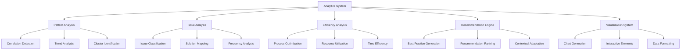

# Story 6.8: Knowledge Analysis and Insights

**Status:** Draft

## Non-Technical Explanation

This story focuses on creating tools that analyze the data in your packaging knowledge base to uncover meaningful patterns and generate insights that can help improve your packaging practices.

Think of it like business intelligence for your packaging operations. Just as analytics tools can examine sales data to identify trends, successful products, or opportunities for improvement, this knowledge analysis system will review your packaging data to find patterns, best practices, and areas for optimization.

For example, the system might discover that applications from a certain vendor consistently require specific registry keys, that a particular packaging approach reduces deployment failures by 60%, or that certain installation techniques lead to fewer support tickets. It could identify common issues with specific types of applications and automatically suggest the proven solutions that have worked in the past.

These insights help packaging teams continuously improve their processes by learning from their collective experience. Instead of relying solely on individual engineers to remember and apply past lessons, the system can systematically analyze all available data to generate actionable recommendations. This leads to more efficient packaging, fewer errors, and better standardization across the team.

The system presents these insights through clear visualizations that make the patterns easy to understand, allowing packaging engineers and team leads to make informed decisions about process improvements and standardization.

## Goal & Context

**User Story:** As a packaging engineer and team lead, I need analysis and insights from our packaging knowledge to improve our practices.

**Context:** Building on the knowledge base (Story 6.1), packaging memory system (Story 6.4), and searchable repository (Story 6.6), this story implements analytical capabilities that identify patterns and generate actionable insights from the accumulated packaging knowledge. This enables continuous improvement of packaging practices based on historical data and experience.

## Detailed Requirements

- Implement analysis of packaging patterns and trends
- Create identification of common issues and solutions
- Develop detection of efficiency opportunities
- Implement generation of best practice recommendations
- Create visualization of knowledge insights
- Document analysis methodology and interpretation

## Acceptance Criteria (ACs)

- AC1: Analysis identifies meaningful patterns in packaging data
- AC2: Common issues are associated with effective solutions
- AC3: Efficiency opportunities suggest valid improvements
- AC4: Recommendations align with industry best practices
- AC5: Visualization effectively communicates insights

## Technical Implementation Context

**Guidance:** Use the following details for implementation. Refer to the linked `docs/` files for broader context if needed.

- **Relevant Files:**

  - Files to Create:
    - `backend/apas/core/analytics/analytics_engine.py` - Core analytics engine
    - `backend/apas/core/analytics/pattern_analyzer.py` - Pattern analysis implementation
    - `backend/apas/core/analytics/issue_analyzer.py` - Issue analysis implementation
    - `backend/apas/core/analytics/efficiency_analyzer.py` - Efficiency analysis implementation
    - `backend/apas/core/analytics/recommendation_generator.py` - Recommendation generation
    - `backend/apas/services/analytics_service.py` - Analytics service
    - `backend/apas/api/endpoints/analytics.py` - Analytics API endpoints
    - `backend/apas/api/schemas/analytics.py` - Analytics API schemas
    - `frontend/src/components/analytics/InsightsDashboard.tsx` - Insights dashboard component
    - `frontend/src/components/analytics/PatternVisualization.tsx` - Pattern visualization component
    - `frontend/src/components/analytics/IssueAnalysis.tsx` - Issue analysis component
    - `frontend/src/components/analytics/EfficiencyInsights.tsx` - Efficiency insights component
    - `frontend/src/components/analytics/Recommendations.tsx` - Recommendations component
    - `frontend/src/hooks/useAnalytics.tsx` - Analytics hook
    - `frontend/src/api/analytics.ts` - Analytics API client
    - `docs/developer-guide/analytics-system.md` - Analytics documentation
  - Files to Modify:
    - `backend/apas/api/router.py` - Add analytics routes
    - `frontend/src/App.tsx` - Add analytics page route
    - `frontend/src/components/layout/Sidebar.tsx` - Add analytics link
  - _(Hint: See `docs/architecture/project-structure.md` for overall layout)_

- **Key Technologies:**

  - Pandas for data analysis
  - Scikit-learn for pattern recognition
  - D3.js for data visualization
  - React for UI components
  - FastAPI for API implementation
  - PostgreSQL for data storage
  - _(Hint: See `docs/architecture/tech-stack.md` for technology details)_

- **API Interactions / SDK Usage:**

  - Implement API endpoints for analytics:
    - `GET /api/analytics/patterns` - Get packaging patterns
    - `GET /api/analytics/issues` - Get common issues and solutions
    - `GET /api/analytics/efficiency` - Get efficiency opportunities
    - `GET /api/analytics/recommendations` - Get best practice recommendations
    - `GET /api/analytics/dashboard` - Get dashboard data
  - Support filtering by different criteria
  - Implement background analysis jobs
  - _(Hint: See `docs/architecture/api-reference.md` for API patterns)_

- **UI/UX Notes:**

  - Create clear, interactive visualizations
  - Implement intuitive filtering controls
  - Provide context and explanations for insights
  - Use appropriate chart types for different data
  - Enable drill-down for detailed analysis
  - _(Hint: See `docs/APAS_UI_UX_Specification.md` for design details)_

- **Data Structures:**

  - `AnalyticsJob` model:
    ```python
    class AnalyticsJob(Base):
        """Analytics job model."""
        __tablename__ = "analytics_jobs"
        
        id = Column(String, primary_key=True, default=lambda: str(uuid.uuid4()))
        job_type = Column(String, nullable=False)  # patterns, issues, efficiency, recommendations
        status = Column(String, nullable=False, default="pending")  # pending, processing, completed, failed
        parameters = Column(JSONB, nullable=True)  # Analysis parameters
        created_at = Column(DateTime, nullable=False, default=datetime.datetime.utcnow)
        completed_at = Column(DateTime, nullable=True)
        created_by = Column(String, nullable=True)
        last_error = Column(String, nullable=True)
        
        # Indexes
        __table_args__ = (
            Index("ix_analytics_jobs_job_type", "job_type"),
            Index("ix_analytics_jobs_status", "status"),
        )
    ```
  - `AnalyticsResult` model:
    ```python
    class AnalyticsResult(Base):
        """Analytics result model."""
        __tablename__ = "analytics_results"
        
        id = Column(String, primary_key=True, default=lambda: str(uuid.uuid4()))
        job_id = Column(String, ForeignKey("analytics_jobs.id"), nullable=False)
        result_type = Column(String, nullable=False)  # pattern, issue, efficiency, recommendation
        category = Column(String, nullable=True)  # Category within type
        title = Column(String, nullable=False)
        description = Column(Text, nullable=False)
        importance = Column(Float, nullable=False)  # 0-1 importance score
        confidence = Column(Float, nullable=False)  # 0-1 confidence score
        data = Column(JSONB, nullable=False)  # Analysis data
        visualization_data = Column(JSONB, nullable=True)  # Data for visualization
        created_at = Column(DateTime, nullable=False, default=datetime.datetime.utcnow)
        
        # Relationships
        job = relationship("AnalyticsJob")
        
        # Indexes
        __table_args__ = (
            Index("ix_analytics_results_job_id", "job_id"),
            Index("ix_analytics_results_result_type", "result_type"),
            Index("ix_analytics_results_importance", "importance"),
        )
    ```
  - `PatternAnalysisRequest` schema:
    ```python
    class PatternAnalysisRequest(BaseModel):
        """Pattern analysis request."""
        scope: Optional[str] = "all"  # all, applications, techniques, policies
        time_range: Optional[str] = "all"  # all, week, month, quarter, year
        categories: Optional[List[str]] = None
        min_confidence: Optional[float] = 0.7
        limit: Optional[int] = 10
        
        class Config:
            extra = "forbid"
    ```
  - `AnalyticsResponse` schema:
    ```python
    class AnalyticsResponse(BaseModel):
        """Analytics response."""
        results: List[Dict[str, Any]]
        total: int
        scope: str
        time_range: str
        generated_at: str
        
        class Config:
            extra = "allow"
    ```
  - _(Hint: See `docs/architecture/data-models.md` for structure details)_

- **Environment Variables:**

  - `ANALYTICS_UPDATE_INTERVAL` - Interval for background analytics updates
  - `ANALYTICS_MIN_CONFIDENCE` - Minimum confidence for including results
  - `ANALYTICS_MIN_SAMPLE_SIZE` - Minimum sample size for pattern detection
  - `ANALYTICS_MAX_RESULTS` - Maximum number of results to return
  - _(Hint: See `docs/architecture/environment-vars.md` for details)_

- **Coding Standards Notes:**
  - Implement efficient data analysis for large datasets
  - Create clear, well-documented analytics algorithms
  - Use statistical validation for identified patterns
  - Implement background processing for intensive calculations
  - Create comprehensive logging for analysis operations
  - _(Hint: See `docs/architecture/coding-standards.md` for full standards)_

## Visual Design Reference



## Tasks / Subtasks

- [ ] Implement pattern analysis engine
  - [ ] Create correlation detection
  - [ ] Implement trend analysis
  - [ ] Develop clustering algorithms
  - [ ] Add statistical validation
  - [ ] Create pattern storage
- [ ] Develop issue analysis system
  - [ ] Implement issue classification
  - [ ] Create solution mapping
  - [ ] Develop frequency analysis
  - [ ] Add impact assessment
  - [ ] Create grouping by category
- [ ] Implement efficiency analysis
  - [ ] Create process optimization analysis
  - [ ] Implement resource utilization assessment
  - [ ] Develop time efficiency analysis
  - [ ] Add comparison metrics
  - [ ] Create improvement quantification
- [ ] Develop recommendation engine
  - [ ] Implement best practice generation
  - [ ] Create recommendation ranking
  - [ ] Develop contextual adaptation
  - [ ] Add actionability assessment
  - [ ] Create implementation guidance
- [ ] Implement visualization system
  - [ ] Create chart generation
  - [ ] Implement interactive elements
  - [ ] Develop data formatting
  - [ ] Add tooltips and explanations
  - [ ] Create export capabilities
- [ ] Set up backend analytics service
  - [ ] Create analytics job management
  - [ ] Implement background processing
  - [ ] Develop result storage
  - [ ] Add scheduled analysis
  - [ ] Create incremental updates
- [ ] Implement frontend components
  - [ ] Create insights dashboard
  - [ ] Implement pattern visualization
  - [ ] Develop issue analysis view
  - [ ] Add efficiency insights component
  - [ ] Create recommendations view
- [ ] Set up API endpoints
  - [ ] Implement patterns endpoint
  - [ ] Create issues endpoint
  - [ ] Develop efficiency endpoint
  - [ ] Add recommendations endpoint
  - [ ] Create dashboard endpoint
- [ ] Implement filtering and customization
  - [ ] Create scope filtering
  - [ ] Implement time range selection
  - [ ] Develop category filtering
  - [ ] Add confidence threshold controls
  - [ ] Create result limiting
- [ ] Create documentation
  - [ ] Document analytics methodologies
  - [ ] Create interpretation guide
  - [ ] Develop implementation examples
  - [ ] Add troubleshooting guide
  - [ ] Create API documentation

## Manual Testing Guide (For Non-Technical Users)

You can verify the knowledge analysis and insights functionality through these checks:

1. **Accessing the Analytics Dashboard**:
   - Navigate to the Analytics or Insights section in the application
   - Verify that the dashboard loads with various analytics sections
   - Check that the dashboard includes patterns, issues, efficiency insights, and recommendations
   - Confirm that the data is up-to-date by checking the generated date/time

2. **Exploring Packaging Patterns**:
   - Look for a Patterns section on the dashboard
   - Review the identified patterns to ensure they make sense
   - Try filtering patterns by different criteria (scope, time range, etc.)
   - Click on a specific pattern to see more details
   - Verify that the pattern includes supporting data and visualizations

3. **Examining Common Issues and Solutions**:
   - Navigate to the Issues section
   - Check that common issues are clearly identified with their frequency
   - Verify that each issue is linked to effective solutions
   - Try sorting issues by frequency or importance
   - Select an issue to see detailed information and solution guidance

4. **Reviewing Efficiency Opportunities**:
   - Find the Efficiency Opportunities section
   - Review identified opportunities for process improvements
   - Check that each opportunity includes potential benefits or savings
   - Verify that opportunities are ranked by impact or importance
   - Try filtering opportunities by different categories

5. **Assessing Best Practice Recommendations**:
   - Navigate to the Recommendations section
   - Review the suggested best practices
   - Verify that recommendations include clear implementation guidance
   - Check that recommendations are relevant to your organization
   - Try filtering recommendations by different criteria

6. **Testing Visualization Interactivity**:
   - Interact with various charts and visualizations
   - Try hovering over data points to see tooltips with additional information
   - Test any drill-down capabilities by clicking on chart elements
   - Verify that visualizations update correctly when filters are changed
   - Try exporting visualizations if that feature is available

## Testing Requirements

**Guidance:** Verify implementation against the ACs using the following tests.

- **Unit Tests:** 
  - Test pattern detection algorithms
  - Test issue classification functions
  - Test efficiency analysis calculations
  - Test recommendation generation
  - Verify visualization data preparation

- **Integration Tests:** 
  - Test end-to-end analytics workflow
  - Test data aggregation across multiple sources
  - Test background processing for analytics
  - Verify visualization integration with data
  - Test filtering across different dimensions

- **Manual Verification:** 
  - Verify pattern relevance and meaningfulness
  - Check issue-solution pairs for accuracy
  - Test efficiency recommendations for practicality
  - Verify best practice alignment with industry standards
  - Test visualization clarity and usefulness

## Implementation Example

Here's an example implementation of the pattern analyzer:

```python
import pandas as pd
import numpy as np
from typing import List, Dict, Any, Optional, Tuple
from sklearn.cluster import DBSCAN
from sklearn.preprocessing import StandardScaler
from sqlalchemy.ext.asyncio import AsyncSession
from sqlalchemy import select, func

from apas.models.knowledge import KnowledgeEntry
from apas.models.analytics import AnalyticsJob, AnalyticsResult
from apas.core.analytics.base_analyzer import BaseAnalyzer

class PatternAnalyzer(BaseAnalyzer):
    """Pattern analyzer for identifying patterns in packaging data."""
    
    def __init__(
        self, 
        session: AsyncSession,
        min_confidence: float = 0.7,
        min_sample_size: int = 5,
        max_results: int = 100
    ):
        super().__init__(session, min_confidence, min_sample_size, max_results)
        self.analysis_type = "pattern"
    
    async def analyze_patterns(
        self, 
        scope: str = "all", 
        time_range: str = "all", 
        categories: Optional[List[str]] = None,
        job_id: Optional[str] = None
    ) -> Tuple[List[Dict[str, Any]], int]:
        """
        Analyze patterns in packaging data.
        
        Args:
            scope: Analysis scope
            time_range: Time range for analysis
            categories: Categories to include
            job_id: Analytics job ID
            
        Returns:
            Tuple of (patterns, total count)
        """
        # Get data for analysis
        df = await self._get_data_for_analysis(scope, time_range, categories)
        
        if len(df) < self.min_sample_size:
            return [], 0
        
        # Perform different types of pattern analysis
        correlation_patterns = await self._analyze_correlations(df)
        trend_patterns = await self._analyze_trends(df)
        cluster_patterns = await self._analyze_clusters(df)
        
        # Combine all patterns
        all_patterns = correlation_patterns + trend_patterns + cluster_patterns
        
        # Filter by confidence and sort by importance
        filtered_patterns = [p for p in all_patterns if p["confidence"] >= self.min_confidence]
        filtered_patterns.sort(key=lambda x: x["importance"], reverse=True)
        
        # Limit results
        limited_patterns = filtered_patterns[:self.max_results]
        
        # Store results if job_id provided
        if job_id:
            await self._store_results(job_id, limited_patterns)
        
        return limited_patterns, len(filtered_patterns)
    
    async def _get_data_for_analysis(
        self, 
        scope: str, 
        time_range: str, 
        categories: Optional[List[str]]
    ) -> pd.DataFrame:
        """Get data for analysis based on parameters."""
        # Build query based on parameters
        query = select(KnowledgeEntry).where(
            KnowledgeEntry.is_active == True
        )
        
        # Apply scope filter
        if scope != "all":
            query = query.where(KnowledgeEntry.content_type == scope)
        
        # Apply time range filter
        if time_range != "all":
            time_limit = self._get_time_limit(time_range)
            if time_limit:
                query = query.where(KnowledgeEntry.created_at >= time_limit)
        
        # Apply categories filter
        if categories:
            for category in categories:
                query = query.where(KnowledgeEntry.categories.contains([category]))
        
        # Execute query
        result = await self.session.execute(query)
        entries = result.scalars().all()
        
        # Convert to DataFrame
        data = []
        for entry in entries:
            row = {
                "id": entry.id,
                "title": entry.title,
                "content_type": entry.content_type,
                "created_at": entry.created_at,
                "categories": entry.categories,
                "tags": entry.tags
            }
            
            # Add metadata fields
            if entry.metadata:
                for key, value in entry.metadata.items():
                    if isinstance(value, (str, int, float, bool)) or value is None:
                        row[f"metadata_{key}"] = value
            
            data.append(row)
        
        return pd.DataFrame(data)
    
    async def _analyze_correlations(self, df: pd.DataFrame) -> List[Dict[str, Any]]:
        """Analyze correlations between different attributes."""
        patterns = []
        
        # Skip if too few rows
        if len(df) < self.min_sample_size:
            return patterns
        
        # Get numeric columns
        numeric_cols = df.select_dtypes(include=['number']).columns.tolist()
        
        # Skip if too few numeric columns
        if len(numeric_cols) < 2:
            return patterns
        
        # Calculate correlation matrix
        corr_matrix = df[numeric_cols].corr().abs()
        
        # Find strong correlations
        for i in range(len(numeric_cols)):
            for j in range(i+1, len(numeric_cols)):
                col1 = numeric_cols[i]
                col2 = numeric_cols[j]
                correlation = corr_matrix.iloc[i, j]
                
                # Only consider strong correlations
                if correlation >= 0.7:
                    # Calculate confidence based on sample size
                    sample_size = df[[col1, col2]].dropna().shape[0]
                    confidence = min(1.0, sample_size / (self.min_sample_size * 2))
                    
                    # Skip if confidence is too low
                    if confidence < self.min_confidence:
                        continue
                    
                    # Create pattern
                    pattern = {
                        "result_type": "pattern",
                        "category": "correlation",
                        "title": f"Strong correlation between {self._format_column_name(col1)} and {self._format_column_name(col2)}",
                        "description": f"There is a strong correlation ({correlation:.2f}) between {self._format_column_name(col1)} and {self._format_column_name(col2)}.",
                        "importance": correlation * confidence,
                        "confidence": confidence,
                        "data": {
                            "correlation": correlation,
                            "column1": col1,
                            "column2": col2,
                            "sample_size": sample_size
                        },
                        "visualization_data": {
                            "type": "scatter",
                            "x_column": col1,
                            "y_column": col2,
                            "data_points": df[[col1, col2]].dropna().to_dict('records')
                        }
                    }
                    
                    patterns.append(pattern)
        
        return patterns
    
    async def _analyze_trends(self, df: pd.DataFrame) -> List[Dict[str, Any]]:
        """Analyze trends over time."""
        patterns = []
        
        # Skip if too few rows
        if len(df) < self.min_sample_size:
            return patterns
        
        # Check if created_at column exists
        if 'created_at' not in df.columns:
            return patterns
        
        # Get numeric columns
        numeric_cols = df.select_dtypes(include=['number']).columns.tolist()
        
        # Skip if no numeric columns
        if not numeric_cols:
            return patterns
        
        # Convert created_at to datetime if not already
        if not pd.api.types.is_datetime64_any_dtype(df['created_at']):
            df['created_at'] = pd.to_datetime(df['created_at'])
        
        # Group by month and calculate means
        df['month'] = df['created_at'].dt.to_period('M')
        monthly_means = df.groupby('month')[numeric_cols].mean()
        
        # Need at least 3 months of data for trend analysis
        if len(monthly_means) < 3:
            return patterns
        
        # Calculate trends
        for col in numeric_cols:
            # Calculate slope using linear regression
            x = np.arange(len(monthly_means))
            y = monthly_means[col].values
            
            # Skip if all values are NaN
            if np.isnan(y).all():
                continue
            
            # Replace NaN with mean
            y_mean = np.nanmean(y)
            y = np.where(np.isnan(y), y_mean, y)
            
            # Calculate slope and r-value
            slope, intercept = np.polyfit(x, y, 1)
            y_pred = intercept + slope * x
            r_value = np.corrcoef(x, y)[0, 1]
            r_squared = r_value ** 2
            
            # Only consider significant trends
            if abs(r_value) >= 0.7:
                # Calculate confidence based on sample size and r-squared
                confidence = min(1.0, len(monthly_means) / 12) * min(1.0, r_squared)
                
                # Skip if confidence is too low
                if confidence < self.min_confidence:
                    continue
                
                # Determine trend direction
                if slope > 0:
                    direction = "increasing"
                else:
                    direction = "decreasing"
                
                # Create pattern
                pattern = {
                    "result_type": "pattern",
                    "category": "trend",
                    "title": f"{self._format_column_name(col)} is {direction} over time",
                    "description": f"{self._format_column_name(col)} shows a significant {direction} trend over time (r²={r_squared:.2f}).",
                    "importance": abs(r_value) * confidence,
                    "confidence": confidence,
                    "data": {
                        "column": col,
                        "slope": slope,
                        "r_squared": r_squared,
                        "direction": direction,
                        "sample_size": len(monthly_means)
                    },
                    "visualization_data": {
                        "type": "line",
                        "x_values": monthly_means.index.astype(str).tolist(),
                        "y_values": monthly_means[col].tolist(),
                        "trend_line": {
                            "intercept": intercept,
                            "slope": slope,
                            "y_values": y_pred.tolist()
                        }
                    }
                }
                
                patterns.append(pattern)
        
        return patterns
    
    async def _analyze_clusters(self, df: pd.DataFrame) -> List[Dict[str, Any]]:
        """Analyze clusters in the data."""
        patterns = []
        
        # Skip if too few rows
        if len(df) < self.min_sample_size:
            return patterns
        
        # Get numeric columns
        numeric_cols = df.select_dtypes(include=['number']).columns.tolist()
        
        # Skip if too few numeric columns
        if len(numeric_cols) < 2:
            return patterns
        
        # Prepare data for clustering
        X = df[numeric_cols].copy()
        
        # Fill NaN values with mean
        for col in X.columns:
            X[col] = X[col].fillna(X[col].mean())
        
        # Standardize features
        scaler = StandardScaler()
        X_scaled = scaler.fit_transform(X)
        
        # Apply DBSCAN clustering
        dbscan = DBSCAN(eps=0.5, min_samples=self.min_sample_size)
        clusters = dbscan.fit_predict(X_scaled)
        
        # Count points in each cluster
        cluster_counts = pd.Series(clusters).value_counts()
        
        # Analyze clusters (excluding noise points with cluster -1)
        for cluster_id, count in cluster_counts.items():
            if cluster_id == -1 or count < self.min_sample_size:
                continue
            
            # Get cluster points
            cluster_points = df[clusters == cluster_id]
            
            # Calculate confidence based on cluster size and density
            confidence = min(1.0, count / (self.min_sample_size * 2))
            
            # Skip if confidence is too low
            if confidence < self.min_confidence:
                continue
            
            # Identify key characteristics of cluster
            cluster_features = {}
            for col in numeric_cols:
                # Calculate mean and std for column
                col_mean = cluster_points[col].mean()
                col_std = cluster_points[col].std()
                
                # Calculate mean and std for overall data
                overall_mean = df[col].mean()
                overall_std = df[col].std()
                
                # Check if this feature is distinctive for the cluster
                if abs(col_mean - overall_mean) > overall_std:
                    # Feature is distinctive
                    if col_mean > overall_mean:
                        direction = "high"
                    else:
                        direction = "low"
                    
                    cluster_features[col] = {
                        "mean": col_mean,
                        "std": col_std,
                        "direction": direction,
                        "difference": abs(col_mean - overall_mean) / overall_std
                    }
            
            # Skip if no distinctive features
            if not cluster_features:
                continue
            
            # Sort features by distinctiveness
            sorted_features = sorted(
                cluster_features.items(), 
                key=lambda x: x[1]["difference"], 
                reverse=True
            )
            
            # Get top features for description
            top_features = sorted_features[:3]
            feature_descriptions = []
            for col, stats in top_features:
                feature_descriptions.append(
                    f"{self._format_column_name(col)} is {stats['direction']} ({stats['mean']:.2f} vs {df[col].mean():.2f} overall)"
                )
            
            # Create pattern
            pattern = {
                "result_type": "pattern",
                "category": "cluster",
                "title": f"Cluster of {count} items with similar characteristics",
                "description": f"Identified a distinct group of {count} items with similar characteristics: {', '.join(feature_descriptions)}.",
                "importance": confidence * (count / len(df)),
                "confidence": confidence,
                "data": {
                    "cluster_id": int(cluster_id),
                    "count": count,
                    "percentage": count / len(df) * 100,
                    "features": cluster_features,
                    "item_ids": cluster_points["id"].tolist()
                },
                "visualization_data": {
                    "type": "scatter",
                    "x_column": top_features[0][0] if len(top_features) > 0 else numeric_cols[0],
                    "y_column": top_features[1][0] if len(top_features) > 1 else numeric_cols[1],
                    "data_points": df[numeric_cols + ["id"]].to_dict('records'),
                    "cluster_points": cluster_points.index.tolist()
                }
            }
            
            patterns.append(pattern)
        
        return patterns
    
    async def _store_results(self, job_id: str, patterns: List[Dict[str, Any]]) -> None:
        """Store analysis results."""
        for pattern in patterns:
            # Create result record
            result = AnalyticsResult(
                id=str(uuid.uuid4()),
                job_id=job_id,
                result_type=pattern["result_type"],
                category=pattern["category"],
                title=pattern["title"],
                description=pattern["description"],
                importance=pattern["importance"],
                confidence=pattern["confidence"],
                data=pattern["data"],
                visualization_data=pattern.get("visualization_data"),
                created_at=datetime.datetime.utcnow()
            )
            
            self.session.add(result)
        
        await self.session.commit()
    
    def _format_column_name(self, column: str) -> str:
        """Format column name for display."""
        # Remove metadata_ prefix
        if column.startswith("metadata_"):
            column = column[9:]
        
        # Replace underscores with spaces
        column = column.replace("_", " ")
        
        # Capitalize words
        column = column.title()
        
        return column
    
    def _get_time_limit(self, time_range: str) -> Optional[datetime.datetime]:
        """Get time limit based on time range."""
        now = datetime.datetime.utcnow()
        
        if time_range == "week":
            return now - datetime.timedelta(days=7)
        elif time_range == "month":
            return now - datetime.timedelta(days=30)
        elif time_range == "quarter":
            return now - datetime.timedelta(days=90)
        elif time_range == "year":
            return now - datetime.timedelta(days=365)
        
        return None
```

## Story Wrap Up (Agent Populates After Execution)

- **Agent Model Used:** `claude-3.7-sonnet-20250219`
- **Completion Notes:** 
- **Change Log:**
  - Initial Draft
