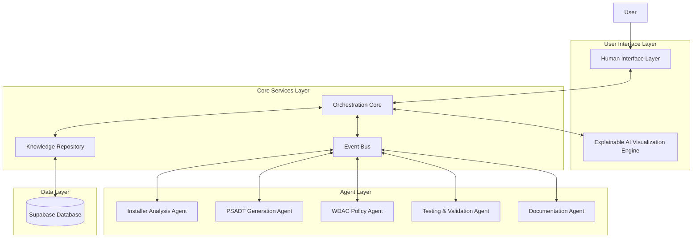
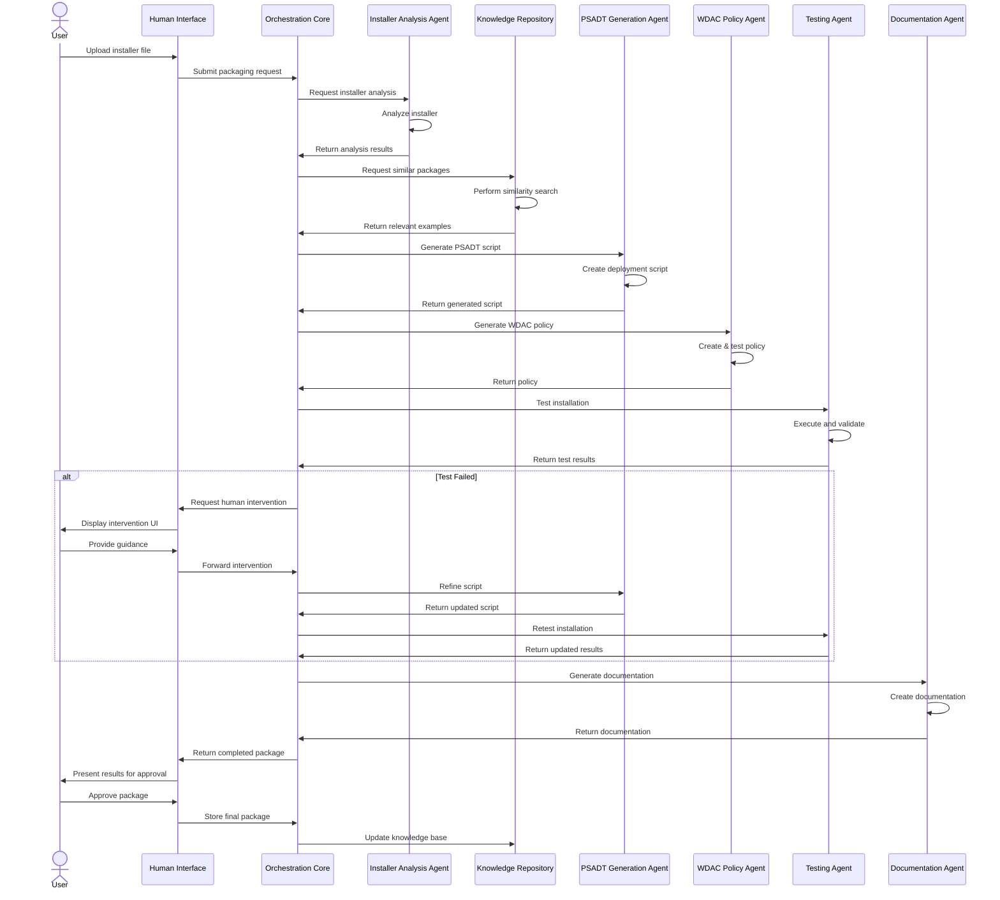
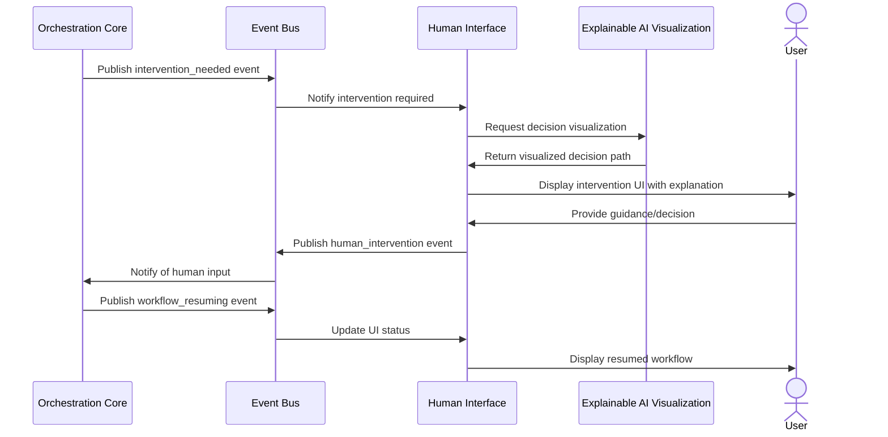

# Application Packaging Automation System (APAS) Architecture Document

## Technical Summary

The Application Packaging Automation System (APAS) is designed as a collaborative multi-agent AI architecture that automates the packaging, security policy creation, and deployment preparation of enterprise applications. The system employs specialized AI agents coordinated through an event-driven architecture to analyze application installers, generate PowerShell AppDeploy Toolkit scripts, create Windows Defender Application Control policies, and provide comprehensive packaging documentation. APAS integrates explainable AI visualization to provide transparency into agent decision-making, enabling effective human oversight and intervention. The architecture is optimized for a single-machine deployment while maintaining a modular, extensible design that can scale to future cloud integration.

## High-Level Overview

APAS follows a **Modular Microkernel Architecture** with a collaborative multi-agent system coordinated through an **Event-Driven Communication Layer**. This approach enables specialized agents to focus on specific tasks while maintaining system resilience and flexibility. The system runs entirely on a single machine with a local web application interface, communicating with specialized AI components through a well-defined event bus.

## Component View

The APAS system consists of the following major components, each with specific responsibilities:

```mermaid
graph TD
    A[Human Interface Layer] --> B[Dashboard]
    A --> C[Explainable AI Visualization]
    A --> D[Intervention Controls]
    
    E[Multi-Agent Orchestration Core] --> F[Workflow Manager]
    E --> G[Agent Registry]
    E --> H[State Manager]
    E --> I[Conflict Resolver]
    
    J[Event Bus] --> K[Topic Management]
    J --> L[Message Routing]
    J --> M[Event Store]
    
    N[Installer Analysis Agent] --> O[File Type Detection]
    N --> P[Metadata Extraction]
    N --> Q[Command Analysis]
    
    R[PSADT Generation Agent] --> S[Script Generator]
    R --> T[Parameter Configuration]
    R --> U[Testing Integration]
    
    V[WDAC Policy Agent] --> W[Policy Generation]
    V --> X[Code Signing Analysis]
    V --> Y[Policy Testing]
    
    Z[Knowledge Repository] --> AA[Vector Store]
    Z --> AB[RAG Engine]
    Z --> AC[Pattern Recognition]
```

- **Human Interface Layer**: Provides the web-based dashboard for system interaction, displays explainable AI visualizations, and offers intervention controls for human oversight.

- **Multi-Agent Orchestration Core**: Coordinates activities between specialized agents, manages workflow execution, handles state persistence, and resolves conflicts when agents have competing recommendations.

- **Event Bus / Communication Layer**: Enables asynchronous communication between system components through a publish-subscribe pattern, maintains event history, and supports process tracing for visualization.

- **Installer Analysis Agent**: Analyzes application installers to determine file type, extract metadata, identify installation commands, and determine system requirements.

- **PSADT Generation Agent**: Creates PowerShell AppDeploy Toolkit scripts with appropriate parameters, pre/post-installation commands, and custom scripting for complex installations.

- **WDAC Policy Agent**: Generates Windows Defender Application Control policies, analyzes code signing certificates, and tests policies in audit and enforcement modes.

- **Testing & Validation Agent**: Tests packaged applications on the local system, analyzes results, and provides feedback for refinement.

- **Documentation Agent**: Generates comprehensive documentation for packaged applications, capturing decisions, configurations, and troubleshooting guidance.

- **Knowledge Repository**: Stores and retrieves packaging patterns, historical data, and reference information using vector embeddings for similarity search.

## Key Architectural Decisions & Patterns

- **Modular Microkernel Architecture**: The system is built around a lean core with specialized agents as loadable modules, enabling component isolation, parallel operation, and selective updating. This pattern supports the diverse specialized tasks required for application packaging while maintaining system resilience.
  - **Justification**: This approach enables true specialization of AI components, isolation of failures, potential parallel operation, and easier maintenance/extension.

- **Event-Driven Communication**: All system components communicate through a central event bus using a publish-subscribe pattern, enabling loose coupling, workflow flexibility, and observability.
  - **Justification**: Asynchronous communication promotes decoupling, supports complex workflows, and provides natural event trails for explainability.

- **Hybrid Database Approach (Supabase)**: APAS uses Supabase as a unified data platform that provides PostgreSQL database capabilities, native vector operations (via pgvector), storage services, and real-time subscriptions.
  - **Justification**: Supabase simplifies the data layer by combining relational database, vector storage, and file storage in a single platform that can run locally during development and potentially migrate to the cloud later.

- **Mediator Pattern (in Orchestration Core)**: The orchestration core acts as a mediator between agents, coordinating complex workflows and resolving conflicts.
  - **Justification**: Centralizes coordination logic and decision making when different AI agents have competing recommendations.

- **Retrieval Augmented Generation (RAG)**: The knowledge repository uses vector embeddings to find similar packaging approaches, enhancing AI-generated solutions with relevant historical examples.
  - **Justification**: Improves decision quality by incorporating previous successful packaging patterns.

- **Component-Based UI Architecture**: The interface uses reusable visualization components that can represent different types of AI decisions and explanations.
  - **Justification**: Provides a consistent visual language for explainable AI while promoting code reuse.

- **Hybrid Model Deployment**: Combines local quantized models for real-time interactions with optional cloud API calls for complex reasoning tasks.
  - **Justification**: Balances performance and resource constraints with quality requirements.

## Core Workflow / Sequence Diagrams

### Application Packaging Workflow

### Human Intervention Flow

## Infrastructure and Deployment Overview

- **Execution Environment**: Single machine (Windows 10/11 Pro/Enterprise)
- **Core Services Used**: 
  - FastAPI (API framework)
  - Supabase (Database, vector store, file storage)
  - Python AI frameworks (LangChain, Transformers)
  - React (Frontend framework)
- **Infrastructure as Code (IaC)**: Not used in initial deployment (single machine constraint)
- **Deployment Strategy**: Standard desktop application installation
  - Local development server for UI 
  - FastAPI backend service
  - Local Supabase instance during development
  - Deployment script for consistent installation
- **Environments**: 
  - Development: Local developer environments
  - Testing: Testing environment for validation
  - Production: End-user machines

## Key Reference Documents

- [PRD](../APAS_PRD.md) - Product Requirements Document
- [Tech Stack](tech-stack.md) - Technology Stack Specification
- [Project Structure](project-structure.md) - Project Structure Documentation
- [Coding Standards](coding-standards.md) - Coding Standards and Patterns
- [Data Models](data-models.md) - Data Models Documentation
- [Environment Variables](environment-vars.md) - Environment Variables Documentation
- [Testing Strategy](testing-strategy.md) - Testing Strategy Documentation
- [API Reference](api-reference.md) - API Reference Documentation
- [UI/UX Specification](../APAS_UI_UX_Specification.md) - UI/UX Design Specification

## Change Log

| Change        | Date       | Version | Description                  | Author         |
| ------------- | ---------- | ------- | ---------------------------- | -------------- |
| Initial draft | 2025-05-08 | 0.1     | Initial architecture based on PRD | Architect Agent |
