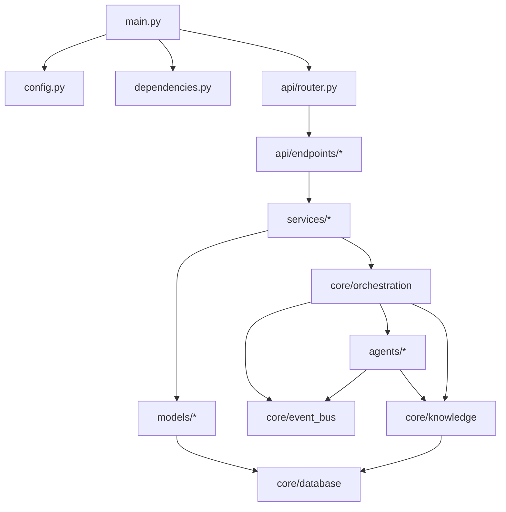
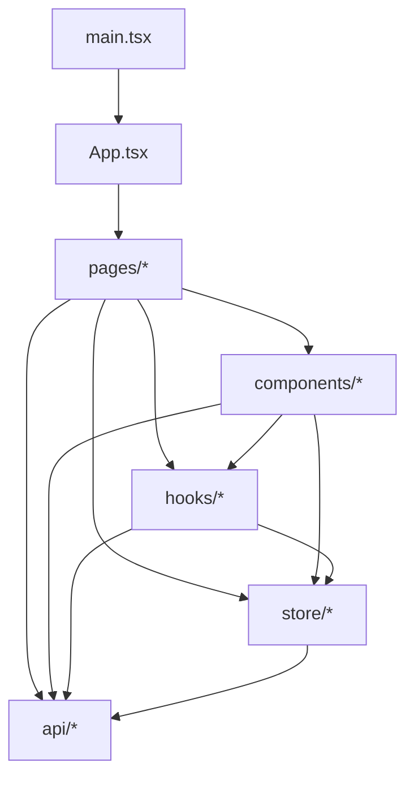

# Application Packaging Automation System (APAS) Project Structure

## Directory Structure

```plaintext
apas/
├── .github/                    # CI/CD workflows (minimal for initial version)
│   └── workflows/
│       └── lint.yml            # Basic linting workflow
├── docs/                       # Project documentation
│   ├── architecture/           # Architecture documents
│   │   ├── architecture.md     # Master architecture document
│   │   ├── tech-stack.md       # Technology stack specification
│   │   ├── project-structure.md # This document
│   │   ├── coding-standards.md # Coding standards and patterns
│   │   ├── data-models.md      # Data models documentation
│   │   ├── environment-vars.md # Environment variables documentation
│   │   ├── testing-strategy.md # Testing strategy documentation
│   │   └── api-reference.md    # API reference documentation
│   ├── epics/                  # Epic documentation
│   │   ├── epic1.md            # Core Infrastructure
│   │   ├── epic2.md            # Installer Analysis Engine
│   │   ├── epic3.md            # PowerShell AppDeploy Toolkit
│   │   ├── epic4.md            # WDAC Policy Generation
│   │   ├── epic5.md            # Human Oversight Interface
│   │   └── epic6.md            # Knowledge Base Integration
│   ├── user_stories/           # Detailed user story documentation
│   ├── APAS_PRD.md             # Product Requirements Document
│   ├── APAS_UI_UX_Specification.md # UI/UX Specification
│   └── index.md                # Documentation index
├── backend/                    # Backend Python code
│   ├── pyproject.toml          # Python dependencies and metadata
│   ├── poetry.lock             # Locked dependencies
│   ├── .env.example            # Example environment variables
│   ├── alembic/                # Database migrations
│   │   ├── versions/           # Migration versions
│   │   └── env.py              # Alembic environment
│   ├── apas/                   # Main package
│   │   ├── __init__.py         # Package initialization
│   │   ├── main.py             # FastAPI application entry point
│   │   ├── config.py           # Configuration management
│   │   ├── dependencies.py     # FastAPI dependencies
│   │   ├── core/               # Core components
│   │   │   ├── __init__.py     # Package initialization
│   │   │   ├── orchestration/  # Multi-agent orchestration
│   │   │   ├── event_bus/      # Event communication layer
│   │   │   ├── database/       # Database integration
│   │   │   └── knowledge/      # Knowledge repository
│   │   ├── agents/             # Specialized AI agents
│   │   │   ├── __init__.py     # Package initialization
│   │   │   ├── base.py         # Base agent class
│   │   │   ├── installer/      # Installer analysis agent
│   │   │   ├── psadt/          # PSADT generation agent
│   │   │   ├── wdac/           # WDAC policy agent
│   │   │   ├── testing/        # Testing agent
│   │   │   └── documentation/  # Documentation agent
│   │   ├── api/                # API routes
│   │   │   ├── __init__.py     # Package initialization
│   │   │   ├── router.py       # API router
│   │   │   ├── endpoints/      # API endpoints by feature
│   │   │   ├── schemas/        # Pydantic schemas
│   │   │   └── dependencies/   # Endpoint dependencies
│   │   ├── models/             # Database models
│   │   │   ├── __init__.py     # Package initialization
│   │   │   ├── package.py      # Package model
│   │   │   ├── installer.py    # Installer model
│   │   │   ├── policy.py       # WDAC policy model
│   │   │   └── user.py         # User model
│   │   ├── services/           # Service layer
│   │   │   ├── __init__.py     # Package initialization
│   │   │   ├── package.py      # Package service
│   │   │   ├── installer.py    # Installer service
│   │   │   ├── policy.py       # WDAC policy service
│   │   │   └── user.py         # User service
│   │   └── utils/              # Utility functions
│   │       ├── __init__.py     # Package initialization
│   │       ├── logging.py      # Logging utilities
│   │       ├── powershell.py   # PowerShell integration
│   │       └── security.py     # Security utilities
│   └── tests/                  # Tests
│       ├── __init__.py         # Package initialization
│       ├── conftest.py         # Test fixtures
│       ├── unit/               # Unit tests
│       ├── integration/        # Integration tests
│       └── e2e/                # End-to-end tests
├── frontend/                   # Frontend React code
│   ├── package.json            # Node.js dependencies and scripts
│   ├── package-lock.json       # Locked dependencies
│   ├── tsconfig.json           # TypeScript configuration
│   ├── .env.example            # Example environment variables
│   ├── public/                 # Static public assets
│   │   ├── favicon.ico         # Favicon
│   │   └── index.html          # HTML entry point
│   ├── src/                    # Source code
│   │   ├── App.tsx             # Root component
│   │   ├── main.tsx            # Entry point
│   │   ├── vite-env.d.ts       # Vite environment types
│   │   ├── assets/             # Static assets
│   │   ├── components/         # Reusable UI components
│   │   │   ├── common/         # Common components
│   │   │   ├── dashboard/      # Dashboard components
│   │   │   ├── visualization/  # Explainable AI visualization
│   │   │   ├── forms/          # Form components
│   │   │   └── layout/         # Layout components
│   │   ├── hooks/              # Custom React hooks
│   │   ├── pages/              # Page components
│   │   │   ├── dashboard/      # Dashboard pages
│   │   │   ├── packages/       # Package management pages
│   │   │   ├── installer/      # Installer analysis pages
│   │   │   ├── psadt/          # PSADT generation pages
│   │   │   ├── wdac/           # WDAC policy pages
│   │   │   └── knowledge/      # Knowledge base pages
│   │   ├── store/              # State management
│   │   ├── api/                # API client code
│   │   ├── utils/              # Utility functions
│   │   └── types/              # TypeScript type definitions
│   └── tests/                  # Tests
│       ├── unit/               # Unit tests
│       ├── integration/        # Integration tests
│       └── e2e/                # End-to-end tests
├── scripts/                    # Utility scripts
│   ├── setup_dev.ps1           # Setup development environment
│   ├── setup_supabase.ps1      # Setup local Supabase
│   └── generate_docs.ps1       # Generate documentation
├── supabase/                   # Supabase configuration
│   ├── migrations/             # Database migrations
│   ├── seed.sql                # Seed data
│   └── functions/              # Edge functions
├── data/                       # Data directory
│   ├── templates/              # PSADT templates
│   ├── examples/               # Example packages
│   └── test_installers/        # Test installer files
├── .env.example                # Example environment variables
├── .gitignore                  # Git ignore configuration
├── README.md                   # Project overview
└── LICENSE                     # Project license
```

## Key Directory Descriptions

### Backend Structure

- **`backend/`**: Contains all backend Python code.
  - **`apas/`**: Main package containing the application code.
    - **`core/`**: Core components that form the foundation of the system.
      - **`orchestration/`**: Multi-agent orchestration system using the Mediator pattern.
      - **`event_bus/`**: Event-driven communication layer for agent interaction.
      - **`database/`**: Database integration and operations.
      - **`knowledge/`**: Knowledge repository for RAG and packaging patterns.
    - **`agents/`**: Specialized AI agents for different tasks.
      - **`installer/`**: Agent for analyzing installer files.
      - **`psadt/`**: Agent for generating PSADT scripts.
      - **`wdac/`**: Agent for creating WDAC policies.
      - **`testing/`**: Agent for testing packages.
      - **`documentation/`**: Agent for generating documentation.
    - **`api/`**: API routes and schemas.
    - **`models/`**: Database models using SQLAlchemy and Pydantic.
    - **`services/`**: Business logic layer.
    - **`utils/`**: Utility functions and helpers.
  - **`tests/`**: Test directory organized by test type.

### Frontend Structure

- **`frontend/`**: Contains all frontend React code.
  - **`src/`**: Source code directory.
    - **`components/`**: Reusable UI components.
      - **`common/`**: Common UI components.
      - **`dashboard/`**: Dashboard-specific components.
      - **`visualization/`**: Explainable AI visualization components.
      - **`forms/`**: Form components for user input.
      - **`layout/`**: Layout components like headers, footers, etc.
    - **`pages/`**: Page components that represent full pages.
    - **`hooks/`**: Custom React hooks for shared logic.
    - **`store/`**: State management using Zustand.
    - **`api/`**: API client code using React Query.
    - **`utils/`**: Utility functions.
    - **`types/`**: TypeScript type definitions.
  - **`tests/`**: Test directory organized by test type.

## Module Boundaries and Dependencies

### Core Backend Dependencies



### Core Frontend Dependencies



## Development Workflow

1. **Local Development**:
   - Backend and frontend servers run locally
   - Local Supabase instance for development
   - Changes are tested locally before commit

2. **Testing**:
   - Unit tests run automatically on commit
   - Integration tests run as needed
   - End-to-end tests run before merging

3. **Deployment**:
   - Build frontend assets
   - Package backend with dependencies
   - Create installer for target machines

## Notes on AI Agent Implementation

For AI agent development, we follow these structural principles:

1. **Agent Interface Standardization**: All agents implement a common interface defined in `agents/base.py`
2. **Context Management**: Each agent maintains its own context state in memory
3. **Event-Driven Communication**: Agents communicate exclusively via the event bus
4. **Model Management**: Models are loaded/unloaded dynamically to manage memory usage
5. **Fallback Mechanisms**: Local processing with fallback to cloud APIs when needed

Each agent directory contains:
- Agent implementation
- Domain-specific utilities
- Model configuration
- Prompt templates
- Testing modules

## Change Log

| Change        | Date       | Version | Description                    | Author         |
| ------------- | ---------- | ------- | ------------------------------ | -------------- |
| Initial draft | 2025-05-08 | 0.1     | Initial project structure      | Architect Agent |
